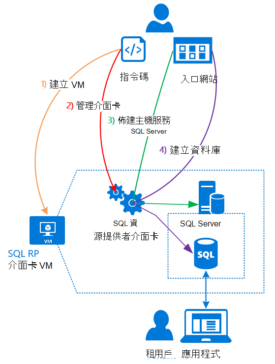

<properties
    pageTitle="使用 SQL 資料庫 Azure 堆疊上 |Microsoft Azure"
    description="瞭解如何將 SQL 資料庫部署為 Azure 堆疊及快速步驟部署的 SQL Server 資源提供者介面卡的服務。"
    services="azure-stack"
    documentationCenter=""
    authors="Dumagar"
    manager="byronr"
    editor=""/>

<tags
    ms.service="multiple"
    ms.workload="na"
    ms.tgt_pltfrm="na"
    ms.devlang="na"
    ms.topic="article"
    ms.date="09/26/2016"
    ms.author="dumagar"/>

# 使用上堆疊 Azure SQL 資料庫

> [AZURE.NOTE] Azure 堆疊 TP1 部署僅適用於下列資訊。

使用 SQL Server 資源提供者介面卡以 Azure 堆疊的服務的方式公開 SQL 資料庫。 安裝資源提供者之後，您和您的使用者可以建立雲端原生應用程式、 SQL，為基礎的網站和負載而不需要佈建虛擬機器 (VM) 根據 SQL 資料庫裝載 SQL Server 每次。

資源提供者的概念 (PoC) 證明期間沒有 Azure SQL 資料庫的所有功能，因為這份文件的開頭資源提供者架構的概觀。 然後，您會收到的步驟，為資源提供者的連結中[部署上 Azure 堆疊 POC 的 SQL 資料庫資源提供者介面卡](azure-stack-sql-rp-deploy-long.md)的詳細步驟，設定的快速概觀。

## SQL Server 資源提供者介面卡架構
資源提供者不提供所有資料庫管理功能，Azure SQL 資料庫。 例如，彈性的資料庫資料庫及即時向上和向下撥資料庫效能的功能無法使用。 不過，相同的建立、 讀取、 更新和刪除 (CRUD) 作業 Azure SQL 資料庫中的可用，支援資源提供者。

資源提供者是由三個元件所組成︰

- 從**SQL 資源提供者介面卡 VM**包含資源提供者程序和裝載 SQL Server 的伺服器。
- **資源提供者本身**，會處理佈建要求並公開資料庫資源。
- **伺服器所裝載 SQL Server**，它提供資料庫的容量。

下列的概念性圖表會顯示這些元件，當您部署資源提供者設定伺服器主控 SQL Server，然後建立資料庫時，您瀏覽的步驟。

## 快速步驟來部署資源提供者
如果您已經熟悉 Azure 堆疊，請使用這些步驟。 如果您想要更多詳細資料，請遵循每個區段中的連結，或直接前往[部署上 Azure 堆疊 POC 的 SQL 資料庫資源提供者介面卡](azure-stack-sql-rp-deploy-long.md)。

1.  請確定您完成所有[步驟部署前所設定](azure-stack-sql-rp-deploy-long.md#set-up-steps-before-you-deploy)的資源提供者︰

  - .NET 3.5 framework 已設定基底的 Windows Server 圖像。 （如果您下載 Azure 堆疊位 2016 年 2 月 23，您可以略過此步驟。）
  - [已安裝與 Azure 堆疊相容 PowerShell 的 Azure 版本](http://aka.ms/azStackPsh)。
  - 在 Internet Explorer ClientVM，[加強的安全性已關閉的 Internet Explorer 和 cookie 已啟用](azure-stack-sql-rp-deploy-long.md#Turn-off-IE-enhanced-security-and-enable-cookies)的安全性設定。

2. [下載 SQL Server 資源點數二進位檔案](http://aka.ms/massqlrprfrsh)，然後將它解壓縮以在您 Azure 堆疊 POC ClientVM。

3. [執行 bootstrap.cmd 和指令碼](azure-stack-sql-rp-deploy-long.md#Bootstrap-the-resource-provider-deployment-PowerShell-and-Prepare-for-deployment)。

    指令碼的一組資料分為兩個主要的搜尋索引標籤中 PowerShell 整合式指令碼環境 （ise [以系統） 開啟。 序列中執行所有載入指令碼從左到右中每個索引標籤。

    1. 在 [**準備**] 索引標籤從左到右，若要執行的指令碼︰

        - 建立萬用字元憑證的安全性資源提供者和 Azure 資源管理員之間的通訊。
        - 上傳憑證和其他成品儲存帳戶的 Azure 堆疊。
        - 發佈庫封包，好讓您可以部署 SQL 及透過庫的資源。

        > [AZURE.IMPORTANT] 如果有任何指令碼的程式沒有什麼理由提交您的 Azure Active Directory 租用戶後，您的安全性設定可能會封鎖 DLL 所需執行的部署。 若要解決此問題，尋找 Microsoft.AzureStack.Deployment.Telemetry.Dll 資料夾中的資源提供者，以滑鼠右鍵按一下、 [**屬性**]，然後檢查 [**一般**] 索引標籤中的 [**解除封鎖**。

    1. 在 [**部署**] 索引標籤從左到右，若要執行的指令碼︰

        - [部署 VM](azure-stack-sql-rp-deploy-long.md#Deploy-the-SQL-Server-Resource-Provider-VM)裝載您資源提供者 」 和 「 SQL Server。 這個指令碼參照 JSON 參數檔案，您需要更新與一些值，才能執行指令碼。
        - [註冊本機 DNS 記錄](azure-stack-sql-rp-deploy-long.md#Update-the-local-DNS)，對應到您的資源提供者 VM。
        - [註冊您的資源提供者](azure-stack-sql-rp-deploy-long.md#Register-the-SQL-RP-Resource-Provider)使用本機 Azure 資源管理員。

        > [AZURE.IMPORTANT] 所有指令碼假設基本作業系統圖像符合先決條件 (.NET 3.5 安裝，JavaScript 及 ClientVM 和安裝 PowerShell 的 Azure 相容版本上啟用 cookie)。 如果您收到錯誤，當您執行指令碼時，請再次檢查您符合的先決條件。

6. Azure 堆疊入口網站中[連線至伺服器的裝載 SQL Server 的資源提供者](#Provide-capacity-to-your-SQL-Resource-Provider-by-connecting-it-to-a-hosting-SQL-server)。 按一下 [**瀏覽** &gt; **資源提供者** &gt; **SQLRP** &gt; **移至 [資源提供者管理** &gt; **伺服器** &gt; **新增**。

    使用 「 索 「 使用者名稱和部署資源提供者 VM 時所使用的密碼。

7. 若要[測試新的 SQL Server 資源提供者](/azure-stack-sql-rp-deploy-long.md#create-your-first-sql-database-to-test-your-deployment)，部署 Azure 堆疊入口網站中的 SQL 資料庫。 按一下 [**建立** &gt; **自訂** &gt; **SQL Server 資料庫**。

此應收到您 SQL Server 資源提供者，並執行關於 45 分鐘 （根據您的硬體）。
