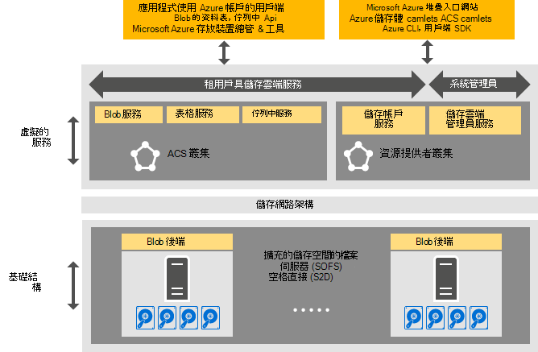

<properties
    pageTitle="Azure 一致的儲存空間簡介 |Microsoft Azure"
    description="深入了解 Azure 一致的儲存空間"
    services="azure-stack"
    documentationCenter=""
    authors="AniAnirudh"
    manager="darmour"
    editor=""/>

<tags
    ms.service="azure-stack"
    ms.workload="na"
    ms.tgt_pltfrm="na"
    ms.devlang="na"
    ms.topic="get-started-article"
    ms.date="09/26/2016"
    ms.author="anirudha"/>

# Azure 一致的儲存空間的簡介
Azure 一致的儲存空間是儲存在 Microsoft Azure 堆疊的雲端服務的設定。 Azure 一致的儲存空間提供 blob、 表格、 佇列中，以及 Azure 一致的語意與帳戶管理功能。 同時也會提供可協助管理儲存空間服務的雲端管理員的功能。 本文內容介紹 Azure 一致的儲存空間，並將告訴您如何儲存雲端服務 Azure 堆疊的精美互補豐富的[Windows Server 2016 中的軟體定義儲存功能](https://blogs.technet.microsoft.com/windowsserver/2016/04/14/ten-reasons-youll-love-windows-server-2016-5-software-defined-storage/)。

Azure 一致的儲存空間的形式提供下列主要類別的功能︰

- **二進位大型物件**︰ 頁面 blob 與封鎖 blob，附加二進位大型物件的  [一致 Azure blob](https://msdn.microsoft.com/library/azure/dd179355.aspx#Anchor_1) 
  行為

- **表格**︰ 實體、 分割和  [Azure 一致的資料表](https://msdn.microsoft.com/library/azure/dd179355.aspx#Anchor_3)與其他資料表屬性
  行為

- **佇列**︰ 可靠常設的郵件和  [Azure 一致的佇列中](https://msdn.microsoft.com/library/azure/dd179355.aspx#Anchor_2)佇列
  行為

- **帳戶**︰ 使用  [Azure 一致的帳戶](https://azure.microsoft.com/documentation/articles/storage-create-storage-account/)儲存帳戶資源管理
  用途的儲存空間帳戶佈建後，透過[Azure 資源管理員部署模型](https://azure.microsoft.com/documentation/articles/resource-manager-deployment-model/)的行為

- **管理**︰ 管理的租用戶具和 Azure 一致的儲存空間內部儲存空間服務 （討論其他文件）

## Azure 一致的儲存空間架構

圖 1。 Azure 一致的儲存空間︰ 解決方案檢視

## Azure 一致的儲存空間虛擬化服務及叢集

Azure 一致的儲存空間架構，是虛擬化所有租用戶或系統管理員可以存取的儲存空間服務。 就是中執行的服務提供者管理、 高度可用 Vm 根據[HYPER-V](https://technet.microsoft.com/library/dn765471.aspx) [Windows Server 2016](http://www.microsoft.com/server-cloud/products/windows-server-2016/)中的功能。
雖然 Vm 高度使用[Windows Server 容錯](https://technet.microsoft.com/library/dn765474.aspx)技術為基礎，則 Azure 一致的虛擬化的儲存空間服務本身就是[Azure 服務布料的轉印圖樣技術](http://azure.microsoft.com/campaigns/service-fabric/)為基礎的來賓直、 高度可用服務。

Azure 一致的儲存空間採用 Azure 堆疊部署中的兩個服務布料的轉印圖樣叢集。
在服務布料的轉印圖樣叢集 （「 資源點數叢集 」），也會共用其他基礎資源提供者服務部署儲存資源提供者服務。 儲存空間的其餘部分虛擬化資料路徑服務，包括 Blob、 表格和佇列中服務-裝載在第二個服務布料的轉印圖樣叢集 （「 Azure 一致儲存叢集 」）。

## Blob 服務和軟體定義的儲存空間

另一方面，返回服務結束 Blob 直接執行[擴充檔案伺服器](https://technet.microsoft.com/library/hh831349.aspx)叢集節點。 在 Azure 堆疊的解決方案架構，延展檔案伺服器為基礎[直接儲存空間](https://technet.microsoft.com/library/mt126109.aspx)-根據、 無共用容錯移轉叢集。 圖 1 描繪主要 Azure 一致的儲存空間元件服務和其分散式的部署模型。 如同您在圖表中，Azure 一致的儲存空間 dovetails 與 Windows Server 2016 中的現有軟體定義儲存功能。 沒有任何特殊的硬體時需要 Azure 一致的儲存空間限制，超出這些 Windows Server 的平台需求。

## 儲存伺服器陣列

儲存伺服器陣列是儲存基礎結構、 資源及一起提供租用戶具和系統管理員具 Azure 一致儲存服務 Azure 堆疊部署中的後端服務的集合。 具體來說，儲存伺服器陣列包括下列︰

- 儲存硬體 （例如，延展檔案伺服器節點，磁碟）

- 儲存布料的轉印圖樣資源 （例如，SMB 共用）

- 儲存相關服務布料的轉印圖樣服務 （例如，Blob 端點服務 Azure 一致的儲存空間叢集關閉）

- 執行的擴充檔案伺服器節點 （例如，Blob 服務） 的儲存空間相關服務

## IaaS 和 PaaS 的儲存空間使用狀況分析藍本

Azure 一致的儲存空間頁面二進位大型物件，如 Azure 提供中所有的基礎結構的虛擬磁碟的服務 (IaaS) 使用狀況分析藍本︰

- 建立 VM 頁面 blob 中使用自訂的 OS 磁碟

- 建立 VM 頁面 blob 中使用自訂的 OS 圖像

- 建立新的頁面 blob 中使用 Azure Marketplace 圖像的 VM

- 使用新的頁面 blob 空白的磁碟來建立 VM

同樣地，為服務 (PaaS) 案例的平台，Azure 一致的儲存空間區塊二進位大型物件，新增 blob，佇列和資料表運作方式 Azure 中。

## 使用者角色

Azure 一致的儲存空間是寶貴的兩個使用者角色︰

- 應用程式擁有者，包括開發人員與企業的 IT。 他們不再擁有維護或部署的應用程式和指令碼完成相同工作公用的雲端以及私人裝載雲端中的資料中心的兩個版本。 Azure 一致的儲存空間提供透過 REST API、 SDK、 cmdlet 和 Azure 堆疊入口網站的儲存空間服務。

- 服務提供者，包括企業 IT、 部署及管理 Microsoft Azure 堆疊式、 multitenant 儲存雲端服務。

## 後續步驟

- [Azure 一致的儲存空間︰ 差異和考量](azure-堆疊-acs-差異-tp2.md)
