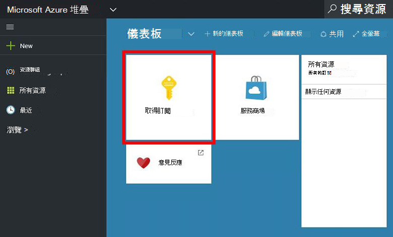
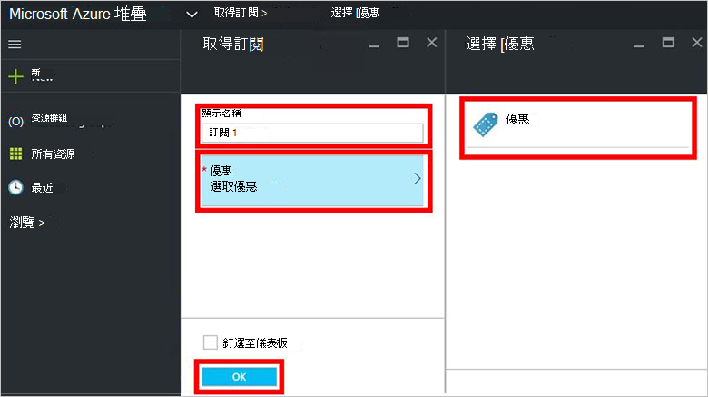
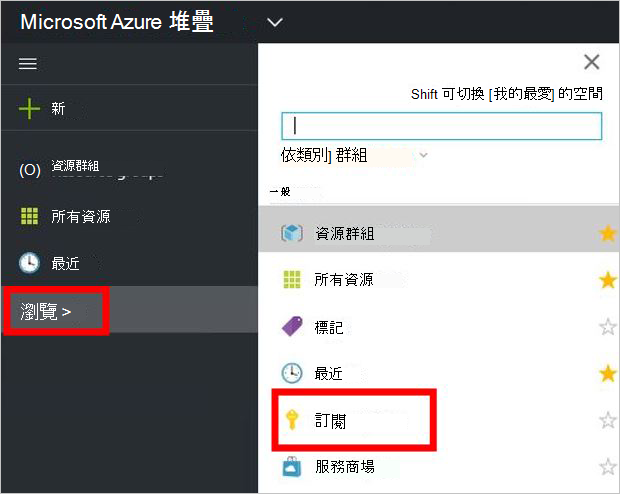

<properties
    pageTitle="訂閱優惠，然後佈建 Azure 堆疊 （租用戶） 的 VM |Microsoft Azure"
    description="為租用戶，瞭解如何訂閱優惠，然後佈建 VM Azure 堆疊中。"
    services="azure-stack"
    documentationCenter=""
    authors="ErikjeMS"
    manager="byronr"
    editor=""/>

<tags
    ms.service="azure-stack"
    ms.workload="na"
    ms.tgt_pltfrm="na"
    ms.devlang="na"
    ms.topic="get-started-article"
    ms.date="09/26/2016"
    ms.author="erikje"/>

# 訂閱優惠

現在您已[建立提議](azure-stack-create-offer.md)，測試您的租用戶，可以建立訂閱。

1.  Azure 堆疊 POC 電腦上，登入`https://portal.azurestack.local`為[租用戶](azure-stack-connect-azure-stack.md#log-in-as-a-tenant)，按一下 [**取得訂閱**。

    

2.  在 [**顯示名稱**] 欄位中，輸入您的訂閱的名稱、 按一下**提供**，按一下中**選擇提議**防禦，以提供的其中一個，然後按一下 [**建立**。

    

4.  若要檢視您所建立的訂閱，請按一下 [**瀏覽**，按一下 [**訂閱**]，然後按一下您的新訂閱。  

    

您訂閱優惠之後，請重新整理入口網站，請參閱哪些服務是新的訂閱的一部分。

## 後續步驟

[佈建虛擬機器](azure-stack-provision-vm.md)
