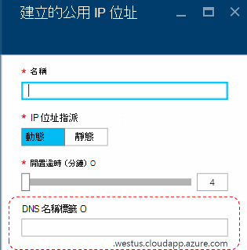
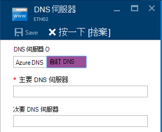
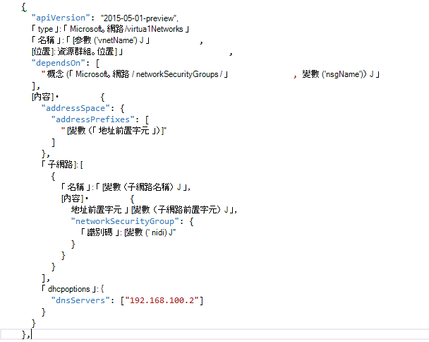

<properties
    pageTitle="瞭解 DNS 中 Azure 堆疊 TP2 |Microsoft Azure"
    description="瞭解 DNS 的新功能和 Azure 堆疊 TP2 功能"
    services="azure-stack"
    documentationCenter=""
    authors="ScottNapolitan"
    manager="darmour"
    editor=""/>

<tags
    ms.service="azure-stack"
    ms.workload="na"
    ms.tgt_pltfrm="na"
    ms.devlang="na"
    ms.topic="get-started-article"
    ms.date="09/26/2016"
    ms.author="scottnap"/>

# Azure 堆疊介紹 Idn
================================

Idn 是的可讓您 （例如 http://www.bing.com) 的外部 DNS 名稱解析 Azure 堆疊技術預覽 2 中的新功能。
您也可以登錄內部虛擬網路名稱。 如此一來，您可以解決 Vm 相同的虛擬網路上的名稱，而不是 IP 位址，而不需要提供自訂 DNS 伺服器項目。

它會永遠已有 Azure 中的項目，但現在太適用於 Windows Server 2016 和 Azure 堆疊。

Idn 做什麼？
------------------

使用 Idn Azure 堆疊中，您會收到下列功能，而不需要指定自訂的 DNS 伺服器項目。

-   共用租用戶負載 DNS 名稱解析服務。

-   授權名稱解析和 DNS 登錄租用戶虛擬網路中的 DNS 服務。

-   網際網路名稱的租用戶 Vm 解析遞迴 DNS 服務。 若要指定自訂 DNS 項目，以解決網際網路名稱 (例如，www.bing.com) 不再需要的租用戶。

您仍可以顯示您自己的 DNS，，如果您要使用自訂的 DNS 伺服器。 但現在，如果您只想要解決網際網路 DNS 名稱無法連線至相同的虛擬網路中其他虛擬機器、 您不需要任何項目指定和只運作方式。

「 Idn 不做什麼？
---------------------

哪些 Idn 不允許您執行時建立 DNS 記錄，可以從外部虛擬網路解析的名稱。

Azure 中您可以選擇指定可使用的公用 IP 位址相關聯的 DNS 名稱標籤。 您可以選擇的標籤 （前置字元），但 Azure 選擇後置字元，根據您要在其中建立的公用 IP 位址的區域。

在上方的圖片，Azure 會建立 「 」 中的記錄 DNS zone **westus.cloudapp.azure.com**] 底下所指定的 [DNS] 名稱標籤。 前置詞與後置字元一起撰寫完全完整網域名稱 (FQDN)，您可以從公用網際網路上的任何位置來解決。

TP2，在 Azure 堆疊只支援 Idn 內部名稱註冊，因此無法執行下列動作。

-   建立 DNS 記錄在 [現有的主控 DNS 區域 (例如，azurestack.local)。

-   建立 DNS 區域 （例如 Contoso.com)。

-   建立您自己的自訂 DNS 區域記錄。

-   支援的購買的網域名稱。

從 Azure 堆疊 TP1 DNS 變更
-----------------------------------

Azure 堆疊的技術預覽 1 (TP1) 版本，您必須提供自訂 DNS 伺服器，如果您想要解決主機名稱而不是 IP 位址。 這表示，如果您已建立虛擬網路或 VM，您必須提供至少有一個 DNS 伺服器項目。 TP1 POC 環境中，這表示輸入 POC 布料的轉印圖樣 DNS 伺服器，也就是 192.168.200.2 IP。

如果您建立 VM 透過入口網站，您必須選取 [虛擬網路] 或 [乙太網路介面卡設定中的**自訂 DNS** 。

在 TP2，您可以選取 Azure DNS，並不需要指定自訂的 DNS 伺服器項目。

如果您是使用自己的影像建立 VM 透過範本，您必須新增**DHCPOptions**屬性，並 DNS 伺服器，若要取得 DNS 名稱解析運作。 下圖顯示這看起來像是。

TP2，在您不再需要進行這些變更，以允許您的 Vm 網際網路名稱解析 VM 範本。 他們可以立即開始運作。