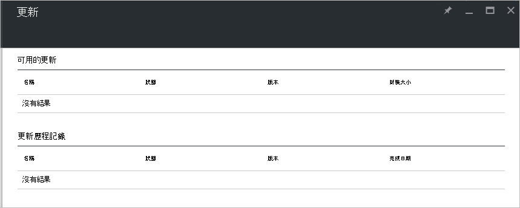

<properties
    pageTitle="Azure 堆疊的更新 |Microsoft Azure"
    description="深入了解 Azure 堆疊的更新"
    services="azure-stack"
    documentationCenter=""
    authors="HeathL17"
    manager="byronr"
    editor=""/>

<tags
    ms.service="azure-stack"
    ms.workload="na"
    ms.tgt_pltfrm="na"
    ms.devlang="na"
    ms.topic="article"
    ms.date="09/26/2016"
    ms.author="Helaw"/>

# Azure 堆疊的更新管理
技術預覽 2 介紹管理 Azure 堆疊更新的體驗的預覽。  本主題中，您將會瀏覽至更新節點。  

## 更新刀
1.  若要存取更新刀，按一下**瀏覽]** ，然後再按一下 [**更新**]。

2.  按一下 [**本機**的位置上。

3.  您會看到畫面列出可用的更新，及更新歷程記錄。  在技術預覽 2] 中沒有更新可安裝的。  

    

## 後續步驟
- [了解 Azure 堆疊 POC 架構](azure-stack-architecture.md)      
- [瞭解部署先決條件](azure-stack-deploy.md)
- [部署 Azure 堆疊](azure-stack-run-powershell-script.md)
 
    
  

  

