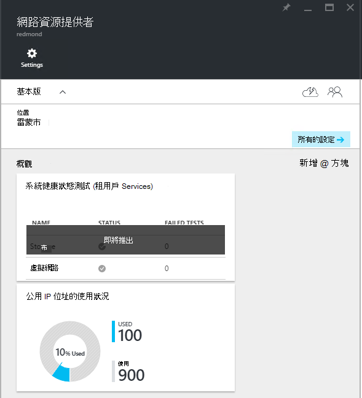
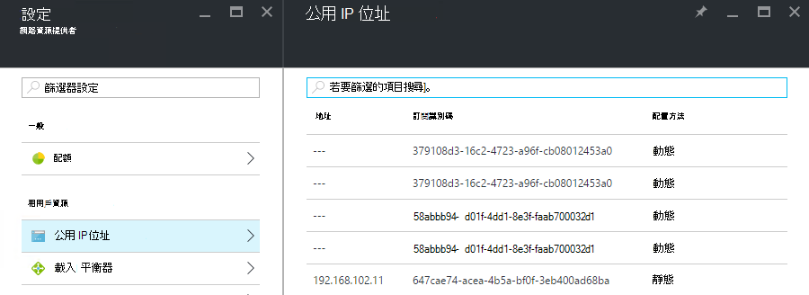

<properties
    pageTitle="TP2 中檢視公用 IP 位址消耗 |Microsoft Azure"
    description="系統管理員可以檢視中的公用 IP 位址消耗"
    services="azure-stack"
    documentationCenter=""
    authors="ScottNapolitan"
    manager="darmour"
    editor=""/>

<tags
    ms.service="azure-stack"
    ms.workload="na"
    ms.tgt_pltfrm="na"
    ms.devlang="na"
    ms.topic="get-started-article"
    ms.date="09/26/2016"
    ms.author="scottnap"/>

# Azure 堆疊 TP2 中檢視公用 IP 位址消耗

服務管理員，您可以檢視已配置到租用戶的配置，仍可使用的公用 IP 位址數] 及 [已配置在該位置的公用 IP 位址的百分比的公用 IP 位址的數目。

[**公用 IP 位址的使用狀況**] 方塊會顯示公用 IP 位址已在所有公用的 IP 位址集區，在布料的轉印圖樣耗用、 是否已用於租用戶 IaaS VM 執行個體、 布料的轉印圖樣基礎結構服務或明確所建立的租用戶的公用 IP 位址資源的總的數的字。

這個並排顯示的目的是讓 Azure 堆疊系統管理員的公用 IP 位址已在這個位置中耗用的整體數目。 如此有助於判斷是否執行低此資源的系統管理員。

在**設定**防禦，以在**租用戶資源**之下的**公用 IP 位址**] 功能表項目會列出僅這些的公用 IP 位址已*明確所建立的租用戶*。 因此，**使用**的**公用 IP 位址的使用狀況**的公用 IP 位址] 磚的數字是永遠不同 （大於） 在**租用戶資源**之下的 [**公用 IP 位址**] 方塊上的數字。

## 檢視公用 IP 位址的使用狀況資訊

若要檢視已耗用區域中的公用 IP 位址的總數︰

1.  在 Azure 堆疊入口網站，按一下 [**瀏覽]**，然後按一下**資源提供者**。

2.  從**資源提供者**的清單中，選取 [**網路資源提供者管理員**]。

3.  或者，您可以按一下**瀏覽 |位置**，選取您想要從清單檢視的位置。 然後在 [**資源提供者**] 方塊中，選取 [**網路資源提供者管理員**。

4.  **網路資源提供者**登陸刀顯示在**概觀**一節中的**公用 IP 位址的使用狀況**] 磚。

請記住，**使用**數字代表從所有的公用 IP 位址範圍的公用 IP 位址分派在該位置集區。 **可用的**數字代表從所有的公用 IP 位址範圍的公用 IP 位址尚未指派，仍可使用的資料庫。 **%使用**數字代表使用或已指派的地址的公用 IP 總數的百分比數地址中所有的公用 IP 位址在該位置的資料庫。

## 檢視所建立的租用戶訂閱的公用 IP 位址

若要查看的明確所建立的租用戶中的特定區域的訂閱的公用 IP 位址清單，請移至 [**網路資源提供者管理員**，請的**設定**刀，，然後選取 [**公用 IP 位址**。

您可能會發現部分動態配置的公用 IP 位址出現在清單中，但沒有尚未與其相關聯的地址。 這是因為地址已建立資源網路資源提供者中，而不是在網路控制器尚未。

網路控制器不會這項資源指派地址，直到實際繫結至介面、 網路介面卡 (NIC)、 負載平衡器或虛擬網路閘道器。 介面繫結的公用 IP 位址，網路控制器配置，IP 位址，並會出現在 [**位址**] 欄位中。

## 檢視公用 IP 位址資訊摘要資料表

有一些不同指派給公用 IP 位址，以決定是否的地址會出現一個清單或另一個。

| **公用 IP 位址工作分派大小寫** | **出現在 [摘要的使用狀況** | **出現在租用戶公用 IP 位址清單** |
| ------------------------------------- | ----------------------------| ---------------------------------------------- |
| 動態尚未指派給 NIC 或負載平衡器 （暫時） 的公用 IP 位址 | 無 | [是] |
| 動態公用 IP 位址指定給 NIC 或負載平衡器。 | [是] | [是] |
| 靜態的 IP 位址指定給租用戶 NIC 或負載平衡器。 | [是] | [是] |
| 靜態的 IP 位址指定給布料的轉印圖樣基礎結構服務端點。 | [是] | 無 |
| 公用 IP 位址隱含地建立 IaaS VM 執行個體，並用於輸出 NAT 虛擬網路上。 這些會建立在幕後時，好讓 Vm 可以傳送資訊給網際網路 VM 執行個體所建立的租用戶。 | [是] | 無 |
