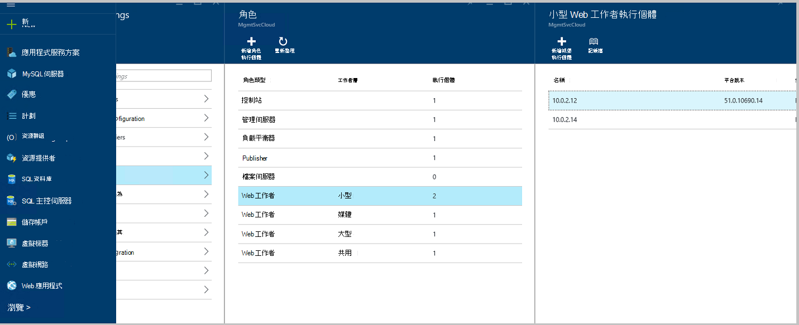

<properties
    pageTitle="新增更多的 web 應用程式網頁工作者角色 |Microsoft Azure"
    description="縮放比例 Azure 堆疊 Web 應用程式的詳細的指示"
    services="azure-stack"
    documentationCenter=""
    authors="kathm"
    manager="slinehan"
    editor=""/>

<tags
    ms.service="azure-stack"
    ms.workload="app-service"
    ms.tgt_pltfrm="na"
    ms.devlang="na"
    ms.topic="article"
    ms.date="09/26/2016"
    ms.author="kathm"/>

#   <a name="web-apps-adding-more-web-worker-roles"></a>Web 應用程式︰ 新增更多的網頁工作者角色

> [AZURE.NOTE] Azure 堆疊 TP1 部署僅適用於下列資訊。

這份文件提供擴充 Web 應用程式網頁工作者角色的相關指示。 包含建立其他 web 工作者角色為支援的任何大小的 web 應用程式提供的步驟。

Azure 堆疊支援免費與共用的 web 應用程式部署。 若要新增其他類型，您需要新增更多的網頁工作者角色。

如果您不確定什麼預設的 Web 應用程式安裝部署，您可以檢視其他資訊[以下](azure-stack-webapps-overview.md)。

下列步驟，才能使用小數位數 web 工作者角色︰

1.  [建立新的虛擬機器](#step-1-create-a-new-vm-to-support-the-new-instance-size)

2.  [設定虛擬機器](#step-2-configure-the-virtual-machine)

3.  [設定網頁工作者角色 Azure 堆疊入口網站中](#step-3-configure-the-web-worker-role-in-the-azure-stack-portal)

4.  [設定應用程式服務方案](#step-4-configure-app-service-plans)

##<a name="step-1-create-a-new-vm-to-support-the-new-instance-size"></a>步驟 1︰ 建立新 VM 支援新的執行個體大小

建立虛擬機器，如下所述[本文](azure-stack-provision-vm.md)，確保進行下列選項︰

 - 使用者名稱和密碼︰ 提供相同的使用者名稱和密碼時安裝 Web 應用程式提供了。

 - 訂閱︰ 使用預設的提供者訂閱。

 - 資源群組︰ 選擇**AppService 本機**。

> [AZURE.NOTE]儲存應用程式部署至 Web 應用程式為相同的 [資源] 群組中的虛擬機器的工作者角色。 （這是這個版本的建議）。

##<a name="step-2-configure-the-virtual-machine"></a>步驟 2︰ 設定虛擬機器

完成部署後，下列設定，才能支援網頁工作者角色︰

1.  開啟 [主機上的 [伺服器管理員，並按一下 [**工具** &gt; **HyperV 管理員**。

2.  連線到您在步驟 1 中建立新的虛擬機器中使用遠端桌面通訊協定 (RDP)。 每個 VM 為選取狀態時，伺服器的名稱位於 [摘要] 窗格中。

3.  按一下**[開始**] 按鈕，然後輸入 PowerShell 開啟 PowerShell。 **PowerShell.exe**，以滑鼠右鍵按一下，然後選取 [以系統管理員模式開啟 PowerShell 的**系統管理員身分執行**]。

4.  複製並貼上每個下列命令 （一次） 到 PowerShell] 視窗中，然後按下輸入︰

    ```netsh advfirewall firewall set rule group="File and Printer Sharing" new enable=Yes```
    ```netsh advfirewall firewall set rule group="Windows Management Instrumentation (WMI)" new enable=yes```
    ```reg add HKLM\\SOFTWARE\\Microsoft\\Windows\\CurrentVersion\\Policies\\system /v LocalAccountTokenFilterPolicy /t REG\_DWORD /d 1 /f```

5.  重新啟動虛擬機器。

> [AZURE.NOTE]附註︰ 這些是 Web 應用程式的最低需求。 他們的年齡隨附 Azure 堆疊的 Windows 2012 R2 圖像的預設設定。 已提供指示以供日後參考，以及使用不同的圖像。

##<a name="step-3-configure-the-web-worker-role-in-the-azure-stack-portal"></a>步驟 3︰ 設定網頁工作者角色 Azure 堆疊入口網站中

1.  在**ClientVM**服務系統管理員身分開啟入口網站。

2.  瀏覽至 [**資源提供者** &gt; **WEBAPPS 本機**。

    
 
3.  按一下 [**移至 [資源提供者管理**]。

4.  按一下 [**角色**]。

    
 
5.  按一下 [**新增角色執行個體**。

6.  按一下您想要部署 （小型、 中型、 大型，或共用） 至新的執行個體中**層**。

    
 
7.  設定下列項目︰
 - 伺服器名稱︰ 提供您建立較舊版本 （區段 1） 中的伺服器 IP 位址。
 - 角色類型︰ Web 工作。
 - 工作者層︰ 相符的項目層選取大小。

8. 按一下 [ **[確定]。**

9. 登入 CN0 VM，並開啟**Web 雲端管理 MMC**。

10. 瀏覽至**Web 雲端** &gt; **管理伺服器**。

11. 按一下您剛部署的伺服器名稱。 檢閱 [狀態] 欄中，並等待移至下一個步驟，直到的狀態是 「 準備 」。

    

##<a name="step-4-configure-app-service-plans"></a>步驟 4︰ 設定應用程式服務方案

> [AZURE.NOTE]在目前版本的 Web 應用程式中，必須在個別的資源群組儲存應用程式服務方案。 建立 web 應用程式中，每個大小的資源群組，並將其適當的資源] 群組中的應用程式方案。

1.  登入 ClientVM 入口網站。

2.  瀏覽至**新** &gt; **網頁與行動**。

3.  選取您想要部署 web 應用程式。

4.  提供 web 應用程式的資訊，然後選取 [ **AppService 計劃 / 位置**。

-   按一下 [**建立新的**]。

-   建立您的新方案，選取計劃的相對應的價格層。

> [AZURE.NOTE]您可以建立在此刀上的多個方案。 部署，不過，先確定您已選取適當的計劃。

以下顯示多個的計劃的範例︰    

##<a name="final-web-app-service-vm-configuration"></a>最後的 Web 應用程式服務 VM 設定

一旦您有擴充 web 工作者角色下, 圖會提供環境的檢視。 綠色的項目代表新增新的角色項目。
    
