<properties
     pageTitle="如何建立 Azure 支援要求 |Microsoft Azure"
     description="如何建立 Azure 支援要求。"
     services="Azure Supportability"
     documentationCenter=""
     authors="ganganarayanan"
     manager="scotthit"
     editor=""/>

<tags
     ms.service="azure-supportability"
     ms.workload="na"
     ms.tgt_pltfrm="na"
     ms.devlang="na"
     ms.topic="article"
     ms.date="10/25/2016"
     ms.author="gangan"/>

# 如何建立 Azure 支援要求

## 摘要
Azure 客戶可以建立及管理在 Azure 入口網站中[https://portal.azure.com](https://portal.azure.com)支援要求。
>[AZURE.NOTE] 德國 Azure 入口網站[https://portal.microsoftazure.de](https://portal.microsoftazure.de) ，而是[https://portal.azure.us](https://portal.azure.us)Azure 政府版入口網站。

根據客戶意見反應，我們已更新的支援要求體驗著重在三個主要目標︰

- **Streamlined**︰ 減少按和刀進行簡單提交支援要求程序。
- **整合式**︰ 當您正在進行疑難排解 Azure 資源發生問題時，很容易開啟該資源的支援要求，而不切換內容。
- **有效的**︰ 收集您支援工程師需要有效率地解決您的問題的重要資訊。

## 快速入門
從頂端導覽功能表，或直接從資源刀，您可以建立支援要求。

**從上方導覽列**

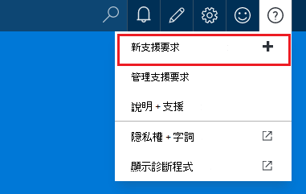

**從資源刀**

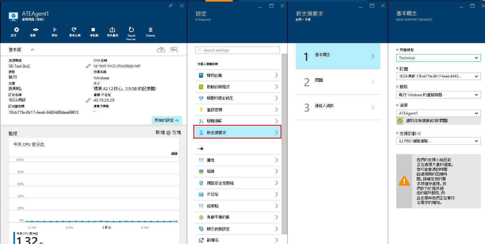

## 基本概念
支援要求程序的第一個步驟會收集您的問題與您的支援方案的基本資訊。

讓我們來看範例︰ 您使用您的虛擬機器對技術問題並懷疑網路連線問題。
在精靈的第一個步驟中選取的服務 （「 虛擬機器執行 Windows 」） 與資源 （您的虛擬機器中的名稱） 啟動程序的取得此問題的說明。

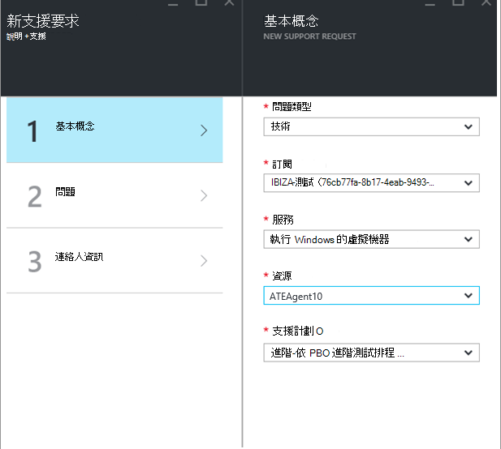

>[AZURE.NOTE] Azure 提供訂閱管理 （項目，例如計費與配額調整帳戶轉送） 不受限制的支援。 技術支援，您需要支援計劃。 [瞭解更多支援計劃](https://azure.microsoft.com/support/plans)。

## 問題
在精靈的第二步收集問題的相關的其他詳細資料。 提供正確的詳細資訊，在此步驟中，可讓我們將您的個案路由至最佳支援工程問題，並開始越快越診斷問題。

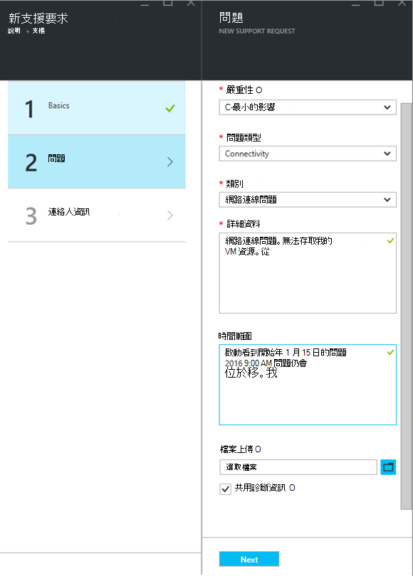

繼續虛擬機器連線先前範例中，您想要填寫表示網路連線問題，此表單，而且您會提供問題包括的時間當您遇到問題的相關詳細。

## 相關的說明
針對某些問題，我們會提供疑難排解問題的相關的說明連結。 如果沒有幫助的建議的文件，您可以繼續透過建立支援要求的程序。
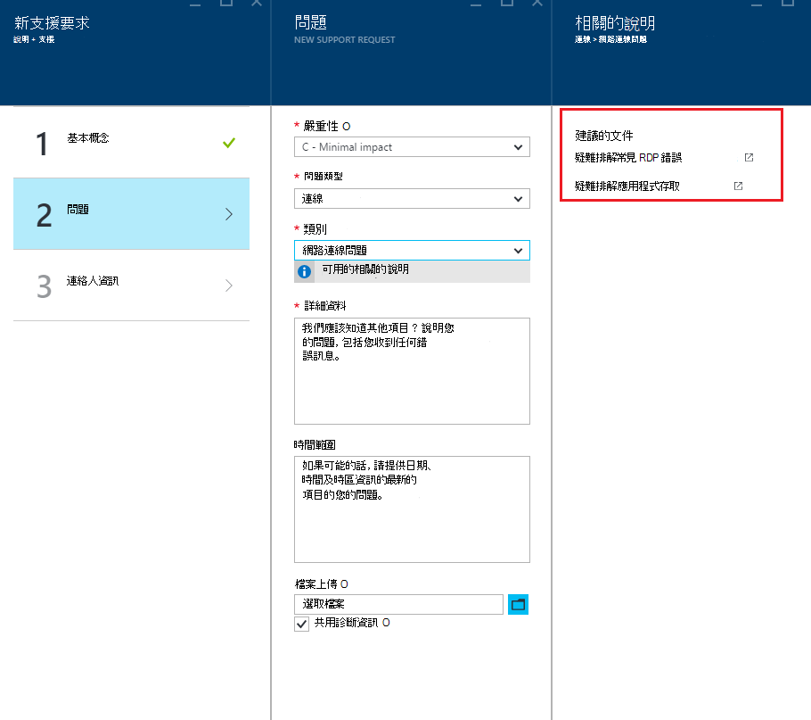

## 連絡人資訊
精靈的最後一個步驟，讓我們瞭解連絡您的方式，確認您的連絡人資訊。
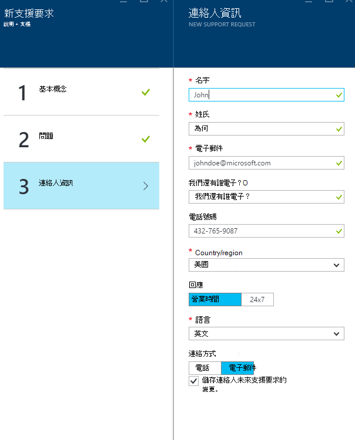

根據您的問題的嚴重性，您可能會要求指出您是否要我們與您連絡營業時間，或如果您希望 24 x 7 回應，這表示我們可能會與您連絡隨時期間。
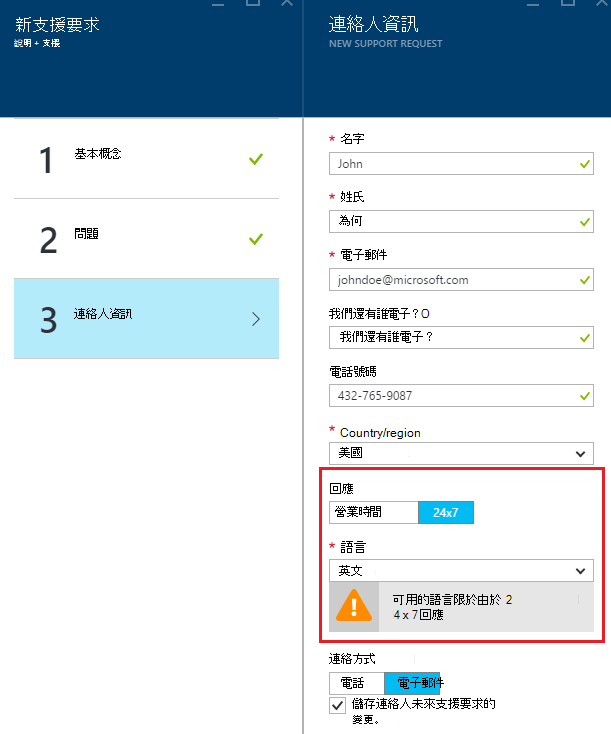

## 管理支援要求
建立支援要求之後，您可以檢視 [**管理支援要求**] 頁面的詳細資料。

**從上方導覽列**

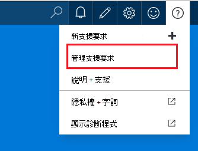

在 [**管理支援要求**] 頁面中，您可以檢視所有支援要求和他們的狀態。
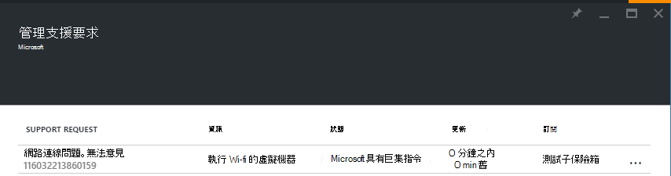

選取支援要求來檢視詳細資料，包括嚴重性和預期回應支援工程師要花的時間。
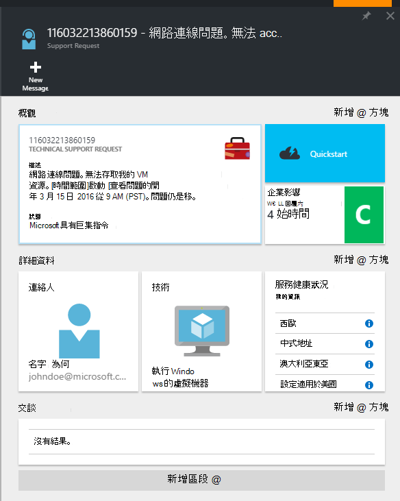

如果您想要變更要求的重要性，按一下 [**商務影響**磚。 在先前範例中，要求目前設定為與 c。

按一下 [] 方塊，顯示在清單的重要性，您可以分派給開啟支援要求。

>[AZURE.NOTE] 最大的重要性層級取決於您支援的方案。 [瞭解更多支援計劃](https://azure.microsoft.com/support/plans)。

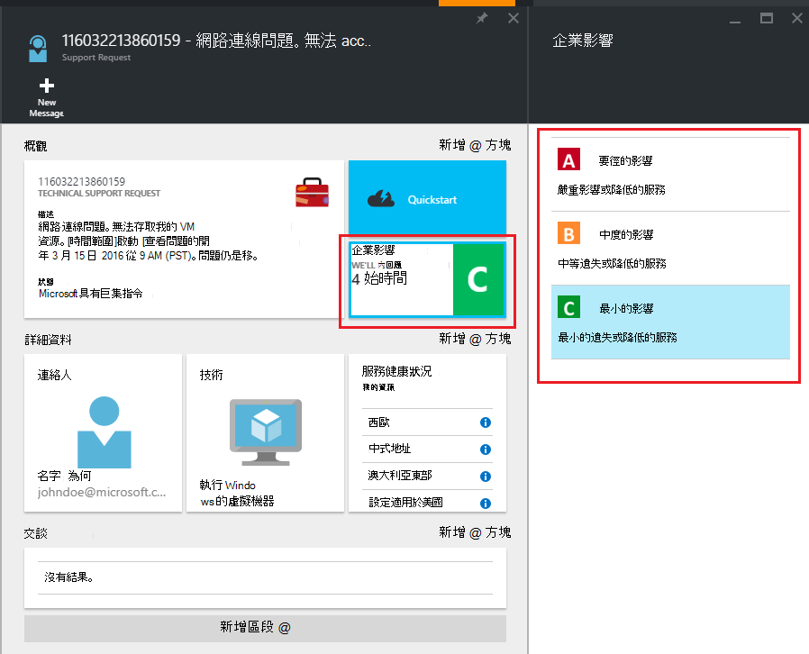

## 意見反應
我們一律是開啟意見與建議以 ！ 請傳送給我們[建議](https://feedback.azure.com/forums/266794-support-feedback)您。 此外，您可以加入與我們透過[Twitter](https://twitter.com/azuresupport)或[MSDN 論壇](https://social.msdn.microsoft.com/Forums/azure)。

## 深入瞭解
[Azure 支援常見問題集](https://azure.microsoft.com/support/faq)
