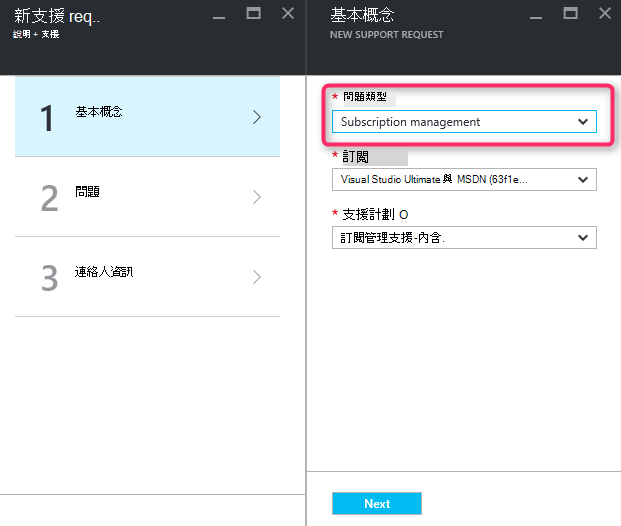
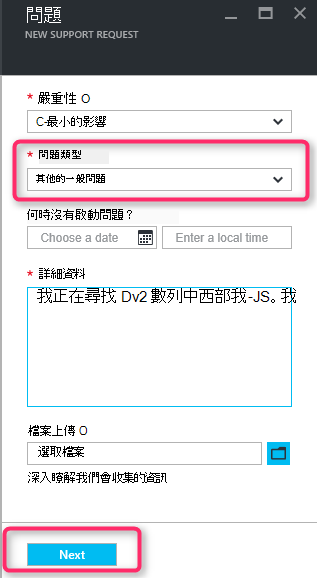
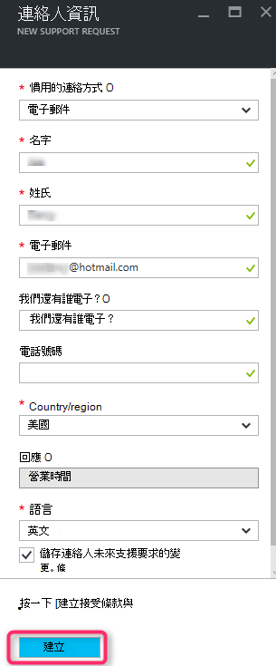

<properties
     pageTitle="無法使用的 SKU 數列 |Microsoft Azure"
     description="某些 SKU 數列無法使用此區域選取訂閱。"
     services="Azure Supportability"
     documentationCenter=""
     authors="ganganarayanan"
     manager="scotthit"
     editor=""/>

<tags
     ms.service="azure-supportability"
     ms.workload="na"
     ms.tgt_pltfrm="na"
     ms.devlang="na"
     ms.topic="article"
     ms.date="08/12/2016"
     ms.author="gangan"/>

# 無法使用的 SKU 數列

在某些地區，某些 Sku 無法自動在新的訂閱。  SKU[功能更強大的 Sku 會介紹在區域內](https://azure.microsoft.com/updates/announcing-new-dv2-series-virtual-machine-size/)和舊版的常用性參加時可能會發生這種情況。
建立以增加計算核心配額支援要求時，會顯示"*某些 SKU 數列無法使用此區域選取訂閱*」 訊息。

您可能會檢閱 SKU 顯示狀態，在 [[依地區 Azure 服務](https://azure.microsoft.com/regions/#services)] 頁面上。 

若要要求存取權從您的訂閱已經限制的 SKU，建立 「 訂閱管理 」 支援要求。

- 在 [基本功能] 頁面上選取 「 訂閱管理 」 問題類型，然後按 [下一步]。

- 在 [問題] 頁面上選取 [其他一般問題 」 問題類型，輸入確切的地區和 SKU 您沒有看到。
如此有助於加速支援程序。

- 在 [連絡人資訊] 頁面上輸入您連絡人的詳細資訊，然後按一下 [建立]。

## 意見反應
我們一律是開啟意見與建議以 ！ 傳送給我們[建議](https://feedback.azure.com/forums/266794-support-feedback)您。 此外，您可以加入與我們透過[Twitter](https://twitter.com/azuresupport)或[MSDN 論壇](https://social.msdn.microsoft.com/Forums/azure)。

## 深入瞭解
[Azure 支援常見問題集](https://azure.microsoft.com/support/faq)
