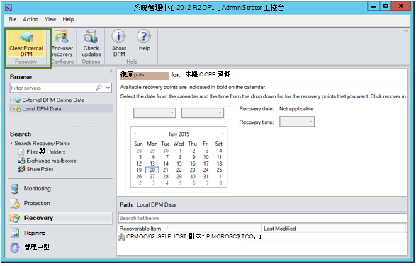

<properties
    pageTitle="從備份保存庫中的其他 DPM 伺服器復原資料 |Microsoft Azure"
    description="復原您已從註冊，該保存庫任何 DPM 伺服器保護至 Azure 備份保存庫的資料。"
    services="backup"
    documentationCenter=""
    authors="nkolli1"
    manager="shreeshd"
    editor=""/>

<tags
    ms.service="backup"
    ms.workload="storage-backup-recovery"
    ms.tgt_pltfrm="na"
    ms.devlang="na"
    ms.topic="article"
    ms.date="08/08/2016"
    ms.author="giridham;jimpark;trinadhk;markgal"/>

# 從備份保存庫中的其他 DPM 伺服器復原資料
您現在可以復原您已從註冊，該保存庫任何 DPM 伺服器保護至 Azure 備份保存庫的資料。 執行此步驟的程序，因此已完全整合 DPM 管理主控台，類似於其他復原工作流程。

若要從備份保存庫中的另一個 DPM 伺服器復原資料必須[系統管理中心資料保護管理員 UR7](https://support.microsoft.com/en-us/kb/3065246)和[最新的 Azure 備份代理程式](http://aka.ms/azurebackup_agent)。

## 從另一個 DPM 伺服器復原資料
若要從另一個 DPM 伺服器復原資料︰

1. 從 DPM 管理主控台的 [**復原**] 索引標籤中，按一下 [**新增外部 DPM 」** (在頂端畫面左上角)。

    

2. 下載新**保存庫認證**從保存庫**DPM 伺服器**位置要復原資料與相關聯，從 DPM 伺服器備份保存庫中，以註冊的清單中選擇 DPM 伺服器並提供其資料已恢復 DPM 伺服器相關聯的**加密複雜密碼**。

    

    >[AZURE.NOTE] 只會 DPM 相同的登錄保存庫相關聯的伺服器可以復原對方的資料。

    後外部 DPM 伺服器成功，您可以瀏覽資料的外部 DPM 伺服器與本機的 DPM 伺服器，從 [**復原**] 索引標籤。

3. 瀏覽可用的受外部 DPM 伺服器的生產伺服器清單，然後選取適當的資料來源。

    

4. 選取**的月份和年份****復原點**從下拉式清單、 選取建立的復原點時，需要的**復原日期**和選取**復原時間**。

    檔案和資料夾的清單會出現在下方窗格可以瀏覽，並已復原的任何位置。

    

5. 以滑鼠右鍵按一下適當的項目，然後按一下 [**復原]**。

    

6. 檢閱 [**復原選取範圍**。 驗證資料和要復原的備份複本的時間，以及建立備份複本的來源。 如果選取範圍不正確，請按一下 [瀏覽回選取適當的復原點 [修復] 索引標籤的 [**取消**]。 如果選取範圍是正確的請按一下 [**下一步**]。

    

7. 選取 [**復原到另一個位置**]。 **瀏覽**到復原的正確位置。

    

8. 選擇**建立複本**]、 **[略過**或**覆寫**相關的選項。
    - **建立複製**事件中有名稱衝突，將會建立檔案的複本。
    - **略過**會略過復原檔案，在事件有名稱衝突。
    - **覆寫**會覆寫現有複製指定名稱衝突的事件的位置。

    選擇適當的選項，即可**還原安全性**。 您可以套用的安全性設定的資料要復原的目的地電腦或的安全性設定適用於產品在建立復原點的時間。

    找出是否順利完成復原後，便會傳送**通知**。

    

9. [**摘要**] 畫面會列出目前選擇的選項。 一旦您按一下**「 復原 」**，資料將會還原到適當的內部部署的位置。

    

    >[AZURE.NOTE] 復原工作可以監視 DPM 伺服器的**監控**] 索引標籤中。

    

10. 您可以按一下 [**清除外部 DPM** DPM 伺服器，若要移除的外部 DPM 伺服器] 檢視中的 [**復原**] 索引標籤。

    

## 疑難排解錯誤訊息
|[否]。 |  錯誤訊息 | 疑難排解步驟 |
| :-------------: |:-------------| :-----|
|1。|        若要指定保存庫認證保存庫未註冊此伺服器。|  **原因︰**當選取的保存庫認證檔案不屬於備份嘗試復原時的 DPM 伺服器相關聯的保存庫時，會出現這個錯誤。   **解析度︰**從 DPM 伺服器已註冊的備份保存庫中下載保存庫認證檔案。|
|2。|        可復原的資料無法使用，或選取的伺服器並不是 DPM 伺服器。|   **原因︰**有任何其他的 DPM 伺服器 DPM 2012 R2 UR7 註冊備份保存庫，或 DPM 2012 R2 UR7 DPM 伺服器不尚未上傳的中繼資料，或選取的伺服器不是 DPM 伺服器 （又稱 Windows Server 或 Windows 用戶端）。   **解析度︰**如果有註冊備份保存庫其他 DPM 伺服器，請確定 SCDPM 2012 R2 UR7 及最新 Azure 備份代理程式已安裝。  如果有註冊，有 DPM 2012 R2 UR7 備份保存庫其他 DPM 伺服器，請等候安裝 UR7 啟動修復程序的後一天。 夜間工作會上傳至雲端的所有先前受保護備份的中繼資料。 資料可復原的。|
|3。|        沒有其他 DPM 伺服器被註冊此保存庫。|   **原因︰**沒有其他 DPM 伺服器 DPM 2012 R2 UR7 或上方登錄來復原正在嘗試從保存庫。 **解析度︰**如果有註冊備份保存庫其他 DPM 伺服器，請確定 SCDPM 2012 R2 UR7 及最新 Azure 備份代理程式已安裝。 如果有註冊，有 DPM 2012 R2 UR7 備份保存庫其他 DPM 伺服器，請等候安裝 UR7 啟動修復程序的後一天。 夜間工作會上傳至雲端的所有先前受保護備份的中繼資料。 資料可復原的。|
|4。|        提供加密複雜密碼不符合下列伺服器相關聯的複雜密碼︰**<server name>**|  **原因︰**程序加密要復原的 DPM 伺服器的資料中的資料使用加密複雜密碼不符合所提供的加密複雜密碼。 代理程式無法解密資料。 因此復原會失敗。 **解析度︰**請提供完全相同 DPM 伺服器要復原其資料與相關聯的加密複雜密碼。|

## 常見問題集的問題︰
1. **為什麼不能新增外部 DPM 伺服器從另一個 DPM 伺服器之後安裝 UR7 和最新的 Azure 備份代理程式？**

    A） 的資料來源 （使用更新彙總套件之前更新彙總套件 7） 至雲端受到保護的現有 DPM 伺服器，您必須至少有一天開始*新增外部 DPM 伺服器*的 UR7 和最新的 Azure 備份代理程式安裝後，請等候。 這需要上傳至 Azure 的 DPM 保護群組的中繼資料。 這是透過夜間工作第一次。

2. **什麼是 Azure 備份代理程式所需的最低版本？**

    A） Azure 備份代理程式最小版本才能啟用此功能是 2.0.8719.0。  瀏覽至 [控制台]，可以驗證 azure 備份代理程式版本**>**所有 [控制台] 的項目**>**程式和功能**>**Microsoft Azure 復原服務代理程式。 如果使用的是小於 2.0.8719.0，請下載[最新的 Azure 備份代理程式](https://go.microsoft.com/fwLink/?LinkID=288905)，並安裝。

    

## 後續步驟︰
• [Azure 備份的常見問題集](backup-azure-backup-faq.md)
