<properties
    pageTitle="從使用 Azure 入口網站的備份還原虛擬機器 |Microsoft Azure"
    description="還原 Azure 虛擬機器復原點使用 Azure 入口網站"
    services="backup"
    documentationCenter=""
    authors="markgalioto"
    manager="cfreeman"
    editor=""
    keywords="還原備份。還原。復原點。"/>

<tags
    ms.service="backup"
    ms.workload="storage-backup-recovery"
    ms.tgt_pltfrm="na"
    ms.devlang="na"
    ms.topic="article"
    ms.date="08/10/2016"
    ms.author="trinadhk; jimpark;"/>

# 若要還原的虛擬機器中使用 Azure 入口網站

> [AZURE.SELECTOR]
- [還原 Vm 在傳統入口網站](backup-azure-restore-vms.md)
- [還原 Vm Azure 入口網站中](backup-azure-arm-restore-vms.md)

保護您的資料的快照資料定義的間隔。 這些快照稱為復原點，它們會儲存在復原服務保存庫。 如果或修復或重建 VM 必要時，您可以從任何已儲存的復原點還原 VM。 當您還原復原點時，您會傳回或還原狀態 VM 製作復原點時。 本文說明如何還原 VM。

> [AZURE.NOTE] Azure 有兩種部署模型建立及使用的資源︰[資源管理員] 及 [傳統](../resource-manager-deployment-model.md)。 本文提供還原 Vm 部署使用資源管理員模型的資訊與程序。

## 還原復原點

1. 登入[Azure 入口網站](http://portal.azure.com/)

2. Azure 在功能表上，按一下 [**瀏覽**並在服務清單中，輸入**修復服務**。 服務清單，調整以您所輸入的內容。 當您看到**修復服務保存庫**時，請加以選取。

    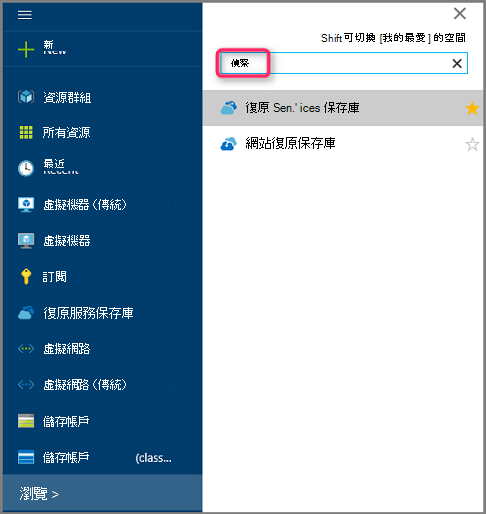

    會顯示保存庫訂閱中的清單。

    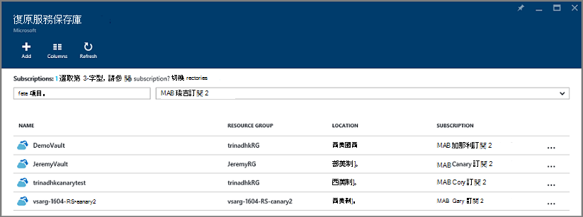

3. 從清單中，選取您要還原的 VM 相關聯保存庫。 當您按一下保存庫時，隨即會開啟其儀表板。

    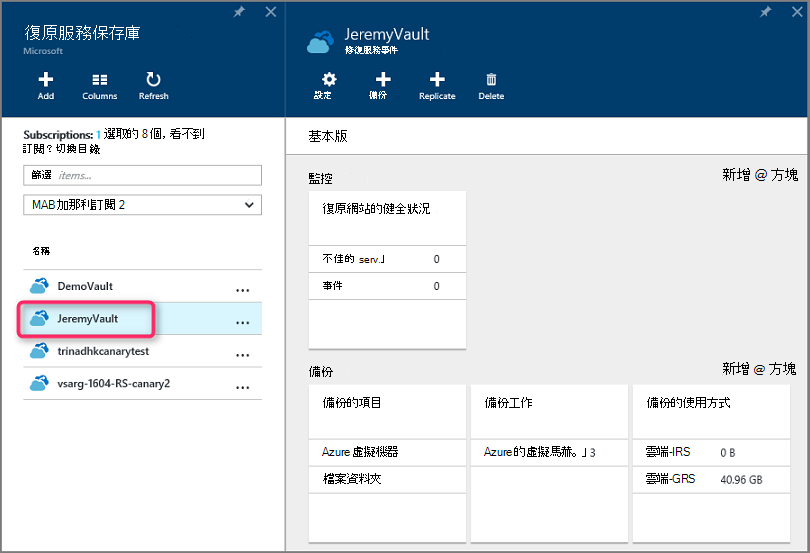

4. 現在，您已經在保存庫儀表板。 在**備份的項目**] 磚，按一下以顯示 Vm 保存庫相關聯的**Azure 虛擬機器**。

    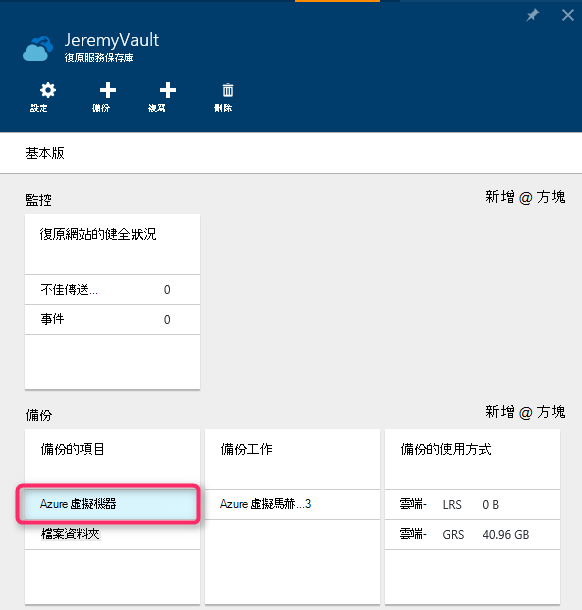

    **備份的項目**刀會開啟，並顯示 Azure 虛擬機器中的清單]。

    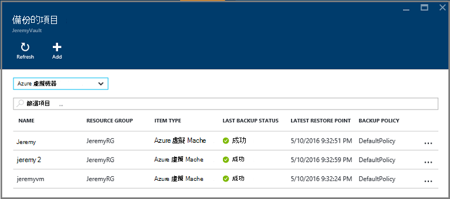

5. 從清單中，選取 [VM 以開啟儀表板]。 [VM 儀表板會開啟並監控區域，其中包含 [還原點] 方塊。

    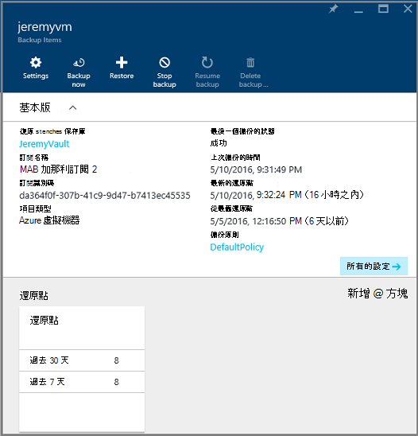

6. 按一下 [VM 儀表板] 功能表上，按一下 [**還原**

    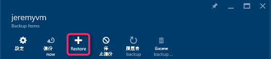

    還原刀隨即會開啟。

    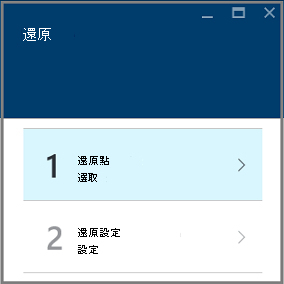

7. 在**還原**刀中，按一下 [**還原點**開啟 [**選取還原點**刀。

    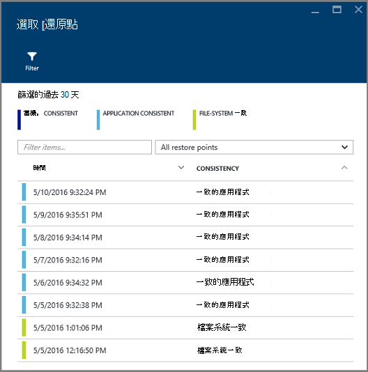

    根據預設，對話方塊會顯示所有還原點從過去 30 天。 使用**篩選**修改還原點的時間範圍顯示。 根據預設，會顯示所有的一致性還原點。 修改**所有還原點**篩選，以選取 [還原點特定一致性。 如需還原的每個類型點，請參閱[資料的一致性](./backup-azure-vms-introduction.md#data-consistency)的說明。  
    - **還原一致性**此清單中選擇︰
        - 當機一致還原點
        - 應用程式一致的還原點，
        - 檔案系統一致還原點
        - 所有還原點。  

8. 選擇還原點，然後按一下**[確定**]。

    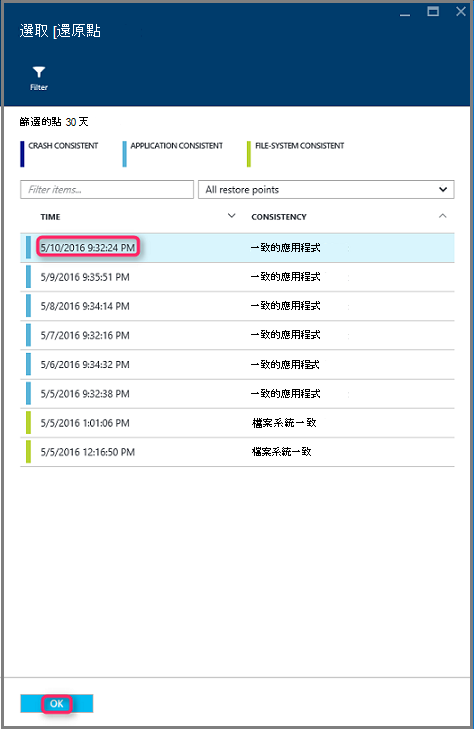

    **還原**刀顯示還原點設定。

    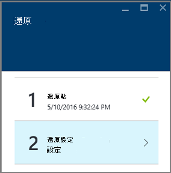

9. 在**還原**刀，**還原設定**會自動開啟之後還原點設定。

    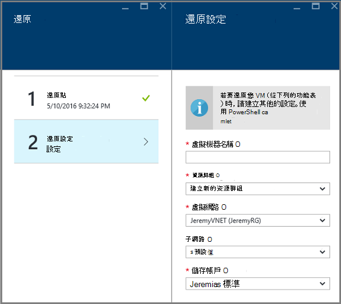

## 選擇 VM 還原設定

既然您已選取 [還原點，請選擇 [還原 VM 的設定]。 您選擇設定還原的 VM 是使用︰ Azure 入口網站或 PowerShell。

> [AZURE.NOTE] 入口網站提供還原 VM 快速建立的選項。 如果您想要自訂的未來還原 VM VM 設定，請使用 PowerShell 來還原備份磁碟，並將其附加到 VM 設定的選項。 請參閱[還原 VM 用於特殊網路設定](#restoring-vms-with-special-network-configurations)。

1. 如果您不是已有，請移至**還原**刀。 請確定**還原點**已選取，然後按一下 [**還原設定**開啟**復原設定**刀。

    

2. **還原設定**刀中，輸入或選取的每個下列欄位的值︰
    - **虛擬機器名稱**-提供 VM 的名稱。 名稱必須是唯一的資源群組 （適用於資源管理員部署 VM) 或雲端服務 （如傳統 VM)。 如果已經訂閱中存在，就無法將虛擬機器。
    - **資源群組**-使用現有的資源群組，或建立新的範本。 如果您要還原傳統 VM，使用此欄位指定新的雲端服務的名稱。 如果您要建立新的資源群組/雲端服務，則必須是全域唯一名稱。 一般而言，雲端服務名稱，就是-在公開 URL-與相關聯，例如: [cloudservice]。 cloudapp.net。 如果您嘗試使用已經使用雲端資源群組/雲端服務的名稱，Azure 指派資源群組/雲端服務 VM 相同的名稱。 Azure 會顯示資源群組/雲端服務，以及 Vm 不相關聯的所有相關性群組。 如需詳細資訊，請參閱[如何從地區的虛擬網路 (VNet) 的相關性群組移轉](../virtual-network/virtual-networks-migrate-to-regional-vnet.md)。
    - **虛擬網路**-選取虛擬網路 (VNET) 建立 VM 時。 欄位會提供與訂閱相關聯的所有 VNETs。 資源群組的 VM 會顯示在括號括住。
    - **子網路**-如果 VNET 有子網路，預設會選取第一個子網路。 如果有其他的子網路，請選取您要的子網路。
    - **儲存帳戶**此功能表列出的儲存空間帳戶中修復服務保存庫相同的位置。 選擇儲存帳戶，選取 [共用修復服務保存庫的相同位置的帳戶]。 不支援區域多餘的儲存空間帳戶。 如果不有任何與修復服務保存庫的相同位置的儲存空間帳戶，您必須建立一個還原作業開始前。 儲存帳戶的複寫類型提及括號括住。

    > [AZURE.NOTE] 如果您要還原資源管理員部署 VM，您必須識別虛擬網路 (VNET)。 虛擬網路 (VNET) 是選擇性的傳統 VM。

3. 在**設定還原**刀中，按一下**[確定**] 以完成還原設定。

4. 在 [**還原**刀，按一下 [**還原**觸發還原作業]。

    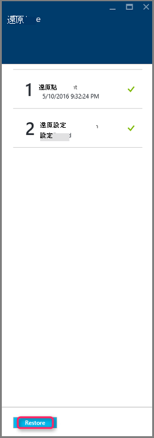

## 追蹤還原作業

觸發還原作業時，備份服務會建立追蹤還原作業的工作。 備份服務，也會建立並暫時入口網站的通知區域中顯示通知。 如果您沒有看到通知，您隨時都可以按一下 [通知] 圖示可檢視您的通知。

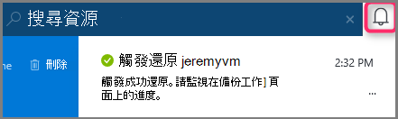

若要檢視作業時，處理，或若要檢視其完成時，開啟 [備份工作清單。

1. Azure 在功能表上，按一下 [**瀏覽**並在服務清單中，輸入**修復服務**。 服務清單，調整以您所輸入的內容。 當您看到**修復服務保存庫**時，請加以選取。

    

    會顯示保存庫訂閱中的清單。

    

2. 從清單中，選取您要還原的 VM 相關聯保存庫。 當您按一下保存庫時，隨即會開啟其儀表板。

3. 在保存庫儀表板上**備份工作**磚，然後按一下**Azure 虛擬機器**顯示保存庫相關聯的工作。

    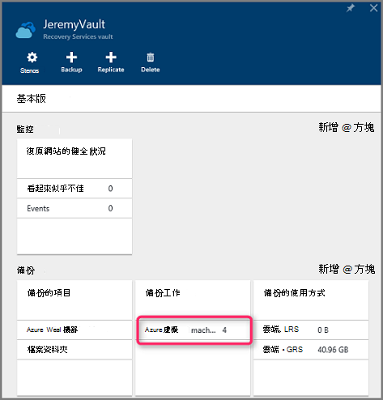

    **備份工作**刀開啟，並顯示的工作清單。

    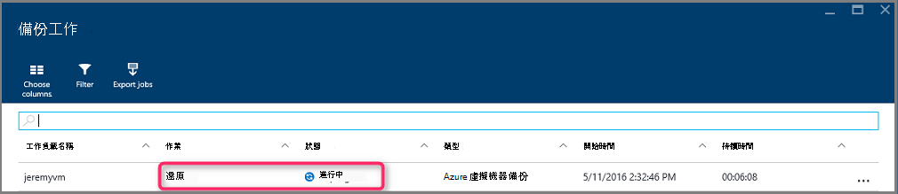

## 還原 Vm 用於特殊網路設定
備份及還原 Vm 下列特殊的網路設定可能是。 不過，這些設定會需要時還原程序進行某些特殊考量。

- Vm 下負載平衡器 （內部和外部）
- 使用多個保留 IPs Vm
- 使用多個 Nic Vm

>[AZURE.IMPORTANT] 在建立 Vm 的特殊網路設定時，您必須使用 PowerShell 若要還原的磁碟從建立 Vm。

若要完全重建虛擬機器還原到磁碟之後，請遵循下列步驟︰

1. 使用[PowerShell](../backup-azure-vms-automation.md#restore-an-azure-vm)復原服務保存庫還原磁碟

2. 建立所需的負載平衡器 VM 設定/來建立的 VM 所需的設定多個 NIC 或多個保留 IP 使用 PowerShell cmdlet 和使用。
    - 在雲端服務中，[內部負載平衡器](https://azure.microsoft.com/documentation/articles/load-balancer-internal-getstarted/)建立 VM
    - 建立 VM 對負載平衡器的 [網際網路] (https://azure.microsoft.com/en-us/documentation/articles/load-balancer-internet-getstarted/)
    - 建立[多個 Nic](https://azure.microsoft.com/documentation/articles/virtual-networks-multiple-nics/) VM
    - 建立[多個保留的 IPs](https://azure.microsoft.com/documentation/articles/virtual-networks-reserved-public-ip/) VM

## 後續步驟
現在，您可以還原您的 Vm，請參閱疑難排解資訊上 Vm 常見錯誤。 此外，請查看 [管理您的 Vm 工作上的文件。

- [疑難排解錯誤](backup-azure-vms-troubleshoot.md#restore)
- [管理虛擬機器](backup-azure-manage-vms.md)
