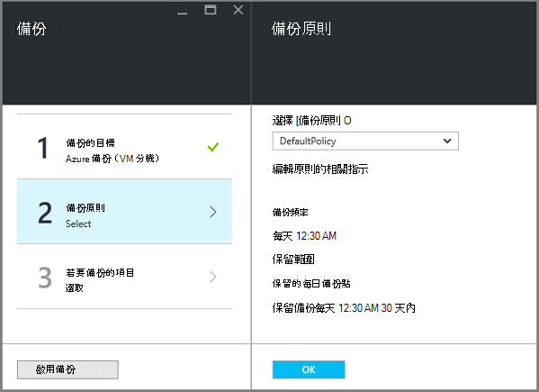
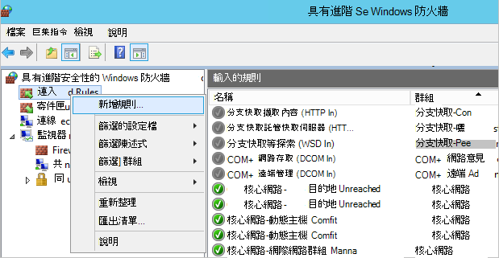

<properties
    pageTitle="準備您的環境備份部署資源管理員的虛擬機器 |Microsoft Azure"
    description="請確定您的環境準備備份中 Azure 虛擬機器"
    services="backup"
    documentationCenter=""
    authors="markgalioto"
    manager="cfreeman"
    editor=""
    keywords="備份。備份。"/>

<tags
    ms.service="backup"
    ms.workload="storage-backup-recovery"
    ms.tgt_pltfrm="na"
    ms.devlang="na"
    ms.topic="article"
    ms.date="08/21/2016"
    ms.author="trinadhk; jimpark; markgal;"/>


# <a name="prepare-your-environment-to-back-up-resource-manager-deployed-virtual-machines"></a>若要備份部署資源管理員的虛擬機器環境準備作業

> [AZURE.SELECTOR]
- [資源管理員模型](backup-azure-arm-vms-prepare.md)
- [傳統的模型](backup-azure-vms-prepare.md)

本文提供的步驟，準備您的環境備份部署資源管理員的虛擬機器 (VM)。 顯示程序中的步驟會使用 Azure 入口網站。  

Azure 備份服務有兩種類型的保存庫 （備份保存庫和修復服務保存庫） 來保護您的 Vm。 備份保存庫保護 Vm 部署使用傳統部署模型。 復原服務保存庫保護**同時傳統部署或資源管理員部署 Vm** 。 您必須使用修復服務保存庫來保護資源管理員部署 VM。

>[AZURE.NOTE] Azure 有兩種部署模型建立及使用的資源︰[資源管理員] 及 [傳統](../resource-manager-deployment-model.md)。 如需使用傳統部署模型 Vm 的詳細資訊，請參閱[準備備份 Azure 虛擬機器環境](backup-azure-vms-prepare.md)。

您可以保護或備份部署資源管理員的虛擬機器 (VM) 之前，請確定下列先決條件存在︰

- 建立復原服務保存庫 （或識別現有的復原服務保存庫）*中與您 VM 相同的位置*。
- 選取情況，定義備份的原則，並定義要保護的項目。
- 檢查虛擬機器上 VM 代理程式的安裝。
- 檢查網路連線

如果您知道您的環境中已經存在的下列條件然後繼續進行[備份您的 Vm 文章](backup-azure-vms.md)。 如果您需要設定，或檢查任何這些必要條件，本文會引導您完成步驟準備的必要條件。


## <a name="limitations-when-backing-up-and-restoring-a-vm"></a>當備份和還原 VM 時的限制

準備您的環境之前，請瞭解的限制。

- 不支援備份與多個 16 資料磁碟的虛擬機器。
- 不支援備份虛擬機器保留的 IP 位址與任何已定義的端點。
- 不支援 Linux 虛擬機器 Docker 副檔名的備份。 
- 備份資料並不包含附加至 VM 裝載的網路磁碟機。 
- 不支援取代現有的虛擬機器期間還原。 如果您嘗試還原 VM VM 存在時，還原操作會失敗。
- 不支援跨地區備份與還原。
- 您可以備份所有的公用區域的 Azure 虛擬機器 （請參閱支援的區域的[檢查清單](https://azure.microsoft.com/regions/#services)）。 如果您正在尋找的地區今天是不受支援，它不會出現在下拉式清單中保存庫建立期間。
- 您可以備份虛擬機器僅適用於選取作業系統版本︰
  - **Linux**: Azure 備份支援核心 OS Linux 以外[的由 Azure 背書的散佈的清單](../virtual-machines/virtual-machines-linux-endorsed-distros.md)。  其他提到-您-擁有-Linux 散佈也可能會運作，只要 VM 代理程式才會提供虛擬機器及支援] Python 存在。
  - **Windows Server**︰ 不支援的版本早於 Windows Server 2008 R2。
- 還原網域控制站僅透過 PowerShell 支援的多重 DC 設定 (DC) VM。 了解更多關於[還原多重 DC 網域控制站](backup-azure-restore-vms.md#restoring-domain-controller-vms)的資訊。
- 還原有下列特殊的網路設定的虛擬機器功能僅限透過 PowerShell 受支援。 還原作業完成後，Vm 建立使用者介面中使用還原工作流程不會有這些網路設定。 若要深入瞭解，請參閱[還原 Vm，用於特殊網路設定](backup-azure-restore-vms.md#restoring-vms-with-special-netwrok-configurations)。
  - 負載平衡器設定 （內部和外部）] 底下的虛擬機器
  - 具有多個保留的 IP 位址的虛擬機器
  - 具有多個網路介面卡的虛擬機器

## <a name="create-a-recovery-services-vault-for-a-vm"></a>建立 VM 復原服務保存庫

復原服務保存庫是儲存備份及復原點已建立一段時間的實體。 復原服務保存庫也包含受保護的虛擬機器相關聯的備份原則。

若要建立復原服務保存庫︰

1. [Azure 入口網站](https://portal.azure.com/)登入。

2. 在 [中心] 功能表中，按一下 [**瀏覽**，在資源的清單中，輸入 [**修復服務**。 當您開始輸入，就會篩選清單根據您輸入。 按一下 [**修復服務保存庫**]。

     <br/>

    修復服務保存庫的清單會顯示。

3. 在 [**復原服務保存庫**] 功能表中，按一下 [**新增**。

    

    修復服務保存庫刀開啟時，它會提示您提供的**名稱**、**訂閱**、 [**資源] 群組**中，與**位置**。

    

4. [**名稱**] 中，輸入好記的名稱來識別保存庫。 名稱必須是唯一的 Azure 訂閱。 輸入包含 2 到 50 個字元之間的名稱。 它必須以字母，以開始，並可以包含字母、 數字和連字號。

5. 按一下以查看可用的訂閱清單的**訂閱**]。 如果您不確定要使用的訂閱，使用預設的 （或建議） 訂閱。 會有多個選項只有您的組織帳戶是 Azure 的多個訂閱相關聯。

6. 按一下 [**資源群組**以查看可用的資源群組清單，或按一下 [**新增**]，建立新的資源群組。 完整資源群組的詳細資訊，請參閱[Azure 資源管理員的概觀](../azure-resource-manager/resource-group-overview.md)

7. 按一下以選取保存庫的地理區域的**位置**。 **必須**保存庫是為您想要保護的虛擬機器相同的區域。

    >[AZURE.IMPORTANT] 如果您不確定您 VM 存在於的位置，請關閉不在 [保存庫建立] 對話方塊，然後移至虛擬機器的清單，在入口網站。 如果您有虛擬機器中多個區域時，您必須在每個區域中建立修復服務保存庫。 建立保存庫中的第一個位置，再移至下一個位置。 若要指定儲存備份資料-修復服務保存庫儲存帳戶不需要和備份 Azure 服務會自動處理。

8. 按一下 [**建立**]。 可能需要一段時間的建立修復服務保存庫。 監控右側區內入口網站中的狀態通知。 您保存庫建立之後，它會出現在清單中修復服務保存庫。

    

    現在，您已經建立您保存庫，瞭解如何設定儲存複寫。

## <a name="set-storage-replication"></a>設定儲存複寫

儲存複寫選項可讓您選擇地理多餘的儲存在本機上多餘的儲存空間。 根據預設，您保存庫有地理多餘的儲存空間。 [離開] 選項設定為地理多餘的儲存空間，如果這是您主要的備份。 如果您想要不想為長期便宜選項，請選擇 [本機多餘的儲存空間]。 瞭解更多關於[地理多餘](../storage/storage-redundancy.md#geo-redundant-storage)和[Azure 儲存體複寫概觀](../storage/storage-redundancy.md)中[本機多餘](../storage/storage-redundancy.md#locally-redundant-storage)的儲存選項。

若要編輯的儲存空間複寫設定︰

1. 選取您要開啟保存庫儀表板與設定的保存庫。 如果**設定**刀沒有開啟，請按一下 [保存庫儀表板中的 [**所有設定**]。

2. 在**設定**刀中，按一下 [**備份基礎結構** > 開啟**備份設定**刀**備份設定**。 在**備份設定**刀中，選擇您保存庫的儲存空間複寫選項。

    

    選擇您保存庫的 [儲存] 選項之後, 您準備好 VM 關聯保存庫。 若要開始關聯，請探索並註冊 Azure 虛擬機器。


## <a name="select-a-backup-goal-set-policy-and-define-items-to-protect"></a>選取備份目標、 設定原則，並定義要保護的項目

註冊保存庫 VM 之前, 執行探索程序，以確保已新增至訂閱任何新虛擬機器會識別。 雲端服務名稱和地區，例如處理程序查詢 Azure 虛擬機器中的訂閱，以及其他資訊的清單。 Azure 入口網站中，在分析藍本是指您要放入復原服務保存庫。 原則是頻率以及何時採取復原點的排程。 原則也包含復原點的保留範圍。

1. 如果您已經修復服務保存庫開啟，請繼續進行步驟 2。 如果您沒有地窖開啟，請修復服務，但在 Azure 入口網站中，在中心] 功能表中，按一下 [**瀏覽**。

  - 在資源的清單中，輸入**修復服務**。
  - 當您開始輸入，就會篩選清單根據您輸入。 當您看到**修復服務保存庫**時，請按一下它。

     <br/>

    修復服務保存庫清單隨即出現。
  - 從修復服務保存庫清單中，選取 [保存庫]。

    隨即會開啟選取保存庫儀表板。

    

2. 從保存庫儀表板] 功能表按一下 [開啟備份刀的**備份**]。

    

    刀開啟時，訂閱中的任何新 Vm 搜尋備份服務。

    

3. 在 [備份刀中，按一下 [開啟備份目標刀**備份目標**]。

    

4. 在 [備份目標防禦，以設定**位置執行您的工作量**為 Azure 和**您做什麼想要備份**虛擬機器，然後按一下**[確定]**。

    備份目標刀隨即關閉，且備份原則刀隨即會開啟。

    

5. 在備份原則刀中，選取備份原則您想要套用至保存庫，然後按一下**[確定]**。

    

    預設的原則的詳細資料列在詳細資料。 如果您想要建立新的原則，從下拉式功能表選取**建立新檔案**。 下拉功能表也會提供選項，切換時快照所花的時間，7 PM。 如需定義備份原則的相關指示，請參閱[定義備份原則](backup-azure-vms-first-look-arm.md#defining-a-backup-policy)。 一旦您按一下**[確定]**，備份原則是保存庫與相關聯。

    接下來，請選擇關聯保存庫 Vm。

6. 選擇 [虛擬機器與指定原則關聯，然後按一下 [**選取**]。

    

    如果您沒有看到所要的 VM，檢查其是否存在修復服務保存庫 Azure 的相同位置。

7. 現在，您已經定義保存庫，在備份刀中的所有設定都按一下**啟用備份**底部的頁面]。 此保存庫和 Vm 部署原則。

    

準備的下一個階段安裝 VM 代理程式或確保 VM 代理程式已安裝。


## <a name="install-the-vm-agent-on-the-virtual-machine"></a>虛擬機器上安裝 VM 代理程式

Azure 虛擬機器備份延伸至工作上必須安裝 Azure VM 代理程式。 如果您 VM 建立從 Azure] 庫，然後 VM 代理程式已經存在虛擬機器上。 這項資訊會提供您所在的情況下**使用 VM 建立從 Azure] 庫中的例如您移轉 VM 從內部部署資料中心。 在這種情況下，必須安裝才能保護虛擬機器 VM 代理程式。

進一步瞭解[VM 代理程式](https://go.microsoft.com/fwLink/?LinkID=390493&clcid=0x409)，[如何安裝 VM 代理程式](../virtual-machines/virtual-machines-windows-classic-manage-extensions.md)。

如果您有備份 Azure VM 的問題，請檢查虛擬機器上正確安裝 Azure VM 代理程式 （請參閱下表）。 如果您建立自訂的 VM，是佈建虛擬機器之前請[確定已選取 [**安裝 VM 代理程式**] 核取方塊](../virtual-machines/virtual-machines-windows-classic-agents-and-extensions.md)。

下表提供 VM 代理程式 for Windows 和 Linux Vm 的其他資訊。

| **作業** | **Windows** | **Linux** |
| --- | --- | --- |
| 安裝 VM 代理程式 | <li>下載並安裝[代理程式 MSI](http://go.microsoft.com/fwlink/?LinkID=394789&clcid=0x409)。 您將需要系統管理員權限，以完成安裝。 <li>[更新 VM 屬性](http://blogs.msdn.com/b/mast/archive/2014/04/08/install-the-vm-agent-on-an-existing-azure-vm.aspx)，表示代理程式已安裝。 | <li> 從 GitHub 安裝最新的[Linux 代理程式](https://github.com/Azure/WALinuxAgent)。 您將需要系統管理員權限，以完成安裝。 <li> [更新 VM 屬性](http://blogs.msdn.com/b/mast/archive/2014/04/08/install-the-vm-agent-on-an-existing-azure-vm.aspx)，表示代理程式已安裝。 |
| 更新 VM 代理程式 | 更新 VM 代理程式是非常簡單，重新安裝[VM 代理程式的二進位檔案](http://go.microsoft.com/fwlink/?LinkID=394789&clcid=0x409)。 <br>請確定沒有任何備份作業正在執行更新 VM 代理程式時。 | 依照上[更新 Linux VM 代理程式](../virtual-machines-linux-update-agent.md)的指示。 <br>請確定沒有任何備份作業正在執行更新 VM 代理程式時。 |
| 驗證 VM 代理程式的安裝 | <li>瀏覽至 Azure VM 中的 [ *C:\WindowsAzure\Packages* ] 資料夾。 <li>您應該找到簡報 WaAppAgent.exe 檔案。<li> 以滑鼠右鍵按一下檔案，移至 [**屬性**]，然後選取 [**詳細資料**] 索引標籤。 產品版本] 欄位應與 2.6.1198.718 或更新版本。 | N/A |


### <a name="backup-extension"></a>備份的副檔名

虛擬機器上安裝 VM 代理程式之後，備份 Azure 服務 VM 代理程式安裝備份副檔名。 備份 Azure 服務升級和修補程式備份副檔名。

正在執行 VM 備份服務會安裝副檔名為備份。 執行 VM 提供開始應用程式一致的復原點的最大的機率。 不過，Azure 備份服務持續備份 VM，即使即表示已經關閉，並且無法安裝副檔名。 這是稱為離線 VM。 在此情況下，復原點會*當機一致*。


## <a name="network-connectivity"></a>網路連線

如要管理 VM 快照，副檔名為備份需要連線至 Azure 的公用 IP 位址。 不正確的網際網路連線，虛擬機器的 HTTP 要求逾時，[備份] 作業會失敗。 如果您的部署有限制存取 （透過網路安全性群組 (NSG)，例如） 的位置，然後選擇其中一個選項，提供清除路徑的備份資料傳輸︰

- [Whitelist Azure 資料中心 IP 範圍](http://www.microsoft.com/en-us/download/details.aspx?id=41653)-請參閱如何 whitelist IP 位址範圍上的指示。
- 部署 HTTP proxy 伺服器路由流量。

決定要使用哪一個選項時, 折衷方案是管理、 細緻的控制項，與成本之間。

|選項|優點|缺點|
|------|----------|-------------|
|Whitelist IP 範圍| 沒有其他成本。<br><br>在 NSG 中開啟 access，使用 [<i>設定 AzureNetworkSecurityRule</i>指令程式。 | 若要為受影響管理複雜的 IP 範圍變更一段時間。<br><br>提供存取整個 Azure，而不只是的儲存空間。|
|HTTP proxy]| 微調控制 proxy 中允許的儲存空間 Url。<br>單一 Vm 點的網際網路存取。<br>不需 Azure IP 位址變更。| 使用本軟體 proxy 執行 VM 的其他成本。|

### <a name="whitelist-the-azure-datacenter-ip-ranges"></a>Whitelist Azure 資料中心 IP 範圍

以 whitelist Azure 資料中心的 IP 範圍，請參閱[Azure 網站](http://www.microsoft.com/en-us/download/details.aspx?id=41653)以取得詳細資料的 IP 範圍及指示。

### <a name="using-an-http-proxy-for-vm-backups"></a>使用 [HTTP proxy 的 VM 備份
當備份 VM，VM 上備份的分機號碼會傳送快照管理命令至 Azure 儲存體使用 HTTPS API。 將透過 HTTP proxy 備份副檔名流量路由傳送因為它是唯一的元件公用網際網路存取的設定。

>[AZURE.NOTE] 有不應使用 proxy 軟體的建議。 請確定您挑選 proxy 相容於下列設定步驟。

範例下圖顯示三個設定步驟需要使用 HTTP proxy]:

- 應用程式 VM 路由公用網際網路 Proxy VM 透過繫結的所有 HTTP 流量。
- Proxy VM 允許從 Vm 虛擬網路中的連入流量。
- 網路安全性群組 (NSG) 命名 NSF 鎖定必須安全性規則允許的輸出網際網路流量 Proxy VM。


若要使用 [HTTP proxy] 進行公用網際網路通訊，請遵循下列步驟︰

#### <a name="step-1-configure-outgoing-network-connections"></a>步驟 1。 設定外寄的網路連線

###### <a name="for-windows-machines"></a>在 Windows 電腦
這會設定為本機系統帳戶的 proxy 伺服器設定。

1. 下載[PsExec](https://technet.microsoft.com/sysinternals/bb897553)
2. 提高權限的提示時，執行下列動作] 命令

     ```
     psexec -i -s "c:\Program Files\Internet Explorer\iexplore.exe"
     ```
     隨即會開啟 internet explorer 視窗。
3. 移至 [工具]-> [網際網路選項]-> [連線]-> [區域網路設定]。
4. 檢查系統帳戶的 proxy 設定。 設定 Proxy IP 和連接埠。
5. 關閉 Internet Explorer。

這會設定整個電腦的 proxy 設定，並將會用於任何外寄的 HTTP/HTTPS 流量。

如果您有設定 proxy 伺服器上目前的使用者帳戶 （不本機系統帳戶），請使用下列指令碼套用到 SYSTEMACCOUNT:

```
   $obj = Get-ItemProperty -Path Registry::”HKEY_CURRENT_USER\Software\Microsoft\Windows\CurrentVersion\Internet Settings\Connections"
   Set-ItemProperty -Path Registry::”HKEY_USERS\S-1-5-18\Software\Microsoft\Windows\CurrentVersion\Internet Settings\Connections" -Name DefaultConnectionSettings -Value $obj.DefaultConnectionSettings
   Set-ItemProperty -Path Registry::”HKEY_USERS\S-1-5-18\Software\Microsoft\Windows\CurrentVersion\Internet Settings\Connections" -Name SavedLegacySettings -Value $obj.SavedLegacySettings
   $obj = Get-ItemProperty -Path Registry::”HKEY_CURRENT_USER\Software\Microsoft\Windows\CurrentVersion\Internet Settings"
   Set-ItemProperty -Path Registry::”HKEY_USERS\S-1-5-18\Software\Microsoft\Windows\CurrentVersion\Internet Settings" -Name ProxyEnable -Value $obj.ProxyEnable
   Set-ItemProperty -Path Registry::”HKEY_USERS\S-1-5-18\Software\Microsoft\Windows\CurrentVersion\Internet Settings" -Name Proxyserver -Value $obj.Proxyserver
```

>[AZURE.NOTE] 如果您在 proxy 伺服器記錄檔中查看 」 (為 407) Proxy 需要驗證]，請核取您驗證已正確設定。

######<a name="for-linux-machines"></a>Linux 電腦

新增至下行```/etc/environment```檔案︰

```
http_proxy=http://<proxy IP>:<proxy port>
```

新增下列幾行，```/etc/waagent.conf```檔案︰

```
HttpProxy.Host=<proxy IP>
HttpProxy.Port=<proxy port>
```

#### <a name="step-2-allow-incoming-connections-on-the-proxy-server"></a>步驟 2。 允許在 proxy 伺服器上的連入連線︰

1. 在 proxy 伺服器上，開啟 [Windows 防火牆。 若要存取防火牆最簡單的方法是搜尋具有進階安全性的 Windows 防火牆。

    

2. 在 [Windows 防火牆] 對話方塊中，以滑鼠右鍵按一下 [**輸入規則**，按一下 [**新增規則]**。

    

3. 在**新增輸入規則精靈**]，選擇 [**自訂**] 選項的**規則類型**，按一下 [**下一步**。
4. 在選取的**程式**頁面上，選擇 [**所有程式**]，然後按一下 [**下一步**。

5. 在 [**通訊協定和連接埠**] 頁面上輸入下列資訊，然後按一下 [**下一步**︰

    

    - *通訊協定類型*選擇 [ *TCP*
    - *本機*的連接埠選擇*特定的連接埠*、 下列欄位中指定```<Proxy Port>```設定。
    - *遠端*連接埠選取*所有連接埠*

    精靈的其餘部分中，按一下 [傳送到結尾，然後為這個規則命名。

#### <a name="step-3-add-an-exception-rule-to-the-nsg"></a>步驟 3。 加入 NSG 例外狀況規則︰

在 PowerShell 的 Azure 命令提示字元中，輸入下列命令︰

下列命令會將 NSG 例外狀況。 此例外狀況 」 可讓 TCP 連接埠 80 (HTTP) 或 (HTTPS) 443 任何網際網路位址從 10.0.0.5 上任何連接埠流量導向。 如果您需要特定的連接埠公用 internet，請務必新增到該連接埠```-DestinationPortRange```以及。

```
Get-AzureNetworkSecurityGroup -Name "NSG-lockdown" |
Set-AzureNetworkSecurityRule -Name "allow-proxy " -Action Allow -Protocol TCP -Type Outbound -Priority 200 -SourceAddressPrefix "10.0.0.5/32" -SourcePortRange "*" -DestinationAddressPrefix Internet -DestinationPortRange "80-443"
```


*這些步驟會在這個範例使用特定的名稱和值。請使用您的部署輸入時，或剪下和貼上您的程式碼的詳細資料的名稱和值。*


現在，您知道您有網路連線，您準備備份您的 VM。 請參閱[備份資源管理員部署 Vm](backup-azure-arm-vms.md)。

## <a name="questions"></a>問題嗎？
如果您有問題，或任何 」 功能，您想要包含在內，請[將意見反應傳送給我們](http://aka.ms/azurebackup_feedback)。

## <a name="next-steps"></a>後續步驟
現在您已準備好您的環境的備份您的 VM，您下一步就是建立備份。 規劃文章提供備份 Vm 的詳細的資訊。

- [備份虛擬機器](backup-azure-vms.md)
- [規劃您 VM 備份基礎結構](backup-azure-vms-introduction.md)
- [管理虛擬機器中的備份](backup-azure-manage-vms.md)
