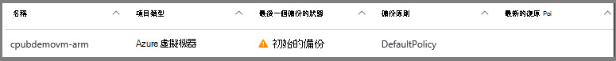

<properties
    pageTitle="備份到修復服務保存庫 Azure Vm |Microsoft Azure"
    description="探索、 註冊及備份 Azure 虛擬機器備份這些程序與修復服務保存庫 Azure 虛擬機器。"
    services="backup"
    documentationCenter=""
    authors="markgalioto"
    manager="cfreeman"
    editor=""
    keywords="虛擬機器備份。備份虛擬機器。備份與損毀的復原;arm vm 備份"/>

<tags
    ms.service="backup"
    ms.workload="storage-backup-recovery"
    ms.tgt_pltfrm="na"
    ms.devlang="na"
    ms.topic="article"
    ms.date="07/29/2016"
    ms.author="trinadhk; jimpark; markgal;"/>

# 備份 Azure Vm 修復服務保存庫

> [AZURE.SELECTOR]
- [備份 Vm 修復服務保存庫](backup-azure-arm-vms.md)
- [備份 Vm 備份保存庫](backup-azure-vms.md)

本文提供的程序來修復服務保存庫備份 Azure Vm （資源管理員部署及傳統部署）。 大部分的工時備份 Vm 進入準備工作。 您可以備份或保護 VM 之前，您必須完成來保護您的 Vm 環境準備作業的[先決條件](backup-azure-arm-vms-prepare.md)。 當您完成必要條件時，您就可以啟動備份您的 VM 的快照的作業。

>[AZURE.NOTE] Azure 有兩種部署模型建立及使用的資源︰[資源管理員] 及 [傳統](../resource-manager-deployment-model.md)。 您可以使用復原服務保存庫保護資源管理員部署 Vm 和傳統 Vm。 如需使用傳統部署模型 Vm 的詳細資訊，請參閱[Azure 虛擬機器備份](backup-azure-vms.md)。

如需詳細資訊，請參閱[規劃 VM 備份基礎結構中 Azure](backup-azure-vms-introduction.md)和[Azure 虛擬機器](https://azure.microsoft.com/documentation/services/virtual-machines/)上的文章。

## 觸發備份作業

備份與修復服務保存庫相關聯原則可定義頻率以及何時要執行備份的作業。 根據預設，第一個排程的備份是初始的備份。 初始備份時，直到**備份工作**刀上的最後一個備份的狀態顯示為**警告 （已擱置初始備份）**。

除非您初始的備份是因為很快開始，建議您執行**現在備份**。 下列程序會從保存庫儀表板開始。 此程序可執行初始備份工作完成之後，您所有的先決條件。 如果已經執行初始備份工作，就無法使用此程序。 相關聯的備份原則會決定下一個備份工作。  

若要執行的初始備份工作︰

1. 在保存庫儀表板上 [**備份**] 方塊中，按一下 [ **Azure 虛擬機器**]。  
    ![[設定] 圖示](./media/backup-azure-vms-first-look-arm/rs-vault-in-dashboard-backup-vms.png)

    **備份的項目**刀隨即會開啟。

2. 在**備份的項目**刀中，以滑鼠右鍵按一下您想要備份保存的庫，按一下 [**立即備份**。

    ![[設定] 圖示](./media/backup-azure-vms-first-look-arm/back-up-now.png)

    觸發的備份工作。  

    

3. 若要檢視您的初始檔案備份已完成，在保存庫儀表板，在 [**備份工作**] 方塊中，按一下 [ **Azure 虛擬機器**。

    

    備份工作刀隨即會開啟。

4. 在 [**備份工作**刀中，您可以看到所有工作的狀態。

    

    >[AZURE.NOTE] 備份作業的一部分備份 Azure 服務會清除所有寫入和一致的快照每個虛擬機器中的備份延伸問題命令。

    備份工作完成時，狀態是 [*已完成]*。

## 疑難排解錯誤
如果您設定您的虛擬機器遇到問題時備份，請參閱說明[VM 疑難排解文章](backup-azure-vms-troubleshoot.md)。

## 後續步驟

既然您已保護您 VM，請參閱下列文章的其他管理工作，您可以使用您的 Vm 和還原 Vm 執行。

- [管理並監控您的虛擬機器](backup-azure-manage-vms.md)
- [還原虛擬機器](backup-azure-arm-restore-vms.md)
