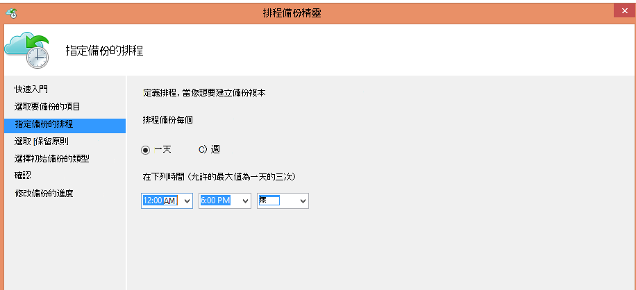
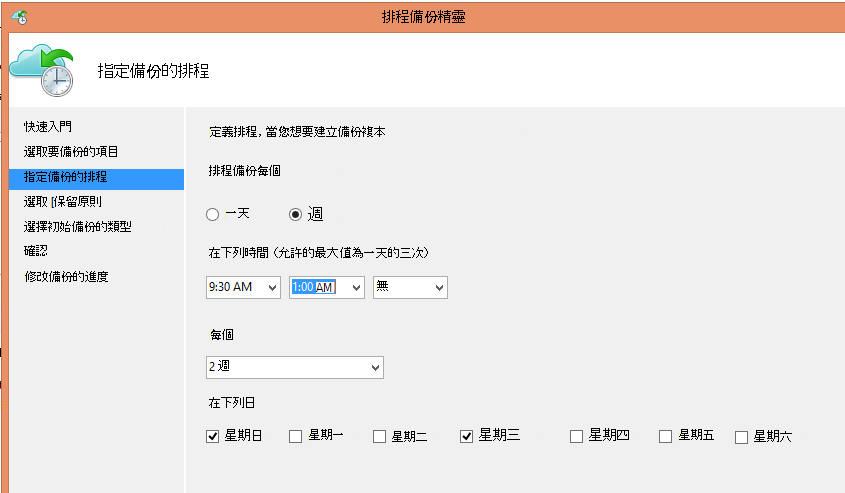
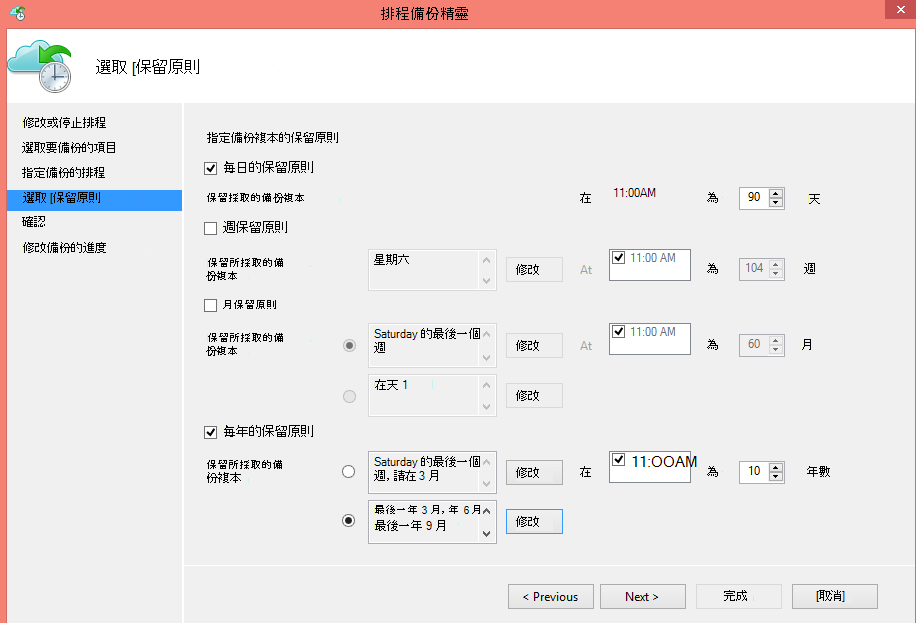
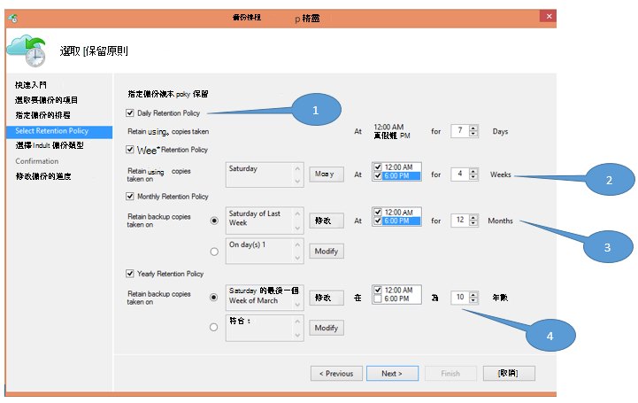
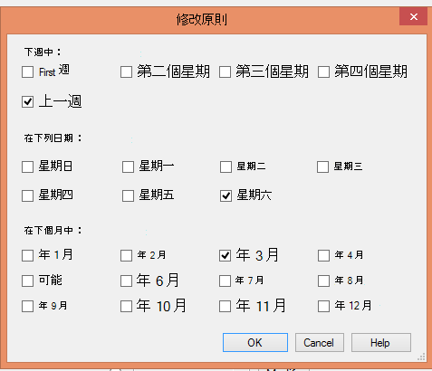

<properties
   pageTitle="若要取代膠帶貼上基礎結構使用 Azure 備份 |Microsoft Azure"
   description="瞭解如何 Azure 備份提供類似膠帶貼上的語意，這可讓您備份與還原 Azure 中的資料"
   services="backup"
   documentationCenter=""
   authors="trinadhk"
   manager="vijayts"
   editor=""/>
<tags
   ms.service="backup"
   ms.devlang="na"
   ms.topic="article"
   ms.tgt_pltfrm="na"
   ms.workload="storage-backup-recovery"
   ms.date="09/27/2016"
   ms.author="jimpark;trinadhk;markgal"/>

# 使用 Azure 備份取代膠帶貼上基礎結構

Azure 備份與系統管理中心資料保護管理員客戶可以︰

- 備份最適合組織的需求的排程中的資料。
- 長期保留備份資料
- 請的 Azure 其長期保留部分需要 （而非膠帶貼上）。

本文說明如何啟用客戶備份與保留原則。 客戶地址其長-長期-保留使用磁帶現在必須有功能強大且可行的替代方案，使用此功能的可用性。 功能 Azure 備份的最新版本 (已[以下](http://aka.ms/azurebackup_agent))。 系統管理中心 DPM 客戶必須至少更新至]，再使用 DPM Azure 備份服務 DPM 2012 R2 UR5。

## 什麼是備份排程？
備份排程指出備份作業的頻率。 例如，下列畫面上的設定指示每天下午 6 和午夜進行備份。

客戶也可以排程每週的備份。 例如下列畫面上的設定指示，取得備份每個替代星期日與星期三 9:30 AM 」 和 「 1:00 AM。

## 什麼是保留原則？
保留原則指定必須儲存備份的工期。 而不只指定備份的所有點的 「 一般原則 」，客戶可以指定備份時間為基礎的不同的保留原則。 例如，每日、 採取作為操作復原點，備份點會保留 90 天。 稽核用於每一季的結束時採取的備份點會保留的長的時間。

「 保留點 」 原則中指定的總數是 90 （每日點） + 40 (每一季的 10 年) = 130。

## 範例 – 將兩者都放在一起

1. **每日的保留原則**︰ 備份每天儲存七天。
2. **每週的保留原則**︰ 備份午夜，6 PM 星期六每天會保留的四個星期
3. **每月的保留原則**︰ 備份午夜，每個月的最後一個星期六 6 pm 會保留 12 個月
4. **每年的保留原則**︰ 每年 3 月的最後一個星期六午夜備份會保留為 10 的年數

「 保留點 」 總數 （從其客戶可以還原資料點） 上圖中的計算方式如下︰

- 兩個點的七天 = 14 每天復原點
- 兩個點每週的四個星期 = 8 復原點
- 兩個點每月的 12 個月 = 24 復原點
- 每 10 年年 = 10 復原每一個點點

復原點總數是 56。

> [AZURE.NOTE] Azure 備份沒有限制復原點的數目。

## 進階的組態
在上一個畫面中，按一下 [**修改**，客戶會有進一步彈性，指定保留排程。

## 後續步驟
如需 Azure 備份的詳細資訊，請參閱︰

- [Azure 備份的簡介](backup-introduction-to-azure-backup.md)
- [請嘗試 Azure 的備份](backup-try-azure-backup-in-10-mins.md)
