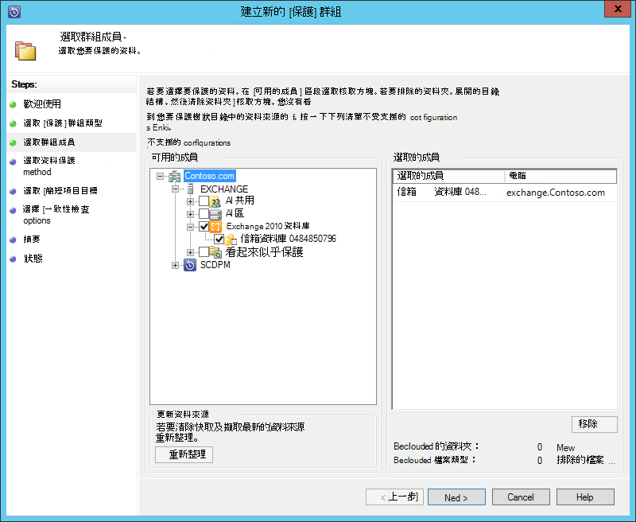
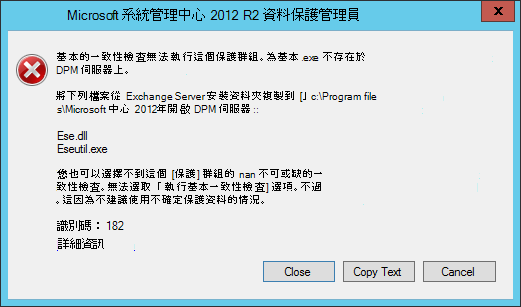
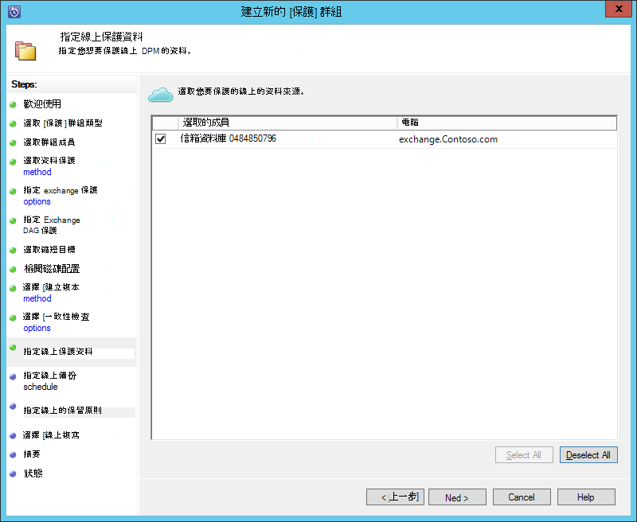
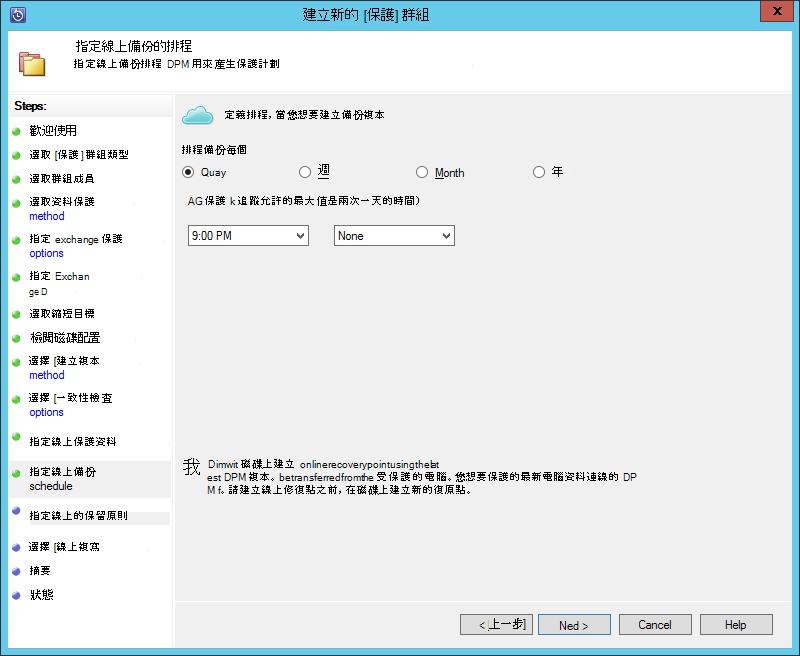
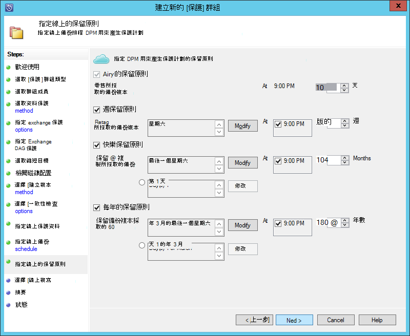
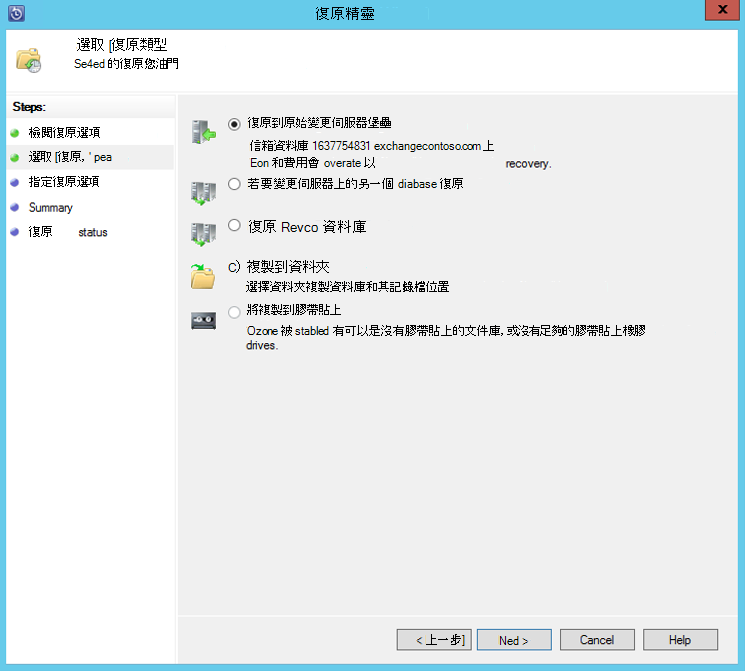

<properties
    pageTitle="備份的 Exchange 伺服器，才能使用系統管理中心 2012 R2 DPM Azure 備份 |Microsoft Azure"
    description="瞭解如何使用系統管理中心 2012 R2 DPM Azure 備份備份 Exchange 伺服器"
    services="backup"
    documentationCenter=""
    authors="MaanasSaran"
    manager="NKolli1"
    editor=""/>

<tags
    ms.service="backup"
    ms.workload="storage-backup-recovery"
    ms.tgt_pltfrm="na"
    ms.devlang="na"
    ms.topic="article"
    ms.date="08/15/2016"
    ms.author="anuragm;jimpark;delhan;trinadhk;markgal"/>

# 備份 Exchange 伺服器的系統管理中心 2012 R2 DPM Azure 備份
本文將說明如何設定在系統管理中心 2012 R2 資料保護管理員 (DPM) 伺服器備份 Microsoft Exchange server Azure 備份。  

## 更新
若要順利註冊 DPM 伺服器使用 Azure 備份，您必須安裝系統管理中心 2012 R2 DPM 與最新版 Azure 備份代理程式的最新的更新彙總套件。 從[Microsoft 目錄](http://catalog.update.microsoft.com/v7/site/Search.aspx?q=System%20Center%202012%20R2%20Data%20protection%20manager)取得最新的更新彙總套件。

>[AZURE.NOTE] 本文中的範例，如 2.0.8719.0 新版 Azure 備份代理程式已安裝，而且系統管理中心 2012 R2 DPM 上已安裝的更新彙總套件 6。

## 必要條件
在繼續之前，請確定已符合所有的[先決條件](backup-azure-dpm-introduction.md#prerequisites)保護負載使用 Microsoft Azure 備份。 下列先決條件包括下列各項︰

- 已建立 Azure 網站上的備份保存庫。
- 代理程式與保存庫認證 DPM 伺服器下載。
- 代理程式已安裝 DPM 伺服器上。
- 保存庫認證用於註冊 DPM 伺服器。
- 如果您要保護 Exchange 2016，請升級至 DPM 2012 R2 UR9 或更新版本

## DPM 保護代理程式  
若要在 Exchange 伺服器上安裝 DPM 保護代理程式，請遵循下列步驟︰

1. 請確定防火牆已正確設定。 請參閱[代理程式的設定防火牆例外狀況](https://technet.microsoft.com/library/Hh758204.aspx)。

2. 在 Exchange 伺服器上安裝代理程式，即可**管理 > 代理程式 > 安裝**DPM 管理主控台中檢視。 如需詳細步驟，請參閱[安裝 DPM 保護代理程式](https://technet.microsoft.com/library/hh758186.aspx?f=255&MSPPError=-2147217396)。

## 建立用於 Exchange server 保護群組

1. 在 [DPM 管理主控台中，按一下 [**保護**]，然後按一下**新增**來開啟 [**建立新的保護群組**精靈工具功能區上。

2. 按一下 [精靈的**歡迎**畫面中的 [**下一步**]。

3. **選取 [保護] 群組類型**] 畫面上選取**伺服器**，然後按一下 [**下一步**。

4. 選取您要保護，然後按一下 [**下一步**的 Exchange server 資料庫。

    >[AZURE.NOTE] 如果您要保護 Exchange 2013，檢查[Exchange 2013 的先決條件](https://technet.microsoft.com/library/dn751029.aspx)。

    在下列範例中，選取 Exchange 2010 資料庫。

    

5. 選取資料的保護方法。

    [保護] 群組的名稱，然後按一下兩個下列選項︰

    - 我想要使用的磁碟短期保護。
    - 我想要線上保護。

6. 按一下 [**下一步**]。

7. 如果您想要檢查的 Exchange Server 資料庫完整性，請選取 [**執行 Eseutil 檢查資料完整性**] 選項。

    之後您選取此選項，備份的一致性檢查會以避免由 Exchange 伺服器上執行**eseutil**命令產生 I/O 流量 DPM 伺服器上執行。

    >[AZURE.NOTE]若要使用這個選項，您必須將的 Ese.dll 和 Eseutil.exe 檔案複製至 C:\Program Files\Microsoft 系統管理中心 2012 R2\DPM\DPM\bin 目錄 DPM 伺服器上。 否則，觸發下列錯誤︰  
    

8. 按一下 [**下一步**]。

9. 選取資料庫的**備份複本**，然後再按 [**下一步**。

    >[AZURE.NOTE] 如果您未選取至少有一個 DAG 複本的資料庫的 「 完整備份 」，並不會截斷記錄。

10. **這是短期的備份**，設定目標，然後按一下 [**下一步**。

11. 檢閱的可用磁碟空間，然後按一下 [**下一步**。

12. 選取的時間，用以 DPM 伺服器會建立初始複寫，然後再按一下 [**下一步**]。

13. 選取一致性檢查選項]，然後再按 [**下一步**。

14. 選擇您想要 Azure 備份的資料庫，然後按一下 [**下一步**。 例如︰

    

15. 定義**Azure 備份**的排程，然後按一下 [**下一步**。 例如︰

    

    >[AZURE.NOTE] 請注意 [線上修復點會根據 express 完整復原點。 因此，您必須排程的線上修復點之後快速完整所指定的時間復原點。

16. **Azure 備份**，針對設定的保留原則，然後按一下 [**下一步**。

17. 選擇一個線上複寫選項，然後按一下 [**下一步**]。

    如果您有大型的資料庫時，可能會花很長的時間，要在網路上建立的初始備份。 若要避免此問題，您可以建立離線備份。  

    

18. 確認設定]，然後再按一下 [**建立群組**。

19. 按一下 [**關閉**]。

## 復原 Exchange 資料庫

1. 若要復原 Exchange 資料庫，請按一下 [DPM 管理主控台中的 [**復原**]。

2. 找出您想要復原的 Exchange 資料庫。

3. 從 [*復原時間*] 下拉式清單中選取線上修復點。

4. 按一下 [啟動**修復精靈]**的 [**復原**]。

線上修復點有五個復原類型︰

- **復原原始的 Exchange 伺服器位置︰**資料將會還原到原始的 Exchange 伺服器。
- **復原至 Exchange 伺服器上的另一個資料庫︰**資料將會還原至另一個 Exchange 伺服器上的另一個資料庫。
- **復原修復資料庫︰**資料將會還原至 Exchange 修復資料庫 (RDB)。
- **複製至 [網路資料夾︰**資料將會還原至網路資料夾。
- **複製到膠帶貼上︰**如果您有膠帶貼上的文件庫或附加並設定 DPM 伺服器上的獨立膠帶貼上磁碟機，復原點會複製到免費膠帶貼上。

    

## 後續步驟

- [Azure 備份的常見問題集](backup-azure-backup-faq.md)
