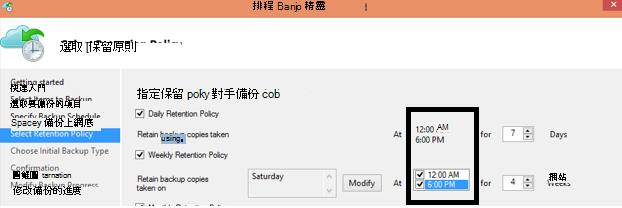

<properties
   pageTitle="Azure 備份的常見問題集 |Microsoft Azure"
   description="常見問題備份服務、 備份代理程式、 備份及復原、 保留資料的安全性和備份與損毀的復原其他常見問題的解答。"
   services="backup"
   documentationCenter=""
   authors="markgalioto"
   manager="jwhit"
   editor=""
   keywords="備份與損毀的復原;備份服務"/>

<tags
   ms.service="backup"
   ms.workload="storage-backup-recovery"
     ms.tgt_pltfrm="na"
     ms.devlang="na"
     ms.topic="get-started-article"
     ms.date="10/21/2016"
     ms.author="trinadhk; giridham; arunak; markgal; jimpark;"/>

# <a name="azure-backup-service--faq"></a>Azure 備份服務常見問題集


本文會是 Azure 備份服務的相關常見問題 （與個別解答） 清單。 我們的社群回覆快速，並詢問問題是經常，我們將其新增至這份文件。 問題的答案通常會提供參照，或支援資訊。 您可以瞭解這份文件或相關的文件的 [Disqus] 區段中的 Azure 備份提出問題。 您也可以張貼[討論區](https://social.msdn.microsoft.com/forums/azure/home?forum=windowsazureonlinebackup)中的 Azure 備份服務的相關問題。


## <a name="what-is-the-list-of-supported-operating-systems-from-which-i-can-back-up-to-azure-using-azure-backup-br"></a>什麼是作業系統的從我可以備份到 Azure 使用 Azure 備份支援的清單？ <br/>
Azure 備份檔案資料夾備份，使用 Azure 備份伺服器和 SCDPM 的應用程式備份支援下列作業系統的清單。

| 作業系統        | 平台           | SKU  |
| :------------- |-------------| :-----|
| Windows 8 和最新的預存程序      | 64 位元 | 企業、 Pro |
| Windows 7 和最新的預存程序      | 64 位元 | 最終，企業版、 專業、 家用進階版，首頁基本、 入門 |
| Windows 8.1 和最新的預存程序 | 64 位元      |    企業、 Pro |
| 在 Windows 10      | 64 位元 | 企業、 Pro 首頁 |
|Windows Server 2012 R2 和最新的預存程序| 64 位元| 標準，資料中心，Foundation|
|Windows Server 2012 和最新的預存程序|    64 位元| 資料中心，Foundation，標準|
|Windows 儲存 Server 2012 R2 和最新的預存程序  |64 位元|    [標準]、 [工作群組|
|Windows 儲存 Server 2012 和最新的預存程序 |64 位元 |[標準]、 [工作群組
|Windows Server 2012 R2 和最新的預存程序  |64 位元|    基本|
|Windows Server 2008 R2 SP1 |64 位元|    標準，企業、 資料中心 Foundation|
|Windows Server 2008 SP2    |64 位元|    標準，企業、 資料中心 Foundation|

Azure VM 備份

- **Linux**: Azure 備份支援核心 OS Linux 以外[的由 Azure 背書的散佈的清單](../virtual-machines/virtual-machines-linux-endorsed-distros.md)。  其他提到-您-擁有-Linux 散佈也可能會運作，只要 VM 代理程式才會提供虛擬機器及支援] Python 存在。
- **Windows Server**︰ 不支援的版本早於 Windows Server 2008 R2。

## <a name="where-can-i-download-the-latest-azure-backup-agent-br"></a>哪裡可以下載最新的 Azure 備份代理程式？ <br/>
您可以下載最新的代理程式的 Windows Server、 系統管理中心 DPM 或 Windows 用戶端，[以下](http://aka.ms/azurebackup_agent)為備份。 如果您想要備份虛擬機器中，使用 VM 代理程式 （這會自動安裝適當的分機號碼）。 從 Azure] 庫中建立的虛擬機器上已經 VM 代理程式。

## <a name="which-version-of-scdpm-server-is-supported-br"></a>哪個版本的 SCDPM 伺服器功能受支援？ <br/>
我們建議您在最新的更新彙總套件的 SCDPM 上安裝[最新](http://aka.ms/azurebackup_agent)的 Azure 備份代理程式 (UR11 齡年 8 月 2016年)

## <a name="when-configuring-the-azure-backup-agent-i-am-prompted-to-enter-the-vault-credentials-do-vault-credentials-expire"></a>在設定 Azure 備份代理程式時，時提示我輸入保存庫認證。 保存庫認證過期嗎？
是的保存庫認證 48 小時後過期。 如果檔案到期、 Azure 入口網站登入，然後從您保存庫下載保存庫認證檔案。

## <a name="is-there-any-limit-on-the-number-of-vaults-that-can-be-created-in-each-azure-subscription-br"></a>有無任何限制，可以建立的每個 Azure 訂閱的保存庫數目嗎？ <br/>
[是]。 年 9 月 2016，您可以建立每個訂閱的 25 備份保存庫。 您可以建立最多 25 修復服務保存庫，每個 Azure 備份，每個訂閱的每個支援地區。 如果您需要更多保存庫，然後建立新的訂閱。

## <a name="are-there-any-limits-on-the-number-of-serversmachines-that-can-be-registered-against-each-vault-br"></a>是否有可以針對每個保存庫註冊的伺服器/機器數目任何限制？ <br/>
是的您可以註冊每保存庫超過 50 個機器。 Azure IaaS 虛擬機器，限制為 200 Vm 每保存庫。 如果您需要註冊更多的電腦，建立新的保存庫。

## <a name="how-do-i-register-my-server-to-another-datacenterbr"></a>我要如何註冊我到另一個資料中心的伺服器？<br/>
備份資料會傳送至已註冊保存庫的資料中心。 若要變更的資料中心的最簡單方法是解除安裝代理程式並重新安裝代理程式 register] 以新的保存庫屬於所需的資料中心。

## <a name="what-happens-if-i-rename-a-windows-server-that-is-backing-up-data-to-azurebr"></a>如果我重新命名的 Windows server 的 Azure 來備份資料，會發生什麼情況？<br/>
當您重新命名伺服器時，會停止所有目前設定的備份。
您需要以備份保存庫註冊伺服器的新名稱。 當您建立新的註冊時，第一個備份作業是完整的備份，並不增量備份。 如果您要復原先前的舊的伺服器名稱保存庫來備份資料，您可以復原使用**復原資料**精靈中的[**另一個伺服器**](backup-azure-restore-windows-server.md#recover-to-an-alternate-machine)選項的資料。

## <a name="what-types-of-drives-can-i-backup-files-and-folders-from-br"></a>何種類型的磁碟機可以我備份檔案和資料夾？ <br/>
磁碟機/區下列集無法取得備份︰

- 卸除式媒體︰ 磁碟機必須報告的固定要使用的備份的項目來源。
- 唯讀區︰ 音量必須是可寫入的大量陰影複製服務 (VSS) 函數。
- 離線區︰ 音量必須在線上的 VSS 函數。
- 網路共用︰ 音量必須是本機備份使用線上備份伺服器。
- Bitlocker 受保護區︰ 音量必須先解除鎖定備份可能會發生。
- 檔案系統識別碼︰ NTFS 是只支援此版本的線上備份服務的檔案系統。

## <a name="what-file-and-folder-types-can-i-back-up-from-my-serverbr"></a>檔案與資料夾類型可以備份從我的伺服器？<br/>
支援下列類型︰

- 加密
- 壓縮
- 疏鬆
- 壓縮 + 疏鬆
- 永久連結︰ 不受支援，請略過
- 重新分析點︰ 不受支援，請略過
- 加密 + 壓縮: 不支援、 略過
- 加密 + 疏鬆: 不支援、 略過
- 壓縮的資料流︰ 不受支援，請略過
- 疏鬆串流︰ 不受支援，請略過

## <a name="whats-the-minimum-size-requirement-for-the-cache-folder-br"></a>[快取] 資料夾的最小的大小需求是什麼？ <br/>
[快取] 資料夾大小會決定您要備份的資料量。 您快取資料夾應該 5%的所需的資料儲存空間。

## <a name="if-my-organization-has-one-vault-how-can-i-isolate-one-servers-data-from-another-server-when-restoring-databr"></a>如果我的組織有一個保存庫，如何可以我隔離從另一個 server 的伺服器的資料時還原資料？<br/>
所有伺服器註冊為相同的保存庫，可以都復原由*使用相同的複雜密碼的*其他伺服器備份資料。 如果您有伺服器要找出您的組織中其他伺服器的備份資料，請針對這些伺服器中使用指定的複雜密碼。 例如，人力資源伺服器可能會使用一個加密複雜密碼，accounting 伺服器另一個，且存放區伺服器第三個。

## <a name="can-i-migrate-my-backup-data-or-vault-between-subscriptions-br"></a>可以 「 移轉 「 我的備份資料或訂閱方案之間保存庫？ <br/>
[否]。 保存庫已建立訂閱層級，且無法重新指派至另一個訂閱已建立。

## <a name="does-the-azure-backup-agent-work-on-a-server-that-uses-windows-server-2012-deduplication-br"></a>在使用 Windows Server 2012 deduplication 的伺服器，功能 Azure 備份代理程式運作？ <br/>
[是]。 代理程式服務轉換 deduplicated 的資料標準的資料時將其備妥備份作業。 它然後最佳化備份資料，來加密資料，並 online 備份服務傳送加密的資料。

## <a name="if-i-cancel-a-backup-job-once-it-has-started-is-the-transferred-backup-data-deleted-br"></a>如果我取消備份工作，一旦已啟動，是傳輸的備份資料刪除嗎？ <br/>
[否]。 備份保存庫儲存已取消的一點傳輸備份資料。 Azure 備份有時候在備份時的備份資料新增檢查點使用檢查點機制。 因為備份資料中檢查點下, 一步備份程序可以驗證檔案的完整性。 觸發的下一個備份應累加有先前備份資料。 遞增備份提供更好的使用情況的頻寬，讓您不需要重複傳送相同的資料。

Azure VM 備份，若後工作已取消，會忽略轉送的資料，並全新的備份遞增的資料傳輸從先前成功的備份工作。

## <a name="why-am-i-seeing-the-warning-azure-backups-have-not-been-configured-for-this-server-even-though-i-had-scheduled-regular-backups-previously-br"></a>我為何會看見 「 Azure 備份未設定為此伺服器 」 的警告雖然我先前已排程定期備份？ <br/>
儲存在本機的伺服器上的備份排程設定不是儲存在備份保存庫中的設定值相同時，就會發生此警告。 當有已知的好狀態復原伺服器或設定時，備份排程可能會遺失同步處理。 如果您收到此警告、[重新設定備份原則](backup-azure-manage-windows-server.md)，然後**執行立刻備份**本機伺服器與 Azure 重新同步處理。

## <a name="what-firewall-rules-should-be-configured-for-azure-backup-br"></a>哪些防火牆應該 Azure 備份設定規則？ <br/>
順暢上部署-至 Azure 和工作量-Azure 資料保護，建議您允許您的防火牆進行通訊的下列 Url:

- www.msftncsi.com
- \*.Microsoft.com
- \*.WindowsAzure.com
- \*。 microsoftonline.com
- \*。 windows.net

##<a name="can-i-install-the-azure-backup-agent-on-an-azure-vm-already-backed-by-the-azure-backup-service-using-the-vm-extension-br"></a>可以在已備份 Azure 備份服務 VM 副檔名 Azure VM 安裝 Azure 備份代理程式嗎？ <br/>
絕對。 Azure 備份提供 VM 層級的備份 Azure Vm 使用 VM 副檔名。 您可以在保護檔案和資料夾的來賓 OS 來賓 Windows 作業系統上安裝 Azure 備份代理程式。

## <a name="can-i-install-the-azure-backup-agent-on-an-azure-vm-to-back-up-files-and-folders-present-on-temporary-storage-provided-by-the-azure-vm-br"></a>可以在備份 Azure VM 所提供的暫存檔案和資料夾簡報 Azure VM 安裝 Azure 備份代理程式嗎？ <br/>
您可以 Azure 備份代理程式安裝在來賓 Windows OS，並備份暫存檔案和資料夾。 不過，請注意備份失敗後的暫存資料性抺除時。 此外，如果刪除暫存資料，您可以只還原為靜態儲存空間。

## <a name="i-have-installed-azure-backup-agent-to-protect-my-files-and-folders-can-i-now-install-scdpm-to-work-with-azure-backup-agent-to-protect-on-premises-applicationvm-workloads-to-azure-br"></a>我已安裝 Azure 備份代理程式來保護我的檔案和資料夾。 現在可以安裝使用 Azure 備份代理程式來保護內部部署的應用程式/VM 工作量，Azure SCDPM 嗎？ <br/>
若要使用 SCDPM Azure 備份，建議先然後只安裝 SCDPM 安裝 Azure 備份代理程式。 這可確保緊密地整合 SCDPM Azure 備份代理程式，並允許保護檔案或資料夾與應用程式工作負載 Vm Azure，直接從 SCDPM 管理主控台。 安裝 SCDPM 安裝 Azure 備份後進行前述代理程式是不建議使用或不支援。

## <a name="what-is-the-length-of-file-path-that-can-be-specified-as-part-of-azure-backup-policy-using-azure-backup-agent-br"></a>您可以指定做為 Azure 備份原則使用 Azure 備份代理程式的一部分的檔案路徑長度為何？ <br/>  
Azure 備份代理程式必須 NTFS。 [檔案路徑長度規格限於 Windows API](https://msdn.microsoft.com/library/aa365247.aspx#fully_qualified_vs._relative_paths)。 若備份檔案路徑長度大於 Windows api 所指定的檔案，可以選擇客戶備份上層資料夾或磁碟機的備份檔案。  

## <a name="what-characters-are-allowed-in-file-path-of-azure-backup-policy-using-azure-backup-agent-br"></a>Azure 備份原則使用 Azure 備份代理程式的檔案路徑中允許哪些字元？ <br>  
 Azure 備份代理程式必須 NTFS。 讓[NTFS 支援字元](https://msdn.microsoft.com/library/aa365247.aspx#naming_conventions)指定檔案的一部分。  

## <a name="can-i-use-azure-backup-server-to-create-a-bare-metal-recovery-bmr-backup-for-a-physical-server-br"></a>可以使用 Azure 備份伺服器建立實體伺服器不包裝金屬復原 (BMR) 備份嗎？ <br/>
[是]。

## <a name="can-i-configure-the-backup-service-to-send-mail-if-a-backup-job-fails-br"></a>設定備份服務傳送郵件，如果備份工作失敗？ <br/>
是的備份服務有數種事件架構警示，可以使用 PowerShell 指令碼。 如需完整的說明，請參閱[提醒通知](backup-azure-manage-vms.md#alert-notifications)

## <a name="is-there-a-limit-on-the-size-of-each-data-source-being-backed-up-br"></a>是否有正在備份每個資料來源的大小限制？ <br/>
雖然保存庫層級的資料，您可以備份量沒有限制，Azure 備份會限制限制 （實際上，這些限制是更高） 上的資料來源大小上限。 年 8 月 2015年是支援的作業系統的最大值的資料來源︰

|S.No | 作業系統 |  最大值的資料來源 |
| :-------------: |:-------------| :-----|
|1| Windows Server 2012 或以上| 54400 GB|
|2| Windows 8 或更新| 54400 GB|
|3| Windows Server 2008、 Windows Server 2008 R2 | 1700 GB|
|4| Windows 7 | 1700 GB|

下表會說明如何決定每個資料來源的大小。

|   資料來源  |   詳細資料 |
| :-------------: |:-------------|
|音量 |從伺服器或用戶端電腦的單一大量備份的資料量|
|HYPER-V 虛擬機器 | 虛擬機器所要備份的所有 Vhd 資料的總和|
|Microsoft SQL Server 資料庫 | 單一 SQL 資料庫大小所要備份的大小 |
|Microsoft SharePoint |內容和設定資料庫的備份 SharePoint 伺服器陣列中的加總|
|Microsoft Exchange |在 Exchange 伺服器所要備份的所有 Exchange 資料庫的總和|
|BMR/系統狀態 |要備份的電腦 BMR 或系統省/市的每個個別的複本|

## <a name="are-there-limits-on-the-number-of-times-a-backup-job-can-be-scheduled-per-daybr"></a>可以每日排程備份工作的次數是否有限制？<br/>
是的您可以執行備份工作 Windows Server 或 Windows 用戶端上最多三次 / 天。 您可以在系統管理中心 DPM 執行備份工作，按兩次一整天。 您可以執行備份工作的 IaaS Vm 一天。

## <a name="is-there-a-difference-between-the-scheduling-policy-for-dpm-and-windows-server-ie-on-windows-server-without-dpm-br"></a>是否有 DPM 的排程原則與 Windows Server （也就是在 Windows Server 不 DPM) 之間的差異？ <br/>
[是]。 使用 DPM，您可以指定每日、 每週、 每月和年的排程。 Windows Server （不含 DPM) 可讓您指定只每日和每週排程。

## <a name="is-there-a-difference-between-the-retention-policy-for-dpm-and-windows-serverclient-ie-on-windows-server-without-dpmbr"></a>是否有 DPM 的保留原則和 Windows 伺服器/用戶端 （也就是在 Windows Server 不 DPM) 之間的差異？<br/>
沒有兩個 DPM 與 Windows Server 用戶端有每日、 每週、 每月和年的保留原則。

## <a name="can-i-configure-my-retention-policies-selectively--ie-configure-weekly-and-daily-but-not-yearly-and-monthlybr"></a>設定我保留原則選擇性地 – 即設定每週與每日，但不是每年、 月？<br/>
是的 Azure 備份保留結構可讓您有定義的保留原則，依照您的需求的完整彈性。

## <a name="can-i-schedule-a-backup-at-6pm-and-specify-retention-policies-at-a-different-timebr"></a>我可以在 6 pm 的 「 排程備份 」 並指定 「 保留原則 」 在不同的時間？<br/>
[否]。 只能備份點上套用保留原則。 在下圖中，為 12 上午與下午 6 備份指定的保留原則。 <br/>


<br/>

## <a name="is-an-incremental-copy-transferred-for-the-retention-policies-scheduled-br"></a>用 [排定的保留原則傳輸的累加複製嗎？ <br/>
否，累加副本會傳送根據 [備份排程] 頁面中所提及的時間。 可以保留的點取決於根據保留原則。

## <a name="if-a-backup-is-retained-for-a-long-duration-does-it-take-more-time-to-recover-an-older-data-point-br"></a>備份都會保留長期間，如果需要更多時間來復原較舊的資料點？ <br/>
 否-復原最舊的時間] 或 [最新的點是一樣的。 每個復原點與 round 類似的完整的點。

## <a name="if-each-recovery-point-is-like-a-full-point-does-it-impact-the-total-billable-backup-storagebr"></a>如果每個復原點類似完整的點，影響總的計費備份儲存空間？<br/>
一般長期保留點產品備份資料儲存成完整的點。 完整的點儲存*效率*，但會更容易且更有效率還原。 遞增的複本儲存*有效*，但必須要還原的資料，也會影響您復原時間鏈結。 Azure 備份儲存架構可讓您運用這兩者的最佳最佳的快速還原儲存資料，並產生低的儲存空間成本。 此資料的儲存空間方法可確保您輸入與輸出的頻寬，有效率地使用。 若要復原資料，所需的時間和資料的儲存空間量會降到最低。 瞭解如何儲存[增量備份](https://azure.microsoft.com/blog/microsoft-azure-backup-save-on-long-term-storage/)的更多資訊有效。

## <a name="is-there-a-limit-on-the-number-of-recovery-points-that-can-be-createdbr"></a>是否有一些您可以建立的復原點的數目，限制？<br/>
[否]。 不再復原點上的限制。 您可以建立您想要的最多復原點。

## <a name="why-is-the-amount-of-data-transferred-in-backup-not-equal-to-the-amount-of-data-i-backed-upbr"></a>在 [我要備份的資料量不等於備份為什麼傳輸的資料量？<br/>
 從 Azure 備份代理程式或 SCDPM 或 Azure 備份伺服器上，執行備份的所有資料壓縮，而之前傳送加密。 套用壓縮及加密之後, 備份保存庫中的資料是較小的 30 40%。

## <a name="is-there-a-way-to-adjust-the-amount-of-bandwidth-used-by-the-backup-servicebr"></a>有的備份服務所使用的頻寬，調整嗎？<br/>
 是的使用 [**變更內容**] 選項在備份代理程式來調整頻寬。 調整頻寬，當您使用的頻寬的時間的量。 如需詳細資訊，請參閱[網路節流](../backup-configure-vault.md#enable-network-throttling)、。

## <a name="my-internet-bandwidth-is-limited-for-the-amount-of-data-i-need-to-back-up-is-there-a-way-i-can-move-data-to-a-certain-location-with-a-large-network-pipe-and-push-that-data-into-azure-br"></a>我的網際網路頻寬只限我需要先備份還原用的資料量。 是否有我可以移動與大型的網路的特定位置的資料管道和 Azure 到推該資料的方式？ <br/>
您可以先備份資料到 Azure 透過標準的線上備份程序，或者您可以使用 Azure 匯入/匯出服務傳送資料至 blob Azure 中的儲存空間。 有任何的其他方式的開始 Azure 儲存備份的日期。 關於如何使用 Azure 匯入/匯出服務使用 Azure 備份，請參閱[離線備份工作流程](backup-azure-backup-import-export.md)。

## <a name="how-many-recoveries-can-i-perform-on-the-data-that-is-backed-up-to-azurebr"></a>Azure 要備份的資料可執行復原多少？<br/>
沒有任何限制的 [從 Azure 備份復原數。

## <a name="do-i-have-to-pay-for-the-egress-traffic-from-azure-data-center-during-recoveriesbr"></a>我是否必須支付 Azure 資料中心的出口流量期間復原？<br/>
 [否]。 您復原可用，而且您不會出口流量。

## <a name="is-the-data-sent-to-azure-encrypted-br"></a>傳送至加密 Azure 資料？ <br/>
[是]。 資料已加密使用 AES256 內部部署伺服器/用戶端/SCDPM 電腦上，透過安全 HTTPS 連結傳送資料。

## <a name="is-the-backup-data-on-azure-encrypted-as-wellbr"></a>位於 Azure 加密，備份資料？<br/>
 [是]。 傳送至 Azure 的資料保持加密 （靜止）。 Microsoft 不解密隨時備份資料。 Azure VM 備份 Azure 備份依賴加密的虛擬機器也就是如果您 VM 已加密使用 Azure 磁碟加密或其他的加密技術，Azure 備份使用加密來保護您的資料。

## <a name="what-is-the-minimum-length-of-encryption-key-used-to-encrypt-backup-data-br"></a>什麼是用來加密備份資料的加密金鑰的最小長度？ <br/>
 加密金鑰應該至少 16 個字元。

## <a name="what-happens-if-i-misplace-the-encryption-key-can-i-recover-the-data-or-can-microsoft-recover-the-data-br"></a>如果我找不到加密金鑰，會發生什麼情況？ 我可以復原先前資料 （或者） Microsoft 可復原的資料？ <br/>
用來加密備份資料的金鑰位於簡報僅客戶部署。 Microsoft 不會保留在 Azure 複本，並沒有任何存取金鑰。 如果客戶 misplaces 索引鍵，Microsoft 就無法復原備份資料。

## <a name="how-do-i-change-the-cache-location-specified-for-the-azure-backup-agentbr"></a>我要如何變更指定 Azure 備份代理程式的快取位置？<br/>
 依序移，以變更快取位置的項目符號清單。
- 停止備份引擎提高權限的命令提示字元中，執行下列命令︰

  ```PS C:\> Net stop obengine```

- 不會移動檔案。 不過，快取空間將資料夾複製到不同的磁碟有足夠的空間。 確認備份正在使用新的快取空間之後，您可以移除原始的快取空間。

- 更新下列登錄項目至新的快取空間資料夾的路徑。<br/>

|登錄路徑 | 登錄機碼 | 值 |
| ------ | ------- | ------|
| `HKEY_LOCAL_MACHINE\SOFTWARE\Microsoft\Windows Azure Backup\Config` | ScratchLocation | *新的快取資料夾位置* |
| `HKEY_LOCAL_MACHINE\SOFTWARE\Microsoft\Windows Azure Backup\Config\CloudBackupProvider` | ScratchLocation | *新的快取資料夾位置* |

- 重新啟動備份引擎，以提高權限的命令提示字元中，執行下列命令︰

  ```PS C:\> Net start obengine```

  一旦建立備份已順利完成新的快取位置，您可以移除原始的 [快取] 資料夾。

## <a name="where-can-i-put-the-cache-folder-for-the-azure-backup-agent-to-work-as-expectedbr"></a>哪裡可以將如預期般運作，Azure 備份代理程式快取資料夾？<br/>
不建議使用下列位置的快取資料夾︰

- 網路共用或卸除式媒體: 快取資料夾必須是本機需要備份線上備份的伺服器。 不支援網路位置或卸除式媒體，例如 USB 磁碟機。
- 離線區: 快取資料夾必須在線上使用 Azure 備份代理程式的預期備份。

## <a name="are-there-any-attributes-of-the-cache-folder-that-are-not-supportedbr"></a>是否有不受支援的任何屬性的快取資料夾？<br/>
 不支援下列屬性或組合快取資料夾︰

- 加密
- 取消重複
- 壓縮
- 疏鬆
- 重新分析點

建議的快取資料夾都中繼資料 VHD 都有上方的屬性，Azure 備份代理程式的預期運作。
