<properties
   pageTitle="Azure 備份-離線備份或使用 Azure 匯入/匯出服務初始種子 |Microsoft Azure"
   description="瞭解如何 Azure 備份可讓您將使用 Azure 匯入/匯出服務的網路上的資料。 本文說明離線種子的初始的備份資料使用的 Azure 匯入匯出的服務。"
   services="backup"
   documentationCenter=""
   authors="saurabhsensharma"
   manager="shivamg"
   editor=""/>
<tags
   ms.service="backup"
   ms.devlang="na"
   ms.topic="article"
   ms.tgt_pltfrm="na"
   ms.workload="storage-backup-recovery"
   ms.date="08/16/2016"
   ms.author="jimpark;saurabhsensharma;nkolli;trinadhk"/>

# 離線備份工作流程中 Azure 備份
Azure 備份有多個儲存在初始的完整備份的 Azure 資料時的網路和儲存空間的成本的內建效率。 初始的完整備份通常傳送大量的資料，並需要更多的網路頻寬相較於後續轉接只差異/增量的備份。 Azure 備份壓縮初始的備份。 離線種子的程序，透過 Azure 備份可以使用磁碟上傳至 Azure 的壓縮初始備份資料離線。  

[Azure 匯入/匯出服務](../storage/storage-import-export-service.md)可讓您將資料傳送至 Azure 中，使用 [磁碟緊密整合的 Azure 備份離線種子程序。 如果您有 tb (TBs) 必須傳送高延遲和低頻寬網路上的初始備份資料，您可以使用離線種子工作流程隨附的初始的備份複本至 Azure 資料中心的一或多個硬碟磁碟機上。 本文提供的步驟，完成此工作流程的概觀。

## 概觀

使用離線種子 Azure 備份和 Azure 匯入/匯出功能，就是使用磁碟上的資料離線傳至 Azure 簡單項目。 而非透過網路傳輸初始的完整複本，備份資料會寫入*執行位置*。 複製到暫存的位置使用 Azure 匯入/匯出] 工具完成後，此資料寫入一或多個 SATA 磁碟機，根據的資料量。 這些磁碟機最後運送到最接近的 Azure 資料中心。

[2016 年 8 月更新 Azure 備份 （及更新版本）](http://go.microsoft.com/fwlink/?LinkID=229525)包含*Azure 磁碟準備工具*，名為 AzureOfflineBackupDiskPrep 的︰

   - 可協助您使用 Azure 匯入/匯出] 工具來準備 Azure 匯入的磁碟機。
   - 在[Azure 傳統入口網站](https://manage.windowsazure.com)，而不是使用舊版 Azure 備份手動建立相同，即會自動建立 Azure 匯入/匯出服務 Azure 匯入作業。

Azure 的備份資料上傳完畢之後，Azure 備份備份資料複製到備份保存庫，並排定累加備份。

  > [AZURE.NOTE] 若要使用 Azure 磁碟準備工具，請確定您已安裝 2016 年 8 月更新 Azure 備份的 （或更新版本），並執行所有步驟的工作流程。 如果您使用的舊版 Azure 備份，您可以 Azure 匯入/匯出] 工具中使用做為詳細的本文稍後的章節，準備 SATA 磁碟機。

## 必要條件

- [自我 Azure 匯入/匯出工作流程](../storage/storage-import-export-service.md)。
- 之前開始工作流程，請確定下列動作︰
    - 已建立 Azure 備份保存庫。
    - 下載保存庫認證。
    - Azure 備份代理程式已安裝在 Windows Server 視窗用戶端或系統管理中心資料保護管理員伺服器上和電腦註冊 Azure 備份保存庫。
- [下載的 Azure 發佈檔案設定](https://manage.windowsazure.com/publishsettings)電腦上從您打算移到最下層查詢您的資料。
- 準備暫存的位置，可能是網路共用或在電腦上的其他磁碟機。 暫存位置暫時性的儲存空間，而暫時在此工作流程會使用。 請確定暫存位置有磁碟空間不足，無法保留您初始的複本。 例如，如果您想要備份的 500 GB 的檔案伺服器，請確定臨時區域是至少 500 GB。 （較少量因為壓縮使用）。
- 請確定您使用的支援的磁碟機。 僅限 3.5 英吋 SATA II/III 硬碟支援的匯入/匯出服務搭配使用。 不支援大於 8 TB 的硬碟。 您可以附加 SATA II/III 磁碟外部大部分的電腦使用 SATA II/III USB 介面卡。 檢查服務支援的磁碟機的最新的設定 Azure 匯入/匯出文件。
- 啟用 BitLocker SATA 磁碟機作者連線的電腦上。
- [下載 Azure 匯入/匯出工具](http://go.microsoft.com/fwlink/?LinkID=301900&clcid=0x409)SATA 磁碟機撰寫者的電腦已連線。 如果您有下載並安裝 Azure 備份的 （或更新版本） 的年 8 月 2016年更新，就不需要這個步驟。

## 工作流程
本節中的資訊可協助您完成離線備份工作流程，讓您的資料可以傳送到 Azure 資料中心上, 傳至 Azure 儲存體。 如果您有匯入服務或任何程序的相關問題，請參閱參考較舊版本的[匯入服務概觀](../storage/storage-import-export-service.md)文件。

### 啟動離線的備份

1. 當您排程備份時，您會看到下列畫面 （在 Windows Server、 Windows 用戶端或系統管理中心資料保護管理員）。

    ![匯入] 畫面](./media/backup-azure-backup-import-export/offlineBackupscreenInputs.png)

    以下是在系統管理中心資料保護管理員對應的畫面︰  
    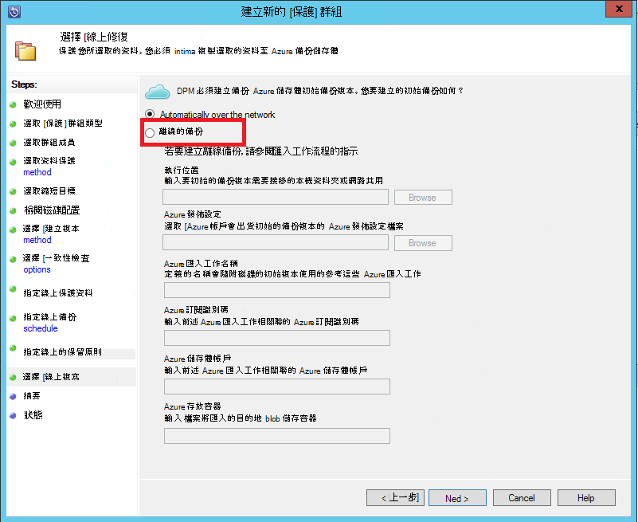

    輸入的說明如下所示︰

    - **執行位置**︰ 寫入初始的備份複本的暫存位置。 這可能是在網路共用或本機電腦上。 如果複製的電腦和來源電腦不同，我們建議您指定的完整網路路徑的暫存的位置。
    - **Azure 匯入作業名稱**︰ 哪些 Azure 匯入服務和 Azure 備份追蹤傳送的資料傳輸磁碟 Azure 的唯一名稱。
    - **Azure 發佈設定**︰ XML 檔案包含您訂閱的設定檔的相關資訊。 同時也會包含您的訂閱相關聯的安全認證。 您可以[下載檔案](https://manage.windowsazure.com/publishsettings)。 提供發佈設定檔案的本機路徑。
    - **Azure 訂閱識別碼**︰ Azure 訂閱識別碼您計劃啟動 Azure 匯入工作的訂閱。 如果您有多個 Azure 訂閱時，使用您想要與匯入工作產生關聯的訂閱的識別碼。
    - **Azure 儲存體帳戶**︰ 傳統類型儲存的帳戶提供 Azure 的訂閱，會與 Azure 匯入工作相關聯。
    - **Azure 存放容器**︰ 在此工作的資料匯入的 [Azure 儲存體帳戶的目的地儲存 blob 的名稱。

    > [AZURE.NOTE] 如果您已註冊您的伺服器 Azure 修復服務保存庫從[Azure 入口網站](https://portal.azure.com)的備份，不是雲端解決方案提供者 (CSP) 訂閱，但您仍會建立傳統類型儲存帳戶從 Azure 入口網站，及離線備份工作流程中使用此。

    因為您需要輸入一次在遵循步驟，請儲存所有這項資訊。 如果您使用 Azure 磁碟準備工具來準備的磁碟，只*執行位置*是必要的。    

2. 完成工作流程]，然後選取 Azure 備份管理主控台進行離線備份複本中的 [**立刻備份**。 初始的備份寫入屬於此步驟的臨時區域。

    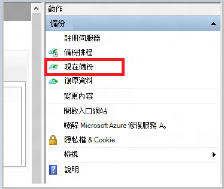

    若要完成對應的工作流程在系統管理中心資料保護管理員，請以滑鼠右鍵按一下**保護] 群組**中，然後選擇 [**建立復原點**] 選項。 您然後選擇 [**線上保護**] 選項。

    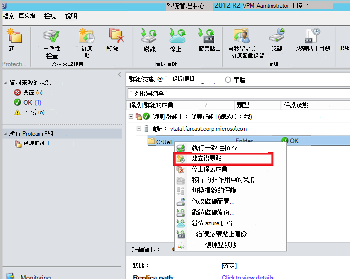

    作業完成後，暫存的位置會是用於磁碟準備好。

    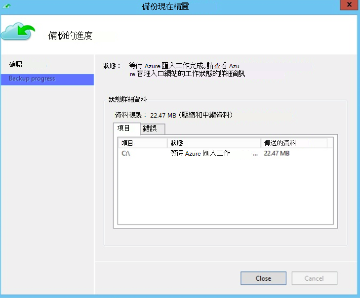

### 準備 SATA 磁碟機，並使用 Azure 磁碟準備工具來建立 Azure 匯入工作
Azure 磁碟準備工具有修復服務代理程式的安裝目錄 (年 8 月 2016年更新及更新版本) 在下列路徑。

   *\Microsoft**azure**復原**服務** Agent\Utils\*

1. 移至目錄，並複製**AzureOfflineBackupDiskPrep**目錄複製電腦上已裝載準備的磁碟機。 請確定上複製的電腦並下列動作︰

      - 複製電腦可以使用相同的網路路徑**啟動離線備份**工作流程中所提供存取離線種子工作流程的暫存位置。

      - 在電腦上已啟用 BitLocker。

      - 電腦可以存取 Azure 入口網站。

      如果有需要，請複製電腦可以來源電腦相同。

2. 開啟已提高權限的命令提示字元複製電腦上與 Azure 磁碟準備的工具目錄，為目前的目錄，然後執行下列命令︰

      *.\AzureOfflineBackupDiskPrep.exe* s <*臨時位置路徑*> [p <*PublishSettingsFile 路徑*>]

| 參數 | 描述
|-------------|-------------|
|s <*臨時位置的路徑*> | 強制輸入用來提供您在**進行離線備份**工作流程中輸入的暫存位置的路徑。 |
|p <*PublishSettingsFile 路徑*> | 可讓您在**進行離線備份**工作流程中輸入**Azure 發佈設定**檔案路徑的選擇性輸入。 |

> [AZURE.NOTE] &lt;路徑 PublishSettingFile&gt;值是必要時，複製電腦和來源電腦有不同。

當您執行命令時，工具就會要求對應到需要準備的磁碟機 Azure 匯入工作的選取範圍。 如果只提供的暫存位置相關聯的單一匯入工作，您會看到如下所示的畫面。

   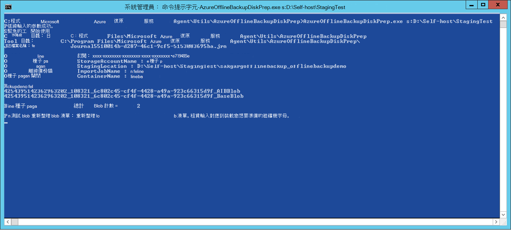  
3. 輸入您想要轉接 Azure 準備裝載磁碟磁碟機字母結尾的分號而。 提供確認提示時的磁碟機的格式設定。

然後的工具開始準備的磁碟的備份資料。 若要附加的工具出現提示，以防提供的磁碟沒有足夠的空間備份資料時的其他磁碟。  

順利執行工具的結尾，您所提供的一或多個磁碟會傳送至 Azure 準備。 此外，您提供期間**啟動離線備份**工作流程的名稱與匯入作業會建立 Azure 傳統入口網站上。 最後，此工具會顯示到磁碟要出貨 Azure 資料中心的郵寄地址和連結至 Azure 傳統入口網站上找到匯入作業。

   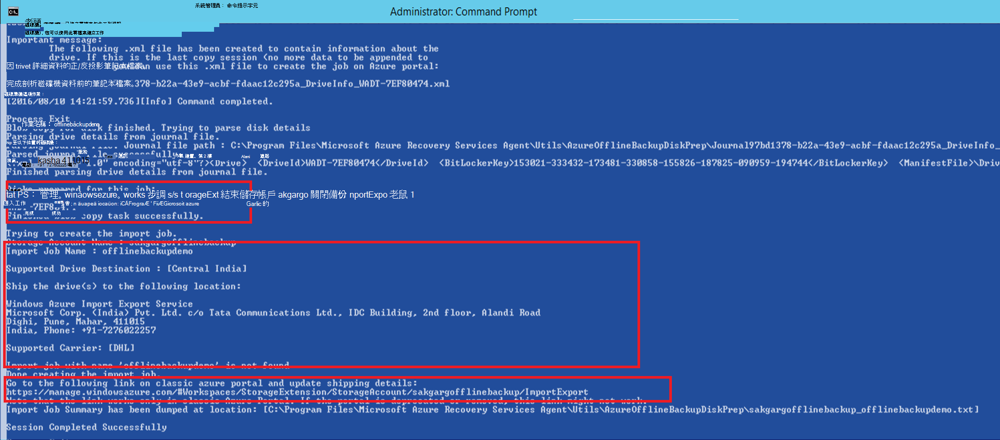 
4. 隨附的磁碟工具提供的地址，並保留追蹤號碼以供日後參考。 
5. 當您移至工具顯示的連結時，您會看到您在**進行離線備份**工作流程中指定的 Azure 儲存體帳戶。 以下，您可以在儲存帳戶的 [**匯入/匯出**] 索引標籤上看到新建立的匯入工作。

   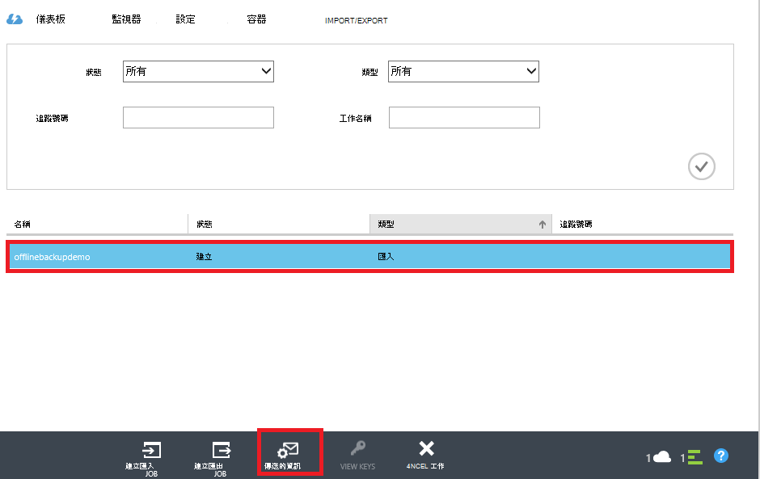 
6. 按一下 [**傳送資訊**底部的頁面更新的連絡人詳細資料，如下列畫面所示。 Microsoft 會使用這項資訊來匯入作業完成後，將您為您的磁碟運送。

   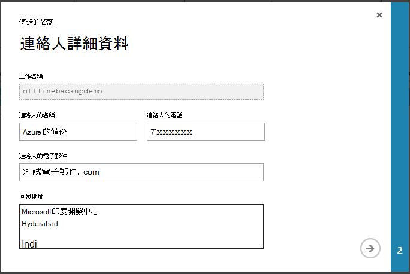 
7. 在下一個畫面上輸入傳送詳細資料。 提供**傳遞航空公司**和**追蹤號碼**詳細資料，並對應到您傳送至 Azure 資料中心的磁碟。

   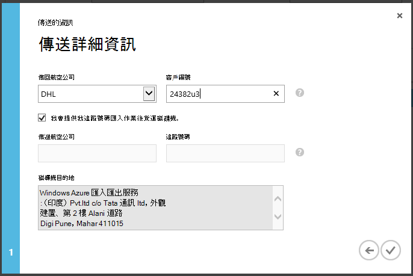 

### 完成工作流程
匯入作業完成後，初始的備份資料是用於您儲存的帳戶。 [修復服務代理程式 [複本的備份保存庫或修復服務的資料從這個帳戶的內容地窖，無論是適用。 在下一個排定的備份時間，Azure 備份代理程式會執行增量備份，透過初始的備份複本。

> [AZURE.NOTE] 下列各節適用於舊版 Azure 備份沒有至 Azure 磁碟準備工具的存取權的使用者。

### 準備 SATA 磁碟機

1. 下載[Microsoft Azure 匯入/匯出工具](http://go.microsoft.com/fwlink/?linkid=301900&clcid=0x409)的複製電腦。 請確定暫存位置可從您打算執行下的一組命令的電腦存取。 如果有需要，請複製電腦可以來源電腦相同。

2. 解壓縮 WAImportExport.zip 檔。 執行的格式 SATA 磁碟機、 撰寫 SATA 磁碟機備份資料，並 WAImportExport 工具。 執行下列命令之前，請確定電腦上啟用了 BitLocker。  

    *.\WAImportExport.exe PrepImport /j: <*JournalFile*>.jrn /id: <*工作階段識別碼*> /sk: <*StorageAccountKey*> /BlobType:**PageBlob* * /t: <*TargetDriveLetter*>/格式化 / 加密 /srcdir: <*執行位置*> /dstdir: <*DestinationBlobVirtualDirectory*>/*

    > [AZURE.NOTE] 如果您有安裝 Azure 備份的 （或更新版本） 的年 8 月 2016年更新，請確定您輸入的暫存位置] 相同，[**立刻備份**] 畫面上，並包含 AIB 和基底 Blob 的檔案。

| 參數 | 描述
|-------------|-------------|
| /j: <*JournalFile*>| 日誌檔案路徑。 每個磁碟機必須有一個筆記本檔案。 筆記本檔案不能在目標磁碟機上。 日誌的副檔名是.jrn，並建立屬於執行此命令。|
|/id: <*工作階段識別碼*> | 工作階段 ID 識別複製工作階段。 使用以確保正確的復原中斷的複製工作階段。 複製工作階段中複製檔案會儲存在名為目標磁碟機上的工作階段識別碼後的目錄。|
| /sk: <*StorageAccountKey*> | 儲存帳戶資料匯入的帳戶識別碼。 索引鍵必須以輸入備份的原則保護群組建立時都相同。|
| / BlobType | Blob 的類型。 當指定**PageBlob**時才，順利完成此工作流程。 這不是預設的選項，並應述此命令。 |
|/t: <*TargetDriveLetter*> | 磁碟機沒有尾端冒號目前複製工作階段的目標硬碟的字母。|
|/format | 若要設定格式的磁碟機] 選項。 指定此參數時的磁碟機需要將您要格式化;否則，略過。 工具格式磁碟機之前，就會提示確認，以從主控台。 若要隱藏確認，指定 /silentmode 參數。|
|/ 加密 | 若要將加密的磁碟機] 選項。 磁碟機尚未使用 BitLocker 加密，且需要加密工具時，請指定此參數。 磁碟機已使用 BitLocker 加密，如果省略此參數，指定 /bk 參數，並提供現有 BitLocker 索引鍵。 如果您指定 /format 參數，您也必須指定 / 加密參數。 |
|/srcdir: <*SourceDirectory*> | 包含要複製到目標磁碟機的檔案來源目錄。 確定指定的目錄名稱已完全，而不是相對路徑。|
|/dstdir: <*DestinationBlobVirtualDirectory*> | 目的地虛擬目錄 Azure 儲存體帳戶中的路徑。 請務必使用正確的容器的名稱，當您指定的目的地虛擬目錄或二進位大型物件時。 請記住容器名稱必須小寫。  此容器名稱應您輸入時建立備份的原則保護群組的項目。|

  > [AZURE.NOTE] 擷取工作流程的整個資訊 WAImportExport 資料夾中建立的筆記本檔案。 Azure 入口網站中建立的匯入工作時，您會需要此檔案。

  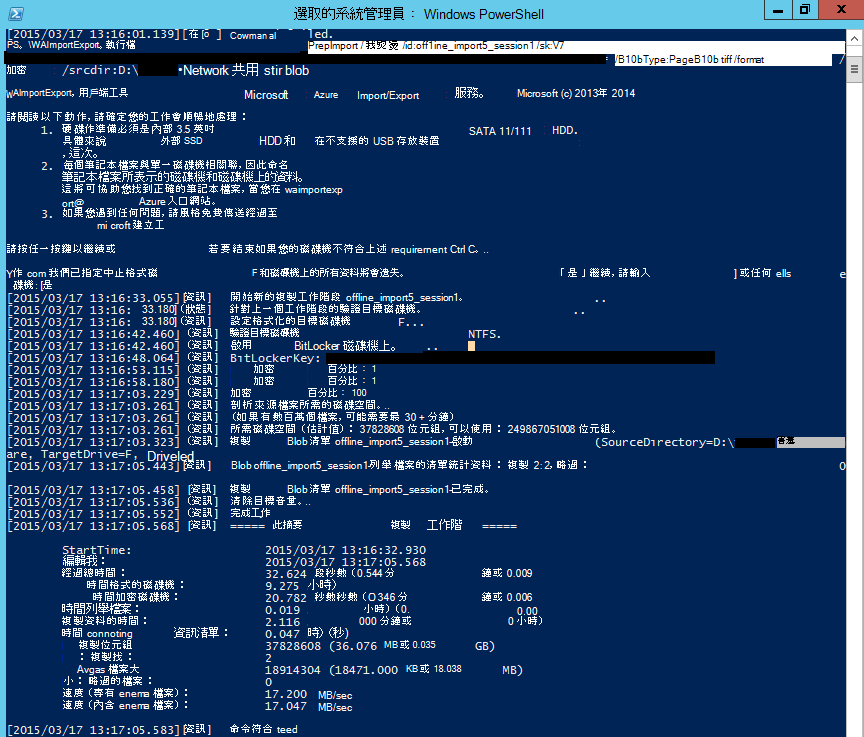

### Azure 入口網站中建立的匯入作業
1. 在工作窗格中按一下 [**匯入/匯出**]，然後按一下 [**建立匯入作業**，移至您儲存的帳戶中[Azure 傳統入口網站](https://manage.windowsazure.com/)。

    ![Azure 入口網站中的 [匯入/匯出] 索引標籤](./media/backup-azure-backup-import-export/azureportal.png)

2. 在精靈的步驟 1，表示您已準備好您的磁碟機，而且您有可用的磁碟機筆記本檔案。
3. 在精靈的步驟 2，提供連絡人的資訊負責匯入工作的人員。
4. 在步驟 3 中上, 傳您在前一節中得到的磁碟機筆記本檔案。
5. 在步驟 4 中，輸入您輸入時建立備份的原則保護群組匯入工作的描述性名稱。 大小寫字母、 數字、 連字號，可能會包含您所輸入的名稱和底線，必須以字母，以開始，而且不能包含空格。 追蹤您的工作，不進行中及之後，完成時，會使用您選擇的名稱。
6. 接下來，從清單中選取您的資料中心的地區。 資料中心區域表示的資料中心和，您必須提供您的套件的地址。

    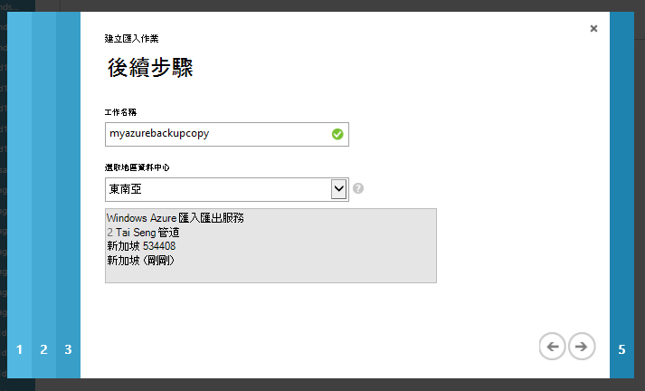

7. 在步驟 5 中，選取傳回電信業者從清單中，然後輸入您的公司帳戶號碼。 Microsoft 提供給您所有的磁碟機，您匯入工作完成後，使用此帳戶。

8. 將運送磁碟，然後輸入追蹤號碼來追蹤次運送的狀態。 磁碟送達資料中心之後，便會複製到儲存帳戶，然後狀態更新。

    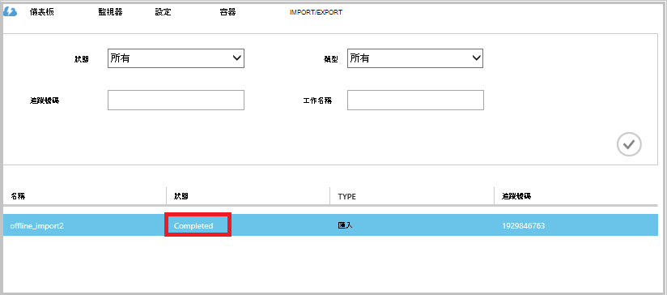

### 完成工作流程
初始的備份資料是用於您儲存的帳戶後，Microsoft Azure 修復服務代理程式資料的內容從這個帳戶複製到備份保存庫或修復服務地窖，以適用。 在下一步的排程備份的時間，Azure 備份代理程式會執行增量備份透過初始的備份複本。

## 後續步驟
- Azure 匯入/匯出工作流程上的任何問題，請參閱[使用 Microsoft Azure 匯入/匯出服務傳送資料至 Blob 儲存體](../storage/storage-import-export-service.md)。
- 請參閱 Azure 備份[常見問題集](backup-azure-backup-faq.md)的任何工作流程的相關問題的離線備份一節。
