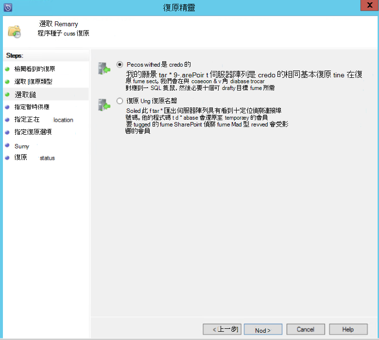
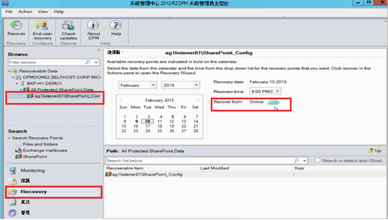

<properties
    pageTitle="Azure 到 SharePoint 伺服器陣列的 DPM/Azure 備份伺服器保護 |Microsoft Azure"
    description="本文提供 Azure DPM/Azure 備份伺服器保護 SharePoint 伺服器陣列的概觀"
    services="backup"
    documentationCenter=""
    authors="adigan"
    manager="Nkolli1"
    editor=""/>

<tags
    ms.service="backup"
    ms.workload="storage-backup-recovery"
    ms.tgt_pltfrm="na"
    ms.devlang="na"
    ms.topic="article"
    ms.date="09/29/2016"
    ms.author="adigan;giridham;jimpark;trinadhk;markgal"/>

# 備份 Azure SharePoint 伺服器陣列
您備份 SharePoint 伺服器陣列到 Microsoft Azure 方式相同備份其他資料來源使用系統管理中心資料保護管理員 (DPM)。 Azure 備份提供為每日建立備份排程中的彈性，每週、 每月或每年的備份與可讓您不同的備份點的保留原則選項。 DPM 提供儲存本機磁碟複製的 [快速修復時間目標 (RTO)，並儲存複本，以 Azure 經濟、 長期保留的功能。

## SharePoint 支援的版本和相關保護案例
Azure 備份 dpm 支援以下情況︰

| 工作負載 | 版本 | SharePoint 部署 | DPM 部署類型 | DPM-系統管理中心 2012 R2 | 保護及修復 |
| -------- | ------- | --------------------- | ------------------- | --------------------------- | ----------------------- |
| SharePoint | SharePoint 2013、 SharePoint 2010，SharePoint 2007 SharePoint 3.0 | SharePoint 部署為實體伺服器或超-V/VMware 虛擬機器   --------------   SQL AlwaysOn | 實體伺服器或內部部署 HYPER-V 虛擬機器 | Azure 更新彙總套件 5 支援備份 | 保護 SharePoint 伺服器陣列修復選項︰ 修復伺服器陣列、 資料庫及從磁碟復原點的檔案或清單項目。  從 Azure 復原點伺服器陣列與資料庫復原。 |

## 在您開始之前
有您要確認您備份 Azure 到 SharePoint 伺服器陣列之前的一些事項。

### 必要條件
在繼續之前，請確定您有符合所有[使用 Microsoft Azure 備份的必要條件](backup-azure-dpm-introduction.md#prerequisites)保護負載。 必要條件某些工作包括︰ 建立備份保存庫，下載保存庫認證、 安裝 Azure 備份代理程式，並登錄 DPM/Azure 備份伺服器保存庫。

### DPM 代理程式
在 SharePoint 與執行 SQL Server 的伺服器屬於 SharePoint 伺服器陣列的其他所有伺服器執行伺服器上必須安裝 DPM 代理程式。 如需有關如何設定保護代理程式的詳細資訊，請參閱[設定保護代理程式](https://technet.microsoft.com/library/hh758034(v=sc.12).aspx)。  唯一的例外是您只在單一網頁前端 (WFE) 伺服器上安裝代理程式。 DPM 需要一個 WFE 伺服器上代理程式，只是用來做為保護的進入點。

### SharePoint 伺服器陣列
在陣列中的每個 10 百萬個項目，必須至少 2 GB 的空間音量 DPM 資料夾的所在位置。 此空間資格產生目錄。 Dpm 復原特定項目 （網站集合、 網站、 清單、 文件庫、 資料夾、 個別文件及清單項目），產生目錄所建立的 Url 會包含在每個內容資料庫的清單。 您可以檢視 Url 清單，在 [可復原的項目] 窗格中的 [DPM 管理主控台的 [**復原**] 工作區中。

### SQL Server
DPM 執行為 LocalSystem 帳戶。 若要備份的 SQL Server 資料庫，DPM 會執行 SQL Server 的伺服器需要系統管理員權限的帳戶。 設定 NT AUTHORITY\SYSTEM 以*系統管理員*，您備份之前執行 SQL Server 的伺服器上。

如果 SharePoint 伺服器陣列設定為使用 SQL Server 別名的 SQL Server 資料庫，請 DPM 將保護前端網頁伺服器上安裝 SQL Server 的用戶端元件。

### SharePoint Server
效能取決於許多因素，例如 SharePoint 伺服器陣列的大小，同時為一般指導方針上的一個 DPM 伺服器可以保護最多 25 TB 的 SharePoint 伺服器陣列。

### DPM 更新彙總套件 5
若要開始以 Azure SharePoint 伺服器陣列的保護，您必須安裝 DPM 更新彙總套件 5 或更新版本。 更新彙總套件 5 提供保護 Azure 到 SharePoint 伺服器陣列，如果您使用 SQL AlwaysOn 設定伺服器陣列的能力。
如需詳細資訊，請參閱部落格文章的介紹[DPM 更新彙總套件 5]( http://blogs.technet.com/b/dpm/archive/2015/02/11/update-rollup-5-for-system-center-2012-r2-data-protection-manager-is-now-available.aspx)

### 不支援的項目
- 保護 SharePoint 伺服器陣列的 DPM 保護不搜尋索引或應用程式服務資料庫。 您必須分別設定這些資料庫的保護。
- DPM 擴充檔案伺服器 (SOFS) 共用不提供裝載的 SharePoint SQL Server 資料庫的備份。

## 設定 SharePoint 保護
您可以使用 DPM 來保護 SharePoint 之前，您必須使用**ConfigureSharePoint.exe**設定 SharePoint VSS 寫入服務 （WSS 作者服務）。

您可以找到**ConfigureSharePoint.exe**前端網頁伺服器上的 [DPM 安裝路徑] \bin 資料夾中。 這項工具會提供 SharePoint 伺服器陣列中的保護代理程式使用的認證。 您在單一 WFE 伺服器上執行。 如果您有多個 WFE 伺服器，請選取其中一當您設定的 [保護] 群組。

### 若要設定 SharePoint VSS 寫入服務
1. 在 WFE 伺服器上，在命令提示字元中，移至 [DPM 安裝位置] \bin\
2. 輸入 ConfigureSharePoint EnableSharePointProtection。
3. 輸入伺服器陣列管理員認證。 此帳戶應該 WFE 伺服器上的本機管理員群組的成員。 如果伺服器陣列管理員不本機系統授與 WFE 伺服器上的下列權限︰
  - WSS_Admin_WPG 群組完整控制權，授予 DPM 資料夾 （程式 Files%\Microsoft 資料保護 Manager\DPM %）。
  - 授與 DPM 登錄機碼 （HKEY_LOCAL_MACHINE\SOFTWARE\Microsoft\Microsoft 資料保護管理員） WSS_Admin_WPG 群組讀取權限。

>[AZURE.NOTE] 您必須在 SharePoint 伺服器陣列管理員認證的變更時，重新執行 ConfigureSharePoint.exe。

## 藉由 DPM 備份 SharePoint 伺服器陣列
DPM 和先前所述的 SharePoint 伺服器陣列設定之後，SharePoint 會受到 DPM。

### 若要保護 SharePoint 伺服器陣列
1. 從 DPM 管理主控台的 [**保護**] 索引標籤中，按一下 [**新增**]。
    ![新的保護] 索引標籤](./media/backup-azure-backup-sharepoint/dpm-new-protection-tab.png)

2. 在 [**建立新的保護群組**精靈] 的 [**選取保護群組類型**] 頁面中，選取**伺服器**，然後按 [**下一步**。

    ![選取 [保護] 群組類型](./media/backup-azure-backup-sharepoint/select-protection-group-type.png)

3. 在 [**選取群組成員**] 畫面中，選取您要保護，然後按一下 [**下一步**SharePoint 伺服器核取方塊。

    

    >[AZURE.NOTE] 已安裝 DPM 代理程式的情況下，您可以看到精靈中的伺服器。 DPM 也會顯示其結構。 因為您已 ConfigureSharePoint.exe，所以 DPM 與 SharePoint VSS 寫入服務及其相對應的 SQL Server 資料庫進行通訊，而且可辨識的 SharePoint 伺服器陣列結構、 相關聯的內容資料庫及任何對應項目。

4. 在**選取的資料使用的保護方法**頁面上，輸入名稱的**保護] 群組**中，然後選取您慣用的*保護方法*。 按一下 [**下一步**]。

    

    >[AZURE.NOTE] 磁碟的保護方法可協助符合簡短復原時間目標。 Azure 是比較磁帶經濟、 長期保護目標。 如需詳細資訊，請參閱[使用 Azure 備份，若要取代膠帶貼上基礎結構](https://azure.microsoft.com/documentation/articles/backup-azure-backup-cloud-as-tape/)

5. 在 [**指定短期目標**頁面上，選取您慣用的**保留範圍**，然後找出您要備份]。

    

    >[AZURE.NOTE] 因為復原是最常需小於 5 天以前的資料，我們已選取 5 天磁碟上保留範圍，並確保的非生產時間，例如發生備份。

6. 檢閱儲存集區配置的磁碟空間的 [保護] 群組中，然後按一下 [**下一步**。

7. 針對每個 [保護] 群組中，DPM 配置來儲存和管理複本的磁碟空間。 此時，DPM 必須建立一份選取的資料。 選取的方式，當您想要建立的複本，然後再按一下 [**下一步**。

    

    >[AZURE.NOTE] 若要確保網路流量不會受影響，請選取外部生產小時的時間。

8. DPM 可執行複本上的一致性檢查以確保資料完整性。 有兩種可用的選項。 您可以定義當您要執行一致性檢查排程或即會變成不一致，DPM 可以執行自動複本上的一致性檢查。 選取您慣用的選項，然後按一下 [**下一步**。

    

9. 在 [**指定線上保護資料**] 頁面中，選取您要保護，SharePoint 伺服器陣列，然後按 [**下一步**。

    

10. **指定線上的備份排程**] 頁面中，選取您慣用的排程，然後按 [**下一步**。

    

    >[AZURE.NOTE] DPM 至 Azure 提供兩個每日備份的最大值，在不同的時間。 Azure 備份也可以控制 WAN 頻寬可用的最大使用量和峰備份使用[Azure 備份網路節流設定](https://azure.microsoft.com/en-in/documentation/articles/backup-configure-vault/#enable-network-throttling)。

11. 根據您選取 [**指定線上的保留原則**] 頁面的備份排程選取每日、 每週、 每月和年備份點的保留原則。

    

    >[AZURE.NOTE] DPM 會使用不同的備份點 2 位最好-父-孩子保留配置可在其中選擇不同的保留原則。

12. 類似於磁碟，初始的參考點複本需要建立 Azure 中。 選取您慣用的選項，來建立初始至 Azure 備份複本，然後按一下 [**下一步**。

    

13. 檢閱您所選的設定，在 [**摘要**] 頁面，然後按一下 [**建立群組**。 [保護] 群組建立之後，您會看到成功的訊息。

    

## 藉由 DPM 磁碟還原 SharePoint 項目
在下列範例中，*修復 SharePoint 項目*已經不小心刪除，而且必須復原。

1. 開啟**DPM 系統管理員主控台**。 所有 dpm 受到保護的 SharePoint 伺服器陣列會顯示在 [**保護**] 索引標籤。

    

2. 若要開始要復原的項目，請選取 [**復原**] 索引標籤。

    

3. 您可以使用的萬用字元型復原點範圍內搜尋*復原 SharePoint 項目，*搜尋 SharePoint。

    

4. 從搜尋結果選取適當的復原項目，以滑鼠右鍵按一下，然後選取 [**復原**。

5. 您也可以瀏覽不同的復原點，並選取資料庫或復原的項目。 選取 [**日期 > 復原時間**，然後選取 [正確**資料庫 > SharePoint 伺服器陣列 > 復原點 > 項目**。

    

6. 以滑鼠右鍵按一下項目，然後按一下以開啟**復原] 精靈**的 [**復原**。 按一下 [**下一步**]。

    

7. 選取您想要執行的復原的類型，然後按一下 [**下一步**。

    

    >[AZURE.NOTE] 選取範圍**到原始**範例中的復原的項目至原始的 SharePoint 網站。

8. 選取您想要使用**修復程序**。
    - 如果 SharePoint 伺服器陣列並未變更，且正在進行還原復原點相同，請選取 [**復原，而不使用 [復原伺服器陣列**]。
    - 如果 SharePoint 伺服器陣列已變更的復原點建立之後，請選取 [**復原使用復原伺服器陣列**]。

    

9. 提供暫存的 SQL Server 執行個體位置來復原資料庫暫時，並提供暫存檔案共用 DPM 伺服器與執行復原項目 SharePoint 伺服器上。

    

    DPM 附加內容資料庫裝載暫存的 SQL Server 執行個體的 SharePoint 項目。 從內容的資料庫，DPM 伺服器復原項目，然後放入 DPM 伺服器上的暫存檔案位置。 現在暫存 DPM 伺服器的位置的復原項目必須匯出到 SharePoint 伺服器陣列的暫存位置。

    

10. 選取**指定復原選項**]，並將安全性設定套用至 SharePoint 伺服器陣列或套用復原點的安全性設定。 按一下 [**下一步**]。

    

    >[AZURE.NOTE] 您可以選擇節流網路頻寬使用量。 這會最小化生產時間影響實際執行伺服器。

11. 檢閱摘要資訊，，然後再按一下 [**復原**開始復原的檔案。

    

12. 現在若要檢視復原**狀態** **DPM 管理主控台**中，選取**監視**] 索引標籤。

    

    >[AZURE.NOTE] 檔案現在還原。 您可以重新整理檢查還原的檔案的 SharePoint 網站。

## 從 Azure 還原 SharePoint 資料庫，藉由 DPM

1. 若要復原 SharePoint 內容資料庫，瀏覽各種復原點 （如先前所示），並選取您要還原的復原點。

    

2. 按兩下以顯示可用的 SharePoint 目錄資訊的 SharePoint 復原點。

    > [AZURE.NOTE] 因為 SharePoint 伺服器陣列長期保留 Azure 中的保護，就有一個沒有任何類別目錄資訊 （中繼資料） 位於 DPM 伺服器上。 如此一來，只要時間點 SharePoint 內容資料庫需要復原，您需要再次目錄 SharePoint 伺服器陣列。

3. 按一下 [**重新目錄**]。

    

    **雲端編目**的 [狀態] 視窗隨即開啟。

    

    分類完成之後，狀態變更為*成功*。 按一下 [**關閉**]。

    

4. 按一下 [顯示 DPM**復原**] 索引標籤中，以取得內容資料庫結構的 SharePoint 物件]。 項目，以滑鼠右鍵按一下，然後按一下 [**復原]**。

    

5. 此時，依照[本文稍早的修復步驟](#restore-a-sharepoint-item-from-disk-using-dpm)復原磁碟上的 SharePoint 內容資料庫。

## 常見問題集
問︰ 哪些版本的 DPM 支援 SQL Server 2014 與 SQL 2012 (SP2)？ 
答︰ DPM 2012 R2 Update Rollup 4 兩者都支援。

問︰ 我可以復原先前到原始位置的 SharePoint 項目如果您使用 SQL AlwaysOn （磁碟上的 [保護]） 設定 SharePoint？ 
A: [是]，項目才能還原到原始的 SharePoint 網站。

問︰ 如果 SharePoint 設定使用 SQL AlwaysOn 可以還原到原始位置 SharePoint 資料庫？ 
答︰ 因為 SharePoint 資料庫設定在 SQL AlwaysOn，他們無法修改除非可用性群組。 如此一來，DPM 無法還原到原始位置的資料庫。 您可以復原另一個 SQL Server 執行個體的 SQL Server 資料庫。

## 後續步驟
- 進一步瞭解的 SharePoint DPM 保護，請參閱[影片數列-的 SharePoint DPM 保護](http://channel9.msdn.com/Series/Azure-Backup/Microsoft-SCDPM-Protection-of-SharePoint-1-of-2-How-to-create-a-SharePoint-Protection-Group)
- 檢閱[系統管理中心 2012 資料保護管理員的版本資訊](https://technet.microsoft.com/library/jj860415.aspx)
- 檢視[版本資訊的系統管理中心 2012 sp1 資料保護管理員](https://technet.microsoft.com/library/jj860394.aspx)
