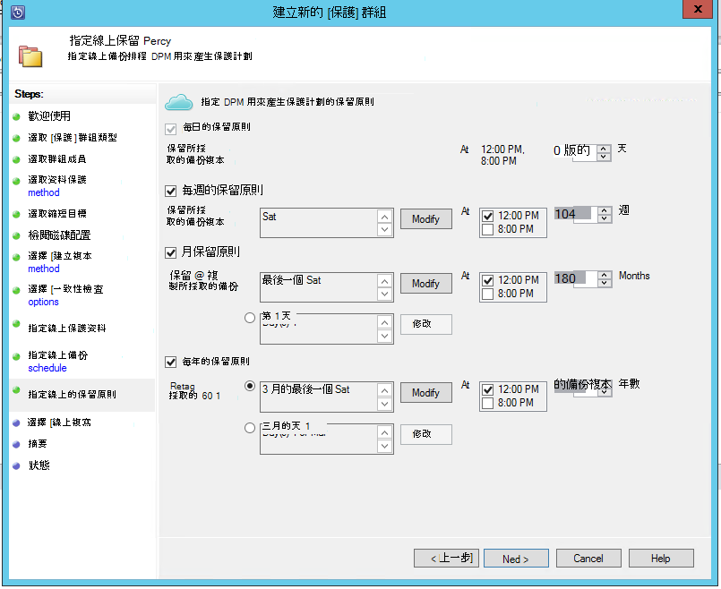

<properties
    pageTitle="使用 DPM 的 SQL Server 工作負載的 azure 備份 |Microsoft Azure"
    description="若要使用的 Azure 備份服務的 SQL Server 資料庫備份簡介"
    services="backup"
    documentationCenter=""
    authors="adigan"
    manager="Nkolli1"
    editor=""/>

<tags
    ms.service="backup"
    ms.workload="storage-backup-recovery"
    ms.tgt_pltfrm="na"
    ms.devlang="na"
    ms.topic="article"
    ms.date="09/27/2016"
    ms.author="adigan;giridham; jimpark;markgal;trinadhk"/>

# Azure 使用 DPM 的 SQL Server 工作負載的備份

本文會引導您完成設定步驟，使用 Azure 備份的 SQL Server 資料庫的備份。

若要備份 Azure SQL Server 資料庫，必須 Azure 帳戶。 如果您沒有帳戶，您可以建立的免費的試用帳戶中只需幾分鐘。 如需詳細資訊，請參閱[Azure 免費試用版](https://azure.microsoft.com/pricing/free-trial/)。

Azure 並修復 azure SQL Server 資料庫備份的管理包含三個步驟︰

1. 建立備份原則以保護 Azure SQL Server 資料庫。
2. 建立備份 Azure 視。
3. 從 Azure 復原資料庫。

## 在您開始之前
在開始之前，請確定已符合所有的[先決條件](../backup-azure-dpm-introduction.md#prerequisites)保護負載使用 Microsoft Azure 備份。 必要條件例如涵蓋工作︰ 建立備份保存庫，下載保存庫認證、 安裝 Azure 備份代理程式，並保存庫註冊伺服器。

## 建立備份原則以保護 Azure SQL Server 資料庫

1. 在 DPM 伺服器上，按一下 [**保護**工作區。

2. 在工具功能區中，按一下 [**新增**]，建立新的 [保護] 群組。

    ![建立 [保護] 群組](./media/backup-azure-backup-sql/protection-group.png)

3. DPM 顯示 [開始] 畫面的指引來建立**保護] 群組**。 按一下 [**下一步**]。

4. 選取 [**伺服器**]。

    ![選取保護群組類型的 [伺服器]](./media/backup-azure-backup-sql/pg-servers.png)

5. 展開 [SQL Server 電腦備份資料庫有的何處。 DPM 會顯示您可以從該伺服器備份的各種資料來源。 展開**所有 SQL 共用**並選取要備份的資料庫 （在此情況下我們已選取 ReportServer$ MSDPM2012 和 ReportServer$ MSDPM2012TempDB）。 按一下 [**下一步**]。

    

6. 提供 [保護] 群組的名稱，然後選取**我想線上保護**核取方塊。

    

7. 在 [**指定短期目標**] 畫面中，包含建立備份指向磁碟的必要輸入。

    以下我們看到的**保留範圍**設定為*5 天*，**同步處理頻率**會設定為一次每*15 分鐘*這是用以備份的頻率。 **Express 完整備份**已設為*8:00 P.M.*。

    

    >[AZURE.NOTE] 在 （根據畫面輸入） 8:00 PM 備份的點會建立每天前一天的 8:00 PM 備份點轉接已經修改的資料。 此程序稱為**Express 完整的備份**。 交易記錄會同步處理時每 15 分鐘，如果有資料庫復原 9:00 PM – 時的需求，然後點由重新顯示最近記錄 express 完整備份點 (在本例中為 8 pm)。

8. 按一下 [**下一步**

    DPM 顯示整體的儲存空間和潛在的磁碟空間使用。

    

    根據預設，DPM 會建立一個大量每個資料來源 （SQL Server 資料庫） 用於初始的備份複本。 使用此方法，邏輯磁碟管理員 (LDM) 限制 DPM 保護到 300 的資料來源 （SQL Server 資料庫）。 若要解決此限制，請選取**共同找出 DPM 儲存集區中的資料**，選項。 如果您使用這個選項，DPM 使用單一的大量的多個資料來源，可讓 DPM 保護最多 2000 個 SQL 資料庫。

    如果已選取**自動放大區**的選項，DPM 可以帳戶來提高備份調整音量，當生產資料規模擴大時。 如果沒有選取**區來自動放大**的選項，DPM 限制備份用來保護] 群組中的資料來源的儲存空間。

9. 系統管理員已授予避免頻寬壅塞轉接此初始的備份，以手動方式 （關閉網路） 或在網路上的選擇。 他們也可以設定的初始傳輸就會發生的時間。 按一下 [**下一步**]。

    

    初始的備份複本需要整個資料來源 （SQL Server 資料庫） 從傳輸生產伺服器 （SQL Server 電腦） 到 DPM 伺服器。 此資料可能是大，並將資料傳送到網路可能會超過頻寬。 如此一來，系統管理員可以選擇傳送初始備份︰**手動**（使用卸除式媒體） 若要避免頻寬壅塞，或**在網路上的自動**（在指定的時間）。

    一旦完成初始備份，其餘的備份是累加備份初始的備份複本。 增量備份多小，並輕鬆地在網路上傳輸。

10. 選擇 [當您想要的一致性檢查執行，然後按一下 [**下一步**]。

    

    DPM 可以執行的一致性檢查核取備份點的完整性。 它會計算 DPM 在該檔案的備份檔案生產伺服器 （在這個案例中的 SQL Server 電腦） 和備份資料的總和。 有衝突，則假設 DPM 的備份檔案已損毀。 DPM 改正藉由傳送對應至檢查值不相符的區塊了備份資料。 一致性檢查是效能密切作業，為系統管理員具有排程的一致性檢查或自動執行的選項。

11. 若要指定資料來源的線上保護，選取 [資料庫至 Azure 會受到保護，按一下 [**下一步**]。

    

12. 管理員可以選擇備份的排程和符合其公司原則的保留原則。

    

    在此範例中，進行備份一天在 12:00 PM 和 8 PM （底部的螢幕）

    >[AZURE.NOTE] 最好快速復原磁碟上有幾個這是短期的復原點。 「 操作復原 」 會使用這些復原點。 Azure 做為好離站位置較高的 Sla 使用，而且保證有空。

    **最佳作法**︰ 請務必使用 DPM 本機磁碟備份完成之後，排定 Azure 備份。 這可讓最新的磁碟備份，複製到 Azure。

13. 選擇 [保留原則排程]。 在[使用 Azure 備份，若要取代您膠帶貼上的基礎結構文章](backup-azure-backup-cloud-as-tape.md)提供的保留原則的運作方式的詳細資料。

    

    在此範例中︰

    - 備份 12:00 PM，8 PM （底部畫面的一部分） 是一天，並保留 180 天。
    - 在 12:00 P.M.星期六備份 保留 104 週
    - 在最後一個星期六 12:00 p.m.備份 保留 60 個月
    - 在最後一個星期六 12:00 P.M.3 月的備份 保留 10 的年數

14. 按一下 [**下一步**，然後選取適當的選項，將初始的備份複本傳輸至 Azure。 您可以選擇**自動透過網路**或**離線備份**。

    - **在網路上的自動**將備份資料傳輸至 Azure，依照選擇備份的排程。
    - **離線備份**的運作方式會說明在[中 Azure 備份的離線備份工作流程](backup-azure-backup-import-export.md)。

    選擇 [相關傳輸機制將初始的備份複本傳送給 Azure，然後按一下 [**下一步**]。

15. 一旦您檢閱原則的詳細資料**摘要**] 畫面中，按一下 [**建立群組**] 按鈕，以完成工作流程。 您可以按一下 [**關閉**] 按鈕，並監控監控工作區中的工作進度。

    ![建立的 [保護] 群組中的進度](./media/backup-azure-backup-sql/pg-summary.png)

## 指定備份的 SQL Server 資料庫
上述步驟建立備份的原則，而只在第一個備份發生時，才建立 「 復原點 」。 而不是等待開始進行排程器，觸發程序建立復原下列步驟手動點。

1. 保護] 群組中的狀態顯示**[確定]**資料庫建立復原點之前等待。

    

2. 以滑鼠右鍵按一下資料庫，然後選取 [**建立復原點**。

    

3. 在下拉式功能表中選擇**線上保護**，然後按一下**[確定**]。 這會建立的復原點啟動 Azure 中。

    

4. 您可以檢視您可以在此找到進行中**監控**工作區中的工作進度類似下圖中所述的工作。

    

## 從 Azure 復原 SQL Server 資料庫
下列步驟，才能從 Azure 復原受保護的實體 （SQL Server 資料庫）。

1. 開啟 DPM 伺服器管理主控台。 瀏覽至您可以在這裡看見 dpm 備份伺服器的**復原**工作區。 瀏覽到所需的資料庫 （在此案例 ReportServer$ MSDPM2012)。 選取以**線上****修復**時間。

    

2. 以滑鼠右鍵按一下 [資料庫名稱，然後按一下 [**復原**]。

    

3. DPM 顯示復原點的詳細資料。 按一下 [**下一步**]。 若要覆寫資料庫，請選取**還原到原始 SQL Server 執行個體**復原類型。 按一下 [**下一步**]。

    

    在此範例中，DPM 可讓資料庫復原到另一個 SQL Server 執行個體或獨立網路資料夾。

4. 在 [**指定復原選項**] 畫面中，您可以選取來調使用復原的頻寬例如網路頻寬使用節流復原選項。 按一下 [**下一步**]。

5. 在 [**摘要**] 畫面中，您會看到所有目前提供的復原設定。 按一下 [**復原**]。

    復原狀態顯示要復原的資料庫。 您可以按一下 [**關閉**] 以關閉精靈，並**監控**工作區中檢視的進度。

    

    一旦復原完成之後，還原的資料庫是一致的應用程式。

### 後續步驟︰

• [Azure 備份的常見問題集](backup-azure-backup-faq.md)
