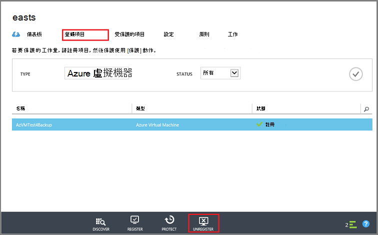
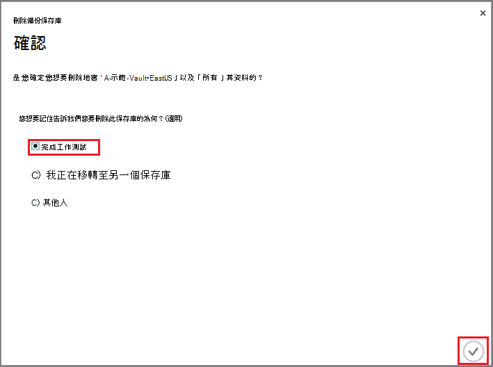

<properties
   pageTitle="刪除 Azure 備份保存庫 |Microsoft Azure"
   description="如何刪除 Azure 備份保存庫。 您無法刪除備份保存庫的原因進行疑難排解。 "
   services="service-name"
   documentationCenter="dev-center-name"
   authors="markgalioto"
   manager="cfreeman"
   editor=""/>

<tags
   ms.service="backup"
   ms.devlang="na"
   ms.topic="article"
   ms.tgt_pltfrm="na"
   ms.workload="storage-backup-recovery"
   ms.date="08/29/2016"
   ms.author="markgal;trinadhk"/>

# 刪除 Azure 備份保存庫

Azure 備份服務有兩種類型的保存庫-備份保存庫及修復服務保存庫。 備份保存庫已預先第一個項目。 然後修復服務保存庫以往支援展開的資源管理員部署。 由於展開的功能，必須儲存在保存庫資訊相依性刪除修復服務保存庫看起來似乎比必須是。

|**部署類型**|**入口網站**|**保存庫的名稱**|
|--------------|----------|---------|
|傳統|傳統|備份保存庫|
|資源管理員|Azure|復原服務保存庫|

> [AZURE.NOTE] 備份保存庫無法保護資源管理員部署解決方案。 不過，您可以使用復原服務保存庫來保護傳統上部署的伺服器和 Vm。  

本文中，我們使用字詞，保存庫，參照的備份保存庫或修復服務保存庫一般的表單。 我們使用正式的名稱、 備份保存庫或修復服務保存庫中，若要區別保存庫必要時。

## 刪除修復服務保存庫

刪除修復服務保存庫程序只有步驟-*提供保存庫不含任何資源*。 您可以刪除修復服務保存庫之前，您就必須移除或刪除保存庫中的所有資源。 如果您嘗試刪除含有資源保存庫，您會看到類似下列圖像的錯誤。

  

此鍵，直到您清除 [從保存庫的資源，按一下 [**重試**產生相同的錯誤。 如果您停在此錯誤訊息，請按一下 [**取消**，請遵循下列步驟來刪除修復服務保存庫中的資源。

### 移除保護 VM 保存庫中的項目

如果您已經開啟修復服務保存庫，請跳至第二個步驟。

1.  開啟 Azure 入口網站，然後從儀表板中，開啟您想要刪除保存的庫。

    如果您沒有修復服務保存庫釘選到儀表板，在中心] 功能表中，按一下 [**更多服務**]，然後在資源的清單中，輸入 [**修復服務**。 當您開始輸入，清單篩選是根據您輸入。 按一下 [**修復服務保存庫**]。

      

    修復服務保存庫的清單會顯示。 從清單中，選取您想要刪除保存的庫。

    

2. 在 [保存庫] 檢視中，查看 [**基本資訊**] 窗格。 若要刪除保存庫，不能有任何受保護的項目。 如果您看到的數字不是零，**備份的項目**] 或 [**備份管理伺服器**] 之下，您就必須先您可以刪除保存庫移除這些項目。

    

    Vm 檔案或資料夾視為備份的項目，並列出 Essentials] 窗格的 [**備份的項目**] 區域中。 DPM 伺服器會列在 [基本資訊] 窗格的 [**備份管理伺服器**] 區域。 **複製項目**與 Azure 網站復原服務。

3. 若要開始從保存庫移除受保護的項目，請在保存庫中尋找的項目。 在保存庫儀表板按一下 [**設定**]，然後按一下以開啟該刀**備份的項目**。

    

    **備份的項目**刀有另一個清單，根據項目類型︰ Azure 虛擬機器或檔案資料夾 （請參閱圖像）。 顯示 [預設項目類型] 清單會是 Azure 虛擬機器。 若要檢視保存庫中的檔案資料夾的項目清單，請從下拉式功能表選取**檔案資料夾**。

4. 您可以刪除保護 VM 保存庫中的項目之前，您必須停止的項目備份工作，並刪除復原點資料。 保存庫中的每個項目，請遵循下列步驟︰

    。 在**備份的項目**刀中，以滑鼠右鍵按一下項目，然後從操作功能表中，選取 [**停止備份**。

    

    停止備份刀隨即會開啟。

    b。 **停止備份**刀，在 [**選擇選項**] 功能表中，選取 [**刪除備份資料**> 輸入項目的名稱 > 然後按一下 [**停止備份**。

      輸入要確認您要刪除的項目名稱。 此鍵，直到您確認要停止的項目，不會啟動 [**停止備份**] 按鈕。 如果您沒有看到 [輸入備份的項目名稱] 對話方塊，您已選擇 [**保留備份資料**] 選項。

    

      或者，您也可以提供為什麼您要刪除的資料，以及新增註解的理由。 按一下 [**停止備份**之後，允許刪除作業完成後，嘗試刪除保存庫。 若要確認已完成的工作，請核取 Azure 郵件。  
   完成工作之後，您會收到訊息，表示已停止備份程序和備份資料已刪除的項目。

    c。 刪除清單中，按一下 [**備份的項目**] 功能表中的項目後，按一下 [查看剩餘的項目保存庫中的 [**重新整理**]。

      

      當清單中沒有任何項目時，捲動至備份保存庫刀的**基本功能**窗格。 不應會有任何**備份的項目**、**備份管理伺服器**或**複寫項目**。 如果保存庫中的項目仍然出現，請回到步驟 3，然後選擇不同的項目類型] 清單。  

5. 當沒有保存庫工具列中的多個項目時，請按一下 [**刪除**]。

    

6. 要求確認您要刪除保存庫，請按一下 [**是**]。

    保存庫刪除的郵件，且入口網站會**新增**[服務] 功能表。

## 如果已停止備份程序，而保留資料，該怎麼辦？

如果您停止備份程序，但不小心*保留*資料，您必須先刪除備份資料之前，您可以刪除保存庫。 若要刪除的備份資料︰

1. 在**備份的項目**刀中，以滑鼠右鍵按一下項目，然後在快顯功能表上，按一下 [**刪除備份資料**。

    

    **刪除備份資料**刀隨即會開啟。

2. 在**刪除備份資料**刀中，輸入名稱的項目，然後按一下 [**刪除**]。

    

    一旦您已刪除的資料，請移至步驟 4 c 上述，然後繼續處理程序。

## 刪除用來保護 DPM 伺服器保存庫

您可以刪除用來保護 DPM 伺服器保存庫前，您必須清除所建立的任何復原點，然後再移除註冊從保存庫伺服器。

若要刪除保護群組相關聯的資料︰

1. 在 DPM 管理主控台中，按一下 [**保護**] 選取 [保護] 群組，保護群組成員，，然後選取 [工具] 功能區中按一下 [**移除**。 您必須選取 [**移除**] 按鈕出現在 [工具] 功能區中的成員。 在範例中，成員屬於是**dummyvm9**。 如果 [保護] 群組中有多個成員，請按住 Ctrl 鍵以選取多個成員。

    

    [**停止保護**] 對話方塊隨即開啟。

2. 在 [**停止保護**] 對話方塊中，選取 [**刪除受保護的資料**，然後按一下 [**停止保護**]。

    

    您不想保留受保護的資料，因為您需要清除保存庫，以將其刪除。 根據多少復原點和多少資料是在 [保護] 群組中，可能需要任何一處從幾秒鐘幾分鐘的時間刪除資料。 [**停止保護**] 對話方塊在工作完成時，會顯示狀態。

    

3. 所有的 [保護] 群組中的所有成員繼續此程序。

    您必須移除所有受保護的資料，並保護群組。

4. 從 [保護] 群組中刪除所有成員之後, 切換 Azure 入口網站。 開啟保存庫儀表板，並確定沒有**備份的項目**、**備份管理伺服器**或**複寫項目**。 在 [保存庫] 工具列上，按一下 [**刪除**。

    

    如果有註冊保存庫的備份管理伺服器，您無法刪除保存庫，即使沒有保存庫中的資料。 如果您認為您先前已經刪除保存庫，相關聯的備份管理伺服器，但仍有顯示在**基本功能**窗格中的伺服器，請參閱[尋找您註冊保存庫的備份管理伺服器](backup-azure-delete-vault.md#find-the-backup-management-servers-registered-to-the-vault)。

5. 要求確認您要刪除保存庫，請按一下 [**是**]。

    保存庫刪除的郵件，且入口網站會**新增**[服務] 功能表。

## 刪除用來保護的實際執行伺服器保存庫

您可以刪除用來保護的實際執行伺服器保存庫之前，您必須先刪除或移除註冊從保存庫伺服器。

若要刪除保存庫相關聯的實際執行伺服器︰

1. 在 Azure 入口網站，開啟保存庫儀表板，然後按一下 [**設定** > **備份基礎結構** > **生產伺服器**。

    

    **執行伺服器**刀隨即開啟，並列出保存庫中的所有生產伺服器。

    

2. 在**生產伺服器**刀中，以滑鼠右鍵按一下 [在伺服器上，然後按一下 [**刪除**]。

    

    **刪除**刀隨即會開啟。

    

3. 在**刪除**刀，確認要刪除，然後按一下 [**刪除**的伺服器名稱。 您必須正確地輸入要啟動 [**刪除**] 按鈕的伺服器名稱。

    一旦保存庫已遭刪除，您會收到訊息，指出保存庫已被刪除。 刪除後保存庫中的所有伺服器，請捲動到保存庫儀表板中的基本功能窗格。

4. 在保存庫儀表板，請確定沒有**備份的項目**、**備份管理伺服器**或**複寫項目**。 在 [保存庫] 工具列上，按一下 [**刪除**。

5. 要求確認您要刪除保存庫，請按一下 [**是**]。

    保存庫刪除的郵件，且入口網站會**新增**[服務] 功能表。

## 刪除備份保存庫

以下指示會刪除備份保存庫，在 [傳統] 入口網站中的。 備份保存庫和修復服務保存庫都相同︰ 您可以刪除保存庫之前，請刪除項目和保留的資料。

1. 開啟 [傳統] 入口網站。

2. 從備份保存庫清單中，選取您想要刪除保存的庫。

    

    隨後便會開啟保存庫儀表板。 查看 Windows 伺服器及/或 Azure 虛擬機器保存庫相關聯的數目。 此外，查看使用 Azure 中的總儲存空間。 您需要停止任何備份工作，並刪除保存庫之前先刪除現有的資料。

3. 按一下 [**受保護的項目**] 索引標籤，然後按一下 [**停止保護**

    

    [**停止保護 」 您保存庫 」** ] 對話方塊隨即出現。

4. 在 [**停止保護 」 您保存庫 」** ] 對話方塊中，核取 [**刪除相關聯的備份資料**，按一下 [。  
   （選擇性） 也可以選擇 [停止保護] 的原因，並提供註解。

    

    刪除後保存庫中的項目，請保存庫是空的。

    

5. 在清單] 索引標籤中，按一下**登錄項目**。 註冊保存庫中的每個項目，請選取項目，然後按一下 [**取消註冊**。

    

6. 在清單] 索引標籤中，按一下 [**儀表板**，來開啟該索引標籤。 請確認沒有已註冊的伺服器或雲端中受保護的 Azure 虛擬機器。 此外，請確認沒有任何資料儲存區中。 按一下 [刪除保存庫的 [**刪除**]。

    

    刪除備份保存庫確認畫面隨即會開啟。 選取一個選項，為什麼您要刪除的保存庫，然後按一下 [ .  

    

    刪除保存庫，並回到傳統入口網站的儀表板。

### 尋找註冊保存庫的備份管理伺服器

如果您有多個註冊保存庫的伺服器時，很難記住這些。 若要看到伺服器註冊保存庫，並將其刪除︰

1. 開啟保存庫儀表板。

2. **基本功能**窗格中，按一下 [**設定**]，以開啟該刀。

    

3. 在**設定刀**中，按一下 [**備份基礎結構**]。

4. 在 [**備份基礎結構**刀中，按一下 [**備份管理伺服器**]。 備份管理伺服器刀隨即會開啟。

    

5. 若要從清單中刪除伺服器，以滑鼠右鍵按一下伺服器的名稱，再按一下 [**刪除**。
    **刪除**刀隨即會開啟。

6. 在**刪除**刀，提供伺服器的名稱。 如果這是完整的名稱，您可以複製並貼上的備份管理伺服器清單。 然後按一下 [**刪除**]。  
