<properties
    pageTitle="Azure DPM 備份簡介 |Microsoft Azure"
    description="若要備份 DPM 伺服器使用 Azure 備份服務簡介"
    services="backup"
    documentationCenter=""
    authors="Nkolli1"
    manager="shreeshd"
    editor=""
    keywords="系統管理中心資料保護管理員，資料保護管理員，dpm 備份"/>

<tags
    ms.service="backup"
    ms.workload="storage-backup-recovery"
    ms.tgt_pltfrm="na"
    ms.devlang="na"
    ms.topic="article"
    ms.date="08/08/2016"
    ms.author="trinadhk;giridham;jimpark;markgal;adigan"/>

# 準備備份 Azure DPM 與負載

> [AZURE.SELECTOR]
- [Azure 備份伺服器](backup-azure-microsoft-azure-backup.md)
- [SCDPM](backup-azure-dpm-introduction.md)
- [Azure 備份伺服器 （傳統）](backup-azure-microsoft-azure-backup-classic.md)
- [SCDPM （傳統）](backup-azure-dpm-introduction-classic.md)

本文提供使用 Microsoft Azure 備份來保護您的系統管理中心資料保護管理員 (DPM) 伺服器和工作負載的簡介。 藉由讀取，您將瞭解︰

- Azure DPM 伺服器備份的運作方式
- 為了要備份順暢先決條件
- 遇到的常見錯誤，以及如何處理它們
- 支援的案例

> [AZURE.NOTE] Azure 有兩種部署模型建立及使用的資源︰[資源管理員] 及 [傳統](../resource-manager-deployment-model.md)。 本文提供還原 Vm 部署使用資源管理員模型的資訊與程序。

系統管理中心 DPM 備份檔案和應用程式的資料。 可以儲存在磁碟上、 膠帶貼上或備份到 Microsoft Azure 備份 Azure dpm 備份資料。 DPM 進行互動 Azure 備份，如下所示︰

- **DPM 部署為實體伺服器或內部部署虛擬機器**— 如果 DPM 部署為實體伺服器或磁碟和膠帶貼上除了修復服務保存庫來備份資料內部部署 HYPER-V 虛擬機器備份。
- **部署為 Azure 虛擬機器 DPM** ，從系統管理中心 2012 R2 更新 3，可以部署 DPM 為 Azure 虛擬機器。 如果 DPM 部署為 Azure 磁碟備份資料 Azure 虛擬機器附加至 DPM Azure 虛擬機器中，或您可以由其備份到修復服務保存庫卸資料儲存區。

## 為什麼要 Azure 備份從 DPM 嗎？

使用 Azure 備份備份 DPM 伺服器商務有哪些優點包括︰

- 針對內部部署 DPM 部署，您可以使用 Azure 長期部署膠帶貼上到另一種。
- DPM Azure 中的部署，Azure 備份可讓您卸載儲存從 Azure 磁碟空間，讓您可以藉由將較舊的資料儲存在修復服務保存庫和磁碟上的新資料縮放。

## 必要條件
準備 Azure 備份，DPM 資料，如下所示︰

1. **建立修復服務保存庫**，Azure 入口網站中建立保存庫。
2. **下載保存庫認證**，下載您用來註冊修復服務保存庫 DPM 伺服器的憑證。
3. **安裝 Azure 備份代理程式**，從 Azure 備份，代理程式的每個 DPM 伺服器上安裝。
4. **註冊伺服器**，註冊修復服務保存庫 DPM 伺服器。

### 1.建立復原服務保存庫
若要建立復原服務保存庫︰

1. [Azure 入口網站](https://portal.azure.com/)登入。

2. 在 [中心] 功能表中，按一下 [**瀏覽**，在資源的清單中，輸入 [**修復服務**。 當您開始輸入，就會篩選清單根據您輸入。 按一下 [**修復服務保存庫**]。

    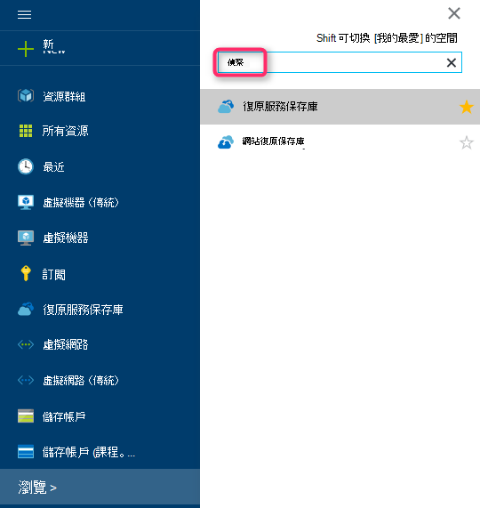

    修復服務保存庫的清單會顯示。

3. 在 [**復原服務保存庫**] 功能表中，按一下 [**新增**。

    

    修復服務保存庫刀開啟時，它會提示您提供的**名稱**、**訂閱**、 [**資源] 群組**中，與**位置**。

    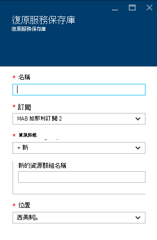

4. [**名稱**] 中，輸入好記的名稱來識別保存庫。 名稱必須是唯一的 Azure 訂閱。 輸入包含 2 到 50 個字元之間的名稱。 它必須以字母，以開始，並可以包含字母、 數字和連字號。

5. 按一下以查看可用的訂閱清單的**訂閱**]。 如果您不確定要使用的訂閱，使用預設的 （或建議） 訂閱。 會有多個選項只有您的組織帳戶是 Azure 的多個訂閱相關聯。

6. 按一下 [**資源群組**以查看可用的資源群組清單，或按一下 [**新增**]，建立新的資源群組。 完整資源群組的詳細資訊，請參閱[Azure 資源管理員的概觀](../azure-resource-manager/resource-group-overview.md)

7. 按一下以選取保存庫的地理區域的**位置**。

8. 按一下 [**建立**]。 可能需要一段時間的建立修復服務保存庫。 監控右側區內入口網站中的狀態通知。
您保存庫建立之後，它會在入口網站中開啟。

### 設定儲存複寫

儲存複寫選項可讓您選擇地理多餘的儲存在本機上多餘的儲存空間。 根據預設，您保存庫有地理多餘的儲存空間。 [離開] 選項設定為地理多餘的儲存空間，如果這是您主要的備份。 如果您想要不想為長期便宜選項，請選擇 [本機多餘的儲存空間]。 瞭解更多關於[地理多餘](../storage/storage-redundancy.md#geo-redundant-storage)和[Azure 儲存體複寫概觀](../storage/storage-redundancy.md)中[本機多餘](../storage/storage-redundancy.md#locally-redundant-storage)的儲存選項。

若要編輯的儲存空間複寫設定︰

1. 選取您要開啟保存庫儀表板與設定的保存庫。 如果**設定**刀沒有開啟，請按一下 [保存庫儀表板中的 [**所有設定**]。

2. 在**設定**刀中，按一下 [**備份基礎結構** > 開啟**備份設定**刀**備份設定**。 在**備份設定**刀中，選擇您保存庫的儲存空間複寫選項。

    

    選擇您保存庫的 [儲存] 選項之後, 您準備好 VM 關聯保存庫。 若要開始關聯，請探索並註冊 Azure 虛擬機器。

### 2.下載保存庫認證

保存庫認證檔案是每個備份保存庫的入口網站所產生的憑證。 入口網站然後上傳公開金鑰存取控制服務 (ACS)。 私密金鑰的憑證可供使用者指定的電腦登錄工作流程中輸入工作流程的一部分。 這會驗證傳送備份資料中的備份 Azure 服務識別保存庫至電腦。

只在註冊工作流程會使用保存庫認證。 是以確保保存庫認證檔案不會遭到盜用使用者的責任。 如果它落在任何惡意使用者手中，保存庫認證檔案可以用於登錄針對相同保存庫其他電腦。 不過，當使用所屬客戶複雜密碼加密的備份資料，不會洩漏現有的備份資料。 若要降低這方面，保存庫認證會設定為過期 48hrs 中。 您可以下載的修復服務保存庫認證無數次 – 但只有最新保存庫認證檔案適用期間註冊工作流程。

保存庫認證檔案下載到從 Azure 入口網站的安全通道。 Azure 備份服務不會知道私密金鑰的憑證和私密金鑰未保存在入口網站或服務。 若要保存庫認證檔案下載到本機電腦，使用下列步驟。

1. [Azure 入口網站](https://portal.azure.com/)登入。

2. 要開啟修復服務保存庫到您要註冊 DPM 電腦。

3. 設定刀開啟預設。 如果關閉，按一下 [**設定**開啟設定刀保存庫儀表板上。 設定刀中按一下 [**內容**。

    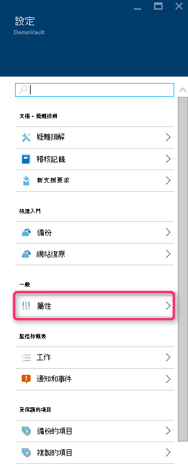

4. 在 [屬性] 頁面上按一下 [**備份認證**] 底下的 [**下載**]。 入口網站會產生保存庫認證檔案，可供下載。

    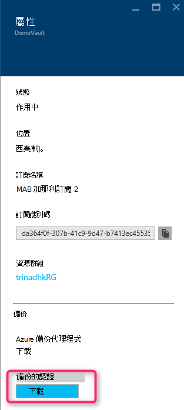

入口網站會產生保存庫認證使用保存庫名稱與目前日期的組合。 按一下 [**儲存**至本機帳戶的 [下載] 資料夾，下載保存庫認證，或從指定的位置保存庫認證的 [儲存] 功能表中選取 [另存新檔。 就會在幾分鐘產生的檔案。

### 附註
- 請確定保存庫認證檔案會儲存在可從您的電腦存取的位置。 如果它儲存在檔案共用中小企業，核取的存取權限。
- 只在註冊工作流程使用保存庫認證檔案。
- 保存庫認證檔案 48hrs 後到期，而且您可以從入口網站下載。

### 3.安裝備份代理程式

建立之後 Azure 備份保存庫，在每一個資料和 Azure 應用程式的備份可讓您 Windows 電腦 （Windows Server、 Windows 用戶端、 系統管理中心資料保護管理員伺服器或 Azure 備份伺服器電腦） 上安裝代理程式。

1. 要開啟修復服務保存庫到您要註冊 DPM 電腦。

2. 設定刀開啟預設。 如果關閉，按一下 [**設定**]，以開啟 [設定刀。 設定刀中按一下 [**內容**。

    

3. 在 [設定] 頁面上按一下 [下**Azure 備份代理程式**的 [**下載**]。

    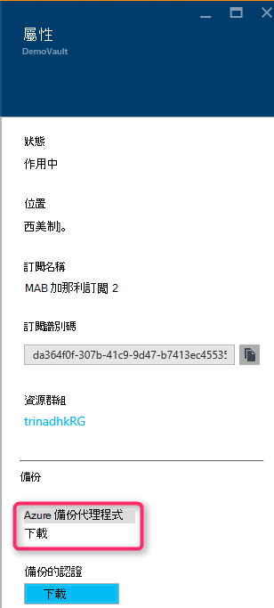

   在代理程式下載後，按兩下 [MARSAgentInstaller.exe 啟動 Azure 備份代理程式的安裝]。 選擇 [安裝資料夾與代理程式所需的草稿資料夾]。 指定的快取位置必須至少 5%的備份資料的可用空間。

4.  如果您使用 proxy 伺服器連線至網際網路，在 [ **Proxy 設定**] 畫面中，輸入 proxy 伺服器的詳細資料。 如果您使用已驗證的 proxy，請在這個畫面中輸入使用者名稱和密碼的詳細資料。

5.  Azure 備份代理程式安裝.NET Framework 4.5 與 Windows PowerShell （如果尚未提供） 以完成安裝。

6.  代理程式安裝後，**關閉**視窗。

    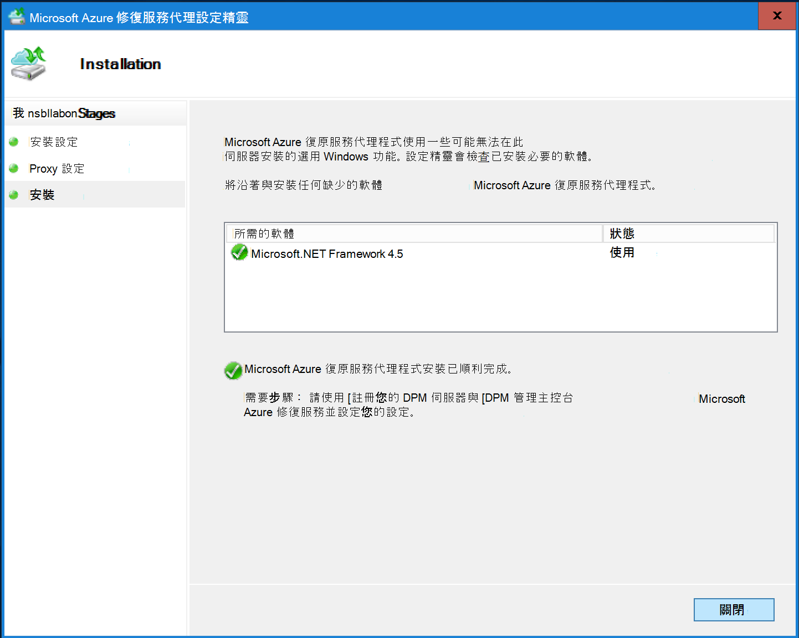

7. 若要保存庫，在 [**管理**] 索引標籤中的 [**註冊 DPM 伺服器**按一下**Online**。 然後，選取 [**註冊**]。 隨即會開啟 [登錄設定精靈。

8. 如果您使用 proxy 伺服器連線至網際網路，在 [ **Proxy 設定**] 畫面中，輸入 proxy 伺服器的詳細資料。 如果您使用已驗證的 proxy，請在這個畫面中輸入使用者名稱和密碼的詳細資料。

    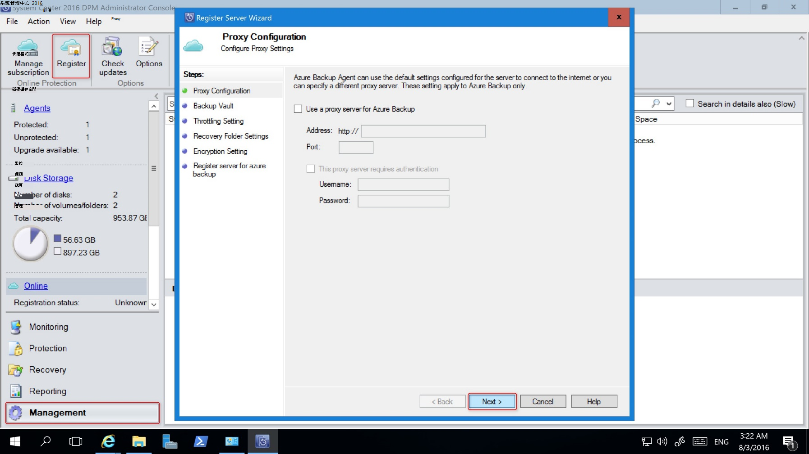

9. 在 [保存庫認證] 畫面中，瀏覽並選取先前已經下載保存庫認證檔案。

    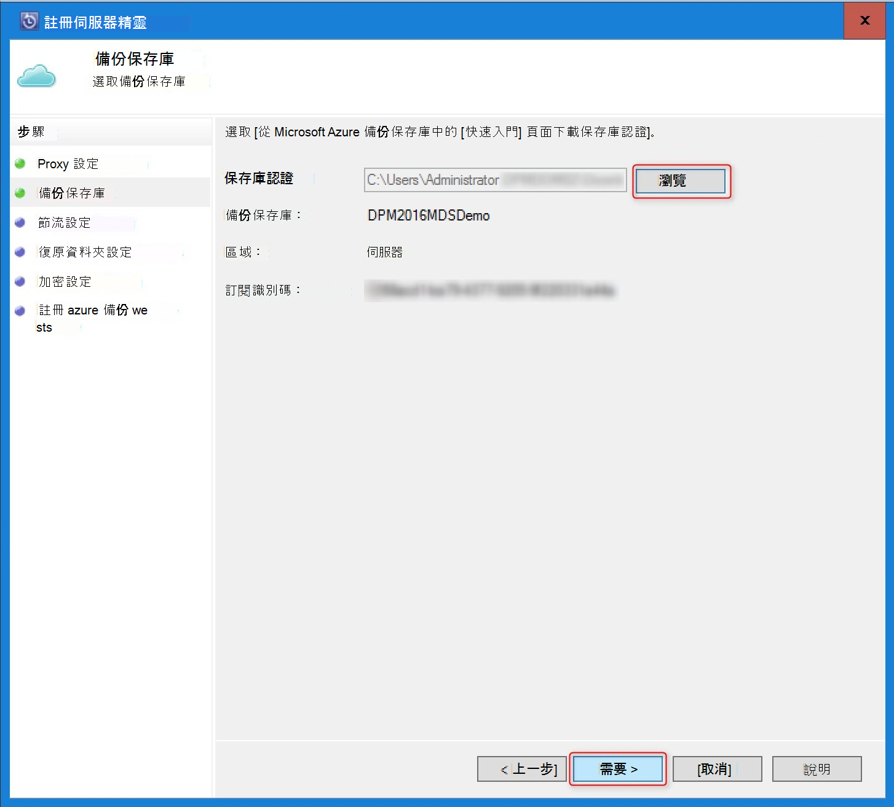

    保存庫認證檔案是僅適用於 48 小時 （之後就會從入口網站下載）。 如果您發現任何錯誤，此畫面 （例如，「 保存庫認證提供檔案已過期 」），登入 Azure 入口網站和下載保存庫認證再次檔案。

    請確定此保存庫認證檔案可在安裝應用程式可存取的位置。 如果您遇到存取相關的錯誤、 複製保存庫認證檔案的暫存的位置，在這台電腦，然後再試。

    如果您遇到無效保存庫認證錯誤 （例如，「 無效保存庫認證提供 」） 可能已損毀檔案，或不會有最新的認證與不相關的復原服務。 從入口網站下載新保存庫認證檔案後再試。 如果使用者在 [快速連續 Azure 入口網站中的 [**下載保存庫認證**] 選項，通常會發生這個錯誤。 在此情況下，只需將第二個保存庫認證檔案是有效的。

10. 若要控制的網路頻寬使用量期間工作，以及非工作時間，在 [**節流設定**] 畫面中，您可以設定頻寬使用量限制，定義和非工作時間。

    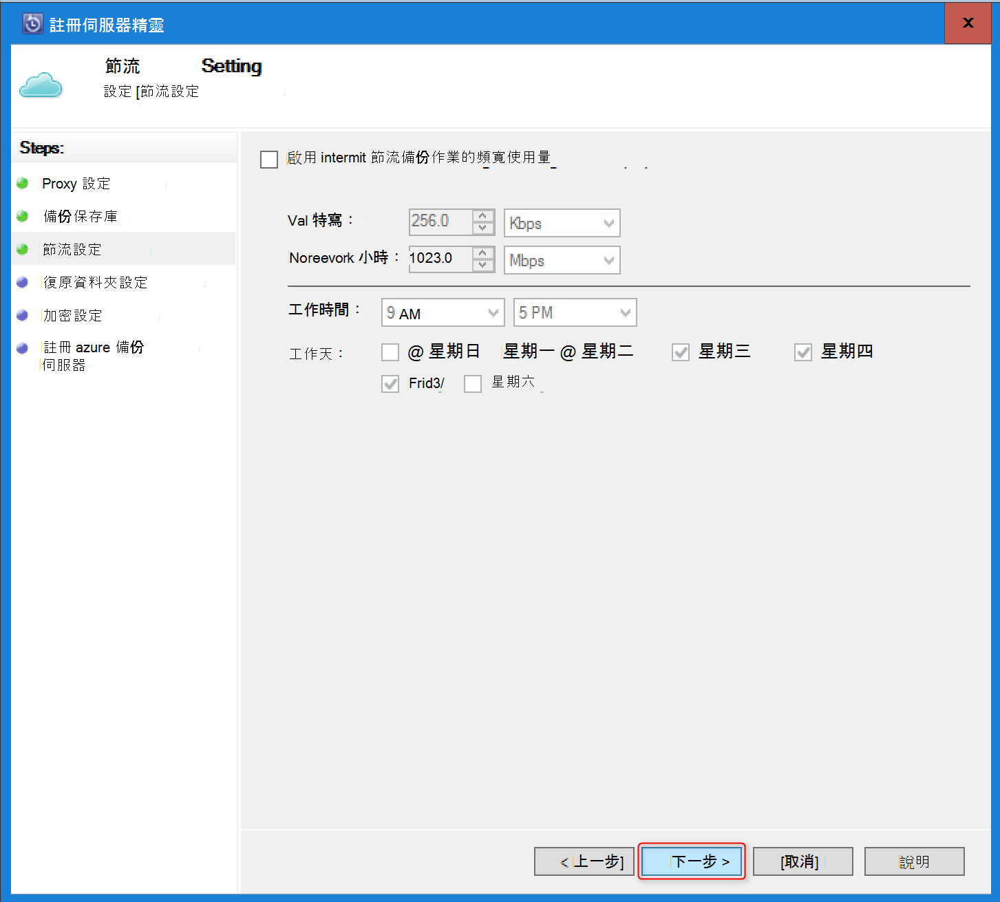

11. 在 [**復原] 資料夾設定**] 畫面中，瀏覽位置會暫時分段從 Azure 下載的檔案的資料夾。

    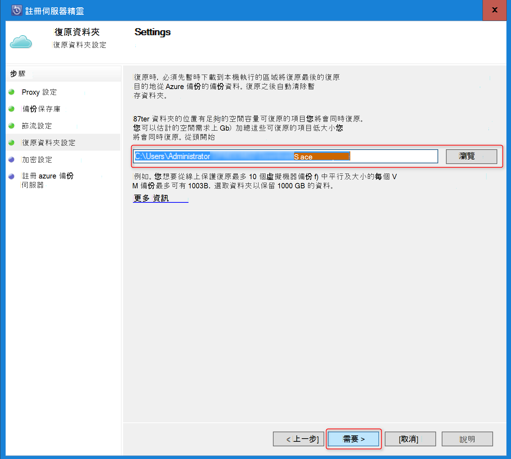

12. 在 [**加密設定**] 畫面中，您可以產生複雜密碼，或提供複雜密碼 （16 個字元的最小值）。 請記得在安全的位置儲存複雜密碼。

    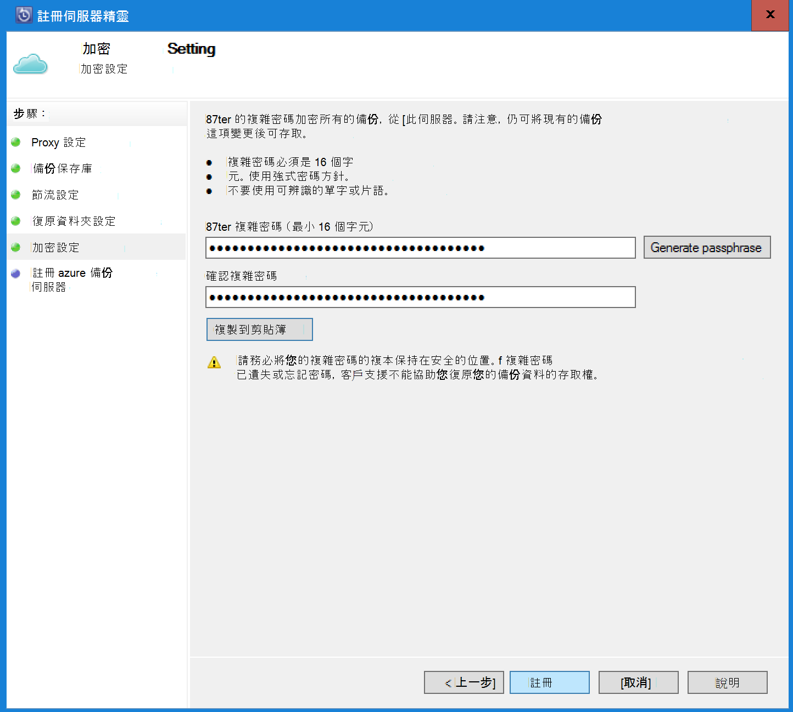

    > [AZURE.WARNING] 如果遺失或忘記密碼; 複雜密碼Microsoft 無法協助您復原備份資料。 使用者擁有加密複雜密碼和 Microsoft 沒有完善複雜使用使用者的密碼。 請將檔案儲存在安全的位置，因為它是修復作業期間必要。

13. 一旦您按一下 [**註冊**] 按鈕，電腦登錄成功，可以保存庫，現在可以準備開始備份到 Microsoft Azure。

14. 使用資料保護管理員，您可以修改註冊工作流程期間所指定選取**Online**在 [**管理**] 索引標籤底下，按一下 [**設定**] 選項的設定。

## 需求 （和限制）

- DPM 實體伺服器或 HYPER-V 虛擬機器安裝在系統管理中心 2012 SP1 或系統管理中心 2012 R2 上執行。 也可以執行為至少系統管理中心 2012 R2 上執行 Azure 虛擬機器 DPM 2012 R2 更新彙總套件 3年或 Windows 虛擬機器中至少系統管理中心 2012 R2 上執行的 VMWare 更新彙總套件 5。
- 如果您執行的 DPM 與系統管理中心 2012 SP1 您應該安裝更新就緒 2 系統管理中心資料保護管理員 sp1。 您可以安裝 Azure 備份代理程式之前，這是必要。
- DPM 伺服器應有 Windows PowerShell 和.Net Framework 4.5 安裝。
- DPM 可以備份 Azure 備份大部分的工作量。 有哪些具有受支援，請參閱的完整清單 Azure 備份支援以下項目。
- Azure 備份中儲存的資料無法復原 」 複製到膠帶貼上] 選項。
- 您必須 Azure 帳戶啟用 Azure 備份項功能。 如果您沒有帳戶，您可以建立的免費的試用帳戶在幾分鐘。 閱讀有關[Azure 備份價格](https://azure.microsoft.com/pricing/details/backup/)。
- 使用 Azure 備份需要 Azure 備份代理程式安裝在您想要備份的伺服器上。 每個伺服器必須至少 5%正在備份，提供本機的免費儲存空間的資料的大小。 例如，備份 100 GB 的資料需要 5 GB 的可用空間的草稿的位置的最小值。
- 資料會儲存在 Azure 保存庫的儲存位置。 您可以備份到 Azure 備份地窖的資料量不受限制，但資料來源 （例如虛擬機器或資料庫） 的大小不超過 54400 GB。

備份到 Azure 可支援這些檔案類型︰

- 加密 （完整備份僅限）
- 壓縮 （支援增量備份）
- 疏鬆 （支援增量備份）
- 壓縮且疏鬆 （視為 Sparse）

然後，這些不受支援︰

- 不支援在區分大小寫檔案系統中的伺服器。
- 永久的連結 （已略過）
- 重新分析點 （已略過）
- 加密與壓縮 （已略過）
- 加密並疏鬆 （略過）
- 壓縮的資料流
- 疏鬆串流

>[AZURE.NOTE] 從 sp1 開始建立編號系統管理中心 2012 DPM 中您可以備份設定受 DPM Azure 使用 Microsoft Azure 備份的工作量。
