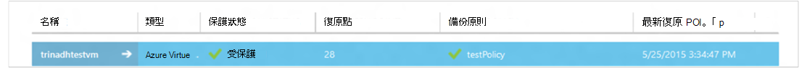
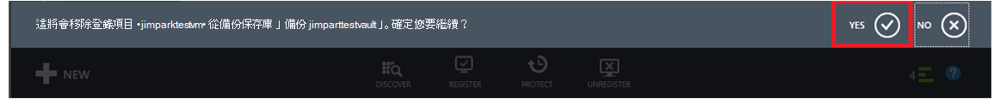

<properties
    pageTitle="管理及監視 Azure 虛擬機器備份 |Microsoft Azure"
    description="瞭解如何管理及監視 Azure 虛擬機器備份"
    services="backup"
    documentationCenter=""
    authors="trinadhk"
    manager="shreeshd"
    editor=""/>

<tags
    ms.service="backup"
    ms.workload="storage-backup-recovery"
    ms.tgt_pltfrm="na"
    ms.devlang="na"
    ms.topic="article"
    ms.date="08/31/2016"
    ms.author="trinadhk; jimpark; markgal;"/>

# <a name="manage-and-monitor-azure-virtual-machine-backups"></a>管理及監視 Azure 虛擬機器備份

> [AZURE.SELECTOR]
- [管理 Azure VM 備份](backup-azure-manage-vms.md)
- [管理傳統 VM 備份](backup-azure-manage-vms-classic.md)

本文提供常見的管理與傳統模式虛擬機器 Azure 中受保護的監控工作的相關資訊。  

>[AZURE.NOTE] Azure 有兩種部署模型建立及使用的資源︰[資源管理員] 及 [傳統](../resource-manager-deployment-model.md)。 如需使用傳統部署模型 Vm 的詳細資訊，請參閱[準備備份 Azure 虛擬機器環境](backup-azure-vms-prepare.md)。

## <a name="manage-protected-virtual-machines"></a>管理受保護的虛擬機器

若要管理受保護的虛擬機器︰

1. 若要檢視及管理虛擬機器備份設定，請按一下 [**受保護的項目**] 索引標籤。

2. 按一下 [受保護的項目，以查看 [**備份的詳細資料**] 索引標籤，顯示您最近的備份的相關資訊的名稱。

    

3. 若要檢視及管理備份原則虛擬機器設定，請按一下 [**原則**] 索引標籤。

    

    **備份原則**] 索引標籤會顯示您現有的原則。 您可以視需要進行修改。 若要建立新原則按一下 [**原則**] 頁面上的 [**建立**。 請注意，如果您想要移除的原則，不應任何與其相關聯的虛擬機器。

    

4. 您可以在 [**工作**] 頁面上的虛擬機器取得動作或狀態的相關資訊。 按一下 [在清單中，以取得詳細資訊，請工作或篩選特定的虛擬機器中的工作。

    

## <a name="on-demand-backup-of-a-virtual-machine"></a>指定備份的虛擬機器
這設定為保護後，您可以採取視需要備份的虛擬機器。 如果初始備份擱置的虛擬機器中，指定備份會在 Azure 備份保存庫中建立虛擬機器中的完整的複本。 如果第一個備份已完成，視需要備份會只傳送變更從先前的備份 Azure 備份地窖也就是它永遠是累加。

>[AZURE.NOTE] 指定備份保留範圍會設定為每日保留備份原則對應至 VM 中所指定的保留值。  

視需要採取虛擬機器的備份的︰

1. 瀏覽至 [**受保護的項目**] 頁面並選取**Azure 虛擬機器**] 作為**類型**（如果尚未選取），按一下 [**選取**] 按鈕。

    

2. 選取您想要指定備份並按一下 [**立即備份**底部的頁面] 按鈕的虛擬機器。

    

    這會建立備份工作所選的虛擬機器上。 保留範圍，透過這項工作所建立的復原點會與指定原則相關聯的虛擬機器中的相同。

    

    >[AZURE.NOTE] 若要檢視虛擬機器相關聯的原則，在 [**受保護的項目**] 頁面的虛擬機器中向下切入並移至備份原則] 索引標籤。

3. 一旦建立工作，您可以按一下快顯列以查看相對應的工作，在 [工作] 頁面中的**檢視工作**] 按鈕上。

    

4. 在 [作業成功完成之後, 復原點就會建立可用來還原虛擬機器。 這也會在**受保護的項目**] 頁面上的 1 遞增復原點資料行的值。

## <a name="stop-protecting-virtual-machines"></a>停止保護虛擬機器
您可以選擇停止未來的備份的虛擬機器使用下列選項︰

- 保留 Azure 備份保存庫中的虛擬機器相關聯的備份資料
- 刪除虛擬機器相關聯的備份資料

如果您已經選取保留虛擬機器相關聯的備份資料，您可以使用備份資料，若要還原虛擬機器。 價格這類虛擬機器的詳細資訊，請按一下[這裡](https://azure.microsoft.com/pricing/details/backup/)。

若要停止保護虛擬機器︰

1. 瀏覽至**受保護的項目**頁面並選取**Azure 虛擬機器**] 作為篩選類型 （如果尚未選取），按一下 [**選取**] 按鈕。

    

2. 選取的虛擬機器，然後按一下 [**停止保護**底部的頁面]。

    

3. 根據預設，Azure 備份不會刪除虛擬機器相關聯的備份資料。

    

    如果您想要刪除的備份資料，請選取核取方塊。

    

    請選取 [停止備份的理由。 雖然這是選擇性的提供原因有助於 Azure 備份工作的意見反應，並排列優先順序的客戶案例。

4. 按一下 [送出 [**停止保護**的工作**送出**] 按鈕上。 按一下 [**檢視工作**，請參閱對應**的工作**] 頁面中的工作。

    

    如果您尚未選取**刪除相關聯的備份資料**的選項，在 [**停止保護**精靈]，然後文章工作完成時，保護狀態會變更為**保護** Azure 備份資料會留在直到明確遭到刪除。 您隨時都可以刪除選取的虛擬機器在**受保護的項目**] 頁面上，按一下 [**刪除**的資料。

    

    如果您已選取 [**刪除相關聯的備份資料**的選項，虛擬機器不會**受到保護的項目**網頁的一部分。

## <a name="re-protect-virtual-machine"></a>重新保護虛擬機器
如果您尚未選取 [**刪除關聯的備份資料**] 選項中**停止保護**，您可以重新保護虛擬機器類似備份已註冊的虛擬機器的步驟進行。 受到保護，此虛擬機器必須保留之前停止保護備份資料，並建立之後的復原點後重新保護。

後重新保護，請虛擬機器中的保護狀態會變更為**受保護**如果復原點之前**停止保護**。

  

>[AZURE.NOTE] 當重新保護虛擬機器時，您可以選擇不同的原則，比使用虛擬機器保護最初的原則。

## <a name="unregister-virtual-machines"></a>移除註冊虛擬機器

如果您想要從備份保存庫移除虛擬機器︰

1. 按一下頁面底部的 [**取消註冊**] 按鈕。

    

    要求確認畫面的底部會顯示快顯通知。 按一下 [ **]**以繼續進行。

    

## <a name="delete-backup-data"></a>刪除備份資料
您可以刪除與虛擬機器，表示相關聯的備份資料︰

- 在 [停止保護工作期間
- 停止保護後虛擬機器上完成工作

若要刪除虛擬機器中的*保護停止*狀態的備份資料會文章順利完成時**停止備份**工作︰

1. 瀏覽至 [**受保護的項目**] 頁面並選取**Azure 虛擬機器**作為*類型*，按一下 [**選取**] 按鈕。

    

2. 選取的虛擬機器。 虛擬機器就會在 [**停止保護**狀態。

    

3. 按一下 [**刪除**] 按鈕，底部的頁面]。

    

4. **刪除備份資料**在精靈中，選取 [刪除 （強烈建議） 的備份資料的理由，然後按一下 [**送出**。

    

5. 這會建立要刪除選取的虛擬機器中的備份資料的工作。 按一下 [**檢視工作**，查看 [工作] 頁面中的相對應工作]。

    

    一旦完成工作，對應到虛擬機器中的項目會從**受保護的項目**] 頁面。

## <a name="dashboard"></a>儀表板
在**儀表板**頁面上，您可以檢閱 Azure 虛擬機器、 儲存及過去 24 小時內與其相關聯的作業的相關資訊。 您可以檢視備份狀態和任何相關聯的備份錯誤。


>[AZURE.NOTE] 在儀表板中的值會重新整理一次每 24 小時。

## <a name="auditing-operations"></a>稽核作業
Azure 備份提供檢閱 」 作業 「 作業的記錄備份觸發客戶方便您查看完全哪些管理上執行作業備份保存庫。 作業記錄啟用好事後，及稽核備份作業的支援。

作業的記錄會記錄下列作業︰

- 註冊
- 移除註冊
- 設定保護
- 備份 （兩者排程以及指定備份到 BackupNow）
- 還原
- 停止保護
- 刪除備份資料
- 新增原則
- 刪除原則
- 更新原則
- 取消工作

若要檢視對應至備份保存庫作業記錄︰

1. 在 Azure 入口網站，瀏覽至 [**管理服務**，然後按一下 [**作業記錄**] 索引標籤。

    

2. 在 [篩選]，選取**備份**作為*類型**服務名稱*中指定備份保存庫名稱，並按一下 [**送出**。

    

3. 在作業記錄] 中，選取任何作業，按一下以查看詳細資料對應至作業的**詳細資料**。

    

    **詳細資料] 精靈**包含觸發，作業工作 Id，資源在這項作業觸發，並開始作業的時間的相關資訊。

    

## <a name="alert-notifications"></a>提醒通知
您可以在入口網站取得工作的自訂提醒通知。 這被達成定義作業記錄事件的 PowerShell 為基礎的通知規則。 我們建議使用*PowerShell 版本 1.3.0 或*。

若要定義自訂的通知提醒的備份失敗，範例命令看起來像︰

```
PS C:\> $actionEmail = New-AzureRmAlertRuleEmail -CustomEmail contoso@microsoft.com
PS C:\> Add-AzureRmLogAlertRule -Name backupFailedAlert -Location "East US" -ResourceGroup RecoveryServices-DP2RCXUGWS3MLJF4LKPI3A3OMJ2DI4SRJK6HIJH22HFIHZVVELRQ-East-US -OperationName Microsoft.Backup/backupVault/Backup -Status Failed -TargetResourceId /subscriptions/86eeac34-eth9a-4de3-84db-7a27d121967e/resourceGroups/RecoveryServices-DP2RCXUGWS3MLJF4LKPI3A3OMJ2DI4SRJK6HIJH22HFIHZVVELRQ-East-US/providers/microsoft.backupbvtd2/BackupVault/trinadhVault -Actions $actionEmail
```

**預設**︰ 您可以取得這個從作業記錄快顯功能表中所述區段的上方。 ResourceUri 中作業的詳細資料] 快顯視窗會提供需此 cmdlet 預設。

**OperationName**︰ 這是格式] 的 「 Microsoft.Backup/backupvault/<EventName>」 其中 EventName 是其中一個 Register 取消註冊、 ConfigureProtection，備份、 還原，StopProtection DeleteBackupData、 CreateProtectionPolicy、 DeleteProtectionPolicy、 UpdateProtectionPolicy

**狀態**︰ 成功和失敗支援值都已啟動]。

**ResourceGroup**: ResourceGroup 觸發作業時的資源。 您可以取得這個從預設值。 欄位*/resourceGroups/*和*/providers/*預設值之間的值是 ResourceGroup] 的值。

**名稱**︰ 提醒規則的名稱。

**CustomEmail**︰ 指定您要傳送提醒通知的自訂電子郵件地址

**SendToServiceOwners**︰ 這個選項，傳送通知給所有系統管理員和訂閱的共同管理員。 用於**新增 AzureRmAlertRuleEmail** cmdlet

### <a name="limitations-on-alerts"></a>通知的限制
下列限制係事件架構通知︰

1. 備份保存庫中的所有虛擬機器上觸發通知。 您無法自訂，以取得備份保存庫中的虛擬機器一組特定的警示。
2. 這項功能在預覽中。 [深入瞭解](../monitoring-and-diagnostics/insights-powershell-samples.md#create-alert-rules)
3. 您會收到通知"alerts-noreply@mail.windowsazure.com"。 目前您無法修改電子郵件寄件者。

## <a name="next-steps"></a>後續步驟

- [還原 Azure Vm](backup-azure-restore-vms.md)
