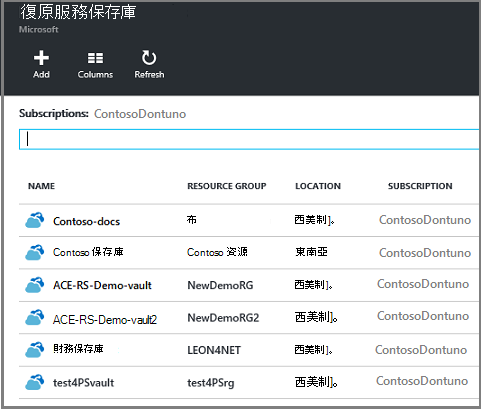
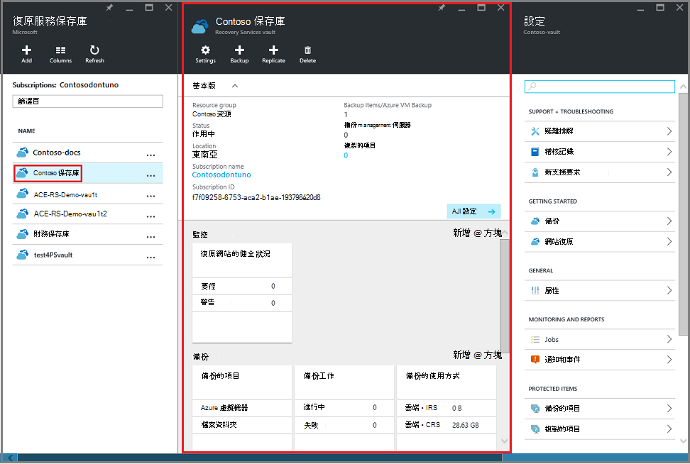

<properties
    pageTitle="管理資源管理員部署虛擬機器備份 |Microsoft Azure"
    description="瞭解如何管理及監視部署資源管理員的虛擬機器備份"
    services="backup"
    documentationCenter=""
    authors="trinadhk"
    manager="shreeshd"
    editor=""/>

<tags
    ms.service="backup"
    ms.workload="storage-backup-recovery"
    ms.tgt_pltfrm="na"
    ms.devlang="na"
    ms.topic="article"
    ms.date="08/11/2016"
    ms.author="jimpark; markgal; trinadhk"/>

# 管理 Azure 虛擬機器中的備份

> [AZURE.SELECTOR]
- [管理 Azure VM 備份](backup-azure-manage-vms.md)
- [管理傳統 VM 備份](backup-azure-manage-vms-classic.md)

本文提供管理 VM 備份的指引，並說明備份通知中可用的資訊入口網站的儀表板。 本文提供的指導方針適用於 Vm 使用修復服務保存庫。 本文並未涵蓋的虛擬機器建立，也不會說明如何保護虛擬機器。 基礎與修復服務保存庫保護 Azure 中的 Azure 資源管理員部署 Vm 課程，請參閱[第一次查看︰ 備份 Vm 與修復服務保存庫](backup-azure-vms-first-look-arm.md)。

## 管理保存庫及受保護的虛擬機器

在 Azure 入口網站，修復服務保存庫儀表板提供存取資訊保存庫包括︰

- 最近的備份快照，也是最新的還原點 < 巴西\>
- 備份原則 < 巴西\>
- 總大小的所有備份的快照集 < 巴西\>
- 數字的保存庫受保護的虛擬機器 < 巴西\>

在儀表板中開啟保存庫開頭虛擬機器備份許多管理工作。 不過，因為保存庫可以用來保護多個項目 （或多個 Vm），以檢視特定 VM 詳細資料，開啟保存庫項目儀表板。 下列程序顯示如何開啟*保存庫儀表板*，然後繼續*保存庫項目儀表板*。 如何新增保存庫及地窖至 Azure 儀表板項目，使用 [固定至儀表板] 命令指出這兩個程序中有 「 秘訣 」。 釘選至儀表板是一種建立捷徑的保存庫或項目。 您也可以從捷徑執行一般的命令。

>[AZURE.TIP] 如果您有多個儀表板，刀開啟使用視窗底部的深藍色滑桿，投影片 Azure 儀表板，來回。

### 在儀表板中開啟修復服務保存庫︰

1. [Azure 入口網站](https://portal.azure.com/)登入。

2. 在 [中心] 功能表中，按一下 [**瀏覽**，在資源的清單中，輸入 [**修復服務**。 當您開始輸入，清單篩選是根據您輸入。 按一下 [**修復服務保存庫**]。

      

    修復服務保存庫的清單會顯示。

      

    >[AZURE.TIP] 如果您將其釘選至 Azure 儀表板保存庫時，該保存庫，就立即存取您開啟 Azure 入口網站。 若要將儀表板，保存庫固定保存庫清單中，保存庫，以滑鼠右鍵按一下，然後選取 [**固定至儀表板**。

3. 從保存庫清單中，選取 [開啟其儀表板保存庫]。 當您選取保存庫時，保存庫儀表板與**設定**開啟。 在下圖中，醒目提示 [ **Contoso 保存庫**儀表板。

    

### 開啟保存庫項目儀表板

在上述程序中您要開啟的保存庫儀表板。 若要開啟保存庫項目儀表板︰

1. 在保存庫儀表板上 [**備份的項目**] 方塊中，按一下 [ **Azure 虛擬機器**]。

    ![開啟備份的項目] 方塊](./media/backup-azure-manage-vms/contoso-vault-1606.png)

    **備份的項目**刀列出的備份的最後一個工作，每個項目。 在此範例中，有一個虛擬機器，demovm markgal，受此保存庫。  

    ![備份的項目] 方塊](./media/backup-azure-manage-vms/backup-items-blade.png)

    >[AZURE.TIP] 為了方便存取，您可以固定至 Azure 儀表板的保存庫項目。 若要保存庫項目清單中，將固定保存庫項目，以滑鼠右鍵按一下項目，然後選取 [**固定至儀表板**。

2. 在**備份的項目**刀中，按一下以開啟保存庫項目儀表板項目。

    ![備份的項目] 方塊](./media/backup-azure-manage-vms/backup-items-blade-select-item.png)

    保存庫項目儀表板與其**設定**開啟。

    

    從保存庫項目儀表板，您可以完成的首要許多金鑰管理工作，例如︰

    - 變更原則，或建立新的備份原則 < 巴西\>
    - 查看還原點，以及其一致性狀態 < 巴西\>
    - 指定備份的虛擬機器 < 巴西\>
    - 停止保護虛擬機器 < 巴西\>
    - 繼續保護的虛擬機器 < 巴西\>
    - 刪除備份資料 （或復原點） < 巴西\>
    - [還原備份 （或復原點）](./backup-azure-arm-restore-vms.md#restore-a-recovery-point) < 巴西\>

下列程序，起始點是保存庫項目儀表板。

## 管理備份原則

1. [保存庫項目儀表板](backup-azure-manage-vms.md#open-a-vault-item-dashboard)上按一下 [開啟**設定**刀的**所有設定**]。

    

2. 在**設定**刀中，按一下 [**備份原則**] 以開啟該刀]。

    在刀，會顯示備份的頻率，並保留範圍詳細資料。

    

3. 從 [**選擇備份原則**] 功能表中︰
    - 若要變更原則，請選取不同的原則，然後按一下 [**儲存**]。 新的原則會立即套用至保存庫中。 < 巴西\>
    - 若要建立原則，選取 [**建立新檔案**]。

    

    如需建立備份原則的相關指示，請參閱[定義備份原則](backup-azure-manage-vms.md#defining-a-backup-policy)。

[AZURE.INCLUDE [backup-create-backup-policy-for-vm](../../includes/backup-create-backup-policy-for-vm.md)]

## 指定備份的虛擬機器
這設定為保護後，您可以採取視需要備份的虛擬機器。 如果初始的備份擱置中，指定備份會在修復服務保存庫中建立虛擬機器中的完整的複本。 如果初始備份已完成，指定備份會只傳送變更從先前的快照，以修復服務保存庫。 也就是說，一律是累加後續的備份。

>[AZURE.NOTE] 指定備份的保留範圍是指定原則中的每日備份點的保留值。 如果已選取 [沒有每日的備份點，則會使用每週的備份點。

觸發程序的虛擬機器指定備份︰

- 按一下 [[保存庫項目儀表板](backup-azure-manage-vms.md#open-a-vault-item-dashboard)的 [**立即備份**]。

    ![備份現在] 按鈕](./media/backup-azure-manage-vms/backup-now-button.png)

    入口網站可確保您想要開始指定備份工作。 按一下**[是]**以開始備份工作。

    ![備份現在] 按鈕](./media/backup-azure-manage-vms/backup-now-check.png)

    備份工作建立復原點。 保留範圍的復原點會保留原則相關聯的虛擬機器中指定的範圍相同。 若要追蹤進度保存庫儀表板中的工作，按一下 [**備份工作**磚。  

## 停止保護虛擬機器
如果您選擇停止保護虛擬機器，您會要求您是否要保留的復原點。 有兩種方式若要停止保護虛擬機器︰
- 停止所有未來的備份工作，並刪除所有復原點，或
- 停止所有未來的備份工作，但保留復原點  

有相關聯讓復原點留在儲存空間的成本。 不過，離開復原點的優點是稍後，您可以還原虛擬機器視需要。 復原點的成本的相關資訊，請參閱[定價詳細資料](https://azure.microsoft.com/pricing/details/backup/)。 如果您選擇刪除所有復原點，您無法還原虛擬機器。

若要停止保護虛擬機器︰

1. 按一下 [[保存庫項目儀表板](backup-azure-manage-vms.md#open-a-vault-item-dashboard)的 [**停止備份**]。

    ![停止備份] 按鈕](./media/backup-azure-manage-vms/stop-backup-button.png)

    停止備份刀隨即會開啟。

    

2. 在**[備份停止**刀，選擇是否要保留或刪除備份資料。 [資訊] 方塊會提供您選擇的詳細資料。

    

3. 如果您選擇要保留的備份資料，請跳至步驟 4。 如果您選擇要刪除的備份資料，請確認您要停止備份工作，並刪除復原點-輸入項目的名稱。

    

    如果您不確定項目名稱，請將游標停留在驚嘆號，若要檢視的名稱。 此外，項目名稱是在頂端的刀**停止備份**。

4. 您也可以提供的**原因**或**註解**。

5. 若要停止備份工作的目前項目，請按一下 [ ![停止備份] 按鈕](./media/backup-azure-manage-vms/stop-backup-button-blue.png)

    通知訊息可讓您知道備份工作都已停止。

    

## 繼續虛擬機器的保護
如果已停止保護虛擬機器時選擇**保留備份資料**選項，，則可以繼續執行保護。 如果選擇 [**刪除的備份資料**] 選項，無法繼續虛擬機器保護。

若要繼續保護虛擬機器

1. 按一下 [[保存庫項目儀表板](backup-azure-manage-vms.md#open-a-vault-item-dashboard)的 [**繼續備份**]。

    

    備份原則刀隨即會開啟。

    >[AZURE.NOTE] 當重新保護虛擬機器時，您可以選擇不同的原則，比使用虛擬機器保護最初的原則。

2. 依照[變更原則] 或 [建立新的備份原則](backup-azure-manage-vms.md#change-policies-or-create-a-new-backup-policy)，若要指派的虛擬機器原則。

    一旦備份的原則套用至虛擬機器，您會看到下列訊息。

    

## 刪除備份資料
您可以刪除虛擬機器相關聯的備份資料**停止備份**工作期間，或隨時備份後完成工作。 即使可能很有幫助天數或週刪除復原點之前，請等候。 不同於復原點時還原刪除的備份資料，您無法選擇特定的復原刪除的點。 如果您選擇刪除備份資料，您就會刪除所有項目相關聯的復原點。

下列程序假設虛擬機器的備份工作已停止或停用。 一旦備份工作已停用，**繼續備份**及**刪除備份**選項皆適用於保存庫項目儀表板。

![履歷表] 和 [刪除] 按鈕](./media/backup-azure-manage-vms/resume-delete-buttons.png)

若要刪除的*備份停用*的虛擬機器上的備份資料︰

1. 按一下 [[保存庫項目儀表板](backup-azure-manage-vms.md#open-a-vault-item-dashboard)的 [**刪除備份**]。

    

    **刪除備份資料**刀隨即會開啟。

    

2. 輸入要確認您要刪除的復原點的項目名稱。

    

    如果您不確定項目名稱，請將游標停留在驚嘆號，若要檢視的名稱。 此外，項目名稱是下刀頂端的**刪除備份資料**。

3. 您也可以提供的**原因**或**註解**。

4. 若要刪除目前的項目的備份資料，請按一下 [ ![停止備份] 按鈕](./media/backup-azure-manage-vms/delete-button.png)

    通知訊息可讓您知道已刪除的備份資料。

## 後續步驟

重新建立虛擬機器復原點的詳細資訊，請參閱[還原 Azure Vm](backup-azure-restore-vms.md)。 如果您需要保護您的虛擬機器的詳細資訊，請參閱[第一次查看︰ 備份 Vm 與修復服務保存庫](backup-azure-vms-first-look-arm.md)。 監視事件的詳細資訊，請參閱[Azure 虛擬機器備份的監視器警示](backup-azure-monitor-vms.md)。
