<properties
    pageTitle="管理 Azure 備份保存庫與伺服器使用傳統的部署模型 Azure |Microsoft Azure"
    description="您可以使用本教學課程，瞭解如何管理 Azure 備份保存庫與伺服器。"
    services="backup"
    documentationCenter=""
    authors="markgalioto"
    manager="jwhit"
    editor="tysonn"/>

<tags
    ms.service="backup"
    ms.workload="storage-backup-recovery"
    ms.tgt_pltfrm="na"
    ms.devlang="na"
    ms.topic="article"
    ms.date="09/27/2016"
    ms.author="jimpark;markgal"/>

# 管理 Azure 備份保存庫與伺服器使用傳統的部署模型

> [AZURE.SELECTOR]
- [資源管理員](backup-azure-manage-windows-server.md)
- [傳統](backup-azure-manage-windows-server-classic.md)

在本文中，您可以找到可透過 Azure 傳統入口網站與 Microsoft Azure 備份代理程式的備份管理工作的概觀。

[AZURE.INCLUDE [learn-about-deployment-models](../../includes/learn-about-deployment-models-classic-include.md)]資源管理員部署模型。

## 管理入口網站的工作
1. [管理入口網站](https://manage.windowsazure.com)登入。

2. 按一下 [**修復服務**]，然後按一下 [檢視快速入門] 頁面的備份保存庫的名稱。

    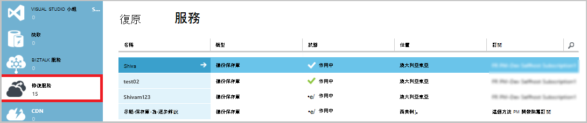

選取頂端的 [快速入門] 頁面的選項，您可以看到可用的管理工作。

![管理] 索引標籤](./media/backup-azure-manage-windows-server-classic/qs-page.png)

### 儀表板
選取 [若要查看伺服器的使用方式概觀**儀表板**]。 **使用概觀**包括︰

- Windows 伺服器數目註冊至雲端
- 在雲端中受保護的 Azure 虛擬機器中的數字
- Azure 中耗用的總儲存空間
- 最近的工作的狀態

底部的儀表板，您可以執行下列工作︰

- **管理憑證**-如果憑證用於註冊伺服器，然後使用此更新憑證。 如果您使用的保存庫認證，請勿使用**管理憑證**。
- **刪除**-刪除目前的備份保存庫。 如果已不再使用備份保存庫，您便可以刪除以釋出的儲存空間。 **刪除**只會啟用後從保存庫已刪除所有已註冊的伺服器。

## 登錄項目
選取要檢視的註冊此保存庫的伺服器名稱的**登錄項目**。

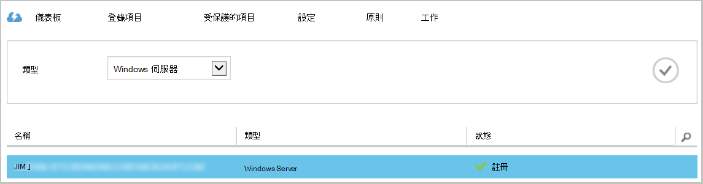

**類型**的篩選預設值至 Azure 虛擬機器中。 若要檢視的註冊此保存庫的伺服器名稱，請從下拉式功能表選取**Windows server** 。

從這裡開始，您可以執行下列工作︰

- **允許重新註冊**-選取此選項時伺服器的可用來**註冊精靈**在內部部署 Microsoft Azure 備份代理程式登錄伺服器備份保存庫一次。 您可能需要重新註冊因為憑證發生錯誤，或如果必須重建伺服器。
- **刪除**-從備份保存庫刪除伺服器。 所有儲存的資料與伺服器關聯會立即刪除。

    

## 受保護的項目
選取 [**受保護的項目**，若要檢視已經從伺服器備份的項目]。

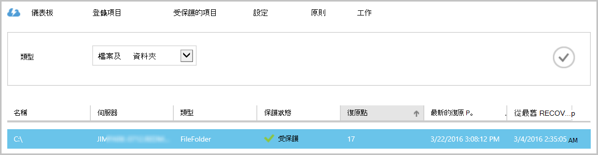

## 設定

從 [**設定**] 索引標籤中，您可以選取適當的儲存空間重複選項。 建立保存庫之後，才能註冊任何電腦，選取 [儲存複本] 選項的最佳時機是正確。

>[AZURE.WARNING] 後要保存庫登錄項目，[儲存複本] 選項已鎖定，且無法修改。

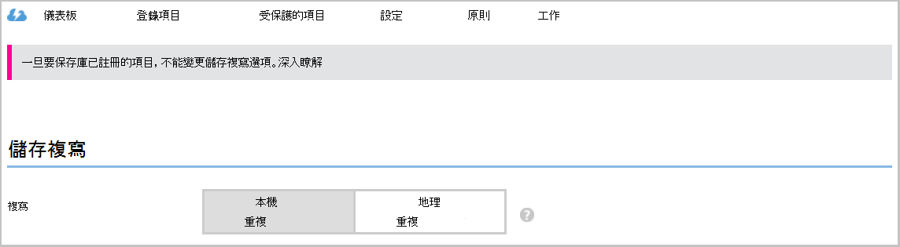

請參閱本文的[儲存空間重複性](../storage/storage-redundancy.md)的詳細資訊。

## Microsoft Azure 備份代理程式工作

### 主控台

開啟**Microsoft Azure 備份代理程式**（您可以找到*Microsoft Azure 備份*搜尋您的電腦）。

從可用的**動作**右側的備份代理程式主控台中，您可以執行下列管理工作︰

- 註冊伺服器
- 備份排程
- 現在備份
- 變更內容

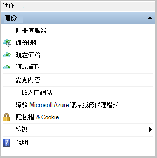

>[AZURE.NOTE] 若要**復原的資料**，請參閱[還原至 Windows server 或 Windows 用戶端電腦的檔案](backup-azure-restore-windows-server.md)。

### 修改現有的備份

1. Microsoft Azure 備份代理程式中按一下 [**排程備份**]。

    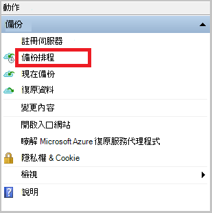

2. 保留**排程備份精靈**中的 [選取 [**進行的變更來備份的項目] 或 [時間**] 選項，然後按一下 [**下一步**]。

    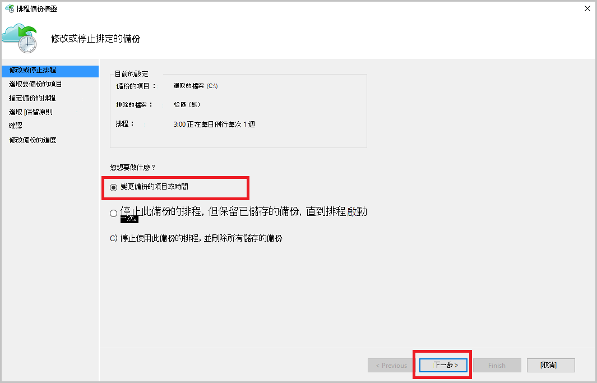

3. 如果您想要新增或變更項目，在 [**選取要備份的項目**] 畫面上按一下 [**新增項目]**。

    您也可以設定**排除設定**精靈中的這頁。 如果您想要排除的檔案或檔案類型閱讀加入[排除設定](#exclusion-settings)程序。

4. 選取的檔案與您想要備份，然後按一下 [**好**的資料夾。

    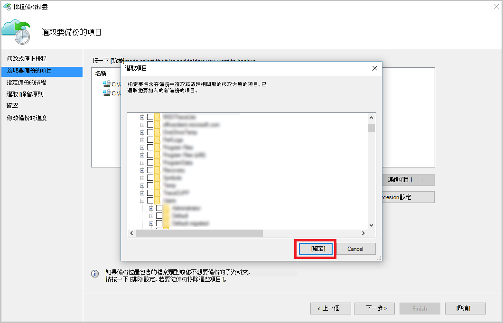

5. 指定**備份的排程**，然後按一下 [**下一步**]。

    您可以排程 （位於 [每日的 3 次最大值） 的每日或週的備份。

    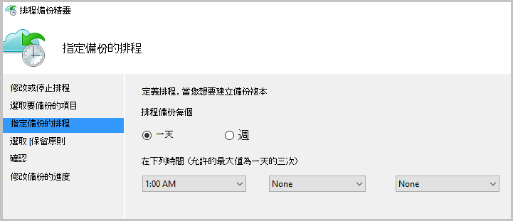

    >[AZURE.NOTE] 指定備份排程的[文件](backup-azure-backup-cloud-as-tape.md)中的詳細說明。

6. 選取的備份複本的**保留原則**，然後按一下 [**下一步**]。

    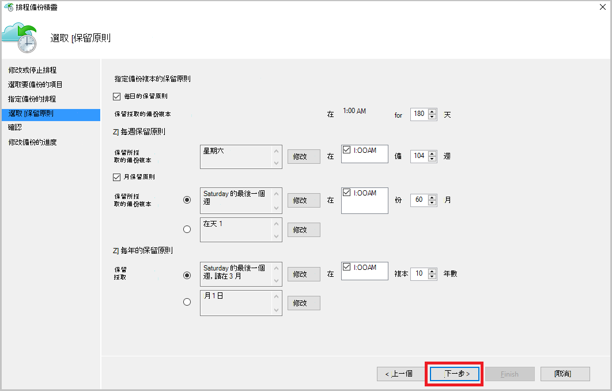

7. 在**確認**畫面上檢閱資訊，然後按一下 [**完成]**。

8. 當精靈完成建立**備份排程**時，請按一下 [**關閉**]。

    修改後防護，您可以確認備份正確觸發移至 [**工作**] 索引標籤，並確認您的變更會反映在備份工作。

### 啟用網路節流  
Azure 備份代理程式提供 Throttling] 索引標籤可讓您控制網路頻寬期間的資料傳輸的使用方式。 此控制項可以是如果您要備份資料期間工作時數，但不是想避免圖片干擾其他網際網路流量的備份程序很有幫助的。 節流的資料傳輸適用於備份及還原活動。  

若要啟用節流設定︰

1. 在**備份代理程式**中，按一下 [**變更內容**。

2. 選取 [**啟用節流備份作業的網際網路頻寬使用量**核取方塊。

    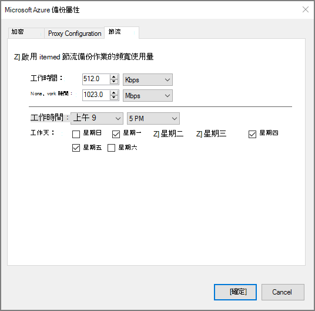

3. 一旦您已啟用節流設定，指定備份資料傳輸允許的頻寬**工作時間**和**非工作時間**期間。

    頻寬值 512 kb 秒 (Kbps) 開始，並可以移為 1023 mb 數 (Mbps)。 您也可以指定開始日期和完成**工作時間**，以及一週的哪幾天會視為工作天。 指定的工作時間以外的時間會被視為非工作時間。

4. 按一下**[確定]**。

## 排除設定

1. 開啟**Microsoft Azure 備份代理程式**（您可以找到*Microsoft Azure 備份*搜尋您的電腦）。

    

2. Microsoft Azure 備份代理程式中按一下 [**排程備份**]。

    

3. 保留排程備份精靈中的 [選取的 [**進行的變更來備份的項目] 或 [時間**] 選項，然後按一下 [**下一步**]。

    

4. 按一下 [**排除項目設定**]。

    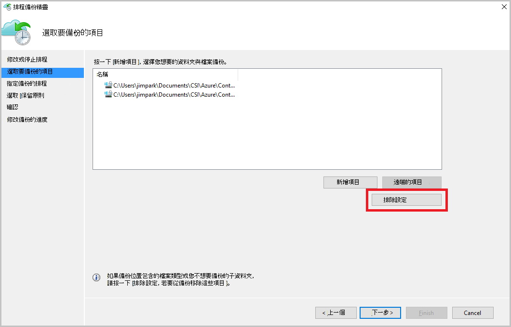

5. 按一下 [**新增排除項目**]。

    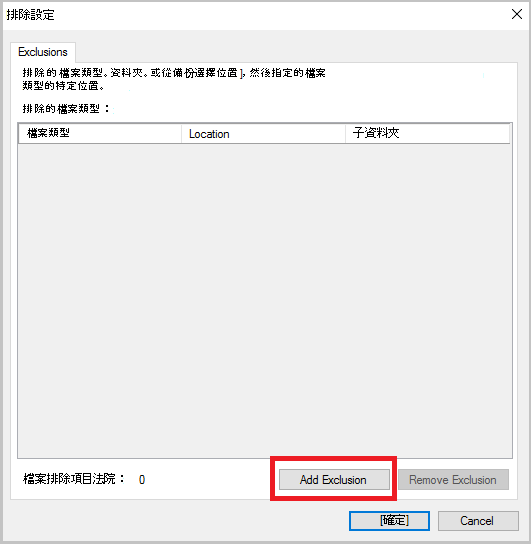

6. 選取的位置，然後按一下**[確定]**。

    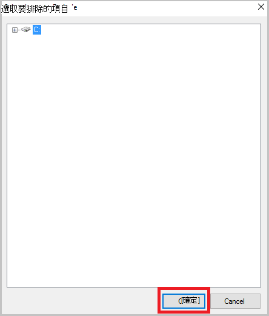

7. 在 [**檔案類型**] 欄位中新增檔案的副檔名。

    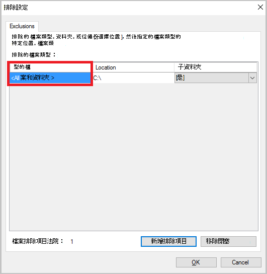

    新增.mp3 副檔名

    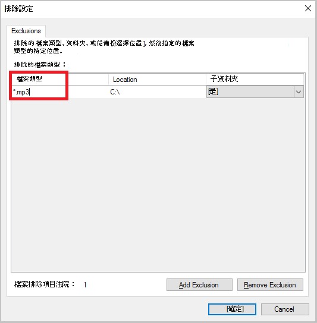

    若要新增其他分機號碼，請按一下 [**新增排除**並輸入其他類型的副檔名 （加上.jpeg 副檔名）。

    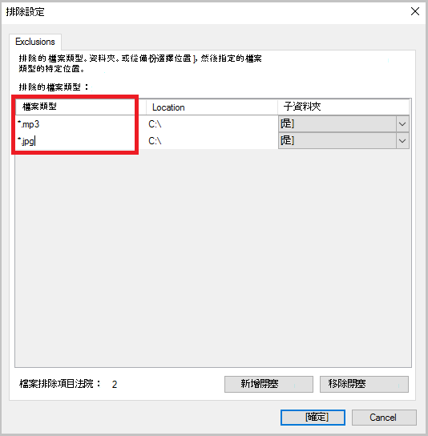

8. 如果您已新增所有擴充功能，請按一下**[確定]**。

9. 繼續使用排程備份精靈，直到**確認] 頁面**上，按一下 [**下一步**，然後按一下 [**完成**]。

    

## 後續步驟
- [從 Azure 還原 Windows 伺服器或 Windows 用戶端](backup-azure-restore-windows-server.md)
- 若要進一步瞭解 Azure 備份，請參閱[Azure 備份概觀](backup-introduction-to-azure-backup.md)
- 請造訪[Azure 備份論壇](http://go.microsoft.com/fwlink/p/?LinkId=290933)
