<properties
    pageTitle="管理 Azure 復原服務保存庫與伺服器 |Microsoft Azure"
    description="您可以使用本教學課程，瞭解如何管理 Azure 復原服務保存庫與伺服器。"
    services="backup"
    documentationCenter=""
    authors="markgalioto"
    manager="cfreeman"
    editor="tysonn"/>

<tags
    ms.service="backup"
    ms.workload="storage-backup-recovery"
    ms.tgt_pltfrm="na"
    ms.devlang="na"
    ms.topic="article"
    ms.date="10/19/2016"
    ms.author="jimpark; markgal"/>


# <a name="monitor-and-manage-azure-recovery-services-vaults-and-servers-for-windows-machines"></a>監控和管理 Azure 復原服務保存庫與伺服器的 Windows 電腦

> [AZURE.SELECTOR]
- [資源管理員](backup-azure-manage-windows-server.md)
- [傳統](backup-azure-manage-windows-server-classic.md)

在本文中，您可以找到可透過 Azure 入口網站與 Microsoft Azure 備份代理程式的備份管理工作的概觀。

[AZURE.INCLUDE [learn-about-deployment-models](../../includes/learn-about-deployment-models-rm-include.md)]傳統的部署模型。

## <a name="management-portal-tasks"></a>管理入口網站的工作

### <a name="access-your-recovery-services-vaults"></a>存取您修復服務保存庫

1. 使用您的 Azure 訂閱[Azure 入口網站](https://portal.azure.com/)登入。

2. 在 [中心] 功能表中，按一下 [**瀏覽**，在資源的清單中，輸入 [**修復服務**。 當您開始輸入，就會篩選清單根據您輸入。 按一下 [**修復服務保存庫**]。

    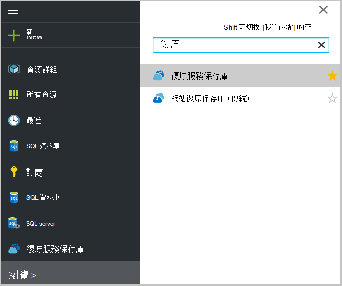 <br/>

2. 選取您想要檢視清單以開啟修復服務保存庫儀表板刀從保存庫的名稱。

    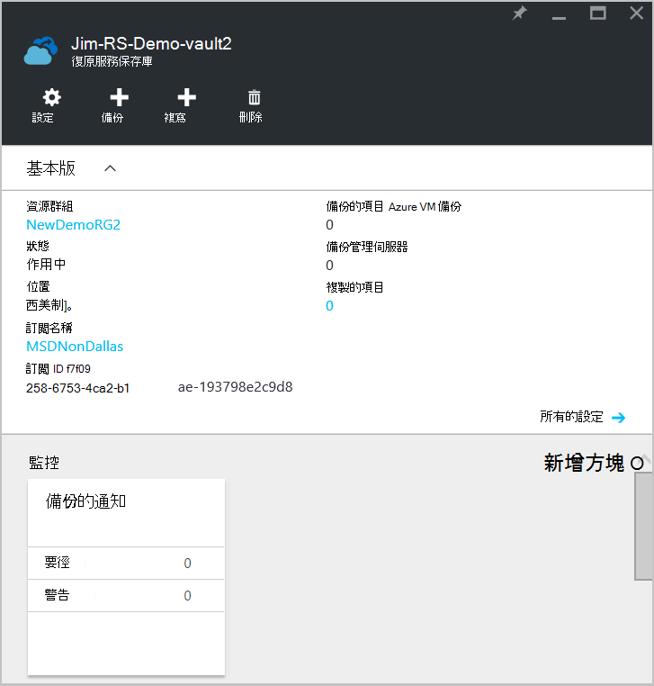 <br/>

## <a name="monitor-jobs-and-alerts"></a>監視工作及提醒
您可以監視工作及修復服務保存庫儀表板，讓您看到的通知︰

- 備份通知的詳細資料
- 檔案和資料夾，以及在雲端中受保護的 Azure 虛擬機器
- Azure 中耗用的總儲存空間
- 備份工作狀態

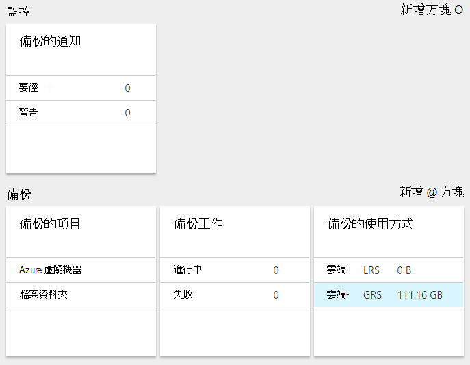

按一下每個這些磚中的資訊將會開啟您在哪裡管理相關的工作相關聯的刀。

從儀表板頂端︰

- 設定提供可用的備份工作的存取權。
- 備份-可協助您備份新的檔案和資料夾 （或 Azure Vm） 來修復服務保存庫。
- 刪除-如果已不再使用復原服務保存庫，您便可以刪除以釋出的儲存空間。 刪除時，才會啟用後從保存庫已刪除所有受保護的伺服器。


## <a name="alerts-for-backups-using-azure-backup-agent"></a>針對使用 Azure 備份代理程式的備份通知︰
| 通知等級  | 傳送的通知 |
| ------------- | ------------- |
| 要徑 | 備份失敗，復原失敗  |
| 警告  | 完成 （當少於 100 封不備份檔案損毀的問題，因為和成功備份多個一百萬檔案） 的備份  |
| 資訊  | 無  |
## <a name="manage-backup-alerts"></a>管理備份提醒
按一下 [**備份通知**] 方塊，以開啟 [**備份通知**刀並管理通知]。

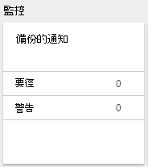

[備份通知] 方塊會顯示數︰

- 無法在過去 24 小時的要徑通知
- 過去 24 小時中無法解析警告通知

按一下這些連結會帶您到**備份通知**刀篩選檢視這些通知 （緊急或警告）。

從備份通知刀中，您︰

- 選擇適當的資訊，將您的通知。

    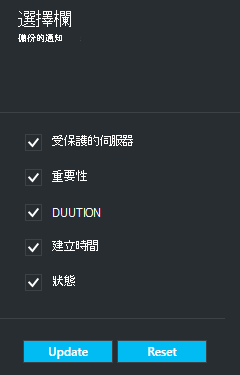

- 篩選嚴重性、 狀態和開始/結束時間的通知。

    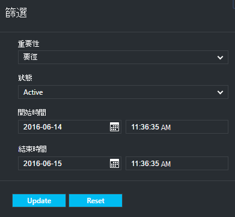

- 設定通知嚴重性、 frequency 及收件者]，以及開啟或關閉提醒。

    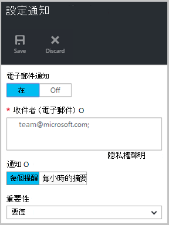

如果**每個通知**選取**通知**頻率為沒有群組或減少電子郵件就會發生。 每個通知產生 1 的通知。 這是預設的設定，並解決電子郵件也會立即送出。

**每小時摘要**選取作為**通知**頻率一個電子郵件會傳送給使用者，告訴他們所產生的最後一個小時內解除新警示。 解決電子郵件會傳送結尾的小時。

下列的重要性層級便會傳送通知︰

- 要徑
- 警告
- 資訊

您停用工作詳細資料刀中的 [**停用**] 按鈕的警示。 當您按一下 [停用，您可以提供解析度備忘稿。

您選擇您想要顯示為 [**選擇欄**] 按鈕的警示的一部分的欄。

>[AZURE.NOTE] 您可以**設定**防禦，以從管理備份通知來選取**監控和報表 > 通知和事件 > 備份通知**，然後按一下 [**篩選**] 或 [**設定通知**。

## <a name="manage-backup-items"></a>管理備份的項目
管理內部部署備份現提供管理入口網站。 在 [儀表板的 [備份] 區段中，[**備份的項目**] 方塊會顯示保存庫來保護備份的項目數目。

按一下 [備份的項目] 方塊中的 [**檔案資料夾**]。

![備份的項目] 方塊](./media/backup-azure-manage-windows-server/backup-items-tile.png)

備份的項目刀會開啟您在這裡看見項目會列出每個特定備份設定檔案資料夾的篩選器。

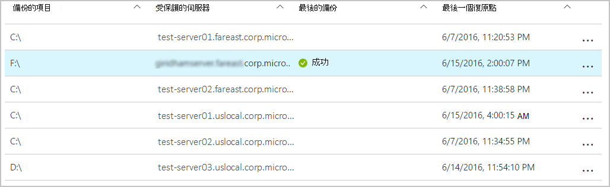

如果您從清單中選取特定的備份項目，您會看到該項目的必要的詳細資訊。

>[AZURE.NOTE] **設定**刀中，從您管理檔案和資料夾，選取**受保護的項目 > 備份的項目**]，然後從下拉式功能表中選取**檔案資料夾**。

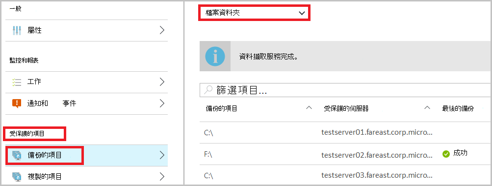

## <a name="manage-backup-jobs"></a>管理備份工作
備份工作的兩個內部部署 （在內部部署伺服器備份到 Azure） 和 Azure 備份會顯示在儀表板。

在 [儀表板的 [備份] 區段中，[備份工作] 方塊會顯示工作的數目︰

- 進行中
- 無法在過去 24 小時。

若要管理您的備份工作，請按一下 [**備份工作**] 方塊，隨即會開啟 [備份工作刀。

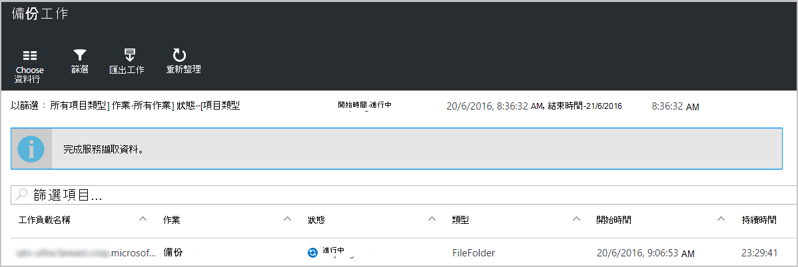

您修改備份工作刀，在頁面頂端的 [**選擇欄**] 按鈕中可用的資訊。

您可以使用 [**篩選**] 按鈕，選取檔案和資料夾與 Azure 虛擬機器備份之間。

如果您沒有看到您的備份的檔案和資料夾，按一下頁面頂端的 [**篩選**] 按鈕，然後選取 [從項目類型] 功能表的 [**檔案和資料夾**。

>[AZURE.NOTE] 您可以從**設定**防禦，以管理備份工作來選取**監控和報表 > 工作 > 備份工作**]，然後從下拉式功能表中選取**檔案資料夾**。

## <a name="monitor-backup-usage"></a>監視備份使用情況
在 [儀表板的 [備份] 區段中，[備份的使用方式] 方塊會顯示耗用 Azure 中的儲存空間。 儲存使用量為提供︰
- 保存庫相關聯的雲端 LRS 儲存使用量
- 保存庫相關聯的雲端 GRS 儲存使用量

## <a name="production-servers"></a>執行伺服器
若要管理您的產品伺服器，請按一下 [**設定**]。 在 [管理底下，按一下 [**備份基礎結構 > 生產伺服器**。

執行伺服器刀清單中所有可用的實際執行伺服器。 按一下 [開啟伺服器詳細資料] 清單中的伺服器上。


## <a name="microsoft-azure-backup-agent-tasks"></a>Microsoft Azure 備份代理程式工作

## <a name="open-the-backup-agent"></a>開啟備份代理程式

開啟**Microsoft Azure 備份代理程式**（您將其搜尋以尋找您的電腦*Microsoft Azure 備份*）。


從可用的**動作**右側的備份代理程式主控台您可以執行下列管理工作︰

- 註冊伺服器
- 備份排程
- 現在備份
- 變更內容

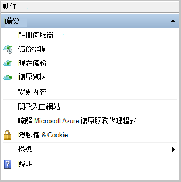

>[AZURE.NOTE] 若要**復原的資料**，請參閱[還原至 Windows server 或 Windows 用戶端電腦的檔案](backup-azure-restore-windows-server.md)。

## <a name="modify-an-existing-backup"></a>修改現有的備份

1. Microsoft Azure 備份代理程式中按一下 [**排程備份**]。

    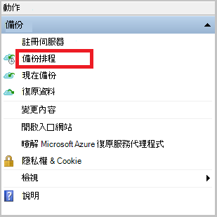

2. **排程備份精靈**] 中保留 [選取 [**變更備份的項目] 或 [時間**] 選項，然後按一下 [**下一步**]。

    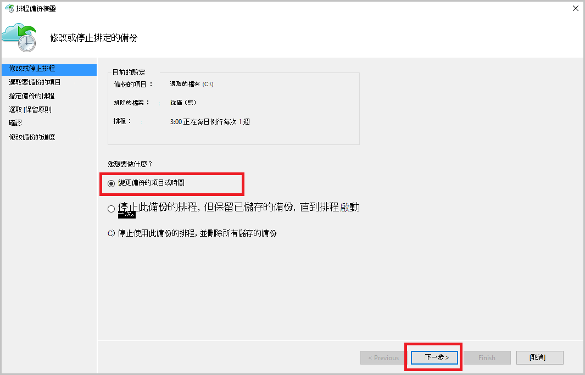

3. 如果您想要新增或變更項目，在 [**選取要備份的項目**] 畫面上按一下 [**新增項目]**。

    您也可以設定**排除設定**精靈中的這頁。 如果您想要排除的檔案或檔案類型閱讀加入[排除設定](#exclusion-settings)程序。

4. 選取的檔案與您想要備份，然後按一下 [**好**的資料夾。

    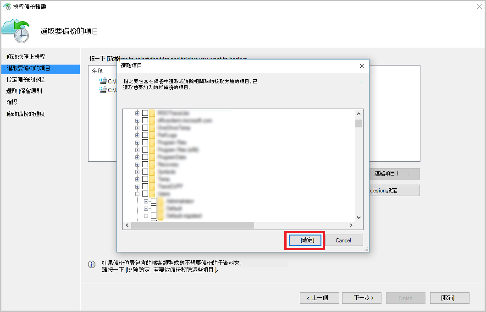

5. 指定**備份的排程**，然後按一下 [**下一步**]。

    您可以排程 （位於 [每日的 3 次最大值） 的每日或週的備份。

    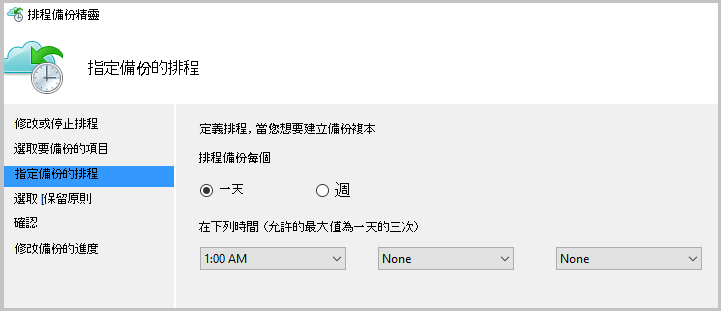

    >[AZURE.NOTE] 指定備份排程的[文件](backup-azure-backup-cloud-as-tape.md)中的詳細說明。

6. 選取的備份複本的**保留原則**，然後按一下 [**下一步**]。

    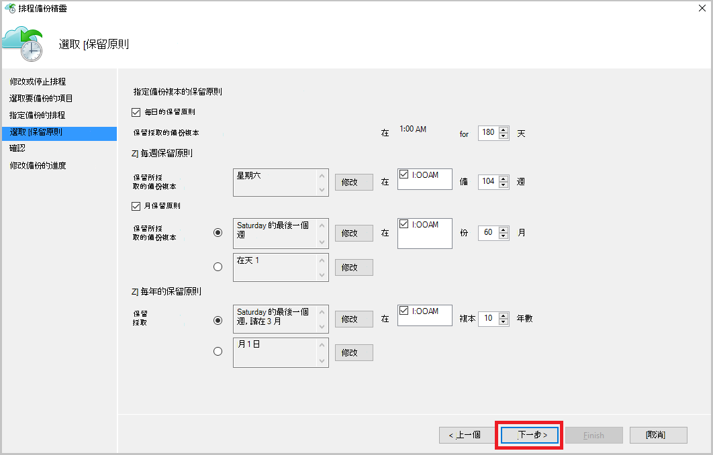

7. 在**確認**畫面上檢閱資訊，然後按一下 [**完成]**。

8. 當精靈完成建立**備份排程**時，請按一下 [**關閉**]。

    修改後防護，您可以確認備份正確觸發移至 [**工作**] 索引標籤，並確認您的變更會反映在備份工作。

## <a name="enable-network-throttling"></a>啟用網路節流  
Azure 備份代理程式提供 Throttling] 索引標籤可讓您控制網路頻寬期間的資料傳輸的使用方式。 此控制項可以是如果您要備份資料期間工作時數，但不是想避免圖片干擾其他網際網路流量的備份程序很有幫助的。 節流的資料傳輸適用於備份及還原活動。  

若要啟用節流設定︰

1. 在**備份代理程式**中，按一下 [**變更內容**。

2. 在 [**節流] 索引標籤，選取 [**啟用節流備份作業 * * 的網際網路頻寬使用量。

    

    一旦您已啟用節流設定，指定備份資料傳輸允許的頻寬**工作時間**和**非工作時間**期間。

    頻寬值 512 kb 秒 (Kbps) 開始，並可以移為 1023 mb 數 (Mbps)。 您也可以指定開始日期和完成**工作時間**，以及一週的哪幾天會視為工作天。 指定的工作時間以外的時間會被視為非工作時間。

3. 按一下**[確定]**。

## <a name="manage-exclusion-settings"></a>管理排除設定

1. 開啟**Microsoft Azure 備份代理程式**（您可以找到*Microsoft Azure 備份*搜尋您的電腦）。

    

2. Microsoft Azure 備份代理程式中按一下 [**排程備份**]。

    

3. 保留排程備份精靈中的 [選取的 [**進行的變更來備份的項目] 或 [時間**] 選項，然後按一下 [**下一步**]。

    

4. 按一下 [**排除項目設定**]。

    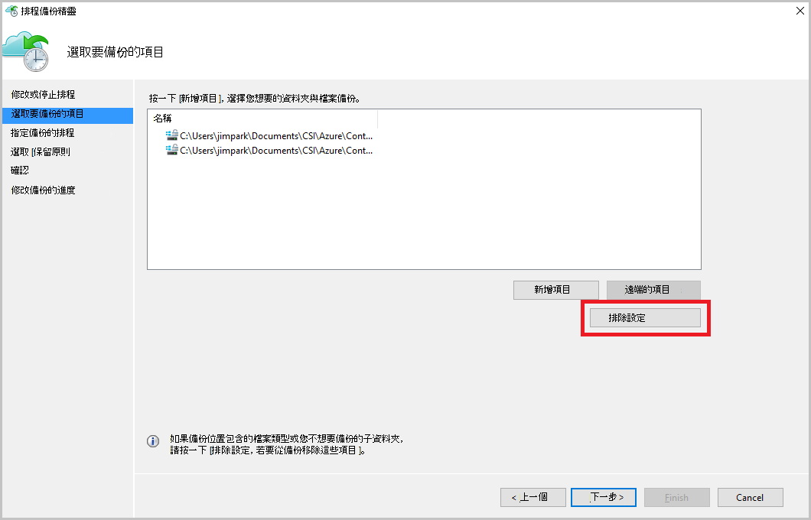

5. 按一下 [**新增排除項目**]。

    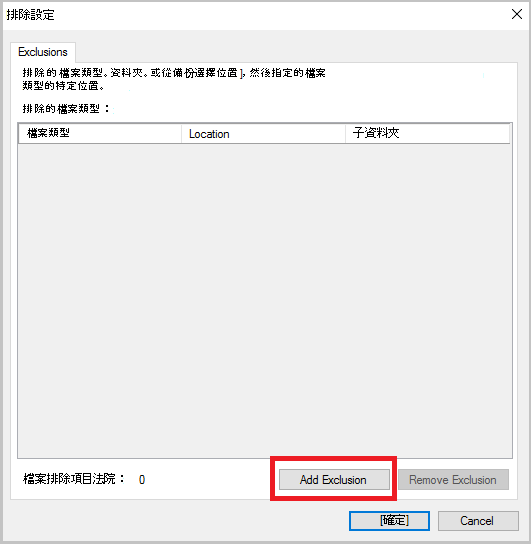

6. 選取的位置，然後按一下**[確定]**。

    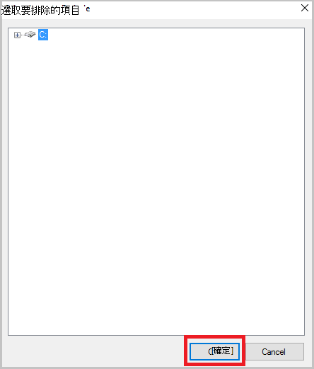

7. 在 [**檔案類型**] 欄位中新增檔案的副檔名。

    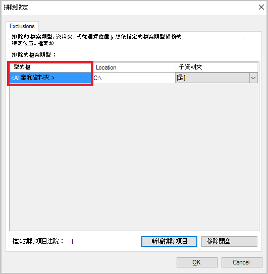

    新增.mp3 副檔名

    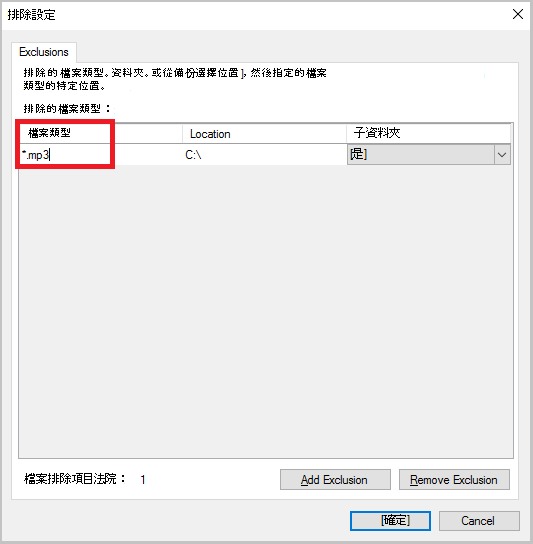

    若要新增其他分機號碼，請按一下 [**新增排除**並輸入其他類型的副檔名 （加上.jpeg 副檔名）。

    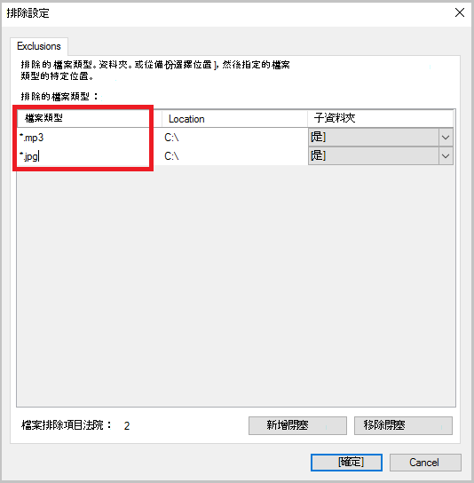

8. 如果您已新增所有擴充功能，請按一下**[確定]**。

9. 繼續使用排程備份精靈，直到**確認] 頁面**上，按一下 [**下一步**，然後按一下 [**完成**]。

    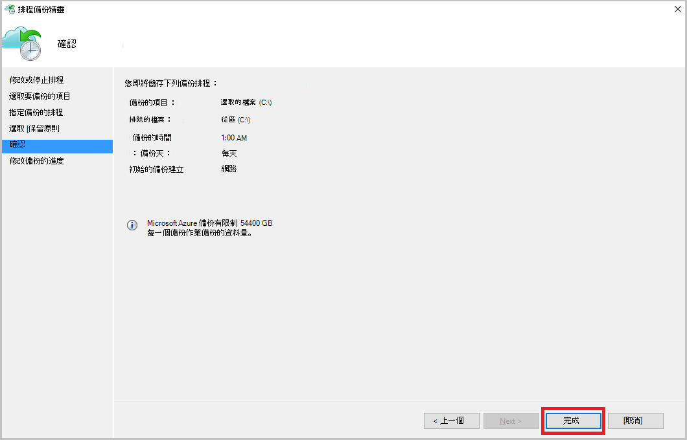

## <a name="frequently-asked-questions"></a>常見問題集
**Q1。備份工作狀態顯示為已完成的 Azure 備份代理程式中為何無法將其取得立即反映在入口網站？**

A1。 那里會在 15 分鐘之間的備份工作狀態的最大的延遲反映在 Azure 備份代理程式和 Azure 入口網站。

**Q.2 備份工作失敗時，如何時間提高通知？**

Azure 備份失敗的 20 分鐘內，就會引發 A.2 通知。

**Q3。有位置的電子郵件不會傳送通知設定的情況下嗎？**

A3。 以下是以減少通知雜訊不會傳送通知的情況下︰

   - 如果每小時設定通知和提醒會引發並解決 1 小時
   - 已取消作業。
   - 第二個備份工作失敗，因為正在進行中的原始備份工作。

## <a name="troubleshooting-monitoring-issues"></a>監控問題的疑難排解

**問題︰**工作及/或從 Azure 備份代理程式的通知不會出現在入口網站。

**疑難排解步驟︰**此程序， ```OBRecoveryServicesManagementAgent```，將工作和通知資料傳送至 Azure 備份服務。 有時候此程序會變成卡或關閉。

1. 若要確認未執行程序，開啟**工作管理員**，檢查如果```OBRecoveryServicesManagementAgent```程序正在執行。

2. 假設程序正在執行，開啟**[控制台]** ，並瀏覽服務的清單。 啟動或重新啟動**Microsoft Azure 復原服務管理代理程式**。

    如需詳細資訊，瀏覽在記錄︰<br/>
`<AzureBackup_agent_install_folder>\Microsoft Azure Recovery Services Agent\Temp\GatewayProvider*`. 例如︰<br/> `C:\Program Files\Microsoft Azure Recovery Services Agent\Temp\GatewayProvider0.errlog`.

## <a name="next-steps"></a>後續步驟
- [從 Azure 還原 Windows 伺服器或 Windows 用戶端](backup-azure-restore-windows-server.md)
- 若要進一步瞭解 Azure 備份，請參閱[Azure 備份概觀](backup-introduction-to-azure-backup.md)
- 請造訪[Azure 備份論壇](http://go.microsoft.com/fwlink/p/?LinkId=290933)
