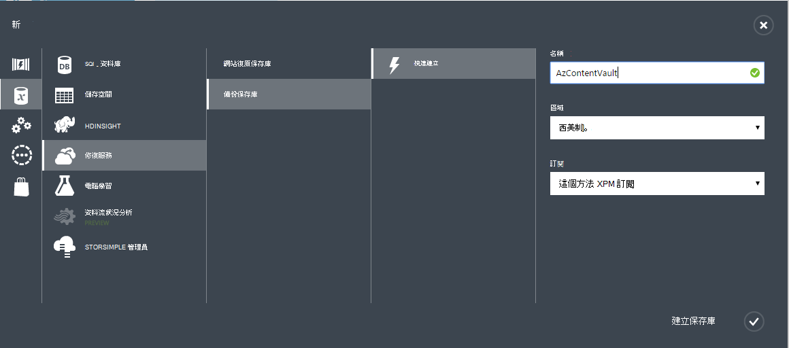

<properties
  pageTitle="準備您的環境備份負載使用 Azure 備份伺服器 |Microsoft Azure"
  description="請確定您的環境適當準備備份使用 Azure 備份伺服器的工作量"
  services="backup"
  documentationCenter=""
  authors="pvrk"
  manager="shivamg"
  editor=""
  keywords="azure 備份伺服器。備份保存庫"/>

<tags
  ms.service="backup"
  ms.workload="storage-backup-recovery"
  ms.tgt_pltfrm="na"
  ms.devlang="na"
  ms.topic="article"
  ms.date="08/22/2016"
  ms.author="jimpark;trinadhk;pullabhk; markgal"/>

# <a name="preparing-to-back-up-workloads-using-azure-backup-server"></a>準備備份使用 Azure 備份伺服器的工作量

> [AZURE.SELECTOR]
- [Azure 備份伺服器](backup-azure-microsoft-azure-backup.md)
- [SCDPM](backup-azure-dpm-introduction.md)
- [Azure 備份伺服器 （傳統）](backup-azure-microsoft-azure-backup-classic.md)
- [SCDPM （傳統）](backup-azure-dpm-introduction-classic.md)


本文是準備您的環境備份使用 Azure 備份伺服器的工作量。 Azure 備份伺服器，您可以從單一主控台保護例如 HYPER-V Vm、 Microsoft SQL Server、 SharePoint Server、 Microsoft Exchange 和 Windows 用戶端應用程式工作負載。

>[AZURE.WARNING] Azure 備份伺服器繼承工作量備份資料保護管理員 (DPM) 的功能。 您會發現 DPM 文件的某些功能的指標。 不過 Azure 備份伺服器不提供保護膠帶貼上或整合與系統管理中心。

## <a name="1-windows-server-machine"></a>1.Windows Server 的電腦


快速 Azure 備份伺服器安裝和執行的第一個步驟是的 Windows Server 的電腦。

| 位置 | 最低需求。 | 其他指示 |
| -------- | -------------------- | ----------------------- |
| Azure | Azure IaaS 虛擬機器<br><br>A2 標準︰ 2 核心，3.5 GB 的 RAM | 您可以開始使用 Windows Server 2012 R2 資料中心的簡單庫。 [使用 Azure 備份伺服器 (DPM) 的保護 IaaS 負載](https://technet.microsoft.com/library/jj852163.aspx)有許多不同。 請確定您閱讀，請參閱完全部署電腦之前，先。 |
| 內部部署 | HYPER-V VM<br> VMWare VM<br> 或實體主機<br><br>2 核心和 4 GB 的 RAM | 您可以 deduplicate 使用 Windows Server Deduplication DPM 儲存空間。 進一步瞭解如何[DPM 和 deduplication](https://technet.microsoft.com/library/dn891438.aspx)共同合作 HYPER-V Vm 部署。 |

> [AZURE.NOTE] 在 Windows Server 2012 R2 資料中心的電腦上安裝 Azure 備份伺服器的建議。 必要條件許多自動包含最新版本的 Windows 作業系統。

如果您打算此伺服器加入網域有些時候，建議在 Azure 備份伺服器安裝之前，完成網域加入活動。 部署是*不受支援*之後，請移至新的網域的現有 Azure 備份伺服器機器。

## <a name="2-backup-vault"></a>2.備份保存庫


無論您將備份資料傳送至 Azure，或將其保留本機，軟體會需要連線到 Azure。 若要更特定，Azure 備份伺服器電腦必須註冊備份保存庫。

若要建立備份保存庫︰

1. [管理入口網站](http://manage.windowsazure.com/)登入。

2. 按一下 [**新** > **資料服務** > **修復服務** > **備份保存庫** > **快速建立**。 如果您有多個與您的組織帳戶相關聯的訂閱，請選擇 [建立備份保存庫的關聯正確訂閱]。

3. 在 [**名稱**] 中，輸入好記的名稱來識別保存庫。 必須是唯一的每個訂閱。

4. 在 [**地區**中，選取 [保存庫的地理區域。 一般而言，保存庫的區域會挑出根據資料主權或網路延遲限制。

    

5. 按一下 [**建立保存庫**。 需要時建立備份保存庫。 監控狀態通知，底部的入口網站。

    

6. 已順利建立保存庫，並在為使用中的 [復原服務] 頁面會列出出現確認訊息。
    

  > [AZURE.IMPORTANT] 請務必選擇適當的儲存空間重複選項時已建立保存庫之後，向右。 瞭解更多關於[地理多餘](../storage/storage-redundancy.md#geo-redundant-storage)和本[概觀](../storage/storage-redundancy.md)[本機多餘](../storage/storage-redundancy.md#locally-redundant-storage)的選項。


## <a name="3-software-package"></a>3.軟體套件


### <a name="downloading-the-software-package"></a>下載軟體套件

類似地窖認證，您可以下載 Microsoft Azure 備份應用程式工作負載的備份保存庫**快速啟動] 頁面**。

1. 按一下 [**應用程式工作負載 （磁碟雲端）**。 這將您從軟體套件可以下載位置下載中心] 頁面。

    

2. 按一下 [**下載**]。

    

3. 選取所有的檔案，然後按一下 [**下一步**]。 下載 Microsoft Azure 備份下載頁面上，即將的所有檔案和所有檔案都放在同一個資料夾。


    由於下載大小的所有檔案放在一起的 > 3g，請在上 10Mbps 下載可能需要 60 分鐘的時間才能完成下載的連結。


### <a name="extracting-the-software-package"></a>擷取軟體套件

下載所有檔案後，按一下 [ **MicrosoftAzureBackupInstaller.exe**]。 這會啟動**Microsoft Azure 備份設定精靈**設定檔案解壓縮到您所指定的位置。 請繼續執行精靈，然後按一下 [**擷取**] 按鈕，以開始擷取程序。

> [AZURE.WARNING] 至少 4 GB 的可用空間，才能安裝程式檔案解壓縮。


後擷取程序完成，核取方塊以啟動剛解壓縮的*setup.exe*開始安裝 Microsoft Azure 備份伺服器，並按一下 [**完成**] 按鈕。

### <a name="installing-the-software-package"></a>安裝軟體套件

1. 按一下 [啟動設定精靈的**Microsoft Azure 備份**]。

    

2. 在 [歡迎] 畫面上按一下 [**下一步**] 按鈕。 會帶您到*必要檢查*] 區段。 在這個畫面中，按一下 [**檢查**] 按鈕，決定 Azure 備份伺服器的硬體與軟體先決條件是否符合。 如果所有的必要條件都已經符合成功，您會看到訊息，指出電腦是否符合需求。 按一下 [**下一步**] 按鈕。

    

3. Microsoft Azure 備份伺服器需要 SQL Server 標準，並需要適當的 SQL Server 二進位檔案隨附搭售 Azure 備份伺服器安裝套件。 時開始新的 Azure 備份伺服器安裝，您應該選擇**安裝新執行個體的 SQL Server 使用此設定**的選項，然後按一下 [**檢查並安裝**] 按鈕。 一旦成功安裝必要條件，請按一下 [**下一步**]。

    

    如果發生失敗，並重新啟動電腦建議，執行此作業，然後按一下 [**檢查]**。

    > [AZURE.NOTE] Azure 備份伺服器無法與遠端的 SQL Server 執行個體。 需要本機 Azure 備份伺服器使用的執行個體。

4. 提供您在安裝 Microsoft Azure 備份伺服器檔案的位置，然後按一下 [**下一步**]。

    

    可用的位置是最 Azure 後的需求。 請確定草稿的位置是至少 5%的預計備份到雲端的資料。 磁碟保護，必須安裝完成後設定不同的磁碟。 如需關於儲存集區的詳細資訊，請參閱[設定儲存集區和磁碟儲存空間](https://technet.microsoft.com/library/hh758075.aspx)。

5. 如果在受限制的本機使用者帳戶提供強式密碼，然後按一下 [**下一步**]。

    

6. 選取您想要使用*Microsoft Update]*檢查更新，然後按一下 [**下一步**]。

    >[AZURE.NOTE] 我們建議您不必重新導向至 Microsoft Update，提供 for Windows 和 Microsoft Azure 備份伺服器等其他產品的資訊安全與重要更新的 Windows Update。

    

7. 檢閱*摘要的設定*，然後按一下 [**安裝**]。

    

8. 安裝的情況階段。 第一個階段 Microsoft Azure 修復服務代理程式已安裝在伺服器上。 精靈也會檢查網際網路連線。 如果網際網路連線有您可以繼續安裝，否則，您必須提供 proxy 詳細資料] 來連線到網際網路。

    下一步是設定 Microsoft Azure 修復服務代理程式。 設定的一部份，您必須提供您註冊備份保存庫至電腦的保存庫認證。 您也會提供複雜密碼加密/解密 Azure 和您的部署之間傳送資料至。 您可以自動產生複雜密碼，或提供您自己的最小 16 個字元複雜密碼。 繼續使用精靈，直到已設定代理程式。

    

9. 註冊 Microsoft Azure 備份伺服器的成功完成後，整體設定精靈會繼續安裝和設定的 SQL Server Azure 備份伺服器元件。 SQL Server 元件安裝完成後，會安裝 Azure 備份伺服器元件。

    


完成安裝步驟，產品的桌面圖示所建立的以及。 只要按兩下 [啟動產品] 圖示。

### <a name="add-backup-storage"></a>新增備份的儲存空間

第一個的備份複本會保留在儲存空間附加至 Azure 備份伺服器電腦上。 如需有關新增磁碟的詳細資訊，請參閱[設定儲存集區和磁碟儲存空間](https://technet.microsoft.com/library/hh758075.aspx)。

> [AZURE.NOTE] 您需要新增備份的儲存空間，即使您打算傳送資料至 Azure。 目前結構中的 Azure 備份伺服器，Azure 備份保存庫保留資料的*第二個*複本時保留的第一個 （且強制） 的備份複本的本機存放區。  

## <a name="4-network-connectivity"></a>4.網路連線


Azure 備份伺服器需要連線至 Azure 備份服務才能成功地產品。 若要驗證是否電腦已連線至 Azure，使用```Get-DPMCloudConnection```commandlet Azure 備份伺服器 PowerShell 主控台中檢視。 如果 commandlet 的輸出為 TRUE，然後連線存在，還沒有任何連線能力。

同時，Azure 訂閱，必須在健全狀態。 若要找出您的訂閱的狀態，以及管理，登入[訂閱入口網站]( https://account.windowsazure.com/Subscriptions)。

一旦您知道 Azure 連線和 Azure 訂閱的狀態，您可以使用下表，找出提供的備份/還原功能的影響。

| 連線狀態 | Azure 訂閱 | Azure 備份| 備份到磁碟 | 從 Azure 還原 | 還原磁碟 |
| -------- | ------- | --------------------- | ------------------- | --------------------------- | ----------------------- |
| 連線 | 作用中 | 允許 | 允許 | 允許 | 允許 |
| 連線 | 過期 | 停止 | 停止 | 允許 | 允許 |
| 連線 | 已取消提供 | 停止 | 停止 | 停止與 Azure 復原刪除的點 | 停止 |
| 遺失的連線 > 15 天 | 作用中 | 停止 | 停止 | 允許 | 允許 |
| 遺失的連線 > 15 天 | 過期 | 停止 | 停止 | 允許 | 允許 |
| 遺失的連線 > 15 天 | 已取消提供 | 停止 | 停止 |  停止與 Azure 復原刪除的點 | 停止 |

### <a name="recovering-from-loss-of-connectivity"></a>從連線中斷復原
如果您有防火牆或 proxy 的 Azure 無法存取，您需要 whitelist 防火牆/proxy 設定檔中的下列網域地址︰

- www.msftncsi.com
- \*.Microsoft.com
- \*.WindowsAzure.com
- \*。 microsoftonline.com
- \*。 windows.net

一旦連線至 Azure 已還原至 Azure 備份伺服器電腦可以執行的作業取決於 Azure 訂閱狀態。 上述表格中有允許後的電腦 「 連接 」 的作業的詳細資料。

### <a name="handling-subscription-states"></a>處理訂閱的狀態

請可採取的 Azure 訂閱從*過期*或*取消提供*狀態*作用中*狀態。 不過這有一些影響產品行為而不是*作用中*狀態︰

- *取消提供*訂閱會失去期間，它會取消提供的功能。 在開啟 [*作用中*，為恢復備份/還原的產品功能。 在本機磁碟上的備份資料也可以擷取如果它保留夠大保留週期。 不過，Azure 中的備份資料會永久遺失後訂閱進入*取消提供*狀態。
- *過期*的訂閱只會遺失的功能鍵，直到它已*使用*一次。 不會執行任何排定的訂閱已經*過期*期間的備份。


## <a name="troubleshooting"></a>疑難排解

如果有錯誤的 Microsoft Azure 備份伺服器是在安裝階段 （或備份或還原） 失敗，請參閱本文[代碼文件時發生錯誤](https://support.microsoft.com/kb/3041338)，如需詳細資訊。
您也可以參閱[Azure 備份相關的常見問題集](backup-azure-backup-faq.md)


## <a name="next-steps"></a>後續步驟

您可以在 Microsoft TechNet 網站上取得[準備 dpm 環境](https://technet.microsoft.com/library/hh758176.aspx)的詳細的資訊。 它也包含要在其 Azure 備份伺服器可以部署或使用支援的設定的相關資訊。

若要深入瞭解使用 Microsoft Azure 備份伺服器的工作量保護，您可以使用這些文章。

- [SQL Server 備份](backup-azure-backup-sql.md)
- [SharePoint server 備份](backup-azure-backup-sharepoint.md)
- [替代伺服器備份](backup-azure-alternate-dpm-server.md)
