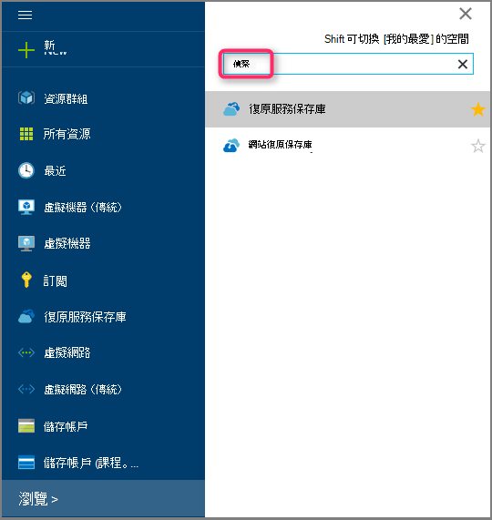
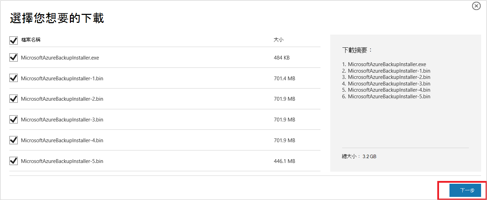
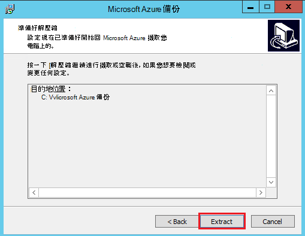
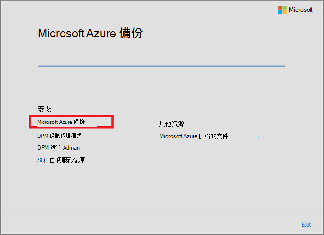
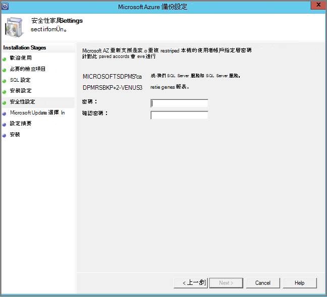
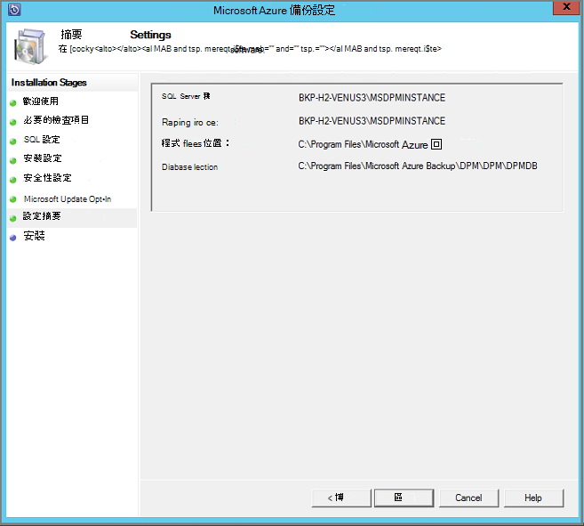
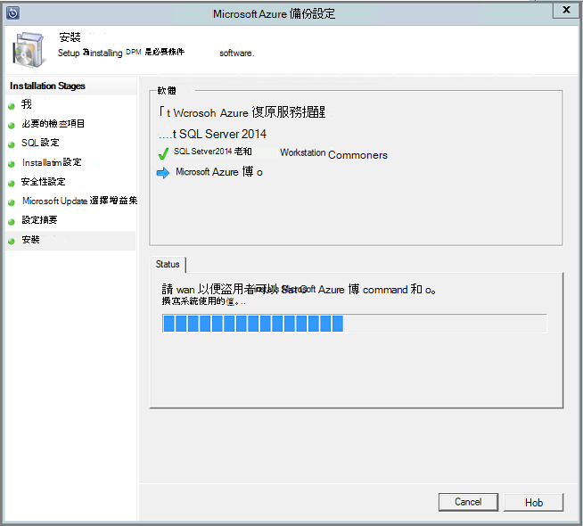

<properties
  pageTitle="準備您的環境備份負載使用 Azure 備份伺服器 |Microsoft Azure"
  description="使用 Azure 備份伺服器來保護或備份負載環境準備作業。"
  services="backup"
  documentationCenter=""
  authors="PVRK"
  manager="shivamg"
  editor=""
  keywords="azure 備份伺服器。保護負載;備份負載"/>

<tags
  ms.service="backup"
  ms.workload="storage-backup-recovery"
  ms.tgt_pltfrm="na"
  ms.devlang="na"
  ms.topic="article"
  ms.date="09/27/2016"
  ms.author="jimpark;trinadhk;pullabhk;markgal"/>

# <a name="preparing-to-back-up-workloads-using-azure-backup-server"></a>準備備份使用 Azure 備份伺服器的工作量

> [AZURE.SELECTOR]
- [Azure 備份伺服器](backup-azure-microsoft-azure-backup.md)
- [SCDPM](backup-azure-dpm-introduction.md)
- [Azure 備份伺服器 （傳統）](backup-azure-microsoft-azure-backup-classic.md)
- [SCDPM （傳統）](backup-azure-dpm-introduction-classic.md)

本文說明如何備份負載使用 Azure 備份 Server 環境準備作業。 Azure 備份伺服器，您可以從單一主控台保護例如 HYPER-V Vm、 Microsoft SQL Server、 SharePoint Server、 Microsoft Exchange 和 Windows 用戶端應用程式工作負載。 您也可以保護與伺服器 (IaaS) 工作量例如 Vm Azure 中的資訊。

> [AZURE.NOTE] Azure 有兩種部署模型建立及使用的資源︰[資源管理員] 及 [傳統](../resource-manager-deployment-model.md)。 本文提供還原 Vm 部署使用資源管理員模型的資訊與程序。

Azure 備份伺服器繼承大部分的工作量備份功能從資料保護管理員 (DPM)。 本文連結至 DPM 文件，以說明一些的共用功能。 透過 Azure 備份伺服器共用的 DPM 相同的功能。 Azure 備份伺服器並不會備份膠帶貼上，也不會整合系統管理中心。

## <a name="1-choose-an-installation-platform"></a>1.選擇安裝的平台

設定 Windows Server 可快速 Azure 備份伺服器安裝和執行的第一個步驟。 您的伺服器可以是 Azure 或內部部署。

### <a name="using-a-server-in-azure"></a>使用 Azure 中的伺服器

在選擇執行 Azure 備份 Server 的伺服器時，建議您開始使用 Windows Server 2012 R2 資料中心的圖庫圖像。 [建立第一個 Windows 虛擬機器 Azure 入口網站中](..\virtual-machines\virtual-machines-windows-hero-tutorial.md)的文件提供的教學課程的快速入門建議虛擬機器中 Azure，即使您未曾使用過 Azure 之前。 建議的最低需求伺服器虛擬機器 (VM) 應︰ A2 標準與 2 核心 3.5 GB 的 RAM。

保護與 Azure 備份伺服器負載有許多不同。 文章[與 Azure 虛擬機器的安裝 DPM](https://technet.microsoft.com/library/jj852163.aspx)，可協助說明這些不同。 請完全部署電腦之前，先閱讀本文。

### <a name="using-an-on-premises-server"></a>使用內部部署伺服器

如果您不想要執行基本伺服器 Azure 中，您可以執行 HYPER-V VM、 VMware VM 或實體的主機上的伺服器。 建議的最低需求伺服器硬體是 2 的核心和 4 GB 的 RAM。 下表列出支援的作業系統。

| 作業系統        | 平台           | SKU  |
| :------------- |-------------| :-----|
|Windows Server 2012 R2 和最新的預存程序| 64 位元| 標準，資料中心，Foundation|
|Windows Server 2012 和最新的預存程序|    64 位元| 資料中心，Foundation，標準|
|Windows 儲存 Server 2012 R2 和最新的預存程序  |64 位元|    [標準]、 [工作群組|
|Windows 儲存 Server 2012 和最新的預存程序 |64 位元 |[標準]、 [工作群組|


您可以 deduplicate 使用 Windows Server Deduplication DPM 儲存空間。 進一步瞭解如何[DPM 和 deduplication](https://technet.microsoft.com/library/dn891438.aspx)共同合作 HYPER-V Vm 部署。

> [AZURE.NOTE]  您無法在執行網域控制站電腦上安裝 Azure 備份伺服器。

您必須將 Azure 備份伺服器加入網域。 如果您打算將 [伺服器] 移至另一個網域，建議的新網域加入伺服器，才能安裝 Azure 備份伺服器。 部署是*不受支援*之後，請移至新的網域的現有 Azure 備份伺服器機器。

## <a name="2-recovery-services-vault"></a>2.復原服務保存庫

無論您將備份資料傳送至 Azure，或將其保留本機，軟體會需要連線到 Azure。 若要更特定，Azure 備份伺服器電腦必須註冊復原服務保存庫。

若要建立復原服務保存庫︰

1. [Azure 入口網站](https://portal.azure.com/)登入。

2. 在 [中心] 功能表中，按一下 [**瀏覽**，在資源的清單中，輸入 [**修復服務**。 當您開始輸入，就會篩選清單根據您輸入。 按一下 [**修復服務保存庫**]。

     <br/>

    修復服務保存庫的清單會顯示。

3. 在 [**復原服務保存庫**] 功能表中，按一下 [**新增**。

    

    修復服務保存庫刀開啟時，它會提示您提供的**名稱**、**訂閱**、 [**資源] 群組**中，與**位置**。

    

4. [**名稱**] 中，輸入好記的名稱來識別保存庫。 名稱必須是唯一的 Azure 訂閱。 輸入包含 2 到 50 個字元之間的名稱。 它必須以字母，以開始，並可以包含字母、 數字和連字號。

5. 按一下以查看可用的訂閱清單的**訂閱**]。 如果您不確定要使用的訂閱，使用預設的 （或建議） 訂閱。 會有多個選項只有您的組織帳戶是 Azure 的多個訂閱相關聯。

6. 按一下 [**資源群組**以查看可用的資源群組清單，或按一下 [**新增**]，建立新的資源群組。 完整資源群組的詳細資訊，請參閱[Azure 資源管理員的概觀](../azure-resource-manager/resource-group-overview.md)

7. 按一下以選取保存庫的地理區域的**位置**。

8. 按一下 [**建立**]。 可能需要一段時間的建立修復服務保存庫。 監控右側區內入口網站中的狀態通知。
您保存庫建立之後，它會在入口網站中開啟。

### <a name="set-storage-replication"></a>設定儲存複寫

儲存複寫選項可讓您選擇地理多餘的儲存在本機上多餘的儲存空間。 根據預設，您保存庫有地理多餘的儲存空間。 [離開] 選項設定為地理多餘的儲存空間，如果這是您主要的備份。 如果您想要不想為長期便宜選項，請選擇 [本機多餘的儲存空間]。 瞭解更多關於[地理多餘](../storage/storage-redundancy.md#geo-redundant-storage)和[Azure 儲存體複寫概觀](../storage/storage-redundancy.md)中[本機多餘](../storage/storage-redundancy.md#locally-redundant-storage)的儲存選項。

若要編輯的儲存空間複寫設定︰

1. 選取您要開啟保存庫儀表板與設定的保存庫。 如果**設定**刀沒有開啟，請按一下 [保存庫儀表板中的 [**所有設定**]。

2. 在**設定**刀中，按一下 [**備份基礎結構** > 開啟**備份設定**刀**備份設定**。 在**備份設定**刀中，選擇您保存庫的儲存空間複寫選項。

    

    選擇您保存庫的 [儲存] 選項之後, 您準備好 VM 關聯保存庫。 若要開始關聯，請探索並註冊 Azure 虛擬機器。

## <a name="3-software-package"></a>3.軟體套件

### <a name="downloading-the-software-package"></a>下載軟體套件
1. [Azure 入口網站](https://portal.azure.com/)登入。

2. 如果您已經修復服務保存庫開啟，請跳至步驟 3。 如果您沒有地窖開啟，請修復服務，但在 Azure 入口網站中，在中心] 功能表中，按一下 [**瀏覽**。

    - 在資源的清單中，輸入**修復服務**。
    - 當您開始輸入，就會篩選清單根據您輸入。 當您看到**修復服務保存庫**時，請按一下它。

    

    修復服務保存庫清單隨即出現。

    - 從修復服務保存庫清單中，選取 [保存庫]。

    隨即會開啟選取保存庫儀表板。

    

3. 設定刀開啟預設。 如果關閉，按一下 [**設定**]，以開啟 [設定刀。

    

4. 按一下 [**備份**] 中，開啟 [快速入門] 精靈的 [**快速入門**。

    

5. 在 [開始使用，會開啟，備份目標畫面會自動選取。
    

    在 [**備份目標**] 區段中，選取 [*內部部署**的工作量執行位置*]。

    

6. 選取您想要保護使用中*您想要保護哪些負載*Azure 備份伺服器]，然後按一下**[確定]**的工作量。

    > [AZURE.NOTE] 如果您打算保護只檔案和資料夾，我們建議使用 Azure 備份代理程式。 如果您打算保護比只檔案和資料夾的更多工作負載供日後如果您打算以展開保護需求，請選取所有工作負載。

    這會變更快速入門] 精靈，準備從內部部署負載保護 Azure 基礎結構。

    ![快速入門] 精靈變更](./media/backup-azure-microsoft-azure-backup/getting-started-prep-infra.png)

7. 在開啟的**準備基礎結構**刀，按一下的**下載**連結的安裝 Azure 備份伺服器和下載保存庫認證。 您可以使用保存庫認證期間註冊 Azure 備份伺服器的復原服務保存庫。 連結可讓您可以進行下載軟體套件的下載中心。

    

8. 選取所有的檔案，然後按一下 [**下一步**]。 下載 Microsoft Azure 備份下載頁面上，即將的所有檔案和所有檔案都放在同一個資料夾。

    

    由於下載大小的所有檔案放在一起的 > 3g，請在上 10Mbps 下載可能需要 60 分鐘的時間才能完成下載的連結。


### <a name="extracting-the-software-package"></a>擷取軟體套件

下載所有檔案後，按一下 [ **MicrosoftAzureBackupInstaller.exe**]。 這會啟動**Microsoft Azure 備份設定精靈**設定檔案解壓縮到您所指定的位置。 請繼續執行精靈，然後按一下 [**擷取**] 按鈕，以開始擷取程序。

> [AZURE.WARNING] 至少 4 GB 的可用空間，才能安裝程式檔案解壓縮。




後擷取程序完成，核取方塊以啟動剛解壓縮的*setup.exe*開始安裝 Microsoft Azure 備份伺服器，並按一下 [**完成**] 按鈕。

### <a name="installing-the-software-package"></a>安裝軟體套件

1. 按一下 [啟動設定精靈的**Microsoft Azure 備份**]。

    

2. 在 [歡迎] 畫面上按一下 [**下一步**] 按鈕。 會帶您到*必要檢查*] 區段。 在這個畫面中，按一下 [**檢查**] 按鈕，決定 Azure 備份伺服器的硬體與軟體先決條件是否符合。 如果所有的必要條件都已經符合成功，您會看到訊息，指出電腦是否符合需求。 按一下 [**下一步**] 按鈕。

    

3. Microsoft Azure 備份伺服器需要 SQL Server 標準，並需要適當的 SQL Server 二進位檔案隨附搭售 Azure 備份伺服器安裝套件。 時開始新的 Azure 備份伺服器安裝，您應該選擇**安裝新執行個體的 SQL Server 使用此設定**的選項，然後按一下 [**檢查並安裝**] 按鈕。 一旦成功安裝必要條件，請按一下 [**下一步**]。

    

    如果發生失敗，並重新啟動電腦建議，執行此作業，然後按一下 [**檢查]**。

    > [AZURE.NOTE] Azure 備份伺服器無法與遠端的 SQL Server 執行個體。 需要本機 Azure 備份伺服器使用的執行個體。

4. 提供您在安裝 Microsoft Azure 備份伺服器檔案的位置，然後按一下 [**下一步**]。

    

    可用的位置是最 Azure 後的需求。 請確定草稿的位置是至少 5%的預計備份到雲端的資料。 磁碟保護，必須安裝完成後設定不同的磁碟。 如需關於儲存集區的詳細資訊，請參閱[設定儲存集區和磁碟儲存空間](https://technet.microsoft.com/library/hh758075.aspx)。

5. 如果在受限制的本機使用者帳戶提供強式密碼，然後按一下 [**下一步**]。

    

6. 選取您想要使用*Microsoft Update]*檢查更新，然後按一下 [**下一步**]。

    >[AZURE.NOTE] 我們建議您不必重新導向至 Microsoft Update，提供 for Windows 和 Microsoft Azure 備份伺服器等其他產品的資訊安全與重要更新的 Windows Update。

    

7. 檢閱*摘要的設定*，然後按一下 [**安裝**]。

    

8. 安裝的情況階段。 第一個階段 Microsoft Azure 修復服務代理程式已安裝在伺服器上。 精靈也會檢查網際網路連線。 如果網際網路連線有您可以繼續安裝，否則，您必須提供 proxy 詳細資料] 來連線到網際網路。

    下一步是設定 Microsoft Azure 修復服務代理程式。 設定的一部份，您必須提供保存庫認證，才能註冊復原服務保存庫至電腦。 您也會提供複雜密碼加密/解密 Azure 和您的部署之間傳送資料至。 您可以自動產生複雜密碼，或提供您自己的最小 16 個字元複雜密碼。 繼續使用精靈，直到已設定代理程式。

    

9. 註冊 Microsoft Azure 備份伺服器的成功完成後，整體設定精靈會繼續安裝和設定的 SQL Server Azure 備份伺服器元件。 SQL Server 元件安裝完成後，會安裝 Azure 備份伺服器元件。

    


完成安裝步驟，產品的桌面圖示所建立的以及。 只要按兩下 [啟動產品] 圖示。

### <a name="add-backup-storage"></a>新增備份的儲存空間

第一個的備份複本會保留在儲存空間附加至 Azure 備份伺服器電腦上。 如需有關新增磁碟的詳細資訊，請參閱[設定儲存集區和磁碟儲存空間](https://technet.microsoft.com/library/hh758075.aspx)。

> [AZURE.NOTE] 您需要新增備份的儲存空間，即使您打算傳送資料至 Azure。 目前結構中的 Azure 備份伺服器，Azure 備份保存庫保留資料的*第二個*複本時保留的第一個 （且強制） 的備份複本的本機存放區。

## <a name="4-network-connectivity"></a>4.網路連線

Azure 備份伺服器需要連線至 Azure 備份服務才能成功地產品。 若要驗證是否電腦已連線至 Azure，使用```Get-DPMCloudConnection```Azure 備份伺服器 PowerShell 主控台中的指令程式。 如果的 cmdlet 輸出為 TRUE，然後連線存在，還沒有任何連線能力。

同時，Azure 訂閱，必須在健全狀態。 若要找出您的訂閱的狀態，以及管理，登入[訂閱入口網站]( https://account.windowsazure.com/Subscriptions)。

一旦您知道 Azure 連線和 Azure 訂閱的狀態，您可以使用下表，找出提供的備份/還原功能的影響。

| 連線狀態 | Azure 訂閱 | Azure 備份| 備份到磁碟 | 從 Azure 還原 | 還原磁碟 |
| -------- | ------- | --------------------- | ------------------- | --------------------------- | ----------------------- |
| 連線 | 作用中 | 允許 | 允許 | 允許 | 允許 |
| 連線 | 過期 | 停止 | 停止 | 允許 | 允許 |
| 連線 | 已取消提供 | 停止 | 停止 | 停止與 Azure 復原刪除的點 | 停止 |
| 遺失的連線 > 15 天 | 作用中 | 停止 | 停止 | 允許 | 允許 |
| 遺失的連線 > 15 天 | 過期 | 停止 | 停止 | 允許 | 允許 |
| 遺失的連線 > 15 天 | 已取消提供 | 停止 | 停止 |  停止與 Azure 復原刪除的點 | 停止 |

### <a name="recovering-from-loss-of-connectivity"></a>從連線中斷復原
如果您有防火牆或 proxy 的 Azure 無法存取，您需要 whitelist 防火牆/proxy 設定檔中的下列網域地址︰

- www.msftncsi.com
- \*.Microsoft.com
- \*.WindowsAzure.com
- \*。 microsoftonline.com
- \*。 windows.net

一旦連線至 Azure 已還原至 Azure 備份伺服器電腦可以執行的作業取決於 Azure 訂閱狀態。 上述表格中有允許後的電腦 「 連接 」 的作業的詳細資料。

### <a name="handling-subscription-states"></a>處理訂閱的狀態

請可採取的 Azure 訂閱從*過期*或*取消提供*狀態*作用中*狀態。 不過這有一些影響產品行為而不是*作用中*狀態︰

- *取消提供*訂閱會失去期間，它會取消提供的功能。 在開啟 [*作用中*，為恢復備份/還原的產品功能。 在本機磁碟上的備份資料也可以擷取如果它保留夠大保留週期。 不過，Azure 中的備份資料會永久遺失後訂閱進入*取消提供*狀態。
- *過期*的訂閱只會遺失的功能鍵，直到它已*使用*一次。 不會執行任何排定的訂閱已經*過期*期間的備份。


## <a name="troubleshooting"></a>疑難排解

如果有錯誤的 Microsoft Azure 備份伺服器是在安裝階段 （或備份或還原） 失敗，請參閱本文[代碼文件時發生錯誤](https://support.microsoft.com/kb/3041338)，如需詳細資訊。
您也可以參閱[Azure 備份相關的常見問題集](backup-azure-backup-faq.md)


## <a name="next-steps"></a>後續步驟

您可以在 Microsoft TechNet 網站上取得[準備 dpm 環境](https://technet.microsoft.com/library/hh758176.aspx)的詳細的資訊。 它也包含要在其 Azure 備份伺服器可以部署或使用支援的設定的相關資訊。

若要深入瞭解使用 Microsoft Azure 備份伺服器的工作量保護，您可以使用這些文章。

- [SQL Server 備份](backup-azure-backup-sql.md)
- [SharePoint server 備份](backup-azure-backup-sharepoint.md)
- [替代伺服器備份](backup-azure-alternate-dpm-server.md)
