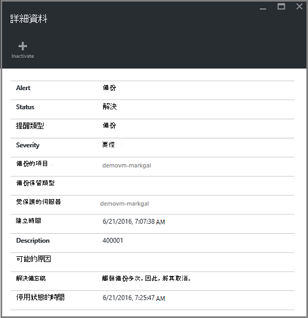

<properties
   pageTitle="部署監控資源管理員的虛擬機器備份 |Microsoft Azure"
   description="監控事件和部署資源管理員的虛擬機器備份的通知。 傳送電子郵件通知為根據。"
   services="backup"
   documentationCenter="dev-center-name"
   authors="markgalioto"
   manager="cfreeman"
   editor=""/>

<tags
ms.service="backup"
ms.workload="storage-backup-recovery"
ms.tgt_pltfrm="na"
ms.devlang="na"
ms.topic="article"
ms.date="08/25/2016"
ms.author="trinadhk; giridham;"/>

# <a name="monitor-alerts-for-azure-virtual-machine-backups"></a>監控的 Azure 虛擬機器備份的通知

提醒是從服務事件臨界值的已符合或超過的回應。 了解問題開始時可保留向下的 [企業成本的關鍵。 通知通常不會處理的排程，，因此，還是有幫助越快越知道之後發生警示。 例如，當備份或還原工作失敗，請通知，就會發生失敗的 5 分鐘內。 保存庫儀表板中備份通知] 方塊會顯示要徑與警告層級的事件。 在 [備份通知設定，您可以檢視所有事件。 但您該怎麼做如果您正在處理的另一個問題時，會發生通知？ 如果您不知道提醒發生時，可能是次要的不便，，或它可能造成資料。 若要確保正確的人員會通知-瞭解時，設定傳送透過電子郵件提醒通知的服務。 設定電子郵件通知的詳細資訊，請參閱[設定通知](backup-azure-monitor-vms.md#configure-notifications)。

## <a name="how-do-i-find-information-about-the-alerts"></a>我要如何找到通知的相關資訊？

若要檢視發生提醒的事件的相關資訊，您必須開啟備份通知刀。 有兩種方式，開啟 [備份通知刀︰ 從備份通知磚保存庫儀表板，或從通知和事件刀。

若要開啟備份通知刀從備份通知] 方塊︰

- 在 [保存庫儀表板上的 [**備份通知**] 方塊中，按一下 [**要徑**] 或 [**警告**若要檢視的重要性層級的作業的事件。

    


若要從通知和事件刀開啟備份通知刀︰

1. 從保存庫儀表板中，按一下 [**所有設定**]。 ![所有的設定] 按鈕](./media/backup-azure-monitor-vms/all-settings-button.png)

2. 在**設定**刀中，按一下 [**通知和事件**。 ![通知與事件] 按鈕](./media/backup-azure-monitor-vms/alerts-and-events-button.png)

3. 在**通知和事件**刀中，按一下 [**備份通知**]。 ![備份的 [通知] 按鈕](./media/backup-azure-monitor-vms/backup-alerts.png)

    **備份通知**刀開啟，並顯示已篩選的通知。

    

4. 若要檢視詳細的資料特定的提醒中，從清單中的事件，按一下提醒，開啟**詳細資料**刀。

    

    若要自訂顯示在清單中的屬性，請參閱[檢視其他事件屬性](backup-azure-monitor-vms.md#view-additional-event-attributes)

## <a name="configure-notifications"></a>設定通知

 您可以設定的服務傳送電子郵件通知發生過去的小時，或特定類型的事件發生時的通知。

若要設定通知的電子郵件通知

1. 按一下 [備份通知] 功能表上的 [**設定通知**

    ![備份通知] 功能表](./media/backup-azure-monitor-vms/backup-alerts-menu.png)

    設定通知刀隨即會開啟。

    

2. 在設定的通知刀，電子郵件通知]，按一下 [ **On**。

    收件者和嚴重性對話方塊有旁邊的星形，因為這項資訊。 提供至少有一個電子郵件地址，然後選取 [至少有一個嚴重性。

3. 在 [**收件者 （電子郵件）** ] 對話方塊中，輸入電子郵件地址的人員會收到通知。 使用格式︰ username@domainname.com。 以分號 （;） 分隔多個電子郵件地址。

4. 在**通知**區域中，選擇 [傳送通知給指定的警示發生時，**每個通知**] 或 [過去的小時傳送摘要的**每小時摘要**]。

5. 在 [**重要性**] 對話方塊中，選擇您想要觸發電子郵件通知的一或多個層級。

6. 按一下 [**儲存**]。
### <a name="what-alert-types-are-available-for-azure-iaas-vm-backup"></a>何種通知類型可供 Azure IaaS VM 備份？
| 通知等級  | 傳送的通知 |
| ------------- | ------------- |
| 要徑 | 備份失敗，復原失敗  |
| 警告  | 無 |
| 資訊  | 無  |

### <a name="are-there-situations-where-email-isnt-sent-even-if-notifications-are-configured"></a>在哪些情況下即使通知設定電子郵件無法傳送位置嗎？

一些情況下，不會傳送通知，即使已正確設定通知]。 在下列情況下電子郵件通知不會傳送至避免通知雜訊︰

- 如果通知設定為每小時的摘要，並通知會引發解決 1 小時。
- 已取消作業。
- 備份工作觸發然後失敗，請和正在進行另一個備份工作。
- 資源管理員已啟用 vm 排定的備份工作開始，但 VM 不存在。

## <a name="customize-your-view-of-events"></a>自訂您的事件的檢視

**稽核記錄**設定隨附一組預先定義的篩選和欄顯示作業事件資訊。 您可以自訂檢視，讓**事件**刀開啟時，它會顯示您所需的資訊。

1. [保存庫儀表板](./backup-azure-manage-vms.md#open-a-recovery-services-vault-in-the-dashboard)中瀏覽，然後按一下 [開啟**事件**刀**稽核記錄**。

    

    **事件**刀會開啟，只會針對目前的保存庫篩選作業事件。

    

    刀顯示要徑、 錯誤、 警告及資訊週發生的事件的清單]。 時間範圍是在**篩選**中設定預設值。 **事件**刀也會顯示追蹤事件發生的橫條圖。 如果您不想要查看橫條圖時，在 [**事件**] 功能表中，按一下 [**隱藏圖表**切換圖。 事件的預設檢視會顯示作業、 層級、 狀態、 資源及時間的資訊。 有關公開其他事件屬性的資訊，請參閱[展開事件資訊](backup-azure-monitor-vms.md#view-additional-event-attributes)] 區段。

2. 如需有關操作的事件，請在 [**作業**] 欄中，按一下 [開啟刀作業事件]。 刀包含事件的相關詳細的資訊。 事件的分組，其相互關聯識別碼的時間範圍中發生的事件清單。

    

3. 若要檢視的事件] 清單中的特定事件的詳細的資訊按一下以開啟**詳細資料**刀事件。

    

    事件層級的資訊是詳細資訊取得。 如果您想要查看此的哪些相關資訊每項事件，並想要加入**事件**刀這麼多詳細資料，請參閱[展開事件資訊](backup-azure-monitor-vms.md#view-additional-event-attributes)] 區段。


## <a name="customize-the-event-filter"></a>自訂事件篩選器
使用**篩選**來調整，或在特定的刀選擇出現的資訊。 若要篩選的事件資訊︰

1. [保存庫儀表板](./backup-azure-manage-vms.md#open-a-recovery-services-vault-in-the-dashboard)中瀏覽，然後按一下 [開啟**事件**刀**稽核記錄**。

    

    **事件**刀會開啟，只會針對目前的保存庫篩選作業事件。

    

2. 在 [**事件**] 功能表中，按一下 [**篩選器**以開啟該刀。

    

3. 在**篩選**防禦，以調整**層級**、**時間範圍**，及**來電者之間**的篩選。 其他篩選器無法使用，因為設定為提供修復服務保存庫目前的資訊。

    

    您可以指定事件的**層級**︰ 要徑，錯誤、 警告或資訊。 您可以選擇事件等級的任何組合，但您必須至少一個選取層級。 開啟或關閉，請切換層級。 **時間範圍**的篩選器可讓您指定的擷取事件的時間長度。 如果您使用自訂的時間範圍，您可以設定開始和結束時間。

4. 當您準備好要查詢的使用篩選作業記錄時，按一下 [**更新**]。 結果會顯示在**事件**刀。

    


### <a name="view-additional-event-attributes"></a>檢視其他事件屬性
您可以使用 [**欄**] 按鈕，來啟用顯示**事件**刀] 清單中的其他事件屬性。 事件的預設清單會顯示作業、 層級、 狀態、 資源及時間的資訊。 若要啟用其他屬性︰

1. 在 [**事件**刀中，按一下 [**欄**]。

    

    **選擇欄**刀隨即會開啟。

    

2. 若要選取的屬性，請按一下核取方塊。 開啟和關閉，將切換 [屬性] 核取方塊。

3. 按一下 [重設**事件**刀屬性的清單的 [**重設**]。 新增或移除清單中的屬性之後, 使用**重設**檢視新事件屬性的清單。

4. 按一下 [**更新**來更新事件屬性中的資料。 下表提供每個屬性的相關資訊。

| 資料行名稱      |描述|
| -----------------|-----------|
| 作業|作業名稱|
| 層級|作業的層級，可以是值︰ 資訊、 警告、 錯誤或要徑|
|狀態|描述性作業的狀態|
|資源|將資源; 識別的 URL也稱為資源識別碼|
|時間|從目前的時間，事件發生時開始算起的時間|
|來電者|誰或什麼稱為或觸發事件。可以系統或使用者|
|時間戳記|觸發事件時間|
|資源群組|相關聯的資源群組|
|資源類型|使用由資源管理員的內部的資源類型|
|訂閱識別碼|相關聯的訂閱識別碼|
|類別|類別的事件|
|相互關聯識別碼|常見的相關事件的識別碼|


## <a name="use-powershell-to-customize-alerts"></a>使用 PowerShell 來自訂通知
您可以在入口網站取得工作的自訂提醒通知。 若要取得這些工作，定義作業記錄事件的 PowerShell 為基礎的通知規則。 使用*PowerShell 1.3.0 版本或更新版本*。

若要定義自訂的通知提醒的備份失敗，請使用類似以下的指令碼命令︰

```
PS C:\> $actionEmail = New-AzureRmAlertRuleEmail -CustomEmail contoso@microsoft.com
PS C:\> Add-AzureRmLogAlertRule -Name backupFailedAlert -Location "East US" -ResourceGroup RecoveryServices-DP2RCXUGWS3MLJF4LKPI3A3OMJ2DI4SRJK6HIJH22HFIHZVVELRQ-East-US -OperationName Microsoft.Backup/RecoveryServicesVault/Backup -Status Failed -TargetResourceId /subscriptions/86eeac34-eth9a-4de3-84db-7a27d121967e/resourceGroups/RecoveryServices-DP2RCXUGWS3MLJF4LKPI3A3OMJ2DI4SRJK6HIJH22HFIHZVVELRQ-East-US/providers/microsoft.backupbvtd2/RecoveryServicesVault/trinadhVault -Actions $actionEmail
```

**預設**︰ 您可以取得預設的稽核記錄。 預設會提供的作業記錄的 [資源] 欄中的 URL。

**OperationName** : OperationName 是 「 Microsoft.RecoveryServices/recoveryServicesVault/*EventName*」 可*EventName*的格式︰<br/>
- 註冊 <br/>
- 移除註冊 <br/>
- ConfigureProtection <br/>
- 備份 <br/>
- 還原 <br/>
- StopProtection <br/>
- DeleteBackupData <br/>
- CreateProtectionPolicy <br/>
- DeleteProtectionPolicy <br/>
- UpdateProtectionPolicy <br/>

**狀態**︰ 支援的值為入門、 成功] 或失敗。

**ResourceGroup** ︰ 這是資源所屬的資源群組。 您可以新增 [資源群組] 欄，產生的記錄檔。 資源群組是其中一個可用的事件資訊類型。

**名稱**︰ 提醒規則的名稱。

**CustomEmail** ︰ 指定您要傳送提醒通知的自訂電子郵件地址

**SendToServiceOwners** ︰ 這個選項會通知通知傳送給所有系統管理員和訂閱的共同管理員。 用於**新增 AzureRmAlertRuleEmail** cmdlet

### <a name="limitations-on-alerts"></a>通知的限制
事件架構通知受限於下列限制︰

1. 修復服務保存庫中的所有虛擬機器上觸發通知。 您無法自訂子集虛擬機器中修復服務保存庫的提醒。
2. 這項功能在預覽中。 [深入瞭解](../monitoring-and-diagnostics/insights-powershell-samples.md#create-alert-rules)
3. 從不會收到通知"alerts-noreply@mail.windowsazure.com"。 目前您無法修改電子郵件寄件者。


## <a name="next-steps"></a>後續步驟

事件記錄檔啟用好事後和稽核備份作業的支援。 會記錄下列作業︰

- 註冊
- 移除註冊
- 設定保護
- 備份 （兩者排程以及指定備份）
- 還原
- 停止保護
- 刪除備份資料
- 新增原則
- 刪除原則
- 更新原則
- 取消工作

事件的主要說明，作業及稽核記錄跨 Azure 服務，請參閱文件，[檢視事件和稽核記錄](../monitoring-and-diagnostics/insights-debugging-with-events.md)。

重新建立虛擬機器復原點的詳細資訊，請參閱[還原 Azure Vm](backup-azure-restore-vms.md)。 如果您需要保護您的虛擬機器的詳細資訊，請參閱[第一次查看︰ 備份 Vm 與修復服務保存庫](backup-azure-vms-first-look-arm.md)。 瞭解管理工作的工作，請參閱，[管理 Azure 虛擬機器備份](backup-azure-manage-vms.md)VM 備份。
