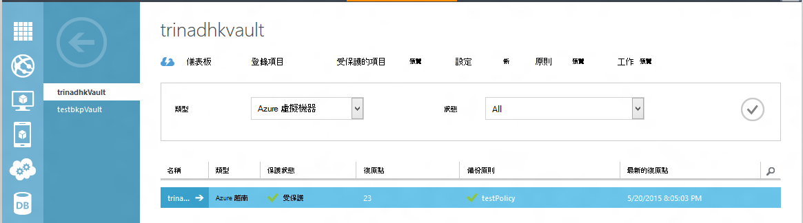
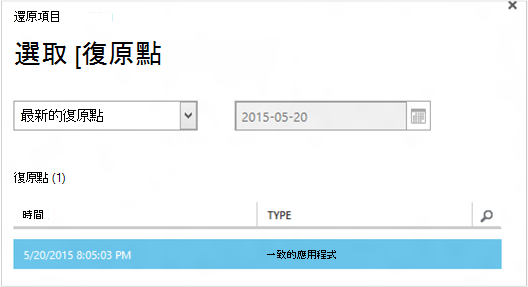
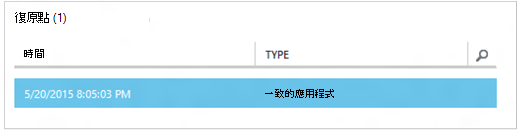
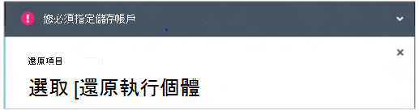
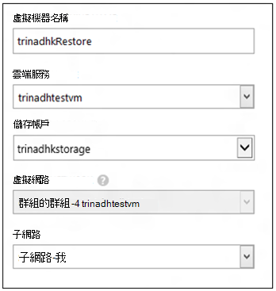
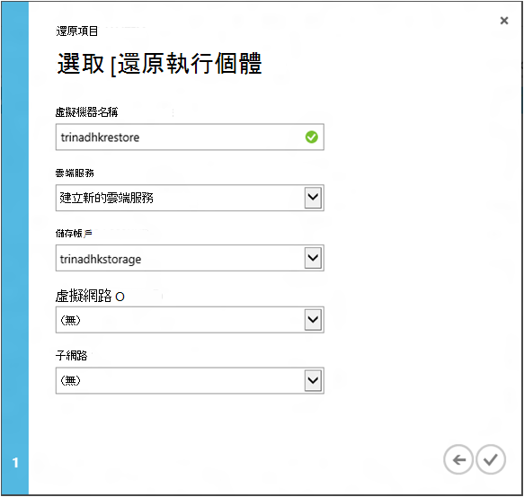
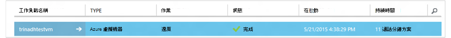

<properties
    pageTitle="從備份還原虛擬機器 |Microsoft Azure"
    description="瞭解如何從復原點還原 Azure 虛擬機器"
    services="backup"
    documentationCenter=""
    authors="trinadhk"
    manager="shreeshd"
    editor=""
    keywords="還原備份。還原。復原點。"/>

<tags
    ms.service="backup"
    ms.workload="storage-backup-recovery"
    ms.tgt_pltfrm="na"
    ms.devlang="na"
    ms.topic="article"
    ms.date="08/02/2016"
    ms.author="trinadhk; jimpark;"/>

# 還原中 Azure 虛擬機器

> [AZURE.SELECTOR]
- [還原 Vm Azure 入口網站中](backup-azure-arm-restore-vms.md)
- [還原 Vm 在傳統入口網站](backup-azure-restore-vms.md)

從儲存在下列步驟 Azure 備份保存庫的備份還原新 VM 虛擬機器。

## 還原工作流程

### 1.選擇要還原的項目

1. 瀏覽至 [**受保護的項目**] 索引標籤，然後選取您要還原至新的 VM 的虛擬機器。

    

    在 [**受保護的項目**] 頁面的 [**復原點**] 欄會告訴您的虛擬機器復原點的數目。 [**最新復原點**] 欄會告訴您最近的備份可還原虛擬機器的時間。

2. 按一下以開啟 [**還原項目**] 精靈的 [**還原**]。

    

### 2.挑選復原點

1. 在 [**選取復原點**] 畫面中，您可以還原從最新的復原點，或從先前的點時間。 選取精靈開啟時的預設選項是*最新復原點*。

    

2. 若要在時間中挑選之前，請在下拉式清單中選擇 [**選取 [日期**] 選項，選取行事曆控制項中的日期，即可在**行事曆] 圖示**上。 在控制項中，有復原點的所有日期會填入精簡灰階且可選取使用者。

    ![選取 [日期]](./media/backup-azure-restore-vms/select-date.png)

    一旦您按一下行事曆控制項的日期，復原點上可用日期就會顯示在資料表的復原點。 [**時間**] 欄會指出製作快照的時間。 [**類型**] 欄會顯示復原點的[一致性](https://azure.microsoft.com/documentation/articles/backup-azure-vms/#consistency-of-recovery-points)。 表格標題會顯示可用的復原點的數目，在括弧中的日期。

    

3. 從**復原點**表格中選取復原點，然後按一下下一步的箭號，以移至下一個畫面。

### 3.指定的目的地位置

1. 在 [**選取還原執行個體**] 畫面中，指定要還原虛擬機器的詳細資料。

  - 指定的虛擬機器名稱︰ 指定的雲端服務中的虛擬機器名稱都必須是唯一。 我們不支援覆寫現有 VM。 
  - 選取雲端服務 vm︰ 這是建立 VM 必要。 您可以選擇使用現有的雲端服務，或建立新的雲端服務。

        Whatever cloud service name is picked should be globally unique. Typically, the cloud service name gets associated with a public-facing URL in the form of [cloudservice].cloudapp.net. Azure will not allow you to create a new cloud service if the name has already been used. If you choose to create select create a new cloud service, it will be given the same name as the virtual machine – in which case the VM name picked should be unique enough to be applied to the associated cloud service.

        We only display cloud services and virtual networks that are not associated with any affinity groups in the restore instance details. [Learn More](../virtual-network/virtual-networks-migrate-to-regional-vnet.md).

2. 選取儲存的帳戶 vm︰ 這是建立 VM 必要。 您可以從現有的儲存空間帳戶 Azure 備份保存庫為相同的區域中進行選取。 我們不支援儲存帳戶的重複或進階版儲存空間類型的區域。

    如果有支援的設定未儲存的帳戶，請建立支援的設定之前開始還原作業的儲存空間帳戶。

    

3. 選取虛擬網路︰ 虛擬機器虛擬網路 (VNET) 應選取 [建立 VM 的時間。 還原使用者介面會顯示可供此訂閱中的所有 VNETs。 沒有強制還原 vm 選取 VNET – 您將能夠即使未套用 VNET 透過網際網路連線到已還原的虛擬機器。

    如果所選取的雲端服務與虛擬網路相關聯，您無法變更虛擬網路。

    

4. 選取子網路︰ 萬一 VNET 有子網路，預設的第一個子網路即會選取。 選擇您所選擇的子網路，從下拉式清單的選項。 子網路的詳細資訊，請在[入口網站首頁](https://manage.windowsazure.com/)的 [網路分機]，請移至**虛擬網路**選取虛擬網路和向下切入至子網路詳細資料的設定。

    

5. 按一下 [送出詳細資料，建立還原工作精靈中的 [**提交**] 圖示。

## 追蹤還原作業
當您輸入到 [還原] 精靈的所有資訊並送出它 Azure 備份會嘗試建立追蹤還原操作工作。

如果成功建立工作，您會看到快顯通知，指出會建立工作。 您可以取得更多詳細資料，按一下 [**檢視工作**] 按鈕，帶您到**工作**] 索引標籤。

在 [還原] 作業完成時，會標示為已完成**的工作**] 索引標籤中。

還原虛擬機器之後，您可能需要重新安裝原始 VM 及[修改結束點](../virtual-machines/virtual-machines-windows-classic-setup-endpoints.md)在入口網站中 Azure 虛擬機器上現有的副檔名。

## 已還原步驟
如果您使用雲端初始化 Linux 分配 Ubuntu，例如基於安全性理由，則會遭到封鎖密碼張貼還原。 請使用 VMAccess 副檔名上還原 VM 重設[密碼](../virtual-machines/virtual-machines-linux-classic-reset-access.md)。 建議您在這些散佈使用 SSH 鍵，以避免重設密碼文章還原。 

## 備份還原 Vm
如果您已使用相同的名稱為原始備份 VM，相同的雲端服務還原 VM，會繼續 VM 文章還原備份。 如果您有 Vm 還原到不同的雲端服務，或指定還原 VM 不同的名稱，這將會視為新 VM，必須先設定備份還原 VM。

## 還原 VM 期間 Azure 資料中心損毀
Azure 備份 」 可讓還原備份 Vm 成對的資料中心以避免主要的資料中心位置 Vm 執行體驗損毀，且您已設定為 [地理多餘的備份保存庫。 在此情況下，您必須選取成對的資料中心中的儲存空間帳戶，其餘的還原程序仍會保留相同。 Azure 備份會用來建立還原的虛擬機器成對地理計算服務。 

## 還原網域控制站 Vm
備份網域控制站 (DC) 虛擬機器是使用 Azure 備份支援的案例。 然而部分小心還原程序。 還原體驗是非常不同的網域控制站 Vm 單一 DC 設定，與 Vm 在多 DC 設定。

### 單一 DC
從 Azure VM 還原 （就像其他任何 VM) 入口網站，或使用 PowerShell。

### 多個 Dc
如果您有多 DC 環境時，網域控制站會有自己的資料儲存在同步處理的方式。 還原*不適當的預防措施*較舊的備份點時，USN 復原程序可以造成多重 DC 環境中的破壞。 若要復原這類 VM 的正確方法是開機，DSRM 模式中。

因為 DSRM 模式不存在於 Azure 中，就會發生的挑戰。 因此，若要還原這類 VM，您無法使用 Azure 入口網站。 僅支援還原機制是使用 PowerShell 磁碟還原。

>[AZURE.WARNING] 在多重 DC 環境中的網域控制站 Vm，不要使用 Azure 入口網站的還原 ！ 僅限 PowerShell 以還原支援

進一步瞭解[USN 復原問題](https://technet.microsoft.com/library/dd363553)和建議的修正這個問題的策略。

## 還原 Vm 用於特殊網路設定
Azure 備份支援對下列特殊的網路設定的虛擬機器的備份。

- Vm 下負載平衡器 （內部和外部）
- 使用多個保留 IPs Vm
- 使用多個 Nic Vm

還原時的考量下列，強制這些設定。

>[AZURE.TIP] 請若要重新建立特殊的網路設定的 Vm 文章還原，使用 PowerShell 以還原流程。

### 還原 ui:
從使用者介面，**永遠選擇新的雲端服務**還原時。 請注意︰ 由於入口網站只會強制期間還原流量，Vm 還原使用使用者介面的參數會遺失其擁有的特殊網路設定。 換句話說，還原 Vm 會而不需要的負載平衡器或多重設定標準 Vm NIC 或多個保留的 IP。

### 從 PowerShell 還原︰
PowerShell 有剛剛從備份還原 VM 磁碟和建立虛擬機器的能力。 還原虛擬機器需要特殊的網路設定 mentined 上方時，這是很有幫助。

若要完全重新建立虛擬機器文章還原磁碟，請遵循下列步驟︰

1. 還原備份保存庫使用[備份 PowerShell 的 Azure](../backup-azure-vms-classic-automation.md#restore-an-azure-vm)磁碟

2. 建立所需的負載平衡器 VM/來建立的 VM 所需的設定多個 NIC 或多個保留 IP 使用 PowerShell cmdlet 和使用。
    - 在雲端服務中，[內部負載平衡器](https://azure.microsoft.com/documentation/articles/load-balancer-internal-getstarted/)建立 VM
    - 建立 VM 對負載平衡器的 [網際網路] (https://azure.microsoft.com/en-us/documentation/articles/load-balancer-internet-getstarted/)
    - 建立[多個 Nic](https://azure.microsoft.com/documentation/articles/virtual-networks-multiple-nics/) VM
    - 建立[多個保留的 IPs](https://azure.microsoft.com/documentation/articles/virtual-networks-reserved-public-ip/) VM

## 後續步驟
- [疑難排解錯誤](backup-azure-vms-troubleshoot.md#restore)
- [管理虛擬機器](backup-azure-manage-vms.md)
