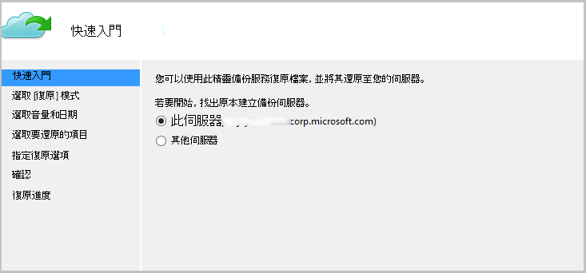
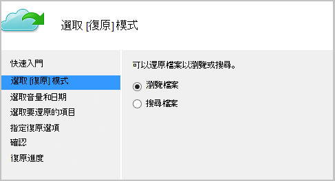
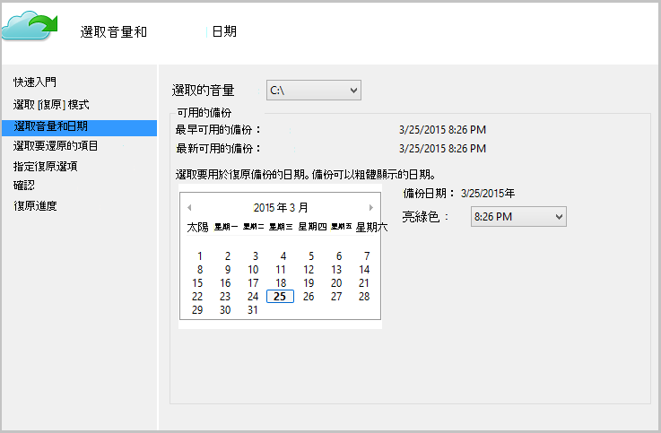
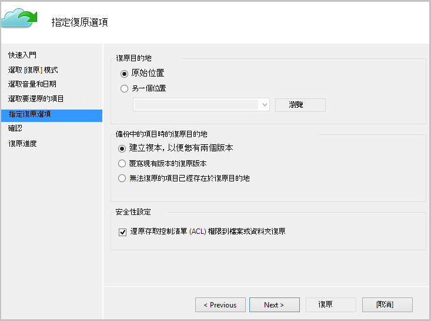
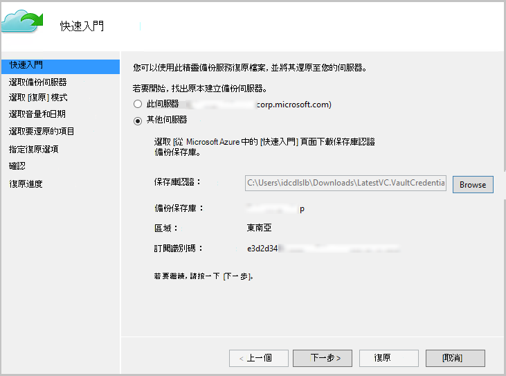
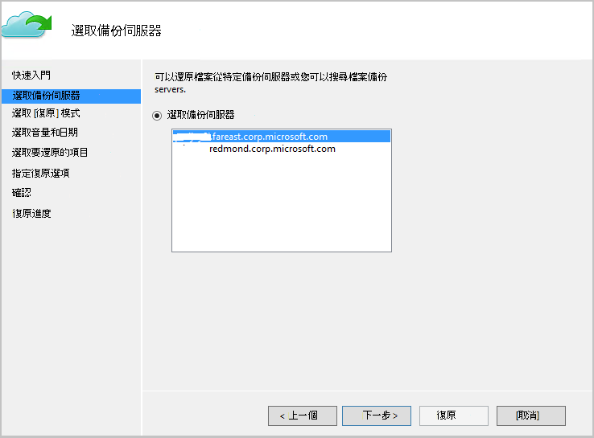
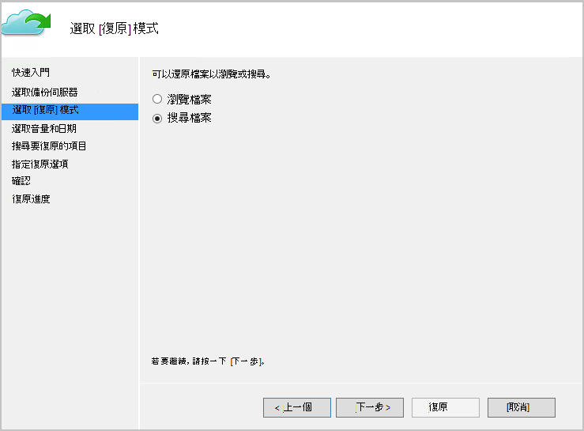
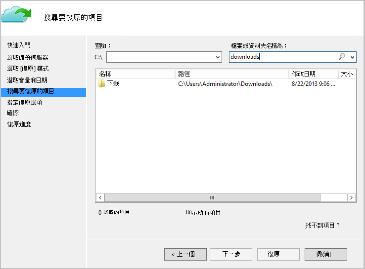
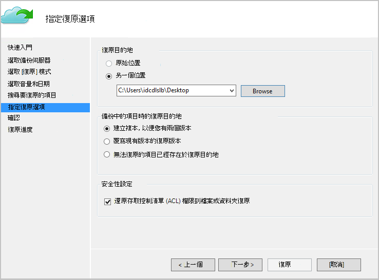
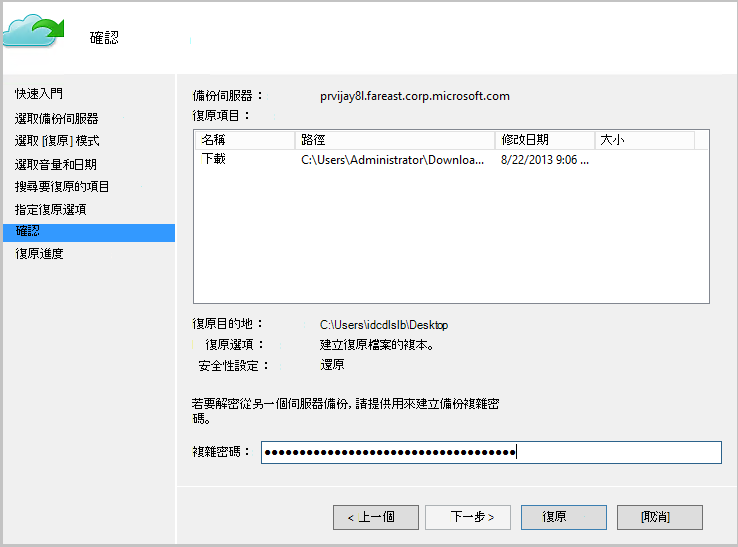

<properties
   pageTitle="從 Azure 使用資源管理員部署模型，將資料還原到 Windows 伺服器或 Windows 用戶端 |Microsoft Azure"
   description="瞭解如何從 Windows Server 或 Windows 用戶端還原。"
   services="backup"
   documentationCenter=""
   authors="saurabhsensharma"
   manager="shivamg"
   editor=""/>

<tags
   ms.service="backup"
   ms.workload="storage-backup-recovery"
     ms.tgt_pltfrm="na"
     ms.devlang="na"
     ms.topic="article"
     ms.date="08/02/2016"
     ms.author="trinadhk; jimpark; markgal;"/>

# 還原至 Windows server 或使用資源管理員部署模型 Windows 用戶端電腦的檔案

> [AZURE.SELECTOR]
- [Azure 入口網站](backup-azure-restore-windows-server.md)
- [傳統的入口網站](backup-azure-restore-windows-server-classic.md)

本文涵蓋執行兩種類型的還原作業所需的步驟︰

- 還原同一台機器從拍攝備份資料。
- 還原其他資料。

在這兩種情況下，從 Azure 修復服務保存庫擷取資料。

[AZURE.INCLUDE [learn-about-deployment-models](../../includes/learn-about-deployment-models-rm-include.md)]傳統的部署模型。

## 復原資料以同一台機器
如果您不小心刪除檔案，想要將它還原為同一台機器 （從備份），下列步驟可協助您復原資料。

1. 開啟 [ **Microsoft Azure 備份**嵌入式管理單元。
2. 按一下 [**復原資料**進行工作流程。

    

3. 選取 [**此伺服器 (*yourmachinename*) * * 若要還原備份的檔案在同一部電腦上的選項。

    

4. 選擇**檔案瀏覽**或**搜尋的檔案**。

    如果您打算要還原一或多個檔案已知的路徑，請將預設的選項。 如果您不確定資料夾結構的相關，但想要搜尋的檔案，請挑選 [**搜尋檔案**選項]。 針對此區段中，我們將繼續使用預設的選項。

    

5. 選取您要還原的檔案。

    您可以從任何點還原時間。 以**粗體**行事曆控制項中顯示的日期會指出還原點的可用性。 選取日期之後，根據備份排程 （並將備份作業成功），您可以選取點時間從**時間**下拉式清單中向下。

    

6. 選取要復原的項目。 您可以選取資料夾/檔案您想要還原。

    ![選取 [檔案]](./media/backup-azure-restore-windows-server/selectfiles.png)

7. 指定復原參數。

    

  - 您可以還原到原始位置 （在其中檔案/資料夾可能會被覆寫），或在同一部電腦中的另一個位置。
  - 如果您想要還原檔案/資料夾中的目標位置，您可以建立複本 （相同檔案的兩個版本），覆寫檔案的目標位置，或略過目標中存在的檔案復原。
  - 強烈建議您保留預設選項 [還原 Acl 要復原的檔案。

8. 一旦提供這些輸入，請按一下 [**下一步**]。 復原工作流程，還原至這部電腦的檔案，就會開始。

## 復原到替代的電腦
如果您的整個伺服器會遺失，仍到不同電腦復原資料從 Azure 備份。 下列步驟說明工作流程。  

這些步驟中使用的術語包括︰

- *來源電腦*– 從其備份，以及哪些是目前無法使用原始的電腦。
- *目標電腦*– 復原資料的電腦。
- *範例保存庫*–*來源電腦*和*目標電腦*所註冊的修復服務保存庫。  

> [AZURE.NOTE] 無法在執行較舊版本的作業系統的電腦上還原備份來自機器。 例如，如果從 Windows 7 的電腦進行備份，可還原在 Windows 8 或機器。 不過倒過來並未儲存，則為 true。

1. 開啟**Microsoft Azure 備份**嵌入式管理單元在*目標電腦*上。
2. 請確定在*目標電腦*與*來源電腦*登錄相同修復服務保存庫。
3. 按一下 [**復原資料**進行工作流程。

    

4. 選取**另一個伺服器**

    

5. *範例保存庫*提供對應的保存庫認證檔案。 如果保存庫認證檔案是無效 （或過期） 下載新保存庫認證檔案從 Azure 入口網站中的*範例保存庫*。 一旦提供保存庫認證檔案，則會顯示對保存庫認證檔修復服務保存庫。

6. 從清單中顯示機器選取*來源電腦*。

    

7. 選取**檔案搜尋**或**瀏覽檔案**的選項。 針對此節]，我們會使用**檔案的 [搜尋**] 選項。

    

8. 在下一個畫面中，選取 [音量] 和 [日期。 搜尋您要還原的資料夾/檔案名稱。

    

9. 選取檔案要還原的位置。

    

10. 提供提供的*來源電腦*註冊期間*範例保存庫*加密複雜密碼。

    

11. 一旦提供輸入，請按一下 [**復原**，觸發至目的地所提供的備份檔案還原]。

## 後續步驟
- 現在您已復原您的檔案和資料夾，您可以[管理您的備份](backup-azure-manage-windows-server.md)。
