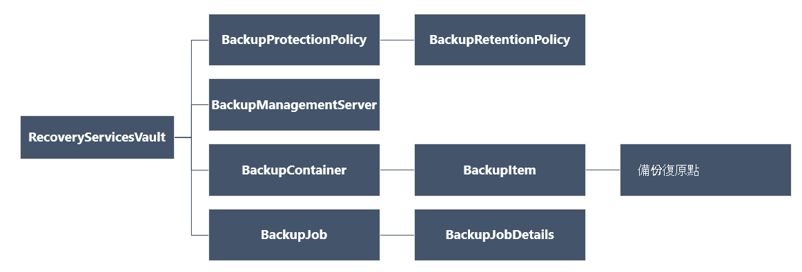

<properties
   pageTitle="部署及管理資源管理員部署 Vm 使用 PowerShell 備份 |Microsoft Azure"
   description="使用 PowerShell 來部署及管理資源管理員部署 Vm Azure 中的備份"
   services="backup"
   documentationCenter=""
   authors="markgalioto"
   manager="cfreeman"
   editor=""/>

<tags
   ms.service="backup"
   ms.devlang="na"
   ms.topic="article"
   ms.tgt_pltfrm="na"
   ms.workload="storage-backup-recovery"
   ms.date="08/03/2016"
   ms.author="markgal; trinadhk"/>

# <a name="deploy-and-manage-backups-for-resource-manager-deployed-vms-using-powershell"></a>部署及管理資源管理員部署 Vm 使用 PowerShell 備份

> [AZURE.SELECTOR]
- [資源管理員](backup-azure-vms-automation.md)
- [傳統](backup-azure-vms-classic-automation.md)

本文將示範如何使用備份及復原 Azure 虛擬機器 (VM) 從修復服務保存庫 Azure PowerShell cmdlet。 修復服務保存庫 Azure 資源管理員資源，而用來保護資料和 Azure 備份和 Azure 網站復原服務中的資產。 您可以使用復原服務保存庫保護 Azure 服務管理員部署 Vm，以及 Azure 資源管理員部署 Vm。

>[AZURE.NOTE] Azure 有兩種部署模型建立及使用的資源︰[資源管理員] 及 [傳統](../resource-manager-deployment-model.md)。 本文適用於使用 Vm 使用資源管理員模型建立。

本文會引導您使用 PowerShell 來保護 VM，並從復原點還原資料。

## <a name="concepts"></a>概念

如果您不熟悉 Azure 備份服務，概略瞭解服務，請參閱[什麼是 Azure 備份？](backup-introduction-to-azure-backup.md) 您開始之前，請確定您涵蓋關於處理 Azure 備份和目前的 VM 備份方案限制所需的必要條件基礎。

若要有效地使用 PowerShell，就必須瞭解階層的物件，然後從開始的位置。



若要檢視 AzureRmRecoveryServicesBackup PowerShell cmdlet 參考，請參閱 Azure 文件庫中的[Azure 備份-修復服務 Cmdlet](https://msdn.microsoft.com/library/mt723320.aspx) 。
若要檢視 AzureRmRecoveryServicesVault PowerShell cmdlet 參考，請參閱[Azure 復原服務 Cmdlet](https://msdn.microsoft.com/library/mt643905.aspx)。


## <a name="setup-and-registration"></a>設定和註冊

若要開始︰

1. [下載最新版的 PowerShell](https://github.com/Azure/azure-powershell/releases)(必要的最低版本︰ 1.4.0)

2. 尋找 Azure 備份 PowerShell 指令程式可用來輸入下列命令︰

```
PS C:\> Get-Command *azurermrecoveryservices*

CommandType     Name                                               Version    Source
-----------     ----                                               -------    ------
Cmdlet          Backup-AzureRmRecoveryServicesBackupItem           1.4.0      AzureRM.RecoveryServices.Backup
Cmdlet          Disable-AzureRmRecoveryServicesBackupProtection    1.4.0      AzureRM.RecoveryServices.Backup
Cmdlet          Enable-AzureRmRecoveryServicesBackupProtection     1.4.0      AzureRM.RecoveryServices.Backup
Cmdlet          Get-AzureRmRecoveryServicesBackupContainer         1.4.0      AzureRM.RecoveryServices.Backup
Cmdlet          Get-AzureRmRecoveryServicesBackupItem              1.4.0      AzureRM.RecoveryServices.Backup
Cmdlet          Get-AzureRmRecoveryServicesBackupJob               1.4.0      AzureRM.RecoveryServices.Backup
Cmdlet          Get-AzureRmRecoveryServicesBackupJobDetails        1.4.0      AzureRM.RecoveryServices.Backup
Cmdlet          Get-AzureRmRecoveryServicesBackupManagementServer  1.4.0      AzureRM.RecoveryServices.Backup
Cmdlet          Get-AzureRmRecoveryServicesBackupProperties        1.4.0      AzureRM.RecoveryServices
Cmdlet          Get-AzureRmRecoveryServicesBackupProtectionPolicy  1.4.0      AzureRM.RecoveryServices.Backup
Cmdlet          Get-AzureRMRecoveryServicesBackupRecoveryPoint     1.4.0      AzureRM.RecoveryServices.Backup
Cmdlet          Get-AzureRmRecoveryServicesBackupRetentionPolic... 1.4.0      AzureRM.RecoveryServices.Backup
Cmdlet          Get-AzureRmRecoveryServicesBackupSchedulePolicy... 1.4.0      AzureRM.RecoveryServices.Backup
Cmdlet          Get-AzureRmRecoveryServicesVault                   1.4.0      AzureRM.RecoveryServices
Cmdlet          Get-AzureRmRecoveryServicesVaultSettingsFile       1.4.0      AzureRM.RecoveryServices
Cmdlet          New-AzureRmRecoveryServicesBackupProtectionPolicy  1.4.0      AzureRM.RecoveryServices.Backup
Cmdlet          New-AzureRmRecoveryServicesVault                   1.4.0      AzureRM.RecoveryServices
Cmdlet          Remove-AzureRmRecoveryServicesProtectionPolicy     1.4.0      AzureRM.RecoveryServices.Backup
Cmdlet          Remove-AzureRmRecoveryServicesVault                1.4.0      AzureRM.RecoveryServices
Cmdlet          Restore-AzureRMRecoveryServicesBackupItem          1.4.0      AzureRM.RecoveryServices.Backup
Cmdlet          Set-AzureRmRecoveryServicesBackupProperties        1.4.0      AzureRM.RecoveryServices
Cmdlet          Set-AzureRmRecoveryServicesBackupProtectionPolicy  1.4.0      AzureRM.RecoveryServices.Backup
Cmdlet          Set-AzureRmRecoveryServicesVaultContext            1.4.0      AzureRM.RecoveryServices
Cmdlet          Stop-AzureRmRecoveryServicesBackupJob              1.4.0      AzureRM.RecoveryServices.Backup
Cmdlet          Unregister-AzureRmRecoveryServicesBackupContainer  1.4.0      AzureRM.RecoveryServices.Backup
Cmdlet          Unregister-AzureRmRecoveryServicesBackupManagem... 1.4.0      AzureRM.RecoveryServices.Backup
Cmdlet          Wait-AzureRmRecoveryServicesBackupJob              1.4.0      AzureRM.RecoveryServices.Backup
```


可以使用 PowerShell 自動化下列工作︰

- 建立修復服務保存庫
- 備份] 或 [保護 Azure Vm
- 觸發程序備份工作
- 監控備份工作
- 還原 Azure VM

## <a name="create-a-recovery-services-vault"></a>建立復原服務保存庫

下列步驟會引導您完成建立修復服務保存庫。 修復服務保存庫是不同於備份保存庫。

1. 如果您第一次使用 Azure 備份，您必須使用**[Register AzureRMResourceProvider](https://msdn.microsoft.com/library/mt679020.aspx)**指令程式來註冊 Azure 修復服務提供者與您的訂閱。

    ```
    PS C:\> Register-AzureRmResourceProvider -ProviderNamespace "Microsoft.RecoveryServices"
    ```

2. 修復服務保存庫是資源管理員資源，因此您必須將其放在 [資源群組。 您可以使用現有的資源群組，或建立新的資源群組以**[新增 AzureRmResourceGroup](https://msdn.microsoft.com/library/mt678985.aspx)**指令程式。 建立新的資源群組時，指定的名稱和資源群組的位置。  

    ```
    PS C:\> New-AzureRmResourceGroup –Name "test-rg" –Location "West US"
    ```

3. 您可以使用 [**[新增 AzureRmRecoveryServicesVault](https://msdn.microsoft.com/library/mt643910.aspx)** cmdlet 來建立新的保存庫。 請確定所用的資源群組指定保存庫的相同位置。

    ```
    PS C:\> New-AzureRmRecoveryServicesVault -Name "testvault" -ResourceGroupName " test-rg" -Location "West US"
    ```

4. 指定重複類型的儲存空間使用。您可以使用[本機多餘儲存空間 (LRS)](../storage/storage-redundancy.md#locally-redundant-storage)或[地理多餘儲存空間 (GRS)](../storage/storage-redundancy.md#geo-redundant-storage)。 下列範例顯示 testVault-BackupStorageRedundancy 選項設定為 GeoRedundant。

    ```
    PS C:\> $vault1 = Get-AzureRmRecoveryServicesVault –Name "testVault"
    PS C:\> Set-AzureRmRecoveryServicesBackupProperties  -Vault $vault1 -BackupStorageRedundancy GeoRedundant
    ```

    > [AZURE.TIP] 許多 Azure 備份 cmdlet 的輸入需要修復服務保存庫物件。 因此，很方便地儲存在變數備份修復服務保存庫物件。

## <a name="view-the-vaults-in-a-subscription"></a>在訂閱中檢視保存庫
**[取得 AzureRmRecoveryServicesVault](https://msdn.microsoft.com/library/mt643907.aspx)**可用於目前的訂閱中檢視所有保存庫的清單。 若要檢查的建立新的保存庫，或若要查看哪些保存庫可在訂閱中，您可以使用此命令。

執行命令，取得 AzureRmRecoveryServicesVault，與訂閱中的所有保存庫會列。

```
PS C:\> Get-AzureRmRecoveryServicesVault
Name              : Contoso-vault
ID                : /subscriptions/1234
Type              : Microsoft.RecoveryServices/vaults
Location          : WestUS
ResourceGroupName : Contoso-docs-rg
SubscriptionId    : 1234-567f-8910-abc
Properties        : Microsoft.Azure.Commands.RecoveryServices.ARSVaultProperties
```


## <a name="backup-azure-vms"></a>備份 Azure Vm
現在，您必須建立復原服務保存庫，您可以使用它來保護虛擬機器。 但是在套用保護之前，您必須設定保存庫內容，而且您會想要檢查保護原則。 保存庫內容保存庫中定義受保護的資料的類型。 保護原則是排程執行備份工作時，及每個備份的快照，保留多久。

啟用之前 VM 上的保護，您必須設定保存庫內容。 內容會套用至所有後續的 cmdlet。

```
PS C:\> Get-AzureRmRecoveryServicesVault -Name testvault | Set-AzureRmRecoveryServicesVaultContext
```

### <a name="create-a-protection-policy"></a>建立保護原則

當您建立新的保存庫時，它會隨附的預設原則。 此原則會觸發備份工作的每一天在指定的時間。 預設的原則，每 30 天保留備份的快照。 您可以使用預設的原則，來快速保護您 VM] 和 [編輯原則稍後使用不同的詳細資料。

使用**[取得 AzureRmRecoveryServicesBackupProtectionPolicy](https://msdn.microsoft.com/library/mt723300.aspx)**保存庫中檢視可用的原則清單︰

```
PS C:\> Get-AzureRmRecoveryServicesBackupProtectionPolicy -WorkloadType AzureVM
Name                 WorkloadType       BackupManagementType BackupTime                DaysOfWeek
----                 ------------       -------------------- ----------                ----------
DefaultPolicy        AzureVM            AzureVM              4/14/2016 5:00:00 PM
```

> [AZURE.NOTE] 在 PowerShell 中 BackupTime 欄位的時區是 UTC。 不過，當 Azure 入口網站中顯示的備份的時間，則會調整時間至您的本機時區。

備份保護原則是一個以上的保留原則相關聯。  保留原則可定義多久復原點會保留使用 Azure 備份。 您可以使用**取得 AzureRmRecoveryServicesBackupRetentionPolicyObject**來檢視預設的保留原則。  同樣地，您可以取得預設的排程原則使用**取得 AzureRmRecoveryServicesBackupSchedulePolicyObject** 。 排程與保留原則物件做為**新增 AzureRmRecoveryServicesBackupProtectionPolicy** cmdlet 的輸入。

備份保護原則可定義的項目備份何時完成。 新增 AzureRmRecoveryServicesBackupProtectionPolicy cmdlet 建立 PowerShell 物件保留備份原則資訊。 備份原則作為啟用 AzureRmRecoveryServicesBackupProtection cmdlet 的輸入。

```
PS C:\> $schPol = Get-AzureRmRecoveryServicesBackupSchedulePolicyObject -WorkloadType "AzureVM"
PS C:\>  $retPol = Get-AzureRmRecoveryServicesBackupRetentionPolicyObject -WorkloadType "AzureVM"
PS C:\>  New-AzureRmRecoveryServicesBackupProtectionPolicy -Name "NewPolicy" -WorkloadType AzureVM -RetentionPolicy $retPol -SchedulePolicy $schPol
Name                 WorkloadType       BackupManagementType BackupTime                DaysOfWeek
----                 ------------       -------------------- ----------                ----------
NewPolicy           AzureVM            AzureVM              4/24/2016 1:30:00 AM
```

### <a name="enable-protection"></a>啟用保護

啟用保護涉及兩個物件的項目及原則。 若要啟用保存庫上的 [保護需要兩個物件。 一旦原則已與保存庫相關聯，備份工作流程會觸發在定義原則排程中的時間。

若要啟用非加密 ARM Vm 的保護

```
PS C:\> $pol=Get-AzureRmRecoveryServicesBackupProtectionPolicy -Name "NewPolicy"
PS C:\> Enable-AzureRmRecoveryServicesBackupProtection -Policy $pol -Name "V2VM" -ResourceGroupName "RGName1"
```

若要啟用加密 Vm [加密使用 BEK 和 KEK] 上的保護，您需要授與權限 Azure 備份服務讀取金鑰保存庫索引鍵和密碼。 

```
PS C:\> Set-AzureRmKeyVaultAccessPolicy -VaultName 'KeyVaultName' -ResourceGroupName 'RGNameOfKeyVault' -PermissionsToKeys backup,get,list -PermissionsToSecrets get,list -ServicePrincipalName 262044b1-e2ce-469f-a196-69ab7ada62d3
PS C:\> $pol=Get-AzureRmRecoveryServicesBackupProtectionPolicy -Name "NewPolicy"
PS C:\> Enable-AzureRmRecoveryServicesBackupProtection -Policy $pol -Name "V2VM" -ResourceGroupName "RGName1"
```

以 ASM 為主 Vm

```
PS C:\>  $pol=Get-AzureRmRecoveryServicesBackupProtectionPolicy -Name "NewPolicy"
PS C:\>  Enable-AzureRmRecoveryServicesBackupProtection -Policy $pol -Name "V1VM" -ServiceName "ServiceName1"
```

### <a name="modify-a-protection-policy"></a>修改保護原則

若要修改的原則、 修改 BackupSchedulePolicyObject 或 BackupRetentionPolicy 物件及修改使用設定 AzureRmRecoveryServicesBackupProtectionPolicy 的原則

下列範例會變更 365 保留計數。

```
PS C:\> $retPol = Get-AzureRmRecoveryServicesBackupRetentionPolicyObject -WorkloadType "AzureVM"
PS C:\> $retPol.DailySchedule.DurationCountInDays = 365
PS C:\> $pol= Get-AzureRmRecoveryServicesBackupProtectionPolicy -Name NewPolicy
PS C:\> Set-AzureRmRecoveryServicesBackupProtectionPolicy -Policy $pol  -RetentionPolicy  $RetPol
```

## <a name="run-an-initial-backup"></a>執行初始的備份

備份排程會觸發完整備份上的初始回為項目。 在後續的備份，備份是遞增的複本。 如果您想要強制發生在一段時間，或甚至立即初始的備份，然後使用**[備份 AzureRmRecoveryServicesBackupItem](https://msdn.microsoft.com/library/mt723312.aspx)** cmdlet:

```
PS C:\> $namedContainer = Get-AzureRmRecoveryServicesBackupContainer -ContainerType "AzureVM" -Status "Registered" -Name "V2VM"
PS C:\> $item = Get-AzureRmRecoveryServicesBackupItem -Container $namedContainer -WorkloadType "AzureVM"
PS C:\> $job = Backup-AzureRmRecoveryServicesBackupItem -Item $item
WorkloadName     Operation            Status               StartTime                 EndTime                   JobID
------------     ---------            ------               ---------                 -------                   ----------
V2VM              Backup               InProgress            4/23/2016 5:00:30 PM                       cf4b3ef5-2fac-4c8e-a215-d2eba4124f27
```

> [AZURE。注意︰ 時區 PowerShell 中的 [開始時間和結束時間] 欄位是 UTC。 不過，當 Azure 入口網站中顯示的時間，則會調整時間至您的本機時區。

## <a name="monitoring-a-backup-job"></a>監控備份工作

Azure 備份中的最長時間執行作業是以工作和模型化。 這可輕鬆追蹤進度，而不需要保留 Azure 入口網站開啟在所有的時間。

若要進行中工作的最新狀態，請使用取得 AzureRmRecoveryservicesBackupJob 指令程式。

```
PS C:\ > $joblist = Get-AzureRmRecoveryservicesBackupJob –Status InProgress
PS C:\ > $joblist[0]
WorkloadName     Operation            Status               StartTime                 EndTime                   JobID
------------     ---------            ------               ---------                 -------                   ----------
V2VM             Backup               InProgress            4/23/2016 5:00:30 PM           cf4b3ef5-2fac-4c8e-a215-d2eba4124f27
```

而非投票-這是不需要額外的程式碼-完成這些工作，以使用 [**[等待 AzureRmRecoveryServicesBackupJob](https://msdn.microsoft.com/library/mt723321.aspx)**指令程式。 這個指令程式會暫停執行，直到完成作業或達到指定的逾時間值。

```
PS C:\> Wait-AzureRmRecoveryServicesBackupJob -Job $joblist[0] -Timeout 43200
```

## <a name="restore-an-azure-vm"></a>還原 Azure VM

有還原 VM 使用 Azure 入口網站和還原使用 PowerShell VM 之間的主要差異。 使用 PowerShell，還原已完成後建立的磁碟及復原點的設定資訊。 還原操作並不會建立虛擬機器。 提供建立虛擬機器從磁碟的指示進行。 不過，若要完全還原 VM，您需要執行下列程序︰

- 選取 VM
- 選擇 [復原點
- 還原磁碟
- 從儲存的磁碟建立 VM

下圖顯示下 BackupRecoveryPoint RecoveryServicesVault 物件階層。


若要還原的備份資料，請找出備份項目和修復點保留時間點資料。 若要將資料從保存庫還原客戶的帳戶，然後使用**[還原 AzureRmRecoveryServicesBackupItem](https://msdn.microsoft.com/library/mt723316.aspx)**指令程式。

### <a name="select-the-vm"></a>選取 VM

若要取得 PowerShell 物件可識別右備份的項目，請從保存庫中的容器開始，由上至下物件階層。 若要選取代表 VM 容器，請使用**[取得 AzureRmRecoveryServicesBackupContainer](https://msdn.microsoft.com/library/mt723319.aspx)** cmdlet，**[取得 AzureRmRecoveryServicesBackupItem](https://msdn.microsoft.com/library/mt723305.aspx)** cmdlet 管道的。

```
PS C:\> $namedContainer = Get-AzureRmRecoveryServicesBackupContainer  -ContainerType AzureVM –Status Registered -Name 'V2VM'
PS C:\> $backupitem = Get-AzureRmRecoveryServicesBackupItem –Container $namedContainer  –WorkloadType "AzureVM"
```

### <a name="choose-a-recovery-point"></a>選擇 [復原點

使用**[取得 AzureRmRecoveryServicesBackupRecoveryPoint](https://msdn.microsoft.com/library/mt723308.aspx)** cmdlet 清單備份項目的所有復原點。 請選擇 [修復指向還原]。 如果您不確定要使用哪個復原點，最好在其中選擇最新的 RecoveryPointType = AppConsistent 清單中的點。

在下列指令碼，變數，也就是**$rp**，會是陣列的復原點選取備份的項目。 陣列會以相反順序排序的最新的復原點，在索引 0 的時間。 使用標準 PowerShell 陣列編製索引作業，挑選復原點。 例如︰ $rp [0] 將選取的最新的復原點。

```
PS C:\> $startDate = (Get-Date).AddDays(-7)
PS C:\> $endDate = Get-Date
PS C:\> $rp = Get-AzureRmRecoveryServicesBackupRecoveryPoint -Item $backupitem -StartDate $startdate.ToUniversalTime() -EndDate $enddate.ToUniversalTime()
PS C:\> $rp[0]
RecoveryPointAdditionalInfo :
SourceVMStorageType         : NormalStorage
Name                        : 15260861925810
ItemName                    : VM;iaasvmcontainer;RGName1;V2VM
RecoveryPointId             : /subscriptions/XX/resourceGroups/ RGName1/providers/Microsoft.RecoveryServices/vaults/testvault/backupFabrics/Azure/protectionContainers/IaasVMContainer;iaasvmcontainer;RGName1;V2VM/protectedItems/VM;iaasvmcontainer; RGName1;V2VM
                              /recoveryPoints/15260861925810
RecoveryPointType           : AppConsistent
RecoveryPointTime           : 4/23/2016 5:02:04 PM
WorkloadType                : AzureVM
ContainerName               : IaasVMContainer;iaasvmcontainer; RGName1;V2VM
ContainerType               : AzureVM
BackupManagementType        : AzureVM
```


### <a name="restore-the-disks"></a>還原磁碟

您可以使用 [**[還原 AzureRmRecoveryServicesBackupItem](https://msdn.microsoft.com/library/mt723316.aspx)** cmdlet 來還原資料與設定備份項目，若要復原點。 一旦您識別出復原點使用將它做為的值**-RecoveryPoint**參數。 在上一個範例程式碼， **$rp [0]**被選為復原點來使用。 範例下列程式碼，使用於還原到磁碟的復原點指定**$rp [0]** 。

若要還原的磁碟及設定資訊

```
PS C:\> $restorejob = Restore-AzureRmRecoveryServicesBackupItem -RecoveryPoint $rp[0] -StorageAccountName DestAccount -StorageAccountResourceGroupName DestRG
PS C:\> $restorejob
WorkloadName     Operation          Status               StartTime                 EndTime            JobID
------------     ---------          ------               ---------                 -------          ----------
V2VM              Restore           InProgress           4/23/2016 5:00:30 PM                        cf4b3ef5-2fac-4c8e-a215-d2eba4124f27
```

完成還原工作後，請使用**[取得 AzureRmRecoveryServicesBackupJobDetails](https://msdn.microsoft.com/library/mt723310.aspx)** cmdlet 來取得還原作業的詳細資料。 JobDetails 屬性有重建 VM 所需的資訊。

```
PS C:\> $restorejob = Get-AzureRmRecoveryServicesBackupJob -Job $restorejob
PS C:\> $details = Get-AzureRmRecoveryServicesBackupJobDetails
```

一旦您還原磁碟，請移至下一節的資訊上建立 VM。

### <a name="create-a-vm-from-restored-disks"></a>建立 VM 從還原磁碟

您還原磁碟之後，請使用這些步驟來建立和設定虛擬機器從磁碟。

1. 查詢工作詳細資料的還原的磁碟屬性。

    ```
    PS C:\> $properties = $details.properties
    PS C:\> $storageAccountName = $properties["Target Storage Account Name"]
    PS C:\> $containerName = $properties["Config Blob Container Name"]
    PS C:\> $blobName = $properties["Config Blob Name"]
    ```

2. 設定 Azure 儲存內容，並還原 JSON 設定檔。

    ```
    PS C:\> Set-AzureRmCurrentStorageAccount -Name $storageaccountname -ResourceGroupName testvault
    PS C:\> $destination_path = "C:\vmconfig.json"
    PS C:\> Get-AzureStorageBlobContent -Container $containerName -Blob $blobName -Destination $destination_path
    PS C:\> $obj = ((Get-Content -Path $destination_path -Encoding Unicode)).TrimEnd([char]0x00) | ConvertFrom-Json
    ```

3. 若要建立 VM 設定使用 JSON 設定檔。

    ```
  PS C:\> $vm = New-AzureRmVMConfig -VMSize $obj.HardwareProfile.VirtualMachineSize -VMName "testrestore"
    ```

4. 附加的 OS 磁碟及資料磁碟。

      為非加密 Vm

       ```
       PS C:\> Set-AzureRmVMOSDisk -VM $vm -Name "osdisk" -VhdUri $obj.StorageProfile.OSDisk.VirtualHardDisk.Uri -CreateOption “Attach”
       PS C:\> $vm.StorageProfile.OsDisk.OsType = $obj.StorageProfile.OSDisk.OperatingSystemType foreach($dd in $obj.StorageProfile.DataDisks)
       {
       $vm = Add-AzureRmVMDataDisk -VM $vm -Name "datadisk1" -VhdUri $dd.VirtualHardDisk.Uri -DiskSizeInGB 127 -Lun $dd.Lun -CreateOption Attach
       }
       ```
      加密 Vm，您要附加的磁碟之前指定[金鑰保存庫資訊](https://msdn.microsoft.com/library/dn868052.aspx)。
      
      ```
      PS C:\> Set-AzureRmVMOSDisk -VM $vm -Name "osdisk" -VhdUri $obj.StorageProfile.OSDisk.VirtualHardDisk.Uri -DiskEncryptionKeyUrl "https://ContosoKeyVault.vault.azure.net:443/secrets/ContosoSecret007" -DiskEncryptionKeyVaultId "/subscriptions/abcdedf007-4xyz-1a2b-0000-12a2b345675c/resourceGroups/ContosoRG108/providers/Microsoft.KeyVault/vaults/ContosoKeyVault" -KeyEncryptionKeyUrl "https://ContosoKeyVault.vault.azure.net:443/keys/ContosoKey007" -KeyEncryptionKeyVaultId "subscriptions/abcdedf007-4xyz-1a2b-0000-12a2b345675c/resourceGroups/ContosoRG108/providers/Microsoft.KeyVault/vaults/ContosoKeyVault" -CreateOption "Attach" -Windows
      PS C:\> $vm.StorageProfile.OsDisk.OsType = $obj.StorageProfile.OSDisk.OperatingSystemType foreach($dd in $obj.StorageProfile.DataDisks)
       {
       $vm = Add-AzureRmVMDataDisk -VM $vm -Name "datadisk1" -VhdUri $dd.VirtualHardDisk.Uri -DiskSizeInGB 127 -Lun $dd.Lun -CreateOption Attach
       }
      ```
      
5. 設定網路設定。

    ```
    PS C:\> $nicName="p1234"
    PS C:\> $pip = New-AzureRmPublicIpAddress -Name $nicName -ResourceGroupName "test" -Location "WestUS" -AllocationMethod Dynamic
    PS C:\> $vnet = Get-AzureRmVirtualNetwork -Name "testvNET" -ResourceGroupName "test"
    PS C:\> $nic = New-AzureRmNetworkInterface -Name $nicName -ResourceGroupName "test" -Location "WestUS" -SubnetId $vnet.Subnets[$subnetindex].Id -PublicIpAddressId $pip.Id
    PS C:\> $vm=Add-AzureRmVMNetworkInterface -VM $vm -Id $nic.Id
    ```

6. 建立虛擬機器。

    ```
    PS C:\> $vm.StorageProfile.OsDisk.OsType = $obj.StorageProfile.OSDisk.OperatingSystemType
    PS C:\> New-AzureRmVM -ResourceGroupName "test" -Location "WestUS" -VM $vm
    ```

## <a name="next-steps"></a>後續步驟

如果您偏好使用 PowerShell 來加入 Azure 資源，請參閱 PowerShell 本文保護 Windows Server[部署及管理的 Windows Server 的備份](./backup-client-automation.md)。 此外，還有管理 DPM 備份、[部署及管理備份 dpm](./backup-dpm-automation.md)的 PowerShell 文章。 兩個這些文件有資源管理員部署以及傳統部署版本。  
