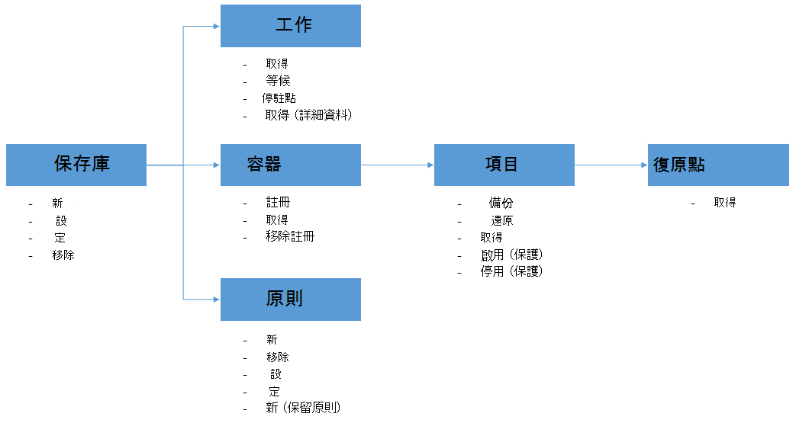

<properties
    pageTitle="部署及管理使用 PowerShell 的 Azure Vm 備份 |Microsoft Azure"
    description="瞭解如何部署及管理使用 PowerShell 的 Azure 備份"
    services="backup"
    documentationCenter=""
    authors="markgalioto"
    manager="cfreeman"
    editor=""/>

<tags
    ms.service="backup"
    ms.workload="storage-backup-recovery"
    ms.tgt_pltfrm="na"
    ms.devlang="na"
    ms.topic="article"
    ms.date="08/08/2016"
    ms.author="markgal;trinadhk;jimpark" />


# <a name="deploy-and-manage-backup-for-azure-vms-using-powershell"></a>部署及管理使用 PowerShell 的 Azure Vm 備份

> [AZURE.SELECTOR]
- [資源管理員](backup-azure-vms-automation.md)
- [傳統](backup-azure-vms-classic-automation.md)

本文將示範如何使用備份與還原的 Azure Vm PowerShell 的 Azure。 Azure 有兩種不同的部署模型建立及使用的資源︰ 資源管理員] 和 [傳統。 本文涵蓋使用傳統部署模型。 Microsoft 建議最新的部署使用資源管理員模型。

## <a name="concepts"></a>概念


本文提供有關用來備份虛擬機器的 PowerShell 指令程式。 簡介保護 Azure Vm 的詳細資訊，請參閱[規劃 Azure 中的您 VM 備份基礎結構](backup-azure-vms-introduction.md)。

> [AZURE.NOTE] 在開始之前，請閱讀處理 Azure 備份和目前的 VM 備份方案[限制](backup-azure-vms-prepare.md#limitations)必要[的先決條件](backup-azure-vms-prepare.md)。

若要有效地使用 PowerShell，花了解階層的物件，然後從開始的位置。



兩個最重要的流量會啟用 vm，保護，並還原復原點的資料。 本文的焦點會以協助您進一步家使用 PowerShell cmdlet，以啟用這兩種情況。


## <a name="setup-and-registration"></a>設定和註冊
若要開始︰

1. [下載最新的 PowerShell](https://github.com/Azure/azure-powershell/releases)(必要的最低版本︰ 1.0.0)

2. 尋找 Azure 備份 PowerShell 指令程式可用來輸入下列命令︰

```
PS C:\> Get-Command *azurermbackup*

CommandType     Name                                               Version    Source
-----------     ----                                               -------    ------
Cmdlet          Backup-AzureRmBackupItem                           1.0.1      AzureRM.Backup
Cmdlet          Disable-AzureRmBackupProtection                    1.0.1      AzureRM.Backup
Cmdlet          Enable-AzureRmBackupContainerReregistration        1.0.1      AzureRM.Backup
Cmdlet          Enable-AzureRmBackupProtection                     1.0.1      AzureRM.Backup
Cmdlet          Get-AzureRmBackupContainer                         1.0.1      AzureRM.Backup
Cmdlet          Get-AzureRmBackupItem                              1.0.1      AzureRM.Backup
Cmdlet          Get-AzureRmBackupJob                               1.0.1      AzureRM.Backup
Cmdlet          Get-AzureRmBackupJobDetails                        1.0.1      AzureRM.Backup
Cmdlet          Get-AzureRmBackupProtectionPolicy                  1.0.1      AzureRM.Backup
Cmdlet          Get-AzureRmBackupRecoveryPoint                     1.0.1      AzureRM.Backup
Cmdlet          Get-AzureRmBackupVault                             1.0.1      AzureRM.Backup
Cmdlet          Get-AzureRmBackupVaultCredentials                  1.0.1      AzureRM.Backup
Cmdlet          New-AzureRmBackupProtectionPolicy                  1.0.1      AzureRM.Backup
Cmdlet          New-AzureRmBackupRetentionPolicyObject             1.0.1      AzureRM.Backup
Cmdlet          New-AzureRmBackupVault                             1.0.1      AzureRM.Backup
Cmdlet          Register-AzureRmBackupContainer                    1.0.1      AzureRM.Backup
Cmdlet          Remove-AzureRmBackupProtectionPolicy               1.0.1      AzureRM.Backup
Cmdlet          Remove-AzureRmBackupVault                          1.0.1      AzureRM.Backup
Cmdlet          Restore-AzureRmBackupItem                          1.0.1      AzureRM.Backup
Cmdlet          Set-AzureRmBackupProtectionPolicy                  1.0.1      AzureRM.Backup
Cmdlet          Set-AzureRmBackupVault                             1.0.1      AzureRM.Backup
Cmdlet          Stop-AzureRmBackupJob                              1.0.1      AzureRM.Backup
Cmdlet          Unregister-AzureRmBackupContainer                  1.0.1      AzureRM.Backup
Cmdlet          Wait-AzureRmBackupJob                              1.0.1      AzureRM.Backup
```

可以使用 PowerShell 自動化下列設定和註冊工作︰

- 建立備份保存庫
- 註冊 Vm Azure 備份服務

### <a name="create-a-backup-vault"></a>建立備份保存庫

> [AZURE.WARNING] 第一次使用 Azure 備份的客戶，您需要註冊 Azure 備份提供者來搭配您的訂閱。 這可以藉由執行下列命令︰ Register AzureRmResourceProvider ProviderNamespace 「 Microsoft.Backup 」

您可以建立新的備份保存庫，以使用**新 AzureRmBackupVault**指令程式。 備份保存庫是一 ARM 資源，因此您必須將其放在 [資源群組。 在較高的 PowerShell 的 Azure 主控台中，執行下列命令︰

```
PS C:\> New-AzureRmResourceGroup –Name “test-rg” –Location “West US”
PS C:\> $backupvault = New-AzureRmBackupVault –ResourceGroupName “test-rg” –Name “test-vault” –Region “West US” –Storage GeoRedundant
```

您可以使用**取得 AzureRmBackupVault** cmdlet 指定訂閱中取得所有備份保存庫的清單。

> [AZURE.NOTE] 很方便地將備份保存庫物件到變數。 保存庫物件需要的許多 Azure 備份 cmdlet 的輸入。


### <a name="registering-the-vms"></a>註冊 Vm
Azure 備份設定備份的第一個步驟是您的電腦或 VM 註冊 Azure 備份保存庫。 **Register AzureRmBackupContainer**指令程式會輸入 Azure IaaS 虛擬機器的資訊，並登錄指定保存庫。 Register 作業 Azure 虛擬機器關聯備份保存庫，並追蹤備份存留 VM。

Azure 備份服務註冊您 VM 建立最上層的容器物件。 容器通常包含多個項目，可以備份，但若是 Vm 會容器只有一個備份的項目。

```
PS C:\> $registerjob = Register-AzureRmBackupContainer -Vault $backupvault -Name "testvm" -ServiceName "testvm"
```

## <a name="backup-azure-vms"></a>備份 Azure Vm

### <a name="create-a-protection-policy"></a>建立保護原則
不建立新的保護原則，以開始備份您的 Vm 強制。 保存庫隨附 「 預設原則 」，可以用來快速啟用保護]，然後稍後編輯以正確的詳細資訊。 您可以使用**取得 AzureRmBackupProtectionPolicy** cmdlet，以取得保存庫中提供的原則清單︰

```
PS C:\> Get-AzureRmBackupProtectionPolicy -Vault $backupvault

Name                      Type               ScheduleType       BackupTime
----                      ----               ------------       ----------
DefaultPolicy             AzureVM            Daily              26-Aug-15 12:30:00 AM
```

> [AZURE.NOTE] 在 PowerShell 中 BackupTime 欄位的時區是 UTC。 不過，當 Azure 入口網站中顯示的備份的時間，時區對齊到本機系統以及 UTC 位移。

備份原則是至少有一個的保留原則相關聯。 保留原則可定義多久復原點會保留使用 Azure 備份。 **新增 AzureRmBackupRetentionPolicy**指令程式所建立的保留原則資訊保留 PowerShell 物件。 這些保留原則物件做為*新增 AzureRmBackupProtectionPolicy* cmdlet，或直接*啟用 AzureRmBackupProtection* cmdlet 的輸入。

備份原則可定義的項目備份何時完成。 **新增 AzureRmBackupProtectionPolicy** cmdlet 建立 PowerShell 物件保留備份原則資訊。 備份原則作為*啟用 AzureRmBackupProtection* cmdlet 的輸入。

```
PS C:\> $Daily = New-AzureRmBackupRetentionPolicyObject -DailyRetention -Retention 30
PS C:\> $newpolicy = New-AzureRmBackupProtectionPolicy -Name DailyBackup01 -Type AzureVM -Daily -BackupTime ([datetime]"3:30 PM") -RetentionPolicy $Daily -Vault $backupvault

Name                      Type               ScheduleType       BackupTime
----                      ----               ------------       ----------
DailyBackup01             AzureVM            Daily              01-Sep-15 3:30:00 PM
```

### <a name="enable-protection"></a>啟用保護
啟用保護涉及兩個物件的項目及原則，，兩者都必須屬於相同的保存庫。 一旦您已與項目相關聯原則，備份工作流程會開始運作定義的排程。

```
PS C:\> Get-AzureRmBackupContainer -Type AzureVM -Status Registered -Vault $backupvault | Get-AzureRmBackupItem | Enable-AzureRmBackupProtection -Policy $newpolicy
```

### <a name="initial-backup"></a>初始的備份
備份的排程將會負責執行完整的初始複製項目] 和 [遞增複製的後續的備份。 不過，如果您想要強制發生在一段時間，或甚至立即初始備份然後使用**備份 AzureRmBackupItem** cmdlet:

```
PS C:\> $container = Get-AzureRmBackupContainer -Vault $backupvault -Type AzureVM -Name "testvm"
PS C:\> $backupjob = Get-AzureRmBackupItem -Container $container | Backup-AzureRmBackupItem
PS C:\> $backupjob

WorkloadName    Operation       Status          StartTime              EndTime
------------    ---------       ------          ---------              -------
testvm          Backup          InProgress      01-Sep-15 12:24:01 PM  01-Jan-01 12:00:00 AM
```

> [AZURE.NOTE] 在 PowerShell 中顯示的 [開始時間和結束時間] 欄位的時區是 UTC。 不過，當類似的資訊會顯示在 Azure 入口網站中，您的本機系統時鐘會對齊時區。

### <a name="monitoring-a-backup-job"></a>監控備份工作
Azure 備份中的最長時間執行作業是以工作和模型化。 這可輕鬆追蹤進度，而不需要保留 Azure 入口網站開啟在所有的時間。

若要進行中工作的最新狀態，請使用**取得 AzureRmBackupJob**指令程式。

```
PS C:\> $joblist = Get-AzureRmBackupJob -Vault $backupvault -Status InProgress
PS C:\> $joblist[0]

WorkloadName    Operation       Status          StartTime              EndTime
------------    ---------       ------          ---------              -------
testvm          Backup          InProgress      01-Sep-15 12:24:01 PM  01-Jan-01 12:00:00 AM
```

而非輪詢-這是不需要額外的程式碼-完成這些工作會更容易使用**等待 AzureRmBackupJob**指令程式。 指令碼中使用時，指令程式會暫停執行，直到完成作業或達到指定的逾時間值。

```
PS C:\> Wait-AzureRmBackupJob -Job $joblist[0] -Timeout 43200
```


## <a name="restore-an-azure-vm"></a>還原 Azure VM

若要還原的備份資料，您需要找出備份項目和復原點保留時間點資料。 這項資訊會提供還原 AzureRmBackupItem cmdlet 進行資料的還原從保存庫客戶的帳戶。

### <a name="select-the-vm"></a>選取 VM

若要取得 PowerShell 物件可識別右備份的項目，您需要從保存庫中的 [容器開始著手物件階層。 若要選取代表 VM 容器，請使用**取得 AzureRmBackupContainer** cmdlet，**取得 AzureRmBackupItem** cmdlet 管道的。

```
PS C:\> $backupitem = Get-AzureRmBackupContainer -Vault $backupvault -Type AzureVM -name "testvm" | Get-AzureRmBackupItem
```

### <a name="choose-a-recovery-point"></a>選擇 [復原點

現在，您可以使用**取得 AzureRmBackupRecoveryPoint**指令程式的項目備份的所有復原點] 都清單，並選擇要還原的復原點。 依照一般做法新使用者會在清單中，挑選最新的*AppConsistent*點。

```
PS C:\> $rp =  Get-AzureRmBackupRecoveryPoint -Item $backupitem
PS C:\> $rp

RecoveryPointId    RecoveryPointType  RecoveryPointTime      ContainerName
---------------    -----------------  -----------------      -------------
15273496567119     AppConsistent      01-Sep-15 12:27:38 PM  iaasvmcontainer;testvm;testv...
```

變數```$rp```選取的備份項目，排序以相反順序的時間-最新的復原點索引是 0 是陣列的復原點。 使用標準 PowerShell 陣列編製索引作業，挑選復原點。 例如︰```$rp[0]```將選取的最新的復原點。

### <a name="restoring-disks"></a>還原磁碟

有完成透過 Azure 入口網站及 PowerShell 的 Azure 還原之間的主要差異。 使用 PowerShell 還原作業停駐點，從復原點還原的磁碟及設定資訊。 它不會建立虛擬機器。

> [AZURE.WARNING] 還原 AzureRmBackupItem 並不會建立 VM。 只會磁碟還原至指定的儲存的帳戶。 這不是在 Azure 入口網站，就會發生相同的行為。

```
PS C:\> $restorejob = Restore-AzureRmBackupItem -StorageAccountName "DestAccount" -RecoveryPoint $rp[0]
PS C:\> $restorejob

WorkloadName    Operation       Status          StartTime              EndTime
------------    ---------       ------          ---------              -------
testvm          Restore         InProgress      01-Sep-15 1:14:01 PM   01-Jan-01 12:00:00 AM
```

您可以取得還原作業還原工作完成後，請使用**取得 AzureRmBackupJobDetails** cmdlet 的詳細資料。 *ErrorDetails*屬性必須重建 VM 所需的資訊。

```
PS C:\> $restorejob = Get-AzureRmBackupJob -Job $restorejob
PS C:\> $details = Get-AzureRmBackupJobDetails -Job $restorejob
```

### <a name="build-the-vm"></a>建立 VM

使用較舊的 Azure 服務管理 PowerShell cmdlet，新的 Azure 資源管理員範本，或甚至 Azure 入口網站，可以完成建立登出還原磁碟 VM。 在快速範例中，我們會顯示如何取得使用 Azure 服務管理 cmdlet。

```
 $properties  = $details.Properties

 $storageAccountName = $properties["Target Storage Account Name"]
 $containerName = $properties["Config Blob Container Name"]
 $blobName = $properties["Config Blob Name"]

 $keys = Get-AzureStorageKey -StorageAccountName $storageAccountName
 $storageAccountKey = $keys.Primary
 $storageContext = New-AzureStorageContext -StorageAccountName $storageAccountName -StorageAccountKey $storageAccountKey


 $destination_path = "C:\Users\admin\Desktop\vmconfig.xml"
 Get-AzureStorageBlobContent -Container $containerName -Blob $blobName -Destination $destination_path -Context $storageContext


$obj = [xml](((Get-Content -Path $destination_path -Encoding UniCode)).TrimEnd([char]0x00))
 $pvr = $obj.PersistentVMRole
 $os = $pvr.OSVirtualHardDisk
 $dds = $pvr.DataVirtualHardDisks
 $osDisk = Add-AzureDisk -MediaLocation $os.MediaLink -OS $os.OS -DiskName "panbhaosdisk"
 $vm = New-AzureVMConfig -Name $pvr.RoleName -InstanceSize $pvr.RoleSize -DiskName $osDisk.DiskName

 if (!($dds -eq $null))
 {
     foreach($d in $dds.DataVirtualHardDisk)
     {
         $lun = 0
         if(!($d.Lun -eq $null))
         {
             $lun = $d.Lun
         }
         $name = "panbhadataDisk" + $lun
     Add-AzureDisk -DiskName $name -MediaLocation $d.MediaLink
     $vm | Add-AzureDataDisk -Import -DiskName $name -LUN $lun
    }
}

New-AzureVM -ServiceName "panbhasample" -Location "SouthEast Asia" -VM $vm
```

如需有關如何建立從還原磁碟 VM 的詳細資訊，請閱讀下列 cmdlet:

- [新增 AzureDisk](https://msdn.microsoft.com/library/azure/dn495252.aspx)
- [新 AzureVMConfig](https://msdn.microsoft.com/library/azure/dn495159.aspx)
- [新 AzureVM](https://msdn.microsoft.com/library/azure/dn495254.aspx)

## <a name="code-samples"></a>程式碼範例

### <a name="1-get-the-completion-status-of-job-sub-tasks"></a>1.取得工作子任務的完成狀態

若要追蹤個別的子任務的完成狀態，您可以使用**取得 AzureRmBackupJobDetails**指令程式︰

```
PS C:\> $details = Get-AzureRmBackupJobDetails -JobId $backupjob.InstanceId -Vault $backupvault
PS C:\> $details.SubTasks

Name                                                        Status
----                                                        ------
Take Snapshot                                               Completed
Transfer data to Backup vault                               InProgress
```

### <a name="2-create-a-dailyweekly-report-of-backup-jobs"></a>2.建立備份工作的每日/每週報表

系統管理員通常是想要知道在過去 24 小時，而這些備份工作狀態中執行的備份工作。 此外，傳輸的資料量可讓系統管理員的方式來估計其每月的資料使用方式。 以下的指令碼會提取 [從 Azure 備份服務的原始資料和 PowerShell 主控台中顯示的資訊。

```
param(  [Parameter(Mandatory=$True,Position=1)]
        [string]$backupvaultname,

        [Parameter(Mandatory=$False,Position=2)]
        [int]$numberofdays = 7)


#Initialize variables
$DAILYBACKUPSTATS = @()
$backupvault = Get-AzureRmBackupVault -Name $backupvaultname
$enddate = ([datetime]::Today).AddDays(1)
$startdate = ([datetime]::Today)

for( $i = 1; $i -le $numberofdays; $i++ )
{
    # We query one day at a time because pulling 7 days of data might be too much
    $dailyjoblist = Get-AzureRmBackupJob -Vault $backupvault -From $startdate -To $enddate -Type AzureVM -Operation Backup
    Write-Progress -Activity "Getting job information for the last $numberofdays days" -Status "Day -$i" -PercentComplete ([int]([decimal]$i*100/$numberofdays))

    foreach( $job in $dailyjoblist )
    {
        #Extract the information for the reports
        $newstatsobj = New-Object System.Object
        $newstatsobj | Add-Member -Type NoteProperty -Name Date -Value $startdate
        $newstatsobj | Add-Member -Type NoteProperty -Name VMName -Value $job.WorkloadName
        $newstatsobj | Add-Member -Type NoteProperty -Name Duration -Value $job.Duration
        $newstatsobj | Add-Member -Type NoteProperty -Name Status -Value $job.Status

        $details = Get-AzureRmBackupJobDetails -Job $job
        $newstatsobj | Add-Member -Type NoteProperty -Name BackupSize -Value $details.Properties["Backup Size"]
        $DAILYBACKUPSTATS += $newstatsobj
    }

    $enddate = $enddate.AddDays(-1)
    $startdate = $startdate.AddDays(-1)
}

$DAILYBACKUPSTATS | Out-GridView
```

如果您想要新增至報表輸出的圖表功能，進一步瞭解從 TechNet 部落格文章[使用 PowerShell 的圖表](http://blogs.technet.com/b/richard_macdonald/archive/2009/04/28/3231887.aspx)

## <a name="next-steps"></a>後續步驟

如果您偏好使用 PowerShell 來加入 Azure 資源，請參閱 PowerShell 本文保護 Windows Server[部署及管理的 Windows Server 的備份](./backup-client-automation-classic.md)。 此外，還有管理 DPM 備份、[部署及管理備份 dpm](./backup-dpm-automation-classic.md)的 PowerShell 文章。 兩個這些文件有資源管理員部署以及傳統部署版本。
