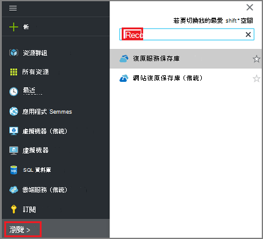
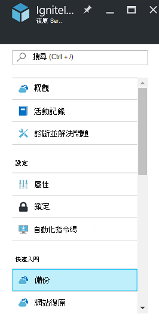
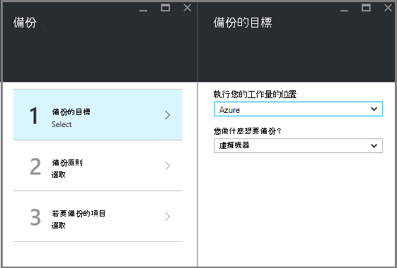
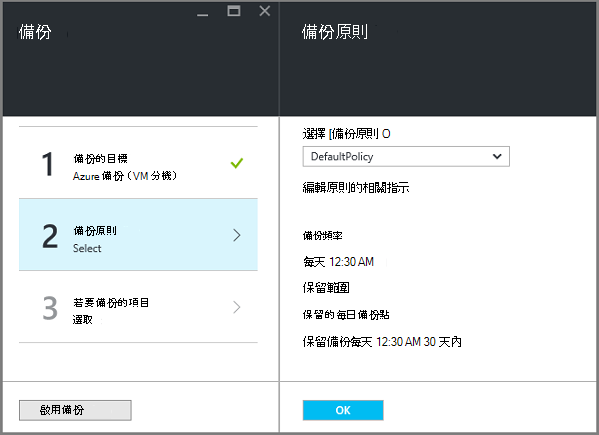
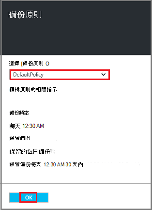
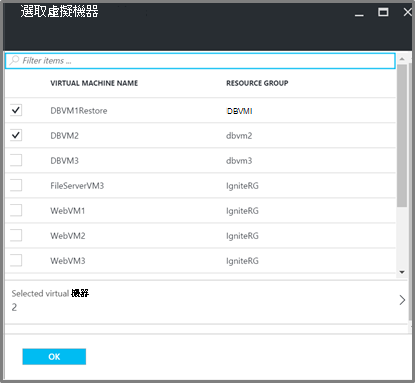
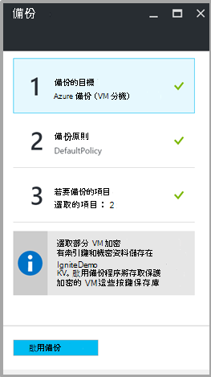

<properties
   pageTitle="備份與還原 Vm 使用加密 Azure 備份"
   description="本文說話關於備份和還原體驗 Vm 加密使用 Azure 磁碟加密。"
   services="backup"
   documentationCenter=""
   authors="JPallavi"
   manager="vijayts"
   editor=""/>
<tags
   ms.service="backup"
   ms.devlang="na"
   ms.topic="article"
   ms.tgt_pltfrm="na"
   ms.workload="storage-backup-recovery"
   ms.date="10/25/2016"
   ms.author="markgal; jimpark; trinadhk"/>

# 備份與還原 Vm 使用加密 Azure 備份

本文說話備份與還原使用備份 Azure 虛擬機器的步驟。 它也會提供錯誤情況的詳細資料支援的案例、 必要條件及疑難排解步驟。

## 支援的案例

> [AZURE.NOTE]
1.  備份及還原加密 Vm 支援僅適用於資源管理員部署虛擬機器。 不支援傳統虛擬機器。  
2.  僅適用於使用 BitLocker 加密金鑰及主要加密金鑰加密的虛擬機器支援。 不支援加密僅使用 BitLocker 加密金鑰的虛擬機器。  

## 必要條件

1.  虛擬機器已加密並使用[Azure 磁碟加密](../security/azure-security-disk-encryption.md)。 應該加密使用 BitLocker 加密金鑰和主要加密金鑰。
2.  復原服務保存庫已建立並儲存複寫設定使用文件[準備備份您的環境](backup-azure-arm-vms-prepare.md)中所述的步驟。

## 備份加密 VM
您可以使用下列步驟來設定備份目標、 定義原則設定的項目與觸發程序備份。

### 設定備份

1. 如果您已經開啟修復服務保存庫，請繼續下一個步驟。 如果您沒有地窖開啟，請修復服務，但在 Azure 入口網站中，在中心] 功能表中，按一下 [**瀏覽**。

  - 在資源的清單中，輸入**修復服務**。
  - 當您開始輸入，清單篩選是根據您輸入。 當您看到**修復服務保存庫**時，請按一下它。
  
        

    修復服務保存庫清單隨即出現。 從修復服務保存庫清單中，選取 [保存庫]。

    隨即會開啟選取保存庫儀表板。

2. 從清單中的項目，會出現在 [保存庫，按一下 [開啟備份刀的**備份**]。

       
    
3. 在 [備份刀中，按一下 [開啟備份目標刀**備份目標**]。

       
    
4.   在 [備份目標防禦，以設定**位置執行您的工作量**為 Azure 和**您做什麼想要備份**虛擬機器，然後按一下**[確定]**。

    備份目標刀隨即關閉，且備份原則刀隨即會開啟。

       

5. 在備份原則刀中，選取備份原則您想要套用至保存庫，然後按一下**[確定]**。

       

    預設的原則的詳細資料列在詳細資料。 如果您想要建立原則，從下拉式功能表選取**建立新檔案**。 一旦您按一下**[確定]**，備份原則是保存庫與相關聯。

    接下來，請選擇關聯保存庫 Vm。
    
6. 選擇 [加密的虛擬機器與指定原則關聯，然後按一下**[確定**]。

      
   
7. 此頁面會顯示與加密 Vm 選取相關聯的按鍵保存庫有關的訊息。 備份服務所需的機碼和金鑰保存庫中的機密的唯讀存取。 使用備份索引鍵和 [私人]，以及相關聯的 Vm 這些權限。 

      

      現在，您已經定義保存庫，在備份刀中的所有設定都按一下啟用的備份，底部的頁面]。 啟用備份保存庫和 Vm 部署原則。

8. 準備的下一個階段安裝 VM 代理程式或確保 VM 代理程式已安裝。 若要執行相同，請使用文件[準備備份您的環境](backup-azure-arm-vms-prepare.md)中所述的步驟。 

### 觸發的備份工作
使用引動程序備份工作文章[來復原服務保存庫的備份 Azure Vm](backup-azure-arm-vms.md)所述的步驟。

## 還原加密的 VM
還原相同加密和非加密虛擬機器的體驗。 若要還原的加密的 VM 使用[還原在入口網站中 Azure 虛擬機器](backup-azure-arm-restore-vms.md)所述的步驟。 如果需要還原索引鍵和密碼，您必須確定還原方式該金鑰保存庫應該已存在於。

## 疑難排解錯誤

| 作業 | 錯誤詳細資料 | 解決方法 |
| -------- | -------- | -------|
| 備份 | 驗證失敗，因為 BEK 單獨使用加密虛擬機器。 您可以僅適用於加密與 BEK 和 KEK 的虛擬機器啟用備份。 | 虛擬機器應該使用 BEK 和 KEK 加密。 之後，您應該啟用備份。 |
| 還原 | 由於此 VM 相關聯的按鍵保存庫不存在，您無法還原此加密的 VM。 | 建立使用[快速入門 Azure 金鑰保存庫](../key-vault/key-vault-get-started.md)金鑰保存庫。 請參閱[還原金鑰保存庫索引鍵和私人使用 Azure 備份](backup-azure-restore-key-secret.md)還原索引鍵和密碼，如果未出現的文件。 |
| 還原 | 您無法還原此加密的 VM，因為索引鍵和此 VM 相關聯的密碼不存在。 | 請參閱[還原金鑰保存庫索引鍵和私人使用 Azure 備份](backup-azure-restore-key-secret.md)還原索引鍵和密碼，如果未出現的文件。 |
