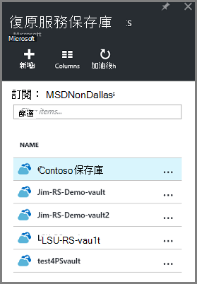
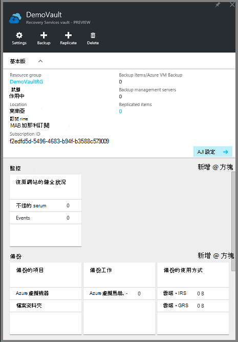
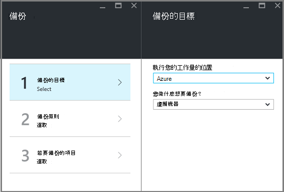
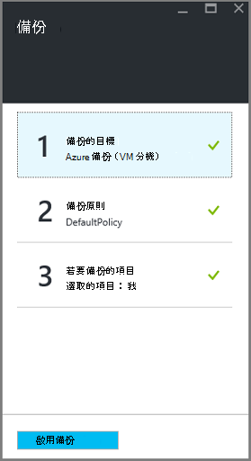

<properties
    pageTitle="第一次查看︰ 使用 [復原服務保存庫保護 Azure Vm |Microsoft Azure"
    description="使用 [復原服務保存庫來保護 Azure Vm。 使用備份的資源管理員部署 Vm 與傳統部署 Vm 進階版儲存 Vm 保護您的資料。 建立並註冊復原服務保存庫。 註冊 Vm、 建立原則，並保護 Vm Azure 中。"
    services="backup"
    documentationCenter=""
    authors="markgalioto"
    manager="cfreeman"
    editor=""
    keyword="backups; vm backup"/>

<tags
    ms.service="backup"
    ms.workload="storage-backup-recovery"
    ms.tgt_pltfrm="na"
    ms.devlang="na"
    ms.topic="hero-article"
    ms.date="10/13/2016"
    ms.author="markgal; jimpark"/>

# 第一次查看︰ 保護 Azure Vm 與修復服務保存庫

> [AZURE.SELECTOR]
- [保護 Vm 與修復服務保存庫](backup-azure-vms-first-look-arm.md)
- [使用備份保存庫保護 Vm](backup-azure-vms-first-look.md)

本教學課程中會帶領您完成建立復原服務保存庫和備份 Azure 虛擬機器 (VM) 的步驟。 保護復原服務保存庫︰

- Azure 資源管理員部署 Vm
- 傳統 Vm
- 標準存放 Vm
- 進階版儲存 Vm
- 使用 Azure 磁碟加密 BEK 與 KEK 加密 Vm

保護進階版儲存 Vm 的詳細資訊，請參閱[備份及還原進階版儲存 Vm](backup-introduction-to-azure-backup.md#back-up-and-restore-premium-storage-vms)

>[AZURE.NOTE] 本教學課程假設您已經有 VM Azure 訂閱中，而且已經允許存取 VM 備份服務的量值。

[AZURE.INCLUDE [learn-about-Azure-Backup-deployment-models](../../includes/backup-deployment-models.md)]

在高的層級，以下是您要完成的步驟。  

1. 建立 VM 復原服務保存庫。
2. 若要選取情況，設定原則，並找出要保護的項目使用 Azure 入口網站。
3. 執行初始的備份。

## 建立 VM 復原服務保存庫

復原服務保存庫是會儲存備份及復原點已建立一段時間的實體。 復原服務保存庫也包含套用到受保護的 Vm 的備份原則。

>[AZURE.NOTE] 備份 Vm 是本機的程序。 您無法備份 Vm 從一個位置來復原服務保存庫中的另一個位置。 因此，有 Vm 来備份的每個 Azure 位置，請至少有一個復原服務保存庫必須位於該位置。

若要建立復原服務保存庫︰

1. [Azure 入口網站](https://portal.azure.com/)登入。

2. 在 [中心] 功能表中，按一下 [**瀏覽**，在資源的清單中，輸入 [**修復服務**。 當您開始輸入，清單篩選是根據您輸入。 按一下 [**修復服務保存庫**]。

      

    復原服務保存庫的清單會顯示。

3. 在 [**復原服務保存庫**] 功能表中，按一下 [**新增**。

    

    修復服務保存庫刀開啟時，它會提示您提供的**名稱**、**訂閱**、 [**資源] 群組**中，與**位置**。

    

4. [**名稱**] 中，輸入好記的名稱來識別保存庫。 名稱必須是唯一的 Azure 訂閱。 輸入包含 2 到 50 個字元之間的名稱。 它必須以字母，以開始，並可以包含字母、 數字和連字號。

5. 按一下以查看可用的訂閱清單的**訂閱**]。 如果您不確定要使用的訂閱，使用預設的 （或建議） 訂閱。 有多個選項，只有您的組織帳戶是 Azure 的多個訂閱相關聯。

6. 按一下 [**資源群組**以查看可用的資源群組清單，或按一下 [**新增**]，以建立資源群組。 完整資源群組的詳細資訊，請參閱[Azure 資源管理員的概觀](../azure-resource-manager/resource-group-overview.md)

7. 按一下以選取保存庫的地理區域的**位置**。 **必須**保存庫是為您想要保護的虛擬機器相同的區域。

    >[AZURE.IMPORTANT] 如果您不確定您 VM 存在於的位置，請關閉不在 [保存庫建立] 對話方塊，然後移至虛擬機器的清單，在入口網站。 如果您有多個區域中的虛擬機器，建立復原服務保存庫中每個區域。 建立保存庫中的第一個位置，再移至下一個位置。 若要指定儲存備份資料，也就是復原服務保存庫儲存帳戶不需要和備份 Azure 服務會自動處理。

8. 按一下 [**建立**]。 可能需要一段時間的復原服務保存庫，建立。 監控右側區內入口網站中的狀態通知。 您保存庫建立之後，它會出現在清單中復原服務保存庫。

    

現在，您已經建立您保存庫，瞭解如何設定儲存複寫。

### 設定儲存複寫

儲存複寫選項可讓您選擇地理多餘的儲存在本機上多餘的儲存空間。 根據預設，您保存庫有地理多餘的儲存空間。 [離開] 選項設定為地理多餘的儲存空間，如果這是您主要的備份。 如果您想要無法像便宜選項，請選擇 [本機多餘的儲存空間]。 瞭解更多關於[地理多餘](../storage/storage-redundancy.md#geo-redundant-storage)和[Azure 儲存體複寫概觀](../storage/storage-redundancy.md)中[本機多餘](../storage/storage-redundancy.md#locally-redundant-storage)的儲存選項。

若要編輯的儲存空間複寫設定︰

1. 選取您要開啟保存庫儀表板與設定的保存庫。 如果**設定**刀沒有開啟，請按一下 [保存庫儀表板中的 [**所有設定**]。

2. 在**設定**刀中，按一下 [**備份基礎結構** > 開啟**備份設定**刀**備份設定**。 在**備份設定**刀中，選擇您保存庫的儲存空間複寫選項。

    

    選擇您保存庫的 [儲存] 選項之後, 您準備好 VM 關聯保存庫。 若要開始關聯，請探索並註冊 Azure 虛擬機器。

## 選取備份目標、 設定原則，並定義要保護的項目

註冊保存庫 VM 之前, 執行探索程序，以確保已新增至訂閱任何新虛擬機器會識別。 雲端服務名稱和地區，例如處理程序查詢 Azure 虛擬機器中的訂閱，以及其他資訊的清單。 Azure 入口網站中，在分析藍本是指您要放入復原服務保存庫。 原則是頻率以及何時採取復原點的排程。 原則也包含復原點的保留範圍。

1. 如果您已經開啟保存庫修復服務，請繼續進行步驟 2。 如果您沒有的復原服務地窖開啟，但在 Azure 入口網站中，在中心] 功能表中，按一下 [**瀏覽**。

  - 在資源的清單中，輸入**修復服務**。
  - 當您開始輸入，清單篩選是根據您輸入。 當您看到**修復服務保存庫**時，請按一下它。

      

    復原服務保存庫清單隨即出現。
  - 從復原服務保存庫清單中，選取 [保存庫]。

    隨即會開啟選取保存庫儀表板。

    

2. 從保存庫儀表板] 功能表中，按一下 [開啟備份刀**備份**]。

    

    刀開啟時，訂閱中的任何新 Vm 搜尋備份服務。

    

3. 在 [備份刀中，按一下 [開啟備份目標刀**備份目標**]。

    

4. 在 [備份目標防禦，以設定**位置執行您的工作量**為 Azure 和**您做什麼想要備份**虛擬機器，然後按一下**[確定]**。

    備份目標刀隨即關閉，且備份原則刀隨即會開啟。

    

5. 在備份原則刀中，選取備份原則您想要套用至保存庫，然後按一下**[確定]**。

    

    預設的原則的詳細資料列在詳細資料。 如果您想要建立原則，從下拉式功能表選取**建立新檔案**。 下拉功能表也會提供選項，切換時快照所花的時間，7 PM。 如需定義備份原則的相關指示，請參閱[定義備份原則](backup-azure-vms-first-look-arm.md#defining-a-backup-policy)。 一旦您按一下**[確定]**，備份原則是保存庫與相關聯。

    接下來，請選擇關聯保存庫 Vm。

6. 選擇 [虛擬機器與指定原則關聯，然後按一下 [**選取**]。

    

    如果您沒有看到所要的 VM，檢查其是否存在修復服務保存庫 Azure 的相同位置。

7. 現在，您已經定義保存庫，在備份刀中的所有設定都按一下**啟用備份**底部的頁面]。 此保存庫和 Vm 部署原則。

    

## 初始的備份

虛擬機器，並不表示的部署備份原則後有尚未備份資料。 根據預設，第一個排程的備份 （中所定義的備份原則） 是初始的備份。 初始備份時，直到**備份工作**刀上的最後一個備份的狀態顯示為**警告 （已擱置初始備份）**。

除非您初始的備份開始即將到期時，建議您執行**現在備份**。

若要執行**現在備份**︰

1. 在保存庫儀表板上 [**備份**] 方塊中，按一下 [ **Azure 虛擬機器**  
    ![[設定] 圖示](./media/backup-azure-vms-first-look-arm/rs-vault-in-dashboard-backup-vms.png)

    **備份的項目**刀隨即會開啟。

2. 在**備份的項目**刀中，以滑鼠右鍵按一下您想要備份保存的庫，按一下 [**立即備份**。

    ![[設定] 圖示](./media/backup-azure-vms-first-look-arm/back-up-now.png)

    觸發的備份工作。  

    

3. 若要檢視您的初始檔案備份已完成，在保存庫儀表板，在 [**備份工作**] 方塊中，按一下 [ **Azure 虛擬機器**。

    

    備份工作刀隨即會開啟。

4. 在 [備份工作刀中，您可以看到所有工作的狀態。

    

    >[AZURE.NOTE] 備份作業的一部分備份 Azure 服務會發出命令中清除所有寫入和一致的快照的每個 VM 備份副檔名。

    備份工作完成時，狀態是 [*已完成]*。

[AZURE.INCLUDE [backup-create-backup-policy-for-vm](../../includes/backup-create-backup-policy-for-vm.md)]

## 虛擬機器上安裝 VM 代理程式

它會需要提供這項資訊。 Azure 虛擬機器備份延伸至工作上必須安裝 Azure VM 代理程式。 不過，如果您 VM 建立從 Azure] 庫，然後 VM 代理程式已經存在虛擬機器上。 會從內部部署資料中心想安裝 VM 代理程式移轉的 Vm。 在這種情況下，必須安裝 VM 代理程式。 如果您有備份 Azure VM 的問題，請檢查虛擬機器上正確安裝 Azure VM 代理程式 （請參閱下表）。 如果您建立自訂的 VM，是佈建之前虛擬機器請[確定已選取 [**安裝 VM 代理程式**] 核取方塊](../virtual-machines/virtual-machines-windows-classic-agents-and-extensions.md)。

進一步瞭解[VM 代理程式](https://go.microsoft.com/fwLink/?LinkID=390493&clcid=0x409)，[如何將其安裝](../virtual-machines/virtual-machines-windows-classic-manage-extensions.md)。

下表提供 VM 代理程式 for Windows 和 Linux Vm 的其他資訊。

| **作業** | **Windows** | **Linux** |
| --- | --- | --- |
| 安裝 VM 代理程式 | <li>下載並安裝[代理程式 MSI](http://go.microsoft.com/fwlink/?LinkID=394789&clcid=0x409)。 您需要系統管理員權限，以完成安裝。 <li>[更新 VM 屬性](http://blogs.msdn.com/b/mast/archive/2014/04/08/install-the-vm-agent-on-an-existing-azure-vm.aspx)，表示代理程式已安裝。 | <li> 從 GitHub 安裝最新的[Linux 代理程式](https://github.com/Azure/WALinuxAgent)。 您需要系統管理員權限，以完成安裝。 <li> [更新 VM 屬性](http://blogs.msdn.com/b/mast/archive/2014/04/08/install-the-vm-agent-on-an-existing-azure-vm.aspx)，表示代理程式已安裝。 |
| 更新 VM 代理程式 | 更新 VM 代理程式是非常簡單，重新安裝[VM 代理程式的二進位檔案](http://go.microsoft.com/fwlink/?LinkID=394789&clcid=0x409)。  請確定沒有任何備份作業正在執行更新 VM 代理程式時。 | 依照上[更新 Linux VM 代理程式](../virtual-machines-linux-update-agent.md)的指示。  請確定沒有任何備份作業正在執行更新 VM 代理程式時。 |
| 驗證 VM 代理程式的安裝 | <li>瀏覽至 Azure VM 中的 [ *C:\WindowsAzure\Packages* ] 資料夾。 <li>您應該找到簡報 WaAppAgent.exe 檔案。<li> 以滑鼠右鍵按一下檔案，移至 [**屬性**]，然後選取 [**詳細資料**] 索引標籤。 產品版本] 欄位應與 2.6.1198.718 或更新版本。 | N/A |

### 備份的副檔名

虛擬機器上安裝 VM 代理程式之後，備份 Azure 服務 VM 代理程式安裝備份副檔名。 備份 Azure 服務升級和修補程式不會其他使用者互動副檔名為備份。

是否正在執行 VM 備份服務會安裝備份副檔名。 執行 VM 提供開始應用程式一致的復原點的最大的機率。 不過，Azure 備份服務持續備份 VM，即使即表示已經關閉，並且無法安裝副檔名。 這是稱為離線 VM。 在此情況下，復原點會*當機一致*。

## 疑難排解資訊
如果您有一些本文中的工作完成的問題，請參閱[疑難排解指南](backup-azure-vms-troubleshoot.md)。

## 價格
Azure VM 備份需要付費根據受保護的執行個體模型。 深入瞭解在[備份價格](https://azure.microsoft.com/pricing/details/backup/)

## 問題嗎？
如果您有問題，或任何 」 功能，您想要包含在內，請[將意見反應傳送給我們](http://aka.ms/azurebackup_feedback)。
