<properties
    pageTitle="概觀︰ 使用備份保存庫保護 Azure Vm |Microsoft Azure"
    description="使用備份保存庫來保護 Azure Vm。 教學課程說明建立保存庫、 登錄 Vm、 建立原則，並保護 Vm Azure 中。"
    services="backup"
    documentationCenter=""
    authors="markgalioto"
    manager="cfreeman"
    editor=""/>

<tags
    ms.service="backup"
    ms.workload="storage-backup-recovery"
    ms.tgt_pltfrm="na"
    ms.devlang="na"
    ms.topic="hero-article"
    ms.date="09/15/2016"
    ms.author="markgal; jimpark"/>

# 第一次查看︰ 備份 Azure 虛擬機器

> [AZURE.SELECTOR]
- [保護 Vm 與修復服務保存庫](backup-azure-vms-first-look-arm.md)
- [使用備份保存庫保護 Azure Vm](backup-azure-vms-first-look.md)

本教學課程中會帶領您完成備份 Azure 虛擬機器 (VM) 的步驟，以 Azure 中的備份保存庫。 本文將說明傳統模式或服務管理員部署模型，備份 Vm。 如果您有興趣 VM 備份到 [資源群組修復服務保存庫，請參閱[第一次查看︰ 修復服務保存庫使用的保護 Vm](backup-azure-vms-first-look-arm.md)。 若要順利完成本教學課程中，必須有下列先決條件︰

- 您已經建立 VM Azure 訂閱中。
- VM 有連線至 Azure 的公用 IP 位址。 如需詳細資訊，請參閱[網路連線](./backup-azure-vms-prepare.md#network-connectivity)。

若要備份，有五個主要步驟︰  

建立備份保存庫，或識別現有的備份保存庫。  
探索及註冊虛擬機器中使用傳統 Azure 入口網站。  
安裝 VM 代理程式。  
建立的原則保護虛擬機器。  
執行備份。

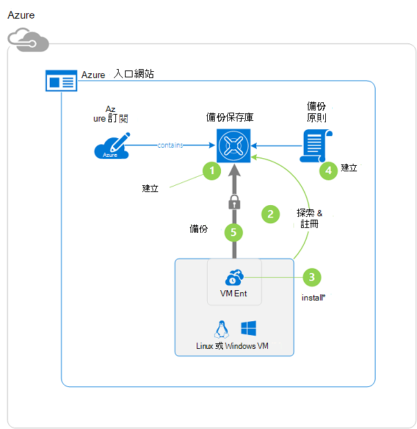

>[AZURE.NOTE] Azure 有兩種部署模型建立及使用的資源︰[資源管理員] 及 [傳統](../resource-manager-deployment-model.md)。 本教學課程適用於 Azure 傳統入口網站中可以建立 Vm 搭配使用。 Azure 備份服務支援資源管理員型 Vm。 若要復原服務保存庫 Vm 備份的詳細資訊，請參閱[第一個查詢︰ 修復服務保存庫使用的保護 Vm](backup-azure-vms-first-look-arm.md)。

## 步驟 1-建立備份保存庫 vm

備份保存庫是會儲存備份及復原點已建立一段時間的實體。 備份保存庫也包含就會套用至所要備份的虛擬機器的備份原則。

1. [Azure 傳統入口網站](http://manage.windowsazure.com/)登入。

2. 在 [Azure 入口網站的左下角，按一下 [**新增**

    ![按一下 [新增] 功能表](./media/backup-azure-vms-first-look/new-button.png)

3. 快速建立精靈] 中，按一下 [**資料服務** > **修復服務** > **備份保存庫** > **快速建立**。

    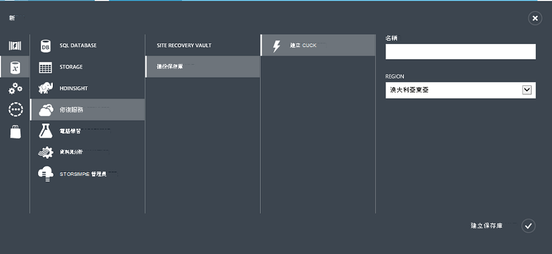

    精靈會提示您輸入 [**名稱**] 和 [**地區**。 如果您管理多個訂閱，會出現的對話方塊，選擇訂閱。

4. [**名稱**] 中，輸入好記的名稱來識別保存庫。 名稱必須是唯一的 Azure 訂閱。

5. 在 [**地區**中，選取 [保存庫的地理區域。 **必須**保存庫是保護虛擬機器為相同的區域。

    如果您不知道您 VM 存在於的區域，請關閉此精靈和 Azure 服務的清單中按一下 [**虛擬機器**。 [位置] 欄會提供區域的名稱。 如果您有多個區域的虛擬機器，建立備份保存庫中每個區域。

6. 如果精靈中不有任何**訂閱**] 對話方塊，請跳至下一個步驟。 如果您使用多個訂閱，請選取 [建立新的備份保存庫的關聯訂閱]。

    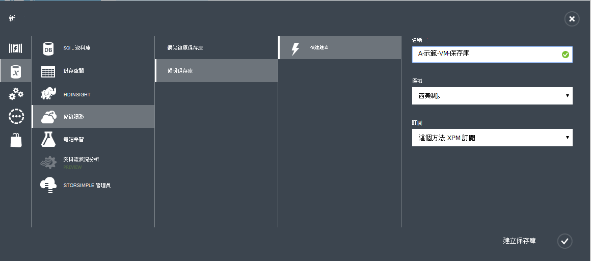

7. 按一下 [**建立保存庫**。 需要時建立備份保存庫。 監控狀態通知，底部的入口網站。

    

    已順利建立保存庫出現確認訊息。 它會列在 [**復原服務**] 頁面上為**使用中**。

    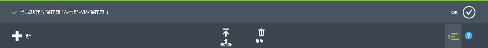

8. 在清單中的保存庫**復原服務**] 頁面上，選取您要建立啟動 [**快速入門**] 頁面保存庫。

    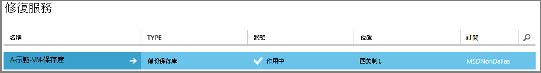

9. 在 [**快速入門**] 頁面上，按一下 [**設定**]，以開啟儲存複寫選項。
    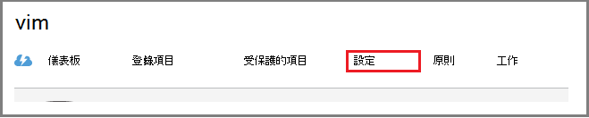

10. 在**儲存複寫**選項上，選擇您保存庫的 [複製] 選項。

    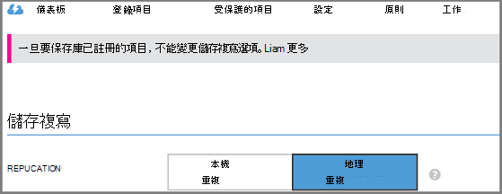

    根據預設，您保存庫有地理多餘的儲存空間。 如果這是您主要的備份，請選擇 [地理多餘的儲存空間]。 如果您想要不想為長期便宜選項，請選擇 [本機多餘的儲存空間]。 進一步瞭解[Azure 儲存體複寫概觀](../storage/storage-redundancy.md)中的地理多餘與本機多餘的儲存空間選項。

選擇您保存庫的 [儲存] 選項之後, 您準備好 VM 關聯保存庫。 若要開始關聯，探索和註冊 Azure 虛擬機器。

## 步驟 2-探索和註冊 Azure 虛擬機器
註冊保存庫 VM 之前, 執行探索程序來識別任何新 Vm。 這會傳回虛擬機器的清單中的訂閱，以及其他資訊，例如雲端服務名稱] 和 [區域。

1. 登入[Azure 傳統入口網站](http://manage.windowsazure.com/)

2. 在 Azure 傳統的入口網站中，按一下 [**修復服務**開啟修復服務保存庫的清單。
    

3. 從保存庫清單中，選取 [以備份保存庫]。

    當您選取您保存庫時，它會開啟在 [**快速入門**] 頁面

4. 從保存庫] 功能表中，按一下 [**註冊的項目**]。

    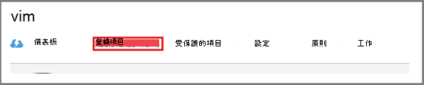

5. 從 [**類型**] 功能表中，選取 [ **Azure 虛擬機器**]。

    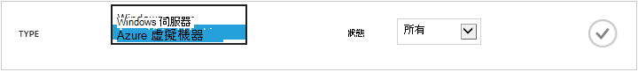

6. 按一下 [**探索**] 頁面的底部。
    ![探索] 按鈕](./media/backup-azure-vms/discover-button-only.png)

    探索程序虛擬機器會被即形成表格時，可能需要幾分鐘的時間。 有可讓您知道程序正在執行畫面底部的通知。

    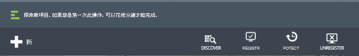

    完成程序時的通知變更。

    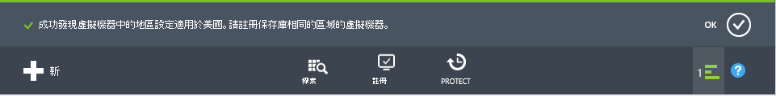

7. 按一下 [在頁面底部的 [**註冊**]。
    ![註冊] 按鈕](./media/backup-azure-vms-first-look/register-icon.png)

8. 在**登錄項目**快顯功能表中，選取您要註冊虛擬機器。

    >[AZURE.TIP] 多個虛擬機器註冊一次。

    針對您所選取的每個虛擬機器建立工作。

9. 按一下 [通知，以移至 [**工作**] 頁面中的 [**檢視工作**]。

    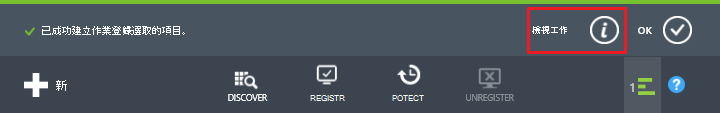

    虛擬機器也會出現在清單中，已註冊的項目，還有註冊作業的狀態。

    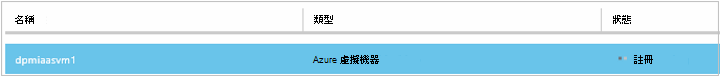

    完成作業，以反映*註冊*狀態的狀態變更。

    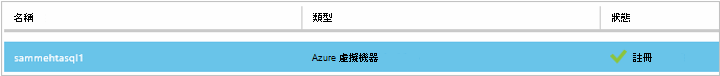

## 步驟 3-虛擬機器上安裝 VM 代理程式

Azure 虛擬機器備份延伸至工作上必須安裝 Azure VM 代理程式。 如果您 VM 建立從 Azure] 庫，VM 代理程式已經存在 VM 上。 您可以直接跳到[保護您的 Vm](backup-azure-vms-first-look.md#step-4-protect-azure-virtual-machines)。

如果您 VM 移轉從內部部署資料中心，VM 可能沒有安裝 VM 代理程式。 您必須安裝前保護 VM 虛擬機器 VM 代理程式。 安裝 VM 代理程式的詳細步驟，請參閱[VM 代理程式的備份 Vm 文件] 區段](backup-azure-vms-prepare.md#vm-agent)。

## 步驟 4-建立備份原則
備份快照觸發初始備份工作之前，可設定排程。 排程備份的快照，並的時間長度這些快照保留、 備份原則。 保留資訊根據 2 位最好-父-孩子備份旋轉配置。

1. 瀏覽至 Azure 傳統入口網站中，在 [**復原服務**] 底下備份保存庫，然後按一下 [**註冊的項目**。
2. 從下拉式功能表中選取**Azure 虛擬機器**。

    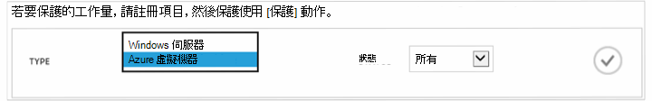

3. 按一下 [**保護**底部的頁面]。
    

    **保護項目精靈**會顯示，並列出*註冊及未受保護的虛擬機器*。

    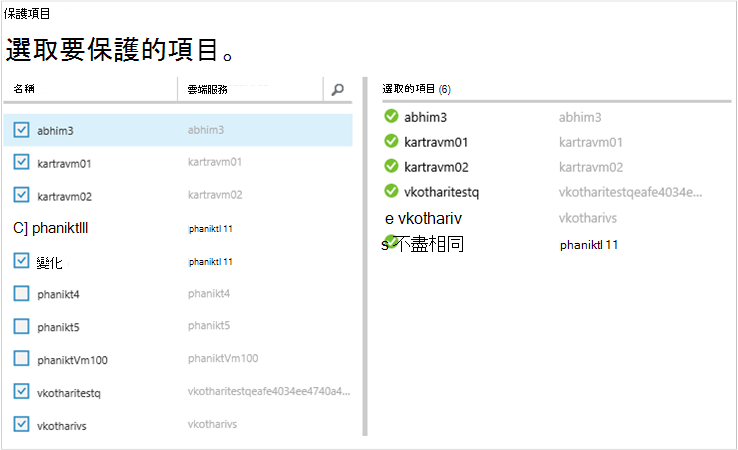

4. 選取您要保護的虛擬機器。

    如果有兩個以上的虛擬機器使用相同的名稱，請使用雲端服務來區分虛擬機器。

5. 在 [**設定保護**功能表上選取現有的原則，或建立新的原則以保護您識別虛擬機器。

    新的備份保存庫有預設的原則保存庫相關聯。 此原則會日快照每個晚上，而每日的快照，保留為 30 天。 每個備份原則可以有多個與其相關聯的虛擬機器。 不過，虛擬機器只可與相關聯原則的時間。

    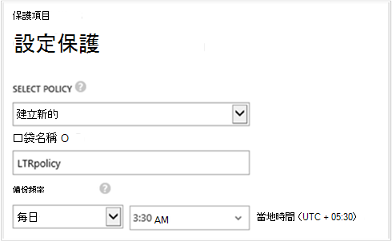

    >[AZURE.NOTE] 備份原則包含保留配置的已排程的備份。 如果您選取現有的備份原則，將無法修改下一個步驟中的 [保留] 選項。

6. **保留**範圍定義每日、 每週、 每月和年的特定的備份點。

    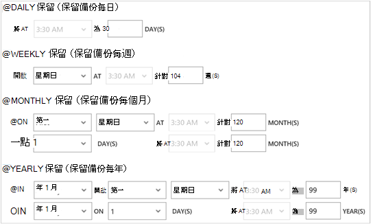

    保留原則指定儲存備份的時間長度。 您可以指定備份時間為基礎的不同的保留原則。

7. 按一下 [檢視**設定保護**的工作清單的**工作**]。

    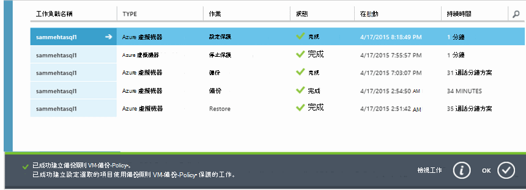

    現在，您所建立的原則，請移至下一個步驟，並執行初始的備份。

## 步驟 5-初始備份

一旦虛擬機器已經受保護的原則，您可以在**受保護的項目**] 索引標籤上檢視的關聯。 初始的備份時，直到**保護狀態**顯示為**受保護的 （擱置初始備份）**。 根據預設，第一個排程的備份是*初始備份*。

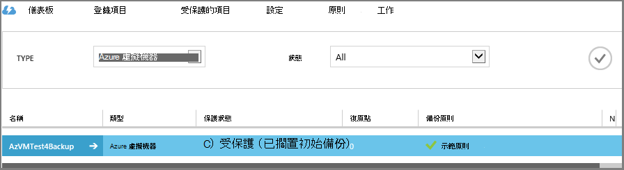

若要立即啟動初始備份︰

1. 在 [**受保護的項目**] 頁面上，按一下 [**立即備份**底部的頁面。
    

    備份 Azure 服務會建立備份工作的作業初始的備份。

2. 按一下 [**工作**] 索引標籤，若要檢視的工作清單]。

    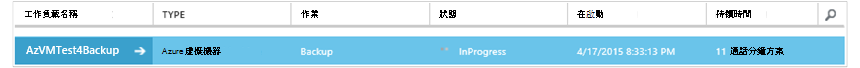

    初始備份完成後，虛擬機器中的 [**受保護的項目**] 索引標籤的狀態就會是*受保護*。

    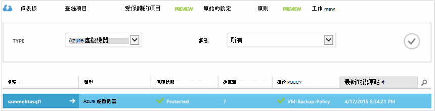

    >[AZURE.NOTE] 備份虛擬機器是本機的程序。 您無法備份虛擬機器從一個區域到另一個區域中的備份保存庫。 因此，有 Vm 要備份的每個 Azure 區域，至少有一個備份保存庫必須建立該區域。

## 後續步驟
現在，您已經順利備份 VM，有幾個可能會感興趣的後續步驟。 最符合邏輯的步驟是將自我熟悉還原 VM 資料。 然而，有可協助您瞭解如何保護您的資料安全和最小化成本管理工作。

- [管理並監控您的虛擬機器](backup-azure-manage-vms.md)
- [還原虛擬機器](backup-azure-restore-vms.md)
- [疑難排解指南](backup-azure-vms-troubleshoot.md)

## 問題嗎？
如果您有問題，或任何 」 功能，您想要包含在內，請[將意見反應傳送給我們](http://aka.ms/azurebackup_feedback)。
