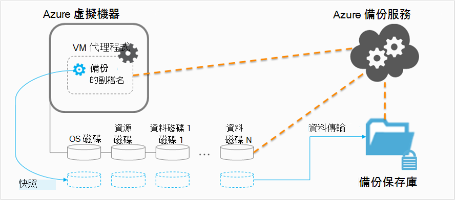

<properties
    pageTitle="規劃 VM 備份基礎結構中 Azure |Microsoft Azure"
    description="規劃備份中 Azure 虛擬機器時的重要考量"
    services="backup"
    documentationCenter=""
    authors="markgalioto"
    manager="cfreeman"
    editor=""
    keywords="備份 vm、 備份虛擬機器"/>

<tags
    ms.service="backup"
    ms.workload="storage-backup-recovery"
    ms.tgt_pltfrm="na"
    ms.devlang="na"
    ms.topic="article"
    ms.date="10/19/2016"
    ms.author="trinadhk; jimpark; markgal;"/>

# <a name="plan-your-vm-backup-infrastructure-in-azure"></a>規劃 Azure 中的您 VM 備份基礎結構
本文提供效能與資源建議，幫助您規劃 VM 備份基礎結構。 也會定義重要層面的備份服務;這些方面可能很重要，判斷您的結構，規劃和排程的容量。 如果您已[準備好您的環境](backup-azure-vms-prepare.md)，這是下一個步驟，[備份 Vm](backup-azure-vms.md)之前。 如果您需要 Azure 虛擬機器的詳細資訊，請參閱[虛擬機器文件](https://azure.microsoft.com/documentation/services/virtual-machines/)。

## <a name="how-does-azure-back-up-virtual-machines"></a>如何執行 Azure 虛擬機器備份嗎？
備份 Azure 服務起始備份工作在排程的時間，它會觸發時間點快照副檔名為備份。 此快照將一起使用大量陰影複製服務 (VSS) 以取得虛擬機器中的一致的磁碟快照，而不必將它關閉。

取得快照集後，資料轉移備份 Azure 服務至備份保存庫。 若要備份的程序更有效率，識別及傳輸上次備份後有變更的資料區塊的服務。



資料傳輸完成後，會移除快照，然後建立復原點。

### <a name="data-consistency"></a>資料的一致性
執行備份和還原的 business 重要資料更為複雜的要徑的商務資料必須備份時產生資料的應用程式。 若要解決這個問題，Azure 備份提供應用程式一致的備份 Microsoft 負載使用 VSS，以確保資料正確地寫入到儲存體。

>[AZURE.NOTE] 針對 Linux 虛擬機器檔案一致的備份的可能，因為 Linux 沒有 VSS 等平台

Azure 備份 Windows Vm （請參閱深入瞭解[VSS 完整備份](http://blogs.technet.com/b/filecab/archive/2008/05/21/what-is-the-difference-between-vss-full-backup-and-vss-copy-backup-in-windows-server-2008.aspx)） 會 VSS 完整備份。 若要啟用 VSS 複製備份，以下登錄機碼必須設定 VM 上。

```
[HKEY_LOCAL_MACHINE\SOFTWARE\MICROSOFT\BCDRAGENT]
"USEVSSCOPYBACKUP"="TRUE"
```


此表格說明的一致性類型和 Azure VM 期間底下所發生的條件備份與還原程序。

| 一致性 | VSS 型 | 說明與詳細資料 |
|-------------|-----------|---------|
| 應用程式的一致性 | [是] | 時，可確保，這是 Microsoft 工作負載的理想的一致性類型︰<ol><li> VM*開機時*。 <li>不有*任何損毀*。 <li>不有*遺失任何資料*。<li> 資料是一致應用程式會使用資料，包含在備份-使用 VSS 時的應用程式</ol> 大部分的 Microsoft 負載有 VSS 作者執行相關資料的一致性的工作量特定動作。 例如，Microsoft SQL Server 具有可確保寫入交易記錄檔和資料庫完成正確 VSS 寫入。<br><br> Azure VM 的備份，取得應用程式一致的復原點表示備份的副檔名是叫用 VSS 工作流程和*正確*完成它，才能 VM 快照。 當然，這表示有以及叫 VSS 撰寫的 Azure VM 中的所有應用程式。<br><br>瞭解[VSS 的基本概念](http://blogs.technet.com/b/josebda/archive/2007/10/10/the-basics-of-the-volume-shadow-copy-service-vss.aspx)，並深入探討的[運作方式](https://technet.microsoft.com/library/cc785914%28v=ws.10%29.aspx)的詳細資料。 |
| 檔案系統的一致性 | Yes 的 Windows 電腦 | 有兩個位置的復原點可*檔案系統一致*的情況︰<ul><li>Azure，因為 Linux 沒有 VSS 等平台中 Linux Vm 的備份<li>在 Windows Vm Azure 中的備份 VSS 失敗。</li></ul> 在這兩個這些情況下，可以完成的最佳是確認︰ <ol><li> VM*開機時*。 <li>不有*任何損毀*。<li>不有*遺失任何資料*。</ol> 應用程式需要實作自己 「 修正 」 機制上還原的資料。|
| 當機一致性 | 無 | 這種情況相當於虛擬機器發生 「 當機 」 （透過 [柔邊或重設）。 這通常是因為 Azure 虛擬機器關閉時的備份。 Azure 虛擬機器備份，取得當機一致的復原點所代表的意義 Azure 備份提供資料的一致性周圍任何保證儲存媒體-從檢視方塊的作業系統或應用程式的觀點來看。 只有已有磁碟時間的資料是備份的什麼取得擷取及備份。 <br/> <br/> 雖然不保證，大多數情況下，將開機作業系統。 這通常被後面的磁碟檢查的程序，例如 chkdsk，若要修正任何損毀的錯誤。 任何記憶體內的資料或不已經完全清除磁碟的寫入將會遺失。 以避免資料復原需要完成通常是使用自己的驗證機制追蹤應用程式。 <br><br>作為範例，如果交易記錄有未出現在資料庫中的項目，然後資料庫軟體會復原直到的資料是一致。 當資料橫跨多個的虛擬磁碟 （例如跨距磁碟區） 時，當機一致的復原點會提供資料的正確性不提供任何保證。|


## <a name="performance-and-resource-utilization"></a>效能和資源使用量
內部部署的備份軟體，例如您應該規劃容量和資源使用量需求時備份 Vm Azure 中。 [Azure 儲存空間限制](azure-subscription-service-limits.md#storage-limits)定義如何結構 VM 部署，以取得的最小的影響，若要執行的工作負載的最大效能。

請注意下列 Azure 儲存空間限制規劃備份效能時︰

- 每個儲存帳戶的最大值出口
- 每個儲存帳戶的總要求率

### <a name="storage-account-limits"></a>儲存帳戶限制
隨時備份資料會儲存帳戶複製，它會計算每個第二個 (IOPS) 和出口 （或處理量） 的輸入輸出作業向指標的儲存空間帳戶。 同時，虛擬機器執行而分成 IOPS 和處理量。 目標是要確保總流量備份和虛擬機器-不超過儲存帳戶限制。

### <a name="number-of-disks"></a>磁碟數目
盡快完成備份工作嘗試備份的程序。 如此一來，它會耗費它可以的資源。 但是，所有 I/O 作業都是有限*的單一 Blob 的目標處理量*，其中有秒 60 MB 的限制。 最大化其速度次嘗試時，在備份程序會嘗試每個 VM 的磁碟*平行*備份。 因此，如果 VM 有四個磁碟，然後 Azure 備份嘗試備份平行所有四個磁碟。 因此，最重要的因素決定結束客戶儲存帳戶的備份資料傳輸**磁碟數目**正在備份從儲存的帳戶。

### <a name="backup-schedule"></a>備份排程
其他因素的影響效能是**備份排程**。 您可以設定原則，同時備份所有 Vm，如果您已排定流量夾。 備份的程序會嘗試備份所有磁碟平行。 若要降低儲存帳戶的備份資料傳輸的其中一個方法是-確保不同 Vm 備份是在不同時間的情況下，天不致重疊。

## <a name="capacity-planning"></a>容量計劃
將所有這些因素放在一起，表示儲存帳戶使用量需要正確計劃。 下載[VM 備份容量規劃 Excel 試算表](https://gallery.technet.microsoft.com/Azure-Backup-Storage-a46d7e33)看到的磁碟和備份的排程選項的影響。

### <a name="backup-throughput"></a>備份處理量
每個磁碟備份，Azure 備份讀取磁碟上的區塊並儲存只變更的資料 （累加備份）。 下表顯示平均處理量值，您可以預期從 Azure 備份。 您可以使用這種情況，來估計備份大小的磁碟花費的時間的量。

| 備份作業 | 最佳狀況處理量 |
| ---------------- | ---------- |
| 初始的備份 | 160 Mbps |
| 遞增備份 (DR) | 640 Mbps <br><br> 如果有很多分散變換需要備份磁碟上時，可以大幅放此處理量。 |

## <a name="total-vm-backup-time"></a>總 VM 備份時間
大部分的備份時所花的讀取和複製資料，而有其他參與備份所需的總時間的作業︰

- [安裝](backup-azure-vms.md#offline-vms)或更新的備份的副檔名所需的時間。
- 快照時間，也就是觸發快照所花的時間。 快照被觸發靠近排定的備份時間。
- 佇列中等待的時間。 備份服務處理多個客戶的備份，因為備份資料複製到備份或修復服務保存庫快照可能無法啟動立即。 在最大使用量載入，等待可以延伸 8 小時，因為正在處理的備份的數量。 不過，總 VM 備份時間會小於 24 小時的每日備份原則。

## <a name="best-practices"></a>最佳作法
建議追蹤這些設定的虛擬機器備份時的做法︰

- 不要排程四個以上的傳統 Vm 相同的雲端服務，同時備份。 建議交錯備份的開始時間安排一小時，如果您想要從同一個雲端服務備份多個 Vm。
- 不要排程超過 40 資源管理員部署 Vm 同時備份。
- 峰時段排程 VM 備份，因此備份服務使用 IOPS 客戶儲存帳戶傳送資料至備份或修復服務地窖。
- 請確定原則地址 Vm 分散到不同的儲存帳戶。 建議不超過 20 從單一儲存帳戶的總磁碟受保護的原則。 如果您有大於 20 磁碟儲存帳戶，這些 Vm 橫跨多個原則，以取得所需的 IOPS 階段期間，傳送備份的程序。
- 無法還原 VM 在上執行進階版儲存到相同的儲存空間帳戶。 如果還原作業程序相合備份操作，它會減少備份，可以使用 IOPS。
- 我們建議您執行每個進階版 VM 在不同的進階版的儲存空間帳戶以確保最佳備份的效能。

## <a name="data-encryption"></a>資料加密

Azure 備份不會加密資料備份程序的一部分。 不過，您可以在 [加密的 VM 內的資料，並流暢地備份受保護的資料 （請參閱深入瞭解[加密資料的備份](backup-azure-vms-encryption.md)）。


## <a name="how-are-protected-instances-calculated"></a>如何計算受保護的執行個體？
透過 Azure 備份備份的 azure 虛擬機器有恕[Azure 備份價格](https://azure.microsoft.com/pricing/details/backup/)。 受保護的執行個體計算為基礎的虛擬機器，也就是虛擬機器-不包含 「 資源磁碟 」 中的所有資料的總和*實際*大小。

您是*不*計費依據附加至虛擬機器中，每個資料磁碟支援的最大，而儲存資料中的實際資料。 同樣地，備份的儲存空間帳單根據儲存與 Azure 備份，也就是每個復原點實際資料的總和的資料量。

例如，需要 A2 標準大小的虛擬機器有 1 tb 的最大的兩個額外的資料磁碟。 下表提供每個這些磁碟上儲存的實際資料︰

|磁碟類型|最大值|簡報的實際資料|
|---------|--------|------|
| 作業系統磁碟 | 1023 GB | 17 GB |
| 本機磁碟 / 資源磁碟 | 135 GB | 5 GB （不含備份） |
| 資料磁碟 1 | 1023 GB | 30 GB |
| 資料磁碟 2 | 1023 GB | 0 GB |

虛擬機器的*實際*大小在此情況下是 17 GB + 30 GB + 0 GB = 47 GB。 這會變成 [受保護的執行個體大小為基礎的每月的帳單。 當的虛擬機器中的資料量規模擴大時，受保護的執行個體所用的大小的計費也會隨之變更。

計費就無法啟動，直到已完成的第一個成功的備份。 此時，就會開始儲存空間] 及 [受保護的執行個體帳單。 計費繼續，只要虛擬機器的*任何儲存在 Azure 備份的備份資料*。 執行 [停止保護] 作業會停止計費如果備份資料會保留下來。

針對指定的虛擬機器計費會停用，僅保護時停止*並*不會刪除任何備份資料。 沒有作用中的備份工作 （時已停止保護） 時，一次的最後一次成功備份的虛擬機器大小會變成受保護的執行個體大小為基礎的每月的帳單。

## <a name="questions"></a>問題嗎？
如果您有問題，或任何 」 功能，您想要包含在內，請[將意見反應傳送給我們](http://aka.ms/azurebackup_feedback)。

## <a name="next-steps"></a>後續步驟

- [備份虛擬機器](backup-azure-vms.md)
- [管理虛擬機器備份](backup-azure-manage-vms.md)
- [還原虛擬機器](backup-azure-restore-vms.md)
- [VM 備份問題進行疑難排解](backup-azure-vms-troubleshoot.md)
