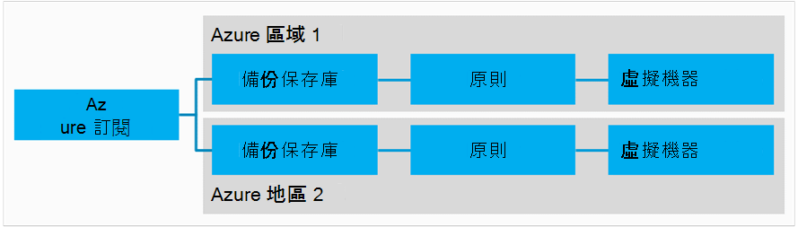
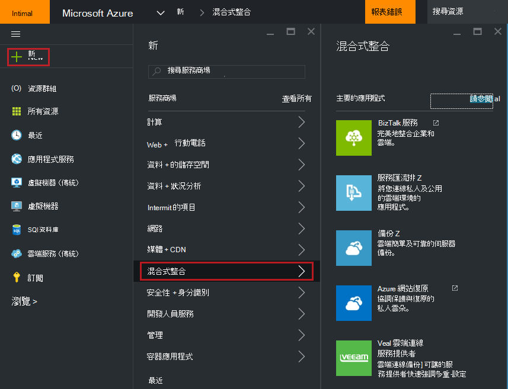
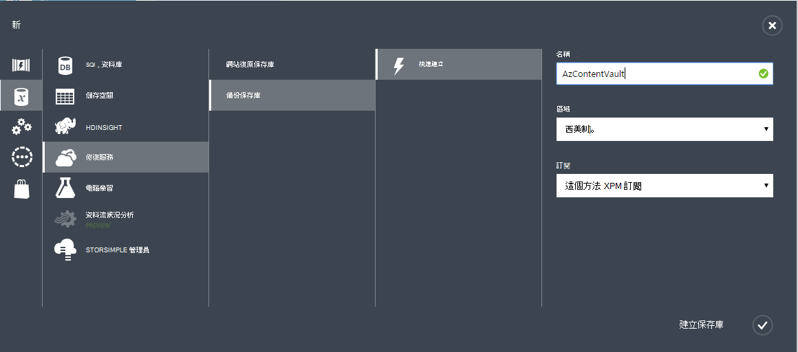
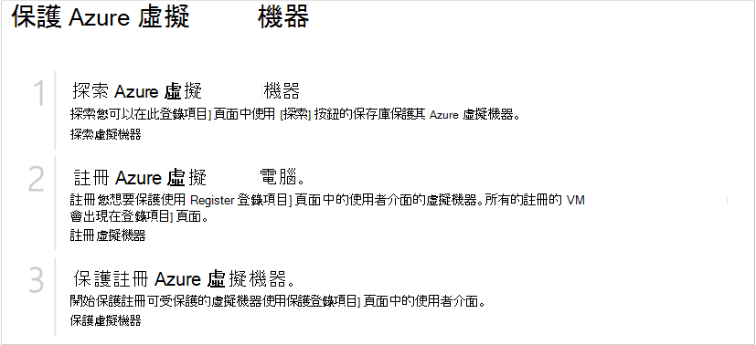
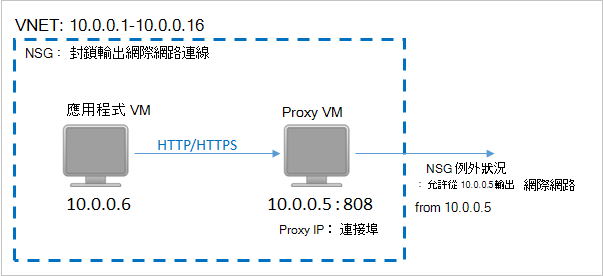
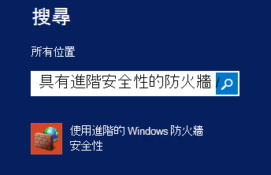
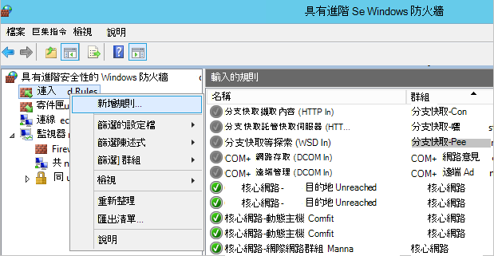
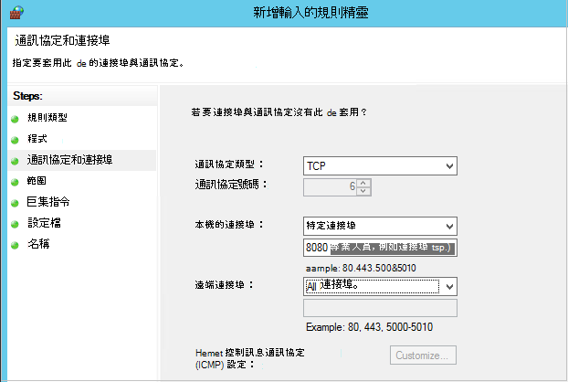

<properties
    pageTitle="準備您的環境備份 Azure 虛擬機器 |Microsoft Azure"
    description="請確定您的環境準備備份中 Azure 虛擬機器"
    services="backup"
    documentationCenter=""
    authors="markgalioto"
    manager="cfreeman"
    editor=""
    keywords="備份。備份。"/>

<tags
    ms.service="backup"
    ms.workload="storage-backup-recovery"
    ms.tgt_pltfrm="na"
    ms.devlang="na"
    ms.topic="article"
    ms.date="08/26/2016"
    ms.author="trinadhk; jimpark; markgal;"/>


# <a name="prepare-your-environment-to-back-up-azure-virtual-machines"></a>若要備份 Azure 虛擬機器環境準備作業

> [AZURE.SELECTOR]
- [資源管理員模型](backup-azure-arm-vms-prepare.md)
- [傳統的模型](backup-azure-vms-prepare.md)

您可以備份 Azure 虛擬機器 (VM) 之前，有必須要有的三個條件。

- 您需要建立備份保存庫或現有備份保存庫識別*您 VM 為相同的區域*。
- 建立 Azure 公用網際網路地址和 Azure 儲存體結束點之間的網路連線。
- 安裝 VM 代理程式 VM 上。

如果您知道您的環境中已經存在的下列條件然後繼續進行[備份您的 Vm 文章](backup-azure-vms.md)。 否則，請閱讀，本文會引導您完成步驟，以備份 Azure VM 環境準備作業。


## <a name="limitations-when-backing-up-and-restoring-a-vm"></a>當備份和還原 VM 時的限制

>[AZURE.NOTE] Azure 有兩種部署模型建立及使用的資源︰[資源管理員] 及 [傳統](../resource-manager-deployment-model.md)。 傳統的模型中部署時，下列清單提供限制。

- 不支援備份與多個 16 資料磁碟的虛擬機器。
- 不支援備份虛擬機器保留的 IP 位址與任何已定義的端點。
- 備份資料並不包含附加至 VM 裝載的網路磁碟機。 
- 不支援取代現有的虛擬機器期間還原。 第一次刪除現有的虛擬機器及任何相關聯的磁碟，然後從備份還原資料。
- 不支援跨地區備份與還原。
- 使用 Azure 備份服務備份虛擬機器中所有公用 Azure 區域支援 （請參閱支援的區域的[檢查清單](https://azure.microsoft.com/regions/#services)）。 如果您正在尋找的地區今天是不受支援，它不會出現在下拉式清單中保存庫建立期間。
- 使用 Azure 備份服務備份虛擬機器僅適用於選取作業系統版本支援的方案︰
  - **Linux**: Azure 備份支援核心 OS Linux 以外[的由 Azure 背書的散佈的清單](../virtual-machines/virtual-machines-linux-endorsed-distros.md)。 其他提到-您-擁有-Linux 散佈也可能會運作，只要 VM 代理程式才會提供虛擬機器及支援] Python 存在。
  - **Windows Server**︰ 不支援的版本早於 Windows Server 2008 R2。
- 還原網域控制站僅透過 PowerShell 支援的多重 DC 設定 (DC) VM。 了解更多關於[還原多重 DC 網域控制站](backup-azure-restore-vms.md#restoring-domain-controller-vms)的資訊。
- 還原有下列特殊的網路設定的虛擬機器功能僅限透過 PowerShell 受支援。 還原作業完成後，您建立使用者介面中使用還原工作流程的 Vm 不會有這些網路設定。 若要深入瞭解，請參閱[還原 Vm，用於特殊網路設定](backup-azure-restore-vms.md#restoring-vms-with-special-netwrok-configurations)。
    - 負載平衡器設定 （內部和外部）] 底下的虛擬機器
    - 具有多個保留的 IP 位址的虛擬機器
    - 具有多個網路介面卡的虛擬機器

## <a name="create-a-backup-vault-for-a-vm"></a>建立備份保存庫 vm

備份保存庫是會儲存備份及復原點已建立一段時間的實體。 備份保存庫也包含將會套用至所要備份的虛擬機器的備份原則。

此圖像顯示各種 Azure 備份實體之間的關聯性︰     

若要建立備份保存庫︰

1. [Azure 入口網站](http://manage.windowsazure.com/)登入。

2. Azure 入口網站中按一下 [**新增** > **混合式整合** > **備份**。 當您按一下**備份**時，您會自動切換到傳統入口網站 （請注意後顯示）。

    

    >[AZURE.NOTE] 如果您的訂閱上次使用傳統入口網站中，您的訂閱可能會開啟 [傳統] 入口網站中。 在此情況下，若要建立備份保存庫，按一下 [**新增** > **資料服務** > **修復服務** > **備份保存庫** > **快速建立**（請參閱下方圖像）。

    

3. [**名稱**] 中，輸入好記的名稱來識別保存庫。 名稱必須是唯一的 Azure 訂閱。 輸入包含 2 到 50 個字元之間的名稱。 它必須以字母，以開始，並可以包含字母、 數字和連字號。

4. 在 [**地區**中，選取 [保存庫的地理區域。 保存庫必須是為您想要保護的虛擬機器相同的區域。 如果您有虛擬機器中多個區域時，您必須建立備份保存庫中每個區域。 有不需要指定儲存備份資料-備份保存庫和 Azure 備份服務控點的儲存空間帳戶此自動。

5. 在**訂閱**中選取您想要備份的保存庫與建立關聯。 會有多個選項只有您的組織帳戶是 Azure 的多個訂閱相關聯。

6. 按一下 [**建立保存庫**。 需要時建立備份保存庫。 監控狀態通知，底部的入口網站。

    

7. 訊息會確認保存庫已成功建立。 它會列在 [**復原服務**] 頁面上為**使用中**。 請確定建立保存庫之後，請選擇適當的儲存空間重複選項右側。 了解更多關於[設定備份保存庫中的 [儲存] 重複選項](backup-configure-vault.md#azure-backup---storage-redundancy-options)的資訊。

    

8. 按一下 [備份保存庫，以移至 [**快速入門**] 頁面上，如下的備份 Azure 虛擬機器中的指示進行。

    


## <a name="network-connectivity"></a>網路連線

如要管理 VM 快照，副檔名為備份需要連線至 Azure 的公用 IP 位址。 不正確的網際網路連線，虛擬機器的 HTTP 要求逾時，[備份] 作業會失敗。 如果您的部署有限制存取 （透過網路安全性群組 (NSG)，例如） 的位置，然後選擇其中一個選項，提供清除路徑的備份資料傳輸︰

- [Whitelist Azure 資料中心 IP 範圍](http://www.microsoft.com/en-us/download/details.aspx?id=41653)-請參閱如何 whitelist IP 位址範圍上的指示。
- 部署 HTTP proxy 伺服器路由流量。

決定要使用哪一個選項時, 折衷方案是管理、 細緻的控制項，與成本之間。

|選項|優點|缺點|
|------|----------|-------------|
|Whitelist IP 範圍| 沒有其他成本。<br><br>在 NSG 中開啟 access，使用 [<i>設定 AzureNetworkSecurityRule</i>指令程式。 | 若要為受影響管理複雜的 IP 範圍變更一段時間。<br><br>提供存取整個 Azure，而不只是的儲存空間。|
|HTTP proxy]| 微調控制 proxy 中允許的儲存空間 Url。<br>單一 Vm 點的網際網路存取。<br>不需 Azure IP 位址變更。| 使用本軟體 proxy 執行 VM 的其他成本。|

### <a name="whitelist-the-azure-datacenter-ip-ranges"></a>Whitelist Azure 資料中心 IP 範圍

以 whitelist Azure 資料中心的 IP 範圍，請參閱[Azure 網站](http://www.microsoft.com/en-us/download/details.aspx?id=41653)以取得詳細資料的 IP 範圍及指示。

### <a name="using-an-http-proxy-for-vm-backups"></a>使用 [HTTP proxy 的 VM 備份
當備份 VM，VM 上備份的分機號碼會傳送快照管理命令至 Azure 儲存體使用 HTTPS API。 將透過 HTTP proxy 備份副檔名流量路由傳送因為它是唯一的元件公用網際網路存取的設定。

>[AZURE.NOTE] 有不應使用 proxy 軟體的建議。 請確定您挑選 proxy 相容於下列設定步驟。

範例下圖顯示三個設定步驟需要使用 HTTP proxy]:

- 應用程式 VM 路由公用網際網路 Proxy VM 透過繫結的所有 HTTP 流量。
- Proxy VM 允許從 Vm 虛擬網路中的連入流量。
- 網路安全性群組 (NSG) 命名 NSF 鎖定必須安全性規則允許的輸出網際網路流量 Proxy VM。



若要使用 [HTTP proxy] 進行公用網際網路通訊，請遵循下列步驟︰

#### <a name="step-1-configure-outgoing-network-connections"></a>步驟 1。 設定外寄的網路連線
###### <a name="for-windows-machines"></a>在 Windows 電腦
這會設定為本機系統帳戶的 proxy 伺服器設定。

1. 下載[PsExec](https://technet.microsoft.com/sysinternals/bb897553)
2. 提高權限的提示時，執行下列動作] 命令

     ```
     psexec -i -s "c:\Program Files\Internet Explorer\iexplore.exe"
     ```
     隨即會開啟 internet explorer 視窗。
3. 移至 [工具]-> [網際網路選項]-> [連線]-> [區域網路設定]。
4. 檢查系統帳戶的 proxy 設定。 設定 Proxy IP 和連接埠。
5. 關閉 Internet Explorer。

這會設定整個電腦的 proxy 設定，並將會用於任何外寄的 HTTP/HTTPS 流量。

如果您有設定 proxy 伺服器上目前的使用者帳戶 （不本機系統帳戶），請使用下列指令碼套用到 SYSTEMACCOUNT:

```
   $obj = Get-ItemProperty -Path Registry::”HKEY_CURRENT_USER\Software\Microsoft\Windows\CurrentVersion\Internet Settings\Connections"
   Set-ItemProperty -Path Registry::”HKEY_USERS\S-1-5-18\Software\Microsoft\Windows\CurrentVersion\Internet Settings\Connections" -Name DefaultConnectionSettings -Value $obj.DefaultConnectionSettings
   Set-ItemProperty -Path Registry::”HKEY_USERS\S-1-5-18\Software\Microsoft\Windows\CurrentVersion\Internet Settings\Connections" -Name SavedLegacySettings -Value $obj.SavedLegacySettings
   $obj = Get-ItemProperty -Path Registry::”HKEY_CURRENT_USER\Software\Microsoft\Windows\CurrentVersion\Internet Settings"
   Set-ItemProperty -Path Registry::”HKEY_USERS\S-1-5-18\Software\Microsoft\Windows\CurrentVersion\Internet Settings" -Name ProxyEnable -Value $obj.ProxyEnable
   Set-ItemProperty -Path Registry::”HKEY_USERS\S-1-5-18\Software\Microsoft\Windows\CurrentVersion\Internet Settings" -Name Proxyserver -Value $obj.Proxyserver
```

>[AZURE.NOTE] 如果您在 proxy 伺服器記錄檔中查看 」 (為 407) Proxy 需要驗證]，請核取您 authrntication 已正確設定。

######<a name="for-linux-machines"></a>Linux 電腦

新增至下行```/etc/environment```檔案︰

```
http_proxy=http://<proxy IP>:<proxy port>
```

新增下列幾行，```/etc/waagent.conf```檔案︰

```
HttpProxy.Host=<proxy IP>
HttpProxy.Port=<proxy port>
```

#### <a name="step-2-allow-incoming-connections-on-the-proxy-server"></a>步驟 2。 允許在 proxy 伺服器上的連入連線︰

1. 在 proxy 伺服器上，開啟 [Windows 防火牆。 若要存取防火牆最簡單的方法是搜尋具有進階安全性的 Windows 防火牆。

    

2. 在 [Windows 防火牆] 對話方塊中，以滑鼠右鍵按一下 [**輸入規則**，按一下 [**新增規則]**。

    

3. 在**新增輸入規則精靈**]，選擇 [**自訂**] 選項的**規則類型**，按一下 [**下一步**。

4. 在選取的**程式**頁面上，選擇 [**所有程式**]，然後按一下 [**下一步**。

5. 在 [**通訊協定和連接埠**] 頁面上輸入下列資訊，然後按一下 [**下一步**︰

    

    - *通訊協定類型*選擇 [ *TCP*
    - *本機*的連接埠選擇*特定的連接埠*、 下列欄位中指定```<Proxy Port>```設定。
    - *遠端*連接埠選取*所有連接埠*

    精靈的其餘部分中，按一下 [傳送到結尾，然後為這個規則命名。

#### <a name="step-3-add-an-exception-rule-to-the-nsg"></a>步驟 3。 加入 NSG 例外狀況規則︰

在 PowerShell 的 Azure 命令提示字元中，輸入下列命令︰

下列命令會將 NSG 例外狀況。 此例外狀況 」 可讓 TCP 連接埠 80 (HTTP) 或 (HTTPS) 443 任何網際網路位址從 10.0.0.5 上任何連接埠流量導向。 如果您需要特定的連接埠公用 internet，請務必新增到該連接埠```-DestinationPortRange```以及。

```
Get-AzureNetworkSecurityGroup -Name "NSG-lockdown" |
Set-AzureNetworkSecurityRule -Name "allow-proxy " -Action Allow -Protocol TCP -Type Outbound -Priority 200 -SourceAddressPrefix "10.0.0.5/32" -SourcePortRange "*" -DestinationAddressPrefix Internet -DestinationPortRange "80-443"
```

*請確定在此範例中的名稱取代適用於部署的詳細資料。*


## <a name="vm-agent"></a>VM 代理程式

您可以備份 Azure 虛擬機器之前，您應該確認虛擬機器上正確安裝 Azure VM 代理程式。 由於 VM 代理程式時，會建立虛擬機器選用元件，確保之前虛擬機器也會佈建後，已選取 [VM 代理程式的核取方塊。

### <a name="manual-installation-and-update"></a>手動安裝和更新

VM 代理程式中已經有從 Azure] 庫中建立的 Vm。 不過，從內部部署資料中心移轉的虛擬機器沒有安裝 VM 代理程式。 這類 Vm VM 代理程式需要明確安裝。 進一步瞭解[安裝在現有的 VM VM 代理程式](http://blogs.msdn.com/b/mast/archive/2014/04/08/install-the-vm-agent-on-an-existing-azure-vm.aspx)。

| **作業** | **Windows** | **Linux** |
| --- | --- | --- |
| 安裝 VM 代理程式 | <li>下載並安裝[代理程式 MSI](http://go.microsoft.com/fwlink/?LinkID=394789&clcid=0x409)。 您將需要系統管理員權限，以完成安裝。 <li>[更新 VM 屬性](http://blogs.msdn.com/b/mast/archive/2014/04/08/install-the-vm-agent-on-an-existing-azure-vm.aspx)，表示代理程式已安裝。 | <li> 從 GitHub 安裝最新的[Linux 代理程式](https://github.com/Azure/WALinuxAgent)。 您將需要系統管理員權限，以完成安裝。 <li> [更新 VM 屬性](http://blogs.msdn.com/b/mast/archive/2014/04/08/install-the-vm-agent-on-an-existing-azure-vm.aspx)，表示代理程式已安裝。 |
| 更新 VM 代理程式 | 更新 VM 代理程式是非常簡單，重新安裝[VM 代理程式的二進位檔案](http://go.microsoft.com/fwlink/?LinkID=394789&clcid=0x409)。 <br><br>請確定沒有任何備份作業正在執行更新 VM 代理程式時。 | 依照上[更新 Linux VM 代理程式](../virtual-machines-linux-update-agent.md)的指示。 <br><br>請確定沒有任何備份作業正在執行更新 VM 代理程式時。 |
| 驗證 VM 代理程式的安裝 | <li>瀏覽至 Azure VM 中的 [ *C:\WindowsAzure\Packages* ] 資料夾。 <li>您應該找到簡報 WaAppAgent.exe 檔案。<li> 以滑鼠右鍵按一下檔案，移至 [**屬性**]，然後選取 [**詳細資料**] 索引標籤。 產品版本] 欄位應與 2.6.1198.718 或更新版本。 | N/A |


進一步瞭解[VM 代理程式](https://go.microsoft.com/fwLink/?LinkID=390493&clcid=0x409)，[如何將其安裝](https://azure.microsoft.com/blog/2014/04/15/vm-agent-and-extensions-part-2/)。

### <a name="backup-extension"></a>備份的副檔名

若要備份的虛擬機器，Azure 備份服務中安裝 VM 代理程式副檔名。 備份 Azure 服務升級和修補程式不會其他使用者互動副檔名為備份。

如果在執行 VM，安裝副檔名為備份。 執行 VM 也會提供開始應用程式一致的復原點的最大的機率。 不過，服務會繼續備份 VM，即使即表示已經關閉，而且找不到副檔名為 Azure 備份安裝 (又稱離線 VM)。 在此情況下，復原點會*當機一致*上方所述。


## <a name="questions"></a>問題嗎？
如果您有問題，或任何 」 功能，您想要包含在內，請[將意見反應傳送給我們](http://aka.ms/azurebackup_feedback)。

## <a name="next-steps"></a>後續步驟
現在您已準備好您的環境的備份您的 VM，您下一步就是建立備份。 規劃文章提供備份 Vm 的詳細的資訊。

- [備份虛擬機器](backup-azure-vms.md)
- [規劃您 VM 備份基礎結構](backup-azure-vms-introduction.md)
- [管理虛擬機器中的備份](backup-azure-manage-vms.md)
