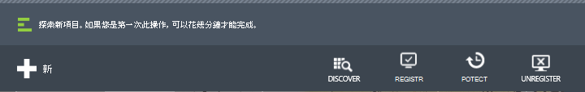
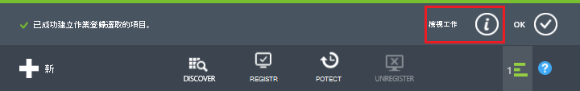
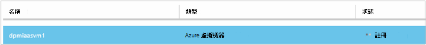
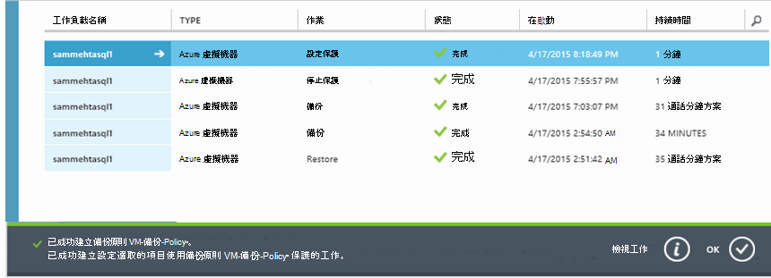

<properties
    pageTitle="備份 Azure 虛擬機器 |Microsoft Azure"
    description="探索、 登錄，和備份您的虛擬機器 Azure 虛擬機器備份這些程序使用。"
    services="backup"
    documentationCenter=""
    authors="markgalioto"
    manager="jwhit"
    editor=""
    keywords="虛擬機器備份。備份虛擬機器。備份與損毀的復原;vm 備份"/>

<tags
    ms.service="backup"
    ms.workload="storage-backup-recovery"
    ms.tgt_pltfrm="na"
    ms.devlang="na"
    ms.topic="article"
    ms.date="09/28/2016"
    ms.author="trinadhk; jimpark; markgal;"/>

# 備份 Azure 虛擬機器

> [AZURE.SELECTOR]
- [備份 Vm 修復服務保存庫](backup-azure-arm-vms.md)
- [備份 Vm 備份保存庫](backup-azure-vms.md)

本文提供的程序來備份保存庫備份傳統部署 Azure 虛擬機器 (VM)。 有幾個必須注意您可以備份 Azure 虛擬機器之前的工作。 如果您尚未這麼做，完成的[先決條件](backup-azure-vms-prepare.md)備份您的 Vm 的環境準備作業。

如需詳細資訊，請參閱[規劃 VM 備份基礎結構中 Azure](backup-azure-vms-introduction.md)和[Azure 虛擬機器](https://azure.microsoft.com/documentation/services/virtual-machines/)上的文章。

>[AZURE.NOTE] Azure 有兩種部署模型建立及使用的資源︰[資源管理員] 及 [傳統](../resource-manager-deployment-model.md)。 備份保存庫只可以保護傳統部署 Vm。 您無法保護備份保存庫使用的資源管理員部署 Vm。 如需使用修復服務保存庫詳細資訊，請參閱[備份 Vm 與修復服務保存庫](backup-azure-arm-vms.md)。

備份 Azure 虛擬機器包含三個主要步驟︰

>[AZURE.NOTE] 備份虛擬機器是本機的程序。 您無法備份到另一個區域中的備份保存庫的一個區域中的虛擬機器。 因此，您必須在每個 Azure 區域中，建立備份保存庫有要備份的 Vm。

## 步驟 1-探索 Azure 虛擬機器
若要確保任何是新的虛擬機器 (Vm) 新增至訂閱識別之前註冊，請執行探索程序。 雲端服務名稱和地區，例如處理程序查詢 Azure 虛擬機器中的訂閱，以及其他資訊的清單。

1. 登入[傳統入口網站](http://manage.windowsazure.com/)

2. 在 Azure 服務的清單中，按一下 [開啟備份與還原網站保存庫的清單的**修復服務**]。
    

3. 在備份保存庫清單中，選取要備份保存庫。

    如果這是新的保存庫入口網站會開啟至 [**快速入門**] 頁面。

    ![開啟已註冊的項目] 功能表](./media/backup-azure-vms/vault-quick-start.png)

    如果先前已設定保存庫，您最近用過的功能表會開啟並入口網站。

4. 從保存庫功能表 （頂端的頁面） 中，按一下 [**登錄項目**]。

    ![開啟已註冊的項目] 功能表](./media/backup-azure-vms/vault-menu.png)

5. 從 [**類型**] 功能表中，選取 [ **Azure 虛擬機器**]。

    

6. 按一下 [**探索**] 頁面的底部。
    ![探索] 按鈕](./media/backup-azure-vms/discover-button-only.png)

    探索程序虛擬機器會被即形成表格時，可能需要幾分鐘的時間。 有可讓您知道程序正在執行畫面底部的通知。

    

    完成程序時的通知變更。 如果探索程序找不到虛擬機器，必須先確定 Vm 存在。 如果 Vm 存在，請確定 Vm 備份保存庫為相同的區域。 如果 Vm 存在，而且是在同一個區域中，確保 Vm 不已經註冊要備份的保存庫。 如果 VM 指派給皆已指派給其他備份保存庫的備份保存庫。

    

    一旦您有探索新的項目，請移至步驟 2，並註冊您的 Vm。

##  步驟 2-Register Azure 虛擬機器
您註冊 Azure 虛擬機器與 Azure 備份服務。 這通常是一次的活動。

1. 瀏覽至 Azure 入口網站中，在 [**復原服務**] 底下備份保存庫，然後按一下 [**註冊的項目**。

2. 從下拉式功能表中選取**Azure 虛擬機器**。

    

3. 按一下 [在頁面底部的 [**註冊**]。
    ![註冊] 按鈕](./media/backup-azure-vms/register-button-only.png)

4. 在**登錄項目**快顯功能表中，選取您要註冊虛擬機器。 如果有兩個以上的虛擬機器使用相同的名稱，請使用雲端服務，以便區分。

    >[AZURE.TIP] 多個虛擬機器註冊一次。

    針對您所選取的每個虛擬機器建立工作。

5. 按一下 [通知，以移至 [**工作**] 頁面中的 [**檢視工作**]。

    

    虛擬機器也會出現在清單中，已註冊的項目，還有註冊作業的狀態。

    

    完成作業，以反映*註冊*狀態的狀態變更。

    

## 步驟 3-保護 Azure 虛擬機器
現在您可以設定虛擬機器備份和保留原則。 多個虛擬機器可以使用單一受保護的動作。

Azure 2015 隨附後所建立的備份保存庫保存庫內建的預設原則。 此預設的原則隨附的 30 天的時間，一次每天備份排程預設保留。

1. 瀏覽至 Azure 入口網站中，在 [**復原服務**] 底下備份保存庫，然後按一下 [**註冊的項目**。
2. 從下拉式功能表中選取**Azure 虛擬機器**。

    

3. 按一下 [**保護**底部的頁面]。

    **保護項目精靈 」**隨即出現。 精靈只會列出是在哪裡註冊及未受保護的虛擬機器。 選取您要保護的虛擬機器。

    如果有兩個以上的虛擬機器使用相同的名稱，請使用雲端服務來區分虛擬機器。

    >[AZURE.TIP] 您可以一次保護多個虛擬機器。

    

4. 備份您所選取的虛擬機器中選擇 [**備份排程**]。 您可以選擇 [從現有的集合的原則，或定義新的項目。

    每個備份原則可以有多個與其相關聯的虛擬機器。 不過，虛擬機器只可與相關聯原則任一特定點時間。

    

    >[AZURE.NOTE] 備份原則包含保留配置的已排程的備份。 如果您選取現有的備份原則，您無法修改下一個步驟中的 [保留] 選項。

5. 選擇 [**保留範圍**備份與關聯]。

    

    保留原則指定儲存備份的時間長度。 您可以指定備份時間為基礎的不同的保留原則。 例如，備份點每天採取 （即為操作復原點），可能會保留 90 天。 比較，在備份點 （用於稽核） 每一季結尾採取可能需要保留多個月或年數。

    

    在此範例圖像︰

    - **每日的保留原則**︰ 備份每天儲存 30 天。
    - **每週的保留原則**︰ 備份星期日每週會保留為 104 的週。
    - **每月的保留原則**︰ 在每個月的最後一個星期日上所做的備份會保留 120 月。
    - **每年的保留原則**︰ 99 幾年的保留在每年 1 月的第一個星期日上所做的備份。

    設定保護原則，並建立關聯的原則，針對您所選取的每個虛擬機器虛擬機器建立工作。

6. 若要檢視清單**設定保護**的工作，從保存庫] 功能表中，按一下 [**工作**，然後從 [**作業**] 篩選中選取 [**設定保護**。

    

## 初始的備份
一旦虛擬機器受保護的原則，就會顯示在*受保護的 （擱置初始備份）*的狀態的 [**受保護的項目**] 索引標籤下。 根據預設，第一個排程的備份是*初始備份*。

初始設定保護之後，立即備份觸發程序︰

1. 在 [**受保護的項目**] 頁面的底部，按一下 [**立即備份**]。

    備份 Azure 服務會建立備份工作的作業初始的備份。

2. 按一下 [**工作**] 索引標籤，若要檢視的工作清單]。

    

>[AZURE.NOTE] 備份操作時，備份 Azure 服務會清除寫入的所有工作，並為一致的快照每個虛擬機器中的備份延伸問題命令。

完成初始備份之後，在 [**受保護的項目**] 索引標籤中的虛擬機器的狀態是 [*受保護*。

## 檢視備份狀態和詳細資料
受到保護，一旦虛擬機器計數也會增加**儀表板**頁面摘要中。 **儀表板**頁面也會顯示來自過去 24 小時*成功*、*失敗*，並在*進行*中工作的數目。 在 [**工作**] 頁面中，使用 [**狀態**]、 [**作業**或 [**從**] 與 [**到**] 功能表來篩選工作。

![在儀表板] 頁面上的備份的狀態](./media/backup-azure-vms/dashboard-protectedvms.png)

在儀表板中的值會重新整理一次每 24 小時。

## 疑難排解錯誤
如果您設定您的虛擬機器遇到問題時備份，請查看說明[VM 疑難排解文章](backup-azure-vms-troubleshoot.md)。

## 後續步驟

- [管理並監控您的虛擬機器](backup-azure-manage-vms.md)
- [還原虛擬機器](backup-azure-restore-vms.md)
