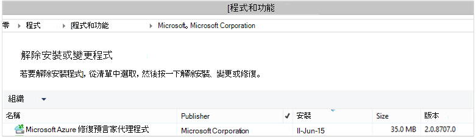

<properties
    pageTitle="部署及管理備份的 Windows 伺服器/用戶端使用 PowerShell |Microsoft Azure"
    description="瞭解如何部署及管理使用 PowerShell 的 Azure 備份"
    services="backup"
    documentationCenter=""
    authors="saurabhsensharma"
    manager="shivamg"
    editor=""/>

<tags
    ms.service="backup"
    ms.workload="storage-backup-recovery"
    ms.tgt_pltfrm="na"
    ms.devlang="na"
    ms.topic="article"
    ms.date="09/01/2016"
    ms.author="saurabhsensharma;markgal;jimpark;nkolli;trinadhk"/>


# <a name="deploy-and-manage-backup-to-azure-for-windows-serverwindows-client-using-powershell"></a>部署及管理備份] 可 Azure 的 Windows Server/Windows 用戶端使用 PowerShell

> [AZURE.SELECTOR]
- [ARM](backup-client-automation.md)
- [傳統](backup-client-automation-classic.md)

本文將示範如何使用 PowerShell 的 Azure 備份 Windows Server 或 Windows 用戶端上所設定及管理備份及復原。

## <a name="install-azure-powershell"></a>安裝 Azure PowerShell

[AZURE.INCLUDE [learn-about-deployment-models](../../includes/learn-about-deployment-models-include.md)]

在年 10 月 2015年中 Azure PowerShell 1.0 發行。 此版本成功 0.9.8 放開並瞭解部分的重大變更，尤其是在 cmdlet 的命名模式。 1.0 cmdlet 遵循命名模式 {動詞}-{名詞}; AzureRm然而，0.9.8 名稱不包括**Rm** (例如，而不是新增 AzureResourceGroup 的新增-AzureRmResourceGroup)。 在使用 PowerShell 的 Azure 0.9.8 時，您必須先啟用資源管理員模式執行**切換 AzureMode AzureResourceManager**命令。 這個命令不需要在 1.0 或更新版本。

如果您想要使用您為 0.9.8 的指令碼環境中，在 1.0 或更新版本的環境中，您應該謹慎測試測試生產環境中的指令碼再使用這些生產環境中，以避免非預期的影響。

[下載最新版的 PowerShell](https://github.com/Azure/azure-powershell/releases)(必要的最低版本︰ 1.0.0)


[AZURE.INCLUDE [arm-getting-setup-powershell](../../includes/arm-getting-setup-powershell.md)]


## <a name="create-a-backup-vault"></a>建立備份保存庫

> [AZURE.WARNING] 第一次使用 Azure 備份的客戶，您需要註冊 Azure 備份提供者來搭配您的訂閱。 這可以藉由執行下列命令︰ Register AzureProvider ProviderNamespace 「 Microsoft.Backup 」

您可以建立新的備份保存庫，以使用**新 AzureRMBackupVault**指令程式。 備份保存庫是一 ARM 資源，因此您必須將其放在 [資源群組。 在較高的 PowerShell 的 Azure 主控台中，執行下列命令︰

```
PS C:\> New-AzureResourceGroup –Name “test-rg” -Region “West US”
PS C:\> $backupvault = New-AzureRMBackupVault –ResourceGroupName “test-rg” –Name “test-vault” –Region “West US” –Storage GeoRedundant
```

使用清單中的訂閱將備份保存庫**取得 AzureRMBackupVault**指令程式。


## <a name="installing-the-azure-backup-agent"></a>安裝 Azure 備份代理程式
安裝 Azure 備份代理程式之前，必須先在 Windows Server 上已安裝程式下載和簡報。 從[Microsoft 下載中心](http://aka.ms/azurebackup_agent)或備份保存庫儀表板頁面，您可以取得最新版本的安裝程式。 安裝程式儲存到可輕鬆存取的位置，如 * C:\Downloads\*。

若要安裝代理程式，請提高權限的 PowerShell 主控台中執行下列命令︰

```
PS C:\> MARSAgentInstaller.exe /q
```

這會代理程式安裝所有的預設選項。 安裝在背景中需要幾分鐘。 如果您沒有指定*/nu*選項 [ **Windows Update** ] 視窗會開啟檢查有任何更新安裝的結尾。 安裝後，代理程式會顯示在已安裝程式清單中。

若要查看已安裝程式清單，請移至**[控制台** > **程式** > **程式和功能**。



### <a name="installation-options"></a>安裝選項

若要查看所有可透過命令列選項，請使用下列命令︰

```
PS C:\> MARSAgentInstaller.exe /?
```

可用的選項包括︰

| 選項 | 詳細資料 | 預設值 |
| ---- | ----- | ----- |
| /q | 自動安裝 | - |
| /p: [位置] | Azure 備份代理程式的安裝資料夾的路徑。 | C:\Program Files\Microsoft Azure 復原服務代理程式 |
| 主 [位置] | Azure 備份代理程式的 [快取] 資料夾的路徑。 | C:\Program Files\Microsoft Azure 復原服務 Agent\Scratch |
| /m | 選擇加入集以 Microsoft Update | - |
| /nu | 安裝完成後不檢查更新 | - |
| /d | 解除安裝 Microsoft Azure 復原服務代理程式 | - |
| /ph | Host （主機） 的 proxy 位址 | - |
| /po | Proxy 主機連接埠號碼 | - |
| /pu | Proxy 主機使用者名稱 | - |
| /pw | Proxy 密碼 | - |


## <a name="registering-with-the-azure-backup-service"></a>註冊 Azure 備份服務
您可以註冊 Azure 備份服務之前，必須先確保已符合[的先決條件](backup-configure-vault.md)。 您必須︰

- 擁有有效的 Azure 訂閱
- 有備份保存庫

若要下載保存庫認證，Azure PowerShell 主控台中執行**取得 AzureRMBackupVaultCredentials** cmdlet，並將其儲存在方便的位置，例如 * C:\Downloads\*。

```
PS C:\> $credspath = "C:\"
PS C:\> $credsfilename = Get-AzureRMBackupVaultCredentials -Vault $backupvault -TargetLocation $credspath
PS C:\> $credsfilename
f5303a0b-fae4-4cdb-b44d-0e4c032dde26_backuprg_backuprn_2015-08-11--06-22-35.VaultCredentials
```

註冊保存庫電腦完成使用[開始 OBRegistration](https://technet.microsoft.com/library/hh770398%28v=wps.630%29.aspx)指令程式︰

```
PS C:\> $cred = $credspath + $credsfilename
PS C:\> Start-OBRegistration -VaultCredentials $cred -Confirm:$false

CertThumbprint      : 7a2ef2caa2e74b6ed1222a5e89288ddad438df2
SubscriptionID      : ef4ab577-c2c0-43e4-af80-af49f485f3d1
ServiceResourceName : test-vault
Region              : West US

Machine registration succeeded.
```

> [AZURE.IMPORTANT] 若要指定保存庫認證檔案請勿使用相對路徑。 您必須提供絕對路徑 cmdlet 的輸入。

## <a name="networking-settings"></a>網路設定
透過 proxy 伺服器連線到網際網路的 Windows 電腦時，也可代理程式提供的 proxy 設定。 在此範例中，沒有 proxy 伺服器，因此我們會明確清除任何 proxy 相關資訊。

頻寬使用量也可以使用的選項來控制```work hour bandwidth```和```non-work hour bandwidth```指定組的一週的天數。

完成設定 proxy 和頻寬詳細資料使用[設定 OBMachineSetting](https://technet.microsoft.com/library/hh770409%28v=wps.630%29.aspx)指令程式︰

```
PS C:\> Set-OBMachineSetting -NoProxy
Server properties updated successfully.

PS C:\> Set-OBMachineSetting -NoThrottle
Server properties updated successfully.
```

## <a name="encryption-settings"></a>加密設定
傳送至 Azure 備份的備份資料已加密保護機密資料。 加密複雜密碼是還原的一次解密資料的 「 密碼 」。

```
PS C:\> ConvertTo-SecureString -String "Complex!123_STRING" -AsPlainText -Force | Set-OBMachineSetting
Server properties updated successfully
```

> [AZURE.IMPORTANT] 安全設定後，讓複雜密碼資訊。 您無法從 Azure 恢復這個複雜密碼。

## <a name="back-up-files-and-folders"></a>備份檔案和資料夾
所有備份，從 Windows 伺服器、 用戶端以 Azure 備份都受到原則。 原則共有三個部分︰

1. **備份的排程**，以指定備份時必須做並同步處理服務。
2. **保留排程**，以指定多久來保留 Azure 中的復原點。
3. **指定檔案包含/排除**規定什麼應該要備份。

在此文件中，我們要自動化備份，因為採用不已設定。 我們開始建立新的備份原則使用[新增 OBPolicy](https://technet.microsoft.com/library/hh770416.aspx)指令程式，並使用它。

```
PS C:\> $newpolicy = New-OBPolicy
```

這次原則是空值及其他 cmdlet 需要定義哪些項目會包含或排除，時將執行備份，以及將儲存備份的位置。

### <a name="configuring-the-backup-schedule"></a>設定備份的排程
3 原則的組件的第一個是備份的排程，會建立使用[新增 OBSchedule](https://technet.microsoft.com/library/hh770401)指令程式。 備份排程定義時需要採取備份。 建立排程時必須指定 2 輸入的參數︰

- **星期幾**執行備份。 您可以執行備份工作只要一天，或每個星期或兩者之間的任何組合。
- **一天的時間**時應該執行備份。 您可以定義當會觸發備份每天的最多 3 不同的時間。

舉例來說，可以設定的備份的原則，會在 4 PM 執行，每個星期六和星期日。

```
PS C:\> $sched = New-OBSchedule -DaysofWeek Saturday, Sunday -TimesofDay 16:00
```

備份排程需要聯原則，而這可以使用達成[設定 OBSchedule](https://technet.microsoft.com/library/hh770407)指令程式。

```
PS C:> Set-OBSchedule -Policy $newpolicy -Schedule $sched
BackupSchedule : 4:00 PM Saturday, Sunday, Every 1 week(s) DsList : PolicyName : RetentionPolicy : State : New PolicyState : Valid
```
### <a name="configuring-a-retention-policy"></a>設定保留原則
保留原則可定義建立從備份工作復原點會保留多久。 在建立新的保留原則，使用 [[新增 OBRetentionPolicy](https://technet.microsoft.com/library/hh770425)指令程式時，您可以指定備份復原點仍需要保留 Azure 備份的天數。 下列範例會保留原則的 7 天。

```
PS C:\> $retentionpolicy = New-OBRetentionPolicy -RetentionDays 7
```

與使用 cmdlet[設定 OBRetentionPolicy](https://technet.microsoft.com/library/hh770405)主原則必須相關聯的保留原則︰

```
PS C:\> Set-OBRetentionPolicy -Policy $newpolicy -RetentionPolicy $retentionpolicy

BackupSchedule  : 4:00 PM
                  Saturday, Sunday,
                  Every 1 week(s)
DsList          :
PolicyName      :
RetentionPolicy : Retention Days : 7

                  WeeklyLTRSchedule :
                  Weekly schedule is not set

                  MonthlyLTRSchedule :
                  Monthly schedule is not set

                  YearlyLTRSchedule :
                  Yearly schedule is not set

State           : New
PolicyState     : Valid
```
### <a name="including-and-excluding-files-to-be-backed-up"></a>包括和排除備份檔案
```OBFileSpec```物件定義要包含在備份中排除的檔案。 這是一組範圍受保護的檔案和資料夾的電腦上的規則。 您可以有許多檔案包含或排除的規則，視需要，並將其與原則建立關聯。 建立新的 OBFileSpec 物件時，您可以︰

- 指定的檔案與資料夾包含
- 指定的檔案與資料夾排除
- 設定中指定遞迴備份資料夾 （或） 是否應該要備份的最上層檔案中指定的資料夾中的資料。

第二個是使用達成-非遞迴旗標新增 OBFileSpec 命令中。

在下面的範例中，我們會備份大量 c 和 d，並排除 OS 二進位檔案中的 Windows 資料夾及任何暫存資料夾。 若要這樣做我們會建立兩個檔案規格使用[新增 OBFileSpec](https://technet.microsoft.com/library/hh770408) cmdlet-要包含的其中一個，一個用於排除。 當已建立檔案的相關規格時，就會相關聯原則使用[新增 OBFileSpec](https://technet.microsoft.com/library/hh770424)指令程式。

```
PS C:\> $inclusions = New-OBFileSpec -FileSpec @("C:\", "D:\")

PS C:\> $exclusions = New-OBFileSpec -FileSpec @("C:\windows", "C:\temp") -Exclude

PS C:\> Add-OBFileSpec -Policy $newpolicy -FileSpec $inclusions

BackupSchedule  : 4:00 PM
                  Saturday, Sunday,
                  Every 1 week(s)
DsList          : {DataSource
                  DatasourceId:0
                  Name:C:\
                  FileSpec:FileSpec
                  FileSpec:C:\
                  IsExclude:False
                  IsRecursive:True

                  , DataSource
                  DatasourceId:0
                  Name:D:\
                  FileSpec:FileSpec
                  FileSpec:D:\
                  IsExclude:False
                  IsRecursive:True

                  }
PolicyName      :
RetentionPolicy : Retention Days : 7

                  WeeklyLTRSchedule :
                  Weekly schedule is not set

                  MonthlyLTRSchedule :
                  Monthly schedule is not set

                  YearlyLTRSchedule :
                  Yearly schedule is not set

State           : New
PolicyState     : Valid


PS C:\> Add-OBFileSpec -Policy $newpolicy -FileSpec $exclusions

BackupSchedule  : 4:00 PM
                  Saturday, Sunday,
                  Every 1 week(s)
DsList          : {DataSource
                  DatasourceId:0
                  Name:C:\
                  FileSpec:FileSpec
                  FileSpec:C:\
                  IsExclude:False
                  IsRecursive:True
                  ,FileSpec
                  FileSpec:C:\windows
                  IsExclude:True
                  IsRecursive:True
                  ,FileSpec
                  FileSpec:C:\temp
                  IsExclude:True
                  IsRecursive:True

                  , DataSource
                  DatasourceId:0
                  Name:D:\
                  FileSpec:FileSpec
                  FileSpec:D:\
                  IsExclude:False
                  IsRecursive:True

                  }
PolicyName      :
RetentionPolicy : Retention Days : 7

                  WeeklyLTRSchedule :
                  Weekly schedule is not set

                  MonthlyLTRSchedule :
                  Monthly schedule is not set

                  YearlyLTRSchedule :
                  Yearly schedule is not set

State           : New
PolicyState     : Valid
```

### <a name="applying-the-policy"></a>套用原則
現在原則物件已完成，而且具有相關聯的備份排程、 保留原則，以及包含/排除清單中的檔案。 此原則可以立即使用 Azure 備份認可。 在套用之前新建立的原則確定沒有任何現有的備份原則，使用[移除 OBPolicy](https://technet.microsoft.com/library/hh770415)指令程式相關聯的伺服器。 移除原則提示進行確認。 若要跳過確認使用```-Confirm:$false```旗標指令程式。

```
PS C:> Get-OBPolicy | Remove-OBPolicy
Microsoft Azure Backup Are you sure you want to remove this backup policy? This will delete all the backed up data. [Y] Yes [A] Yes to All [N] No [L] No to All [S] Suspend [?] Help (default is "Y"):
```

先測試原則物件完成使用[設定 OBPolicy](https://technet.microsoft.com/library/hh770421)指令程式。 這也會要求確認。 若要跳過確認使用```-Confirm:$false```旗標指令程式。

```
PS C:> Set-OBPolicy -Policy $newpolicy
Microsoft Azure Backup Do you want to save this backup policy ? [Y] Yes [A] Yes to All [N] No [L] No to All [S] Suspend [?] Help (default is "Y"):
BackupSchedule : 4:00 PM Saturday, Sunday, Every 1 week(s)
DsList : {DataSource
         DatasourceId:4508156004108672185
         Name:C:\
         FileSpec:FileSpec
         FileSpec:C:\
         IsExclude:False
         IsRecursive:True,

         FileSpec
         FileSpec:C:\windows
         IsExclude:True
         IsRecursive:True,

         FileSpec
         FileSpec:C:\temp
         IsExclude:True
         IsRecursive:True,

         DataSource
         DatasourceId:4508156005178868542
         Name:D:\
         FileSpec:FileSpec
         FileSpec:D:\
         IsExclude:False
         IsRecursive:True
    }
PolicyName : c2eb6568-8a06-49f4-a20e-3019ae411bac
RetentionPolicy : Retention Days : 7
              WeeklyLTRSchedule :
              Weekly schedule is not set

              MonthlyLTRSchedule :
              Monthly schedule is not set

              YearlyLTRSchedule :
              Yearly schedule is not set
State : Existing PolicyState : Valid
```

您可以檢視現有的備份原則使用[取得 OBPolicy](https://technet.microsoft.com/library/hh770406) cmdlet 的詳細資料。 您可以向下切入[取得 OBSchedule](https://technet.microsoft.com/library/hh770423) cmdlet 進一步使用備份的排程和[取得 OBRetentionPolicy](https://technet.microsoft.com/library/hh770427) cmdlet 的保留原則

```
PS C:> Get-OBPolicy | Get-OBSchedule
SchedulePolicyName : 71944081-9950-4f7e-841d-32f0a0a1359a
ScheduleRunDays : {Saturday, Sunday}
ScheduleRunTimes : {16:00:00}
State : Existing

PS C:> Get-OBPolicy | Get-OBRetentionPolicy
RetentionDays : 7
RetentionPolicyName : ca3574ec-8331-46fd-a605-c01743a5265e
State : Existing

PS C:> Get-OBPolicy | Get-OBFileSpec
FileName : *
FilePath : \?\Volume{b835d359-a1dd-11e2-be72-2016d8d89f0f}\
FileSpec : D:\
IsExclude : False
IsRecursive : True

FileName : *
FilePath : \?\Volume{cdd41007-a22f-11e2-be6c-806e6f6e6963}\
FileSpec : C:\
IsExclude : False
IsRecursive : True

FileName : *
FilePath : \?\Volume{cdd41007-a22f-11e2-be6c-806e6f6e6963}\windows
FileSpec : C:\windows
IsExclude : True
IsRecursive : True

FileName : *
FilePath : \?\Volume{cdd41007-a22f-11e2-be6c-806e6f6e6963}\temp
FileSpec : C:\temp
IsExclude : True
IsRecursive : True
```

### <a name="performing-an-ad-hoc-backup"></a>執行臨機操作備份
一旦備份的原則設定就會發生備份每排程。 觸發臨機操作備份也有可能是使用[開始 OBBackup](https://technet.microsoft.com/library/hh770426)指令程式︰

```
PS C:> Get-OBPolicy | Start-OBBackup
Taking snapshot of volumes...
Preparing storage...
Estimating size of backup items...
Estimating size of backup items...
Transferring data...
Verifying backup...
Job completed.
The backup operation completed successfully.
```

## <a name="restore-data-from-azure-backup"></a>從 Azure 備份還原資料
本節會引導您自動化從 Azure 備份資料的復原的步驟。 如此一來，包括下列步驟︰

1. 挑選來源音量
2. 選擇要還原的備份點
3. 選擇要還原的項目
4. 觸發程序還原程序

### <a name="picking-the-source-volume"></a>挑選來源音量
若要從 Azure 備份還原項目，您首先要識別項目的來源。 我們正在執行命令，在 Windows Server 或 Windows 用戶端的環境中，因為是已識別的電腦。 找出來源的下一個步驟是找出包含它音量。 可以藉由執行[取得 OBRecoverableSource](https://technet.microsoft.com/library/hh770410) cmdlet 擷取的區或從這部電腦備份的來源清單。 這個命令會傳回陣列的伺服器/用戶端從備份的所有來源。

```
PS C:> $source = Get-OBRecoverableSource
PS C:> $source
FriendlyName : C:\
RecoverySourceName : C:\
ServerName : myserver.microsoft.com

FriendlyName : D:\
RecoverySourceName : D:\
ServerName : myserver.microsoft.com
```

### <a name="choosing-a-backup-point-to-restore"></a>選擇要還原的備份點
藉由執行[取得 OBRecoverableItem](https://technet.microsoft.com/library/hh770399.aspx) cmdlet，以適當的參數，就可以擷取備份點的清單。 在此範例中，我們將會選擇最新的備份點的來源大量*d* ，用來建立特定的檔案。

```
PS C:> $rps = Get-OBRecoverableItem -Source $source[1]
IsDir : False
ItemNameFriendly : D:\
ItemNameGuid : \?\Volume{b835d359-a1dd-11e2-be72-2016d8d89f0f}\
LocalMountPoint : D:\
MountPointName : D:\
Name : D:\
PointInTime : 18-Jun-15 6:41:52 AM
ServerName : myserver.microsoft.com
ItemSize :
ItemLastModifiedTime :

IsDir : False
ItemNameFriendly : D:\
ItemNameGuid : \?\Volume{b835d359-a1dd-11e2-be72-2016d8d89f0f}\
LocalMountPoint : D:\
MountPointName : D:\
Name : D:\
PointInTime : 17-Jun-15 6:31:31 AM
ServerName : myserver.microsoft.com
ItemSize :
ItemLastModifiedTime :
```
物件```$rps```是陣列的備份的點數。 第一個項目最新的點，而第 n 個項目是從最舊的點。 若要選擇最新的點，我們將使用```$rps[0]```。

### <a name="choosing-an-item-to-restore"></a>選擇要還原的項目
若要找出的確切的檔案或資料夾，以還原，遞迴會使用[取得 OBRecoverableItem](https://technet.microsoft.com/library/hh770399.aspx)指令程式。 如此一來可以單獨使用簡報的資料夾階層```Get-OBRecoverableItem```。

在此範例中，若要還原檔案*finances.xls*我們可以參考的使用的物件```$filesFolders[1]```。

```
PS C:> $filesFolders = Get-OBRecoverableItem $rps[0]
PS C:> $filesFolders
IsDir : True
ItemNameFriendly : D:\MyData\
ItemNameGuid : \?\Volume{b835d359-a1dd-11e2-be72-2016d8d89f0f}\MyData\
LocalMountPoint : D:\
MountPointName : D:\
Name : MyData
PointInTime : 18-Jun-15 6:41:52 AM
ServerName : myserver.microsoft.com
ItemSize :
ItemLastModifiedTime : 15-Jun-15 8:49:29 AM

PS C:> $filesFolders = Get-OBRecoverableItem $filesFolders[0]
PS C:> $filesFolders
IsDir : False
ItemNameFriendly : D:\MyData\screenshot.oxps
ItemNameGuid : \?\Volume{b835d359-a1dd-11e2-be72-2016d8d89f0f}\MyData\screenshot.oxps
LocalMountPoint : D:\
MountPointName : D:\
Name : screenshot.oxps
PointInTime : 18-Jun-15 6:41:52 AM
ServerName : myserver.microsoft.com
ItemSize : 228313
ItemLastModifiedTime : 21-Jun-14 6:45:09 AM

IsDir : False
ItemNameFriendly : D:\MyData\finances.xls
ItemNameGuid : \?\Volume{b835d359-a1dd-11e2-be72-2016d8d89f0f}\MyData\finances.xls
LocalMountPoint : D:\
MountPointName : D:\
Name : finances.xls
PointInTime : 18-Jun-15 6:41:52 AM
ServerName : myserver.microsoft.com
ItemSize : 96256
ItemLastModifiedTime : 21-Jun-14 6:43:02 AM
```

您也可以搜尋要還原使用的項目```Get-OBRecoverableItem```指令程式。 在此範例中，搜尋*finances.xls*我們無法控點檔案來取得執行此命令︰

```
PS C:\> $item = Get-OBRecoverableItem -RecoveryPoint $rps[0] -Location "D:\MyData" -SearchString "finance*"
```

### <a name="triggering-the-restore-process"></a>觸發還原程序
若要觸發還原程序，我們需要指定 [修復] 選項。 這可以經由使用[新增 OBRecoveryOption](https://technet.microsoft.com/library/hh770417.aspx)指令程式。 例如，假設我們想要將檔案還原*C:\temp*。 現在就讓我們也假設我們想要在目的地資料夾*C:\temp*略過的已存在於檔案。 若要建立復原選項，請使用下列命令︰

```
PS C:\> $recovery_option = New-OBRecoveryOption -DestinationPath "C:\temp" -OverwriteType Skip
```

現在觸發還原使用[開始 OBRecovery](https://technet.microsoft.com/library/hh770402.aspx)命令，在所選```$item```從的輸出```Get-OBRecoverableItem```指令程式︰

```
PS C:\> Start-OBRecovery -RecoverableItem $item -RecoveryOption $recover_option
Estimating size of backup items...
Estimating size of backup items...
Estimating size of backup items...
Estimating size of backup items...
Job completed.
The recovery operation completed successfully.
```


## <a name="uninstalling-the-azure-backup-agent"></a>解除安裝 Azure 備份代理程式
解除安裝 Azure 備份代理程式可透過使用下列命令︰

```
PS C:\> .\MARSAgentInstaller.exe /d /q
```

從電腦解除安裝代理程式的二進位檔案具有要考慮的一些結果︰

- 檔案篩選移除電腦，並停止追蹤修訂。
- 從電腦中移除所有的原則資訊，但原則資訊會繼續儲存服務。
- 移除所有備份的排程，並採取任何進一步的備份。

不過，資料會儲存於 Azure 仍會保留，並由您依照保留原則設定會保留。 ，會自動過時較舊的點。

## <a name="remote-management"></a>遠端管理
Azure 備份代理程式、 原則，以及資料來源的所有管理可以透過 PowerShell 遠端都執行。 將遠端管理的電腦必須正確準備。

根據預設，WinRM 服務會設定為手動啟動。 啟動類型必須設定為 [*自動]* ，啟動的服務。 若要確認 WinRM 服務正在執行，[狀態] 屬性的值應該*執行*。

```
PS C:\> Get-Service WinRM

Status   Name               DisplayName
------   ----               -----------
Running  winrm              Windows Remote Management (WS-Manag...
```

遠端 PowerShell 應設定。

```
PS C:\> Enable-PSRemoting -force
WinRM is already set up to receive requests on this computer.
WinRM has been updated for remote management.
WinRM firewall exception enabled.

PS C:\> Set-ExecutionPolicy unrestricted -force
```

電腦可以立即管理遠端-從代理程式的安裝開始。 例如，下列指令碼複製到遠端電腦的代理程式，並將它安裝。

```
PS C:\> $dloc = "\\REMOTESERVER01\c$\Windows\Temp"
PS C:\> $agent = "\\REMOTESERVER01\c$\Windows\Temp\MARSAgentInstaller.exe"
PS C:\> $args = "/q"
PS C:\> Copy-Item "C:\Downloads\MARSAgentInstaller.exe" -Destination $dloc - force

PS C:\> $s = New-PSSession -ComputerName REMOTESERVER01
PS C:\> Invoke-Command -Session $s -Script { param($d, $a) Start-Process -FilePath $d $a -Wait } -ArgumentList $agent $args
```

## <a name="next-steps"></a>後續步驟
如需有關 Azure 備份的 Windows 伺服器/用戶端，請參閱

- [Azure 備份的簡介](backup-introduction-to-azure-backup.md)
- [備份 Windows 伺服器](backup-configure-vault.md)
