<properties
    pageTitle="備份的 Windows server 或用戶端來使用傳統的部署模型 Azure |Microsoft Azure"
    description="備份 Windows 伺服器或建立備份保存庫，下載認證、 安裝備份代理程式，並完成您的檔案與資料夾的初始備份 Azure 用戶端。"
    services="backup"
    documentationCenter=""
    authors="markgalioto"
    manager="cfreeman"
    editor=""
    keywords="備份保存庫;備份的 Windows server;備份的視窗。"/>

<tags
    ms.service="backup"
    ms.workload="storage-backup-recovery"
    ms.tgt_pltfrm="na"
    ms.devlang="na"
    ms.topic="article"
    ms.date="08/08/2016"
    ms.author="jimpark; trinadhk; markgal"/>

# 在 Windows server 或用戶端備份到 Azure 使用傳統的部署模型

> [AZURE.SELECTOR]
- [傳統的入口網站](backup-configure-vault-classic.md)
- [Azure 入口網站](backup-configure-vault.md)

本文將說明至 Azure 所需遵循環境準備作業，並備份 Windows server （或用戶端） 的程序。 同時說明部署備份解決方案的考量。 如果您想在第一次嘗試 Azure 備份，本文快速逐步引導您完成程序。

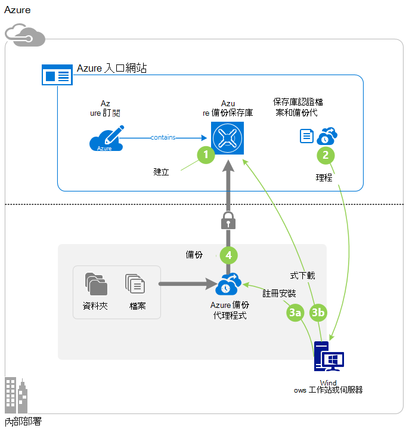

>[AZURE.IMPORTANT] Azure 有兩種不同的部署模型建立及使用的資源︰ 資源管理員] 及 [傳統。 本文涵蓋使用傳統的部署模型。 Microsoft 建議最新的部署使用資源管理員模型。

## 在您開始之前
若要回到伺服器或用戶端 Azure，必須 Azure 帳戶。 如果您沒有帳戶，您可以建立一個[免費的帳戶](https://azure.microsoft.com/free/)，在幾分鐘。

## 步驟 1︰ 建立備份保存庫
若要從伺服器或用戶端備份檔案和資料夾，必須先建立備份保存庫中您想要用來儲存資料的地理區域。

### 若要建立備份保存庫

1. [[傳統] 入口網站](https://manage.windowsazure.com/)登入。

2. 按一下 [**新增** > **資料服務** > **修復服務** > **備份保存庫**，然後選擇 [**快速建立**。

3. **名稱**引數，請輸入備份保存庫易記的名稱。 輸入包含 2 到 50 個字元之間的名稱。 它必須以字母，以開始，並可以包含字母、 數字和連字號。 此名稱必須是唯一的每個訂閱。

4. **地區**引數，請選取 [備份保存庫的地理區域]。 此選項會決定您的備份資料會傳送位置的地理區域。 選擇接近您所在位置的地理區域，您可以在時備份到 Azure 減少網路延遲。

5. 按一下 [**建立保存庫**。

    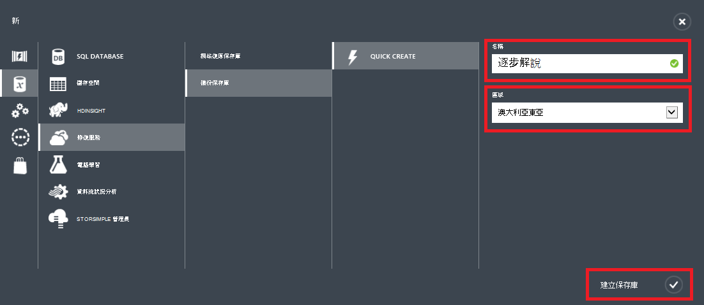

    需要時建立備份保存庫。 若要查看狀態，監控通知] 底部的 [傳統] 入口網站。

    在建立備份保存庫之後，您會看到訊息，指出保存庫已成功建立。 它也會顯示為**作用中****復原服務**的 [資源] 清單中。

    

4. 選取的儲存空間重複選項按照此處所述的步驟進行。

    >[AZURE.IMPORTANT] 找出您儲存重複選項的最佳時機是保存庫建立之後，以及任何電腦註冊為保存庫之前。 若要保存庫已登錄項目後，儲存重複選項已鎖定，且無法修改。

    如果您使用的 Azure 為主要備份儲存端點 （例如，您要備份到 Azure 從 Windows server），請考慮挑選 （預設）[地理多餘的儲存空間](../storage/storage-redundancy.md#geo-redundant-storage)的選項。

    如果您使用的 Azure 為第三個備份的儲存空間端點 （例如，您正在使用系統管理中心資料保護管理員市集本機備份複本內部部署並使用長期保留需要 Azure），請考慮選擇[本機多餘的儲存空間](../storage/storage-redundancy.md#locally-redundant-storage)。 如此會開啟下 Azure 中的資料儲存在可能的第三份可接受的資料提供的持續性較低層級成本。

    **若要選取的儲存空間重複選項︰**

    。 按一下您剛建立保存庫。

    b。 在 [快速入門] 頁面上，選取 [**設定**]。

    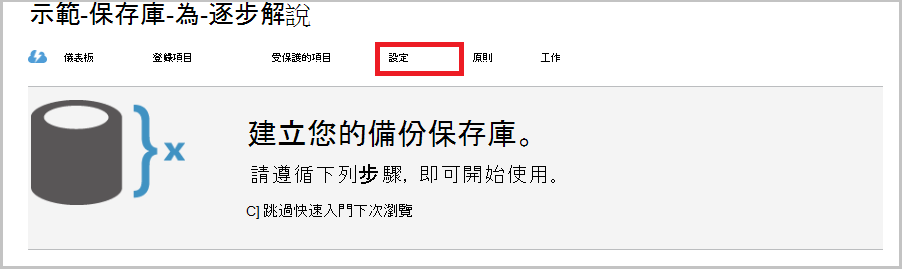

    c。 選擇適當的儲存空間重複選項。

    如果您選取**本機重複**項目，必須先按一下 [**儲存**] （因為**地理多餘**的預設選項）。

    d。 在左側的功能窗格中，按一下 [**修復服務**復原服務，返回資源的清單。

## 步驟 2︰ 下載保存庫認證檔案
內部部署電腦必須驗證與備份保存庫之前，可以到 Azure 備份資料。 驗證的方法是透過*保存庫認證*。 保存庫認證檔案下載到 [傳統] 入口網站的安全通道。 憑證私密金鑰不會保留在入口網站或服務。

進一步瞭解[使用地窖備份服務的驗證認證](backup-introduction-to-azure-backup.md#what-is-the-vault-credential-file)。

### 若要保存庫認證檔案下載到本機電腦

1. 在左側的功能窗格中，按一下 [**修復服務**]，然後選取您建立的備份保存庫。

    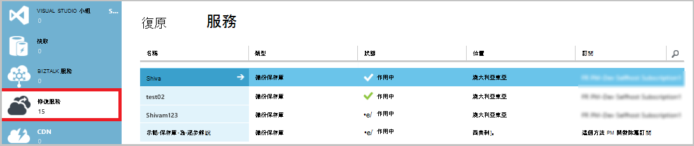

2.  在 [快速入門] 頁面上，按一下 [**下載保存庫認證**]。

    [傳統] 入口網站產生保存庫認證使用保存庫名稱與目前日期的組合。 保存庫認證檔案只在註冊工作流程和 48 小時後到期。

    從入口網站，可以下載保存庫認證檔案。

3. 按一下 [若要保存庫認證檔案下載到本機帳戶的 [下載] 資料夾的 [**儲存**]。 您也可以從 [**儲存**] 功能表中，指定保存庫認證檔案的位置選取**另存新檔**。

    >[AZURE.NOTE] 請確定保存庫認證檔案會儲存於可從您的電腦存取的位置。 如果該儲存檔案共用區或伺服器訊息區中，確認您擁有的權限存取的地方。

## 步驟 3︰ 下載、 安裝及註冊備份代理程式
建立備份保存庫後，當您下載保存庫認證檔案時，必須在每一個您的 Windows 電腦上安裝代理程式。

### 若要下載、 安裝及註冊代理程式

1. 按一下 [**修復服務**]，然後選取 [您想要與伺服器註冊備份保存庫。

2. 在 [快速入門] 頁面上，按一下 [**代理程式的 Windows Server 系統管理中心資料保護管理員或 Windows 用戶端**的代理程式]。 然後按一下 [**儲存**]。

    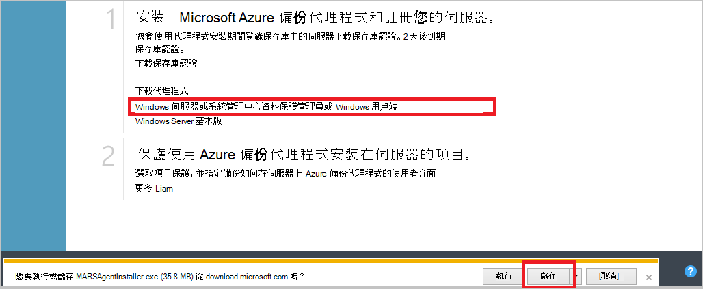

3. 具有下載 MARSagentinstaller.exe 檔案後，按一下 [**執行**] （或按兩下**MARSAgentInstaller.exe**從儲存的位置）。

4. 選擇安裝資料夾和所需的代理程式的 [快取] 資料夾，然後按一下 [**下一步**。 您指定的快取位置免費空間必須至少 5%的備份資料。

5. 您可以繼續連線到網際網路到預設的 proxy 設定。          如果您使用 proxy 伺服器連線至網際網路，在 [Proxy 設定] 頁面上選取 [**使用自訂的 proxy 設定**] 核取方塊，，然後輸入 [proxy 伺服器的詳細資料。 如果您使用已驗證的 proxy，輸入使用者名稱和密碼的詳細資訊，然後再按 [**下一步**。

7. 按一下 [開始代理程式安裝的 [**安裝**]。 備份代理程式安裝.NET Framework 4.5] 和 [Windows PowerShell （如果尚未安裝） 以完成安裝。

8. 代理程式安裝之後，按一下 [**繼續註冊**繼續進行工作流程。

9. 在保存庫識別碼] 頁面中，瀏覽並選取您先前已下載的保存庫認證檔案。

    保存庫認證檔案是有效的只有 48 小時後就會從入口網站下載。 如果發生錯誤上 （例如 「 保存庫認證提供檔案已過期 」），此頁面登入入口網站，並再次下載保存庫認證檔案。

    請確定此保存庫認證檔案可在安裝應用程式可存取的位置。 如果您遇到存取相關錯誤時，將保存庫認證檔案複製到同一部電腦上的暫存位置，然後再試。

    如果您遇到保存庫認證錯誤，例如 「 提供無效保存庫認證 」 時，檔案已毀損，或不會有最新的認證與不相關的復原服務。 從入口網站下載新保存庫認證檔案後再試。 如果使用者按一下 [**下載保存庫認證**] 選項中快速連續數次，也可能會發生這個錯誤。 在此情況下，僅最後一個保存庫認證檔案是有效的。

9. 在 [加密設定] 頁面中，您可以產生複雜密碼，或提供複雜密碼 （最小值的 16 個字元）。 請記得在安全的位置儲存複雜密碼。

10. 按一下 [**完成**]。 註冊的 [伺服器] 精靈註冊備份伺服器。

    >[AZURE.WARNING] 如果您遺失或忘記密碼複雜密碼時，Microsoft 不能協助您復原備份資料。 您擁有您的加密複雜密碼，Microsoft 並沒有看見您使用複雜密碼。 因為它必須修復作業期間，請將檔案儲存在安全的位置。

11. 設定的加密金鑰之後，請保持選取]，**啟動 Microsoft Azure 修復服務代理**核取方塊，然後按一下 [**關閉**。

## 步驟 4︰ 完成初始的備份

初始的備份包含兩個主要的工作︰

- 建立備份的排程
- 第一次備份檔案及資料夾

備份原則完成初始備份之後，它會建立備份的點，如果您要復原的資料，您可以使用。 備份原則會根據您所定義的排程。

### 若要排程的備份

1. 開啟 Microsoft Azure 備份代理程式。 （隨即會開啟自動如果您離開您關閉 [註冊] 的 [伺服器] 精靈時，選取 [**啟動 Microsoft Azure 修復服務代理**核取方塊。）您可以藉由搜尋**Microsoft Azure 備份**您的電腦找到它。

    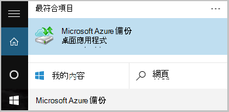

2. 在備份代理程式中，按一下 [**排程備份**]。

    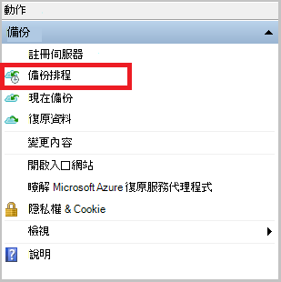

3. 在 [排程備份精靈] 的 [快速入門] 頁面中，按一下 [**下一步**]。

4. 在 [選取項目備份頁面，按一下 [**新增項目]**。

5. 選取的檔案與您想要備份的資料夾，然後再按一下 [**好**]。

6. 按一下 [**下一步**]。

7. 在 [**指定備份的排程**] 頁面中，指定**備份的排程**，然後按一下 [**下一步**]。

    您可以排程 （最大的速率每日三次） 每天或每週的備份。

    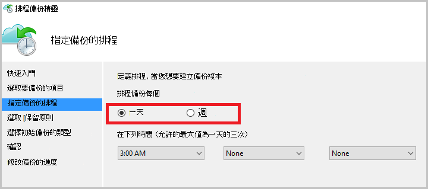

    >[AZURE.NOTE] 如需有關如何指定備份的排程，請參閱[使用 Azure 備份取代膠帶貼上基礎結構](backup-azure-backup-cloud-as-tape.md)的詳細資訊。

8. 在 [**選取的保留原則**] 頁面上選取的**保留原則**備份複本。

    保留原則指定儲存備份的工期。 而不只指定備份的所有點的 「 一般原則 」，您可以指定不同的保留原則以備份發生的時間。 您可以修改以符合您需求的每日、 每週、 每月和年的保留原則。

9. 在 [選擇初始備份類型] 頁面上選擇初始備份類型。 保留**在網路上的自動**選取，] 選項，然後按一下 [**下一步**。

    您可以自動備份到網路，或您可以備份離線。 這篇文章的其餘部分說明自動備份的程序。 如果您想要執行離線備份，檢閱文件[中 Azure 備份離線備份工作流程](backup-azure-backup-import-export.md)的其他資訊。

10. 在 [確認] 頁面上檢閱資訊，，然後再按一下 [**完成]**。

11. 精靈完成建立備份排程後，請按一下 [**關閉**]。

### 啟用網路節流 （選用）

備份代理程式提供網路節流設定。 節流設定的控制項的網路頻寬期間的資料傳輸的使用方式。 此控制項可以是如果您要備份資料期間工作時數，但不是想避免圖片干擾其他網際網路流量的備份程序很有幫助的。 節流適用於備份及還原活動。

**若要啟用網路節流**

1. 在備份代理程式中，按一下 [**變更內容**]。

    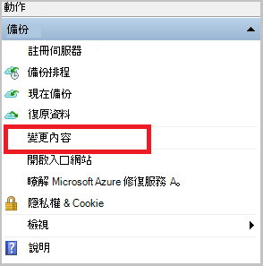

2. 在 [ **Throttling** ] 索引標籤上選取 [**啟用節流備份作業的網際網路頻寬使用量**] 核取方塊。

    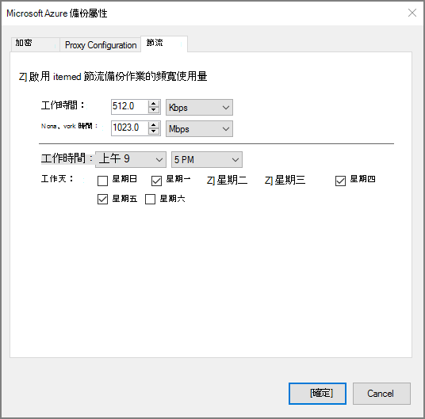

3. 您已啟用節流之後，指定備份資料傳輸允許的頻寬**工作時間**和**非工作時間**期間。

    頻寬值 512 kb 秒 (Kbps) 開始，並可以移為 1023 mb 數 (MBps)。 您也可以指定開始日期和完成**工作時間**，且每週的哪幾天視為的工作日。 外部指定工作時數會視為小時非工作時間。

4. 按一下**[確定]**。

### 若要立即備份

1. 在備份代理程式中，按一下 [**立刻備份**完成初始種子在網路上。

    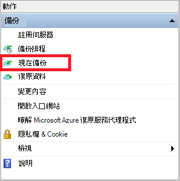

2. 在 [確認] 頁面上檢閱備份現在精靈會使用備份電腦的設定。 然後按一下 [**備份**。

3. 按一下 [**關閉**] 以關閉精靈。 如果備份的程序完成之前，您可以這麼做，精靈會繼續在背景中執行。

初始的備份已完成之後，**完成的工作**狀態會出現在備份主控台。

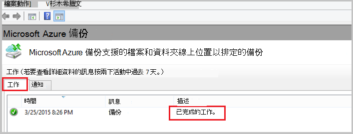

## 後續步驟
- 註冊[免費的 Azure 帳戶](https://azure.microsoft.com/free/)。

如需備份 Vm 或其他工作負載的詳細資訊，請參閱︰

- [備份 IaaS Vm](backup-azure-vms-prepare.md)
- [備份與 Microsoft Azure 備份伺服器 Azure 負載](backup-azure-microsoft-azure-backup.md)
- [備份與 DPM Azure 負載](backup-azure-dpm-introduction.md)
