<properties
    pageTitle="備份的 Windows Server 或用戶端來使用 Azure 備份使用資源管理員部署模型 Azure |Microsoft Azure"
    description="備份 Windows 伺服器或建立備份保存庫，下載認證、 安裝備份代理程式，並完成您的檔案與資料夾的初始備份 Azure 用戶端。"
    services="backup"
    documentationCenter=""
    authors="markgalioto"
    manager="cfreeman"
    editor=""
    keywords="備份保存庫;備份的 Windows server;備份的視窗。"/>

<tags
    ms.service="backup"
    ms.workload="storage-backup-recovery"
    ms.tgt_pltfrm="na"
    ms.devlang="na"
    ms.topic="article"
    ms.date="08/10/2016"
    ms.author="jimpark; trinadhk; markgal"/>

# 若要使用的資源管理員部署模型 Azure 備份的 Windows Server 或用戶端

> [AZURE.SELECTOR]
- [Azure 入口網站](backup-configure-vault.md)
- [傳統的入口網站](backup-configure-vault-classic.md)

本文說明如何備份您的 Windows Server （或 Windows 用戶端） 要與使用資源管理員部署模型 Azure 備份 Azure 檔案和資料夾。

[AZURE.INCLUDE [learn-about-deployment-models](../../includes/backup-deployment-models.md)]

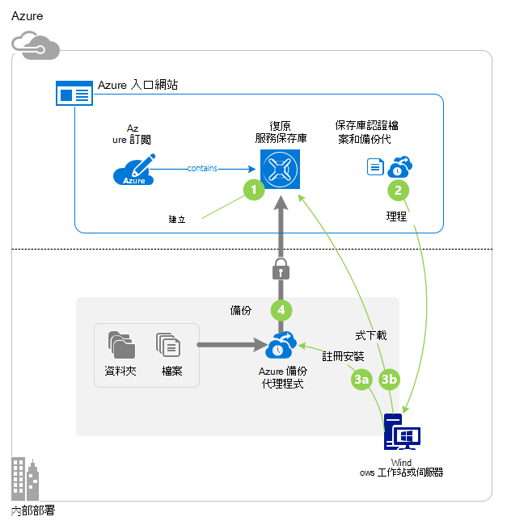

## 在您開始之前
若要回到伺服器或用戶端 Azure，必須 Azure 帳戶。 如果您沒有帳戶，您可以建立一個[免費的帳戶](https://azure.microsoft.com/free/)，在幾分鐘。

## 步驟 1︰ 建立修復服務保存庫

修復服務保存庫是會儲存備份及復原點您建立一段時間的實體。 修復服務保存庫也包含備份的原則套用至受保護的檔案和資料夾。 當您建立修復服務保存庫時，您也應該選取適當的儲存空間重複選項。

### 若要建立修復服務保存庫

1. 如果您尚未登入至[Azure 入口網站](https://portal.azure.com/)使用 Azure 訂閱這麼做。

2. 在 [中心] 功能表中，按一下 [**瀏覽**，在資源的清單中，輸入 [**修復服務**。 當您開始輸入，就會篩選清單根據您輸入。 按一下 [**修復服務保存庫**]。

    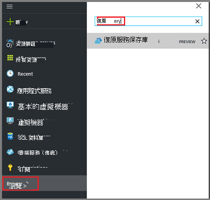  

    修復服務保存庫的清單會顯示。

3. 在 [**復原服務保存庫**] 功能表中，按一下 [**新增**。

    

    修復服務保存庫刀開啟時，它會提示您提供的**名稱**、**訂閱**、 [**資源] 群組**中，與**位置**。

    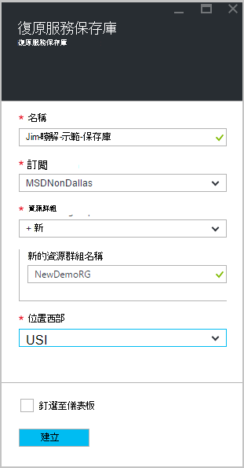

4. [**名稱**] 中，輸入好記的名稱來識別保存庫。 名稱必須是唯一的 Azure 訂閱。 輸入包含 2 到 50 個字元之間的名稱。 它必須以字母，以開始，並可以包含字母、 數字和連字號。

5. 按一下以查看可用的訂閱清單的**訂閱**]。 如果您不確定要使用的訂閱，使用預設的 （或建議） 訂閱。 會有多個選項只有您的組織帳戶是 Azure 的多個訂閱相關聯。

6. 按一下 [**資源群組**以查看可用的資源群組清單，或按一下 [**新增**]，建立新的資源群組。 完整資源群組的詳細資訊，請參閱[Azure 資源管理員的概觀](../azure-resource-manager/resource-group-overview.md)

7. 按一下以選取保存庫的地理區域的**位置**。 此選項會決定您的備份資料會傳送位置的地理區域。 選擇接近您所在位置的地理區域，您可以在時備份到 Azure 減少網路延遲。

8. 按一下 [**建立**]。 可能需要一段時間的建立修復服務保存庫。 監控右側區內入口網站中的狀態通知。 您保存庫建立之後，它應該開啟在入口網站。 如果您沒有看到已經完成後，列出您保存庫，請按一下 [**重新整理**]。 重新整理清單中，按一下 [保存庫的名稱。

### 若要判斷儲存複本
當您第一次建立修復服務保存庫您決定如何複製儲存空間。

1. 在**設定**刀，會自動開啟與保存庫儀表板，按一下 [**備份基礎結構**]。

2. 在 [備份基礎結構刀中，按一下 [**備份設定**，若要檢視**儲存複寫類型**]。

    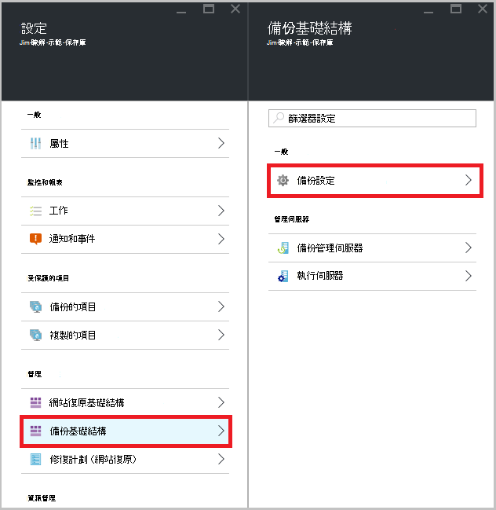

3. 選擇您保存庫的儲存空間複寫選項。

    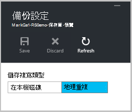

    根據預設，您保存庫有地理多餘的儲存空間。 如果您使用 Azure 為主要備份儲存端點，繼續使用地理多餘的儲存空間。 如果您使用 Azure 為非主要備份存放端點，請選擇 [本機多餘的儲存空間，來減少 Azure 中儲存資料的成本。 瞭解更多關於[地理多餘](../storage/storage-redundancy.md#geo-redundant-storage)和本[概觀](../storage/storage-redundancy.md)[本機多餘](../storage/storage-redundancy.md#locally-redundant-storage)的儲存空間選項。

    選擇您保存庫的 [儲存] 選項之後, 您準備好關聯保存庫中的檔案與資料夾。

現在，您已建立保存庫，您就準備好您下載並安裝 Microsoft Azure 修復服務代理程式、 下載保存庫認證，然後使用這些認證保存庫註冊代理程式備份檔案和資料夾的基礎結構。

## 步驟 2-下載檔案

>[AZURE.NOTE] 即將推出啟用透過 Azure 入口網站的備份。 此時，您可以使用 Microsoft Azure 修復服務代理內部備份您的檔案和資料夾。

1. 按一下 [修復服務保存庫儀表板上的 [**設定**]。

    

2. 按一下 [**快速入門 > 備份**設定刀上。

    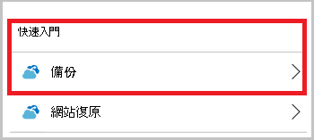

3. 按一下備份刀**備份目標**。

    

4. 選取從何處**內部部署**是您執行的工作量？功能表。

5. 選取**檔案和資料夾**，從您做什麼想要備份嗎？] 功能表中，按一下**[確定]**。

#### 下載修復服務代理程式

1. 按一下 [**下載代理程式的 Windows 伺服器或 Windows 用戶端**中**準備基礎結構**刀。

    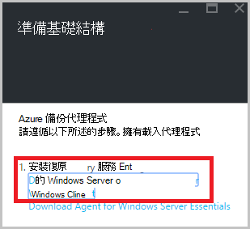

2. 按一下 [下載快顯中的 [**儲存**]。 根據預設， **MARSagentinstaller.exe**檔案會儲存到您的 [下載] 資料夾。

#### 下載保存庫認證

1. 按一下 [**下載 > 儲存**準備基礎結構刀上。

    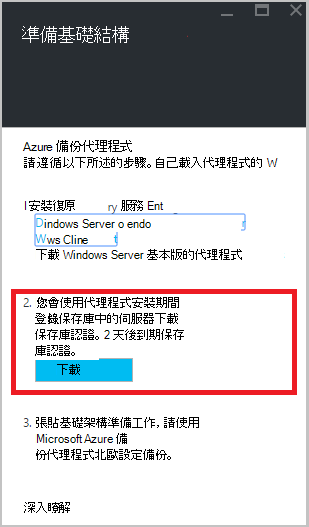

## 步驟 3-安裝並註冊代理程式

1. 找出並按兩下**MARSagentinstaller.exe**從 [下載] 資料夾 （或其他儲存的位置）。

2. 完成 Microsoft Azure 復原服務代理程式安裝精靈。 若要完成精靈，您需要︰

    - 選擇 [安裝及快取] 資料夾的位置。
    - 如果您使用 proxy 伺服器連線到網際網路，提供您的 proxy 伺服器資訊。
    - 如果您是使用已驗證的 proxy，提供您的使用者名稱和密碼的詳細資訊。
    - 提供下載保存庫認證
    - 將加密複雜密碼儲存在安全的位置。

    >[AZURE.NOTE] 如果您遺失或忘記密碼複雜密碼時，Microsoft 就無法協助復原備份資料。 請將檔案儲存在安全的位置。 需要還原的備份。

立即安裝代理程式，而且您的電腦註冊保存庫。 您準備好要設定及排程備份。

### 確認安裝

若要確認代理程式已安裝並註冊正確，您可以檢查**生產伺服器**] 區段中的 [管理] 入口網站中備份的項目。 若要執行這項操作︰

1. 使用您的 Azure 訂閱[Azure 入口網站](https://portal.azure.com/)登入。

2. 在 [中心] 功能表中，按一下 [**瀏覽**，在資源的清單中，輸入 [**修復服務**。 當您開始輸入，就會篩選清單根據您輸入。 按一下 [**修復服務保存庫**]。

      

    修復服務保存庫的清單會顯示。

2. 選取您建立保存庫的名稱。

    修復服務保存庫儀表板刀隨即會開啟。

    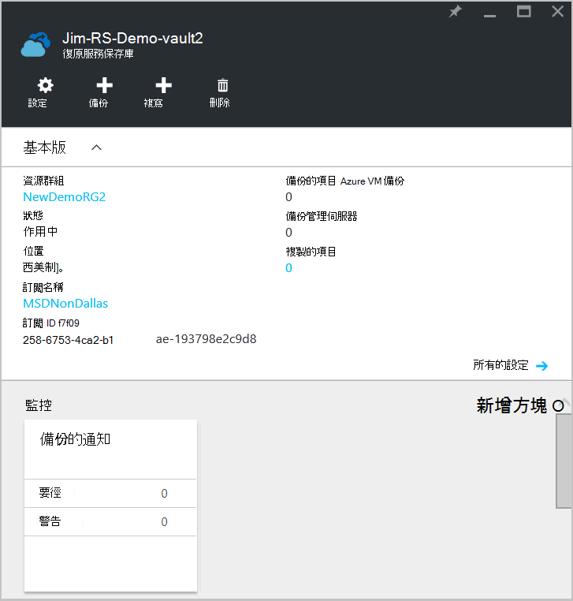  

3. 按一下頁面頂端的 [**設定**] 按鈕。

4. 按一下 [**備份基礎結構 > 生產伺服器**。

    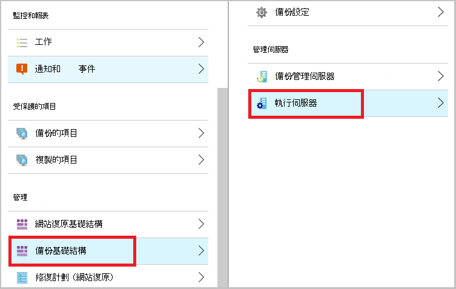

如果您看到您在清單中的伺服器時，必須確認代理程式的已安裝並註冊正確。

## 步驟 4︰ 完成初始的備份

初始的備份包含兩個主要的工作︰

- 排程備份
- 第一次備份檔案和資料夾

若要完成初始備份，您可以使用 Microsoft Azure 備份代理程式。

### 若要排程的備份

1. 開啟 Microsoft Azure 備份代理程式。 您可以藉由搜尋**Microsoft Azure 備份**您的電腦找到它。

    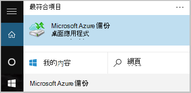

2. 在備份代理程式中，按一下 [**排程備份**]。

    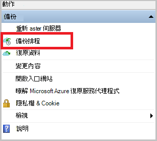

3. 在 [排程備份精靈] 的 [快速入門] 頁面中，按一下 [**下一步**]。

4. 在 [選取項目備份頁面，按一下 [**新增項目]**。

5. 選取的檔案與您想要備份的資料夾，然後再按一下 [**好**]。

6. 按一下 [**下一步**]。

7. 在 [**指定備份的排程**] 頁面中，指定**備份的排程**，然後按一下 [**下一步**]。

    您可以排程 （最大的速率每日三次） 每天或每週的備份。

    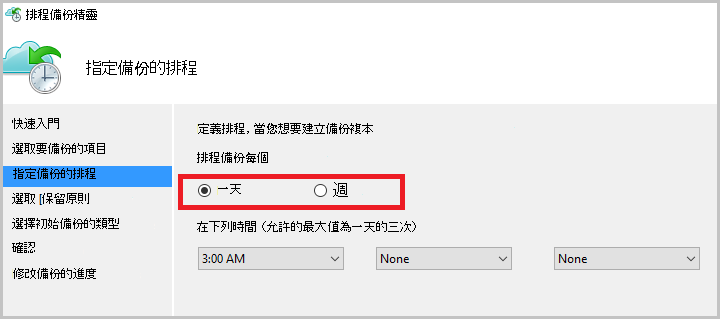

    >[AZURE.NOTE] 如需有關如何指定備份的排程，請參閱[使用 Azure 備份取代膠帶貼上基礎結構](backup-azure-backup-cloud-as-tape.md)的詳細資訊。

8. 在 [**選取的保留原則**] 頁面上選取的**保留原則**備份複本。

    保留原則指定儲存備份的工期。 而不只指定備份的所有點的 「 一般原則 」，您可以指定不同的保留原則以備份發生的時間。 您可以修改以符合您需求的每日、 每週、 每月和年的保留原則。

9. 在 [選擇初始備份類型] 頁面上選擇初始備份類型。 保留**在網路上的自動**選取，] 選項，然後按一下 [**下一步**。

    您可以自動備份到網路，或您可以備份離線。 這篇文章的其餘部分說明自動備份的程序。 如果您想要執行離線備份，檢閱文件[中 Azure 備份離線備份工作流程](backup-azure-backup-import-export.md)的其他資訊。

10. 在 [確認] 頁面上檢閱資訊，，然後再按一下 [**完成]**。

11. 精靈完成建立備份排程後，請按一下 [**關閉**]。

### 啟用網路節流 （選用）

備份代理程式提供網路節流設定。 節流設定的控制項的網路頻寬期間的資料傳輸的使用方式。 此控制項可以是如果您要備份資料期間工作時數，但不是想避免圖片干擾其他網際網路流量的備份程序很有幫助的。 節流適用於備份及還原活動。

>[AZURE.NOTE] 網路節流無法使用 Windows Server 2008 R2 SP1、 Windows Server 2008 SP2，或 Windows 7 （含 service pack)。 Azure 備份網路節流功能在本機的作業系統上執行服務品質 (QoS)。 雖然 Azure 備份可以保護這些作業系統，QoS 提供這些平台上的版本不適用於 Azure 備份網路節流設定。 網路節流能在所有其他的[支援的作業系統](backup-azure-backup-faq.md#installation-amp-configuration)。

**若要啟用網路節流**

1. 在備份代理程式中，按一下 [**變更內容**]。

    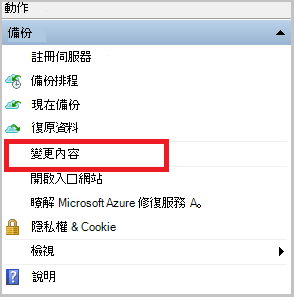

2. 在 [ **Throttling** ] 索引標籤上選取 [**啟用節流備份作業的網際網路頻寬使用量**] 核取方塊。

    

3. 您已啟用節流之後，指定備份資料傳輸允許的頻寬**工作時間**和**非工作時間**期間。

    頻寬值 512 kb 秒 (Kbps) 開始，並可以移為 1023 mb 數 (MBps)。 您也可以指定開始日期和完成**工作時間**，且每週的哪幾天視為的工作日。 外部指定工作時數會視為小時非工作時間。

4. 按一下**[確定]**。

### 第一次備份檔案和資料夾

1. 在備份代理程式中，按一下 [**立刻備份**完成初始種子在網路上。

    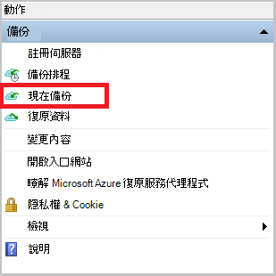

2. 在 [確認] 頁面上檢閱備份現在精靈會使用備份電腦的設定。 然後按一下 [**備份**。

3. 按一下 [**關閉**] 以關閉精靈。 如果備份的程序完成之前，您可以這麼做，精靈會繼續在背景中執行。

初始的備份已完成之後，**完成的工作**狀態會出現在備份主控台。

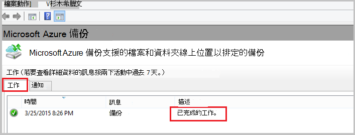

## 問題嗎？
如果您有問題，或任何 」 功能，您想要包含在內，請[將意見反應傳送給我們](http://aka.ms/azurebackup_feedback)。

## 後續步驟
如需備份 Vm 或其他工作負載的詳細資訊，請參閱︰

- 現在您已備份您的檔案和資料夾，您可以[管理您的保存庫和伺服器](backup-azure-manage-windows-server.md)。
- 如果您要還原的備份，請使用此文章，以[還原到 Windows 的電腦的檔案](backup-azure-restore-windows-server.md)。
