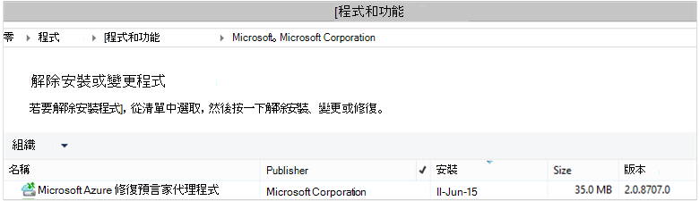

<properties
    pageTitle="Azure 備份-部署及管理回打造 DPM 使用 PowerShell |Microsoft Azure"
    description="瞭解如何部署及管理 Azure 備份的資料保護管理員 (DPM) 使用 PowerShell"
    services="backup"
    documentationCenter=""
    authors="Nkolli1"
    manager="shreeshd"
    editor=""/>

<tags
    ms.service="backup"
    ms.workload="storage-backup-recovery"
    ms.tgt_pltfrm="na"
    ms.devlang="na"
    ms.topic="article"
    ms.date="09/27/2016"
    ms.author="jimpark; trinadhk; anuragm; markgal"/>


# <a name="deploy-and-manage-backup-to-azure-for-data-protection-manager-dpm-servers-using-powershell"></a>部署及管理備份資料保護管理員 (DPM) 伺服器使用 PowerShell 的 Azure

> [AZURE.SELECTOR]
- [ARM](backup-dpm-automation.md)
- [傳統](backup-dpm-automation-classic.md)

本文將示範如何使用 PowerShell 來備份 Azure DPM 伺服器上，設定及管理備份及復原。

## <a name="setting-up-the-powershell-environment"></a>PowerShell 環境設定

[AZURE.INCLUDE [learn-about-deployment-models](../../includes/learn-about-deployment-models-include.md)]

您可以使用 PowerShell 來管理備份資料保護管理員 」 從 Azure 之前，您必須在 PowerShell 中有正確的環境。 PowerShell 工作階段的開頭，請確定您執行下列命令以匯入右模組，可讓您以正確參照 DPM cmdlet:

```
PS C:> & "C:\Program Files\Microsoft System Center 2012 R2\DPM\DPM\bin\DpmCliInitScript.ps1"

Welcome to the DPM Management Shell!

Full list of cmdlets: Get-Command
Only DPM cmdlets: Get-DPMCommand
Get general help: help
Get help for a cmdlet: help <cmdlet-name> or <cmdlet-name> -?
Get definition of a cmdlet: Get-Command <cmdlet-name> -Syntax
Sample DPM scripts: Get-DPMSampleScript
```

## <a name="setup-and-registration"></a>設定和註冊
若要開始︰

1. [下載最新的 PowerShell](https://github.com/Azure/azure-powershell/releases)(必要的最低版本︰ 1.0.0)
2. 切換至*AzureResourceManager*模式中，使用**切換 AzureMode** commandlet 啟用 Azure 備份 shell 指令程式︰

```
PS C:\> Switch-AzureMode AzureResourceManager
```

可以使用 PowerShell 自動化下列設定和註冊工作︰

- 建立備份保存庫
- 安裝 Azure 備份代理程式
- 註冊 Azure 備份服務
- 網路設定
- 加密設定

### <a name="create-a-backup-vault"></a>建立備份保存庫

> [AZURE.WARNING] 第一次使用 Azure 備份的客戶，您需要註冊 Azure 備份提供者來搭配您的訂閱。 這可以藉由執行下列命令︰ Register AzureProvider ProviderNamespace 「 Microsoft.Backup 」

您可以建立新的備份保存庫，以使用**新 AzureRMBackupVault** commandlet。 備份保存庫是一 ARM 資源，因此您必須將其放在 [資源群組。 在較高的 PowerShell 的 Azure 主控台中，執行下列命令︰

```
PS C:\> New-AzureResourceGroup –Name “test-rg” -Region “West US”
PS C:\> $backupvault = New-AzureRMBackupVault –ResourceGroupName “test-rg” –Name “test-vault” –Region “West US” –Storage GRS
```

您可以使用**取得 AzureRMBackupVault** commandlet 指定訂閱中取得所有備份保存庫的清單。


### <a name="installing-the-azure-backup-agent-on-a-dpm-server"></a>DPM 伺服器上安裝 Azure 備份代理程式
安裝 Azure 備份代理程式之前，必須先在 Windows Server 上已安裝程式下載和簡報。 從[Microsoft 下載中心](http://aka.ms/azurebackup_agent)或備份保存庫儀表板頁面，您可以取得最新版本的安裝程式。 安裝程式儲存到可輕鬆存取的位置，如 * C:\Downloads\*。

若要安裝代理程式，請在提高權限 PowerShell 主控台**DPM 伺服器上**執行下列命令︰

```
PS C:\> MARSAgentInstaller.exe /q
```

這會代理程式安裝所有的預設選項。 安裝在背景中需要幾分鐘。 如果您沒有指定*/nu*選項檢查有任何更新安裝結束時就會開啟 [ **Windows Update** ] 視窗。

代理程式會顯示在已安裝程式清單中。 若要查看已安裝程式清單，請移至**[控制台** > **程式** > **程式和功能**。



#### <a name="installation-options"></a>安裝選項
若要查看所有可透過命令列選項，請使用下列命令︰

```
PS C:\> MARSAgentInstaller.exe /?
```

可用的選項包括︰

| 選項 | 詳細資料 | 預設值 |
| ---- | ----- | ----- |
| /q | 自動安裝 | - |
| /p: [位置] | Azure 備份代理程式的安裝資料夾的路徑。 | C:\Program Files\Microsoft Azure 復原服務代理程式 |
| 主 [位置] | Azure 備份代理程式的 [快取] 資料夾的路徑。 | C:\Program Files\Microsoft Azure 復原服務 Agent\Scratch |
| /m | 選擇加入集以 Microsoft Update | - |
| /nu | 安裝完成後不檢查更新 | - |
| /d | 解除安裝 Microsoft Azure 復原服務代理程式 | - |
| /ph | Host （主機） 的 proxy 位址 | - |
| /po | Proxy 主機連接埠號碼 | - |
| /pu | Proxy 主機使用者名稱 | - |
| /pw | Proxy 密碼 | - |

### <a name="registering-with-the-azure-backup-service"></a>註冊 Azure 備份服務
您可以註冊 Azure 備份服務之前，必須先確保已符合[的先決條件](backup-azure-dpm-introduction.md)。 您必須︰

- 擁有有效的 Azure 訂閱
- 有備份保存庫

若要下載保存庫認證，請執行**取得 AzureBackupVaultCredentials** commandlet Azure PowerShell 主控台中並將其儲存在方便的位置，例如 * C:\Downloads\*。

```
PS C:\> $credspath = "C:\"
PS C:\> $credsfilename = Get-AzureRMBackupVaultCredentials -Vault $backupvault -TargetLocation $credspath
PS C:\> $credsfilename
f5303a0b-fae4-4cdb-b44d-0e4c032dde26_backuprg_backuprn_2015-08-11--06-22-35.VaultCredentials
```

註冊保存庫電腦完成使用[開始 DPMCloudRegistration](https://technet.microsoft.com/library/jj612787)指令程式︰

```
PS C:\> $cred = $credspath + $credsfilename
PS C:\> Start-DPMCloudRegistration -DPMServerName "TestingServer" -VaultCredentialsFilePath $cred
```

這將登錄 DPM 伺服器名稱為 「 TestingServer 」 使用指定的保存庫認證的 Microsoft Azure 保存庫。

> [AZURE.IMPORTANT] 若要指定保存庫認證檔案請勿使用相對路徑。 您必須提供絕對路徑 cmdlet 的輸入。

### <a name="initial-configuration-settings"></a>初始設定的設定
後 DPM 伺服器向註冊 Azure 備份保存庫，則會啟動與訂閱的預設設定。 這些訂閱設定包括網路、 加密和臨時區域。 若要開始變更訂閱設定您需要先讓現有的 （預設） 設定使用[取得 DPMCloudSubscriptionSetting](https://technet.microsoft.com/library/jj612793)指令程式︰

```
$setting = Get-DPMCloudSubscriptionSetting -DPMServerName "TestingServer"
```

所有修改本機 PowerShell 物件```$setting```然後完整的物件是認可 DPM 和 Azure 備份來儲存使用[設定 DPMCloudSubscriptionSetting](https://technet.microsoft.com/library/jj612791)指令程式。 您需要使用```–Commit```旗標，以確保所做的變更會保留。 設定不會套用並使用 Azure 備份，除非已確認。

```
PS C:\> Set-DPMCloudSubscriptionSetting -DPMServerName "TestingServer" -SubscriptionSetting $setting -Commit
```

### <a name="networking"></a>網路
如果在網際網路上 Azure 備份服務 DPM 電腦的連線，透過 proxy 伺服器的 proxy 伺服器設定應提供的成功的備份。 這是使用```-ProxyServer```， ```-ProxyPort```，```-ProxyUsername```和```ProxyPassword```參數與[設定 DPMCloudSubscriptionSetting](https://technet.microsoft.com/library/jj612791)指令程式。 在此範例中，沒有 proxy 伺服器，我們會明確清除任何 proxy 相關資訊。

```
PS C:\> Set-DPMCloudSubscriptionSetting -DPMServerName "TestingServer" -SubscriptionSetting $setting -NoProxy
```

頻寬使用量也可以使用的選項來控制```-WorkHourBandwidth```和```-NonWorkHourBandwidth```指定組的一週的天數。 在此範例中我們都沒有設定任何節流設定。

```
PS C:\> Set-DPMCloudSubscriptionSetting -DPMServerName "TestingServer" -SubscriptionSetting $setting -NoThrottle
```

### <a name="configuring-the-staging-area"></a>設定臨時區域
DPM 伺服器上執行的 Azure 備份代理程式所需的暫存還原雲端 （本機臨時區域） 的資料。 設定使用[設定 DPMCloudSubscriptionSetting](https://technet.microsoft.com/library/jj612791) cmdlet 臨時區域和```-StagingAreaPath```參數。

```
PS C:\> Set-DPMCloudSubscriptionSetting -DPMServerName "TestingServer" -SubscriptionSetting $setting -StagingAreaPath "C:\StagingArea"
```

在上述範例中，執行區域就會設定為 [ *C:\StagingArea* PowerShell 物件中```$setting```。 確定已經存在指定的資料夾，否則最終認可訂閱設定將會失敗。


### <a name="encryption-settings"></a>加密設定
傳送至 Azure 備份的備份資料已加密保護機密資料。 加密複雜密碼是還原的一次解密資料的 「 密碼 」。 請務必將這些資訊安全後會設定。

在下面的範例中，第一個命令轉換的字串```passphrase123456789```安全字串並指派安全的字串變數名為```$Passphrase```。 第二個命令在設定安全字串```$Passphrase```加密備份的密碼。

```
PS C:\> $Passphrase = ConvertTo-SecureString -string "passphrase123456789" -AsPlainText -Force

PS C:\> Set-DPMCloudSubscriptionSetting -DPMServerName "TestingServer" -SubscriptionSetting $setting -EncryptionPassphrase $Passphrase
```

> [AZURE.IMPORTANT] 安全設定後，讓複雜密碼資訊。 您無法從 Azure 恢復這個複雜密碼。

此時，您應該進行所有必要的變更```$setting```物件。 請記住，以確認變更。

```
PS C:\> Set-DPMCloudSubscriptionSetting -DPMServerName "TestingServer" -SubscriptionSetting $setting -Commit
```

## <a name="protect-data-to-azure-backup"></a>保護 Azure 備份資料
在此區段中，您會新增到 DPM 生產伺服器，然後保護儲存格本機 DPM 存放區，然後以 Azure 備份資料。 範例中，我們將示範如何將備份檔案和資料夾。 若要備份任何 DPM 支援的資料來源時，可以很容易擴充邏輯。 所有 DPM 備份都管理所保護] 群組 (PG) 使用四組件︰

1. **群組成員**是所有可受保護的物件清單 （也稱為*資料來源*中 DPM） 您要在相同的 [保護] 群組中的保護。 例如，您可能要保護生產 Vm 一個 [保護] 群組和其他的 [保護] 群組中的 SQL Server 資料庫，因為他們可能會有不同的備份需求。 您可以備份任何資料來源，請確定您需要在生產伺服器上之前 DPM 代理程式已安裝在伺服器上，並由 DPM 管理。 請遵循的步驟[安裝 DPM 代理程式](https://technet.microsoft.com/library/bb870935.aspx)，以及連結到適當的 DPM 伺服器。
2. **資料使用的保護方法**指定的目標備份位置-膠帶貼上、 磁碟和雲端。 在我們的範例中，我們會保護本機磁碟，並且至雲端的資料。
3. **備份的排程**，以指定備份時必須採取和資料應該同步處理頻率 DPM 伺服器與生產伺服器之間。
4. **保留排程**，以指定多久來保留 Azure 中的復原點。

### <a name="creating-a-protection-group"></a>建立保護群組
開始建立新的保護群組使用[新增 DPMProtectionGroup](https://technet.microsoft.com/library/hh881722)指令程式。

```
PS C:\> $PG = New-DPMProtectionGroup -DPMServerName " TestingServer " -Name "ProtectGroup01"
```

上述指令程式會建立名為*ProtectGroup01*[保護] 群組。 若要新增至 Azure 雲端的備份也修改稍後現有的 [保護] 群組。 不過，若要變更 [保護] 群組中的新的或現有-我們需要取得使用[取得 DPMModifiableProtectionGroup](https://technet.microsoft.com/library/hh881713)指令程式*修改*物件上的控點。

```
PS C:\> $MPG = Get-ModifiableProtectionGroup $PG
```

### <a name="adding-group-members-to-the-protection-group"></a>將群組成員新增至 [保護] 群組
每個 DPM 代理程式知道在伺服器上安裝的資料來源的清單。 若要新增 [保護] 群組中的資料來源，DPM 代理程式必須先將資料來源清單傳送回 DPM 伺服器。 接著一或多個資料來源是選取，然後新增至 [保護] 群組。 取得所需的 PowerShell 步驟來達成這是︰

1. 擷取的所有伺服器管理 DPM 透過 DPM 代理程式的清單。
2. 選擇特定的伺服器。
3. 在伺服器上擷取所有資料來源的清單。
4. 選擇一或多個資料來源，並將其新增至 [保護] 群組

[取得 DPMProductionServer](https://technet.microsoft.com/library/hh881600)指令程式會取得的伺服器 DPM 代理程式已安裝和 DPM 伺服器所管理的清單。 在此範例中我們會篩選並僅設定備份的名稱*productionserver01* PS。

```
PS C:\> $server = Get-ProductionServer -DPMServerName "TestingServer" | where {($_.servername) –contains “productionserver01”
```

現在電腦上的 [資料來源清單```$server```使用[取得 DPMDatasource](https://technet.microsoft.com/library/hh881605)指令程式。 在此範例中我們會篩選大量*d\*我們想要設定的備份。此資料來源然後會新增至使用[新增 DPMChildDatasource](https://technet.microsoft.com/library/hh881732)指令程式的 [保護] 群組中。請記得使用*modifable * 保護群組物件```$MPG```進行新增的項目。

```
PS C:\> $DS = Get-Datasource -ProductionServer $server -Inquire | where { $_.Name -contains “D:\” }

PS C:\> Add-DPMChildDatasource -ProtectionGroup $MPG -ChildDatasource $DS
```

重複此步驟，視需要的次數，直到您已加入 [保護] 群組中的所有所選的資料來源。 您也可以只有一個資料來源，以開始和完成的工作流程建立 [保護] 群組中，並在稍後保護群組新增更多資料來源。

### <a name="selecting-the-data-protection-method"></a>選取資料使用的保護方法
一旦資料來源已新增至 [保護] 群組中下, 一步是指定使用[設定 DPMProtectionType](https://technet.microsoft.com/library/hh881725) cmdlet 的保護方法。 在此範例中，[保護] 群組會本機磁碟和雲端備份的設定。 您也需要指定您想要保護至雲端，使用 [[新增 DPMChildDatasource](https://technet.microsoft.com/library/hh881732.aspx) cmdlet-線上標幟的資料來源。

```
PS C:\> Set-DPMProtectionType -ProtectionGroup $MPG -ShortTerm Disk –LongTerm Online
PS C:\> Add-DPMChildDatasource -ProtectionGroup $MPG -ChildDatasource $DS –Online
```

### <a name="setting-the-retention-range"></a>設定保留範圍
設定使用[設定 DPMPolicyObjective](https://technet.microsoft.com/library/hh881762) cmdlet 的備份點保留。 雖然看起來奇數設定保留，先備份排程已經定義了，使用```Set-DPMPolicyObjective```指令程式會自動設定的預設備份排程，然後您可以修改。 一律是備份排程先設定及之後的保留原則。

在下面的範例，cmdlet 設定保持參數的磁碟備份。 這會保留備份 10 天，和同步處理資料生產伺服器與 DPM 伺服器之間的每個 6 小時。 ```SynchronizationFrequencyMinutes```多久備份建立點，但如何不會定義通常資料複製到 DPM 伺服器。如此可避免備份變得太大。

```
PS C:\> Set-DPMPolicyObjective –ProtectionGroup $MPG -RetentionRangeInDays 10 -SynchronizationFrequencyMinutes 360
```

移至 Azure 備份 （DPM 參照為線上備份） 保留範圍可設定為[使用的是 2 位最好-父-孩子配置 (GFS) 長期保留](backup-azure-backup-cloud-as-tape.md)。 也就是說，您可以定義合併的保留原則，包括每日、 每週、 月和每年的保留原則。 在此範例中，我們會建立陣列，表示我們想要的選項的複雜保留配置，然後設定 [保留範圍使用[設定 DPMPolicyObjective](https://technet.microsoft.com/library/hh881762)指令程式。

```
PS C:\> $RRlist = @()
PS C:\> $RRList += (New-Object -TypeName Microsoft.Internal.EnterpriseStorage.Dls.UI.ObjectModel.OMCommon.RetentionRange -ArgumentList 180, Days)
PS C:\> $RRList += (New-Object -TypeName Microsoft.Internal.EnterpriseStorage.Dls.UI.ObjectModel.OMCommon.RetentionRange -ArgumentList 104, Weeks)
PS C:\> $RRList += (New-Object -TypeName Microsoft.Internal.EnterpriseStorage.Dls.UI.ObjectModel.OMCommon.RetentionRange -ArgumentList 60, Month)
PS C:\> $RRList += (New-Object -TypeName Microsoft.Internal.EnterpriseStorage.Dls.UI.ObjectModel.OMCommon.RetentionRange -ArgumentList 10, Years)
PS C:\> Set-DPMPolicyObjective –ProtectionGroup $MPG -OnlineRetentionRangeList $RRlist
```

### <a name="set-the-backup-schedule"></a>設定備份的排程
DPM 設定預設備份排程自動如果您指定保護目標使用```Set-DPMPolicyObjective```指令程式。 若要變更預設的排程，請使用[取得 DPMPolicySchedule](https://technet.microsoft.com/library/hh881749) cmdlet 後面接著[設定 DPMPolicySchedule](https://technet.microsoft.com/library/hh881723)指令程式。

```
PS C:\> $onlineSch = Get-DPMPolicySchedule -ProtectionGroup $mpg -LongTerm Online
PS C:\> Set-DPMPolicySchedule -ProtectionGroup $MPG -Schedule $onlineSch[0] -TimesOfDay 02:00
PS C:\> Set-DPMPolicySchedule -ProtectionGroup $MPG -Schedule $onlineSch[1] -TimesOfDay 02:00 -DaysOfWeek Sa,Su –Interval 1
PS C:\> Set-DPMPolicySchedule -ProtectionGroup $MPG -Schedule $onlineSch[2] -TimesOfDay 02:00 -RelativeIntervals First,Third –DaysOfWeek Sa
PS C:\> Set-DPMPolicySchedule -ProtectionGroup $MPG -Schedule $onlineSch[3] -TimesOfDay 02:00 -DaysOfMonth 2,5,8,9 -Months Jan,Jul
PS C:\> Set-DPMProtectionGroup -ProtectionGroup $MPG
```

在上述範例```$onlineSch```是四個元素陣列，其中包含 GFS 配置中的 [保護] 群組的現有線上保護排程︰

1. ```$onlineSch[0]```將包含每日排程
2. ```$onlineSch[1]```將包含每週排程
3. ```$onlineSch[2]```將包含每月的排程
4. ```$onlineSch[3]```將包含每年的排程

因此如果您需要修改每週排程，您需要參照```$onlineSch[1]```。

### <a name="initial-backup"></a>初始的備份
第一次備份資料來源時, DPM 需要建立初始複本會在 DPM 複本大量建立受保護的資料來源的複本。 此活動可能可以針對特定的時間，排程，或是可以觸發以手動方式，使用[設定 DPMReplicaCreationMethod](https://technet.microsoft.com/library/hh881715) cmdlet 和參數```-NOW```。

```
PS C:\> Set-DPMReplicaCreationMethod -ProtectionGroup $MPG -NOW
```
### <a name="changing-the-size-of-dpm-replica--recovery-point-volume"></a>變更 DPM 複本與復原點磁碟區的大小
您也可以變更 DPM 複本音量，以及使用為中的[設定 DPMDatasourceDiskAllocation](https://technet.microsoft.com/library/hh881618.aspx) cmdlet 的陰影複製區的大小下方的範例︰ 取得 DatasourceDiskAllocation 資料來源 $DS 設定 DatasourceDiskAllocation 資料來源 $DS-ProtectionGroup $MPG-手動 ReplicaArea (2 gb)-ShadowCopyArea (2 gb)

### <a name="committing-the-changes-to-the-protection-group"></a>在 [保護] 群組中對執行變更
最後，變更必須已確認 DPM 才能可以每個新的保護群組設定備份。 這是使用[設定 DPMProtectionGroup](https://technet.microsoft.com/library/hh881758)指令程式。

```
PS C:\> Set-DPMProtectionGroup -ProtectionGroup $MPG
```
## <a name="view-the-backup-points"></a>檢視備份點
[取得 DPMRecoveryPoint](https://technet.microsoft.com/library/hh881746)指令程式可用來取得資料來源中的所有復原點的清單。 在此範例中，我們將會︰
- 擷取所有 PGs DPM 伺服器陣列中儲存```$PG```
- 取得對應到資料來源```$PG[0]```
- 取得資料來源中的所有復原點。

```
PS C:\> $PG = Get-DPMProtectionGroup –DPMServerName "TestingServer"
PS C:\> $DS = Get-DPMDatasource -ProtectionGroup $PG[0]
PS C:\> $RecoveryPoints = Get-DPMRecoverypoint -Datasource $DS[0] -Online
```

## <a name="restore-data-protected-on-azure"></a>還原 Azure 上受保護的資料
還原資料是組合```RecoverableItem```物件和```RecoveryOption```物件。 前一節中，我們會資料來源的是備份點的清單。

在下面的範例中，我們會示範如何從 Azure 備份還原 HYPER-V 虛擬機器，藉由組合備份點與修復的目標。 包括︰

- 建立使用[新增 DPMRecoveryOption](https://technet.microsoft.com/library/hh881592)指令程式的復原選項。
- 擷取備份點使用陣列```Get-DPMRecoveryPoint```指令程式。
- 選擇要還原的備份點。

```
PS C:\> $RecoveryOption = New-DPMRecoveryOption -HyperVDatasource -TargetServer "HVDCenter02" -RecoveryLocation AlternateHyperVServer -RecoveryType Recover -TargetLocation “C:\VMRecovery”

PS C:\> $PG = Get-DPMProtectionGroup –DPMServerName "TestingServer"
PS C:\> $DS = Get-DPMDatasource -ProtectionGroup $PG[0]
PS C:\> $RecoveryPoints = Get-DPMRecoverypoint -Datasource $DS[0] -Online

PS C:\> Restore-DPMRecoverableItem -RecoverableItem $RecoveryPoints[0] -RecoveryOption $RecoveryOption
```

命令可以很容易地擴充的任何資料來源類型。

## <a name="next-steps"></a>後續步驟

- 如為 DPM Azure 備份的詳細資訊請參閱[DPM 備份簡介](backup-azure-dpm-introduction.md)
