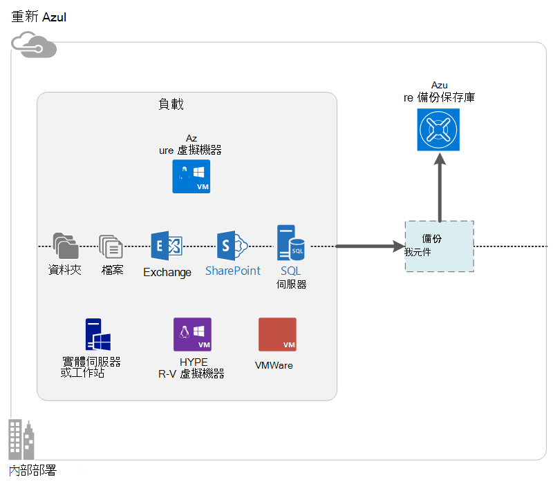

<properties
    pageTitle="什麼是 Azure 備份？ |Microsoft Azure"
    description="藉由使用 Azure 備份及復原服務，您可以備份及還原 Windows 伺服器 Windows 用戶端電腦與系統管理中心 DPM 伺服器 Azure 虛擬機器中的 [資料和應用程式。"
    services="backup"
    documentationCenter=""
    authors="markgalioto"
    manager="cfreeman"
    editor="tysonn"
    keywords="備份與還原。修復服務;備份的解決方案"/>

<tags
    ms.service="backup"
    ms.workload="storage-backup-recovery"
    ms.tgt_pltfrm="na"
    ms.devlang="na"
    ms.topic="get-started-article"
    ms.date="10/19/2016"
    ms.author="jimpark; trinadhk"/>

# 什麼是 Azure 備份？
Azure 備份是用來備份及還原您的資料，在 Microsoft 雲端服務。 它會取代您現有的內部部署或離線備份的解決方案是可靠、 安全，以及成本競爭力雲端解決方案。 並協助保護在雲端中執行的資產。 Azure 備份提供內建在調整、 長期，且高度可用的世界級基礎結構的復原服務。

[觀看視訊 Azure 備份概觀](https://azure.microsoft.com/documentation/videos/what-is-azure-backup/)

## 為什麼要使用 Azure 備份？
傳統備份解決方案有發展出的雲端視為類似磁碟或膠帶貼上的端點。 雖然這種方法是簡單，也是受限制。 它不利用完整的基礎的雲端平台，並將效率，耗費的解決方案。
相反地，Azure 備份提供功能強大且實惠地雲端備份解決方案的所有的優點。 以下是一些 Azure 備份提供的主要優點。

| 功能 | 優勢 |
| ------- | ------- |
| 自動儲存管理 | 沒有資本費用所需的內部部署存放裝置。 Azure 備份自動配置和管理備份的儲存空間，並且使用支付為-您-使用消耗模型。 |
| 不受限制的縮放比例 | 利用可用性保證沒有進行的維修作業負擔與監視。 Azure 備份使用基礎 power 和刻度 Azure 雲端，其干擾自動縮放功能。 |
| 多個儲存選項 | 選擇您備份的儲存空間，根據需要︰<li>在本機上多餘的儲存空間區塊 blob 非常適合用於注重價格的客戶，仍然可以協助保護資料本機硬體失敗。 <li>地理複寫儲存封鎖 blob 提供三個更多份數，即成對資料中心。 這些額外的複本可協助確保您的備份資料的高度可用性，即使發生 Azure 網站層級損毀。 |
| 無限制的資料傳輸 | 從備份保存庫還原作業期間有免費的任何出口 （輸出） 的資料傳輸。 若要輸入資料也是免費的 Azure。 匯入服務，都能運作。 |
| 資料加密 | 安全的傳送和公用雲端中的客戶資料的儲存空間，讓資料加密。 加密複雜密碼已儲存在來源，並不傳送或儲存在 Azure。 加密金鑰，才能還原的任何資料，且只客戶資料的完整存取服務。 |  
| 應用程式一致的備份 | 在 Windows 上的應用程式一致備份有助於確保修正並不需要時還原，減少復原時間目標。 這個選項可讓客戶更快速地返回執行狀態。 |
| 長期保留 | 而非支付離膠帶貼上備份解決方案，客戶可以備份到 Azure，提供以低成本令人讚嘆的類似膠帶貼上的解決方案。 |

## Azure 備份元件
備份是混合式備份解決方案，因為它包含多個元件的共同作業的啟用端對端備份與還原工作流程。

### 部署案例

| 元件 | 可以部署 Azure 嗎？ | 可以是內部部署？ | 支援的目標儲存空間|
| --- | --- | --- | --- |
| Azure 備份代理程式 | 
**[是]**
 
Azure 備份代理程式，可以在任何 Windows Server VM Azure 中執行的部署。
 | 
**[是]**
 
在任何 Windows Server VM 或實體的電腦上，可以部署備份代理程式。
 | 
Azure 備份保存庫
 |
| 系統管理中心資料保護管理員 (DPM) | 
**[是]**

進一步瞭解[如何使用系統管理中心 DPM Azure 中的工作負載的保護](http://blogs.technet.com/b/dpm/archive/2014/09/02/azure-iaas-workload-protection-using-data-protection-manager.aspx)。
 | 
**[是]**
 
瞭解[如何保護工作量及 Vm 資料中心的](https://technet.microsoft.com/library/hh758173.aspx)詳細資訊。
 | 
附加至本機磁碟，
 
Azure 的備份保存庫
 
膠帶貼上 （內部部署只）
 |
| Azure 備份伺服器 | 
**[是]**

進一步瞭解[如何保護使用 Azure 備份 Server Azure 中的工作量](backup-azure-microsoft-azure-backup.md)。
 | 
**[是]**
 
進一步瞭解[如何保護使用 Azure 備份 Server Azure 中的工作量](backup-azure-microsoft-azure-backup.md)。
 | 
附加至本機磁碟，
 
Azure 備份保存庫
 |
| Azure 備份 （VM 分機） | 
**[是]**

Azure 布料的轉印圖樣的一部分

特殊的[服務 (IaaS) 虛擬機器為 Azure 基礎結構的備份](backup-azure-vms-introduction.md)。
 | 
**無**
 
使用系統管理中心 DPM 來備份資料中心的虛擬機器。
 | 
Azure 備份保存庫
 |

### 元件層級的優點和限制

| 元件 | 優點 | 限制 | 復原資料粒度 |
| --- | --- | --- | --- |
| Azure 備份 （火星） 代理程式 | <li>可以備份檔案和資料夾的 Windows 作業系統的電腦，實體或虛擬 （Vm 可以從任何地方內部部署或 Azure）<li>不需要不同的備份伺服器<li>使用 Azure 備份保存庫 | <li>還原三次天備份/檔案層級<li>僅限、 不應用程式檔案/資料夾/大量層級還原注意<li>Linux 不支援 | 大量內容檔案/資料夾 |
| 系統管理中心資料保護管理員 | <li>注意快照 (VSS) 應用程式<li>完整的彈性，來備份的時機<li>復原資料粒度 （全部）<li>可以使用 Azure 備份保存庫<li>Linux 支援 （如果主控 HYPER-V） | <li>缺少的異質性支援 （VMware VM 備份 Oracle 工作量備份）。  | 大量內容檔案/資料夾 / Vm/應用程式 |
| Microsoft Azure 備份伺服器 | <li>注意快照 (VSS) 應用程式<li>完整的彈性，來備份的時機<li>復原資料粒度 （全部）<li>可以使用 Azure 備份保存庫<li>Linux 支援 （如果主控 HYPER-V）<li>不需要系統管理中心授權 | <li>缺少的異質性支援 （VMware VM 備份 Oracle 工作量備份）。<li>永遠需要即時 Azure 訂閱<li>不支援的備份 | 大量內容檔案/資料夾 / Vm/應用程式 |
| Azure IaaS VM 備份 | <li>Windows/Linux 的原生備份<li>沒有特定代理程式的安裝所需<li>布料的轉印圖樣層級的備份，不需要的備份基礎結構 | <li>一天後向上/磁碟片層級還原<li>無法備份內部部署 | Vm 所有的磁碟 （使用 PowerShell） |

## 哪些應用程式和負載可以備份？

| 工作負載 | 來源電腦 | Azure 備份解決方案 |
| --- | --- |---|
| 檔案和資料夾 | Windows Server | 
[Azure 備份代理程式](backup-configure-vault.md)]
 
[系統管理中心 DPM](backup-azure-dpm-introduction.md)（+ Azure 備份代理程式）
 
[Azure 備份伺服器](backup-azure-microsoft-azure-backup.md)（包括 Azure 備份代理程式）
  |
| 檔案和資料夾 | Windows 用戶端 | 
[Azure 備份代理程式](backup-configure-vault.md)]
 
[系統管理中心 DPM](backup-azure-dpm-introduction.md)（+ Azure 備份代理程式）
 
[Azure 備份伺服器](backup-azure-microsoft-azure-backup.md)（包括 Azure 備份代理程式）
  |
| HYPER-V 虛擬機器 (Windows) | Windows Server | 
[系統管理中心 DPM](backup-azure-backup-sql.md)（+ Azure 備份代理程式）
 
[Azure 備份伺服器](backup-azure-microsoft-azure-backup.md)（包括 Azure 備份代理程式）
 |
| HYPER-V 虛擬機器 (Linux) | Windows Server | 
[系統管理中心 DPM](backup-azure-backup-sql.md)（+ Azure 備份代理程式）
 
[Azure 備份伺服器](backup-azure-microsoft-azure-backup.md)（包括 Azure 備份代理程式）
  |
| Microsoft SQL Server | Windows Server | 
[系統管理中心 DPM](backup-azure-backup-sql.md)（+ Azure 備份代理程式）
 
[Azure 備份伺服器](backup-azure-microsoft-azure-backup.md)（包括 Azure 備份代理程式）
  |
| Microsoft SharePoint | Windows Server | 
[系統管理中心 DPM](backup-azure-backup-sql.md)（+ Azure 備份代理程式）
 
[Azure 備份伺服器](backup-azure-microsoft-azure-backup.md)（包括 Azure 備份代理程式）
   |
| Microsoft Exchange |  Windows Server | 
[系統管理中心 DPM](backup-azure-backup-sql.md)（+ Azure 備份代理程式）
 
[Azure 備份伺服器](backup-azure-microsoft-azure-backup.md)（包括 Azure 備份代理程式）
   |
| Azure IaaS Vm (Windows) | - | [Azure 備份 （VM 分機）](backup-azure-vms-introduction.md) |
| Azure IaaS Vm (Linux) | - | [Azure 備份 （VM 分機）](backup-azure-vms-introduction.md) |

## ARM 與 Linux 支援

| 元件 | ARM 支援 | Linux (Azure 背書) 支援 |
| --- | --- | --- |
| Azure 備份 （火星） 代理程式 | [是] | 沒有 （Windows 基礎代理程式） |
| 系統管理中心資料保護管理員 | 是 （代理程式中來賓） | HYPER-V (不 Azure VM) 只檔案一致備份有可能是 |
| Azure 備份伺服器 (MABS) | 是 （代理程式中來賓） | HYPER-V (不 Azure VM) 只檔案一致的備份可能只 （和 DPM 相同） |
| Azure IaaS VM 備份 | [是] | [是] |

[AZURE.INCLUDE [learn-about-deployment-models](../../includes/learn-about-deployment-models-include.md)]

## 備份及還原進階版儲存 Vm

Azure 備份服務現在保護進階版儲存 Vm。

### 備份進階版儲存 Vm

備份進階版儲存 Vm，時備份服務，請在進階版儲存帳戶建立暫時暫存的位置。 暫存的位置，名為 「 AzureBackup-、 「 等於進階版磁碟附加至 VM 加總資料大小。

>[AZURE.NOTE] 請勿修改或編輯的暫存的位置。

一旦備份工作完成時，會刪除暫存的位置。 用於暫存位置的儲存空間的價格是與所有[進階版儲存價格](../storage/storage-premium-storage.md#pricing-and-billing)一致。

### 還原進階版儲存 Vm

進階版儲存 VM 可以還原，[進階版儲存空間或標準的儲存空間。 還原回到進階版儲存空間的進階版儲存 VM 復原點是還原的一般程序。 不過，可將進階版儲存 VM 復原點還原為標準存放實際成本。 如果您需要 VM 來自檔案的子集，可還原此類型。

## 功能
這五個資料表合併彙算的方式備份功能處理的每個元件。

### 儲存空間

| 功能 | Azure 備份代理程式 | 系統管理中心 DPM | Azure 備份伺服器 | Azure 備份 （VM 分機） |
| ------- | --- | --- | --- | ---- |
| Azure 備份保存庫 | ![[是]][green] | ![[是]][green] | ![[是]][green] | ![[是]][green] |
| 磁碟儲存空間 | | ![[是]][green] | ![[是]][green] |  |
| 膠帶貼上儲存空間 | | ![[是]][green] |  | |
| 壓縮 （備份保存庫） | ![[是]][green] | ![[是]][green]| ![[是]][green] | |
| 遞增備份 | ![[是]][green] | ![[是]][green] | ![[是]][green] | ![[是]][green] |
| 磁碟 deduplication | | ![部分][yellow] | ![部分][yellow]| | |

備份保存庫是較佳的儲存目標所有元件。 系統管理中心 DPM 和備份伺服器也提供讓本機磁碟複本的選項。 不過，系統管理中心 DPM 提供將資料寫入膠帶貼上儲存裝置選項。

#### 遞增備份
每個元件支援增量備份，無論目標儲存空間 （磁碟、 膠帶貼上、 備份保存庫）。 遞增備份可確保備份儲存與時間有效，以轉接自上次備份後所做的變更。

#### 壓縮
備份會壓縮以減少的所需的儲存空間。 不使用壓縮只元件是 VM 副檔名。 VM 副檔名備份的所有資料從都複製的客戶儲存帳戶到備份的保存庫中的相同的地區的情況下。 稍微移未壓縮擴大使用儲存空間，而儲存資料而不壓縮可讓您更快速地還原時間。

#### Deduplication
Deduplication 支援系統管理中心 DPM 和備份伺服器時，就[HYPER-V 虛擬機器中部署](http://blogs.technet.com/b/dpm/archive/2015/01/06/deduplication-of-dpm-storage-reduce-dpm-storage-consumption.aspx)。 虛擬硬碟 (Vhd) 附加至為備份儲存在虛擬機器上使用 Windows Server deduplication deduplication 執行主機層級。

>[AZURE.WARNING] 無法使用中的任何備份元件 Azure deduplication。 系統管理中心 DPM 和備份伺服器是 Azure 中部署，就無法 deduplicated 附加至 VM 儲存磁碟。

### 安全性

| 功能 | Azure 備份代理程式 | 系統管理中心 DPM | Azure 備份伺服器 | Azure 備份 （VM 分機） |
| ------- | --- | --- | --- | ---- |
| 網路安全性] （Azure) | ![[是]][green] |![[是]][green] | ![[是]][green] | ![部分][yellow]|
| 資料 （在 Azure) 的安全性 | ![[是]][green] |![[是]][green] | ![[是]][green] | ![部分][yellow]|

使用進階加密標準 256 加密所有備份流量導向從您的伺服器備份保存庫。 透過安全 HTTPS 連結傳送資料。 備份資料也會儲存於加密的表單中的備份保存庫中。 客戶僅保留複雜密碼解除鎖定此資料。 Microsoft 無法解密隨時備份資料。

>[AZURE.WARNING] 用來加密備份資料的金鑰是只與客戶的簡報。 Microsoft 不會保留在 Azure 複本，並沒有任何存取金鑰。 如果鍵時，Microsoft 就無法復原備份資料。

備份 Azure Vm 需要設定加密*內*虛擬機器。 您可以使用 BitLocker 上 Windows 虛擬機器和**dm 窖**Linux 虛擬機器上。 Azure 備份不會自動加密是透過此路徑的備份資料。

### 支援的工作量

| 功能 | Azure 備份代理程式 | 系統管理中心 DPM | Azure 備份伺服器 | Azure 備份 （VM 分機） |
| ------- | --- | --- | --- | ---- |
| Windows Server 的電腦，檔案和資料夾 | ![[是]][green] | ![[是]][green] | ![[是]][green] | |
| Windows 用戶端電腦，檔案和資料夾 | ![[是]][green] | ![[是]][green] | ![[是]][green] | |
| HYPER-V 虛擬機器 (Windows) | | ![[是]][green] | ![[是]][green] | |
| HYPER-V 虛擬機器 (Linux) | | ![[是]][green] | ![[是]][green] | |
| Microsoft SQL Server | | ![[是]][green] | ![[是]][green] | |
| Microsoft SharePoint | | ![[是]][green] | ![[是]][green] | |
| Microsoft Exchange  | | ![[是]][green] | ![[是]][green] | |
| Azure 虛擬機器 (Windows) | | | | ![[是]][green] |
| Azure 虛擬機器 (Linux) | | | | ![[是]][green] |

### 網路

| 功能 | Azure 備份代理程式 | 系統管理中心 DPM | Azure 備份伺服器 | Azure 備份 （VM 分機） |
| ------- | --- | --- | --- | ---- |
| 網路壓縮 （若要備份的伺服器） | | ![[是]][green] | ![[是]][green] | |
| 網路壓縮 （若要備份的保存庫） | ![[是]][green] | ![[是]][green] | ![[是]][green] | |
| 網路通訊協定 （若要備份的伺服器） | | TCP | TCP | |
| 網路通訊協定 （若要備份的保存庫） | HTTPS | HTTPS | HTTPS | HTTPS |

因為 VM 副檔名為讀取直接從 Azure 儲存體帳戶儲存網路上的資料，並不需要最佳化此流量。 流量因為透過 Azure 資料中心、 本機存放區網路，因此不需要使用壓縮頻寬考量。

如果您要備份您的資料，到備份伺服器 （DPM 或備份伺服器），可以儲存在頻寬上壓縮主要伺服器備份伺服器的流量。

#### 網路節流
Azure 備份代理程式提供節流功能，可讓您控制網路頻寬期間的資料傳輸的使用方式。 節流可以很有幫助，如果您要備份資料期間工作時數，但不是想避免圖片干擾其他網際網路流量的備份程序。 節流的資料傳輸適用於備份及還原活動。

### 備份及保留

|  | Azure 備份代理程式 | 系統管理中心 DPM | Azure 備份伺服器 | Azure 備份 （VM 分機） |
| --- | --- | --- | --- | --- |
| 備份的頻率 （若要備份的保存庫） | 每日的三個備份 | 每日的兩個備份 |每日的兩個備份 | 每日備份 |
| 備份的頻率 （到磁碟） | 不適用 | 
SQL Server 每 15 分鐘
 
每小時的其他工作負載
 | 
SQL Server 每 15 分鐘
 
每小時的其他工作負載
 |不適用 |
| 保留選項 | 每日、 每週、 每月、 每年 | 每日、 每週、 每月、 每年 | 每日、 每週、 每月、 每年 |每日、 每週、 每月、 每年 |
| 保留期間 | 最多 99 年 | 最多 99 年 | 最多 99 年 | 最多 99 年 |
| 備份保存庫中的 [復原點 | 無限制 | 無限制 | 無限制 | 無限制 |
| 在本機磁碟上的 [復原點 | 不適用 | 64 檔案伺服器  應用程式伺服器的 448 | 64 檔案伺服器  應用程式伺服器的 448 |不適用 |
| 復原點上膠帶貼上 | 不適用 | 無限制 | 不適用 | 不適用 |

## 什麼是保存庫認證檔案？

保存庫認證檔案是每個備份保存庫的入口網站所產生的憑證。 入口網站然後上傳公開金鑰存取控制服務 (ACS)。 私密金鑰下載憑證時提供給使用者，而期間的電腦登錄，然後輸入。 私密金鑰驗證傳送備份資料中的備份 Azure 服務識別保存庫至電腦。

只在註冊工作流程會使用保存庫認證。 您必須負責確保保存庫認證檔案不會遭到盜用。 如果它位於的任何惡意使用者，保存庫認證檔案可以用於註冊針對相同保存庫其他電腦。 不過，由於備份資料已加密使用複雜密碼僅屬於客戶，不會洩漏現有的備份資料。 若要降低這方面，保存庫認證是設定為過期 48 小時內。 您可以下載的備份保存庫認證地窖任何數字的次數，最新的檔案時適用註冊工作流程。

## Azure 備份和 Azure 網站復原有何不同？
備份修復和損壞修復，許多客戶令人混淆。 同時擷取資料，並提供還原語意，但其核心值建議有不同。

Azure 的備份會設定資料內部部署和雲端中。 Azure 網站復原協調虛擬機器和實體伺服器複寫容錯移轉時，與回復。 因為損毀修復解決方案需要保留您的資料安全，並可復原 （備份）*並*保留您的工作量可用 （網站復原） 中斷問題發生時，這兩種服務很重要。

下列概念可協助您進行備份與損毀的復原周圍的重要決策。

| 概念 | 詳細資料 | 備份 | 損毀修復 (DR) |
| ------- | ------- | ------ | ----------------- |
| 復原點目標 (RPO) | 如果需要完成的復原，可接受的資料遺失的數量。 | 備份解決方案有其接受 RPO 寬變化。 虛擬機器備份通常只有 RPO 的一天，而資料庫備份 RPOs 低 15 分鐘。 | 修復損毀的解決方案有低 RPOs。 DR 複製可前幾秒鐘或幾分鐘的時間。 |
| 復原時間目標 (RTO) | 完成修復或還原所需的時間量。 | 由於較大的 RPO，備份解決方案需要處理的資料量是通常是更高，這會造成 Rto 更長的時間。 例如，可能需要天，若要從磁帶，根據傳輸從地點膠帶貼上的時間。 | 損毀修復解決方案有較小的 Rto，因為它們是更多同步與來源。 需要處理較少的變更。 |
| 保留 | 需要儲存資料的長度 | 需要操作復原資料損毀，刪除不小心檔案 （OS 失敗） 的情況下，30 天之內，通常是，保留備份資料。 資料法規遵循的觀點來看，可能需要儲存月或甚至年數。 備份資料適用於封存這種情況。 | 損毀修復必須只操作復原資料，這通常是所需的時間幾小時或一整天。 精密的資料擷取 DR 方案中使用，因為不建議使用長期保留 DR 資料。 |

## 後續步驟

試試簡單 Azure 備份。 如需相關指示，請參閱這些教學課程︰

- [請嘗試 Azure 的備份](backup-try-azure-backup-in-10-mins.md)
- [請嘗試 Azure VM 備份](backup-azure-vms-first-look.md)

因為這些教學課程幫助您備份快速，即會顯示您最直接路徑的備份資料。 如需有關備份您的類型要做，請參閱︰

- [備份 Windows 電腦](backup-configure-vault.md)
- [備份應用程式工作負載](backup-azure-microsoft-azure-backup.md)
- [備份 Azure IaaS Vm](backup-azure-vms-prepare.md)

[green]: ./media/backup-introduction-to-azure-backup/green.png
[yellow]: ./media/backup-introduction-to-azure-backup/yellow.png
[red]: ./media/backup-introduction-to-azure-backup/red.png
