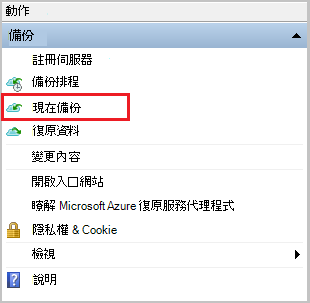

<properties
   pageTitle="瞭解如何備份檔案和資料夾從 Windows Azure 與使用資源管理員部署模型 Azure 備份 |Microsoft Azure"
   description="瞭解如何建立保存庫、 安裝修復服務代理程式，並以 Azure 備份您的檔案與資料夾備份 Windows Server 資料。"
   services="backup"
   documentationCenter=""
   authors="markgalioto"
   manager="cfreeman"
   editor=""
   keywords="如何備份。若要備份的方式"/>

<tags
   ms.service="backup"
   ms.workload="storage-backup-recovery"
   ms.tgt_pltfrm="na"
   ms.devlang="na"
   ms.topic="hero-article"
   ms.date="09/27/2016"
   ms.author="markgal;"/>

# 第一次查看︰ 備份檔案和資料夾與使用資源管理員部署模型 Azure 備份

本文說明如何備份您的 Windows Server （或 Windows 用戶端） 要與使用資源管理員 Azure 備份 Azure 檔案和資料夾。 這是用來逐步引導您完成基本概念的教學課程。 如果您想要開始使用 Azure 備份，您是在正確的位置。

如果您想要深入瞭解 Azure 備份，請閱讀本[概觀](backup-introduction-to-azure-backup.md)。

檔案及資料夾備份到 Azure 需要這些活動︰

取得 Azure 訂閱 （如果您還沒有其中一個）。 
建立修復服務保存庫。 
下載必要的檔案。 
安裝並註冊修復服務代理程式。 
備份您的檔案和資料夾。

## 步驟 1︰ 取得 Azure 訂閱

如果您沒有 Azure 訂閱，建立可讓您存取任何 Azure 服務的[免費的帳戶](https://azure.microsoft.com/free/)。

## 步驟 2︰ 建立修復服務保存庫

若要備份您的檔案和資料夾，您需要建立修復服務保存庫中您想要用來儲存資料的地區。 您也需要決定您要您複製的儲存空間的方式。

### 若要建立修復服務保存庫

1. 如果您尚未登入至[Azure 入口網站](https://portal.azure.com/)使用 Azure 訂閱這麼做。

2. 在中心] 功能表中，按一下 [**瀏覽**和在資源的清單中，輸入**修復服務**並按一下**修復服務保存庫**。

      

3. 在 [**復原服務保存庫**] 功能表中，按一下 [**新增**。

    

    修復服務保存庫刀開啟時，它會提示您提供的**名稱**、**訂閱**、 [**資源] 群組**中，與**位置**。

    

4. [**名稱**] 中，輸入好記的名稱來識別保存庫。

5. 按一下以查看可用的訂閱清單的**訂閱**]。

6. 按一下 [**資源群組**以查看可用的資源群組清單，或按一下 [**新增**]，建立新的資源群組。

7. 按一下以選取保存庫的地理區域的**位置**。 此選項會決定您的備份資料會傳送位置的地理區域。

8. 按一下 [**建立**]。

    如果您沒有看到已經完成後，列出您保存庫，請按一下 [**重新整理**]。 重新整理清單中，按一下 [保存庫的名稱。

### 若要判斷儲存複本
當您第一次建立修復服務保存庫您決定如何複製儲存空間。

1. 按一下 [新的保存庫，以開啟儀表板上。

2. 在**設定**刀，會自動開啟與保存庫儀表板，按一下 [**備份基礎結構**]。

3. 在 [備份基礎結構刀中，按一下 [**備份設定**，若要檢視**儲存複寫類型**]。

    

4. 選擇您保存庫適當的儲存空間複寫選項。

    

    根據預設，您保存庫有地理多餘的儲存空間。 如果您使用 Azure 為主要備份儲存端點，繼續使用地理多餘的儲存空間。 如果您使用 Azure 為非主要備份存放端點，請選擇 [本機多餘的儲存空間，來減少 Azure 中儲存資料的成本。 瞭解更多關於[地理多餘](../storage/storage-redundancy.md#geo-redundant-storage)和本[概觀](../storage/storage-redundancy.md)[本機多餘](../storage/storage-redundancy.md#locally-redundant-storage)的儲存空間選項。

現在，您已建立保存庫，您準備好您的基礎結構下載 Microsoft Azure 修復服務代理程式和保存庫認證備份檔案和資料夾。

## 步驟 3-下載檔案

1. 按一下 [修復服務保存庫儀表板上的 [**設定**]。

    

2. 按一下 [**快速入門 > 備份**設定刀上。

    

3. 按一下備份刀**備份目標**。

    

4. 選取從何處**內部部署**是您執行的工作量？功能表。

5. 選取**檔案和資料夾**，從您做什麼想要備份嗎？] 功能表中，按一下**[確定]**。

### 下載修復服務代理程式

1. 按一下 [**下載代理程式的 Windows 伺服器或 Windows 用戶端**中**準備基礎結構**刀。

    

2. 按一下 [下載快顯中的 [**儲存**]。 根據預設， **MARSagentinstaller.exe**檔案會儲存到您的 [下載] 資料夾。

### 下載保存庫認證

1. 按一下 [**下載 > 儲存**準備基礎結構刀上。

    

## 步驟 4-安裝並註冊代理程式

>[AZURE.NOTE] 即將推出啟用透過 Azure 入口網站的備份。 此時，您可以使用 Microsoft Azure 修復服務代理內部備份您的檔案和資料夾。

1. 找出並按兩下**MARSagentinstaller.exe**從 [下載] 資料夾 （或其他儲存的位置）。

2. 完成 Microsoft Azure 復原服務代理程式安裝精靈。 若要完成精靈，您需要︰

    - 選擇 [安裝及快取] 資料夾的位置。
    - 如果您使用 proxy 伺服器連線到網際網路，提供您的 proxy 伺服器資訊。
    - 如果您是使用已驗證的 proxy，提供您的使用者名稱和密碼的詳細資訊。
    - 提供下載保存庫認證
    - 將加密複雜密碼儲存在安全的位置。

    >[AZURE.NOTE] 如果您遺失或忘記密碼複雜密碼時，Microsoft 就無法協助復原備份資料。 請將檔案儲存在安全的位置。 需要還原的備份。

立即安裝代理程式，而且您的電腦註冊保存庫。 您準備好要設定及排程備份。

## 步驟 5︰ 備份您的檔案和資料夾

初始的備份包含兩個主要的工作︰

- 排程備份
- 第一次備份檔案和資料夾

若要完成初始備份，您可以使用 Microsoft Azure 修復服務代理程式。

### 若要排程的備份

1. 開啟 Microsoft Azure 修復服務代理程式。 您可以藉由搜尋**Microsoft Azure 備份**您的電腦找到它。

    

2. 在修復服務代理程式中，按一下 [**排程備份**]。

    

3. 在 [排程備份精靈] 的 [快速入門] 頁面中，按一下 [**下一步**]。

4. 在 [選取項目備份頁面，按一下 [**新增項目]**。

5. 選取的檔案與您想要備份的資料夾，然後再按一下 [**好**]。

6. 按一下 [**下一步**]。

7. 在 [**指定備份的排程**] 頁面中，指定**備份的排程**，然後按一下 [**下一步**]。

    您可以排程 （最大的速率每日三次） 每天或每週的備份。

    

    >[AZURE.NOTE] 如需有關如何指定備份的排程，請參閱[使用 Azure 備份取代膠帶貼上基礎結構](backup-azure-backup-cloud-as-tape.md)的詳細資訊。

8. 在 [**選取的保留原則**] 頁面上選取的**保留原則**備份複本。

    保留原則指定儲存備份的工期。 而不只指定備份的所有點的 「 一般原則 」，您可以指定不同的保留原則以備份發生的時間。 您可以修改以符合您需求的每日、 每週、 每月和年的保留原則。

9. 在 [選擇初始備份類型] 頁面上選擇初始備份類型。 保留**在網路上的自動**選取，] 選項，然後按一下 [**下一步**。

    您可以自動備份到網路，或您可以備份離線。 這篇文章的其餘部分說明自動備份的程序。 如果您想要執行離線備份，檢閱文件[中 Azure 備份離線備份工作流程](backup-azure-backup-import-export.md)的其他資訊。

10. 在 [確認] 頁面上檢閱資訊，，然後再按一下 [**完成]**。

11. 精靈完成建立備份排程後，請按一下 [**關閉**]。

### 第一次備份檔案和資料夾

1. 在修復服務代理程式中，按一下 [**立刻備份**完成初始種子在網路上。

    

2. 在 [確認] 頁面上檢閱備份現在精靈會使用備份電腦的設定。 然後按一下 [**備份**。

3. 按一下 [**關閉**] 以關閉精靈。 如果備份的程序完成之前，您可以這麼做，精靈會繼續在背景中執行。

初始的備份已完成之後，**完成的工作**狀態會出現在備份主控台。

## 問題嗎？
如果您有問題，或任何 」 功能，您想要包含在內，請[將意見反應傳送給我們](http://aka.ms/azurebackup_feedback)。

## 後續步驟
- 取得更多詳細資料[備份 Windows 的電腦](backup-configure-vault.md)。
- 現在您已備份您的檔案和資料夾，您可以[管理您的保存庫和伺服器](backup-azure-manage-windows-server.md)。
- 如果您要還原的備份，請使用此文章，以[還原到 Windows 的電腦的檔案](backup-azure-restore-windows-server.md)。
