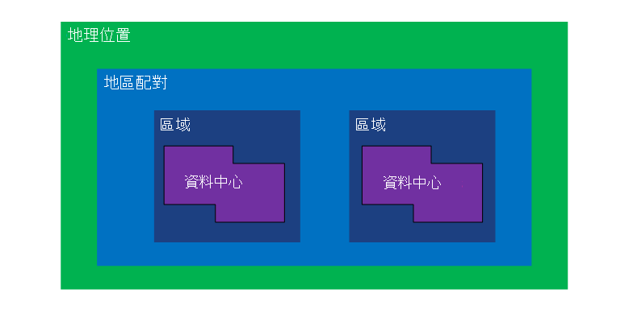
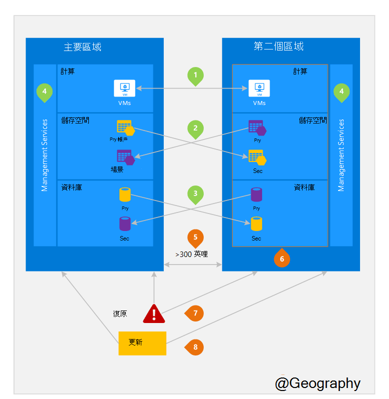

<properties
    pageTitle="業務連續性與損毀復原 (BCDR): Azure 配對區域 |Microsoft Azure"
    description="Azure 地區組確定應用程式時，是同時資料中心失敗。"
    services="site-recovery"
    documentationCenter=""
    authors="rayne-wiselman"
    manager="jwhit"
    editor=""/>

<tags
    ms.service="site-recovery"
    ms.workload="storage-backup-recovery"
    ms.tgt_pltfrm="na"
    ms.devlang="na"
    ms.topic="article"
    ms.date="08/23/2016"
    ms.author="raynew"/>

# 業務連續性與損毀復原 (BCDR): Azure 配對區域

## 什麼被配對區域？

Azure 運作世界各地的多個地區。 Azure 的地理位置是全球包含至少一個 Azure 區域的已定義的區域。 Azure 地區是包含一或多個資料中心地理區域內的區域。

每個 Azure 區域被搭配相同的地理位置，同時進行地區的組內的其他區域。 例外是巴西南部這搭配其地理區域外的區域。

圖 1 – Azure 地區組合圖表

| 地理位置     |  成對的區域  |                     |
| :-------------| :-------------   | :-------------      |
| 北美地區 | 北美美國中部 | 美國中部南美洲    |
| 北美地區 | 設定適用於美國          | 西美制]。             |
| 北美地區 | 美國東部 2        | 美國中部          |
| 北美地區 | 西美國 2        | 西部美國中部     |
| 在 Europe        | 北美歐洲     | 西歐         |
| 亞洲          | 東南亞  | 中式地址           |
| China （中國)         | 東亞 china （中國)       | 北美 china （中國)         |
| 日本         | 日本東亞       | 日本西部          |
| 巴西        | 巴西南部 (1) | 美國中部南美洲    |
| 澳大利亞     | 澳大利亞東亞   | 澳大利亞 Southeast |
| 美國政府 | 美國 Gov 稍後      | 美國 Gov 維吉尼亞州     |
| 印度         | 中央印度    | 南美洲印度         |
| 加拿大        | 加拿大中部   | 加拿大東亞         |
| UK （英國)            | 西部 uk （英國）          | 南部 uk （英國）            |

資料表 1-azure 地區組的對應

> （1） 巴西南部是唯一的因為成對自己的地理位置以外的區域。 巴西南部次要地區是美國中部南部但南部美國中部的次要地區不巴西南部。

我們建議您要複製負載跨地區組，以受益 Azure 的隔離及可用性原則。 計劃 Azure 系統更新，例如，依序部署 （不同時） 跨成對的區域。 這表示，即使在有錯誤的更新少見的事件，兩個區域不會影響同時。 此外，在主要的資料不太事件中，每組登出至少有一個區域的復原是排列優先順序。

## 範例，即成對的區域
圖 2 下方會顯示假設的應用程式損毀修復使用地區配對。 綠色的數字反白顯示跨地區活動的三個 Azure 服務 （Azure 計算、 儲存及資料庫），然後複製各區域的設定方式。 部署各成對地區唯一的優點會醒目提示橘色的數字。

圖 2-假設 Azure 地區配對

## 跨地區活動
如同在圖表中 2。

 **Azure 計算 (PaaS)** -您必須提供預先以確保資源可供您在另一個區域期間損毀的其他計算資源。 如需詳細資訊，請參閱[Azure 恢復技術指南](./resiliency/resiliency-technical-guidance.md)。

 **Azure 儲存體**地理多餘的儲存空間 (GRS) 設定預設建立 Azure 儲存體帳戶時。 GRS，與您的資料會自動複寫三次的主要區域，且三次成對的區域。 如需詳細資訊，請參閱[Azure 儲存體重複性的選項](storage/storage-redundancy.md)。

 **Azure SQL 資料庫**– 使用 Azure SQL 標準地理複寫，您可以設定非同步複寫的交易，即成對的區域。 進階版地理複寫，您可以設定複寫任何區域在全世界的哪個;不過，我們建議您部署這些資源大部分損毀修復狀況即成對區域中。 如需詳細資訊，請參閱[Azure SQL 資料庫中的地理-複寫](./sql-database/sql-database-geo-replication-overview.md)。

 **Azure 資源管理員 (ARM)** ARM 原本就是提供的服務管理元件的邏輯隔離各區域。 代表一個區域中的邏輯失敗比較不會影響其他項目。

## 成對區域的優點
如同在圖表中 2。  

**實體隔離**– 可能的話，Azure 慣用至少 300 英哩的地區的組中的資料中心之間的分隔雖然這不實務或可能在所有的地區。 實體資料中心的分隔降低自然損毀、 動盪、 電源，或一次影響兩個區域的實體網路中斷的可能性。 隔離是地理區域 （地理位置大小、 power/網路基礎結構可用性、 法規等） 中的限制。  

**平台提供複寫**有些服務，例如地理多餘的儲存空間提供自動複寫，即成對的區域。

**地區復原順序**– 時主要中斷、 復原的一個區域選擇優先將每組登出。 部署跨成對區域的應用程式並保證有下列其中一區域已復原的優先順序。 如果應用程式部署跨不成對出現的區域，修復可能會延遲 – 表現最差所選的區域的復原最後的兩個可能的大小寫。

**連續更新**– 更新導入成對區域循序計劃 Azure 系統 （不同時） 到最小化停機時間、 錯誤和不正確的更新的少見事件中的邏輯失敗的效果。

**資料 residency** – 區域以符合資料 residency 需求進行稅和法律強制執行轄區位於相同的地理位置為其對 （但巴西南部）。

