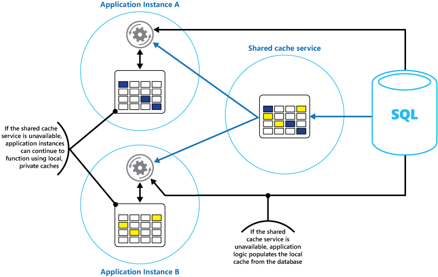

<properties
   pageTitle="快取指引 |Microsoft Azure"
   description="快取以改善效能與延展性的指南。"
   services=""
   documentationCenter="na"
   authors="dragon119"
   manager="christb"
   editor=""
   tags=""/>

<tags
   ms.service="best-practice"
   ms.devlang="na"
   ms.topic="article"
   ms.tgt_pltfrm="na"
   ms.workload="na"
   ms.date="07/14/2016"
   ms.author="masashin"/>


# <a name="caching-guidance"></a>快取的指導方針

[AZURE.INCLUDE [pnp-header](../includes/guidance-pnp-header-include.md)]

快取是以改善效能與延展性系統的目標是常見技巧。 它會暫時將經常存取的資料複製到位於 [關閉] 以快速儲存應用程式。 如果這個快速的資料儲存區位於往比原始來源應用程式，然後快取大幅可以改善用戶端應用程式的回應的時間，更快速地提供服務的資料。

快取時，最有效率的用戶端執行個體重複讀取相同的資料，尤其是如果下列所有條件都套用至原始資料存放區︰
- 它會保留相對靜態。
- 速度很慢比較快取的速度。
- 它會受到高層級的競爭。
- 它就遠網路延遲可能會導致的存取權會變得很慢。

## <a name="caching-in-distributed-applications"></a>分散式應用程式中的快取

當快取資料的分散式應用程式通常實作下列其中一項或兩個下列策略︰

- 使用資料本機保留執行應用程式或服務的執行個體的電腦的私人快取。
- 使用共用的快取，做為常見的來源的可存取多個程序及/或機器。

在這兩種情況下，快取，才能執行用戶端 / 伺服器端。 用戶端快取，是由系統，例如網頁瀏覽器或桌面應用程式中提供的使用者介面的程序。
伺服器端快取程序所提供的遠端執行商務服務，即可完成。

### <a name="private-caching"></a>私人快取

快取的最基本類型是記憶體內儲存。 它具有保存在一個程序的位址空間，並直接存取該程序中執行的程式碼。 此類型的快取是非常快速存取。 它也可以提供太有效方法儲存適度大量靜態資料，因為快取大小通常會受到的主機服務程序的電腦上的記憶體音量。

如果您需要快取大於實際可能在記憶體中的詳細資訊，您可以在本機檔案系統中寫入快取的資料。 這會比持有記憶體中，資料存取速度變慢，但仍應為更快且更可靠比網路擷取資料。

如果您有多個使用同時執行此模型的應用程式執行個體，每個應用程式執行個體會有自己獨立的快取保留本身的資料。

將快取視為有些時候原始資料的快照過去的。 如果不是靜態此資料，則可能不同的應用程式的執行個體的保留其快取中的不同版本的資料。 因此，這些執行個體來執行相同的查詢可以傳回不同的結果，如下圖所示圖 1。


_圖 1︰ 使用不同的應用程式的執行個體中記憶體內快取_

### <a name="shared-caching"></a>共用快取

使用共用的快取，可協助減輕資料可能會不同於每個快取，可能會發生記憶體內快取的疑慮。 共用快取，可確保不同的應用程式的執行個體，請參閱快取資料的同一個檢視。 它會尋找快取中的另一個位置，通常是裝載屬於不同的服務，如下圖所示圖 2] 中。


_圖 2︰ 使用共用的快取_

重要的優點共用快取是方法的它所提供的擴充。 許多共用快取服務會使用伺服器叢集，來實作，並利用分散叢集中的資料，以公的軟體。 應用程式執行個體只會傳送至快取服務的要求。
基礎結構負責決定叢集的快取資料的位置。 您可以輕鬆地調整快取，藉由新增更多的伺服器。

有兩個主要的共用的快取方法缺點︰
- 快取是存取，因為它不再保留本機每個應用程式執行個體的速度變慢。
- 實作不同的快取服務要求可能會將複雜度加入方案。

## <a name="considerations-for-using-caching"></a>使用 [快取的考量

下列各節說明更詳細的考量設計和使用快取。

### <a name="decide-when-to-cache-data"></a>決定何時快取資料

快取可以大幅改善效能、 延展性及可用性。 您有更多資料和較大的數目需要使用者存取此資料，就會更快取的好處。 這是因為延遲和處理大量的原始資料存放區中的一個要求與相關聯的競爭快取可減少。

例如，資料庫可能支援有限的同時連線。 從共用快取中擷取資料，不過，而不是基礎的資料庫，可讓您能存取此資料，即使使用連線數目目前用完用戶端應用程式。 此外，如果無法使用的資料庫，用戶端應用程式可能可以繼續使用快取中保留的資料。

請考慮快取資料經常閱讀但修改不常 （例如，有較高的比例讀取操作的非寫入作業的資料）。 不過，不建議您為重要資訊代表性儲存使用快取。 不過，確保您的應用程式不得遺失的所有變更永遠都儲存常設資料存放區。 這表示，如果無法使用快取與您的應用程式還是可以繼續使用資料存放區來操作您不會遺失重要資訊。

### <a name="determine-how-to-cache-data-effectively"></a>決定如何有效地快取資料

有效地使用快取中的關鍵在於判斷最適合資料快取以和快取適當的時機。 可以新增資料至應用程式擷取視需要在第一次快取。 這代表應用程式需要從資料存放區中，擷取資料一次，以及可以使用 [快取滿足後續存取權。

或者，快取部分或完整填入資料事先，通常是應用程式啟動 （亦稱為種子一種方法） 時。 不過，可能不建議在實作種子大型的快取，因為這種方法可以強制原始資料存放區突然、 高負載時執行啟動應用程式。

經常使用模式分析可協助您決定是否為完全或部分預先填入快取，並選擇 [快取資料。 例如，很有用植靜態使用者設定檔資料快取客戶使用的應用程式定期 （可能是每日），但不是使用的應用程式一次一週的客戶。

快取通常搭配也不變，或不常變更的資料。 範例包括電子商務應用程式，或共用靜態資源成本建構的參考資訊，例如產品和價格資訊。 部分或所有資料都可以都載入快取應用程式啟動時最小化資源需求，並改善效能。 也可能有背景的程序會定期更新參照，確定其快取中的資料是最新狀態，或的重新整理快取適當時參照的資料變更。

快取適合較少的動態資料，還有一些考量的例外狀況 （請參閱本文稍後的詳細資訊的快取高度動態資料] 區段）。 當原始資料經常變更時，請很快就過期快取的資訊，或與原始的資料存放區中同步處理快取的成本減少的快取。

請注意，快取沒有要包含的實體完整的資料。 例如，如果資料項目表示多重值的物件，例如銀行客戶的名稱、 地址，與帳戶餘額，某些這些項目可能會維持靜態 （例如名稱和地址），而其他人 （例如帳戶餘額） 可能會更動態。 在下列情況下，可以較為有用快取資料的靜態部分，並擷取 （或計算） 其餘的資訊時所需。

我們建議您執行效能測試及使用方式分析，以決定是否適合預先填入或視載入快取或兩者的組合。 決定應該根據可與使用模式的資料。 快取使用情況和效能分析是特別重要的應用程式，會遇到的高度負載，而且必須彈性。 例如，彈性的案例中，可能會意義植快取以減少資料存放區上的載入時間最大使用量。

快取也可以用來避免在執行應用程式時，請重複計算。 如果資料轉換作業，或執行複雜的計算，就可以節省作業的結果快取中。 如果相同的計算需要之後，應用程式可以直接從快取擷取結果。

應用程式，可以修改會保留在快取中的資料。 不過，我們建議您隨時都可以消失暫時性資料儲存區快取的想法。 不要儲存; 快取中的重要的資料請確定您有原始資料存放中的資訊。 這表示，如果無法使用快取，您最小化遺失資料的機率。

### <a name="cache-highly-dynamic-data"></a>快取高度動態資料

當您儲存快速變更資訊常設資料儲存區中時，它可以強制開銷系統上。 例如，請考慮持續報表狀態或其他度量單位的裝置。 如果應用程式未選擇此幾乎一定會過時的快取的資訊為基礎的資料快取，相同的考量可能是 true 時儲存和資料存放區擷取這項資訊。 在 [儲存並擷取此資料所需的時間，它可能已變更。

在這種情況下，請考慮優點直接在而不是常設資料存放區中的快取中儲存的動態資訊。 如果資料不重要，而不需要稽核，然後不論偶爾發生的變更會遺失。

### <a name="manage-data-expiration-in-a-cache"></a>管理快取中的資料過期

在大部分情況下，會保留在快取中的資料是一份保留原始資料存放區中的資料。 自快取，導致快取的資料以已過時之後，可能會變更原始資料存放區中的資料。 許多快取系統可讓您設定的快取過期資料，並減少的期間的資料可能已過期。

當快取的資料到期時，就會從快取中移除，應用程式必須從原始資料儲存區 （它可以回復新擷取資訊到快取） 擷取資料。 當您設定快取，您可以設定預設到期原則。 您也可以在許多快取服務中，規定個別物件的到期時，您將它們儲存以程式設計方式快取中。
某些快取可讓您有效期限或指定為絕對值]，滑動值，如果未指定的時間內存取，會從快取的項目。 此設定會覆寫任何快取整個到期原則，但僅適用於指定的物件。

> [AZURE.NOTE] 請考慮快取及其中的物件，其中包含謹慎的到期。 如果您進行太短，物件便會到期太快，您將會減少使用快取的優點。 若太長期間，您可能會變得過時的資料。

您也可快取可能填滿，如果允許資料會維持駐留很長的時間。 在此情況下，將新項目新增至快取的任何要求可能會導致強制移除稱為收回程序中的某些項目。 快取服務通常收回資料小最近使用過的 (LRU)，但您通常可以覆寫此原則並防止被移除項目。 不過，如果您採用這種方法，您可能會出現與超出快取中可用的記憶體。 若要將項目新增至快取的應用程式將會失敗的例外狀況。

某些快取實作可能會提供其他收回原則。 有許多種類型的收回原則。 這些功能包括︰
- 最近使用過的原則 （在預期的資料不會需要一次）。
- （從最舊的資料第一次收回）-先出原則。
- 根據觸發事件 （例如要修改的資料） 明確移除原則。

### <a name="invalidate-data-in-a-client-side-cache"></a>使用戶端快取中的資料

會保留在用戶端快取中的資料是通常被視為外部堅毅提供資料給客戶的服務。 服務無法直接強制用戶端來新增或移除用戶端快取的資訊。

這表示，很可能會使用用戶端，設定不良的快取以繼續使用過期的資訊。 例如，如果不正確地執行的快取的到期原則，用戶端可能會使用過時本機快取的原始資料來源中的資訊已變更時的資訊。

如果您要建立 web 應用程式，可透過 HTTP 連線的資料，您可以隱含強制網頁用戶端 （例如，在瀏覽器或 web proxy），以擷取最新的資訊。 如果資源會更新該資源 URI 變更，您可以執行這個動作。 網頁用戶端通常是作為資源 URI 用戶端快取中的索引鍵，因此如果 URI 變更，會忽略網頁用戶端任何先前在快取版本的資源，及改為擷取新的版本。

## <a name="managing-concurrency-in-a-cache"></a>在快取管理並行

快取通常被為了共用的應用程式的多個執行個體。 每個應用程式執行個體可以讀取及修改快取中的資料。 因此，會產生任何共用的資料存放區相同並行問題也適用於快取。 應用程式需要修改快取中保留的資料的情況下，您可能需要確認應用程式的執行個體之一所做的更新不會覆寫另一個執行個體所做的變更。

根據資料的性質，衝突的可能性您可以採用兩種方法並行其中一項︰

- __樂觀工期。__ 立即之前更新的資料，應用程式會檢查自擷取後，是否已變更快取中的資料。 如果資料仍相同，就可以進行變更。 否則，應用程式必須決定是否要更新。 （磁碟機] 此決策商務邏輯會是特定應用程式）。這個方法最適合的情況下更新哪裡不常用，或可能不會發生衝突所在位置。
- __悲觀工期。__ 時，它會擷取資料，應用程式會鎖定，若要防止變更，另一個執行個體的快取中。 此程序可確保無法發生衝突，，但是他們也可以封鎖處理相同的資料需要其他執行個體。 封閉式並行可能會影響延展性解決方案的和建議僅適用於短暫的作業。 這種方式可能適合衝突在哪裡更，尤其是如果應用程式更新快取中的多個項目，必須確定這些變更會套用一致的情況。

### <a name="implement-high-availability-and-scalability-and-improve-performance"></a>實作可用性能與延展性，並改善效能

避免使用快取為主要存放庫的資料。這是從填入快取的原始資料存放區的角色。 原始的資料存放區負責的持續性資料。

請小心不要引入方案中的要徑上的 [共用的快取服務可用性的相依性。 應用程式應該可以繼續運作如果無法使用的服務提供共用的快取。 應用程式不應該懸置或在等待繼續執行快取服務失敗。

因此，應用程式必須準備偵測的快取服務可用性並回到原始的資料存放區如果快取無法存取。 [電路分隔圖樣](http://msdn.microsoft.com/library/dn589784.aspx)適合用來處理這種情況。 可復原的服務提供 [快取，並為資料讀取表單原始資料存放區，追蹤例如[快取離題圖樣](http://msdn.microsoft.com/library/dn589799.aspx)的策略後可供使用，可以重新建立快取。

不過，可能會有延展性影響系統上如果應用程式就會採用原始資料存放區快取暫時無法使用時。
時要復原資料存放區，原始的資料存放區可能繁忙要求的資料，導致逾時，無法連線。

請考慮在應用程式，搭配所有應用程式執行個體存取共用快取的每個執行個體中實作本機的私人快取。 當應用程式中擷取項目時，先檢查本機快取，然後在 [共用快取，及最後原始資料儲存。 可以使用資料，或資料庫中任一共用快取，如果無法使用共用的快取填入本機快取。

這個方法需要小心設定，以防止本機快取變得太過期提供共用的快取解答。 不過，本機快取作為緩衝時無法連線到共用的快取。 圖 3 顯示此結構。


_圖 3︰ 使用共用的快取中的本機的私人快取_

若要支援大型存放很長時間執行資料的快取，某些快取服務會提供高可用性選項實作自動容錯移轉，如果無法使用快取。 此方法通常涉及複寫快取的資料的第二個快取伺服器，在主要的快取伺服器上儲存和主要伺服器失敗時，切換至第二個伺服器或連線會遺失。

若要降低與寫入到多個目的地相關聯的延遲，第二個伺服器複寫可能會發生非同步資料寫入主要伺服器上快取。 此方法引導部分快取的資訊可能會失敗，遺失，但此資料的比例應該是小型比較快取的整體大小的可能性。

如果共用的快取很大，可能很有幫助分割來降低競爭的機會，及改善延展性節點的快取的資料。 多個共用的快取支援的功能，以動態方式新增 （和移除） 節點，並重新平衡跨磁碟分割的資料。 這種方式可能包括叢集、 的節點的集合顯示用戶端應用程式為順暢的單一快取。 在內部，不過，資料會分散之間平均平衡載入預先定義的通訊群組策略節點。 在 Microsoft 網站上的[資料分割指引文件](http://msdn.microsoft.com/library/dn589795.aspx)提供可能的分割策略的詳細資訊。

叢集也可以增加快取的可用性。 如果節點失敗，請快取的其餘部分是仍然可以存取。
經常使用配合複寫及容錯移轉叢集。 每個節點可複寫和複本可快速連線如果節點失敗。

許多讀取和寫入作業可能會包含單一資料值或物件。 不過，有時候可能需要儲存或快速擷取大量的資料。
例如，種子快取可能包括快取撰寫數百或數以千計的項目。 應用程式必須屬於相同的邀請，然後從快取中擷取大量的相關項目。

許多大型的快取提供這些目的批次作業。 這可讓封裝大量單一要求將項目設定用戶端應用程式，並減少與執行大量小型要求相關聯的費用。

## <a name="caching-and-eventual-consistency"></a>快取和最終的一致性

若要使用的快取離題模式，填入快取的應用程式的執行個體必須存取最新且一致版本的資料。 在系統的實作一致性 （例如複製的資料儲存區），這可能不是大小寫。

應用程式的執行個體之一，可以修改資料項目，使項目的快取的版本。 另一個應用程式執行個體可能會嘗試從快取，讓它讀取資料存放區中的資料，並將它加入快取導致快取遺漏讀取此項目。 不過，如果資料存放區沒有完全同步與其他複本，應用程式執行個體可讀取，並填入快取以舊的值。

如需有關如何處理資料的一致性的詳細資訊，請參閱 Microsoft 網站上的 [[資料一致性入門](http://msdn.microsoft.com/library/dn589800.aspx)] 頁面。

### <a name="protect-cached-data"></a>保護快取的資料

不管快取服務資料您可以使用，請考慮如何保護會保留在未經授權的存取快取中的資料。 有兩個主要考量︰

- 在快取資料的隱私權
- 為該資料的隱私權流動快取及使用快取的應用程式

若要保護快取中的資料，快取服務可能實作驗證機制需要應用程式指定下列︰
- 哪些識別可以存取快取中的資料。
- 這些識別可執行的作業 （已讀取和寫入）。

若要降低負荷的與相關聯讀取和寫入的資料之後身分識別已授與寫入及/或快取，身分識別，可以使用任何資料快取中的 「 讀取 」 權限。

如果您需要限制存取快取資料的子集，您可以執行下列其中一項︰

- 分割成資料分割的快取 （藉由使用不同的快取伺服器），並只授與存取權，才可以使用的磁碟分割身分識別。
- 使用不同的金鑰加密每一個子集合中的資料，並提供給應有存取每一個子集合的身分識別的加密金鑰。 用戶端應用程式可能仍然可以擷取所有快取中的資料，但只會無法解密的具有索引鍵的資料。

傳出與快取登出時，您也必須保護資料。 若要這麼做，您會取決於所提供的網路基礎結構的用戶端應用程式使用連線至快取的安全性功能。 如果使用在相同組織中的線上伺服器裝載的用戶端應用程式實作快取，然後網路本身隔離可能不需要您採取其他步驟。 如果是位於遠端快取需要 TCP 或 HTTP 連線到公用網路 （例如網際網路），請考慮實作 SSL。

## <a name="considerations-for-implementing-caching-with-microsoft-azure"></a>實作與 Microsoft Azure 快取的考量因素

Azure 提供 Azure Redis 快取。 這是來源的開啟執行中 Azure 資料中心的服務的意指快取的實作。 是否為雲端服務，網站，或 Azure 虛擬機器內實作應用程式，它會提供可從任何 Azure 的應用程式存取的快取服務。 快取可以共用有適當的便捷鍵的用戶端應用程式。

Azure Redis 快取是提供可用性、 延展性和安全性高效能快取解決方案。 通常會執行分散到一或多個專用的電腦的服務。 嘗試儲存所它可以在記憶體，以確保快速存取的資訊。 此結構被要提供低的延遲和高處理量減少需要執行變得很慢 I/O 作業。

 Azure Redis 快取是相容的用戶端應用程式，可使用的各種 Api。 如果您已使用 Azure Redis 執行快取內部部署現有應用程式，Azure Redis 快取提供的快速移轉路徑至雲端中的快取。

> [AZURE.NOTE] Azure 也會提供受管理的快取服務。 這項服務為基礎的 Azure 服務布料的轉印圖樣快取引擎。 讓您建立分散式快取可以由對彈性的應用程式共用。 快取被裝載在執行中 Azure 資料中心的高效能伺服器。
不過，這個選項，不建議使用，而且只提供支援已建置使用現有的應用程式。 為所有新的開發，請改為使用 Azure Redis 快取。
>
> 此外，Azure 支援快取中的角色。 此功能可讓您建立的特定到雲端服務的快取。
快取裝載在 web 或背景工作的角色的執行個體，然後只能存取由操作屬於相同的雲端服務部署單位的角色。 （部署單位是一組的角色執行個體的特定區域雲端服務與部署）。快取群組直條圖，並在相同的部署單位裝載快取中的角色的所有例項成為相同的快取叢集的一部分。 不過，這個選項，不建議使用，而且只提供支援已建置使用現有的應用程式。 為所有新的開發，請改為使用 Azure Redis 快取。
>
> Azure 管理快取服務和 Azure 中的角色快取目前候選為退休做準備 2016 年 11 月 16 日上中。
建議您在此退休做準備移轉到 Azure Redis 快取。 如需詳細資訊，請造訪網頁  [什麼是 Azure Redis 快取服務和應該使用什麼大小？](redis-cache/cache-faq.md#what-redis-cache-offering-and-size-should-i-use) Microsoft 網站上。


### <a name="features-of-redis"></a>意指的功能

 意指不只一個簡單的快取伺服器。 會提供支援許多常見的案例的更多命令集分散式的記憶體內資料庫。 這些是稍後所述，請在此文件，在區段中使用 Redis 快取。 本節摘要列出意指提供的主要功能。

### <a name="redis-as-an-in-memory-database"></a>Redis 為記憶體內資料庫

意指兩者都支援讀取和寫入作業。 在意指，寫入，可以從系統失敗，以在本機的快照檔案或僅限新增記錄檔中定期儲存會受到保護。 這不是在許多 （這也是暫時性資料儲存區） 的快取大小寫。

 所有寫入非同步，而且不會封鎖從讀取和寫入資料的用戶端。 當 Redis 開始執行，從快照或記錄檔讀取資料，並使用它來建構記憶體內快取。 如需詳細資訊，請參閱意指網站上的[Redis 保存](http://redis.io/topics/persistence)。

> [AZURE.NOTE] 意指不保證所有寫入會嚴重失敗，都儲存，但最糟的情況，您可能會遺失只有幾秒鐘值得的資料。 請記住，快取不是作為授權的資料來源]，以確保重要資料成功儲存至適當的資料存放區使用快取的應用程式負責。 如需詳細資訊，請參閱[快取離題圖樣](http://msdn.microsoft.com/library/dn589799.aspx)。

#### <a name="redis-data-types"></a>Redis 資料類型

意指是關鍵值的儲存區，簡單的類型或複雜的資料結構，例如雜湊，清單中，可以包含值的位置，並設定。 支援下列資料類型的原子作業一組。 索引鍵可永久或標記與時間存留，此時索引鍵和其對應的值會自動從快取移除限制。 如需有關意指索引鍵和值的詳細資訊，請造訪意指網站上的頁面[簡介 Redis 資料類型與抽象](http://redis.io/topics/data-types-intro)。

#### <a name="redis-replication-and-clustering"></a>意指複寫和叢集

意指支援主要/從屬複寫可協助確保可用性和維護處理量。 撰寫意指主節點作業複寫到一或多個從屬節點。 使用母片或任何部屬可提供讀取操作。

網路磁碟分割時部屬可以繼續作為資料，然後無障礙重新同步處理主機時重新建立連線。 如需詳細資訊，請造訪意指網站上的 [[複製](http://redis.io/topics/replication)頁面。

意指也會提供叢集，可讓您無障礙分割成擊碎的資料，伺服器上，載入。 此功能可改善延展性，因為新意指伺服器可以加入與資料分割的快取大小會增加。

此外，可以使用母片/從屬複寫複寫叢集內的每個伺服器。 這樣可用性跨叢集中每個節點。 如需有關叢集和 sharding 的詳細資訊，請造訪意指網站上的[Redis 叢集教學課程的頁面](http://redis.io/topics/cluster-tutorial)。

### <a name="redis-memory-use"></a>Redis 記憶體使用量

意指快取較有限的主機電腦上可用的資源而定。 當您設定意指伺服器時，您可以指定最大，可用的記憶體。 您也可以在意指快取中有到期時間之後，就會自動從移除快取設定鍵。 這項功能可以協助防止資料舊版或過時的填滿的記憶體內快取。

當記憶體填滿，意指可以自動依照數字的原則收回索引鍵和其值。 預設值是 LRU （至少最近使用過），但您也可以選取其他的原則，例如隨機收回鍵，或關閉收回完全 （在哪，案例嘗試新增項目至快取會失敗，如果是完整）。 [[使用 Redis 為 LRU 快取](http://redis.io/topics/lru-cache)] 頁面會提供的更多資訊。

### <a name="redis-transactions-and-batches"></a>Redis 交易和批次

意指可讓提交一系列的讀取與寫入不可部分完成的交易快取中的資料的作業的用戶端應用程式。 執行依序保證交易中的所有命令，沒有發出的其他一個用戶端的命令會擬定它們之間。

不過，這些不是則為 true 的交易關聯式資料庫會執行這些。 交易處理包含兩個階段，第一個是時於佇列中的命令，第二個時，則執行命令。 在命令佇列階段，構成交易的命令會送出用戶端。 如果發生錯誤的此時 （例如語法錯誤或參數數目錯誤） 然後意指拒絕處理完整的交易並捨棄它。

在執行階段，意指會執行每個佇列中的命令順序。 如果此階段中命令會失敗，意指會繼續進行下一個佇列中的命令，並不會復原已執行任何命令的效果。 此簡化的交易可協助維持效能並避免發生效能問題所造成的競爭。

意指並未實作開放式鎖定，協助您保持一致性的表單。 如需詳細瞭解交易和意指與鎖定的詳細資訊，請造訪意指網站上的[交易頁面](http://redis.io/topics/transactions)。

意指也支援要求的非交易批次。 用戶端使用意指伺服器傳送命令意指通訊協定讓屬於相同的邀請傳送一系列的作業用戶端。 這可以協助降低網路上的封包片段。 處理批次時，會執行每一個命令。 如果有任何這些命令是不正確，它們會被拒絕 （這不會與交易），但會執行其餘的命令。 此外，還有相關會處理批次中的命令順序不保證。

### <a name="redis-security"></a>Redis 安全性

意指將焦點放在提供快速存取資料，然後在設計可存取只能由受信任的用戶端的信任環境內執行]。 意指支援有限的安全性模型根據密碼驗證。 （可能是以驗證完全移除，但我們不建議這。）

所有經過驗證的用戶端共用相同的全域管理員密碼，並有相同資源的存取權。 如果您需要更完整的登入安全性，您必須實作前面意指伺服器時，您自己的安全性層級，而且所有用戶端要求應該通過這個額外的圖層。 意指不得直接公開信任或未授權的用戶端。

您可以限制存取命令，以停用或重新命名 （以及由提供權限的用戶端使用新的名稱）。

意指不直接支援任何加密形式的資料，所以必須執行所有編碼用戶端應用程式。 此外，意指不提供任何傳輸安全性的格式。 如果您需要在網路上流通保護資料，我們建議您實作 SSL proxy。

如需詳細資訊，請造訪意指網站上的 [ [Redis 安全性](http://redis.io/topics/security)的頁面。

> [AZURE.NOTE] Azure Redis 的快取提供用戶端連線透過它自己的安全性層級。 基礎意指伺服器不是到公用網路公開。

### <a name="using-the-azure-redis-cache"></a>使用 Azure Redis 快取

Azure Redis 快取提供意指伺服器 Azure 資料中心; 主控伺服器上執行的存取權將其做為提供存取控制及安全性的外觀。 您可以使用 [Azure 管理入口網站提供快取。 入口網站提供預先定義的設定，範圍從 53 GB 快取中執行專用的服務 （適用於隱私權） 的支援 SSL 通訊與使用 SLA 的主要/從屬複寫 99.9%可用性下 250 MB, 的快取未共用的硬體上執行的複寫 （不保證可用性） 的數的字。

使用 Azure 管理入口網站，您可以也設定快取，收回原則和控制存取權的快取透過將使用者新增至角色提供;擁有者，參與者，閱讀程式。 這些角色定義成員可以執行的作業。 例如，擁有者角色的成員有完整的控制權 （包括安全性） 的快取，其內容、 參與者角色的成員可以讀取和寫入快取資訊以及讀取者角色的成員只能從快取擷取資料。

透過 Azure 管理入口網站執行大部分的管理工作及許多提供意指標準版的系統管理命令會無法使用，包括修改設定以程式設計方式，因此關機意指伺服器，設定其他從屬，或強制儲存到磁碟的資料。

Azure 管理入口網站包含方便的圖形顯示可讓您監控效能的快取。 例如，您可以檢視進行連線數目、 執行要求的數目，讀取與寫入，大量和快取數碰到與快取遺漏。 使用此資訊，您可以決定的快取，而且如果需要切換至不同的設定，或變更收回原則。 此外，您可以建立提醒的電子郵件訊息傳送給系統管理員，如果一或多個要徑指標不在預期的範圍。 例如，如果快取遺失的數量超過指定的值，最後一個小時內，系統管理員可能會收到快取可能太小，或資料可能會被收回太快。

您也可以監視 CPU、 記憶體和快取的網路使用方式。

如需進一步資訊與顯示如何建立及設定 Azure Redis 快取的範例，造訪[周圍 Azure Redis 快取 Lap](https://azure.microsoft.com/blog/2014/06/04/lap-around-azure-redis-cache-preview/) Azure 部落格上。

## <a name="caching-session-state-and-html-output"></a>快取的工作階段狀態和 HTML 輸出

如果您建立 ASP.NET web 的執行使用 Azure web 角色，您可以儲存工作階段陳述式資訊與 HTML 輸出 Azure Redis 快取中的應用程式。 Azure Redis 快取工作階段狀態提供者可讓您共用工作階段的 ASP.NET web 應用程式中，不同的例項之間的資訊，並在用戶端 / 伺服器關聯性無法使用及快取工作階段記憶體中資料不會適當位置的網頁伺服器陣列情況中非常有用。

使用工作階段狀態提供者 Azure Redis 快取已可提供許多優點，包括︰

- 它可以共用工作階段狀態，在大量的執行個體 ASP.NET web 應用程式，提供改良的延展性
- 它支援控制，同時相同的工作階段狀態資料的存取多個和單一寫入器，和
- 它可以使用壓縮儲存記憶體並改善網路效能。

如需詳細資訊請造訪 Microsoft 網站上的[ASP.NET 工作階段狀態提供者 Azure Redis 快取的](redis-cache/cache-aspnet-session-state-provider.md)頁面。

> [AZURE.NOTE] 不要執行 Azure 環境以外的 ASP.NET 應用程式的使用 Azure Redis 快取的工作階段狀態提供者。 存取從 Azure 以外的快取的延遲可以排除快取資料的效能優點。

同樣地，Azure Redis 快取輸出快取提供者也可讓您儲存 ASP.NET web 應用程式所產生的 HTTP 回應。 使用 Azure Redis 快取的輸出快取提供者可以改善回應時間呈現複雜的 HTML 輸出; 的應用程式應用程式執行個體進行產生類似回應使用快取，而不是產生從頭輸出此 HTML 中的共用的輸出片段。  如需詳細資訊請造訪 Microsoft 網站上的[ASP.NET 輸出快取提供者 Azure Redis 快取](redis-cache/cache-aspnet-output-cache-provider.md)] 頁面。

### <a name="azure-redis-cache"></a>Azure 意指快取

Azure Redis 的快取提供意指伺服器所裝載於 Azure 資料中心的存取權。 將其做為提供存取控制及安全性的外觀。 您可以使用 [Azure 入口網站提供快取。

入口網站提供數個預先定義的設定。 從 53 GB 快取以專用的服務執行這些範圍的支援 SSL 的通訊 （隱私權） 和主要/從屬複寫與 SLA 99.9%的顯示狀態，未共用的硬體上執行的複寫 （不保證可用性） 25 0 MB 快取下。

您也可以使用 Azure 入口網站，設定收回原則的快取，並控制透過將使用者新增至角色所提供的存取權的快取。  這些角色，定義成員可以執行的作業，包括擁有者、 參與者及閱讀程式。 例如，擁有者角色的成員有完整的控制權 （包括安全性） 的快取，其內容、 參與者角色的成員可以讀取和寫入快取資訊以及讀取者角色的成員只能從快取擷取資料。

透過 Azure 入口網站執行大部分的管理工作。 因此，許多所提供的標準版意指管理命令無法使用，包括以程式設計方式修改設定，關閉意指伺服器、 設定其他部屬或強制將資料儲存到磁碟的能力。

Azure 的入口網站提供可讓您監控效能的快取的方便圖形顯示。 例如，您可以檢視連線進行，要求正在執行數、 讀取與寫入，大量數] 及 [快取點擊與快取遺漏的數量。 使用這項資訊，可以決定快取的效果，如有需要，請切換到不同的設定，或變更收回原則。

此外，您可以建立提醒的電子郵件訊息傳送給系統管理員，如果一或多個要徑指標不在預期的範圍。 例如，您可能要提醒系統管理員，如果快取遺失的數量超過指定的值中的最後一個小時，因為這表示快取可能太小，或資料可能會被收回太快。

您也可以監視 CPU、 記憶體和快取的網路使用方式。

如需進一步資訊與顯示如何建立及設定 Azure Redis 快取的範例，造訪[周圍 Azure Redis 快取 Lap](https://azure.microsoft.com/blog/2014/06/04/lap-around-azure-redis-cache-preview/) Azure 部落格上。

## <a name="caching-session-state-and-html-output"></a>快取的工作階段狀態和 HTML 輸出

如果您正在建立 ASP.NET web 應用程式執行使用 Azure web 角色，您可以儲存工作階段狀態資訊和 Azure Redis 快取中的 HTML 輸出。 Azure Redis 快取的工作階段狀態提供者可讓您共用工作階段的 ASP.NET web 應用程式中，不同的例項之間的資訊，並在用戶端 / 伺服器關聯性無法使用及快取工作階段記憶體中資料不會適當位置的網頁伺服器陣列情況中非常有用。

使用工作階段狀態提供者 Azure Redis 快取已可提供許多優點，包括︰

- 有太多的執行個體的 ASP.NET web 應用程式共用工作階段狀態。
- 提供改良的延展性。
- 支援的多個和單一寫入器的控制，同時相同的工作階段狀態資料的存取。
- 使用壓縮儲存記憶體並改善網路效能。

如需詳細資訊，請造訪 Microsoft 網站上的[ASP.NET 工作階段狀態提供者 Azure Redis 快取的](redis-cache/cache-aspnet-session-state-provider.md)頁面。

> [AZURE.NOTE] 不要執行 Azure 環境以外的 ASP.NET 應用程式使用 Azure Redis 快取的工作階段狀態提供者。 存取從 Azure 以外的快取的延遲可以排除快取資料的效能優點。

同樣地，Azure Redis 快取的輸出快取提供者也可讓您儲存 ASP.NET web 應用程式所產生的 HTTP 回應。 Azure Redis 快取中使用的輸出快取提供者可以改善呈現複雜的 HTML 輸出的應用程式的回應時間。 產生類似回應的應用程式執行個體進行共用的輸出片段，在 [快取，而不是產生從頭輸出此 HTML 的用途。 如需詳細資訊，請造訪 Microsoft 網站上的[ASP.NET 輸出快取提供者 Azure Redis 快取](redis-cache/cache-aspnet-output-cache-provider.md)] 頁面。

## <a name="building-a-custom-redis-cache"></a>建立自訂的意指快取

Azure Redis 快取做為基礎的意指伺服器的外觀。 目前支援固定的設定，但不提供意指叢集。 如果您需要不包含 Azure Redis 快取 （例如快取大於 53 GB） 的進階的設定，可以建立並主控自己意指伺服器使用 Azure 虛擬機器。

這是可能很複雜的程序，因為您可能需要建立多個 Vm 作為主要及從屬節點，如果您想要實作複寫。 此外，如果您想要建立叢集，您需要多個母片與從屬伺服器。 提供高度的可用性能與延展性最小的叢集的複寫拓撲包含至少六個 Vm 組織成三對母片/從屬伺服器 （叢集必須包含至少三個主要的節點）。

每個主要/從屬組應該位於接近最小化延遲。 不過，組的每一組可執行位於不同區域的不同 Azure 資料中心的上，如果您要找出接近最常使用的應用程式的快取的資料。 Microsoft 網站的頁面[上 CentOS Linux VM Azure 中執行 Redis](http://blogs.msdn.com/b/tconte/archive/2012/06/08/running-redis-on-a-centos-linux-vm-in-windows-azure.aspx)逐步範例，顯示如何建立及設定為 Azure VM 執行意指節點。

[AZURE.NOTE] 請注意，是否您是以這種方式實作意指快取，您負責監控、 管理及保護服務。

## <a name="partitioning-a-redis-cache"></a>分割意指快取

分割快取需要在多部電腦分割快取。 此結構提供您幾項優點使用單一快取伺服器，包括︰

- 建立快取，是很大，可以在單一伺服器上儲存的。
- 將資料分散到伺服器，改善的可用性。 如果伺服器失敗，或變成無法存取，無法使用，它會保留資料但剩餘的伺服器上的資料還是可以存取。 快取，這是不重要因為快取的資料僅暫時性複本存放在資料庫的資料。 無法存取在伺服器上的快取的資料可快取不同的伺服器上改為。
- 用載入到伺服器，藉此改善效能與延展性。
- 關閉的使用者存取權，有助於縮小延遲 Geolocating 資料。

快取，最常見的分割表單是 sharding。 在這個策略每個資料分割 （或晶怪） 是意指快取本身。 使用 sharding 邏輯，可以使用各種不同的方式散發資料，資料會導向至特定的磁碟分割。 [Sharding 圖樣](http://msdn.microsoft.com/library/dn589797.aspx)提供實作 sharding 相關的詳細資訊。

若要執行分割意指快取中，您可以採取下列方法之一︰

- _伺服器端查詢路由。_ 這個技術，用戶端應用程式會傳送要求至任何意指伺服器包含快取 （可能是最接近的伺服器）。 每個意指伺服器儲存描述並保留，且還包含其他伺服器上的磁碟分割區位於的資訊的磁碟分割中繼資料。 意指伺服器會檢查用戶端的要求。 如果可以在本機解析，會執行要求的作業。 否則，它會轉寄至適當的伺服器要求。 此模型意指叢集、 實作與詳細說明在[Redis 叢集教學課程](http://redis.io/topics/cluster-tutorial)意指網站頁面。 意指叢集變為透明，用戶端應用程式，而其他意指伺服器可以新增至叢集 （和重新分割的資料），而不需要重新設定用戶端。

- _用戶端分割。_ 此模型的用戶端應用程式的內容 （可能是在文件庫表單） 路由要求的邏輯至適當的意指伺服器。 這種方法可以搭配 Azure Redis 快取。 建立多個 Azure Redis 快取 （每個資料磁碟分割一個），及實作將邀請傳送到正確的快取的用戶端邏輯。 如果分割配置變更 （如果其他 Azure Redis 快取會建立，例如），用戶端應用程式可能需要重新設定。

- _Proxy 協助分割。_ 在此配置中，用戶端應用程式傳送以了解資料分割方式媒介 proxy 服務要求，然後路由至適當的 [要求 Redis 伺服器。 此方法也可以使用 Azure Redis 快取;proxy 服務可以用作 Azure 雲端服務。 此方法需要額外層級複雜度實作服務，並要求可能需要較長的時間比使用用戶端分割執行。

頁面[Partitioning︰ 如何在多個意指執行個體之間的資料分割](http://redis.io/topics/partitioning)上意指網站提供關於實作與意指分割的詳細資訊。

### <a name="implement-redis-cache-client-applications"></a>實作意指快取用戶端應用程式

Redis 支援許多程式設計語言撰寫的用戶端應用程式。 如果您要建立新的應用程式使用.NET Framework，建議的方法是使用 StackExchange.Redis 用戶端文件庫。 此文件庫提供.NET Framework 物件模型，包括連接到意指伺服器、 傳送命令，與接收回覆的詳細資料。 並使用 Visual Studio 中為 NuGet 套件。 您可以使用此相同的文件庫連線至 Azure Redis 快取中或自訂意指快取裝載於 VM。

您可以連線到意指伺服器使用靜態`Connect`的方法`ConnectionMultiplexer`類別。 這個方法所建立的連線適用於整個用戶端應用程式的存留時間，多個緒就能使用相同的連線。 不要重新連線和中斷連線每次您執行意指作業，因為這可能會降低效能。

您可以指定連線參數，例如意指 host （主機） 和密碼的地址。 如果您使用的 Azure Redis 快取，密碼是其中一個主要或次要鍵 Azure Redis 快取產生使用 Azure 管理入口網站。

您已連線至意指伺服器之後，您可以取得意指資料庫做為快取的控點。 意指連線提供`GetDatabase`執行此動作的方法。 接著擷取從快取的項目，並使用儲存資料快取中`StringGet`和`StringSet`方法。 這些方法鍵做為參數，以及在具有相符的值的快取中傳回的項目 (`StringGet`) 或新增至快取的項目，具有此索引鍵 (`StringSet`)。

根據意指伺服器的位置，要求傳輸至伺服器而回應傳回給用戶端許多作業時，可能會造成某些延遲。 StackExchange 文件庫提供許多方法以協助保持回應的用戶端應用程式公開的非同步版本。 這些方法於.NET Framework 支援[任務架構非同步模式](http://msdn.microsoft.com/library/hh873175.aspx)。

下列程式碼片段顯示名為的方法`RetrieveItem`。 它會說明實作根據意指和 StackExchange 文件庫的快取離題模式。 方法會字串關鍵值，並嘗試擷取意指快取中的相對應的項目，則可電話`StringGetAsync`方法 (非同步版本`StringGet`)。

如果找不到項目，它會擷取基礎的資料來源使用`GetItemFromDataSourceAsync`方法 （這是本機的方法和非 StackExchange 文件庫的一部分）。 然後加入至快取使用`StringSetAsync`方法，讓它可以更快速地擷取下一次。

```csharp
// Connect to the Azure Redis cache
ConfigurationOptions config = new ConfigurationOptions();
config.EndPoints.Add("<your DNS name>.redis.cache.windows.net");
config.Password = "<Redis cache key from management portal>";
ConnectionMultiplexer redisHostConnection = ConnectionMultiplexer.Connect(config);
IDatabase cache = redisHostConnection.GetDatabase();
...
private async Task<string> RetrieveItem(string itemKey)
{
    // Attempt to retrieve the item from the Redis cache
    string itemValue = await cache.StringGetAsync(itemKey);

    // If the value returned is null, the item was not found in the cache
    // So retrieve the item from the data source and add it to the cache
    if (itemValue == null)
    {
        itemValue = await GetItemFromDataSourceAsync(itemKey);
        await cache.StringSetAsync(itemKey, itemValue);
    }

    // Return the item
    return itemValue;
}
```

`StringGet`和`StringSet`方法不限於擷取或儲存字串值。 他們可以採取序列化為位元組陣列的任何項目。 如果您要儲存.NET 物件時，您可以將它序列化位元組資料流，並使用`StringSet`寫入快取的方法。

同樣地，您可以讀取物件快取使用`StringGet`方法，並還原其序列化.NET 物件。 下列程式碼會顯示一組 IDatabase 介面擴充方法 (`GetDatabase`意指連線的方法會傳回`IDatabase`物件)，然後使用下列方式來讀取和寫入的部分範例程式碼`BlogPost`物件快取︰

```csharp
public static class RedisCacheExtensions
{
    public static async Task<T> GetAsync<T>(this IDatabase cache, string key)
    {
        return Deserialize<T>(await cache.StringGetAsync(key));
    }

    public static async Task<object> GetAsync(this IDatabase cache, string key)
    {
        return Deserialize<object>(await cache.StringGetAsync(key));
    }

    public static async Task SetAsync(this IDatabase cache, string key, object value)
    {
        await cache.StringSetAsync(key, Serialize(value));
    }

    static byte[] Serialize(object o)
    {
        byte[] objectDataAsStream = null;

        if (o != null)
        {
            BinaryFormatter binaryFormatter = new BinaryFormatter();
            using (MemoryStream memoryStream = new MemoryStream())
            {
                binaryFormatter.Serialize(memoryStream, o);
                objectDataAsStream = memoryStream.ToArray();
            }
        }

        return objectDataAsStream;
    }

    static T Deserialize<T>(byte[] stream)
    {
        T result = default(T);

        if (stream != null)
        {
            BinaryFormatter binaryFormatter = new BinaryFormatter();
            using (MemoryStream memoryStream = new MemoryStream(stream))
            {
                result = (T)binaryFormatter.Deserialize(memoryStream);
            }
        }

        return result;
    }
}
```

下列程式說明名為的方法`RetrieveBlogPost`，會使用這些延伸方法以讀取和寫入序列化`BlogPost`物件快取追蹤的快取離題模式︰

```csharp
// The BlogPost type
[Serializable]
private class BlogPost
{
    private HashSet<string> tags = new HashSet<string>();

    public BlogPost(int id, string title, int score, IEnumerable<string> tags)
    {
        this.Id = id;
        this.Title = title;
        this.Score = score;
        this.tags = new HashSet<string>(tags);
    }

    public int Id { get; set; }
    public string Title { get; set; }
    public int Score { get; set; }
    public ICollection<string> Tags { get { return this.tags; } }
}
...
private async Task<BlogPost> RetrieveBlogPost(string blogPostKey)
{
    BlogPost blogPost = await cache.GetAsync<BlogPost>(blogPostKey);
    if (blogPost == null)
    {
        blogPost = await GetBlogPostFromDataSourceAsync(blogPostKey);
        await cache.SetAsync(blogPostKey, blogPost);
    }

    return blogPost;
}
```

Redis 支援命令管線如果用戶端應用程式傳送給多個非同步要求。 意指可以振要求使用相同的連線，而非接收並回覆嚴格序列中的命令。

這種方法可協助減少藉由更有效率的網路使用的延遲。 下列程式碼片段顯示同時擷取的兩個客戶詳細資料的範例。 程式碼會送出兩個要求，然後執行 [一些其他處理 （未顯示） 之前等待接收結果。 `Wait`快取物件的方法很類似.NET Framework`Task.Wait`方法︰

```csharp
ConnectionMultiplexer redisHostConnection = ...;
IDatabase cache = redisHostConnection.GetDatabase();
...
var task1 = cache.StringGetAsync("customer:1");
var task2 = cache.StringGetAsync("customer:2");
...
var customer1 = cache.Wait(task1);
var customer2 = cache.Wait(task2);
```

Microsoft 網站上的頁面[Azure Redis 快取的說明文件](https://azure.microsoft.com/documentation/services/cache/)提供有關如何撰寫用戶端應用程式，可以使用 Azure Redis 快取的更多資訊。 在 StackExchange.Redis 網站上的[基本使用方式] 頁面](https://github.com/StackExchange/StackExchange.Redis/blob/master/Docs/Basics.md)上的其他資訊。

在相同的網站上頁面[管線和 multiplexers](https://github.com/StackExchange/StackExchange.Redis/blob/master/Docs/PipelinesMultiplexers.md)提供非同步作業和管線意指與 StackExchange 文件庫的詳細資訊。  在本文中使用 Redis 快取下, 一節提供一些您可以套用到資料會保留在意指快取中的更多進階技巧的範例。

## <a name="using-redis-caching"></a>使用意指快取

最簡單的使用意指快取疑慮是關鍵值組值是可以包含任何二進位資料的任意長度的未解譯的字串的位置。 （是基本上位元組陣列被視為一個字串）。 本文稍早的區段實作 Redis 快取用戶端應用程式的說明這種情況。

請注意，您可以使用任何二進位資訊索引鍵的按鍵也包含未解譯的資料。 更長的時間，關鍵是，不過，，將會需要更多空間來儲存、，而且愈長執行查閱作業。 合用性和輕鬆進行的維修作業，設計您再仔細並使用有意義 （但不是詳細資訊） 鍵。

例如使用結構化的按鍵，例如 「 客戶︰ 100 「 客戶識別碼 100，而不是只是 「 100 」 表示的索引鍵。 此配置可讓您輕鬆辨別儲存不同資料類型的值。 例如，您也可以使用金鑰 」 訂單︰ 100 」 表示訂單識別碼 100 的索引鍵。

一維二進位字串，除了意指關鍵值組中的值也可以按住更結構化資訊，包括清單中，設定 （排序和排序），然後雜湊。 意指提供一組完整的命令，可以管理這些類型，且這些命令許多透過用戶端文件庫，例如 StackExchange.NET Framework 應用程式。 意指網站上的頁面[簡介 Redis 資料類型與抽象](http://redis.io/topics/data-types-intro)提供這些類型和命令，您可以使用操作這些詳細的概觀。

本節摘要列出一些常見的使用案例這些資料類型和命令。

### <a name="perform-atomic-and-batch-operations"></a>執行原子和批次作業

意指支援一系列的字串值原子取得設定作業。 這些作業移除使用另一個時可能會發生的可能競爭風險`GET`和`SET`命令。 包含可供使用的作業︰

- `INCR``INCRBY`， `DECR`，及`DECRBY`，其中原子遞增和遞減上執行作業的整數數字的資料值。 StackExchange 文件庫提供多載的版本`IDatabase.StringIncrementAsync`和`IDatabase.StringDecrementAsync`來執行這些作業，並傳回的結果值快取中所儲存的方法。 下列程式碼片段說明如何使用這些方法︰

  ```csharp
  ConnectionMultiplexer redisHostConnection = ...;
  IDatabase cache = redisHostConnection.GetDatabase();
  ...
  await cache.StringSetAsync("data:counter", 99);
  ...
  long oldValue = await cache.StringIncrementAsync("data:counter");
  // Increment by 1 (the default)
  // oldValue should be 100

  long newValue = await cache.StringDecrementAsync("data:counter", 50);
  // Decrement by 50
  // newValue should be 50
  ```

- `GETSET`其中擷取鍵與相關聯，會將它變更為新值的值。 StackExchange 文件庫，讓這項作業可透過`IDatabase.StringGetSetAsync`方法。 下列程式碼片段會顯示這個方法範例。 將此程式碼會傳回 「 資料: [計數器 」 上述範例中的索引鍵與相關聯的目前值。 然後將其重設此索引鍵的值為零，所有屬於相同的作業︰

  ```csharp
  ConnectionMultiplexer redisHostConnection = ...;
  IDatabase cache = redisHostConnection.GetDatabase();
  ...
  string oldValue = await cache.StringGetSetAsync("data:counter", 0);
  ```

- `MGET`與`MSET`，其中可以傳回或變更一組字串值為單一的作業。 `IDatabase.StringGetAsync`和`IDatabase.StringSetAsync`方法超載支援這項功能，如下列範例所示︰

  ```csharp
  ConnectionMultiplexer redisHostConnection = ...;
  IDatabase cache = redisHostConnection.GetDatabase();
  ...
  // Create a list of key-value pairs
  var keysAndValues =
      new List<KeyValuePair<RedisKey, RedisValue>>()
      {
          new KeyValuePair<RedisKey, RedisValue>("data:key1", "value1"),
          new KeyValuePair<RedisKey, RedisValue>("data:key99", "value2"),
          new KeyValuePair<RedisKey, RedisValue>("data:key322", "value3")
      };

  // Store the list of key-value pairs in the cache
  cache.StringSet(keysAndValues.ToArray());
  ...
  // Find all values that match a list of keys
  RedisKey[] keys = { "data:key1", "data:key99", "data:key322"};
  RedisValue[] values = null;
  values = cache.StringGet(keys);
  // values should contain { "value1", "value2", "value3" }
  ```

您也可以合併多個作業到單一意指交易意指交易與批次] 區段中本文稍早所述。 StackExchange 文件庫提供支援透過交易`ITransaction`介面。

您建立`ITransaction`使用物件`IDatabase.CreateTransaction`方法。 您使用提供的方法叫用命令交易`ITransaction`物件。

`ITransaction`介面提供一組來存取這些類似的方法存取`IDatabase`介面，除了，所有的方法是非同步。 這表示其只在執行時`ITransaction.Execute`叫用的方法。 傳回的值`ITransaction.Execute`方法會指出是否已成功建立交易 (true) 或 (false) 失敗。

下列程式碼片段會顯示屬於相同的交易的遞增和遞減的兩個計數器範例︰

```csharp
ConnectionMultiplexer redisHostConnection = ...;
IDatabase cache = redisHostConnection.GetDatabase();
...
ITransaction transaction = cache.CreateTransaction();
var tx1 = transaction.StringIncrementAsync("data:counter1");
var tx2 = transaction.StringDecrementAsync("data:counter2");
bool result = transaction.Execute();
Console.WriteLine("Transaction {0}", result ? "succeeded" : "failed");
Console.WriteLine("Result of increment: {0}", tx1.Result);
Console.WriteLine("Result of decrement: {0}", tx2.Result);
```

請記住，意指交易與關聯式資料庫交易不同。 `Execute`方法只要佇列組成若要執行，交易的所有命令，以及任何不正確如果然後交易停止。 如果所有命令都佇列成功，非同步執行每一個命令。

如果任何命令失敗，其他人仍然可以繼續處理。 如果您需要驗證] 命令已順利完成，您必須擷取命令的結果，使用 [**結果**] 屬性的相對應的任務，如上述範例所示即可。 讀取**結果**的內容會封鎖呼叫執行緒，直到已完成的工作。

如需詳細資訊，請參閱 StackExchange.Redis 網站上的[交易意指](https://github.com/StackExchange/StackExchange.Redis/blob/master/Docs/Transactions.md)頁面。

在執行批次作業時，您可以使用`IBatch`StackExchange 文件庫的介面。 這個介面會提供一組類似存取的方法存取`IDatabase`介面，除了，所有的方法是非同步。

您建立`IBatch`使用物件`IDatabase.CreateBatch`方法，然後再執行批次使用`IBatch.Execute`方法，如下列範例所示。 只要將此程式碼設定的字串、 遞增和遞減在上一個範例中，使用的相同計數器，並將結果顯示︰

```csharp
ConnectionMultiplexer redisHostConnection = ...;
IDatabase cache = redisHostConnection.GetDatabase();
...
IBatch batch = cache.CreateBatch();
batch.StringSetAsync("data:key1", 11);
var t1 = batch.StringIncrementAsync("data:counter1");
var t2 = batch.StringDecrementAsync("data:counter2");
batch.Execute();
Console.WriteLine("{0}", t1.Result);
Console.WriteLine("{0}", t2.Result);
```

請務必瞭解的跟交易，是否命令以批次失敗，因為它不正確，其他命令可能仍執行。 `IBatch.Execute`方法未傳回任何的成功或失敗的指示。

### <a name="perform-fire-and-forget-cache-operations"></a>執行 fire 並忘記快取作業

Redis 支援 fire，並使用命令旗標忘記作業。 在此情況下，用戶端只要啟動操作，但有沒有興趣結果並不會等待 [完成] 命令。 下列範例會顯示如何執行 fire 需要 INCR 命令並忘記作業︰

```csharp
ConnectionMultiplexer redisHostConnection = ...;
IDatabase cache = redisHostConnection.GetDatabase();
...
await cache.StringSetAsync("data:key1", 99);
...
cache.StringIncrement("data:key1", flags: CommandFlags.FireAndForget);
```

### <a name="specify-automatically-expiring-keys"></a>指定自動過期索引鍵

當您儲存在意指快取中的項目時，您可以指定之後的項目會自動從快取逾時。 您也可以查詢多少更多時間金鑰擁有之前續訂使用`TTL`] 命令。 這個命令位於 StackExchange 應用程式使用`IDatabase.KeyTimeToLive`方法。

下列程式碼片段顯示如何鍵，請在設定的 20 秒的到期時間及查詢的索引鍵的剩餘生命週期︰

```csharp
ConnectionMultiplexer redisHostConnection = ...;
IDatabase cache = redisHostConnection.GetDatabase();
...
// Add a key with an expiration time of 20 seconds
await cache.StringSetAsync("data:key1", 99, TimeSpan.FromSeconds(20));
...
// Query how much time a key has left to live
// If the key has already expired, the KeyTimeToLive function returns a null
TimeSpan? expiry = cache.KeyTimeToLive("data:key1");
```

您也可以設定到特定的日期和時間的到期時間，使用 [到期] 命令，為 StackExchange 文件庫中有`KeyExpireAsync`方法︰

```csharp
ConnectionMultiplexer redisHostConnection = ...;
IDatabase cache = redisHostConnection.GetDatabase();
...
// Add a key with an expiration date of midnight on 1st January 2015
await cache.StringSetAsync("data:key1", 99);
await cache.KeyExpireAsync("data:key1",
    new DateTime(2015, 1, 1, 0, 0, 0, DateTimeKind.Utc));
...
```

> _祕訣︰_您可以手動移除項目從快取使用 [刪除] 命令，可透過 StackExchange 文件庫作為`IDatabase.KeyDeleteAsync`方法。

### <a name="use-tags-to-cross-correlate-cached-items"></a>使用標籤將跨與快取的項目

意指設定是共用單一索引鍵的多個項目集合。 您可以使用 [SADD] 命令來建立一組。 您可以使用 [SMEMBERS] 命令來擷取一組中的項目。 StackExchange 文件庫實作 SADD 命令及`IDatabase.SetAddAsync`方法和 SMEMBERS 命令與`IDatabase.SetMembersAsync`方法。

您也可以結合現有若要建立新的集使用 SDIFF （差異）、 SINTER （交集） 和 SUNION （聯集） 命令集。 StackExchange 文件庫統一這些作業中的`IDatabase.SetCombineAsync`方法。 這個方法的第一個參數指定設定来執行作業。

下列程式碼片段顯示如何集可以用來快速地儲存及擷取相關的項目集合。 此程式碼使用`BlogPost`已節實作 Redis 快取用戶端應用程式本文稍早所述的類型。

A`BlogPost`物件包含四個欄位，識別碼、 標題、 排名分數，以及標記的集合。 下方的第一個程式碼片段顯示用於填入 C# 清單的範例資料`BlogPost`物件︰

```csharp
List<string[]> tags = new List<string[]>()
{
    new string[] { "iot","csharp" },
    new string[] { "iot","azure","csharp" },
    new string[] { "csharp","git","big data" },
    new string[] { "iot","git","database" },
    new string[] { "database","git" },
    new string[] { "csharp","database" },
    new string[] { "iot" },
    new string[] { "iot","database","git" },
    new string[] { "azure","database","big data","git","csharp" },
    new string[] { "azure" }
};

List<BlogPost> posts = new List<BlogPost>();
int blogKey = 0;
int blogPostId = 0;
int numberOfPosts = 20;
Random random = new Random();
for (int i = 0; i < numberOfPosts; i++)
{
    blogPostId = blogKey++;
    posts.Add(new BlogPost(
        blogPostId,               // Blog post ID
        string.Format(CultureInfo.InvariantCulture, "Blog Post #{0}",
            blogPostId),          // Blog post title
        random.Next(100, 10000),  // Ranking score
        tags[i % tags.Count]));   // Tags--assigned from a collection
                                  // in the tags list
}
```

您可以針對各個儲存標籤`BlogPost`意指快取中的一組物件及每組關聯的識別碼`BlogPost`。 這可讓應用程式，快速地尋找特定的部落格文章所屬的所有標籤。 若要啟用搜尋相反的方向，並尋找所有共用的特定標籤的部落格文章，您可以建立另一組保留部落格文章參照機碼中的標籤識別碼︰

```csharp
ConnectionMultiplexer redisHostConnection = ...;
IDatabase cache = redisHostConnection.GetDatabase();
...
// Tags are easily represented as Redis Sets
foreach (BlogPost post in posts)
{
    string redisKey = string.Format(CultureInfo.InvariantCulture,
        "blog:posts:{0}:tags", post.Id);
    // Add tags to the blog post in Redis
    await cache.SetAddAsync(
        redisKey, post.Tags.Select(s => (RedisValue)s).ToArray());

    // Now do the inverse so we can figure how which blog posts have a given tag
    foreach (var tag in post.Tags)
    {
        await cache.SetAddAsync(string.Format(CultureInfo.InvariantCulture,
            "tag:{0}:blog:posts", tag), post.Id);
    }
}
```

這些結構可讓您非常有效率地執行許多常見的查詢。 例如，您可以尋找並顯示所有的標籤部落格文章 1 像這樣︰

```csharp
// Show the tags for blog post #1
foreach (var value in await cache.SetMembersAsync("blog:posts:1:tags"))
{
    Console.WriteLine(value);
}
```

您可以找到一般至部落格的所有標記都張貼 1 和部落格都文章 2 設定交集，執行作業，如下所示︰

```csharp
// Show the tags in common for blog posts #1 and #2
foreach (var value in await cache.SetCombineAsync(SetOperation.Intersect, new RedisKey[]
    { "blog:posts:1:tags", "blog:posts:2:tags" }))
{
    Console.WriteLine(value);
}
```

然後，您可以找到所有的部落格文章包含特定的標記︰

```csharp
// Show the ids of the blog posts that have the tag "iot".
foreach (var value in await cache.SetMembersAsync("tag:iot:blog:posts"))
{
    Console.WriteLine(value);
}
```

### <a name="find-recently-accessed-items"></a>尋找最近存取的項目

若要尋找最最近存取的項目是許多應用程式所需的一般工作。 例如，部落格網站可能會想要顯示最近讀取部落格文章的相關資訊。

您可以使用意指清單實作這項功能。 意指清單包含共用相同的索引鍵的多個項目。 清單做為雙向佇列。 您可以使用 LPUSH （左推入） 和 RPUSH （右推入） 命令來推入清單結尾的項目。 您可以使用 [LPOP 及 RPOP 命令，從清單結尾擷取項目。 您也可以使用 [LRANGE] 及 [RRANGE 命令，以傳回一組項目。

下列程式碼片段顯示如何使用 StackExchange 文件庫可以執行這些作業。 此程式碼使用`BlogPost`先前範例的類型。 為部落格文章由使用者，讀取`IDatabase.ListLeftPushAsync`方法推入到 「 blog:recent_posts 」 意指快取中的索引鍵與相關聯的清單的部落格文章的標題。

```csharp
ConnectionMultiplexer redisHostConnection = ...;
IDatabase cache = redisHostConnection.GetDatabase();
...
string redisKey = "blog:recent_posts";
BlogPost blogPost = ...; // Reference to the blog post that has just been read
await cache.ListLeftPushAsync(
    redisKey, blogPost.Title); // Push the blog post onto the list
```

當會閱讀更多的部落格文章，其標題會推相同的清單。 已在其中新增標題的順序來排序清單。 根據最左邊，是清單的最近讀取部落格文章。 （如果一次以上讀取相同的部落格文章，它會有多個項目清單中。）

您可以使用顯示的最近讀取文章標題`IDatabase.ListRange`方法。 這個方法會含有清單、 的起點和終點的識別碼。 下列程式碼會擷取 10 的部落格文章 （的項目從 0 到 9） 清單中最左邊的結尾處的標題︰

```csharp
// Show latest ten posts
foreach (string postTitle in await cache.ListRangeAsync(redisKey, 0, 9))
{
    Console.WriteLine(postTitle);
}
```

請注意，`ListRangeAsync`方法不會從清單移除項目。 若要這麼做，您可以使用`IDatabase.ListLeftPopAsync`和`IDatabase.ListRightPopAsync`方法。

若要防止無限期成長的清單，您可以修剪清單，定期 cull 項目。 下列程式碼片段將示範如何移除所有但五個最左邊的項目清單中︰

```csharp
await cache.ListTrimAsync(redisKey, 0, 5);
```

### <a name="implement-a-leader-board"></a>實作前置字元版面

根據預設，集合中的項目不會保留任何特定順序。 您可以使用 [ZADD] 命令來建立的排序的集 ( `IDatabase.SortedSetAdd` StackExchange 文件庫中的方法)。 使用呼叫分數，提供為命令參數的數值排序項目。

下列程式碼片段新增部落格文章的標題來排序清單。 在此範例中，每個部落格文章也有包含部落格文章的次序的分數欄位。

```csharp
ConnectionMultiplexer redisHostConnection = ...;
IDatabase cache = redisHostConnection.GetDatabase();
...
string redisKey = "blog:post_rankings";
BlogPost blogPost = ...; // Reference to a blog post that has just been rated
await cache.SortedSetAddAsync(redisKey, blogPost.Title, blogpost.Score);
```

您可以擷取的部落格文章標題及分數，以使用遞增分數順序`IDatabase.SortedSetRangeByRankWithScores`方法︰

```csharp
foreach (var post in await cache.SortedSetRangeByRankWithScoresAsync(redisKey))
{
    Console.WriteLine(post);
}
```

> [AZURE.NOTE] StackExchange 文件庫也會提供`IDatabase.SortedSetRangeByRankAsync`方法，傳回分數順序中的資料，但不會傳回分數。

您也可以擷取以遞減順序成績的項目和限制傳回提供其他參數的項目數`IDatabase.SortedSetRangeByRankWithScoresAsync`方法。 標題和上方的 10 個排名的部落格文章的分數，則會顯示下一個範例︰

```csharp
foreach (var post in await cache.SortedSetRangeByRankWithScoresAsync(
                               redisKey, 0, 9, Order.Descending))
{
    Console.WriteLine(post);
}
```

下一個範例使用`IDatabase.SortedSetRangeByScoreWithScoresAsync`方法，您可以用來限制傳回所指定的分數內的項目範圍︰

```csharp
// Blog posts with scores between 5000 and 100000
foreach (var post in await cache.SortedSetRangeByScoreWithScoresAsync(
                               redisKey, 5000, 100000))
{
    Console.WriteLine(post);
}
```

### <a name="message-by-using-channels"></a>使用頻道的訊息

除了當作資料快取，意指伺服器會提供訊息透過高效能發行者訂閱者機制。 用戶端應用程式可以訂閱頻道，及其他應用程式或服務可以將郵件發佈至該頻道。 訂閱應用程式然後會收到下列訊息，並可以處理它們。

意指提供使用訂閱頻道的用戶端應用程式的 [訂閱] 命令。 這個命令預期的應用程式就會接受訊息的一或多個頻道的名稱。 StackExchange 文件庫包含`ISubscription`介面，可讓訂閱，並將其至頻道.NET Framework 應用程式。

您建立`ISubscription`使用物件`GetSubscriber`意指伺服器的連線的方法。 然後您使用接聽訊息頻道`SubscribeAsync`此物件的方法。 下列範例會示範如何名為 「 郵件︰ blogPosts 」 頻道訂閱︰

```csharp
ConnectionMultiplexer redisHostConnection = ...;
ISubscriber subscriber = redisHostConnection.GetSubscriber();
...
await subscriber.SubscribeAsync("messages:blogPosts", (channel, message) =>
{
    Console.WriteLine("Title is: {0}", message);
});
```

第一個參數`Subscribe`方法是該頻道的名稱。 此名稱遵循相同的慣例所使用的快取中的索引鍵。 名稱可以包含二進位的任何資料，但建議使用簡要、 有意義的字串，以確保效能及維護。

請注意通路所使用的命名空間是分開使用的按鍵。 這表示有頻道和機碼，有相同的名稱，雖然這會使應用程式碼更難維護。

第二個參數是動作委派。 這個委派非同步執行時通道上出現的新訊息。 此範例中只會顯示訊息主控台 （郵件會包含的部落格文章標題）。

若要發佈到頻道，應用程式，可以使用 [Redis 發佈命令。 StackExchange 文件庫提供`IServer.PublishAsync`方法來執行這項作業。 下一步的程式碼片段顯示如何發佈 」 的訊息︰ blogPosts 」 頻道的郵件︰

```csharp
ConnectionMultiplexer redisHostConnection = ...;
ISubscriber subscriber = redisHostConnection.GetSubscriber();
...
BlogPost blogpost = ...;
subscriber.PublishAsync("messages:blogPosts", blogPost.Title);
```

有多個點，您應該瞭解的發佈/訂閱機制︰

- 多個訂閱者可以訂閱相同的頻道，並且所有會收到發佈至該頻道的郵件。
- 訂閱者只會收到之後，已經訂閱已發佈的訊息。 頻道未緩衝處理，並意指基礎結構一旦發行一則訊息，將郵件推入至每個訂閱者，然後再移除。
- 根據預設，訂閱者所傳送的順序都會收到郵件。 在高作用中系統中有太多的郵件及許多訂閱者及發行者，保證能夠連續傳遞訊息速度變慢系統效能。 如果每一封郵件是獨立順序不重要，您可以啟用同步處理意指系統，可協助改善回應能力。 您可以達到此目標 StackExchange 用戶端設定為 false 訂閱者所使用的連線 PreserveAsyncOrder:

```csharp
ConnectionMultiplexer redisHostConnection = ...;
redisHostConnection.PreserveAsyncOrder = false;
ISubscriber subscriber = redisHostConnection.GetSubscriber();
```

## <a name="related-patterns-and-guidance"></a>相關的模式和指引

當您執行您的應用程式中的快取，下列模式可能也是您的狀況相關︰

- [快取離題模式](http://msdn.microsoft.com/library/dn589799.aspx)︰ 這個模式說明如何將資料載入資料存放區中的快取。 若要維持快取中保留的資料與原始的資料存放區中的資料之間的一致性亦有助於這個模式。
- [Sharding 圖樣](http://msdn.microsoft.com/library/dn589797.aspx)提供執行水平分割協助改善延展性時儲存和存取發掘大量資料的相關資訊。

## <a name="more-information"></a>詳細資訊

- 在 Microsoft 網站上的 [ [MemoryCache 類別](http://msdn.microsoft.com/library/system.runtime.caching.memorycache.aspx)] 頁面
- 在 Microsoft 網站上的 [ [Azure Redis 快取文件](https://azure.microsoft.com/documentation/services/cache/)] 頁面
- 在 Microsoft 網站上的 [ [Azure Redis 快取常見問題集](redis-cache/cache-faq.md)] 頁面
- 在 Microsoft 網站上的 [[設定模型](http://msdn.microsoft.com/library/windowsazure/hh914149.aspx)] 頁面
- 在 Microsoft 網站上的 [[工作式非同步模式](http://msdn.microsoft.com/library/hh873175.aspx)] 頁面
- StackExchange.Redis GitHub repo[管線與 multiplexers](https://github.com/StackExchange/StackExchange.Redis/blob/master/Docs/PipelinesMultiplexers.md)頁面
- 意指網站上的 [ [Redis 持續](http://redis.io/topics/persistence)] 頁面
- 意指網站上的 [[複製頁面](http://redis.io/topics/replication)
- 意指網站上的 [ [Redis 叢集教學課程](http://redis.io/topics/cluster-tutorial)] 頁面
- [Partitioning︰ 如何在多個意指執行個體之間的資料分割](http://redis.io/topics/partitioning)意指網站上的頁面
- 意指網站上的 [[使用 Redis 為 LRU 快取](http://redis.io/topics/lru-cache)] 頁面
- 意指網站上的 [[交易](http://redis.io/topics/transactions)] 頁面
- 意指網站上的 [ [Redis 安全性](http://redis.io/topics/security)] 頁面
- Azure 部落格上的 [ [Lap 周圍 Azure Redis 快取](https://azure.microsoft.com/blog/2014/06/04/lap-around-azure-redis-cache-preview/)] 頁面
- 在 Microsoft 網站上[執行 Redis CentOS Linux VM Azure 中的](http://blogs.msdn.com/b/tconte/archive/2012/06/08/running-redis-on-a-centos-linux-vm-in-windows-azure.aspx)頁面
- 在 Microsoft 網站上的 [ [ASP.NET 工作階段狀態提供者 Azure Redis 快取](redis-cache/cache-aspnet-session-state-provider.md)] 頁面
- 在 Microsoft 網站上的 [ [ASP.NET 輸出快取提供者 Azure Redis 快取](redis-cache/cache-aspnet-output-cache-provider.md)] 頁面
- 意指網站上的 [[簡介 Redis 資料類型與抽象](http://redis.io/topics/data-types-intro)] 頁面
- StackExchange.Redis 網站上的 [[基本的使用狀況](https://github.com/StackExchange/StackExchange.Redis/blob/master/Docs/Basics.md)] 頁面
- StackExchange.Redis repo[交易意指](https://github.com/StackExchange/StackExchange.Redis/blob/master/Docs/Transactions.md)頁面
- 在 Microsoft 網站上的[資料分割指南](http://msdn.microsoft.com/library/dn589795.aspx)
