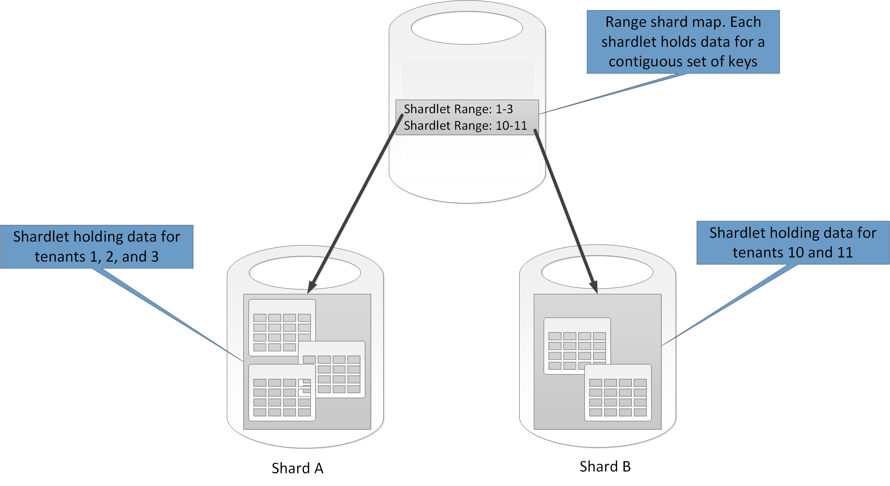
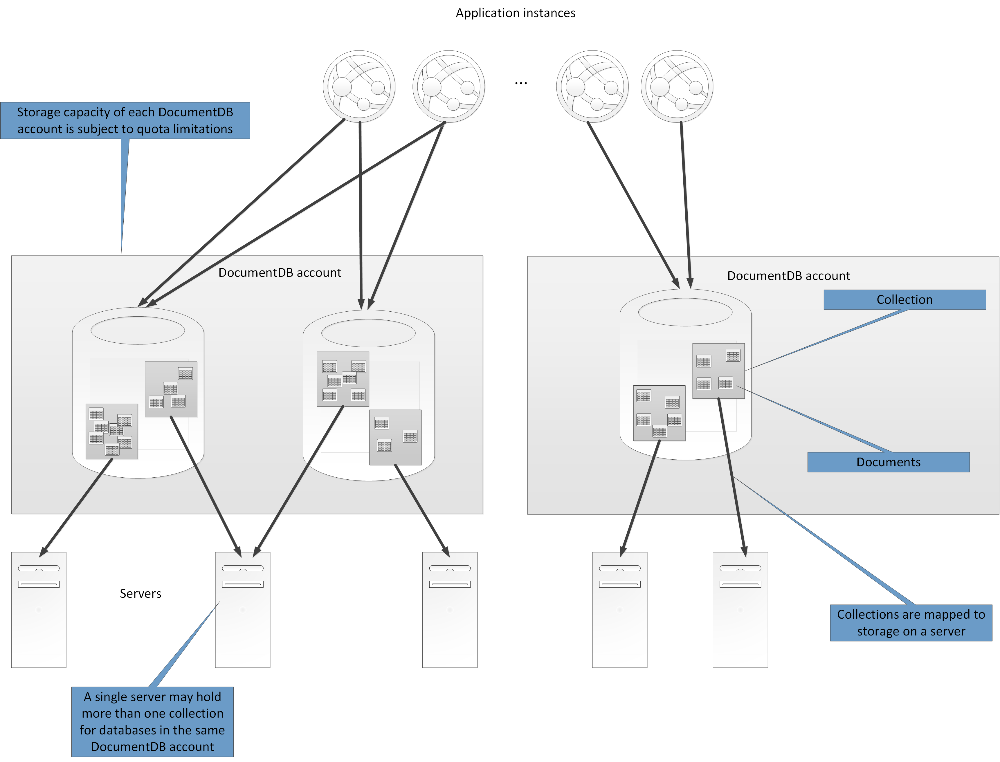

<properties
   pageTitle="資料分割指引 |Microsoft Azure"
   description="如何將磁碟分割區以管理，分別存取的指南。"
   services=""
   documentationCenter="na"
   authors="dragon119"
   manager="christb"
   editor=""
   tags=""/>

<tags
   ms.service="best-practice"
   ms.devlang="na"
   ms.topic="article"
   ms.tgt_pltfrm="na"
   ms.workload="na"
   ms.date="07/14/2016"
   ms.author="masashin"/>

# 資料分割指南

[AZURE.INCLUDE [pnp-header](../includes/guidance-pnp-header-include.md)]

## 概觀

在許多大型方案中，資料會分成可管理和分別存取另一個磁碟分割區而定。 分割策略必須謹慎選擇最大化時最小化負面影響的優點。 分割，可協助改善延展性、 降低競爭和最佳化效能。 分割的另一個優點是使用的可以提供機制除以模式中的資料。 例如，您可以封存較低的資料儲存區中的舊版的較少的作用中 （低溫） 資料。

## 為什麼要分割的資料？

大部分的雲端應用程式與服務儲存及擷取資料，做為其作業的一部分。 應用程式所使用的資料存放區的設計可以有嚴重效能產能與延展性系統的關係。 常用大型系統中的其中一項技巧是分成個別的磁碟分割的資料。

> 字詞_分割_在本指南中所參照的實際分割至不同的資料存放區的 [資料程序。 這是不相同，SQL Server 資料表分割，這是一種不同的概念。

分割資料，可提供許多優點。 例如，可以套用以︰

- **改善延展性**。 當您要縮放單一資料庫系統時，它會最終的實體硬體限制。 如果您將資料跨多個資料分割，每一種裝載在不同的伺服器，您可以幾乎無限期調整系統。
- **以改善效能**。 每個資料分割的資料存取作業接手較小的大量的資料的位置。 所提供的資料已分割的適當的方式，分割會使您的系統更有效率。 同時可以執行影響一個以上的磁碟分割的作業。 每個資料分割可以位於附近的最小化網路延遲會使用該應用程式。
- **改善可用性**。 分隔多個伺服器上的資料，可避免單一的失敗。 如果伺服器失敗，或正在進行預定進行的維修作業，只有資料的磁碟分割功能無法使用。 其他磁碟分割區上的作業，可以繼續。 增加磁碟分割區的數目會減少相對的單一伺服器影響減少的百分比，將無法使用的資料。 複寫每個磁碟分割可以進一步縮小影響作業的單一資料分割失敗的機率。 它也可以讓來分隔必須持續的重要資料和高度可用從最低值的資料具有較低的可用性需求 （例如記錄檔）。
- **改善安全性**。 根據資料和如何已分割的性質，可能會將分隔不同機密及非機密資料分割，及因此到不同的伺服器或資料儲存。 安全性可以再特別最佳化的機密資料。
- **提供營運彈性**。 分割提供許多機會沒問題了調整作業、 最大化管理效率，與成本最小化。 例如，您可以定義不同的策略來管理、 監控、 備份和還原及中每個資料分割的資料的重要性設為根據的其他系統管理工作。
- **資料存放區的使用模式的相符項目**。 分割，可讓不同類型的資料存放區，根據成本，以及資料儲存提供的內建功能上部署的每個資料分割。 例如大型的二進位資料會儲存在 blob 資料存放區上時更結構化的資料可保留文件資料庫中。 如需詳細資訊，請參閱[建置 polyglot 解決方案]，模式和實務指南和[資料存取的高度具彈性的方案︰ 使用 SQL NoSQL，與 polyglot 持續]Microsoft 網站上。

某些系統不會實作分割，這被視為成本，而不是一項優點。 進行此的常見原因包括︰

- 多個資料儲存系統不支援連接跨磁碟分割區，並很難維護分割系統中的參考完整性。 經常是必要的實作連接和完整性檢查應用程式碼 （在分割層級]），這可能會導致其他 I/O 和應用程式的複雜度。
- 維護磁碟分割區不一定是一般的工作。 在系統中的資料是動態的位置，您可能需要重新平衡磁碟分割定期來降低競爭和作用點。
- 自然分割的資料無法使用一些常見的工具。

## 設計磁碟分割區

資料可以分割不同的方式︰ 水平、 垂直或功能。 您選擇的策略取決於分割資料及應用程式和服務會使用該資料的需求的原因。

> [AZURE.NOTE] 本指南所述的分割配置說明的基礎資料儲存技術無關的方式。 他們可以套用到多個類型的資料存放區，包括關聯式和 NoSQL 資料庫。

### 分割策略

分割資料的三個一般策略是︰

- **水平分割**（通常稱為_sharding_）。 在這個策略每個資料分割是資料儲存區在自己的右邊，但所有磁碟分割區有相同的結構描述。 每個資料分割稱為_晶怪_，並保留的特定資料的子集，例如所有的一組特定電子商務應用程式中的客戶訂單。
- **垂直分割**。 在這個策略每個資料分割會保留資料存放區中的項目欄位的子集合。 欄位會根據其圖樣的使用分割。 例如，較少存取另一個的欄位和在一個垂直分割，也可能會放置經常存取的欄位。
- **分割功能**。 在這個策略會彙總根據如何使用每個受限制的內容系統中的資料。 例如，電子商務系統的實作分隔商務函數的發票及管理產品存貨可能發票的資料儲存在一個磁碟分割產品存貨中的資料和另一個。

請務必請注意，可以合併此處所述的三個策略。 不會互斥，，我們建議您考量所有當您設計分割的配置。 例如，您可能會分成擊碎的資料，，然後使用進一步細分每個晶怪中的資料的 [垂直分割。 同樣地中的功能的磁碟分割的資料可以分成擊碎 （這可以也垂直分割）。

不過，各自的每個策略需求可以提高衝突的問題。 您必須評估，和平衡所有這些設計符合您的系統的整體資料處理效能目標分割配置時。 下列各節瀏覽每個更詳細的策略。

### 水平分割 (sharding)

圖 1 顯示水平分割或 sharding 的概觀。 在此範例中，產品庫存資料分成擊碎根據產品金鑰。 每個晶怪保存連續範圍的晶怪鍵 （A G 和 H Z），按照字母順序排列的資料。

_圖 1。水平分割 (sharding) 根據分割索引鍵的資料_

Sharding 可協助您散佈載入更多的電腦，降低競爭並改善效能。 您可以藉由新增進一步在其他伺服器執行的擊碎調整出系統。

最重要的因素實作此分割策略時都是 sharding 索引鍵的選擇。 很難作業系統之後，變更鍵。 索引鍵必須確保資料，讓工作負載為為偶數儘可能跨擊碎分割。

請注意不同擊碎必須包含類似的大量資料內容。 而更重要的考量是平衡要求的數目。 某些擊碎可能很大，但每個項目數目存取作業的主旨。 其他擊碎可能會比較小，但每個項目更更頻繁地存取。 也很重要，以確保單一晶怪不超過 （就容量及處理資源） 的小數位數限制要用來裝載該晶怪的資料存放區。

如果您使用 sharding 配置，避免建立的作用區 （或快速鍵的磁碟分割區） 的可能影響效能及可用性。 例如，如果您使用的客戶識別碼雜湊，而不是客戶的名稱的第一個字母時，您會防止產生的常見與少個字母的不對稱的分配。 這是可協助資料更加平均地分配磁碟分割區一般技巧。

選擇 [最小化的任何未來的需求，以較小的區塊將分割大型擊碎 sharding 鍵聯合小型擊碎到較大的磁碟分割區，或變更說明儲存在磁碟分割區的一組資料的結構描述]。 這些作業可非常花時間，而可能需要將一或多個擊碎離線時執行。

如果複寫擊碎，可能會保留線上複本的一些其他人的分割、 合併，或重新設定。 不過，系統可能會需要限制可以執行下列擊碎中的資料時重新設定進行的作業。 例如，複本中的資料可以標示為唯讀狀態來限制的 inconsistences 擊碎會被重建時可能發生的範圍。

> 如需詳細資訊與許多這些考量和很好的做法技術設計實作水平分割的資料存放區的相關指引，請參閱[Sharding 圖樣]。

### 垂直分割

最常用的垂直分割減少 I/O，而存取最常與擷取項目相關聯的效能成本。 圖 2 顯示垂直分割的範例。 在此範例中，不同的屬性，每個資料項目會保留在不同的磁碟分割區中。 一個磁碟分割保留存取的資料更頻繁地，包括名稱、 描述及產品價格資訊。 另存音量的內建及最後一個排序的日期。

_圖 2。垂直分割的資料，以使用其模式_

在此範例中，應用程式定期查詢產品名稱、 描述及價格產品詳細資料顯示為 [客戶]。 庫存和時產品的最後一個訂購的日期製造商會保留在另一個磁碟分割因為下列兩個項目常使用的是在一起。

此分割結構的優點是新增相當緩慢的資料 （產品名稱、 描述及價格） 分開的更動態的資料 （庫存和最後一個排序的日期）。 應用程式可能會發現經常存取快取記憶體中的緩慢的資料很有幫助。

其他常見的情況，此分割策略，是最大化機密資料的安全性。 例如，您可以藉由在個別的磁碟分割儲存信用卡卡號及相對應的卡片安全性驗證數字。

垂直分割也可以縮減並行存取所需的資料量。

> 垂直分割實體層級的資料存放區，部分正常化實體中斷，向下_寬_的項目從一組_縮小_的項目中的運作方式。 很適合 HBase 等 Cassandra 欄導向的資料儲存區。 如果資料行集合中的資料不會變更，您也可以考慮使用 SQL Server 中的資料行儲存區。

### 設定分割的功能

系統會識別每個不同商業區域或服務應用程式中的限制的內容可能的功能分割提供技巧改善隔離及資料存取的效能。 另一種常用的功能分割是讀寫資料分開唯讀用於報告用途的資料。 圖 3 顯示功能分割的概觀庫存資料分開客戶資料的位置。

_圖 3。受限制的內容或子網域功能分割的資料_

此分割策略可協助降低資料存取競爭系統的不同部分。

## 設計磁碟分割區延展性

請務必考慮大小和每個資料分割的工作量，並讓資料分散獲得最大延展性取得平衡。 不過，您也必須分割的資料，使其不超過的單一資料分割儲存的縮放比例限制。

設計延展性的磁碟分割區時，請遵循下列步驟︰

1. 分析應用程式，以了解資料的存取模式，例如每個查詢所傳回的結果集的大小、 access、 固有延遲和伺服器端的頻率計算處理需求。 在許多情況下，幾個主要的實體會要求大部分的處理資源。
2. 您可以使用這項分析來判斷目前和未來延展性目標，例如資料大小和工作量。 然後分散符合延展性目標的磁碟分割的資料。 在水平分割策略、 選擇適當的晶怪鍵，很重要，請確定分配為偶數的。 如需詳細資訊，請參閱[Sharding 圖樣]。
3. 確認每個資料分割可用的資源是足夠處理資料的 [大小及處理量延展性需求。 例如，磁碟分割裝載的節點可能會限制嚴格的限制的儲存空間，處理乘冪或它所提供的網路頻寬量。 如果資料儲存及處理需求可能會超過這些限制，可能需要調整您的資料分割策略或進一步分割輸出資料。 例如，延展性方法之一可能記錄資料分開核心應用程式的功能。 若要避免超過節點的縮放比例限制的加總資料儲存區需求使用不同的資料儲存區執行此動作。 如果資料儲存區總數目超過節點限制，可能需要使用不同的儲存空間節點。
4. 監控系統] 以確認資料如預期般分散磁碟分割區可以處理載入時，會在其上使用。 就可以使用不符合預期會分析的使用方式。 在此情況下，可能會以重新平衡分割。 失敗，可能必須重新設計以取得所需的平衡系統的某些部分。

附註有些雲端環境配置基礎結構界限龐大的資源。 請確定您所選的邊界的限制，提供足夠的空間量的資料，以資料儲存區、 處理能力和頻寬任何預期等比級數。

比方說，如果您使用 Azure 資料表儲存體，忙碌晶怪可能需要更多資源超出可用來處理要求在單一磁碟分割。 （有限制要求可以處理的單一資料分割，在特定期間內的時間量。 請參閱[Azure 儲存體延展性和效能目標]頁面 Microsoft 網站的更多詳細資料）。

 如果是這樣，可能需要晶怪分割負載分散到。 如果的下列表格的總大小超過儲存帳戶的容量，可能必須建立額外的儲存空間帳戶，分散這些帳戶中的資料表。 如果數字的儲存空間帳戶超過帳戶所提供的訂閱的數目，然後將其可能需要使用多個訂閱。

## 設計磁碟分割區的查詢效能

使用較小的資料集及執行平行查詢，通常可以提高查詢效能。 每個資料分割應該包含少數整個資料集合。 大量縮小可以改善查詢的效能。 不過，分割不設計及設定資料庫適當的替代方案。 例如，確認您就地具有必要的索引，如果您使用關聯式資料庫。

設計查詢效能的磁碟分割區時，請遵循下列步驟︰

1. 應用程式的需求和效能，請檢查︰
    - 您可以使用企業需求來判斷必須快速執行要徑查詢。
    - 監控系統來識別執行速度緩慢並且任何查詢。
    - 建立最常所執行的查詢。 每個查詢的單一例項可能會有最小的成本，但資源的累計消耗可能會嚴重。 可能會很有幫助分隔到不同的磁碟分割或甚至快取這些查詢來擷取資料。
2. 分割導致效能變慢的資料︰
    - 限制每個分割區的大小，使查詢回應時間內目標。
    - 設計晶怪鍵，讓應用程式可以輕鬆地找到磁碟分割，如果您實作水平分割。 這可避免查詢，每個磁碟分割掃描。
    - 請考慮的磁碟分割的位置。 如果可能的話，請試著會關閉應用程式與存取權限的使用者的地理位置的磁碟分割中保留的資料。
3. 如果實體處理量] 與 [查詢效能需求，請使用功能分割根據的實體。 如果此仍不符合需求，套用水平分割以及。 在大多數情況下單一分割策略就夠用，但在某些情況下會更有效率合併兩個策略。
4. 請考慮使用非同步同時在多個執行磁碟分割區以提升效能的查詢。

## 設計磁碟分割區的可用性

分割資料可以改善應用程式的可用性確保整個資料集無法構成單一的失敗，且可管理獨立的資料集的個別子集。 複製包含重要資料的磁碟分割也可以改善可用性。

當設計及實作磁碟分割區，請考慮下列因素的影響可用性︰

- **如何重要資料是企業營運**。 某些資料可能會包含重要的商務資訊，例如 [發票詳細資料] 或 [銀行交易。 其他資料可能會包含比較不重要營運資料的詳細資訊，例如記錄檔、 效能追蹤等等。 之後識別每種類型的資料，請考慮︰
    - 儲存在高度可用的磁碟分割區以適當的備份計劃中的重要資料。
    - 建立個別的管理，並監控機制或每個資料集的不同 criticalities 程序。 將，讓它可以備份一起適當的頻率有相同等級的嚴重性中相同的磁碟分割的資料。 比方說，按住銀行交易資料的磁碟分割區可能需要超過按住記錄或追蹤資訊的磁碟分割區備份。
- **可以管理個別資料分割方式**。 設計可支援獨立管理與維護的磁碟分割區提供幾項優點。 例如︰
    - 如果磁碟分割失敗，才能還原獨立而不會影響存取其他磁碟分割區中的資料的應用程式的執行個體。
    - 依地理區域的資料分割允許維護工作發生峰為每個位置。 確定磁碟分割區不太大無法在這段期間完成時，防止任何預定進行的維修作業。
- **是否要複製整個磁碟分割區的重要資料**。 這種方法可以改善可用性及效能，但也可能也會導致一致性問題。 花時間，無法同步處理的每一個複本的磁碟分割的資料所做的變更。 在這段期間，不同的磁碟分割區會包含不同的資料值。

## 了解如何分割影響設計和開發

使用 [分割增加的設計和開發系統的複雜性。 請考慮基本系統設計，即使在將系統分割最初只包含單一的磁碟分割。 如果您分割為事後，系統會啟動降低效能與延展性問題時，提高複雜度增加，因為您已有若要維持即時系統。

如果您更新併入此環境中分割系統時，它必須修改資料存取邏輯。 它也可以包含移轉大量的磁碟分割上時，才能繼續使用系統的使用者預期通常散佈的現有資料。

在某些情況下，分割並不重要，因為初始資料集很小，可以輕鬆地處理單一伺服器。 這可能是在不會超過起始大小，不按比例縮放的系統，則為 true，但許多商業系統需要展開的使用者會增加。 此擴充通常伴隨的成長的資料量。

也很重要瞭解分割並不一定的大型資料儲存區函數。 例如，小型的資料存放區可能會重度存取下數百個同時用戶端。 分割的資料，這種情況下，可協助降低競爭並改善處理量。

當您設計資料分割方式時，請考慮下列幾點︰

- **可能的話，將最常見的資料庫作業的資料放在一起以縮小跨分割資料存取作業的每個資料分割**。 跨磁碟分割區查詢可以更費時比查詢只在單一磁碟分割，但最佳化磁碟分割區的一組查詢可能會影響其他組的查詢。 當您無法避免查詢跨磁碟分割區時，最小化查詢時執行平行查詢與彙總的應用程式中的結果。 這種方式可能無法在某些情況，例如時需要取得從一個查詢的結果，並在下一個查詢中使用。
- **如果查詢，讓使用的相對靜態參考資料，例如郵遞區號表格或產品的清單，請考慮複製此資料中所有的磁碟分割區以減少不同的磁碟分割區中的個別查閱作業的需求**。 此方法也可以縮減成為受到流量太大從整個系統的 「 快速鍵 」 資料集的參考資料的可能性。 不過，就是與同步處理可能會發生此參照的資料的任何變更相關聯的其他成本。
- **可能的話，最小化垂直及功能的磁碟分割區跨參考完整性的需求**。 在這些配置中，應用程式本身負責資料更新，且使用時，跨磁碟分割區維護參考完整性。 必須加入跨多個資料分割的資料的查詢執行放慢比加入只在相同的磁碟分割的資料，因為應用程式通常需要執行連續查詢鍵，然後外部索引鍵的查詢。 不過，請考慮複寫或取消標準化的相關資料。 若要最小化查詢時，跨磁碟分割連接有必要，請透過磁碟分割區執行平行查詢加入應用程式中的資料。
- **請考慮分割配置可能對資料的一致性跨磁碟分割區的效果。** 評估是否強式的一致性是實際的需求。 不過，在雲端中的常見方法是實作一致性。 每個資料分割的資料會分別更新和應用程式邏輯可確保的更新所有已順利完成。 也會處理查詢資料執行最後一致的作業時可能會產生的不一致性。 如需有關如何實作一致性的詳細資訊，請參閱[資料一致性入門]。
- **請考慮查詢如何找到正確的磁碟分割**。 如果查詢必須掃描所有磁碟分割區，找出所需的資料，也會嚴重影響效能，多個平行查詢執行時，即使。 查詢所使用的垂直及功能分割策略自然可以指定資料分割。 不過，水平分割 (sharding) 會使尋找難以項目，因為每個晶怪具有相同的結構描述。 若要維持地圖，可以用來查詢的資料的特定項目晶怪位置是 sharding 的一般解決方案。 地圖可以實作於 sharding 邏輯的應用程式，或支援透明 sharding 維護資料存放區。
- **使用水平分割策略時, 請考慮定期平衡擊碎**。 這可協助平均資料大小和最小化的作用區最大化查詢效能與解決實體儲存空間限制的工作量。 不過，這是複雜的工作，通常需要使用自訂的工具或程序。
- **如果您要複製每個資料分割，它提供其他防範失敗**。 如果一個複本失敗，請查詢可以導向工作複本。
- **如果您達到實體限制的分割策略，您可能需要延伸到不同層次的擴充**。 比方說，如果分割資料庫層級，您可能需要找出，或複製多個資料庫中的資料分割。 如果分割已在資料庫層級，且實體限制問題，可能是您需要找出，或複製多個的主機服務帳戶中的資料分割。
- **避免的交易的存取多個資料分割的資料**。 某些資料儲存區實作交易的一致性和作業的參考完整性的修改資料，但只有當資料位於單一磁碟分割。 如果您需要交易支援跨多個資料分割時，您可能必須若要執行這個應用程式邏輯的一部分，因為最分割系統不會提供的原生支援。

所有的資料儲存區需要某些操作管理及監視活動。 工作的範圍從載入資料、 備份和還原資料、 重新組織資料，並確保系統的正確並有效率地執行。

請考慮下列因素的影響操作管理︰

- **如何實作適當的管理與操作工作時已分割的資料**。 這些工作可能包括備份與還原，封存資料，並監控系統，以及其他系統管理工作。 例如，維護邏輯的一致性備份與還原作業期間可進行。
- **載入到多個資料分割的資料，並新增的送達從其他來源資料的方式**。 有些工具和公用程式可能不支援 sharded 資料作業，例如載入到正確的磁碟分割的資料。 這表示您可能必須建立，或取得新的工具和公用程式。
- **封存與刪除定期資料的方式**。 若要防止過多的磁碟分割區成長，您需要封存並刪除定期 （可能是每月） 的資料。 您可能必須轉換資料以符合不同的封存結構描述。
- **如何找出資料完整性問題**。 請考慮執行定期程序中找不到任何資料完整性問題，例如資料參照缺少的資訊，另一個磁碟分割。 程序可以嘗試自動修正這些問題或發出警示運算子來手動修正問題。 例如，電子商務應用程式中，訂單資訊可能會保留在磁碟分割，但線項目組成的每個訂單可能會保留在另一個。 若要將資料新增至其他磁碟分割區必須訂單的程序。 如果此程序失敗，那里可能線條的項目儲存為其沒有任何對應的順序。

不同的資料儲存技術通常會提供支援分割自己功能。 下節概述由常用的 Azure 應用程式的資料存放區實作的選項。 還會描述應用程式，可以充分善用這些功能的設計的考量。

## Azure SQL 資料庫的資料分割策略

Azure SQL 資料庫是關聯式資料庫-為-的-服務，在雲端中執行。 它會根據 Microsoft SQL Server。 關聯式資料庫分割成表格，資訊和每個資料表保存的實體資訊以一系列的列。 每個資料列包含欄保存的實體個別欄位的資料。 頁面[什麼是 Azure SQL 資料庫？]上 Microsoft 網站提供詳細的文件，瞭解建立和使用 SQL 資料庫。

## 水平分割彈性的資料庫

單一 SQL 資料庫有限制其所包含的資料量。 受限於處理量建築因素和支援的同時連線的數字。 SQL 資料庫的彈性的資料庫功能支援的 SQL 資料庫的水平縮放比例。 使用彈性的資料庫，您可以分割您的資料將會橫跨多個 SQL 資料庫的擊碎。 您也可以新增或移除擊碎您需要處理的資料量成長或縮小。 使用彈性的資料庫也可協助降低競爭將載入分散到資料庫。

> [AZURE.NOTE] Azure SQL 資料庫的 「 聯盟 」 功能取代彈性的資料庫。 現有的安裝可以使用 「 聯盟 」 移轉公用程式移轉到彈性的資料庫的 SQL 資料庫同盟。 或者，您可以實作自己 sharding 機制，如果您的狀況本身就無法符合所提供的彈性的資料庫的功能。

每個晶怪被當作 SQL 資料庫。 晶怪可以包含多個資料集 （稱為_shardlet_）。 每個資料庫維護描述其包含 shardlets 中繼資料。 Shardlet 可以是單一資料項目，或一組共用相同的 shardlet 索引鍵的項目。 比方說，如果您是 sharding multitenant 應用程式中的資料，shardlet 索引鍵的租用戶識別碼，而可指定的租用戶的所有資料可都保留做為相同的 shardlet 的一部分。 其他租用戶的資料會保留在不同的 shardlets。

負責程式設計人員與 shardlet 索引鍵的資料集。 獨立的 SQL 資料庫做為全域晶怪地圖管理員。 此資料庫系統中包含所有擊碎和 shardlets 的清單。 存取資料的用戶端應用程式第一次連線至全域晶怪地圖管理員資料庫取得複本晶怪地圖 （清單擊碎和 shardlets），然後快取至本機。

應用程式，然後使用適當的晶怪這項資訊傳送資料的要求。 此功能是隱藏在一系列的 Api 中所包含的 Azure SQL 資料庫彈性資料庫用戶端文件庫，可為 NuGet 套件。 Microsoft 網站上的頁面[彈性的資料庫功能概觀]提供彈性的資料庫更完整的簡介。

> [AZURE.NOTE] 您可以複製全域晶怪地圖 manager 資料庫，以減少延遲，並改善可用性。 如果您使用的進階版價格實作資料庫，您可以設定持續將資料複製到資料庫在不同區域內的作用中地理複寫。 每個地區為使用者建立資料庫的複本。 設定您的應用程式連線到此複製到取得晶怪地圖。

> 另一個方法是使用 Azure SQL 資料同步處理或 Azure 資料工廠管線各地區複寫晶怪地圖 manager 資料庫。 這種複寫定期執行，而是更適合用於晶怪地圖不常變更。 此外，晶怪地圖 manager 資料庫沒有使用價格層進階版建立。

彈性的資料庫提供將資料對應至 shardlets，並將它們儲存在擊碎的兩個配置︰

- **清單晶怪地圖**說明單一索引鍵和 shardlet 之間的關聯。 例如，在 multitenant 系統中，每個租用戶可以會相關聯的唯一索引鍵及儲存資料的自己 shardlet。 若要確保隱私權與隔離 (也就是耗盡提供給其他人的資料儲存區資源時，防止一個租用戶)，每個 shardlet 可保留自己晶怪內。

_圖 4。使用清單晶怪地圖租用戶資料儲存於個別擊碎_

- **範圍晶怪地圖**說明的一組連續的關鍵值和 shardlet 之間的關聯。 在另一種實作專用的 shardlets，先前，說明 multitenant 範例中，您可以群組的一組內相同 shardlet （兩者都有自己的金鑰） 租用戶的資料。 此配置是較便宜比第一個 （因為租用戶共用資料儲存區資源），但也會建立精簡的資料隱私權與隔離的風險。

_圖 5。使用範圍晶怪地圖晶怪中儲存的租用戶範圍的資料_

請注意單一晶怪，可包含多個 shardlets 的資料。 例如，您可以使用清單 shardlets 來儲存資料的不同非連續的租用戶相同晶怪。 您也可以混合範圍 shardlets 和清單 shardlets 中相同的晶怪，雖然將透過全域晶怪地圖 manager 資料庫中的不同地圖會解決。 （全域晶怪地圖管理員資料庫可以包含多個晶怪地圖）。圖 6 說明這種方法。

_圖 6。實作多個晶怪地圖_

分割配置實作系統效能有明顯的關係。 將也會影響的率用以擊碎需要新增或移除或用的資料必須分割跨擊碎工資率。 當您使用彈性的資料庫分割資料時，請考慮下列幾點︰

- 在相同的晶怪，一起使用的資料分組，並避免需要存取保存在多個擊碎的資料的作業。 請記住，彈性的資料庫，晶怪是 SQL 資料庫在自己的右邊，與 Azure SQL 資料庫不支援跨資料庫連接 （，必須在用戶端上執行）。 請記住，在 Azure SQL 資料庫中，參考完整性的限制式、 引動程序，並在一個資料庫中的預存程序無法參照另一個物件。 因此，沒有設計有擊碎之間的相依性的系統。 SQL 資料庫可以不過，包含複本的查詢和其他作業經常使用的參考資料的資料表。 下列表格沒有屬於任何特定 shardlet。 跨擊碎複製此資料可協助移除連接之資料的範圍包括資料庫的需要。 理想的情況下，例如資料應靜態或緩慢的最小化的複寫投入比並降低其變得過時的機會。

    > [AZURE.NOTE] 雖然 SQL 資料庫並不支援跨資料庫連接，但您可以執行彈性的資料庫 api 跨晶怪查詢。 這些查詢可無障礙逐一查看晶怪地圖所參照的所有 shardlets 都中的資料。 彈性的資料庫 API 線跨-晶怪查詢向下成一系列的個別查詢 （每個資料庫一個），，然後將結果。 如需詳細資訊，請參閱 Microsoft 網站上的 [[多晶怪查詢]] 頁面。

- Shardlets 屬於相同的晶怪地圖中儲存的資料必須有相同的結構描述。 例如，沒有建立清單晶怪地圖指向包含租用戶資料一些 shardlets 以及其他 shardlets 包含產品資訊。 此規則不會強制使用彈性的資料庫，但資料管理，查詢會變得很複雜，如果每個 shardlet 有不同的結構描述。 在範例中，只要引用的項目，還有解決方案是建立兩個清單晶怪地圖︰ 參考租用戶資料，指向 [產品資訊的另一個。 請記住，屬於不同的 shardlets 資料可以儲存在同一個晶怪。

    > [AZURE.NOTE] 跨晶怪查詢功能的彈性的資料庫 API 晶怪對應包含相同的結構描述中的每個 shardlet 而定。

- 交易作業只支援之資料的相同晶怪，且不在擊碎會保留。 交易可以跨越 shardlets，只要是相同晶怪的一部分。 因此，如果您的商務邏輯需要執行交易，將受影響的資料儲存在同一個晶怪，或實作一致性。 如需詳細資訊，請參閱[資料一致性入門]。
- 將擊碎靠近使用者存取這些擊碎中的資料 (也就是說，地理-找出擊碎)。 這種方法可協助您減少延遲。
- 避免混合高度作用中 （作用點），相當停用擊碎。 載入平均分散擊碎嘗試。 這可能需要雜湊 shardlet 鍵。
- 如果您是地理尋找擊碎，請確定雜湊的按鍵對應至 shardlets 保留在靠近使用者存取該資料的儲存擊碎。
- 目前，只限制設定的 SQL 資料類型支援 shardlet 索引鍵。_int、 bigint、 varbinary_和_唯一_。 SQL _int_及_bigint_類型會對應到_int_及_長_中的資料類型 C#，且您擁有相同的範圍。 SQL _varbinary_類型可處理 C# 中使用_位元組_陣列，而 SQL _uniqueidentier_類型相當於.NET Framework _Guid_類別。

顧名思義，彈性的資料庫可以讓您新增和移除的資料量縮小以及成長的擊碎系統。 Azure SQL 資料庫彈性資料庫用戶端文件庫中的 Api 啟用應用程式建立，並以動態方式刪除擊碎 （並無障礙更新晶怪地圖管理員）。 不過，移除晶怪，就會刪除作業也需要刪除該晶怪中的所有資料。

如果應用程式需要晶怪分成兩個不同的擊碎或合併擊碎，彈性的資料庫會提供個別分割合併服務。 這項服務的雲端裝載服務 （必須建立由開發人員） 執行，並可移轉安全地之間擊碎的資料。 如需詳細資訊，請參閱 Microsoft 網站上的[縮放比例使用彈性的資料庫分割合併工具]的主題。

## Azure 儲存空間的磁碟分割策略

Azure 儲存體提供三個管理資料︰

- 資料表儲存體︰ 實作可調整結構儲存空間。 資料表包含的實體，每一種可包含一組屬性和值的集合。
- Blob 儲存體︰ 提供大型物件和檔案的儲存空間。
- 儲存佇列，可支援的應用程式之間可靠非同步訊息。

資料表儲存體和 blob 儲存體是進行最佳化，分別按住結構化及非結構化資料的基本上關鍵值存放區。 儲存佇列提供機制建置彈性、 可調整應用程式。 資料表儲存體、 blob 儲存體及儲存佇列會建立 Azure 儲存體帳戶的內容中。 儲存帳戶支援重複性的三種︰

- **在本機上多餘的儲存空間**，而維護三份單一資料中心內的資料。 針對硬體失敗，但不是會針對內含整個資料中心損毀，也會保護的重複此表單。
- **區域多餘的儲存空間**，保留三份散佈相同的區域內的不同資料中心 （或兩個地理位置關閉區域跨越） 的資料。 這種重複性可以防範損毀內單一資料中心，但不能保護的大型網路中斷連線會影響整個區域。 請注意，區域多餘的儲存空間目前只有目前可供區塊二進位大型物件。
- **地理多餘的儲存空間**，而維護資料的六個複本︰ 在某個區域 （您本機區域），三份數與遠端區域中的其他三個複本。 這種重複提供的保護層級損毀。

Microsoft Azure 儲存空間發佈延展性目標。 如需詳細資訊，請參閱 Microsoft 網站上的頁面[Azure 儲存體延展性和效能目標]。 目前的總儲存空間帳戶容量不能超過 500 TB。 （包括保留的資料大小中資料表儲存體和 blob 儲存體，以及儲存佇列中保留的未完成訊息）。

（假設 1 KB 實體、 blob 或郵件大小） 的最大要求率為 20 KBps。 如果您的系統可能會超過這些限制，請考慮分割載入跨多個儲存的帳戶。 單一 Azure 訂閱可以建立最多 100 個的儲存空間帳戶。 不過，請注意這些限制可能會變更一段時間。

## 分割 Azure 資料表儲存體

Azure 資料表儲存體是專分割的關鍵值存放區。 所有項目會儲存在磁碟分割，磁碟分割區內部受 Azure 資料表儲存體。 儲存在資料表中每個實體必須提供兩組件金鑰包含︰

- **分割索引鍵**。 這是決定在哪一個磁碟分割 Azure 資料表儲存體會將實體的字串值。 以相同的磁碟分割金鑰的所有項目會儲存在相同的磁碟分割。
- **[列] 鍵**。 這是識別實體磁碟分割內的另一個字串值。 磁碟分割內的所有項目會詞彙性，以遞增順序排序，此索引鍵。 分割金鑰/列按鍵組合必須是唯一的每個實體，不能超過 1 KB 的長度。

實體資料的其餘部分組成的應用程式定義的欄位。 強制執行特定的結構描述，且每個資料列可包含一組不同的應用程式定義欄位。 唯一的限制是 （包括分割] 與 [資料列鍵） 的實體大小上限為目前 1 MB。 表格的大小上限為 200 TB，，雖然可能會在未來變更這些數字。 （選取這些限制的最新資訊 Microsoft 網站上的頁面[Azure 儲存體延展性和效能目標]）。

如果您要儲存超過此容量的項目，請考慮將其分割成多個資料表。 使用垂直分割將這些欄位新增到最有可能在一起存取的群組。

圖 7 虛構電子商務應用程式顯示邏輯結構的範例儲存帳戶 （Contoso 資料）。 儲存帳戶包含三個資料表︰ 客戶資訊、 產品資訊] 和 [訂單資訊。 每個表格中有多個資料分割。

在 [客戶狀態] 資料表中的資料分割依據縣/市的客戶位於，與列索引鍵包含 「 客戶識別碼 」。 在 [產品資訊] 資料表中產品依產品類別的分割，列索引鍵包含產品編號。 在順序資訊資料表中，訂單] 是依日期的放置，並列鍵指定順序所收到的時間的分割。 請注意，會依據每個資料分割的資料列按鍵排序所有資料。

_圖 7。資料表和範例儲存帳戶中的資料分割_

> [AZURE.NOTE] Azure 資料表儲存體也會將時間戳記欄位加入至每個實體中。 時間戳記欄位由資料表儲存體維護，並更新每次實體修改，而重新寫入磁碟分割。 表格儲存服務會使用此欄位來實作樂觀。 （每次應用程式撰寫實體回資料表儲存體，表格儲存服務比較的實體寫入的時間戳記的值，會保留在資料表儲存體中的值。 如果值不同，這表示的另一個應用程式必須已修改的實體自上次擷取它，及 [寫入] 作業會失敗。 請勿修改您的程式碼，此欄位，並不指定此欄位的值，當您建立新的實體。

Azure 資料表儲存體使用分割索引鍵，決定如何將資料儲存。 如果先前未使用過的磁碟分割金鑰實體加入至資料表，Azure 資料表儲存體會建立新的磁碟分割此實體。 以相同的磁碟分割金鑰其他實體會儲存在相同的磁碟分割。

這個機制有效實作自動的擴充策略。 Azure 的資料中心，以確保快速執行資料擷取單一的磁碟分割的查詢中的單一伺服器上儲存每個資料分割。 不過，不同的磁碟分割區可以發佈到多個伺服器。 此外，如果這些磁碟分割區的大小限制單一伺服器可以裝載多個資料分割。

當您設計 Azure 資料表儲存體的實體時，請考慮下列幾點︰

- 選取的磁碟分割索引鍵和列關鍵值應該中資料的存取了導向。 選擇資料分割金鑰/列按鍵組合支援大部分的查詢。 最有效查詢指定的磁碟分割鍵和列來擷取資料。 指定資料分割索引鍵和列按鍵範圍的查詢可以完成掃描單一磁碟分割。 這是相當快速，因為資料會保留資料列鍵順序。 如果查詢不指定掃描的磁碟分割，分割索引鍵可能會要求 Azure 資料表儲存體瀏覽每個磁碟分割的資料。

    > [AZURE.TIP] 如果實體有一個自然索引鍵，然後將其作為分割索引鍵並指定空字串列索引鍵。 如果實體複合索引鍵包含兩個屬性，請選取最慢變更屬性，為分割索引鍵和其他列索引鍵。 如果實體有兩個以上的主要內容，請使用屬性的串連提供分割] 與 [資料列鍵。

- 如果您定期執行查閱資料使用以外的磁碟分割和列索引鍵欄位的查詢，請考慮實作[索引的資料表圖樣]。
- 如果您使用 monotonic 遞增或遞減順序 （例如 「 0001 」、 「 0002 」、 「 0003 」 等） 來產生磁碟分割金鑰，每個資料分割僅包含一段有限的資料，Azure 資料表儲存體可以實際群組這些分割相同的伺服器上合作。 這個機制假設應用程式最有可能在連續範圍的磁碟分割區 （範圍查詢） 執行查詢，並已針對這種情況下進行最佳化。 不過，這種方式可能會導致專注於單一伺服器，因為所有插入的新項目可能是集中在一個 end 或連續範圍的其他的作用點。 它也可以縮減延展性。 若要分散到載入更加平均地伺服器，請考慮雜湊，讓更多隨機順序的磁碟分割鍵。
- Azure 資料表儲存體支援實體屬於相同的磁碟分割的交易的作業。 這表示的應用程式，可以執行多個插入、 更新、 刪除、 取代或合併作業原子單位為文件 （只要交易不包含 100 個以上的項目和內容的邀請不超過 4 MB）。 橫跨多個磁碟分割之作業的不交易，而且可能會要求您的[資料一致性入門]所述實作一致性。 如需資料表儲存體和交易的詳細資訊，請移至頁面[執行實體群組交易]Microsoft 網站上。
- 因為下列原因而提供注意分割索引鍵的方式︰
    - 使用相同的分割索引鍵的每個實體會建立一個大型資料分割會保留在伺服器上的表格儲存服務。 這防止出縮放比例，請改為載入著重於單一伺服器。 如此一來，此方法是僅適用於管理實體少量的系統。 不過，這種方法，並確保所有的實體可以參與實體群組交易。
    - 使用唯一的磁碟分割索引鍵的每個實體會建立的每個實體，可能會導致大量 （根據的實體大小） 小型磁碟分割區的另一個磁碟分割表格儲存服務。 這個方法最更具彈性比使用單一資料分割金鑰，但可能實體群組交易。 此外，擷取一個以上的實體的查詢可能需要從多個伺服器的讀取。 不過，如果應用程式執行範圍查詢，然後使用 monotonic 的順序會產生的磁碟分割金鑰也許可以協助最佳化這些查詢。
    - 共用分割索引鍵的實體子集可讓您群組相關中相同的磁碟分割的實體。 使用實體群組交易，才能執行作業涉及相關的項目，可以存取單一伺服器滿足擷取相關實體的一組的查詢。

如需 Azure 資料表儲存體中的分割資料的詳細資訊，請參閱 Microsoft 網站上的[Azure 儲存資料表設計指南]的文章。

## 分割 Azure blob 儲存體

Azure blob 儲存體讓按住大型的二進位物件-目前最多 200 GB 區塊二進位大型物件的大小或頁面 blob 的 1 TB。 （最新的資訊，移至頁面[Azure 儲存體延展性和效能目標]Microsoft 網站上。）上傳或下載大量資料快速，例如串流您需要的案例中使用區塊二進位大型物件。 使用頁面 blob 隨機而不是序列存取資料的部分應用程式。

每個 blob （區塊或頁面） 會保留的容器中 Azure 儲存體帳戶。 您可以使用 [容器群組相關的 blob 的相同的安全性需求，雖然這個群組是邏輯，而不是實體。 內部容器，每個 blob 會有唯一的名稱。

Blob 儲存體會自動分割根據 blob 名稱。 每個 blob 保存在本身的磁碟分割。 二進位大型物件的相同容器中不會共用磁碟分割。 此結構可協助以平衡載入伺服器無障礙因為不同的二進位大型物件的相同容器中由不同的伺服器 Azure blob 儲存體。

撰寫的單一區塊 (區塊 blob) 或 (頁面 blob)] 頁面的動作不可部分完成，但不是橫跨區塊、 網頁或 blob 的作業。 如果您需要一致性跨越區塊、 頁面及 blob 執行寫入作業時，使用 blob 租用需要查看寫入鎖定。

Azure blob 儲存體支援每個 blob 的 60 MB 每秒的第二或 500 要求的檔案傳輸速度。 如果您將會超越這些限制，且相對靜態 blob 資料，請考慮使用 Azure 內容傳遞網路複寫二進位大型物件。 如需詳細資訊，請參閱 Microsoft 網站上的 [使用內容的傳遞網路 Azure] 的頁面。 如需額外指引與考量，請參閱 [使用內容傳遞網路 Azure]。

## 分割 Azure 儲存佇列

Azure 儲存佇列可讓您在實作非同步訊息之間程序。 Azure 儲存體帳戶可包含任何數目的佇列，以及每個佇列可以包含任何數量的郵件。 唯一的限制是中儲存的帳戶所提供的空間。 個別郵件大小上限為 64 KB。 如果您需要大於此郵件，請考慮改用 Azure 服務匯流排佇列。

每個儲存佇列中已包含該儲存帳戶內的唯一名稱。 Azure 分割佇列根據名稱。 相同的佇列中的所有郵件會都儲存在相同的磁碟分割，由單一伺服器。 不同的佇列可協助平衡負載不同伺服器管理。 要伺服器的佇列配置是透明應用程式和使用者。

 在大型的應用程式，不要使用相同的儲存空間佇列中的應用程式的所有執行個體因為此方式可能會導致伺服器裝載變成作用區佇列。 請改用不同佇列的不同的功能區域的應用程式。 Azure 儲存佇列不支援的交易，因此導向郵件到不同的佇列應有稍微訊息一致性的影響。

Azure 儲存體佇列中可以處理最多 2000 秒的郵件。  如果您需要更大的工資率超過此的訊息，請考慮建立多個佇列。 例如，全域的應用程式中，建立個別的儲存空間佇列在處理應用程式的執行個體中每個區域執行中的個別儲存帳戶。

## Azure 服務匯流排分割策略

Azure 服務匯流排會用來處理郵件傳送給服務匯流排佇列或主題的郵件代理人。 根據預設，所有的佇列或主題寄送的郵件會處理相同的郵件代理人程序。 此結構可以將限制訊息佇列的整體輸出量。 不過，您可以也分割的佇列或主題建立時。 您執行此動作的佇列或主題說明_EnablePartitioning_屬性設定為_true_。

分割的佇列或主題分成多個片段，每一種方法的個別郵件儲存和訊息代理人。 服務匯流排負責建立和管理這些片段。 當應用程式張貼訊息至分割的佇列或主題時，服務匯流排會將該佇列或主題片段的郵件。 當應用程式佇列中或訂閱收到一則訊息時，服務匯流排檢查每個片段的下一個可用的訊息，然後將它傳遞給處理的應用程式。

此結構可協助載入分散訊息經紀人和訊息存放區，增加延展性，改善的可用性。 如果一片段的郵件代理人或郵件儲存區暫時無法使用，服務匯流排可以擷取郵件從剩餘可用片段。

服務匯流排指派郵件給片段，如下所示︰

- 如果郵件屬於工作階段，具有相同值的 [_工作階段識別碼_] 屬性的所有郵件會都傳送到相同的片段。
- 如果郵件不屬於工作階段，但寄件者已指定_PartitionKey_屬性的值，然後以相同的_PartitionKey_值的所有郵件會都傳送到相同的片段。

    > [AZURE.NOTE] _工作階段識別碼_] 和 [ _PartitionKey_屬性是否指定，這兩者然後必須將其設為相同的值或會被拒絕的訊息。
- 如果未指定郵件的_工作階段識別碼_和_PartitionKey_內容，但已啟用重複偵測，將會使用 [_訊息_] 屬性。 具有相同的_訊息_的所有郵件會都導向至相同的片段。
- 如果郵件未包含的_工作階段識別碼、 PartitionKey，_或_訊息_的屬性，然後服務匯流排，指定郵件片段循序。 如果無法使用片段，服務匯流排會移至下一步]。 這表示暫時錯誤訊息的基礎結構中不會導致失敗訊息傳送作業。

請考慮下列幾點決定如果時或如何分割的服務匯流排訊息佇列或主題︰

- 服務匯流排佇列 」 和 「 主題會建立範圍內的服務匯流排命名空間。 服務匯流排目前允許最多 100 個資料分割的佇列] 或 [每個命名空間的主題。
- 每個服務匯流排命名空間對於加上可用的資源，例如主題，同時傳送的每個訂閱的配額，而且收到每個，以及最大的數字，同時可以建立的連線的要求。 在 Microsoft 網站上的頁面[服務匯流排配額]說明這些配額。 如果您希望超過這些值，然後使用自己的佇列 」 和 「 主題，建立其他的命名空間，並將工作分散這些命名空間。 比方說，全域的應用程式中，建立不同的命名空間中每個區域及設定應用程式的執行個體中最接近的命名空間使用佇列 」 和 「 主題。
- 交易傳送的郵件，必須指定資料分割索引鍵。 這可能是_工作階段識別碼_、 _PartitionKey_或_訊息_的屬性。 屬於相同的交易傳送的所有郵件必須都指定相同的磁碟分割金鑰，因為必須由相同的郵件代理人程序。 您無法傳送郵件到不同的佇列] 或 [在相同的交易中的主題。
- 分割的佇列 」 和 「 主題無法設定後，便會成為閒置自動刪除。
- 分割的佇列 」 和 「 主題目前無法使用進階訊息佇列通訊協定 (AMQP) 如果您要建立跨平台或混合式部署的解決方案。

## 分割 Azure DocumentDB 資料庫的策略

Azure DocumentDB 是 NoSQL 資料庫，可以儲存文件。 DocumentDB 資料庫中的文件是以 JSON 序列化表示的物件或其他資料。 固定的結構描述會強制執行，但每個文件必須包含唯一識別碼。

文件會組織成集合。 您可以群組在一起集合中的相關文件。 例如，在系統維護部落格文章中，您可以儲存每個部落格文章的內容做集合中的文件。 您也可以建立每個主旨類型的集合。 或者，在 multitenant 應用程式，例如系統不同的作者控制與管理自己的部落格文章的位置分割所撰寫的部落格，建立個別的每位作者的集合。 配置給集合的儲存空間彈性，可以縮小或放大視。

文件集合提供自然機制分割單一資料庫中的資料。 在內部，DocumentDB 資料庫可以橫跨多個伺服器，並可能會嘗試負載分散將集合分散到伺服器。 實作 sharding 最簡單的方法是，建立的每個晶怪集合。

> [AZURE.NOTE] 每個 DocumentDB 資料庫具有決定的資源，取得_效能層級_。 效能層級會_要求單位_(RU) 的速度限制與相關聯。 RU 速度限制指定的保留且可用的專用使用該集合的資源的音量。 集合中的成本取決於已選取該集合的效能層級。 較高的效能層級 （和 RU 速度限制） 高收費。 使用 Azure 入口網站，您可以調整集合的效能層級。 如需詳細資訊，請參閱 Microsoft 網站上的頁面[中 DocumentDB 的效能層級]。

所有資料庫的都建立 DocumentDB 帳戶的內容。 單一 DocumentDB 帳戶最多可以包含多個資料庫，它會指定哪些區域中建立資料庫。 每個 DocumentDB 帳戶也會強制執行存取控制項。 您可以使用地理 DocumentDB 帳戶-找出靠近需要存取，使用者的擊碎 （集合資料庫中），並強制執行限制，以便僅這些使用者可以進行連線。

每個 DocumentDB 帳戶有限制資料庫及其所包含的集合數] 及 [可用的文件儲存空間量配額。 這些限制有所變更，但會說明在 Microsoft 網站頁面[DocumentDB 限制和配額]。 則理論如果實作的系統所有擊碎屬於相同的資料庫的位置，您可能會達到儲存容量限制的帳戶。

在此情況下，您可能需要建立其他 DocumentDB 帳戶和資料庫]，然後擊碎分散這些資料庫。 不過，即使您不太可能達到資料庫的儲存容量，但最好使用多個資料庫。 這是因為每個資料庫有自己的使用者與權限，集，而且您可以使用這個機制隔離的存取權以每個資料庫為基礎的集合。

圖 8 說明 DocumentDB 架構的高層級的結構。

_圖 8。 DocumentDB 架構的結構_

是，透過實作根據一些屬性的定義晶怪索引鍵資料自己對應機制通常將適當的晶怪，要求用戶端應用程式的任務。 圖 9 顯示兩個 DocumentDB 資料庫，每個包含兩個為做為擊碎的集合。 資料 sharded 租用戶識別碼，且包含特定的租用戶的資料。 在個別的 DocumentDB 帳戶會建立資料庫。 這些帳戶都位於相同的區域為包含資料的租用戶。 路由邏輯用戶端應用程式中的使用的租用戶識別碼晶怪索引鍵。

_圖 9。實作 sharding 使用 Azure DocumentDB 資料庫_

決定如何分割 DocumentDB 資料庫的資料時，請考慮下列幾點︰

- **可用來 DocumentDB 資料庫的資源受到 DocumentDB 帳戶配額限制**。 每個資料庫可以保留集合數 （一次，有限制），且每個集合有關聯與效能層級的管理該集合 RU 速度限制 （保留處理量）。 如需詳細資訊，在 Microsoft 網站上移至頁面[DocumentDB 限制和配額]。
- **每個文件必須具備可唯一識別的集合，它會保留在文件的屬性**。 這個屬性會不同於 [晶怪] 鍵，定義的集合保留文件。 集合可以包含大量的文件。 理論，它只會受到的文件識別碼的長度上限 文件識別碼可以多達 255 個字元。
- **針對文件的所有作業會都執行交易的內容中。DocumentDB 資料庫交易範圍只限文件中所包含的集合。** 如果作業失敗，就會回復執行的工作。 主旨作業文件時，所做的任何變更會受到快照層級隔離。 這個機制確保如果，例如，若要建立新文件失敗，同時查詢資料庫的另一個使用者的邀請就不會看到部分文件，然後移除。
- **DocumentDB 資料庫查詢也被範圍集合層級**。 單一查詢可以擷取只有一個集合中的資料。 如果您需要從多個集合中擷取資料，您必須個別查詢每個集合，而且結果合併在應用程式碼。
- **DocumentDB 資料庫支援可程式化的可以所有儲存的文件同時集合中的項目**。 包括預存程序、 使用者定義的函數和引動程序 （撰寫 JavaScript）。 這些項目可以存取任何相同集合中的文件。 此外，這些項目執行環境 （如果觸發程序的結果的建立、 刪除或取代針對文件執行作業）、 交易的範圍內或開始新的交易 （如果預存程序明確的用戶端要求的結果會執行）。 如果可程式化的項目中的程式碼會產生例外狀況，交易被復原。 您可以使用預存程序與觸發程序，若要維持完整性與文件之間的一致性，但這些文件所有必須屬於相同的集合。
- **您想要保存 DocumentDB 帳戶資料庫中的集合應該可能不會超過所定義的集合的效能層級處理限制**。 在 Microsoft 網站頁面[管理 DocumentDB 容量需要]說明這些限制。 如果您將會與這些限制，請考慮分割資料庫在不同的 DocumentDB 帳戶，以減少每個集合載入之間的集合。

## Azure 搜尋分割策略

搜尋資料，通常會瀏覽與探索所提供的許多 web 應用程式的主要方法。 可協助尋找根據的搜尋準則組合的資源快速 （例如，在電子商務應用程式的產品） 的使用者。 Azure 搜尋服務會提供透過網頁內容的全文檢索搜尋功能，並包含預先輸入、 建議的查詢，根據附近相符的項目，並多面向導覽等功能。 在頁面上有這些功能的完整描述[什麼是 Azure 搜尋？] Microsoft 網站上。

Azure 搜尋會將可搜尋內容儲存為 JSON 資料庫中的文件。 您定義的指定這些文件中的 [搜尋] 欄位，並提供這些定義 Azure 搜尋索引。 當使用者提交搜尋要求時，Azure 搜尋會使用適當的索引，若要尋找符合的項目。

若要降低競爭，使用 Azure 搜尋的儲存空間可分為 1、 2、 3、 4、 6、 或 12 的磁碟分割區，然後每個資料分割，可將複寫 6 次。 乘以複本數目的磁碟分割區的數字的乘積稱為_搜尋單位_(SU)。 Azure 搜尋一個執行個體可以包含 36 SUs （12 磁碟分割資料庫只支援 3 複本的最大值） 的最大值。

是向您收費的每個 SU 配置您的服務。 當可搜尋的內容會增加的音量或搜尋要求率規模擴大時，您可以新增 SUs Azure 搜尋處理額外載入現有執行個體。 Azure 搜尋本身分配文件平均分割。 目前支援沒有手動分割策略。

每個資料分割可以包含 15 百萬文件的最大值，否則佔用 300 GB 的儲存空間 （無論是較小）。 您可以建立超過 50 個索引。 服務的效能不盡相同，取決於複雜的文件、 提供索引和網路延遲的效果。 平均，一個複本 (1 SU) 應會處理 15 查詢秒 (QPS)，但我們建議您執行效能與您自己的資料，以取得更精確地處理量的量值。 如需詳細資訊，請參閱 Microsoft 網站上的頁面[中的 Azure 搜尋的服務限制]。

> [AZURE.NOTE] 您可以儲存有限的資料類型可搜尋文件，包含字串、 布林值、 數值資料、 datetime 資料和地理資料。 如需詳細資訊，請參閱 Microsoft 網站上的頁面[支援的資料類型 （Azure 搜尋）] 。

有限的控制 Azure 搜尋如何分割服務的每個執行個體的資料。 不過，全域環境中您可能可以改善效能，並減少延遲和競爭進一步分割服務本身使用下列策略其中一項︰

- 在每個地理區域中，建立 Azure 搜尋的執行個體，並確保用戶端應用程式導向最近使用的執行個體。 此策略需要，可搜尋內容的任何更新複寫及時服務的所有執行個體。

- 建立兩個層級的 Azure 搜尋︰
    - 本機服務中包含最常該區域中的使用者存取資料的每個區域。 使用者可以直接使用以下的快速但有限的結果的要求。
    - 全域服務包含的所有資料。 使用者可以直接在這裡的速度變慢，但更完整的結果的要求。

要搜尋的資料中顯著地區變化時，此方法是最適合。

## Azure Redis 快取資料分割策略

Azure Redis 的快取提供共用的快取服務，在雲端為基礎的意指關鍵值的資料存放區。 顧名思義，Azure Redis 快取被作為快取的解決方案。 僅適用於暫時性的資料，而不是永久性的資料存放區，請使用它。 利用 Azure Redis 快取的應用程式應該可以繼續運作如果無法使用快取。 Azure Redis 快取支援主要/次要複寫提供高的顯示狀態，但目前限制 53 gb 的最大的快取大小。 如果您需要更多空間超過此，您必須建立其他的快取。 如需詳細資訊，在 Microsoft 網站上移至頁面[Azure Redis 快取]。

分割意指資料存放區，包括所有執行個體意指服務的分割的資料。 每個執行個體構成單一磁碟分割。 Azure Redis 快取擷取意指服務後的外觀，並不會揭露它們直接。 實作分割最簡單的方法是建立多個 Azure Redis 快取執行個體，並將資料分散它們。

您可以指定哪些快取儲存資料項目的識別碼 （分割索引鍵） 關聯每個資料項目。 用戶端應用程式邏輯使用此識別碼將要求路由至適當的磁碟分割。 此配置是很簡單，但如果分割配置變更 （例如，如果其他 Azure Redis 快取執行個體建立），用戶端應用程式可能需要重新設定。

原生意指 （不 Azure Redis 快取） 支援伺服器端分割根據意指叢集。 在這種方式，您可以將資料平均伺服器上使用雜湊機制。 每個意指伺服器儲存描述的磁碟分割保留，雜湊按鍵範圍中繼資料，也包含相關的雜湊鍵位於其他伺服器上的磁碟分割的資訊。

用戶端應用程式只會傳送給任何參與意指伺服器 （可能是最接近的一個） 的要求。 意指伺服器會檢查用戶端的要求。 如果可以在本機解決，請執行要求的作業。 否則，轉寄至適當的伺服器要求。

此模型使用意指叢集、 實作及更多詳細資料說明在[Redis 叢集教學課程]意指網站頁面。 意指叢集會變為透明，用戶端應用程式。 不需要重新設定用戶端其他意指伺服器可以新增到叢集 （和資料可以重新分割）。

> [AZURE.IMPORTANT] Azure Redis 快取目前不支援意指叢集。 如果您想要實作與 Azure 這種方法，您必須安裝意指一組 Azure 虛擬機器上，以手動方式設定這些實作意指伺服器。 Microsoft 網站的頁面[上 CentOS Linux VM Azure 中執行 Redis]逐步範例將示範如何建立及設定為 Azure VM 執行意指節點。

頁面[Partitioning︰ 如何在多個意指執行個體之間的資料分割]上意指網站提供實作與意指分割的相關詳細資訊。 本節的其餘部分假設您在實作用戶端或 proxy 協助分割。

決定如何分割 Azure Redis 快取資料時，請考慮下列幾點︰

- Azure Redis 快取不是作為永久資料存放區，讓您實作，任何分割配置應用程式碼必須為能從某個位置擷取資料的不是快取。
- 在相同的磁碟分割，則會保留經常一起存取的資料。 意指是提供數種高度最佳化的機制組織結構資料的強大關鍵值存放區。 這些機制可以是下列其中一項︰
    - 簡單的字串 (二進位資料 512 MB 的長度)
    - 彙總的類型，例如清單 （這些可以做為佇列和堆疊）
    - 設定 （排序和排序）
    - 雜湊 （這可以分成相關的欄位，例如代表物件中的欄位的項目）

- 彙總類型可讓您建立多個相關的值相同的金鑰之間的關聯。 意指鍵識別清單、 設定，或雜湊而非其包含的資料項目。 這些類型會提供 Azure Redis 快取及所意指網站上 [[資料類型]] 頁面。 例如部分的追蹤放在客戶的訂單電子商務系統，每一位客戶的詳細資料，可以儲存在意指雜湊的索引使用客戶識別碼。 每個雜湊保留客戶的訂單編號的集合。 個別的意指設定可以按住訂單]，再為雜湊，結構化及索引鍵使用訂單編號]。 圖 10 顯示此結構。 請注意意指不執行任何形式的參考完整性，因此若要維持客戶] 和 [訂單之間的關聯性的開發人員的責任。

![建議的結構中意指錄製客戶訂單] 和 [它們的詳細資料的儲存空間](media/best-practices-data-partitioning/RedisCustomersandOrders.png)

_圖 10。建議的結構中意指錄製客戶訂單] 和 [它們的詳細資料的儲存空間_

> [AZURE.NOTE] 意指，在所有索引鍵 （例如意指字串） 的二進位資料值及最多可以包含 512 MB 的資料。 理論，鍵可包含幾乎任何資訊。 不過，我們建議您採用一致的命名慣例索引鍵的資料類型的相關描述性且的識別實體，但不超過長度。 常見的方法是使用表單 」 entity_type:ID 」 的按鍵。 例如，您可以使用 「 客戶︰ 99 」 來識別碼 99年與客戶的指示鍵。

- 您可以實作垂直分割在相同的資料庫中的不同彙總中儲存相關的資訊。 例如，電子商務應用程式中，您可以儲存產品在一個意指雜湊和較經常使用的詳細資訊，另一個不常用的資訊。
兩個雜湊可以使用相同的產品識別碼，做為索引鍵的一部分。 例如，您可以使用 「 產品︰ _nn_」 （ _nn_所在的產品識別碼） 產品資訊和 」 product_details: _nn_」 詳細資料。 這種方法可協助降低大部分的查詢可能要擷取的資料量。
- 您可以重新分割意指資料儲存，但請記住，很複雜且耗時的工作。 意指叢集可以重新分割的資料，但這項功能不適用於 Azure Redis 快取。 因此，當您設計您分割的配置，請嘗試離開足夠的可用空間，每個資料分割至允許一段時間的等比級數預期的資料。 不過，請記住，暫時，Azure Redis 快取保障快取資料保留在 [快取中的資料可以有限制的一生指定為存留時間 (TTL) 值。 以往動態資料、 TTL 可以簡短，但靜態資料 TTL 可更長。 避免快取中儲存大量久的資料，如果此資料量有可能填滿快取。 您可以指定收回原則，使 Azure Redis 快取移除資料，如果是寶貴的空間。

    > [AZURE.NOTE] 當您使用 Azure Redis 快取時，您會選取適當的價格層指定 （從 53 gb 250 MB) 的快取大小上限。 不過，在建立 Azure Redis 快取之後，您無法增加 （或減少） 其大小。

- 意指批次和交易無法橫跨多個連線，讓受批次或交易的所有資料應該都保留在相同的資料庫 （晶怪）。

    > [AZURE.NOTE] 不一定原子一系列意指交易中的作業。 撰寫交易的命令會驗證並佇列之前執行。 如果此階段發生錯誤，就捨棄整個佇列。 不過，成功送出交易之後，佇列的命令執行順序。 如果任何命令失敗，該] 命令會停止執行。 在佇列中的前一個] 和 [後續命令會執行。 如需詳細資訊，移至 [[交易]] 頁面上意指網站。

- 意指支援有限的不可部分完成作業。 僅限此類型的支援多個索引鍵和值的是作業 MGET 和 MSET 作業。 MGET 作業會傳回指定的按鍵，清單的值的集合，MSET 作業儲存之值的快速鍵指定清單的集合。 如果您要使用這些作業，請參考 MSET 和 MGET 命令的關鍵值組必須儲存在相同的資料庫。

## 重新分割

成熟系統時，並了解更好的使用狀況模式，您可能調整分割的配置。 例如，個別的磁碟分割區可能會啟動吸引流量不成比例大量，並會變成作用，讓前置零過多的競爭。 此外，您可能會有低估中部分的磁碟分割的資料量造成您接近這些分割區的儲存容量。 任何原因，並有時需要重新磁碟分割區更加平均地分配負載平衡。

在某些情況下，不方式公開資料至伺服器的配置方式的資料存放系統可以自動重新平衡磁碟分割區限制內的可用的資源。 在其他情況下，平衡是包含兩個階段的系統管理工作︰

1. 決定使用新的分割策略，以確定︰
    - 可能會需要的磁碟分割分割 （或可能結合）。
    - 如何在設計新的磁碟分割金鑰以配置這些新的磁碟分割的資料。
2. 給新的磁碟分割區，從舊的分割配置移轉受影響的資料。

> [AZURE.NOTE] 對應到伺服器的 DocumentDB 資料庫集合是透明的但您仍可達到儲存容量和處理限制 DocumentDB 帳戶。 如果這種情況，您可能需要重新設計您分割的配置，並將移轉資料。

根據資料儲存技術，您資料的儲存空間系統的設計，您可能無法移轉磁碟分割區時仍在使用 （online 移轉） 之間的資料。 如果這不可能，您可能需要讓受影響的磁碟分割區暫時無法使用時的資料是重新配置 （離線移轉）。

## 離線移轉

離線移轉可說是最簡單的方法，因為它會降低競爭發生的可能性。 時，它，不進行任何變更資料移動並重建。

概念，此程序包括以下步驟︰

1. 標示晶怪離線。
2. 分割合併，以新的擊碎移動資料。
3. 確認的資料。
4. 顯示新的擊碎線上。
5. 移除舊的晶怪。

若要保留部分的顯示狀態，您可以標示為唯讀，在 [步驟 1 中原始晶怪，而不是讓您無法使用。 這個選項可讓應用程式時就會被移讀取資料，但無法加以變更。

## 線上移轉

線上移轉] 是在執行但較少的使用者的影響，因為資料仍可在整個程序更複雜。 程序是類似所使用的離線移轉，只不過是原始晶怪不會標示離線 （步驟 1）。 根據移轉程序 （例如，是否完成項目或晶怪晶怪） 的方式，可能需要在用戶端應用程式中的資料存取碼處理讀取和寫入會保留在兩個位置 （原始晶怪和新晶怪） 的資料。

例如支援 online 移轉的解決方案中，請參閱 Microsoft 網站上的[縮放比例使用彈性的資料庫分割合併工具]的文件。

## 相關的模式和指引

考慮策略實作資料的一致性，也可能對您的狀況有用下列模式︰

- 在 Microsoft 網站上的 [[資料一致性入門]] 頁面將說明維護雲端例如分散式環境中的一致性的策略。
- 在 Microsoft 網站上的 [[資料分割指南]] 頁面一般概述如何設計磁碟分割區以符合分散式解決方案中各種不同的準則。
- [Sharding 圖樣]Microsoft 網站上所述摘要列出一些常見的策略 sharding 資料。
- [索引的資料表圖樣]Microsoft 網站上所述說明如何建立資料的次要索引。 應用程式，可以快速擷取資料使用這個方法，使用不會參考集合的主索引鍵的查詢。
- [實體化檢視模式]Microsoft 網站上所述說明如何產生預先填入合併彙算資料，以支援快速查詢作業的檢視。 這種方式可在分割的資料存放區如果包含合併彙算資料的磁碟分割分散到多個網站。
- [使用 Azure 內容傳遞網路]上的文件 Microsoft 網站上設定和使用 Azure 中的內容傳遞網路，提供額外指引。

## 詳細資訊

- 頁面[什麼是 Azure SQL 資料庫？]上 Microsoft 的網站會提供詳細說明如何建立及使用 SQL 資料庫的文件。
- Microsoft 網站上的頁面[彈性的資料庫功能概觀]提供彈性的資料庫的完整簡介。
- [縮放比例使用彈性的資料庫分割合併工具]的網頁，在 Microsoft 網站上的內容管理彈性的資料庫擊碎使用分割合併服務的相關資訊。
- Microsoft 網站上的頁面[Azure 儲存體延展性和效能目標](https://msdn.microsoft.com/library/azure/dn249410.aspx)文件縮放與處理能力的目前的限制 Azure 儲存體。
- Microsoft 網站上的頁面[執行實體群組交易]提供 Azure 資料表儲存體中儲存的項目上執行交易的作業相關的詳細的資訊。
- Microsoft 網站上的文件[Azure 儲存體表格設計指南]包含 Azure 資料表儲存體中的分割資料的詳細的資訊。
- Microsoft 網站上的頁面[使用 Azure 內容傳遞網路]說明如何複寫由 Azure blob 儲存體中使用 Azure 內容傳遞網路的資料。
- Microsoft 網站的頁面[管理 DocumentDB 容量需要]包含資訊 Azure DocumentDB 資料庫資源的配置。
- 頁面[什麼是 Azure 搜尋？]上 Microsoft 網站提供所提供的 Azure 搜尋功能的完整描述。
- Microsoft 網站上的頁面[Azure 搜尋服務限制]的內容 Azure 搜尋的每個執行個體的容量的相關資訊。
- Microsoft 網站上的頁面[支援的資料類型 （Azure 搜尋）]摘要列出您可以使用可搜尋的文件和索引中的資料類型。
- Microsoft 網站上的頁面[Azure Redis 快取]提供 Azure Redis 快取的簡介。
- [Partitioning︰ 如何在多個意指執行個體之間的資料分割]意指網站上的頁面會提供如何實作分割搭配意指相關資訊。
- Microsoft 網站的頁面[上 CentOS Linux VM Azure 中執行 Redis]逐步範例將示範如何建立及設定為 Azure VM 執行意指節點。
- 意指網站上的 [[資料類型]] 頁面將說明適用於意指和 Azure Redis 快取資料類型。

[Azure 意指快取]: http://azure.microsoft.com/services/cache/
[Azure 儲存體延展性和效能目標]: storage/storage-scalability-targets.md
[Azure 儲存資料表設計指南]: storage/storage-table-design-guide.md
[建置 Polyglot 解決方案]: https://msdn.microsoft.com/library/dn313279.aspx
[資料存取的高度具彈性的方案︰ 使用 SQL、 NoSQL 和 Polyglot 持續性]: https://msdn.microsoft.com/library/dn271399.aspx
[資料一致性入門]: http://aka.ms/Data-Consistency-Primer
[資料分割指南]: https://msdn.microsoft.com/library/dn589795.aspx
[資料類型]: http://redis.io/topics/data-types
[DocumentDB 限制和配額]: documentdb/documentdb-limits.md
[彈性的資料庫功能概觀]: sql-database/sql-database-elastic-scale-introduction.md
[Federations Migration Utility]: https://code.msdn.microsoft.com/vstudio/Federations-Migration-ce61e9c1
[索引的資料表圖樣]: http://aka.ms/Index-Table-Pattern
[管理 DocumentDB 容量需求]: documentdb/documentdb-manage.md
[具體的檢視模式]: http://aka.ms/Materialized-View-Pattern
[多晶怪查詢]: sql-database/sql-database-elastic-scale-multishard-querying.md
[分割︰ 如何分割多意指執行個體之間的資料]: http://redis.io/topics/partitioning
[在 [DocumentDB 效能層級]: documentdb/documentdb-performance-levels.md
[執行實體群組交易]: https://msdn.microsoft.com/library/azure/dd894038.aspx
[Redis 叢集教學課程]: http://redis.io/topics/cluster-tutorial
[Azure 中 CentOS Linux VM 上執行意指]: http://blogs.msdn.com/b/tconte/archive/2012/06/08/running-redis-on-a-centos-linux-vm-in-windows-azure.aspx
[縮放比例使用彈性的資料庫分割合併工具]: sql-database/sql-database-elastic-scale-overview-split-and-merge.md
[使用 Azure 內容傳遞網路]: cdn/cdn-create-new-endpoint.md
[服務匯流排配額]: service-bus/service-bus-quotas.md
[Azure 搜尋服務限制]:  search/search-limits-quotas-capacity.md
[Sharding 圖樣]: http://aka.ms/Sharding-Pattern
[支援的資料類型 （Azure 搜尋）]:  https://msdn.microsoft.com/library/azure/dn798938.aspx
[交易]: http://redis.io/topics/transactions
[什麼是 Azure 搜尋？]: search/search-what-is-azure-search.md
[什麼是 Azure SQL 資料庫？]: sql-database/sql-database-technical-overview.md
