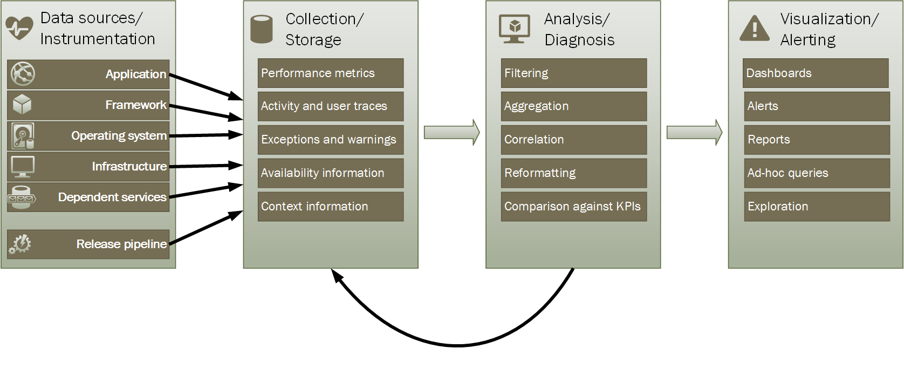
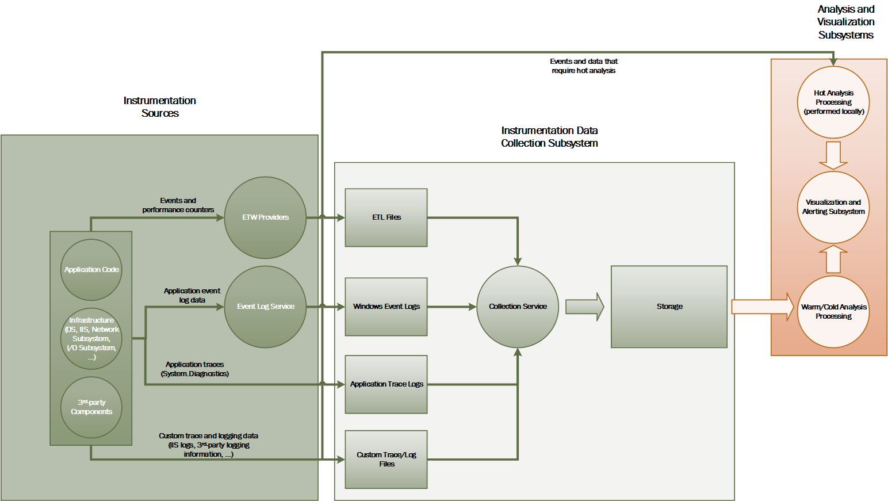
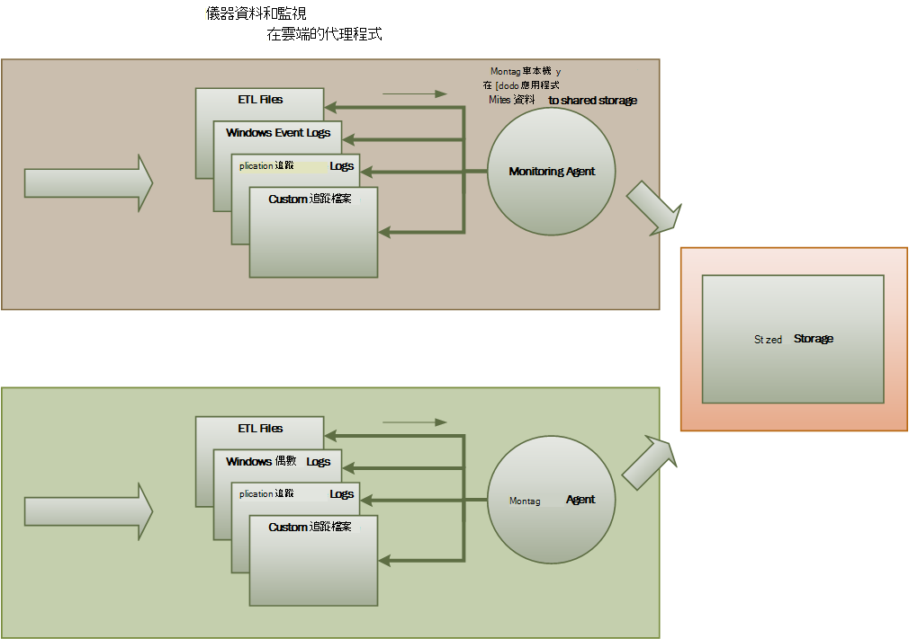

<properties
   pageTitle="監控和診斷指引 |Microsoft Azure"
   description="最佳作法監控在雲端的分散式應用程式的詳細資訊。"
   services=""
   documentationCenter="na"
   authors="dragon119"
   manager="christb"
   editor=""
   tags=""/>

<tags
   ms.service="best-practice"
   ms.devlang="na"
   ms.topic="article"
   ms.tgt_pltfrm="na"
   ms.workload="na"
   ms.date="07/13/2016"
   ms.author="masashin"/>

# <a name="monitoring-and-diagnostics-guidance"></a>監控和診斷指南

[AZURE.INCLUDE [pnp-header](../includes/guidance-pnp-header-include.md)]

## <a name="overview"></a>概觀
分散式應用程式與服務在雲端中執行，以就其性質，包含許多變動複雜軟體片段。 在生產環境中，請務必可追蹤的使用者使用您的系統、 追蹤資源使用狀況的方式，並通常監控健康狀況與系統效能。 您可以在偵測並修正問題，同時也能夠協助出潛在問題並避免發生的診斷輔助工具使用這項資訊。

## <a name="monitoring-and-diagnostics-scenarios"></a>監控和診斷分析藍本
您可以使用監控深入瞭解系統的運作方式。 監視是很重要部分維護服務品質目標。 用來收集監控資料的常見情況包括︰

- 確保，系統仍會健全。
- 追蹤系統和其元件的可用性。
- 維護效能，以確保的系統不會降低意外地為工時增加的音量。
- 保證系統符合與客戶建立任何服務等級協定 (Sla)。
- 保護隱私權及安全性系統的使用者，請與他們的資料。
- 追蹤稽核或法規用途所執行的作業。
- 監控系統和一時間如果他們不收件者可能會導致問題的趨勢的每日的使用方式。
- 追蹤從透過初始報表的可能原因，rectification、 連續的軟體更新及部署分析會發生的問題。
- 追蹤作業和偵錯軟體版本。

> [AZURE.NOTE] 這份清單，不是要全面涵蓋所有內容。 最常見的情況下，執行監控這些案例著重於此文件。 可能會有其他人所少或專屬於您的環境。

下列各節說明這些案例的更多詳細資料。 每個案例的資訊是以下列格式討論︰

1. 此案例簡短的概觀
2. 這種情況的一般需求
3. 原始儀器資料所需可支援案例中，與可能的來源，這項資訊
4. 如何進行分析並結合以產生有意義的診斷資訊這原始資料

## <a name="health-monitoring"></a>監控健康狀況
系統是健全是否正在執行，並且可以處理要求。 健康監視的目的是狀況的產生目前系統的快照，讓您可以驗證系統的所有元件，如預期般都運作。

### <a name="requirements-for-health-monitoring"></a>健康監視需求
如果系統的任何部分會視為不佳，應收到運算子快速 （在一分鐘內）。 運算子，應該能夠查明系統中的哪些部分運作正常，並哪些部分遇到的問題。 可透過流量 light 系統醒目提示系統運作情況︰

- 紅色的健康 （已停止系統）
- 黃色的部分狀況良好 （系統執行精簡功能）
- 綠色的完全健全

完整的狀況監控系統可讓您向下切入至檢視子系統和元件的健康狀態的系統運算子。 例如，如果整體系統為部分健全所述，運算子應該即可拉近顯示，決定哪些功能目前無法使用。

### <a name="data-sources-instrumentation-and-data-collection-requirements"></a>資料來源與儀器，資料收集需求
支援健康監視所需的原始資料可能會導致產生︰

- 追蹤使用者要求執行。 若要判斷哪些要求已成功、 已失敗，以及每個要求耗費可這項資訊。
- 監控綜合的使用者。 此程序模擬使用者所執行的步驟，以及追蹤一系列預先定義的步驟。 應該擷取每個步驟的結果。
- 記錄例外狀況、 錯誤，以及警告。 這項資訊可以擷取當做追蹤陳述式內嵌至應用程式的程式碼，以及從事件記錄檔的任何服務的系統參照擷取資訊。
- 監控系統會使用任何協力廠商服務的健康情況。 監控可能會要求擷取及剖析提供這些服務的健康情況資料。 這項資訊可能需要不同的格式。
- 監控結束點。 在 「 監控可用性] 區段中的更多詳細資料說明此機制。
- 收集環境效能的資訊，例如背景 CPU 使用率或 I/O （包括網路） 活動。

### <a name="analyzing-health-data"></a>分析狀況的資料
健康監視的主要焦點是快速指出是否正在執行系統。 熱門的即時資料分析可以通知觸發程序，如果要徑元件偵測到為不佳。 （其無法回應連續的系列的 ping，例如。）運算子可以採取適當的矯正。

更多進階的系統可能會包含在最近和目前的工作量執行低溫分析的預測項目。 低溫的分析，可以找出趨勢並決定是否可能保留健全系統或系統是否需要額外的資源。 這個預測的項目應該會根據關鍵效能指標，例如︰

- 針對每個服務或子系統要求的工資率。
- 這些要求回應時間。
- 傳送出每個服務的資料量。

如果任何公制價值超過定義的臨界值，系統可以提高通知啟用採取一些預防動作維護系統運作情況必要的運算子或自動縮放 （如果有的話）。 這些動作可能需要新增資源]，重新啟動失敗，或套用至較低優先順序要求的 [節流的一或多個服務。

## <a name="availability-monitoring"></a>監控可用性
真正良好的系統要求的元件和構成系統子系統都是可用。 可用性監視密切監控健康狀況。 但健康監視提供即時的目前系統的狀況檢視，而可用性監視關於追蹤系統和其元件，以產生系統的執行時間的相關統計資料的可用性。

在許多系統，以允許快速容錯移轉發生嚴重錯誤或連線中斷時的內建重複設定部分元件 （例如資料庫）。 理想的情況下，使用者不應該知道這類失敗發生。 但從監控透視圖中的顯示狀態，就必須收集為盡可能的哪些相關資訊這類來決定原因，以及進行修正，防止設為重複發生失敗。

追蹤可用性所需的資料可能會取決於較低層級因素。 許多這些因素可能特定應用程式、 系統和環境。 有效的監控系統擷取的可用性資料對應至這些低功率因素，然後將其授與系統的完整彙總。 例如電子商務系統，讓客戶訂單商業功能可能會取決於訂單詳細資料的儲存位置存放庫和處理這些訂單所支付的貨幣交易付款系統。 系統的順序放置組件的顯示狀態，因此是存放庫及付款子系統可用的函數。

### <a name="requirements-for-availability-monitoring"></a>可用性監視的需求
運算子也應該可以檢視歷史可使用每個系統和子系統，並使用此資訊來找出可能會導致定期失敗的一或多個子系統任何趨勢。 （服務開始失敗特定對應至峰處理時間的一天的時間？）

監視解決方案應提供可用的 [立即和歷程記錄] 檢視或無法使用的每個子系統。 也應該簡訊的快速提醒運算子，或使用者無法連線至服務時一或多服務會失敗。 這是，不只監控每個服務，但也檢查如果嘗試與服務通訊時，這些動作會失敗，每位使用者執行的動作。 部分某種程度的連線失敗標準，而可能是因為暫時性錯誤。 但可能較為有用允許系統產生的連線失敗次數至指定的子系統期間發生的數字的警示。

### <a name="data-sources-instrumentation-and-data-collection-requirements"></a>資料來源與儀器，資料收集需求
使用狀況監視，以支援可用性監視所需的原始資料可能會產生綜合使用者監視與記錄任何例外狀況、 錯誤，以及可能會發生的警告。 此外，您可以從執行端點監控取得可用性資料。 應用程式可以公開一或多個狀況結束點，在系統中的功能區每個測試存取。 監控系統可以偵測 （ping） 所追蹤的已定義之的排程的每個端點，並收集結果 （成功或失敗）。

所有的逾時、 網路連線失敗次數及連線重必須記錄。 所有的資料必須是有時間戳記。

<a name="analyzing-availability-data"></a>
### <a name="analyzing-availability-data"></a>分析資料可用性
儀器資料必須彙總和相關支援下列類型的分析︰

- 系統和子系統立即使用。
- 系統和子系統可用性失敗率。 理想的情況下，應該能夠建立失敗特定活動之間的關係運算子︰ 在系統失敗時所發生的什麼？
- 系統或在任何任何子系統失敗率的歷史檢視指定期間內，與負載系統 （例如使用者要求數量） 上時，發生失敗。
- 原因系統或任何子系統。 例如，原因可能是未執行連線遺失，服務連線，但逾時，與連線，但傳回錯誤。

您可以在一段時間計算百分比可用的服務，使用下列公式︰

```
%Availability =  ((Total Time – Total Downtime) / Total Time ) * 100
```

這是用於 SLA 用途。 （[SLA 監控](#SLA-monitoring)會描述在本指南中稍後的更多詳細資料）。定義_停機時間_的服務而定。 例如，Visual Studio 小組建立服務期間建立服務無法使用的期間 （總累積分鐘） 來定義停機時間。 如果所有連續 HTTP 要求建立服務執行整個分鐘的客戶啟動作業會導致錯誤碼或不會傳回回應，則為分鐘被視為無法使用。

## <a name="performance-monitoring"></a>監控效能
當系統位於多壓力 （依遞增的使用者數量），這些使用者存取權的規模擴大時的資料集的大小，以及可能的一個或多個元件失敗就越。 通常，元件失敗會以減少效能。 如果您無法偵測減少，您可以採取積極的步驟來修正這種情況。

系統效能的因素而定。 每個因素通常以透過關鍵效能指標 (Kpi)，例如秒的資料庫交易的數字或大量網路要求成功地提供服務中指定的時間範圍。 這些 Kpi 的一些可能為特定的效能量值，而其他人可能衍生自指標的組合。

> [AZURE.NOTE] 判斷效能不佳或不錯，您必須瞭解的層級的系統應該能夠執行效能。 這需要觀察系統運作一般負載時，並在一段時間，每個 KPI 擷取資料。 這可能需要測試環境中執行模擬負載系統和部署系統生產環境之前，先收集適當的資料。

> 您也應該確保監控效能用途不會成為系統上的負擔。 您可能可以動態調整的層級之資料的效能監視程序會收集的詳細資料。

### <a name="requirements-for-performance-monitoring"></a>監控效能的需求
若要檢查系統效能，運算子通常需要查看包含的資訊︰

- 使用者要求回應工資率。
- 使用者同時要求的數目。
- 網路流量的音量。
- 在哪些 business 完成交易費率。
- 要求的平均處理時間。

也可以提供啟用協助出相互關聯，例如運算子的工具，還是有幫助︰

- 同時與要求延遲時間 （時間以開始處理要求使用者已送出後） 的使用者數目。
- 使用者人數 （所需的時間完成要求啟動處理後） 的平均回應時間與數字。
- 大量處理錯誤的數字與要求。

此高層級功能的資訊，以及運算子應該能夠取得系統中的每個元件效能詳細的檢視。 此資料通常是透過低功率效能計數器，例如追蹤資訊提供︰

- 記憶體使用量。
- 執行緒數目。
- CPU 處理的時間。
- 要求佇列長度。
- 磁碟機或網路 I/O 工資率和錯誤。
- 撰寫或讀取的位元組數。
- 介軟體指標，例如佇列長度。

所有視覺效果應該允許運算子以指定的時間範圍。 目前狀況的快照，及/或歷史檢視的效能，可能會顯示的資料。

運算子應會發出警示根據任何指定的時間間隔內的任何指定的值的任何效能量值。

### <a name="data-sources-instrumentation-and-data-collection-requirements"></a>資料來源與儀器，資料收集需求
您可以監控進度的使用者要求送達並傳遞，收集高層級的效能資料處理量 （的使用者同時數目、 商務交易、 錯誤費率等等）。 包括併入追蹤陳述式，在應用程式碼，搭配預存時間資訊的要點。 所有錯誤、 例外]，以及警告應該都擷取的足夠的資料，這些關聯造成這些要求。 網際網路服務 (IIS) 記錄是另一個實用的來源。

如果可能的話，您也應該擷取應用程式使用任何外部系統效能的資料。 這些外部系統可能會要求效能資料提供自己正在或其他功能。 如果不可行的話，請記錄的資訊，例如開始時間] 和 [外部系統，與作業的狀態 （成功、 失敗或警告） 所做的每個要求的結束時間。 例如，您可以使用時間要求的 stopwatch 方法︰ 啟動計時器，要求啟動時，並要求完成時，然後停止計時器。

可能會透過功能及服務，例如 Windows 的效能計數器和 Azure 診斷系統中的個別元件的低功率效能資料。

### <a name="analyzing-performance-data"></a>分析效能資料
大部分的分析工作組成的使用者要求類型及/或子系統或傳送的每個要求的服務的效能資料彙總。 使用者要求的範例是將項目新增至購物車或 e 商務系統執行取出程序。

其他的一般需求摘要中所選的百分位數的效能資料。 例如，運算子可能會決定 99%的要求，95%的要求]，然後 70%的要求的回應時間。 可能會有 SLA 目標或其他目標設定為每個百分位數。 進行中的結果應該近期即時報告可協助偵測立即問題。 結果也是一段較長的時間用於統計彙總。

若是延遲問題會影響效能，應該能夠快速識別瓶頸的原因，檢查每一條執行每個步驟的延遲運算子。 效能資料因此必須提供的相互關聯的每個步驟，將其連接至特定的要求的效能量值的方法。

根據視覺效果的需求，可能較為有用來產生及儲存資料 cube 包含原始資料的檢視。 此資料立方體可允許複雜的臨機操作查詢及分析效能的資訊。

## <a name="security-monitoring"></a>安全性監視
所有的商業系統會包含機密資料必須實作安全性結構。 複雜的安全性機制通常是敏感度的函數表示之資料。 在系統中，要求使用者進行驗證，您應該記錄︰

- 所有的登入嘗試，他們會失敗，或失敗。
- 由-執行所有作業，所有資源的詳細資料，經過驗證的使用者存取。
- 當使用者結束工作階段，然後登出。

監控可能可以幫助偵測攻擊系統上。 例如，大量失敗的登入嘗試可能表示惡意攻擊。 在邀請中的未預期的超載可能分散式拒絕服務 (DDoS) 攻擊的結果。 您必須準備監控所有的要求，無論這些要求的來源的所有資源。 有登入弱點的系統無須實際登入的使用者，可能不小心公開外面的世界的資源。

### <a name="requirements-for-security-monitoring"></a>監控安全性需求
最重要的安全性監視事宜應該啟用運算子來快速所示︰

- 偵測嘗試的入侵未經認證的實體。
- 識別用他們您尚未被授予存取權的資料上執行作業的實體嘗試。
- 決定是否系統或系統的某些部分遭受來自外部或內。 （例如，惡意已驗證的使用者可以嘗試擺系統。）

若要支援這些需求，運算子時應收到通知︰

- 如果讓重複一個帳戶，您無法登入嘗試在指定期間內。
- 如果已驗證的帳戶重複嘗試存取禁止的資源在指定期間內。
- 如果在指定期間內過程中發生大量未經認證或未經授權的要求。

提供給運算子的資訊應該包含每個要求的來源的主機地址。 如果安全性衝突定期發生從特定範圍的地址，可能會封鎖這些主機。

在維護系統的安全性的重要部分能夠快速偵測不符合主要模式中的動作。 可協助偵測中是否有特殊圖文集活動異常次以視覺化方式顯示資訊，例如失敗及/或順利登入要求的數目。 （此活動的範例是使用者登入 onedrive 3:00 AM，並執行大量的作業，其工作日開始在 9:00 AM 時）。 這項資訊也可用來協助您設定以時間為基礎的自動縮放。 例如，如果運算子採行的大量使用者定期登入特定一天的時間，可以開始處理的工作，並時最大使用量已經過了，然後關閉這些額外的服務的額外的驗證服務來排列運算子。

### <a name="data-sources-instrumentation-and-data-collection-requirements"></a>資料來源與儀器，資料收集需求
安全性是完全包含最分散式系統的外觀。 相關的資料有可能會產生在整個系統的多點。 您應該考慮採用收集安全性相關資訊所產生的事件引發的應用程式、 網路設備、 伺服器、 防火牆、 防毒軟體，以及其他侵入防止項目安全性資訊及事件管理 (SIEM) 的方式。

安全性監視，可以將資料從不是您的應用程式組件的工具。 這些工具可以包含公用程式識別連接埠掃描活動外部代理人或網路篩選器，偵測嘗試未經授權存取您的應用程式和資料。

在所有的情況下，收集的資料必須啟用系統管理員決定任何攻擊的性質，而讓適當的措施。

### <a name="analyzing-security-data"></a>分析安全性資料
安全性監視的功能是各種來源的資料便會發生。 不同的格式和層級的詳細資料通常需要複雜的分析，擷取的資料以將它放在一起連接到連貫執行緒的資訊。 除了最簡單的 （例如偵測大量失敗的登增益集] 或重複的嘗試未經授權存取重要的資源） 的情況下，可能無法執行任何複雜的自動化的處理安全性資料。 不過，可能會優先於撰寫此資料，但否則原始形式，以允許的專家手動分析的安全存放庫時間戳記。

<a name="SLA-monitoring"></a>

## <a name="sla-monitoring"></a>監控 SLA
支援付費客戶的許多商業系統的 Sla 的表單中，進行保證系統的效能。 基本上，Sla 狀態系統可以處理工作同意的時間範圍內，而不遺失重要資訊已定義之的量。 監控 SLA 被為了確保系統可以符合測量 Sla。

> [AZURE.NOTE] 監控 SLA 密切監控效能。 但效能監視為了確保的系統函數_以最佳方式_，而 SLA 監控由定義哪些_以最佳方式_是表示契約義務。

Sla 通常會定義數︰

- 整體系統的可用性。 例如，組織可能保證系統將會用於 99.9%的時間。 這等於不超過 9 小時的每一年，或 10 分鐘一週的停機時間。
- 操作處理量。 這方面通常以一或多個最高-水標記，例如保證系統可以支援多達 100000 使用者同時要求或處理 10000 同時商務交易。
- 操作回應時間。 系統可能也會將提供處理要求的頻率。 範例是 99%的所有商務交易完成中 2 的秒數，並在沒有單一交易帶超過 10 秒內。

> [AZURE.NOTE] 商業系統的一些合約也可能會包含 Sla 的客戶支援。 範例是所有服務台要求會都引發回應，5 分鐘內，和 99%的所有問題將會完全解決內 1 的工作日。 有效[議題追蹤](#issue-tracking)（稍後所述本節） 是會議 Sla 這些按鍵。

### <a name="requirements-for-sla-monitoring"></a>監控 SLA 的需求
最高層級，應該能夠概覽判斷系統是否為會議同意的 Sla 運算子。 如果 not、 運算子應會切入與向下，並檢查基礎的因素，以判斷不合規格效能的原因。

一般可以視覺化方式所述的高層級指標包括︰

- 服務執行時間的百分比。
- 應用程式處理量 （衡量成功交易及/或秒作業）。
- 成功/失敗的應用程式要求的數目。
- 應用程式與系統錯誤、 例外] 及警告的數字。

所有這些標記應該能夠進行篩選來指定一段時間。

雲端應用程式可能會包含的子系統元件的數字。 運算子應會選取高層級的標記，並查看它由健康狀況的基礎的項目。 例如，如果整體系統的執行時間低於可接受的值，運算子應該可以放大顯示，並確定哪些項目會造成此錯誤。

> [AZURE.NOTE] 需要謹慎定義系統執行時間。 在系統中使用重複，以確保最大值的顯示狀態，可能無法個別執行個體的項目，但系統可以保留功能。 系統執行時間表示健康監視應指示彙總的執行時間的每個項目和不一定是否系統已確實停止執行。 此外，您可能會隔離失敗。 因此即使特定系統無法使用時，系統的其餘部分可能都會持續為可用，但仍會有縮小的結果的功能。 （e 商務系統，在系統失敗可能會防止客戶訂單，但是客戶可能仍然可以瀏覽產品類別目錄）。

警告的目的，系統應該高層級的指標的任何超過特定的閾值時所產生的事件。 較低層級的詳細資料的各種不同的因素，撰寫高層級的指標應提供警示系統關聯式資料。

### <a name="data-sources-instrumentation-and-data-collection-requirements"></a>資料來源與儀器，資料收集需求
支援 SLA 監控所需的原始資料很類似與一些健康狀況與可用性監控效能監視所需的原始資料。 （請參閱這些章節以供更多詳細資料）。您可以擷取這項資料來︰

- 執行監控結束點。
- 記錄例外狀況、 錯誤，以及警告。
- 追蹤使用者要求執行。
- 監控系統會使用任何協力廠商服務的可用性。
- 使用效能標準和計數器。

所有的資料必須逾時，有時間戳記。

### <a name="analyzing-sla-data"></a>分析 SLA 資料
儀器資料必須彙總，來產生的整體系統效能的圖片。 彙總的資料，也必須支援向下切入至啟用檢查基礎子系統的效能。 例如，您應該可以︰

- 在指定期間內計算使用者要求總數，決定成功和失敗報酬率這些要求。
- 合併以產生系統回應時間的整體檢視使用者要求的回應時間。
- 分析使用者要求劃分成個別工作中的項目該要求的回應時間要求的整體回應時間的進度。  
- 判斷整體系統的執行時間的百分比的可用性任何特定期間。
- 分析系統中的個別的元件和服務可用性百分比時間。 這可能需要剖析協力廠商服務所產生的記錄。

許多商業系統，才能在指定期間內，通常是每月報表針對同意 Sla 實數效能數字。 這項資訊可用於貸項總計或其他形式的 repayments 計算的客戶，如果 Sla 不符合該期間。 您可以使用 [[分析的資料可用性](#analyzing-availability-data)] 區段中所述的技術來計算服務的可用性。

僅供內部，組織也可能會追蹤的數字和性質造成服務失敗的工作量。 學習如何解決這些問題快速，或完全排除他們為了降低停機時間，而符合 Sla。

## <a name="auditing"></a>稽核
根據應用程式的性質，可能會或其他指定稽核使用者的作業和錄製所有資料存取需求的法律規定。 稽核可以提供辨識項特定的要求該連結的客戶。 不拒絕是可協助維持信任的許多電子商務系統中的重要因素介於客戶和負責應用程式或服務的組織。

### <a name="requirements-for-auditing"></a>稽核的需求
分析師必須追蹤使用者正在執行，好讓您可以重新建立使用者的動作的商務作業的順序。 這可能是記錄的必要中，為或法庭法律調查證據的一部分。

稽核資訊都相當重要。 很可能會包含資料的識別系統，與他們正在執行的工作的使用者。 因此，帶很可能稽核資訊僅適用於信任分析師的報表的表單，而非互動式系統支援的向下切入的圖形化作業。 分析師應會產生報表的範圍。 例如報表可能會在指定的時間範圍期間發生的所有使用者的活動] 清單、 詳細資料的單一使用者，活動時序或清單對一或多個資源執行的作業的順序。

### <a name="data-sources-instrumentation-and-data-collection-requirements"></a>資料來源與儀器，資料收集需求
資訊的稽核的主要來源可以包含︰

- 管理使用者驗證安全性系統。
- 追蹤記錄使用者活動的記錄。
- 追蹤所有的識別並不能辨識網路要求的安全性記錄檔。

稽核資料和其的儲存的方式的格式可能會受到法規要求。 例如，它可能無法清除任何方式中的資料。 （它必須使用來錄製在原始格式。）存取持有的位置存放庫必須受到保護，以防止遭到竄改。

### <a name="analyzing-audit-data"></a>分析稽核資料
分析師必須能夠存取完整原始形式的原始資料。 除了產生常見的稽核報告的需求，分析資料的工具是可能會專業及保持外部系統。

## <a name="usage-monitoring"></a>監視使用情況
監視使用情況追蹤的功能和元件的應用程式的使用方式。 運算子，可以使用收集的資料以︰

- 判斷哪些功能重度使用，並判斷系統中的任何可能的作用點。 高流量的項目可能會因功能分割或甚至複寫更加平均地分配載入。 運算子也可以使用這項資訊，以確定哪些功能不常使用且可能對象退休或未來版本的系統中的替代方案。
- 取得使用標準底下系統的作業事件的相關資訊。 例如，電子商務在網站中，您可以記錄統計交易數] 及 [客戶所負責的音量的相關資訊。 這項資訊可用於容量規劃當規模擴大時的客戶。
- 偵測 （可能是間接） 效能或系統功能的使用者滿意度。 例如，若大量電子商務系統中的客戶定期放棄其購物車，可能是因為取出功能的問題。
- 產生的計費資訊。 商業應用程式或 multitenant 服務可能會因為他們使用資源的客戶。
- 強制執行配額。 如果 multitenant 系統中的使用者超過其付費的處理在指定期間內的時間] 或 [資源使用量配額，可以限制其存取權，或處理可以經流速控制。

### <a name="requirements-for-usage-monitoring"></a>監視使用情況的需求
若要檢查系統的使用方式，運算子通常需要查看包含的資訊︰

- 邀請的每個子系統來處理和導向至每個資源的數字。
- 每位使用者正在執行的工時。
- 資料儲存空間，每位使用者佔用音量。
- 資源的每個使用者存取。

運算子應該也可以產生圖形。 例如，圖形可能會顯示最很資源餓使用者，或最常資源或存取系統功能。

### <a name="data-sources-instrumentation-and-data-collection-requirements"></a>資料來源與儀器，資料收集需求
在較高的層級，才能執行追蹤的使用方式。 它可以請注意，每個要求的開始和結束時間，要求 （閱讀、 撰寫及等等，根據問題資源） 的自然。 您可以取得這項資訊來︰

- 追蹤使用者活動。
- 擷取效能計數器，用來計算每個資源使用狀況。
- 監控資源耗用的每個使用者。

為計量之用，您也需要能夠識別哪些使用者負責執行的作業，以及這些作業利用的資源。 收集的資訊應詳細足以啟用正確的帳單。

<a name="issue-tracking"></a>
## <a name="issue-tracking"></a>議題追蹤
客戶及其他使用者，如果系統中發生的非預期的事件或行為可能會回報問題。 關於議題追蹤管理這些問題、 相關工作，以解決系統中的任何潛在問題，並通知客戶的可能的解決方案。

### <a name="requirements-for-issue-tracking"></a>議題追蹤需求
運算子經常執行議題追蹤使用不同的系統，讓它們若要錄製及報表問題的詳細資料，該使用者的報表。 這些詳細資料可以包含使用者嘗試執行時，發生上述任何症狀問題、 的順序的事件，以及任何錯誤或發出警告訊息的工作。

### <a name="data-sources-instrumentation-and-data-collection-requirements"></a>資料來源與儀器，資料收集需求
議題追蹤資料的初始的資料來源是首先提報問題的使用者。 使用者可能無法提供其他資料，例如︰

- 當機傾印 （如果應用程式會包含在使用者的桌上型電腦執行的元件）。
- 畫面快照。
- 日期及時間時，發生錯誤，與其他任何環境資訊，例如使用者的位置。

這項資訊可協助偵錯的項目，並協助建構積存未來的版本的軟體。

### <a name="analyzing-issue-tracking-data"></a>分析議題追蹤資料
不同的使用者可能會報告相同的問題。 議題追蹤系統應該將一般的報表建立關聯。

針對每個問題報告應該記錄的偵錯工作進度。 當此問題已解決時，客戶可以通知解決方案。

如果使用者報告問題的議題追蹤系統中有已知的解決方案，運算子應會立即通知方案的使用者。

## <a name="tracing-operations-and-debugging-software-releases"></a>追蹤作業和偵錯軟體版本
當使用者報告問題時，並通常只知道有其作業的直接影響使用者。 使用者可以只回報自己體驗的結果是負責維護系統運算子。 這些體驗通常只顯示一個或多個基本問題的症狀。 在許多情況下，分析師必須挖時序基本作業來建立根本原因的問題。 此程序稱為_根本原因分析_。

> [AZURE.NOTE] 根本原因分析可能會發現應用程式的設計中的效率。 在下列情況下，可能會重做受影響的項目及部署進行後續發行版本的一部分。 此程序需要謹慎控制項，並應密切監控更新的元件。

### <a name="requirements-for-tracing-and-debugging"></a>追蹤和偵錯的需求
追蹤未預期的事件和其他問題，是相當監視資料提供資訊不足，無法啟用 [追蹤這些問題的來源分析師和重建發生的事件順序。 必須啟用診斷任何問題的根本原因分析師足夠這項資訊。 開發人員可以再進行必要的修改，若要防止設為重複發生。

### <a name="data-sources-instrumentation-and-data-collection-requirements"></a>資料來源與儀器，資料收集需求
疑難排解可能需要的追蹤所有方法 （和其參數） 中叫用的作業來建立樹狀目錄中的說明系統邏輯流程客戶會讓特定的要求。 例外狀況和系統產生當做這個流量的警告需要擷取及登入。

若要支援偵錯時，系統可以提供啟用運算子來擷取系統中的重要時間點的狀態資訊的連結。 或者，系統進行為所選的作業進度的詳細逐步資訊。 在此層級的詳細資料擷取資料可以限制其他的載入系統上，而且應該暫存的程序。 運算子使用此程序，主要當常見的一系列的事件發生再很難複製，或新版本的一或多個項目至系統需要仔細監視，以確保預期的項目函數。

## <a name="the-monitoring-and-diagnostics-pipeline"></a>監控和診斷管線
監控大型分散式的系統會相當大的挑戰。 每個案例前一節所述不一定考慮隔離。 有可能會在每一種情況下，所需的監控和診斷資料中的重疊，雖然這項資料可能需要處理，並以不同方式呈現。 基於下列原因，您應該採取監控和診斷全方位的檢視。

您可以為包含圖 1 階段的管線 envisage 整個監控和診斷程序。



_圖 1。監控和診斷管道階段_

圖 1 醒目提示之資料的監控和診斷如何來自各種不同的資料來源。 記錄和集合階段被關於識別從需要若要擷取資料來源決定要擷取的資料、 如何擷取，以及如何設定此資料的格式，以便可以輕鬆地檢查。 分析/診斷階段採用原始資料，並使用它來產生有意義的資訊，可以使用運算子，來判斷系統的狀態。 運算子可以進行瞭解可能的動作的決策，請使用這項資訊，然後再回記錄和集合階段摘要結果。 視覺效果/警示階段階段呈現可檢視系統狀態。 使用一系列的儀表板，它可以近期即時顯示資訊。 它會產生報表、 圖形及提供的資料，可協助您識別長期趨勢的歷史檢視的圖表。 如果資訊指出 KPI 可能會超過可接受界限，此階段也會觸發運算子通知。 在某些情況下，提醒也可以用來觸發嘗試進行修正，例如自動縮放自動化程序。

請注意下列步驟構成連續流程程序平行階段發生的位置。 理想的情況下，所有的階段應該動態的設定。 在某些點，尤其是系統新部署或發生問題，可能需要更頻繁地收集擴充的資料。 在其他時候，應該會還原為擷取基底層級的重要的資訊，以確認系統運作正常。

此外，整個監控程序，應該考慮即時、 進行中的解決方案，受限於微調和意見反應當做的改良功能。 例如，您可能會開始測量許多因素來決定系統運作情況。 當您捨棄量值，不相關，讓您更精確地著重於您所需要的資料分析一段時間可能導致精簡搜尋時最小化背景噪音。

## <a name="sources-of-monitoring-and-diagnostic-data"></a>監控和診斷資料來源
監控程序會使用的資訊可以來自多個來源，圖 1 中所示。 在應用程式層級，資訊是來自併入系統的程式碼的追蹤記錄檔。 開發人員依循追蹤其程式碼的控制流程的標準方法。 例如，方法的項目可以發出追蹤郵件的方法，目前的時間，每個參數和其他相關資訊的值的名稱。 錄製的項目和結束時間可以也派上用場。

請登入所有的例外狀況和警告，並確保保留任何巢狀例外狀況和警告的完整追蹤。 理想的情況下，您也應該擷取識別執行的程式碼，活動相關資訊 （若要追蹤通過系統要求） 與使用者的資訊。 您應該記錄嘗試存取所有的資源，例如訊息佇列、 資料庫、 檔案，以及其他相關的服務。 這項資訊可用於計量和稽核之用。

多個應用程式使用文件庫及架構的執行一般工作，例如存取資料存放區，或透過網路通訊。 這些架構可能可提供自己追蹤訊息與原始的診斷資訊，例如交易工資率和資料傳輸成功失敗。

> [AZURE.NOTE] 許多現代架構自動發佈效能及追蹤事件。 擷取這項資訊也就是提供一種方法來擷取及儲存它會處理和分析。

正在應用程式的作業系統，可低功率系統資訊，例如效能計數器指出 I/O 工資率、 記憶體使用量和 CPU 使用率的來源。 作業系統 （例如無法正確開啟檔案） 的錯誤可能也會報告。

您也必須考量基礎基礎架構與您的系統執行的元件。 虛擬機器、 虛擬網路和儲存服務所有可來源的重要基礎結構層級的效能計數器及其他診斷的資料。

如果您的應用程式使用其他外部的服務，例如網頁伺服器或資料庫管理系統，這些服務可能發佈自己追蹤資訊、 記錄和效能計數器。 範例包含 SQL Server 動態管理檢視來追蹤 SQL Server 資料庫，針對所執行的作業，並且 IIS 追蹤記錄的錄製的網頁伺服器所做的要求。

修改系統的元件，並已部署新的版本，請務必能夠屬性問題、 活動和每個版本的指標。 這項資訊應繫結至發行管線能夠快速追蹤及修正問題特定版本的元件。

系統可能會在任何時候發生安全性問題。 例如，使用者可能會嘗試無效的使用者識別碼或密碼登入。 已驗證的使用者可能會嘗試取得未經授權的存取資源。 或使用者可能會提供存取加密的資訊不正確或過期的金鑰。 應該一律記錄成功、 失敗要求的安全性相關的資訊。

[[操作應用程式](#instrumenting-an-application)] 區段包含更多的指示，您應該擷取的資訊。 但您可以使用各種不同的策略來收集這項資訊︰

- **監視應用程式/系統**。 此策略使用中應用程式、 應用程式架構、 作業系統，以及基礎結構的內部來源。 應用程式碼會產生自己的週期中的用戶端要求監視主要點的資料。 應用程式可以包含可能選擇性地啟用或停用的情況下聽寫追蹤陳述式。 它也可以使用的診斷架構動態插入診斷。 這些架構通常會提供可以附加至您的程式碼中的各種儀器點及追蹤這些點的資料擷取的外掛程式。

    此外，您的程式碼及/或基礎結構可能引發關鍵點的事件。 監控代理程式設定成接聽這些事件可以記錄事件的資訊。

- **監控真實的使用者**。 這個方法記錄使用者與應用程式之間的互動，而且會觀察每個邀請及回應的流程。 這項資訊可以有兩個摺用途:，可用於計量使用的每個使用者，並可用於決定使用者是否有收到服務 （例如，快速回應時間、 低延遲和最小的錯誤） 適合品質。 若要找出重點區域失敗最常出現的位置，您可以使用所擷取的資料。 您也可以使用資料來識別項目位置系統變慢，可能是因為應用程式或其他形式的瓶頸的作用點。 如果您仔細實作這種方法，可能會進行重建使用者的流程偵錯及測試版應用程式。

    > [AZURE.IMPORTANT] 您應該考慮由監控真實的使用者，因為它可能包含機密資料要高度敏感所擷取的資料。 如果您要儲存所擷取的資料，安全地將其儲存。 如果您想要使用的效能監視或偵錯的資料，請先解所有個人資訊。

- [**綜合使用者監控**。 在這種方式，您撰寫您自己測試用戶端，模擬使用者，然後執行作業可設定，但一般系列。 您可以追蹤測試用戶端，以協助您判斷系統的狀態的效能。 您也可以使用負載測試作業的一部分的測試用戶端的多個執行個體來建立系統過大，回應的方式與在這些情況下，會產生哪一種監控輸出。

    > [AZURE.NOTE] 您可以監視實數、 綜合的使用者，包括追蹤和時間的方法呼叫和重要的其他部分應用程式執行的程式碼。

- **設定檔**。 這種方法是主要被針對監督和改善應用程式的效能。 而不是作業系統的實際和綜合使用者監控功能層級，它會擷取應用程式執行較低層級資訊。 您可以執行分析使用定期取樣 （決定的時間點指定執行應用程式的程式碼） 的應用程式的執行狀態。 您也可以使用儀器探查插入重要 junctures （例如開始和結束的方法呼叫） 的程式碼，記錄叫用的方法是，哪些次和所花費的時間長度的每個呼叫。 您可以分析此資料至決定應用程式中的哪些部分可能會導致效能問題。

- **監控結束點**。 這項技術使用一或多個應用程式公開啟用監視，以便於診斷結束點。 端點會提供路徑至應用程式碼，並可傳回系統的狀況相關資訊。 不同的結束點可以著重於各式各樣的功能。 您可以撰寫會定期要求傳送給這些端點自己診斷用戶端和同化回應。 這種方法，請參閱更多[狀況端點監控圖樣](https://msdn.microsoft.com/library/dn589789.aspx)Microsoft 網站上。

最大值的範圍，則應使用這些技術的組合。

<a name="instrumenting-an-application"></a>
## <a name="instrumenting-an-application"></a>操作應用程式
儀器是不可或缺的一部分的監控程序。 只有當您第一次擷取資料，可讓您決定，您可以進行有意義的效能與系統的狀況相關的決策。 您使用儀器收集的資訊應足以，讓您將評估效能、 診斷問題，並不會要求您登入至遠端生產伺服器執行追蹤 （和偵錯） 做出決策以手動方式。 儀器資料通常包含度量資訊和寫入追蹤記錄的資訊。

追蹤記錄的內容可寫入的應用程式的文字資料或建立追蹤事件的結果為 （如果應用程式會使用事件追蹤 Windows-ETW） 的二進位資料的結果。 他們也可以從系統記錄的工作而有基礎結構，例如網頁伺服器的組件的事件記錄會產生。 文字記錄訊息通常專為閱讀，但也應該撰寫可讓系統自動輕鬆剖析它們的格式。

您也應該將記錄分類。 沒有寫入單一記錄，追蹤的所有資料，但錄製系統作業不同層面的追蹤輸出使用個別的記錄檔。 您可以再快速篩選記錄訊息讀取適當的記錄，而不是不必處理單一冗長的檔案。 永遠不會寫入的資訊 （例如稽核資訊和偵錯時，資料） 的不同的安全性需求有相同的記錄檔。

> [AZURE.NOTE] 記錄可能會用作檔案系統上的檔案，或它可能會保留在一些其他格式，例如 [blob blob 儲存體中。 記錄資訊也可能會保留在其他結構化的儲存空間，例如表格中的列。

指標通常會量值或部分的長寬或資源的計數系統中一次特定的一或多個相關聯的標籤尺寸 （有時稱為_範例_）。 一個執行個體的度量單位，通常不是實用隔離。 不過，指標必須擷取一段時間。 考慮的主要問題是您應該記錄的指標及頻率。 經常產生眼的資料可以強制重要的其他負載系統上，而擷取指標不常可能會錯過的情況下嚴重事件的潛在客戶。 考量而異公制公制。 例如在伺服器上的 CPU 使用率可能會因大幅第二個第二個，但高使用率它在數分鐘的時間較久，才會變成問題。

<a name="information-for-correlating-data"></a>
### <a name="information-for-correlating-data"></a>相互關聯資料的資訊
您可以輕鬆地監控個別系統層級的效能計數器、 擷取指標的資源，並取得應用程式追蹤資訊從各種不同的記錄檔。 但某些形式的監控要求監控管道相互關聯會從多個來源中擷取的資料分析和診斷階段。 此資料可能需要幾個表單中的原始資料，並分析程序必須提供足夠儀器資料能夠對應這些不同的表單。 例如，應用程式層級架構，任務可能會以識別執行緒識別碼。 在應用程式，相同的工作可能會執行工作的使用者的使用者識別碼與相關聯。

此外，有可能不是 1:1 之間的對應執行緒和使用者的要求，因為非同步作業可能會重複使用相同的執行緒執行作業代表一個以上的使用者。 很作法，單一要求可能會依一個以上的討論主題當做處理整個系統執行流。 如果可能的話，每一條關聯會傳播至整個系統要求內容的一部分活動唯一識別碼。 （產生及追蹤資訊包括活動識別碼技巧取決於技術，可用來擷取追蹤資料）。

監控的所有資料都應該都是以相同的方式有時間戳記。 一致性，請使用國際標準時間記錄所有日期和時間。 這將可協助您更輕鬆地追蹤的事件的順序。

> [AZURE.NOTE] 在不同的時區和網路作業系統的電腦可能不會同步處理。 不使用了解單獨使用的時間戳記的相互關聯儀器資料橫跨多部電腦而定。

### <a name="information-to-include-in-the-instrumentation-data"></a>要儀器資料中所包含的資訊
當您決定您需要收集哪些儀器資料，請考慮下列幾點︰

- 請確定所追蹤的事件擷取的資訊是電腦和讀。 採用明確定義的結構描述可加速記錄資料的自動化的處理系統，並提供作業及工程人員讀取記錄的一致性這項資訊。 包含環境的資訊，例如部署環境中，執行的電腦上的程序，此程序和呼叫堆疊的詳細資料。  
- 讓分析只在必要時，因為它可以強制明顯的負荷系統上。 使用儀器進行剖析記錄事件 （例如方法呼叫），每次而取樣記錄只選取的事件。 選取範圍可以時間為基礎 （一次每隔*n*秒），或頻率為基礎 （後每隔*n*要求）。 如果事件發生經常，進行剖析儀器可能會造成太多負擔和本身會影響整體效能。 在此情況下，可能最好取樣方法。 不過，如果事件的頻率低，取樣可能會錯過它們。 在此情況下，儀器可能會更好的方法。
- 提供足夠的內容，讓開發人員或系統管理員決定每個要求的來源。 這可能會包含某種識別要求的特定的執行個體的活動識別碼。 也可能會包含可用來執行計算工時與使用的資源關聯此活動的資訊。 請注意，這項工作可能會交互處理序和電腦的範圍。 針對計量內容也應該包含 (直接或間接透過其他相關資訊) 造成進行要求的客戶的參考。 此內容提供監控資料擷取次應用程式狀態的重要資訊。
- 記錄所有邀請，位置或區域所做這些要求。 這項資訊可協助判斷是否有任何特定位置的作用點。 這項資訊也可以用於決定是否要分割的應用程式或它所使用的資料。
- 錄製，並仔細擷取例外狀況的詳細資料。 通常要徑偵錯資訊是當做不佳的例外狀況處理遺失。 擷取應用程式，包括任何內部例外狀況及其他內容資訊會傳回的例外狀況的完整詳細資料。 如果可能包含呼叫堆疊。
- 是一致的資料，擷取不同的項目，您的應用程式，因為這可協助分析事件及關聯這些使用者要求。 請考慮使用全面涵蓋所有內容，可設定記錄套件收集的資訊，而不是根據 [開發人員實作系統的不同部分採用相同的方法。 收集關鍵效能計數器，例如 I/O 正在執行網路使用率、 要求、 記憶體使用量及 CPU 使用率大量的資料。 某些基礎結構服務可能會提供自己的特定的效能計數器，例如連線至資料庫，用以正在執行交易，工資率的成功或失敗交易數的數字。 應用程式也可能會定義自己的特定的效能計數器。
- 記錄對等資料庫系統的外部服務、 web 服務或其他系統層級服務的基礎結構的組件所做的所有電話。 記錄資訊執行每一個呼叫所花的時間和成功或失敗的通話。 如果可能的話，擷取所有重試及失敗的暫時性發生錯誤的相關資訊。

### <a name="ensuring-compatibility-with-telemetry-systems"></a>確保與遙測系統的相容性
在許多情況下，儀器產生的資訊會轉換成一系列的事件，並傳遞至另一個遙測系統來處理和分析。 遙測系統是通常是獨立的任何特定應用程式或技術，但它預期追蹤特定格式通常是由結構描述定義的資訊。 結構描述有效指定合約，定義資料欄位與遙測系統可以內嵌的類型。 應該一般化結構描述，以允許送達從範圍的平台和裝置的資料。

常見的所有儀器事件，例如事件名稱、 事件時間、 寄件者的 IP 位址欄位以及所需的其他事件 （例如使用者識別碼、 裝置識別碼和應用程式識別碼） 相關聯的詳細資料，應包含一般的結構描述。 請記住，結構描述不應該依賴裝置類型，讓任何數目的裝置可能引發事件]。 此外，各種裝置可能引發事件的相同的應用程式。應用程式可能會支援漫遊或其他跨裝置分配的表單。

結構描述也可能會包含特定案例適用於不同的應用程式的相關的網域欄位。 這可能是例外狀況、 應用程式開始和結束事件，並成功及/或 web 服務 API 呼叫失敗的相關資訊。 使用相同的網域欄位的所有應用程式應該發出的事件，讓一組通用報告與分析，建立相同的設定。

最後，結構描述可能包含自訂欄位擷取的應用程式特定事件詳細資料。

### <a name="best-practices-for-instrumenting-applications"></a>使用應用程式的最佳作法
下列清單摘要操作在雲端中執行的分散式應用程式的最佳作法。

- 輕鬆記錄閱讀和容易剖析。 使用結構化在可能的記錄。 要精確描述記錄訊息中。
- 在所有記錄]，找出來源，並提供內容和預存時間資訊寫入每個記錄。
- 所有的時間戳記，請使用相同的時區和格式。 這是為了相互關聯涵蓋硬體與服務在不同的地理區域中執行的作業的事件。
- 將記錄分類和撰寫郵件至適當的記錄檔。
- 不包含系統的機密資訊或使用者的個人資訊。 刪除這項資訊登入，才能確保相關的詳細資料會保留，但。 例如，從任何的資料庫連線字串，移除識別碼和密碼，但寫入記錄檔的其他資訊，以便分析師可判斷系統存取正確的資料庫。 記錄所有的要徑例外，但讓系統管理員，為較低層級的例外狀況和警告的開啟和關閉開啟記錄。 此外，擷取與記錄所有重試邏輯資訊。 此資料可中監控系統的暫時性的狀況。
- 追蹤登出程序呼叫，例如外部 web 服務或資料庫的要求。
- 不在相同的記錄檔中的不同的安全性需求混合記錄訊息。 比方說，不撰寫偵錯，及稽核資訊至相同的記錄檔。
- 稽核的事件，但請確認所有記錄呼叫的 fire 並忘記之作業的不會封鎖營運的進度。 稽核的事件會例外，因為它們是企業很重要，而且可以分類為 business 作業的一部分。
- 請確定記錄是可延伸具體的目標上沒有任何直接相依性。 例如，而不是使用_System.Diagnostics.Trace_撰寫資訊，定義抽象介面 （例如_ILogger_) 的公開記錄方法和可實透過任何適當的方法。
- 請確認所有記錄保全，並不會觸發任何階層式錯誤。 記錄不能擲回任何例外狀況。
- 儀器視為進行中的重複程序，而不只是問題時，才能定期檢閱記錄。

## <a name="collecting-and-storing-data"></a>來收集及儲存資料
關於監控的程序的集合階段擷取儀器產生，設定格式化的資料，使其更容易進行分析/診斷階段到消耗，和轉換的資料儲存可靠的儲存區中的資訊。 您從分散式系統的不同部分收集儀器資料可以保留在各種不同的位置，並以不同的格式。 例如，應用程式碼可能會產生追蹤記錄檔和產生應用程式的事件記錄檔資料，而監視應用程式使用的基礎結構的重要的效能計數器可以擷取到其他技術。 任何第三方元件和服務的應用程式所使用可能會使用不同的追蹤檔案提供不同的格式，儀器資訊 blob 儲存空間或甚至自訂資料儲存區。

資料收集通常是透過集合服務自主可以執行產生儀器資料的應用程式的執行。 圖 2 說明此結構，醒目提示儀器資料收集子系統的範例。



_圖 2。收集儀器資料_

請注意，這個簡單的檢視。 集合服務不一定是單一程序，並可能包含許多不同的電腦上執行的組成部分，下列各節所述。 此外，如果必須快速執行的一些遙測資料分析 （熱分析，後面的一節[支援熱門暖色程度，和低溫分析](#supporting-hot-warm-and-cold-analysis)這份文件中所述時，） 操作集合服務外部的本機元件可能會立即執行分析工作。 圖 2 描述這種情況下，選取事件。 分析處理後，您可以傳送結果，直接對視覺效果和警示子系統。 必須暖色調陰影或低溫分析的資料儲存區中保留時，等待處理。

Azure 應用程式和服務，Azure 診斷會提供一個可能的解決方案，擷取資料。 Azure 診斷 」 會收集下列各個運算節點的來源資料彙總，，然後將它上傳至 Azure 儲存體︰

- IIS 記錄檔
- 無法要求 IIS 記錄
- Windows 事件記錄檔
- 效能計數器
- 損毀傾印
- Azure 診斷基礎結構的記錄  
- 自訂錯誤記錄檔
- .NET EventSource
- 資訊清單為基礎的 ETW

如需詳細資訊，請參閱文章[Azure︰ 遙測的基本概念及疑難排解](http://social.technet.microsoft.com/wiki/contents/articles/18146.windows-azure-telemetry-basics-and-troubleshooting.aspx)。

### <a name="strategies-for-collecting-instrumentation-data"></a>用來收集儀器資料的策略
因為彈性性質的雲端，並以避免以手動方式在系統中的每個節點從擷取遙測資料的需求，您應該要能轉移到中央位置的資料排列，並合併。 在系統中跨多個資料中心，可能對第一次收集、 合併彙算，並將資料儲存為基礎區域的區域，然後彙總的區域資料成單一中央系統有幫助。

若要最佳化的頻寬使用，您可以選擇傳輸較少緊急區塊，以批次中的資料。 不過，尤其是如果其包含的即時資訊時，必須不，延遲的資料。

#### <a name="pulling-and-pushing-instrumentation-data"></a>_取出及推入儀器資料_
儀器資料收集子系統主動可以擷取儀器資料來自各種記錄和其他每個執行個體的應用程式 （_提取模型_）。 或者，也可以當做等待傳送從構成應用程式 （_推入模型_） 的每個執行個體組成的資料的被動式收件者。

實作提取模型的其中一個方法是使用本機執行應用程式的每個執行個體的監控代理程式。 監控代理程式會定期在本機節點收集擷取 （提取） 遙測資料的另一個程序，並直接將這項資訊寫入集中儲存的所有執行個體的應用程式共用。 這是 Azure 診斷實作機制。 Azure 網頁或背景工作角色的每個執行個體可以擷取診斷及其他追蹤資訊會儲存在本機的設定。 每個執行個體同時執行監控代理程式會將指定的資料複製到 Azure 儲存體。 文章[Azure 雲端服務與虛擬機器中的 [啟用診斷](./cloud-services/cloud-services-dotnet-diagnostics.md)此程序提供更多詳細資料。 某些元素，例如 IIS 記錄、 損毀傾印，以及自訂的錯誤記錄] 中，寫入 blob 儲存體。 從 Windows 事件記錄檔、 ETW 事件和效能計數器資料會記錄在資料表儲存體。 圖 3 說明此機制。



_圖 3。使用監控代理程式傳送資訊並寫入到共用的儲存空間_

> [AZURE.NOTE] 使用監控代理程式適用於擷取儀器自然提取從資料來源的資料。 例如，從 SQL Server 動態管理檢視] 或 [Azure 服務匯流排佇列長度的資訊。


會使用上述儲存小型有限的節點在單一位置上執行應用程式的遙測資料的方法。 不過，複雜、 彈性全域雲端應用程式可能會產生龐大的大量資料內容，從下數百個 web 及工作者角色資料庫擊碎，與其他服務。 此大量的資料會輕鬆妨礙 I/O 可用的頻寬與單一且集中位置。 因此，您必須先調整防止作為系統會展開瓶頸遙測方案。 理想的情況下，您的方案應該整合程度重複以減少系統失敗時，會遺失重要的監控資訊 （例如稽核或帳單資料） 的風險。

若要解決這些問題，您可以執行佇列，如下圖所示圖 4。 在此結構、 本機監控代理程式 （如可以將它設定妥當之後） 或自訂資料收集服務 （如果沒有） 文章資料至佇列。 另一個處理程序非同步執行 （圖 4 撰寫服務儲存區） 會在此佇列中的資料，並將它寫入共用的儲存空間。 因為 「 至少一次 」，它提供協助確保佇列的資料不會遺失其張貼後的語意，訊息佇列適合這種情況。 您可以實作撰寫服務使用不同的背景工作角色儲存空間。


_圖 4。使用緩衝儀器資料佇列中_

本機資料收集服務在緊接在收到時，可以新增資料至佇列中。 佇列中做為緩衝，而儲存空間撰寫服務可以擷取並撰寫自己的速度的資料。 根據預設，佇列中的運作方式基礎第一個增益集，先進。 但您可以優先處理它們加速透過佇列中，包含必須更快速地處理資料的郵件。 如需詳細資訊，請參閱[優先順序佇列](https://msdn.microsoft.com/library/dn589794.aspx)圖樣。 或者，您可以使用不同的頻道 （例如服務匯流排主題），將資料到不同的目的地，根據分析處理所需的表單。

延展性，您可以執行多個執行個體的撰寫服務儲存空間。 如果有大量事件，您可以使用事件中心分派處理和儲存的不同計算資源的資料。

<a name="consolidating-instrumentation-data"></a>
#### <a name="consolidating-instrumentation-data"></a>_彙總儀器資料_
從單一應用程式的執行個體中擷取的資料收集服務儀器資料提供狀況的本地化的檢視與該執行個體的效能。 若要評估整體系統的狀況，就必須一些本機檢視中的資料合併彙算。 之後已儲存的資料，但在某些情況下，您也可以達到它在收集資料時，您可以執行此。 而不是正在寫入直接共用的儲存空間，儀器資料可以通過個別的資料合併彙算的一項服務，結合的資料，並篩選及清理程序。 例如，您可以 amalgamated 儀器資料，其中包含相同的相關資訊，例如活動識別碼。 （可能是使用者開始執行一個節點上的商務作業，然後取得轉移到另一個節點發生節點失敗，或根據負載平衡的設定方式而定。）此程序也可以偵測並移除任何重複的資料 （一律可能如果遙測服務使用出存放裝置的推入儀器資料的訊息佇列）。 圖 5] 顯示此結構的範例。


_圖 5。使用合併彙算，並清除 [儀器資料的另一個服務_

### <a name="storing-instrumentation-data"></a>儲存儀器資料
先前的討論區有所述的儀器資料的儲存的方式而簡化檢視。 實際上，就可以合理使用最適合用於每個類型可能使用的方式的技術來儲存不同類型的資訊。

例如，Azure blob 及表格的儲存空間的一些相似存取它們的方式。 但他們有限制中使用，您可以執行的作業，而且他們保留的資料的方式是相當不同。 如果您需要執行更多的分析作業，或要求資料的全文檢索搜尋功能，可能更適合使用特定類型的查詢及資料存取提供最佳化的功能的資料儲存區。 例如︰

- 若要啟用臨機操作分析 SQL 資料庫中，可以儲存效能計數器資料。
- 追蹤記錄可能會更有效地儲存在 Azure DocumentDB。
- 可寫入 HDFS 安全性資訊。
- 需要全文檢索搜尋的資訊可儲存到 Elasticsearch （這也使用 rtf 編製索引作業速度搜尋）。

您可以執行的其他服務會定期從共用存放裝置、 磁碟分割區和篩選依據用途，資料會擷取資料，然後將它寫入適當的一組如下圖所示圖 6] 中的資料存放區。 另一個方法是，合併彙算及清理程序中包含此功能，將資料寫入直接這些存放區時，具有擷取而不是儲存在中繼中共用存放區。 每一種方法有其優缺點。 實作個別分割服務減少負載合併彙算，清理服務可讓至少部分重新產生必要時 （根據資料量會保留在共用的儲存空間） 分割的資料。 不過，它會耗費額外的資源。 此外，可能需要延遲儀器資料從每個應用程式執行個體的回條之間的資料轉換成當中的資訊。


_圖 6。根據分析的資料分割與儲存需求_

相同的儀器資料可能需要一個以上的用途。 例如，效能計數器可以用於提供一段時間的系統效能的歷史檢視。 這項資訊可能會與其他產生客戶帳單資訊的使用情況資料合併。 在下列情況下，相同的資料可能會傳送至多個目的地，例如 [文件資料庫可以做為長期存放區來放置計費資訊，以及處理複雜的效能分析的多維度存放區。

您也必須考量如何緊急的資料是必要。 提供的警示資訊的資料必須快速，存取，讓它應該會保留在 [快速資料儲存區中的和索引或結構化最佳化警示系統執行的查詢。 在某些情況下，可能需要收集的資料來設定格式，以及在本機上儲存的資料，以便警示系統的本機執行個體可以快速地通知您的任何問題的每個節點上的遙測服務。 儲存撰寫顯示前一個圖表中，如果用於其他用途也所需集中儲存的服務，就可以分派相同的資料。

用如需詳細資訊，視為分析、 報告和一時間歷史趨勢較少緊急，而可以儲存在支援資料採礦和臨機查詢的方式。 如需詳細資訊，請參閱本文稍後的區段[支援快速鍵、 暖色程度，和低溫分析](#supporting-hot-warm-and-cold-analysis)。

#### <a name="log-rotation-and-data-retention"></a>_記錄旋轉和資料保留資料_
儀器可以產生相當大的大量資料內容。 此資料可保留在許多地方，開始與原始的記錄檔]，[追蹤檔案，並在每個節點來合併彙算，擷取其他資訊清除，分割的保留在共用存放區中的資料檢視。 在某些情況下，處理和傳輸，資料之後的原始的原始來源資料可以會移除每個節點。 在其他情況下，可能需要或只要有幫助以儲存原始的資訊。 例如所產生的偵錯資料可能最適合保留其原始形式提供，但然後後可捨棄快速修正任何錯誤。

效能資料通常較長的生活，讓可用於一時間效能趨勢和容量規劃。 此資料的合併的檢視通常會保留線上有限期間內啟用快速存取。 之後，可以封存或捨棄。 資料收集計量和帳單寄送的客戶可能需要無限儲存。 此外，法規要求可能會要求收集用於稽核與安全性資訊也必須保存及儲存。 此資料也會區分，，可能需要加密或否則受保護的以防止遭到竄改。 您永遠不應該記錄使用者的密碼或其他資訊，可能會用來確認身分識別網路詐騙。 這類詳細資料應該在之前將其儲存在刪除資料。

#### <a name="down-sampling"></a>_向下範例_
很有用，您可以找出長期趨勢，以便儲存的歷程記錄資料。 而不儲存完整的舊的資料，可能會向下範例資料以減少其解析度和儲存儲存空間的成本。 作為範例，而非儲存分鐘以分鐘效能指標，您可以合併彙算資料的舊表單-小時檢視多個月。

### <a name="best-practices-for-collecting-and-storing-logging-information"></a>最佳作法來收集及儲存記錄資訊
下列清單摘要列出用來擷取及儲存記錄資訊的最佳作法︰

- 監控代理程式或服務資料收集應該出程序服務以執行，而且應該簡單部署。
- 所有輸出監控代理程式或服務資料收集應該是獨立的電腦、 作業系統或網路通訊協定無從驗證格式。 例如，發出等 JSON、 MessagePack，或 Protobuf 而非 ETL/ETW 自我描述格式的資訊。 使用標準的格式可讓系統來建構處理管線;可輕鬆地整合的閱讀、 轉換，以及傳送資料同意格式元件。
- 監控和資料收集程序必須保全，而且必須不會觸發任何階層式錯誤狀況。
- 若要重新排列遙測資料，使最新的資訊會傳送第一次應該準備監控代理程式或服務資料收集失敗暫時性中傳送資訊至資料接收。 （較舊的資料，或將檔案儲存至本機，傳輸稍後以掌握，它自己的選擇可選擇監視代理程式/資料集合服務）。

## <a name="analyzing-data-and-diagnosing-issues"></a>分析資料和診斷問題
監控和診斷程序的重要部分分析收集的資料，以取得的整體息息相關系統的圖片。 您應該已經定義自己的 Kpi 和效能指標，請務必瞭解如何組織資料以符合您的分析需求收集到的。 也很重要若要瞭解如何在不同的指標及記錄檔案中擷取的資料關聯，因為這項資訊可以追蹤的事件順序的索引鍵，並協助診斷發生的問題。

[Consolidating 儀器資料](#consolidating-instrumentation-data)的一節所述，系統的各部分的資料通常會擷取本機，但通常需要與在其他網站的參與系統產生的資料合併。 這項資訊需要小心相互關聯，以確保資料正確的合併。 例如，作業的使用情況資料可能橫跨節點裝載的網站使用者連接的另一個服務存取執行這項作業，以及資料儲存區保留在另一個節點的節點。 這項資訊需要結合在一起，以提供作業整體資源和處理的使用狀況檢視。 某些預先處理的和篩選資料可能會發生節點要在其上擷取資料，而彙總和格式設定其他可能會發生在中央的節點。

<a name="supporting-hot-warm-and-cold-analysis"></a>
### <a name="supporting-hot-warm-and-cold-analysis"></a>支援快速鍵、 暖色程度，和低溫分析
分析及重新格式化資料視覺效果，報告和警示用途可複雜的程序使用自己的資源集。 某些形式的監控時間關鍵且需要立即引起其他有效的資料分析。 這就是_作用分析_。 範例包括分析所需的警示和一些安全性監視 （例如偵測攻擊系統上的）。 快速使用並進行有效率的處理結構化，必須是這些目的所需的資料。 在某些情況下，可能必須移動分析處理個別節點容納資料的位置。

其他形式的分析較少的時間關鍵且可能需要一些計算和彙總之後已收到原始資料。 這稱為_暖色程度的分析_。 效能分析通常屬於此類別。 在此情況下，隔離、 單一效能事件太對統計重要。 （它可能會因的突發特殊圖文集或問題。）從一系列的事件資料應提供更可靠系統效能的圖片。

暖色程度分析也可用來協助診斷健康狀況的問題。 狀況事件通常透過快速鍵分析處理，並可以立即發出警告。 運算子，應該能夠切入健康事件的原因，檢查暖色程度路徑中的資料。 此資料應該包含導致問題所造成的健康事件的事件的相關資訊。

某些類型的監控產生更多長期資料。 分析執行晚的日期，可能是根據預先定義的排程。 在某些情況下，可能需要分析執行複雜的大量資料擷取一段時間的篩選。 這稱為_低溫分析_。 主要的條件是後擷取的資料安全地儲存。 例如使用方式的監控和稽核需要準確的一般點系統的狀態時間，，但此陳述式資訊不需要的處理收集了之後，隨即會出現。

運算子也可以使用低溫分析提供預測狀況分析資料。 運算子可以收集在指定期間的歷程記錄資訊，並使用它搭配使用 （從最忙碌路徑擷取） 的目前健康情況資料趨勢推出可能會導致健康狀況的問題。 在下列情況下，可能必須發出警示，以便修正動作。

### <a name="correlating-data"></a>相互關聯的資料
儀器擷取的資料可提供快照系統狀態，但分析的目的是讓此資料採取行動。 例如︰

- 具有原因有濃厚 I/O 載入系統層級在特定時間？
- 這有大量的資料庫作業的結果嗎？
- 是這反映在資料庫回應時間的秒的交易數與應用程式回應時間︰ 在相同的連接點嗎？

如果是這樣，可能會降低載入的一個補救動作可能晶怪資料更多的伺服器上。 此外，當做內任何層級的系統的錯誤，會發生的例外狀況。 例外狀況一個層級中的通常會觸發上述等級中的另一個錯誤。

基於下列原因，您必須能夠建立不同類型的監視來產生的狀態系統和執行的在其的應用程式的整體檢視每個層級的資料之間的關係。 然後可以使用這項資訊來決定是否系統運作接受或不，並決定要提升系統的品質做什麼。

[相互關聯資料的資訊](#information-for-correlating-data)的一節所述，您必須確定原始儀器資料包含足夠的內容和活動識別碼資訊，支援所需的彙總相關聯的事件。 此外，此資料可能會保留在不同的格式，可能需要剖析這項資訊，將其轉換成分析的標準化格式。

### <a name="troubleshooting-and-diagnosing-issues"></a>疑難排解與診斷問題
診斷需要判斷錯誤或非預期的行為，包括執行根本原因分析的原因。 通常所需的資訊包括︰

- 從事件記錄檔和追蹤，針對整個系統或在指定的時間間隔的指定子系統的詳細的資訊。
- 完成例外狀況和任何指定的層級發生錯誤的系統或指定的子系統內在指定期間內所產生的堆疊追蹤。
- 當機傾印任何失敗的程序的系統中的任何位置，或指定子系統在指定的時間間隔。
- 活動記錄錄製期間會執行所有使用者，或是針對所選的使用者在指定期間內的作業。

分析資料的疑難排解，通常需要深入的技術了解系統架構，以及撰寫解決方案的各種元件。 如此一來，手動操作大型角度，通常才能解譯資料、 建立原因的問題，並建議修正適當的策略。 可能適合只是要中原始格式儲存此資訊的複本，並提供一個專家低溫分析。

## <a name="visualizing-data-and-raising-alerts"></a>視覺化資料和引發通知
重要的監控系統是運算子在任何趨勢或問題可以快速找出這種方式呈現資料的能力。 重要也能夠快速通知運算子，如果重要的事件發生的可能需要注意。

資料簡報可能需要幾個表單，包括視覺效果，請使用儀表板，警示，和報告。

### <a name="visualization-by-using-dashboards"></a>使用儀表板的視覺效果
以視覺化方式呈現資料最常見的方法是使用儀表板，可顯示為一系列的圖表、 圖形或一些其他圖例的資訊。 可以參數化這些項目，並分析師應會選取任何特定情況的重要參數 （例如期間中）。

儀表板可以階層組織。 您可以授與系統的各方面的整體檢視最上層的儀表板，但啟用運算子，深入檢視詳細資料。 例如描繪整體磁碟 I/O 系統的儀表板應該或允許] 以檢視每個個別磁碟以確定是否有一個 I/O 速率分析師更具體的裝置帳戶不成比例區的流量。 理想的情況下，儀表板應也會顯示相關的資訊，例如會產生此 I/O 每個要求 （使用者或活動） 的來源。 這項資訊然後可用來決定是否 （及如何） 分散到載入更加平均地裝置，並是否系統執行更有效地如果已新增更多的裝置。

儀表板也可能會使用色彩編碼或一些其他視覺提示指出出現異常或預期的範圍之外的值。 使用上一個範例︰

- I/O 率接近最大容量較長的光碟 （快速鍵磁碟） 可紅色醒目提示。
- 定期執行在其上短的最大限制 I/O 工資率的磁碟 （暖色程度磁碟） 可在黃色中醒目提示。
- 綠色可顯示磁碟發生標準的使用方式。

請注意，儀表板系統有效率地，必須使用原始資料。 如果您要建立您自己的儀表板系統，或使用儀表板開發另一個組織，您必須瞭解哪些儀器所需的資料收集，哪些層級的資料點，並使用儀表板如何應設定格式。

建議的儀表板不只顯示資訊，同時也會啟用分析師會造成臨機操作問題的相關資訊。 某些系統提供的運算子可用於執行這些工作，並瀏覽基礎資料管理工具。 此外，根據存放庫，用來儲存此資訊，可能會直接，查詢此資料或其匯入 Microsoft Excel 等進行進一步分析和報表的工具。

> [AZURE.NOTE] 因為這項資訊可能自由機密應該儀表板授權的人員，以限制存取。 您也應該保護來防止使用者變更的儀表板的基礎資料。

### <a name="raising-alerts"></a>提高通知
提醒是分析的監控和儀器的資料，並產生通知，如果重要的事件會偵測到的程序。

警示，可協助確保系統健康、 回應，且安全。 它會對效能、 可用性和隱私權提供使用者資料可能需要會立即進行任何系統的重要部分。 觸發提醒的事件時收到通知，可能需要運算子。 提醒也可以用來叫用系統函數，例如自動縮放。

通常警示，取決於下列儀器資料︰

- 安全性事件。 如果事件記錄檔，表示的相同的驗證及/或發生授權失敗，系統可能會遭受且應會告知運算子。
- 效能指標。 系統必須快速回應特定的效能公制如果超過特定的閾值。
- 顯示狀態資訊。 如果偵測錯誤，則可能需要快速重新啟動一個或多個子系統或無法透過備份的資源。 在子系統中的重複的錯誤可能會更嚴重疑慮。

運算子可能會收到通知的資訊使用許多傳送通道，例如電子郵件、 呼叫器裝置或簡訊形式的文字訊息。 提醒也可能會包含情況下的重要性為何的指示。 許多警示系統支援訂閱群組，所有的運算子的同一個群組的成員可以接收一組相同的通知。

警示系統應該可自訂，並可以提供適當的值從基礎儀器資料，做為參數。 這種方法可讓運算子來篩選資料，焦點位於這些臨界值或值的感興趣的組合。 請注意，在某些情況下，原始儀器資料可提供給警示系統。 在其他情況下，可能更適合提供彙總的資料。 （例如，通知可以觸發如果節點的 CPU 使用率已移至最後一個 10 分鐘的時間超過 90%）。 提供給警示系統的詳細資料，也應該包含任何適當的摘要和內容資訊。 此資料可協助降低誤判事件會中斷提醒的可能性。

### <a name="reporting"></a>報告
報表用來產生整體系統的檢視。 它可能會合併歷程記錄的資料，除了目前的資訊。 報告需求可分為兩大類︰ 操作報告與安全性報告。

操作報告通常包含下列部分︰

- 彙總統計資料，您可以使用了解的整體系統或指定的子系統在指定的時間間隔的資源使用狀況
- 在 [資源使用狀況整體系統或在指定期間內的指定的子系統識別趨勢
- 監控整個系統發生或中指定子系統在指定期間內的例外狀況
- 決定而言已部署的資源，應用程式的效率，並瞭解是否減少資源的數量 （和其相關聯的成本） 而不會影響效能必要

安全性報告關於追蹤系統的客戶的使用。 它可以包含︰

- 稽核使用者作業。 這需要錄製個別的邀請的每個使用者會執行，搭配使用日期和時間。 應該結構化資料，若要讓系統管理員快速重建使用者在指定期間內所執行的作業的順序。
- 追蹤資源使用者使用。 需要的錄製如何每個要求的使用者存取撰寫系統的各種資源，以及如何 long。 系統管理員必須能夠使用這項資料來產生的使用情況報告由使用者在指定期間，可能是為了帳單。

在許多情況下，批次程序可以產生報表定義的排程。 （延遲不以正常方式問題）。但他們也應該能如有需要臨機操作地產生。 舉例來說，如果您在 Azure SQL 資料庫，例如關聯式資料庫來儲存資料您可以使用的工具，例如 SQL Server Reporting Services 擷取及設定資料格式及呈現為一組報告。

## <a name="related-patterns-and-guidance"></a>相關的模式和指引
- [自動縮放指南](best-practices-auto-scaling.md)說明如何減少管理負擔減少持續監控系統的效能，並決定如何新增或移除資源的運算子。
- [狀況端點監控圖樣](https://msdn.microsoft.com/library/dn589789.aspx)說明如何實作功能檢查外部工具定期間隔，可以存取透過公開端點，應用程式中。
- [優先順序佇列模式](https://msdn.microsoft.com/library/dn589794.aspx)顯示如何排列優先順序佇列的訊息，好讓緊急要求都會收到和可以處理較少緊急郵件之前。

## <a name="more-information"></a>詳細資訊
- [監控、 診斷，及疑難排解 Microsoft Azure 儲存體](./storage/storage-monitoring-diagnosing-troubleshooting.md)
- [Azure︰ 遙測基本概念與疑難排解](http://social.technet.microsoft.com/wiki/contents/articles/18146.windows-azure-telemetry-basics-and-troubleshooting.aspx)
- [啟用診斷 Azure 雲端服務和虛擬機器中](./cloud-services/cloud-services-dotnet-diagnostics.md)
- [Azure Redis 快取](https://azure.microsoft.com/services/cache/)、 [Azure DocumentDB](https://azure.microsoft.com/services/documentdb/)及[HDInsight](https://azure.microsoft.com/services/hdinsight/)
- [如何使用服務匯流排佇列](./service-bus-messaging/service-bus-dotnet-get-started-with-queues.md)
- [SQL Server Azure 虛擬機器中的商務連絡人的商務智慧](./virtual-machines/virtual-machines-windows-classic-ps-sql-bi.md)
- [收到通知的通知](./monitoring-and-diagnostics/insights-receive-alert-notifications.md)及[追蹤服務健康狀況](./monitoring-and-diagnostics/insights-service-health.md)
- [應用程式的深入見解](./application-insights/app-insights-overview.md)
