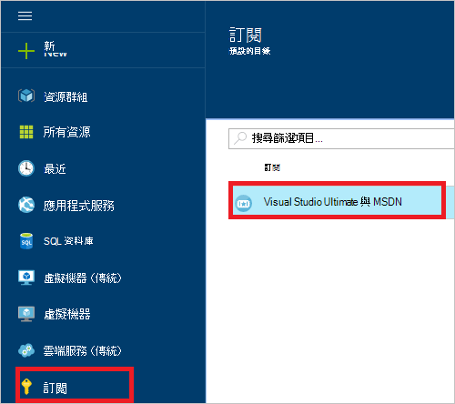
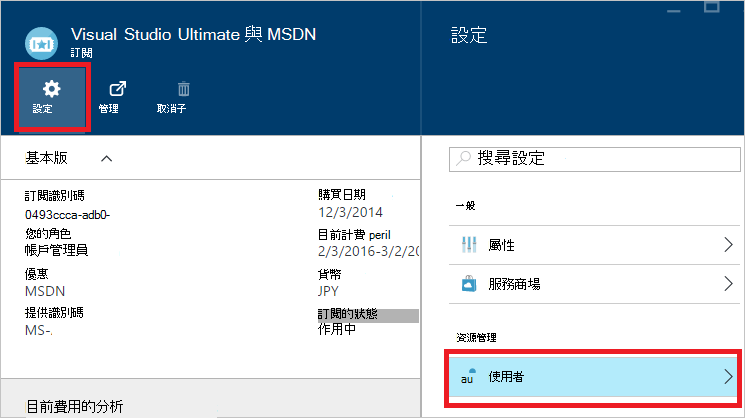
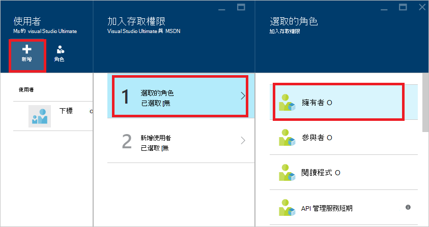
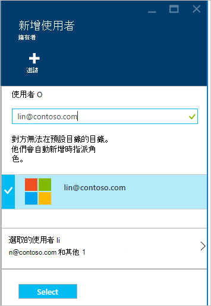
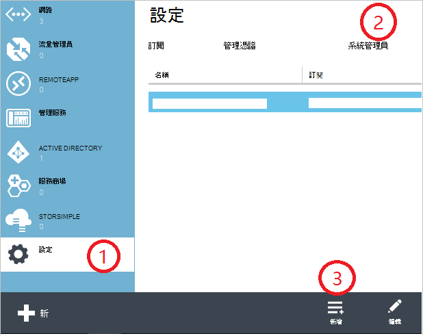
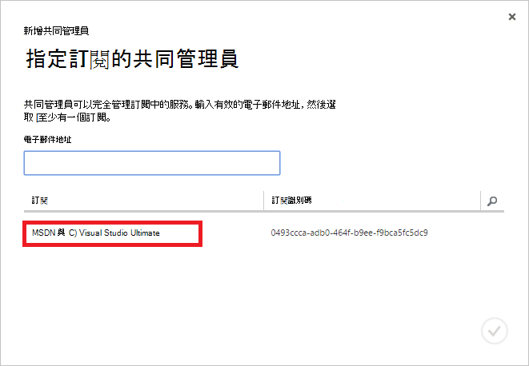
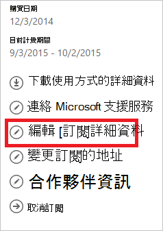
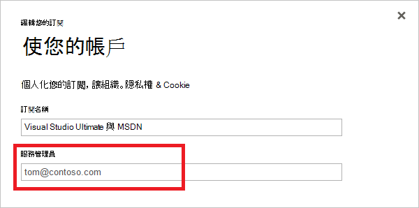

<properties
    pageTitle="如何新增或變更 Azure 管理員角色 |Microsoft Azure"
    description="說明如何新增或變更 Azure 共同管理員、 服務管理員與帳戶管理員"
    services=""
    documentationCenter=""
    authors="genlin"
    manager="mbaldwin"
    editor=""
    tags="billing"/>

<tags
    ms.service="billing"
    ms.workload="na"
    ms.tgt_pltfrm="na"
    ms.devlang="na"
    ms.topic="article"
    ms.date="08/17/2016"
    ms.author="genli"/>

# 如何新增或變更 Azure 管理員角色

有三種 Microsoft Azure 中的管理員角色︰

| 管理角色   | 限制  | 描述
| ------------- | ------------- |---------------|
|帳戶管理員 (AA)  | 1 每個 Azure 帳戶  |這是註冊或購買 Azure 訂閱]，並有權存取[帳戶中心](https://account.windowsazure.com/Home/Index)，並執行各種管理工作的人員。 包括能夠建立訂閱、 取消訂閱，變更訂閱的帳單和變更服務系統管理員。
| 服務管理員 (SA) | 1 每個 Azure 訂閱  |此角色為的權限管理[Azure 入口網站](https://portal.azure.com)中的服務。 根據預設，針對新的訂閱，帳戶管理員也是服務管理員。|
|[Azure 傳統入口網站](https://manage.windowsazure.com)中的共同管理員 (CA)|每個訂閱的 200| 此角色具有相同的存取權限以服務系統管理員身分，但無法變更 Azure 目錄訂閱的關聯。 |

> [AZURE.NOTE] Azure Active Directory 的角色型存取控制 (RBAC) 可讓使用者新增至多個的角色。 如需詳細資訊，請參閱[Azure Active Directory 的角色型存取控制](./active-directory/role-based-access-control-configure.md)。

> [AZURE.NOTE] 如果您需要更多協助，這份文件中的任何點，請[連絡支援部門](https://portal.azure.com/?#blade/Microsoft_Azure_Support/HelpAndSupportBlade)以取得您的問題已解決快速。

## 如何新增訂閱的管理員

**Azure 入口網站**

1. [Azure 入口網站](https://portal.azure.com)登入。

2. 在中樞] 功能表中，選取 [**訂閱** > *您想要存取系統的訂閱*。

    

3. 在訂閱刀中，選取 [**設定**> **使用者**。

    
4. 在使用者刀中，選取 [**新增**>**選取角色** > **擁有者**。

    

    **附註**
    - 擁有者角色具有共同管理員相同的存取權限。 此角色沒有[Azure 帳戶管理中心](https://account.windowsazure.com/subscriptions)的存取權限。
    - 您新增透過[Azure 入口網站](https://portal.azure.com)擁有者無法管理[Azure 傳統入口網站](https://manage.windowsazure.com)中的服務。  

5. 輸入您要新增為 [擁有者按一下 [使用者]，再按一下 [**選取**使用者的電子郵件地址。

    

**Azure 傳統入口網站**

1. [Azure 傳統入口網站](https://manage.windowsazure.com/)登入。

2. 在功能窗格] 中選取 [**設定**> **管理員**> **新增**。  

    

3. 輸入您想要新增為共同管理員]，然後選取 [您想要共同的系統管理員，以存取訂閱人員的電子郵件地址。 

     

可以共同管理員的身分新增下列電子郵件地址︰

* **Microsoft 帳戶**（前稱為 Windows Live ID)  
 您可以使用 Microsoft 帳戶登入所有消費者導向 Microsoft 產品和雲端服務，例如 Outlook (Hotmail)、 Skype (MSN)、 OneDrive、 Windows Phone 和 Xbox LIVE。
* **組織帳戶** 
 組織的帳戶是 Azure Active Directory 下會建立帳戶。 組織帳戶地址類似下列︰ user@&lt;您的網域&gt;。 onmicrosoft.com

### 限制和限制

 * 每個訂閱是 Azure AD 目錄 （也稱為預設目錄） 與相關聯。 若要尋找該訂閱已與相關聯的預設目錄，請移至[Azure 傳統入口網站](https://manage.windowsazure.com/)，請選取 [**設定** > **訂閱**。 核取訂閱 ID 到預設的目錄。

 * 如果您使用 Microsoft 帳戶登入，您僅可以共同的系統管理員身分上新增其他的 Microsoft 帳戶或預設的目錄中的使用者。

 * 如果您使用組織帳戶登入，您可以新增共同管理員為您組織中的其他組織的帳戶。 例如，abby@contoso.com可以新增bob@contoso.com服務管理員或共同管理員，但不能新增john@notcontoso.com除非john@noncontoso.com是預設的目錄中的使用者。 新增 Microsoft 帳戶使用者，以服務系統管理員或共同管理員，可以繼續使用組織帳戶登入的使用者。

 * 現在，就能使用組織帳戶登入 Azure，以下是服務管理員和共同的系統管理員帳戶的需求所做的變更︰

    登入方法| 新增 Microsoft 帳戶或預設的目錄中的使用者為 CA 或索嗎？  |新增與 CA 或索相同組織中的組織帳戶？ |新增與 CA 或索不同的組織中的組織帳戶？
    ------------- | ------------- |---------------|---------------
    Microsoft 帳戶 |[是]|無|無
    組織帳戶|[是]|[是]|無

## 如何變更訂閱的服務管理員

只有帳戶管理員可以變更訂閱服務系統管理員。

1. 使用系統管理員帳戶登入至[Azure 帳戶中心](https://account.windowsazure.com/subscriptions)。

2. 選取您想要變更的訂閱。

3. 在右側，按一下 [**編輯訂閱**詳細資料。  

    

4. 在 [**服務管理員**] 方塊中，輸入電子郵件地址的新服務系統管理員。  

    

## 如何變更帳戶管理員

要傳送的 Azure 帳戶擁有權另一個帳戶，請參閱[Azure 訂閱轉接擁有權](billing-subscription-transfer.md)。

## 後續步驟

* 若要進一步瞭解如何在 Microsoft Azure 中控制資源存取權，請參閱[Azure 中的存取瞭解資源](./active-directory/active-directory-understanding-resource-access.md)

* 如需有關 Azure Active Directory 如何與 Azure 訂閱相關聯的詳細資訊，請參閱[如何 Azure 訂閱的 Azure Active Directory 與相關聯](./active-directory/active-directory-how-subscriptions-associated-directory.md)

* 如需有關 Azure Active Directory 如何與 Azure 訂閱相關聯的詳細資訊，請參閱[Azure Active Directory 中的指派管理員角色](./active-directory/active-directory-assign-admin-roles.md)

> [AZURE.NOTE] 如果您仍有更進一步的問題，請[連絡支援部門](https://portal.azure.com/?#blade/Microsoft_Azure_Support/HelpAndSupportBlade)以取得您的問題已解決快速。
