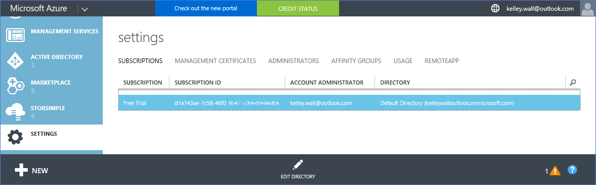

<properties
    pageTitle="使用 Office 365 租用戶以 Azure 訂閱 |Microsoft Azure"
    description="瞭解如何新增 Office 365 目錄 （租用戶），讓關聯 Azure 訂閱。"
    services=""
    documentationCenter=""
    authors="JiangChen79"
    manager="mbaldwin"
    editor=""
    tags="billing,top-support-issue"/>

<tags
    ms.service="billing"
    ms.workload="na"
    ms.tgt_pltfrm="ibiza"
    ms.devlang="na"
    ms.topic="article"
    ms.date="09/16/2016"
    ms.author="cjiang"/>

# 建立 Office 365 租用戶以 Azure 訂閱之間的關聯
如果您取得 Azure 和 Office 365 訂閱分別過去，且現在想要將無法從 Azure 訂閱存取 Office 365 租用戶，您可以輕鬆執行此作業。 本文將示範如何。

> [AZURE.NOTE] 本文內容不適用於 Enterprise 合約 (EA) 客戶。

## 快速指引
若要建立您的 Office 365 租用戶 Azure 訂閱之間的關聯，使用 Azure 帳戶新增您的 Office 365 租用戶，並與 Office 365 租用戶，然後建立關聯 Azure 訂閱。

## 詳細的步驟
在這個案例中，Kelley 牆是具有的帳號] 之下的 Azure 訂閱的使用者kelley.wall@outlook.com。 Kelley 也有 Office 365 訂閱的帳戶kelley.wall@contoso.onmicrosoft.com。 現在 Kelley 想要存取與 Azure 訂閱的 Office 365 租用戶。

### 必要條件
才能正常運作的關聯，下列先決條件所需的︰

- 您需要資訊，請參閱 Azure 訂閱的服務系統管理員的認證。 共同管理員無法執行步驟的子集合。
- 您需要 Office 365 租用戶的全域管理員的認證。
- 在 Office 365 租用戶中都必須不包含服務系統管理員的電子郵件地址。
- 服務系統管理員的電子郵件地址不相符的 Office 365 租用戶的任何全域管理員。
- 如果您目前正在使用 Microsoft 帳戶和組織帳戶的電子郵件地址，暫時變更 Azure 訂閱服務系統管理員，使用另一個 Microsoft 帳戶。 您可以建立新的 Microsoft 帳戶的[Microsoft 帳戶註冊] 頁面上](https://signup.live.com/)。

若要變更您的服務系統管理員，請遵循下列步驟︰

1. 登入[帳戶管理入口網站](https://account.windowsazure.com/subscriptions)。
2. 選取您想要變更的訂閱。
3. 選取 [**編輯訂閱詳細資料**]。

    ![醒目提示 [「 編輯訂閱明細] 的螢幕擷取畫面的 Azure 訂閱資訊](./media/billing-add-office-365-tenant-to-azure-subscription/s33_azure-edit-subscription-details.png)

4. 在 [**服務管理員**] 方塊中，輸入新的服務系統管理員的電子郵件地址。

    ![「 編輯您的訂閱 」] 對話方塊的螢幕擷取畫面](./media/billing-add-office-365-tenant-to-azure-subscription/s34_change-subscription-service-admin.png)

### 建立 Office 365 租用戶 Azure 訂閱之間的關聯
若要建立 Office 365 租用戶 Azure 訂閱之間的關聯，請遵循下列步驟︰

1.  登入[帳戶管理入口網站](https://account.windowsazure.com/subscriptions)使用服務的系統管理員認證。
2.  在左窗格中，選取 [ **ACTIVE DIRECTORY**]。

    

    > [AZURE.NOTE] 您不會看到 Office 365 租用戶。 如果您看到它，略過的下一個步驟。

    

3. 新增 Azure 訂閱的 Office 365 租用戶。

    。 選取 [**新增** > **目錄** > **自訂的建立**。

    

    b。 在 [**新增目錄**] 頁面的 [**目錄**] 下方選取 [**使用現有的目錄**。 選取 [**我已經準備好現在已登出**，然後選取 [**完成**。

    

    c。 您已登出之後，請使用您的 Office 365 租用戶的全域管理員認證登入。

    

    d。 選取 [**繼續**]。

    

    e。 選取 [**立即登出**]。

    

    f。 登入[帳戶管理入口網站](https://account.windowsazure.com/subscriptions)使用服務的系統管理員認證。

    

    g。 您應該會看到您的 Office 365 租用戶，在儀表板中。

    

4. 變更與 Azure 訂閱相關聯的目錄。

    。 選取 [**設定**]。

    ![螢幕擷取畫面的 Azure 傳統的入口網站設定] 圖示](./media/billing-add-office-365-tenant-to-azure-subscription/s315_azure-classic-portal-settings-icon.png)

    b。 選取您 Azure 的訂閱，然後選取 [**編輯目錄**。
    

    c。 選取 [**下一步**。

    

    > [AZURE.WARNING] 您會收到警告，將會移除所有的共同管理員。

    

    >[AZURE.WARNING] 此外，也會移除所有現有的 [資源] 群組中的已指派存取[角色型存取控制 (RBAC)](./active-directory/role-based-access-control-configure.md)使用者。 不過，您會收到警告只提及共同管理員的移除。

    

    d。 選取 [**完成**。

5. 現在您可以新增共同管理員為您的 Office 365 組織帳戶 Azure Active Directory 租用戶。

    。 選取 [**管理員**] 索引標籤，然後再選取 [**新增**]。

    ![螢幕擷取畫面的 Azure 傳統的入口網站設定管理員] 索引標籤](./media/billing-add-office-365-tenant-to-azure-subscription/s319_azure-classic-portal-settings-administrators.png)

    b。 輸入您的 Office 365 租用戶的組織帳戶，選取 Azure 的訂閱，然後選取**完成**。

    ![螢幕擷取畫面的 Azure 新增共同管理員] 對話方塊](./media/billing-add-office-365-tenant-to-azure-subscription/s320_azure-add-co-administrator.png)

    c。 回到 [**管理員**] 索引標籤。 您應該會看到顯示為共同的系統管理員的組織帳戶。

    ![系統管理員] 索引標籤的螢幕擷取畫面](./media/billing-add-office-365-tenant-to-azure-subscription/s321_azure-co-administrator-added.png)

6. 接下來，您可以與共同管理員測試存取。

    。 登出帳戶管理入口網站。

    b。 開啟[帳戶管理入口網站](https://account.windowsazure.com/subscriptions)或[Azure 入口網站](https://portal.azure.com/)。

    c。 如果 Azure 登入頁面的連結的**登入您的組織帳戶**，請選取連結。 否則，略過此步驟。

    

    d。 輸入共同管理員的認證，然後再選取 [**登入**。

    

## 後續步驟
相關的情況包括︰

- 您已有 Office 365 訂閱，並準備好的 Azure 的訂閱，但您想要使用現有的 Office 365 使用者帳戶 Azure 訂閱。
- 您是 Azure 訂閱者，而且想要在您現有的 Azure Active Directory 執行個體中取得 Office 365 訂閱的使用者。

若要瞭解如何完成這些工作，請參閱[的使用您現有的 Office 365 帳戶的 Azure 訂閱，或反向操作](billing-use-existing-office-365-account-azure-subscription.md)。
